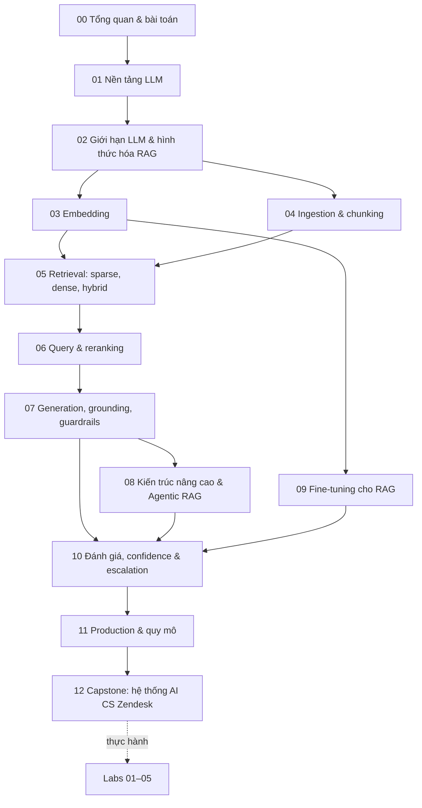

# Module 00 — Tổng quan khóa học và bài toán xuyên suốt

> Thời lượng: ~20 phút · Mức độ: Nhập môn · Tiên quyết: không

## Mục tiêu học tập

- Hiểu bài toán thực tế mà toàn bộ khóa học xoay quanh: **AI trả lời email khách hàng qua Zendesk và biết lúc nào phải gọi người**.
- Nắm bản đồ kiến thức từ LLM nền tảng → RAG cơ bản → kỹ thuật cải tiến → đánh giá → hệ thống production.
- Biết module nào trả lời câu hỏi thiết kế nào, để đọc có chủ đích thay vì đọc tuần tự một cách thụ động.
- Có lịch học ~8–9 giờ và cách tự kiểm tra sau mỗi module.

## 1. Bài toán: một ticket nội bộ rất ngắn, một hệ thống rất dài

Ticket xuất phát điểm của khóa học chỉ có hai dòng mô tả:

1. **AI trả lời email cho khách hàng thông qua Zendesk.**
2. **AI thông báo cho team CS vào xử lý khi khách hàng có yêu cầu, hoặc khi AI tự đánh giá cần người can thiệp.**

Kèm theo là hai subtask: **Technical** và **Business**. Ticket nhìn thì đơn giản, nhưng mỗi cụm từ trong đó che giấu một nhóm vấn đề kỹ thuật lớn:

| Cụm từ trong ticket | Câu hỏi kỹ thuật thật sự | Module trả lời |
|---|---|---|
| "AI trả lời" | LLM sinh văn bản thế nào, vì sao nó bịa, làm sao bắt nó chỉ nói điều có căn cứ? | 01, 02, 07 |
| "tư vấn sản phẩm" | Tri thức sản phẩm nằm ở đâu (Help Center, macro, ticket cũ, docs), đưa vào model bằng cách nào? | 02, 03, 04 |
| "email" | Email có quoted reply, chữ ký, nhiều câu hỏi trong một thư, nhiều ngôn ngữ, đính kèm, và có thể chứa prompt injection | 04, 06, 07 |
| "thông qua Zendesk" | Webhook, trigger, internal note vs public reply, rate limit, idempotency | 11, 12 |
| "khách hàng có yêu cầu" | Phát hiện ý định "muốn gặp người", chủ đề nhạy cảm (hoàn tiền, giá, pháp lý) | 07, 10, 12 |
| "AI tự đánh giá cần người" | Đo độ tự tin có hiệu chuẩn, chọn ngưỡng theo chi phí lỗi | **10** (trọng tâm), 08 |
| "thông báo cho team CS" | Thiết kế luồng human-in-the-loop, Slack/email, đổi group/tag, tóm tắt cho agent | 12 |
| Subtask "Technical" / "Business" | Kiến trúc, rollout theo giai đoạn, KPI (FRT, deflection, CSAT, tỷ lệ sửa draft) | 10, 11, 12 |

Điểm mấu chốt: **đây không phải là bài toán "dựng một chatbot RAG"**. Nó là tổ hợp của ba bài toán:

$$
\text{Hệ thống} = \underbrace{\text{Phân loại}}_{\text{intent, ngôn ngữ, rủi ro}} \;+\; \underbrace{\text{RAG}}_{\text{soạn trả lời có căn cứ}} \;+\; \underbrace{\text{Quyết định}}_{\text{gửi / để draft / chuyển người}}
$$

Phần thứ ba thường bị xem nhẹ, trong khi nó quyết định hệ thống có dám chạy tự động hay không. Vì vậy khóa học dành hẳn một phần lớn của Module 10 cho **confidence và escalation**.

<!-- fig:three-subproblems -->
<figure markdown="span">
  { loading=lazy }
  { loading=lazy }
  <figcaption>Hình 0.1 — Bài toán của khóa học là tổ hợp ba bài toán con; đầu ra cuối cùng là một trong ba quyết định SEND / DRAFT / ESCALATE.</figcaption>
</figure>
<!-- /fig -->

## 2. Giả định quy mô dùng xuyên suốt

Để mọi phép tính trong khóa học nhất quán, ta cố định một kịch bản giả định (con số để học, không phải số liệu thật của công ty nào):

- Doanh nghiệp SaaS B2B, khách hàng Việt Nam, Nhật và quốc tế → email **tiếng Việt, tiếng Anh, tiếng Nhật**, thường lẫn ngôn ngữ.
- ~**1.500 ticket mới/ngày**, giờ cao điểm gấp ~3 lần trung bình; mỗi ticket 3–4 lượt trao đổi.
- Kho tri thức: ~**800 bài Help Center**, ~**300 macro**, ~**200.000 ticket đã giải quyết**, tài liệu sản phẩm/API, release notes, chính sách giá/hoàn tiền/SLA. Một phần thay đổi hằng tuần.
- Ràng buộc cứng: không bịa chính sách, không lộ dữ liệu khách khác, có PII, email có thể chứa prompt injection.
- Rollout an toàn: **giai đoạn 1** AI chỉ viết draft dưới dạng internal note cho agent duyệt → **giai đoạn 2** tự gửi với nhóm intent rủi ro thấp → mở rộng dần theo số liệu.

<!-- fig:rollout-stages -->
<figure markdown="span">
  { loading=lazy }
  { loading=lazy }
  <figcaption>Hình 0.2 — Lộ trình rollout từ draft cho agent duyệt tới tự gửi có chọn lọc.</figcaption>
</figure>
<!-- /fig -->

Một phép tính nhanh để cảm nhận quy mô (chi tiết ở Module 11): 1.500 ticket × ~3,5 lượt ≈ 5.250 lần sinh trả lời/ngày. Nếu mỗi lần gửi vào model ~6.000 token context và nhận ~400 token đầu ra, ta có khoảng 31,5 triệu token đầu vào và 2,1 triệu token đầu ra mỗi ngày. Con số này đủ lớn để chi phí, caching và việc chọn model trở thành quyết định thiết kế chứ không còn là chi tiết.

<!-- fig:scale-at-a-glance -->
<figure markdown="span">
  { loading=lazy }
  { loading=lazy }
  <figcaption>Hình 0.3 — Phép tính quy mô của mục 2: từ số ticket mỗi ngày đến lưu lượng token.</figcaption>
</figure>
<!-- /fig -->

## 3. Bản đồ kiến thức

Có thể chia khóa học thành bốn tầng:

1. **Nền móng (01–02):** LLM là gì ở cấp độ toán (attention, RoPE, cross-entropy, decoding, DPO) và vì sao một LLM tốt vẫn cần retrieval.
2. **Pipeline RAG cốt lõi (03–07):** biểu diễn → chuẩn bị dữ liệu → tìm kiếm → tinh chỉnh kết quả tìm kiếm → sinh câu trả lời có căn cứ và an toàn.
3. **Nâng cao (08–10):** kiến trúc nhiều bước/agentic, huấn luyện chuyên biệt, và đo lường để ra quyết định.
4. **Hệ thống (11–12):** chạy ở quy mô thật, chi phí, bảo mật, và lắp tất cả lại thành bản thiết kế có thể triển khai.

## 4. Cách học khóa này

### Lịch gợi ý (~8–9 giờ)

| Buổi | Nội dung | Thời lượng |
|---|---|---|
| 1 | Module 00, 01 | ~75' |
| 2 | Module 02, 03 | ~85' |
| 3 | Module 04, 05 | ~95' |
| 4 | Module 06, 07 + Lab 01, 03 | ~110' |
| 5 | Module 08, 09 | ~95' |
| 6 | Module 10 + Lab 02, 05 | ~80' |
| 7 | Module 11, 12 + Lab 04 | ~135' |

### Cách đọc mỗi module

1. Đọc **Mục tiêu học tập** và tự hỏi: mình đã trả lời được câu nào chưa?
2. Với mỗi công thức: đọc định nghĩa ký hiệu → **tự tính lại ví dụ số bằng tay** → chỉ khi khớp mới đọc tiếp.
3. Dừng ở mỗi khung "Liên hệ Zendesk" để nghĩ: quyết định này sẽ thay đổi thế nào nếu quy mô gấp 10, hoặc nếu dữ liệu chỉ có tiếng Nhật?
4. Làm **Câu hỏi tự kiểm tra** trước khi mở đáp án gợi ý.
5. Chọn ít nhất một **Bài tập thực hành** mỗi module; các lab trong thư mục `labs/` chạy được trên GPU 6 GB hoặc CPU.

### Ba câu hỏi nên mang theo suốt khóa học

1. **"Nếu bước này sai thì hậu quả là gì, và ai phát hiện?"** Mỗi thành phần đều có failure mode; một hệ thống tốt là hệ thống mà lỗi bị bắt trước khi tới khách hàng.
2. **"Làm sao mình đo được nó?"** Một cải tiến không có số liệu trước/sau thì chưa phải cải tiến (Module 10).
3. **"Cách đơn giản nhất có đủ không?"** Rất nhiều câu hỏi CS là FAQ; hybrid search + rerank + prompt tốt thường thắng một kiến trúc agent phức tạp (Module 08, mục "khi nào đáng phức tạp hóa").

## 5. Từ khóa học tới dự án thật

Khóa học được viết để dùng trực tiếp cho hai việc:

- **Subtask Technical của ticket:** Module 12 chứa kiến trúc, luồng xử lý một ticket end-to-end, đồ thị LangGraph, code khung FastAPI nhận webhook Zendesk, chính sách escalation và roadmap 8–10 tuần.
- **Dự án nền tảng LLM với mentor:** vLLM (Module 11), FastAPI với healthcheck/log/observability (Module 11, Lab 04), LangGraph harness và evaluation harness (Module 08, 10), MCP làm lớp tool (Module 08).

## Tóm tắt

- Bài toán = **phân loại + RAG + quyết định escalate**; phần quyết định là phần khó nhất và quan trọng nhất.
- Mọi phép tính dùng chung một kịch bản: 1.500 ticket/ngày, 3 ngôn ngữ, ~200k ticket lịch sử, rollout từ draft đến tự động.
- Đi từ nền móng → pipeline → nâng cao → hệ thống; mỗi module có toán, ví dụ số, liên hệ Zendesk, câu hỏi và bài tập.

## Câu hỏi tự kiểm tra

1. Vì sao không nên để AI tự gửi email ngay từ ngày đầu triển khai?

    

Gợi ý

    Chưa có số liệu về chất lượng và độ hiệu chuẩn của confidence trên dữ liệu thật. Giai đoạn draft cho phép đo tỷ lệ agent phải sửa, tỷ lệ lỗi theo intent, và chọn ngưỡng tự động gửi dựa trên bằng chứng (Module 10, 12).

    

2. Kể ba lý do khiến "AI tự đánh giá cần người can thiệp" khó hơn phát hiện "khách hàng muốn gặp người".

    

Gợi ý

    (1) Yêu cầu gặp người là tín hiệu tường minh trong văn bản, còn "cần người" là đánh giá về chính đầu ra của model; (2) LLM thường tự tin quá mức nên điểm tự tin thô không đáng tin, cần hiệu chuẩn; (3) ngưỡng phụ thuộc chi phí lỗi khác nhau theo intent (sai chính sách hoàn tiền đắt hơn nhiều so với trả lời chậm).

    

3. Với giả định ở mục 2, nếu context trung bình tăng từ 6.000 lên 12.000 token, lượng token đầu vào mỗi ngày thay đổi ra sao?

    

Gợi ý

    Tăng gấp đôi, từ ~31,5 triệu lên ~63 triệu token/ngày. Đây là lý do reranking, nén context và prompt caching (Module 06, 11) có giá trị kinh tế trực tiếp.

    

## Tài liệu tham khảo

- Gao et al., *Retrieval-Augmented Generation for Large Language Models: A Survey*, 2023, arXiv:2312.10997.
- Lewis et al., *Retrieval-Augmented Generation for Knowledge-Intensive NLP Tasks*, NeurIPS 2020, arXiv:2005.11401.
- Zendesk Developer Docs: https://developer.zendesk.com/api-reference/
