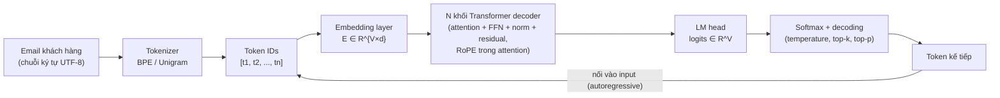
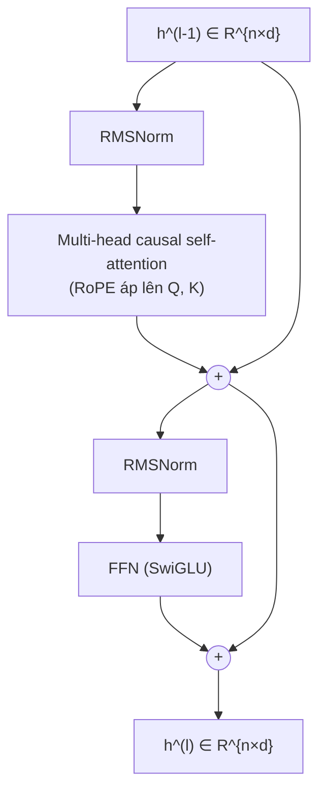
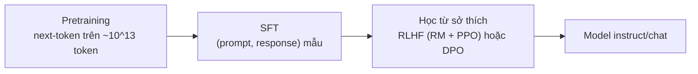

# Module 01 — Nền tảng LLM

> Thời lượng: ~55 phút · Mức độ: Trung bình → Nâng cao · Tiên quyết: Module 00; đại số tuyến tính (nhân ma trận, tích vô hướng), xác suất (kỳ vọng, phương sai, log-likelihood)

Module này trả lời câu hỏi: **khi hệ thống AI tư vấn Zendesk gửi email của khách vào LLM, chuyện gì xảy ra bên trong?** Ta đi từ ký tự → token → vector → các lớp Transformer → phân phối xác suất → cách chọn token → cách model được dạy để "nghe lời". Chỉ giới thiệu ở đây, đi sâu ở module khác: KV cache và serving (Module 11), giới hạn LLM và RAG (Module 02), logprob cho confidence/escalation (Module 10), LoRA/QLoRA (Module 09), constrained decoding (Module 07).

## Mục tiêu học tập

Sau module này, bạn có thể:

1. Mô phỏng tay BPE, giải thích và **đo** vì sao tiếng Việt/Nhật tốn nhiều token hơn tiếng Anh, ước lượng ảnh hưởng lên chi phí/context của hệ thống Zendesk.
2. Tính tay self-attention có causal mask; chứng minh lý do chia $\sqrt{d_k}$; đếm tham số một khối decoder kiểu Llama.
3. Chứng minh tính tương đối của RoPE và giải thích ý tưởng PI, NTK-aware, YaRN.
4. Dẫn xuất gradient cross-entropy, tính perplexity, dùng công thức Chinchilla ước lượng loss/số token tối ưu.
5. Chọn cấu hình decoding (temperature, top-k, top-p) cho từng bước pipeline Zendesk và lấy được logprob.
6. Dẫn xuất loss DPO từ bài toán RLHF có ràng buộc KL; giải thích vai trò SFT, reward model Bradley–Terry, PPO.



---

## 1. Tokenization — LLM không đọc chữ, nó đọc token

### 1.1 Vấn đề tokenization giải quyết

Mạng nơ-ron làm việc với số. Ta cần một ánh xạ từ chuỗi ký tự sang dãy số nguyên (token ID) thuộc một **từ vựng** (vocabulary) kích thước $V$ cố định. Ba lựa chọn hiển nhiên đều có vấn đề:

| Đơn vị | Ưu điểm | Nhược điểm |
|---|---|---|
| **Từ** (word) | Chuỗi ngắn, mỗi đơn vị có nghĩa | Từ vựng bùng nổ (tiếng Việt có hàng chục nghìn âm tiết × tổ hợp từ ghép, cộng tên sản phẩm, mã lỗi `ERR_4031`...), từ ngoài từ vựng (OOV) phải thay bằng `<unk>` → mất thông tin |
| **Ký tự / byte** | Không bao giờ OOV, $V$ nhỏ (256 byte) | Chuỗi rất dài → attention tốn $O(n^2)$, mỗi bước chỉ sinh được 1 byte → chậm và đắt |
| **Subword** | Cân bằng: từ phổ biến là 1 token, từ hiếm tách thành nhiều mảnh | Phải *học* cách tách từ dữ liệu; số token phụ thuộc mạnh vào ngôn ngữ trong dữ liệu huấn luyện tokenizer |

Mọi LLM hiện đại dùng subword, với hai họ thuật toán chính: **BPE** (Byte-Pair Encoding) và **Unigram Language Model**.

### 1.2 BPE — gộp cặp phổ biến nhất, lặp lại

**Ý tưởng.** Bắt đầu từ từ vựng gồm các ký tự (hoặc byte). Lặp lại: đếm tần suất mọi cặp ký hiệu kề nhau trong corpus, gộp cặp phổ biến nhất thành một ký hiệu mới, thêm vào từ vựng. Dừng khi đạt $V$ mong muốn. BPE vốn là thuật toán nén dữ liệu, được Sennrich, Haddow & Birch (2016) đưa vào dịch máy để xử lý từ hiếm.

**Hình thức hóa.** Gọi corpus là multiset các từ $w$ với tần suất $c(w)$. Mỗi từ được biểu diễn hiện tại là dãy ký hiệu $s(w) = (s_1, \dots, s_m)$. Tại mỗi vòng:

$$
(a^*, b^*) = \arg\max_{(a,b)} \sum_{w} c(w) \cdot \#\{i : s_i = a,\ s_{i+1} = b \text{ trong } s(w)\}
$$

rồi thay mọi lần xuất hiện của cặp $(a^*, b^*)$ bằng ký hiệu mới $a^*b^*$. Danh sách các phép gộp theo thứ tự chính là "mô hình" BPE; khi tokenize văn bản mới, ta áp các phép gộp theo đúng thứ tự đã học.

**Ví dụ tính tay.** Corpus nhỏ gồm các âm tiết hay gặp trong ticket hoàn tiền (thêm ký hiệu kết thúc từ `</w>`):

| Từ | Tần suất | Dãy ký hiệu ban đầu |
|---|---|---|
| hoàn | 5 | h o à n `</w>` |
| hoàng | 3 | h o à n g `</w>` |
| toàn | 4 | t o à n `</w>` |
| tiền | 6 | t i ề n `</w>` |
| tiếng | 2 | t i ế n g `</w>` |

Vòng 1 — đếm cặp. Cặp `(n, </w>)` xuất hiện trong *hoàn* (5), *toàn* (4), *tiền* (6) → $5+4+6 = 15$. Cặp `(o, à)` xuất hiện trong *hoàn, hoàng, toàn* → $5+3+4=12$. Cặp `(à, n)` cũng $12$. Cặp `(h, o)`: $5+3=8$; `(t, i)`: $6+2=8$. Gộp cặp lớn nhất `n</w>`.

Vòng 2 — sau gộp, `(o, à)` = 12 lớn nhất → tạo `oà`.

Vòng 3 — `(oà, n</w>)` = 5 + 4 = 9 → tạo `oàn</w>`. Lúc này *hoàn* = `h · oàn</w>`, *toàn* = `t · oàn</w>`.

Vòng 4 — `(t, i)` = 8 → `ti`. Vòng 5 — `(ti, ề)` = 6 → `tiề`, và *tiền* = `tiề · n</w>`.

Sau 5 phép gộp, *hoàn* từ 5 ký hiệu còn 2, *tiền* từ 5 còn 2, còn *tiếng* (hiếm hơn) vẫn là `ti · ế · n · g · </w>` = 5 ký hiệu. Đây chính là bản chất của BPE: **thứ gì phổ biến trong dữ liệu huấn luyện tokenizer thì rẻ, thứ gì hiếm thì đắt.** Nếu tokenizer được huấn luyện chủ yếu trên tiếng Anh, toàn bộ tiếng Việt rơi vào vùng "hiếm".

**Byte-level BPE.** GPT-2 (Radford et al., 2019) chạy BPE trên *byte* UTF-8 thay vì ký tự Unicode: từ vựng khởi đầu đúng 256 phần tử, không bao giờ có OOV. Các tokenizer họ `tiktoken` (cl100k_base, o200k_base), tokenizer của Llama 3, Qwen đều là byte-level BPE. Hệ quả quan trọng: một ký tự tiếng Việt có dấu chiếm 2–3 byte, một ký tự kana/kanji chiếm 3 byte; nếu chưa có phép gộp phù hợp, mỗi byte có thể thành một token riêng.

### 1.3 Unigram Language Model — tách theo xác suất

Kudo (2018) đề xuất hướng ngược lại: bắt đầu với một từ vựng *lớn* (mọi substring phổ biến), rồi **tỉa bớt**. Mô hình giả định mỗi token độc lập với xác suất $p(x)$, $\sum_{x \in \mathcal{V}} p(x) = 1$. Với một câu $X$, mỗi cách tách $\mathbf{x} = (x_1, \dots, x_M)$ có xác suất

$$
P(\mathbf{x}) = \prod_{i=1}^{M} p(x_i),
$$

và tokenization được chọn là cách tách có xác suất cao nhất, tìm bằng **Viterbi** (quy hoạch động trên các vị trí cắt, $O(n \cdot L_{\max})$ với $L_{\max}$ là độ dài token dài nhất):

$$
\mathbf{x}^* = \arg\max_{\mathbf{x} \in S(X)} \sum_{i} \log p(x_i).
$$

Huấn luyện: tối đa hóa log-likelihood biên của corpus $\mathcal{L} = \sum_{s} \log \sum_{\mathbf{x} \in S(X^{(s)})} P(\mathbf{x})$ bằng EM (ước lượng $p(x)$), sau đó với mỗi token tính mức giảm $\mathcal{L}$ nếu bỏ nó đi, loại bỏ khoảng 10–30% token "ít đóng góp" nhất, lặp lại đến khi đạt $V$.

**Ví dụ nhỏ.** Giả sử $p(\text{đăng}) = p(\text{nhập}) = 0.02$, $p(\text{▁đăngnhập}) = 0.001$. Tách `[đăng, nhập]` có log-prob $2\ln 0.02 = -7.82$; tách `[▁đăngnhập]` có $\ln 0.001 = -6.91$ → thắng. Unigram tự nhiên ưu tiên ít mảnh nếu các mảnh đủ phổ biến; và vì có phân phối trên nhiều cách tách, có thể lấy mẫu cách tách khác nhau khi huấn luyện (subword regularization) để model bền hơn với lỗi chính tả.

**SentencePiece** (Kudo & Richardson, 2018) là thư viện cài đặt cả BPE lẫn Unigram, xử lý văn bản thô như chuỗi Unicode (khoảng trắng được mã hóa thành ký hiệu `▁`), không cần tách từ trước — rất hợp với tiếng Nhật (không có khoảng trắng) và tiếng Việt (khoảng trắng tách *âm tiết*, không tách *từ*). T5, Llama 1/2, Gemma dùng SentencePiece; Llama 3 trở đi chuyển sang byte-level BPE kiểu tiktoken.

### 1.4 Tokenization và tiếng Việt / tiếng Nhật: chuyện tiền thật

**Unicode trước đã.** Chữ "tiền" có thể được lưu ở hai dạng chuẩn hóa:

| Dạng | Code points | Số byte UTF-8 |
|---|---|---|
| NFC (dựng sẵn): `t i ề n` với `ề` = U+1EC1 | 4 | 6 |
| NFD (tổ hợp): `t i e ◌̂ ◌̀ n` | 6 | 8 |

Với byte-level BPE, hai dạng này cho **dãy token khác nhau**, mà model chủ yếu thấy dạng NFC lúc huấn luyện. Email gửi từ một số client trên macOS hoặc copy từ PDF có thể ra NFD → nhiều token hơn, embedding lệch, BM25 không khớp. Bài học: luôn chuẩn hóa NFC trước khi đưa vào tokenizer/embedding/BM25 (chi tiết pipeline làm sạch ở Module 04).

Tiếng Nhật: "ログインできません" (không đăng nhập được) gồm 9 ký tự nhưng 27 byte UTF-8. Tokenizer có từ vựng tiếng Nhật tốt sẽ gộp `ログイン` thành 1–2 token; tokenizer nghèo tiếng Nhật có thể tốn gần 1 token/ký tự hoặc hơn.

**Số liệu.** Petrov et al. (2023) đo trên nhiều tokenizer và cho thấy cùng một nội dung (bản dịch song song) có thể dài hơn tiếng Anh tới hơn 15 lần token ở một số ngôn ngữ; họ gọi đây là "tokenization premium" và chỉ ra nó trực tiếp thành chênh lệch chi phí, độ trễ và lượng ngữ cảnh dùng được. Với tiếng Việt, các tokenizer đời mới đã cải thiện đáng kể. Một phép đo cộng đồng công bố tháng 9/2026 trên các cặp văn bản Anh–Việt tương đương (~230 từ) cho tỉ lệ token Việt/Anh khoảng **2,14×** với `cl100k_base` (GPT-3.5/GPT-4), **1,34×** với `o200k_base` (GPT-4o trở đi), **1,26×** với tokenizer Qwen2.5/Qwen3 và **1,88×** với DeepSeek-V3.2. Đây là một phép đo trên mẫu nhỏ, nên coi là *bậc độ lớn*, và tự đo lại trên ticket thật của bạn (Bài tập 1).

**Định nghĩa đo lường.** Gọi $T_\tau(x)$ là số token của văn bản $x$ dưới tokenizer $\tau$. Với cặp văn bản song song $(x_{vi}, x_{en})$:

$$
\text{premium}_\tau(vi) = \frac{\mathbb{E}\left[T_\tau(x_{vi})\right]}{\mathbb{E}\left[T_\tau(x_{en})\right]}
$$

Một chỉ số tiện hơn khi không có bản dịch song song là **fertility** = số token trung bình trên mỗi từ (hoặc mỗi âm tiết với tiếng Việt), hoặc **byte trên token**.

> **Liên hệ Zendesk — ngân sách token.** Giả định (để học): một email khách trung bình 250 từ tiếng Anh ≈ 330 token với o200k. Nếu là tiếng Việt với premium 1,34× → ~440 token; với tokenizer cũ 2,14× → ~700 token. Prompt RAG gồm system prompt (~800 token) + 5 chunk tri thức (~5 × 400 token) + lịch sử thread (3–4 lượt × ~400) + email hiện tại. Cùng một ticket, chọn model có tokenizer kém với tiếng Việt/Nhật có thể làm **chi phí input tăng 30–60%** và ăn mất chỗ của context retrieval. Khi so sánh giá giữa các nhà cung cấp, đừng so "giá/1M token" — hãy so "**giá/ticket** trên mẫu ticket thật đa ngôn ngữ của bạn".

### 1.5 Code: đo số token trên email đa ngôn ngữ

```python
# pip install tiktoken==0.8.* transformers  (tokenizer HF tải từ Hugging Face Hub)
import unicodedata
import tiktoken
from transformers import AutoTokenizer

emails = {
    "en": "Hello, I cannot log in to my account after changing my password. Could you help me reset it?",
    "vi": "Xin chào, tôi không thể đăng nhập vào tài khoản sau khi đổi mật khẩu. Bạn giúp tôi đặt lại được không?",
    "ja": "こんにちは。パスワードを変更した後、アカウントにログインできません。リセットを手伝っていただけますか？",
}

tokenizers = {
    "o200k_base": tiktoken.get_encoding("o200k_base"),
    "cl100k_base": tiktoken.get_encoding("cl100k_base"),
    "qwen2.5": AutoTokenizer.from_pretrained("Qwen/Qwen2.5-0.5B-Instruct"),
}

def count(tok, text: str) -> int:
    # tiktoken có .encode(text) -> list[int]; HF tokenizer cũng có .encode
    if isinstance(tok, tiktoken.Encoding):
        return len(tok.encode(text))
    return len(tok.encode(text, add_special_tokens=False))

for name, tok in tokenizers.items():
    base = count(tok, emails["en"])
    for lang, text in emails.items():
        n = count(tok, unicodedata.normalize("NFC", text))
        n_nfd = count(tok, unicodedata.normalize("NFD", text))
        print(f"{name:12s} {lang}: {n:4d} token (NFD: {n_nfd:4d}) | so với EN: {n/base:.2f}x")
```

Chạy trên CPU. Câu hỏi cần trả lời: tokenizer nào rẻ nhất cho *phân bố ngôn ngữ thực tế* của ticket, và NFD làm tăng bao nhiêu token?

### 1.6 Trade-off

- **$V$ lớn** (128K–256K): chuỗi ngắn hơn, đa ngôn ngữ tốt hơn; nhưng embedding và LM head ($V\times d$) phình to, token hiếm được huấn luyện ít.
- Không thể đổi tokenizer của model đã huấn luyện → tokenizer là **tiêu chí chọn model**, không phải tham số tinh chỉnh.
- Model không "thấy" ký tự nên hay sai khi chép mã định danh dài (`INV-2026-00871`). Trong Zendesk, trích xuất mã đơn/ticket ID/email bằng regex/code, không nhờ LLM chép lại.

---

## 2. Embedding layer và LM head

### 2.1 Từ token ID tới vector

Gọi $V$ là kích thước từ vựng, $d$ là chiều ẩn (hidden size, ví dụ 4096). Ma trận embedding $E \in \mathbb{R}^{V \times d}$. Token có ID $t$ được biểu diễn one-hot $\mathbf{e}_t \in \{0,1\}^V$ và vector đầu vào là

$$
\mathbf{x} = \mathbf{e}_t^\top E = E[t, :] \in \mathbb{R}^d.
$$

Nhân với one-hot chỉ là **tra bảng** (lookup) — cài đặt thực tế là `E[token_ids]`. Ma trận $E$ được học cùng toàn bộ model; các token có vai trò tương tự (ví dụ `refund`, `hoàn tiền`, `返金`) sẽ dần có vector gần nhau.

### 2.2 LM head và weight tying

Ở đầu ra, trạng thái ẩn cuối cùng $\mathbf{h}_n \in \mathbb{R}^d$ (của vị trí cuối) được chiếu sang **logits** trên toàn bộ từ vựng:

$$
\mathbf{z} = W_{\text{out}} \mathbf{h}_n \in \mathbb{R}^V, \qquad p(t \mid \text{ngữ cảnh}) = \mathrm{softmax}(\mathbf{z})_t = \frac{e^{z_t}}{\sum_{j=1}^V e^{z_j}}.
$$

Nhiều model dùng **weight tying**: $W_{\text{out}} = E$ (tức $z_t = E[t,:] \cdot \mathbf{h}_n$), tiết kiệm $V \cdot d$ tham số — với $V = 151{,}936$ (họ Qwen) và $d = 1024$ đó là ~155M tham số, chiếm phần lớn một model 0.5B. Model lớn thường không tie để tăng sức biểu diễn.

**Trực giác quan trọng cho cả khóa học:** $z_t$ là *tích vô hướng* giữa trạng thái ẩn và vector của token $t$. LLM sinh token là một phép "tìm kiếm tích vô hướng lớn nhất" trên từ vựng — cùng hình học với dense retrieval ở Module 03 và 05.

> **Liên hệ Zendesk.** Tên sản phẩm nội bộ, tên tính năng mới ra (chưa có trong dữ liệu huấn luyện) sẽ bị tách thành nhiều token hiếm có embedding "chưa học kỹ". Model vẫn chép lại được tên đó từ context (nhờ attention), nhưng không *biết* gì về nó. Đây là một lý do kỹ thuật cụ thể cho việc phải đưa tài liệu sản phẩm vào context bằng RAG (Module 02).

---

## 3. Transformer decoder-only

Một LLM hiện đại (GPT, Llama, Qwen, Gemma, Mistral, DeepSeek...) là chồng $N$ khối decoder giống nhau. Kiến trúc gốc của Vaswani et al. (2017) có cả encoder và decoder; các LLM sinh văn bản chỉ giữ phần decoder với **causal self-attention**.



### 3.1 Self-attention: mỗi token "hỏi" các token khác

**Vấn đề.** Nghĩa của một token phụ thuộc ngữ cảnh: "nó" trong "tôi cập nhật app rồi nhưng nó vẫn crash" chỉ "app". Ta cần một cơ chế để biểu diễn của mỗi vị trí *tổng hợp thông tin có chọn lọc* từ các vị trí khác.

**Trực giác.** Mỗi vị trí $i$ phát ra một **query** $\mathbf{q}_i$ ("tôi đang tìm gì"), mỗi vị trí $j$ có một **key** $\mathbf{k}_j$ ("tôi chứa gì") và một **value** $\mathbf{v}_j$ ("nếu được chọn thì tôi đóng góp gì"). Độ khớp $\mathbf{q}_i \cdot \mathbf{k}_j$ quyết định trọng số; đầu ra là trung bình có trọng số của các value. Đây là một phép *truy xuất mềm* (soft retrieval) — thật sự là họ hàng gần của RAG: RAG làm truy xuất cứng trên kho tài liệu ngoài, attention làm truy xuất mềm trên các token trong context.

**Toán.** Cho $X \in \mathbb{R}^{n \times d}$ ($n$ token). Với các ma trận học được $W_Q, W_K \in \mathbb{R}^{d \times d_k}$, $W_V \in \mathbb{R}^{d \times d_v}$:

$$
Q = XW_Q,\quad K = XW_K,\quad V = XW_V,
$$

$$
\mathrm{Attention}(Q,K,V) = \mathrm{softmax}\!\left(\frac{QK^\top}{\sqrt{d_k}} + M\right) V,
$$

trong đó softmax lấy theo từng hàng, và $M \in \mathbb{R}^{n\times n}$ là **causal mask**: $M_{ij} = 0$ nếu $j \le i$, $M_{ij} = -\infty$ nếu $j > i$. Viết theo phần tử:

$$
\alpha_{ij} = \frac{\exp(\mathbf{q}_i \cdot \mathbf{k}_j / \sqrt{d_k})}{\sum_{j' \le i} \exp(\mathbf{q}_i \cdot \mathbf{k}_{j'} / \sqrt{d_k})}, \qquad \mathbf{o}_i = \sum_{j \le i} \alpha_{ij} \mathbf{v}_j.
$$

**Ví dụ tính tay** ($n = 3$, $d_k = 2$). Để dễ tính, giả sử $Q = K = \begin{pmatrix}1&0\\0&1\\1&1\end{pmatrix}$ và $V = \begin{pmatrix}1&0\\0&2\\1&1\end{pmatrix}$.

Bước 1 — điểm thô $QK^\top / \sqrt{2}$ (với $1/\sqrt 2 \approx 0.707$):

$$
\frac{QK^\top}{\sqrt 2} = \begin{pmatrix} 0.707 & 0 & 0.707 \\ 0 & 0.707 & 0.707 \\ 0.707 & 0.707 & 1.414 \end{pmatrix}
$$

Bước 2 — áp causal mask (gạch phần trên đường chéo) rồi softmax từng hàng:
- Hàng 1: chỉ có $j=1$ → $\alpha_{1\cdot} = (1, 0, 0)$.
- Hàng 2: $\mathrm{softmax}(0, 0.707) = (e^0, e^{0.707})/(1 + 2.028) = (0.330, 0.670)$.
- Hàng 3: $\mathrm{softmax}(0.707, 0.707, 1.414)$: $e^{0.707} = 2.028$, $e^{1.414} = 4.113$, tổng $8.169$ → $(0.248, 0.248, 0.503)$.

Bước 3 — nhân với $V$:
- $\mathbf{o}_1 = (1, 0)$
- $\mathbf{o}_2 = 0.330\,(1,0) + 0.670\,(0,2) = (0.33, 1.34)$
- $\mathbf{o}_3 = 0.248\,(1,0) + 0.248\,(0,2) + 0.503\,(1,1) = (0.752, 1.0)$

Token 1 chỉ "thấy" chính nó; token 3 dồn một nửa trọng số vào chính nó vì $\mathbf{q}_3 \cdot \mathbf{k}_3$ lớn nhất.

### 3.2 Vì sao chia cho $\sqrt{d_k}$? — lập luận phương sai

**Mệnh đề.** Giả sử các thành phần của $\mathbf{q}, \mathbf{k} \in \mathbb{R}^{d_k}$ độc lập, kỳ vọng 0, phương sai 1. Khi đó $\mathrm{Var}(\mathbf{q}\cdot\mathbf{k}) = d_k$.

**Chứng minh.** $\mathbf{q}\cdot\mathbf{k} = \sum_{i=1}^{d_k} q_i k_i$. Với mỗi $i$: $\mathbb{E}[q_i k_i] = \mathbb{E}[q_i]\mathbb{E}[k_i] = 0$ và

$$
\mathrm{Var}(q_i k_i) = \mathbb{E}[q_i^2 k_i^2] - 0 = \mathbb{E}[q_i^2]\,\mathbb{E}[k_i^2] = 1 \cdot 1 = 1.
$$

Các số hạng độc lập nên phương sai cộng lại: $\mathrm{Var}(\mathbf{q}\cdot\mathbf{k}) = d_k$. Do đó $\mathrm{Var}\big(\mathbf{q}\cdot\mathbf{k}/\sqrt{d_k}\big) = 1$, bất kể $d_k$. $\blacksquare$

(Kiểm chứng mô phỏng với 100.000 mẫu Gauss: phương sai thực nghiệm ≈ 4.03, 64.1, 128.4 với $d_k = 4, 64, 128$.)

**Vì sao điều đó quan trọng?** Với $d_k = 128$ mà không chia, độ lệch chuẩn của điểm là $\sqrt{128} \approx 11.3$, nên các điểm chênh nhau hàng chục là chuyện thường. Softmax của các số chênh lớn gần như là one-hot. So sánh:

- $\mathrm{softmax}(8, 0, 0) = (0.9993, 0.0003, 0.0003)$
- $\mathrm{softmax}(1, 0, 0) = (0.576, 0.212, 0.212)$

Jacobian của softmax là $\partial p_i/\partial z_j = p_i(\delta_{ij} - p_j)$. Khi $p$ gần one-hot, mọi phần tử của Jacobian gần 0 (ví dụ $p_1(1-p_1) \approx 0.0007$) → **gradient biến mất**, attention bị "đóng băng" vào một token ngay từ đầu huấn luyện. Chia $\sqrt{d_k}$ giữ điểm ở thang đo ~1, softmax còn "mềm", gradient chảy được. Đây cũng là lần đầu ta gặp vai trò của **nhiệt độ** trong softmax — $\sqrt{d_k}$ chính là một temperature cố định (xem lại ở mục 6).

### 3.3 Causal mask — vì sao decoder không được nhìn tương lai

Huấn luyện LLM là dự đoán token $t_{i+1}$ từ $t_{\le i}$. Nếu vị trí $i$ được attend tới $j > i$, model sẽ "chép đáp án" và không học được gì. Causal mask cho phép huấn luyện **song song** toàn bộ $n$ vị trí trong một forward pass (mỗi vị trí là một bài toán dự đoán riêng), mà vẫn đúng với cách sinh tuần tự lúc suy luận. Về mặt xác suất, nó thực thi phân rã chuỗi (chain rule):

$$
p(t_1, \dots, t_n) = \prod_{i=1}^{n} p(t_i \mid t_{<i}).
$$

Hệ quả thực tế: biểu diễn của token $i$ **không phụ thuộc những gì đứng sau nó**. Đây là cơ sở của prefix/prompt caching: các request cùng tiền tố (system prompt + chính sách chung) tái sử dụng được trạng thái của tiền tố (Module 11). Vì vậy prompt Zendesk nên đặt phần *ổn định* lên đầu, phần *thay đổi theo ticket* (chunk, email) ở sau.

### 3.4 Multi-head attention

Một đầu attention chỉ tạo ra *một* phân phối trọng số trên mỗi vị trí. Nhưng một token cần nhiều kiểu quan hệ cùng lúc: cú pháp (chủ ngữ của động từ), đồng tham chiếu ("nó" → "app"), vị trí (token ngay trước). **Multi-head** chạy $H$ attention song song trong các không gian con chiều $d_k = d/H$:

$$
\mathrm{head}_h = \mathrm{Attention}(XW_Q^{(h)}, XW_K^{(h)}, XW_V^{(h)}), \qquad \mathrm{MHA}(X) = \mathrm{Concat}(\mathrm{head}_1,\dots,\mathrm{head}_H)\,W_O,
$$

với $W_O \in \mathbb{R}^{d \times d}$. Tổng tham số attention một lớp: $W_Q, W_K, W_V, W_O$ mỗi cái $d \times d$ → $4d^2$ (không đổi so với 1 đầu chiều $d$; chia đầu không tốn thêm tham số).

**MQA / GQA.** Khi sinh văn bản, model phải lưu $K, V$ của mọi token trước đó (KV cache, mục 9). Multi-Query Attention dùng chung 1 bộ $K,V$ cho mọi đầu; **Grouped-Query Attention** (Ainslie et al., 2023) chia $H$ đầu query thành $G$ nhóm, mỗi nhóm chung một bộ $K, V$. Llama 3 8B dùng 32 đầu query và 8 đầu KV → KV cache nhỏ đi 4 lần mà chất lượng gần như giữ nguyên. Công thức bộ nhớ chi tiết ở Module 11.

### 3.5 FFN — nơi lưu "tri thức" theo vị trí

Sau attention (trộn thông tin *giữa* các vị trí), mỗi vị trí đi qua một mạng truyền thẳng **độc lập** (cùng trọng số cho mọi vị trí). Bản gốc:

$$
\mathrm{FFN}(\mathbf{x}) = W_2\,\mathrm{ReLU}(W_1 \mathbf{x}), \qquad W_1 \in \mathbb{R}^{d_{ff}\times d},\ W_2 \in \mathbb{R}^{d \times d_{ff}},\ d_{ff} \approx 4d.
$$

Các LLM hiện đại dùng biến thể có cổng **SwiGLU** (Shazeer, 2020):

$$
\mathrm{FFN}_{\text{SwiGLU}}(\mathbf{x}) = W_2\big(\mathrm{SiLU}(W_1\mathbf{x}) \odot W_3\mathbf{x}\big), \qquad \mathrm{SiLU}(u) = u\,\sigma(u),
$$

có 3 ma trận thay vì 2, nên $d_{ff}$ thường giảm còn khoảng $\tfrac{8}{3}d$ để giữ số tham số tương đương ($3 \cdot \tfrac{8}{3} d^2 = 8d^2 = 2 \cdot 4d^2$).

**Trực giác.** Có thể xem các hàng của $W_1$ như "key" phát hiện mẫu và các cột của $W_2$ như "value" ghi thông tin vào luồng residual — một bộ nhớ key–value khổng lồ. FFN chiếm khoảng 2/3 tham số và là nơi phần lớn tri thức tham số (parametric knowledge) cư trú — loại tri thức sẽ cũ đi và không chứa chính sách nội bộ của công ty bạn (Module 02).

### 3.6 Residual connection và chuẩn hóa (LayerNorm / RMSNorm)

**Residual.** Mỗi khối con được bọc: $\mathbf{h} \leftarrow \mathbf{h} + f(\mathrm{Norm}(\mathbf{h}))$. Đạo hàm qua một lớp là $\partial \mathbf{h}^{(l)}/\partial \mathbf{h}^{(l-1)} = I + \partial f/\partial \mathbf{h}$; số hạng $I$ cho gradient một "đường cao tốc" xuyên suốt hàng chục lớp mà không bị nhân dồn và triệt tiêu. Một cách nhìn hữu ích: **luồng residual** là một "bảng ghi chung" chiều $d$; mỗi attention/FFN đọc từ đó và *cộng thêm* thông tin của nó vào.

**LayerNorm** (Ba et al., 2016) chuẩn hóa từng vector theo các chiều của chính nó:

$$
\mathrm{LN}(\mathbf{x}) = \boldsymbol{\gamma} \odot \frac{\mathbf{x} - \mu}{\sqrt{\sigma^2 + \epsilon}} + \boldsymbol{\beta}, \qquad \mu = \frac{1}{d}\sum_i x_i,\ \ \sigma^2 = \frac{1}{d}\sum_i (x_i - \mu)^2.
$$

**RMSNorm** (Zhang & Sennrich, 2019) bỏ bước trừ trung bình và bỏ $\boldsymbol\beta$:

$$
\mathrm{RMSNorm}(\mathbf{x}) = \boldsymbol{\gamma} \odot \frac{\mathbf{x}}{\sqrt{\frac{1}{d}\sum_i x_i^2 + \epsilon}}.
$$

Ví dụ: $\mathbf{x} = (2, -1, 3, 0)$, $\boldsymbol\gamma = \mathbf 1$. RMS $= \sqrt{(4 + 1 + 9 + 0)/4} = \sqrt{3.5} = 1.871$ → $\mathrm{RMSNorm}(\mathbf{x}) = (1.069, -0.535, 1.604, 0)$. LayerNorm: $\mu = 1$, $\sigma^2 = (1 + 4 + 4 + 1)/4 = 2.5$, $\sigma = 1.581$ → $(0.632, -1.265, 1.265, -0.632)$.

RMSNorm rẻ hơn (bớt một phép reduce), thực nghiệm chất lượng tương đương; hầu hết LLM mở hiện nay (Llama, Qwen, Mistral, Gemma) dùng RMSNorm.

**Pre-norm vs post-norm.** Transformer gốc đặt norm *sau* phép cộng residual (post-LN). Xiong et al. (2020) phân tích rằng với post-LN, gradient ở các lớp gần đầu ra lớn lúc khởi tạo nên cần warm-up learning rate cẩn thận; đặt norm *trước* khối con (pre-LN, như sơ đồ trên) cho gradient ổn định hơn và huấn luyện dễ hơn. Gần như mọi LLM lớn hiện nay dùng pre-norm.

### 3.7 Đếm tham số — biết model "nặng" ở đâu

Với kiến trúc kiểu Llama-2-7B: $d = 4096$, $N = 32$ lớp, $d_{ff} = 11008$ (SwiGLU), $V = 32000$, không tie embedding, MHA đầy đủ.

| Thành phần | Công thức | Số tham số |
|---|---|---|
| Attention / lớp | $4d^2$ | 67,1 triệu |
| FFN SwiGLU / lớp | $3 d \cdot d_{ff}$ | 135,3 triệu |
| Norm / lớp | $2d$ | ~8 nghìn |
| **Một lớp** | | **≈ 202,4 triệu** |
| 32 lớp | | ≈ 6,476 tỷ |
| Embedding + LM head | $2Vd$ | 262,1 triệu |
| **Tổng** | | **≈ 6,74 tỷ** |

Hai nhận xét thực tế. (1) FFN chiếm ~2/3 mỗi lớp. (2) Với FP16/BF16 (2 byte/tham số), riêng trọng số 6,74B cần ~13,5 GB → **không vừa GPU 6 GB của bạn**. Model 7–8B chỉ chạy được trên RTX 4050 khi lượng tử hóa 4-bit (~4 GB trọng số) và context ngắn; lab của khóa học dùng model 0.5B–3B hoặc 7B dạng 4-bit (Module 09, 11, labs).

### 3.8 Code: causal multi-head attention bằng NumPy

```python
import numpy as np

def softmax(z, axis=-1):
    z = z - z.max(axis=axis, keepdims=True)   # trừ max để tránh tràn số
    e = np.exp(z)
    return e / e.sum(axis=axis, keepdims=True)

def causal_mha(x, Wq, Wk, Wv, Wo, n_heads):
    n, d = x.shape
    dk = d // n_heads
    split = lambda m: m.reshape(n, n_heads, dk).transpose(1, 0, 2)  # (H, n, dk)
    q, k, v = split(x @ Wq), split(x @ Wk), split(x @ Wv)
    scores = q @ k.transpose(0, 2, 1) / np.sqrt(dk)                  # (H, n, n)
    mask = np.triu(np.ones((n, n), dtype=bool), k=1)                 # phía trên đường chéo
    attn = softmax(np.where(mask, -1e9, scores))                     # không nhìn tương lai
    return (attn @ v).transpose(1, 0, 2).reshape(n, d) @ Wo          # ghép các đầu

rng = np.random.default_rng(0)
n, d, H = 5, 16, 4
W = [rng.normal(0, d ** -0.5, (d, d)) for _ in range(4)]
x = rng.normal(size=(n, d))
y = causal_mha(x, *W, H)
# Unit test tính nhân quả: đổi token cuối không được làm đổi đầu ra các vị trí trước
x2 = x.copy(); x2[-1] += 10
print(np.allclose(causal_mha(x2, *W, H)[:-1], y[:-1]))   # True
```

Nếu thay đổi token cuối mà đầu ra các vị trí trước đổi theo, mask của bạn sai.

> **Liên hệ Zendesk.** Ba điều rút ra từ kiến trúc: (1) Attention là $O(n^2)$ theo độ dài — nhồi cả 800 bài Help Center vào prompt không chỉ đắt theo giá token mà còn đắt về tính toán prefill (Module 02 tính chi tiết). (2) Causal mask + prefix caching → đặt phần ổn định của prompt lên đầu. (3) Model 7B FP16 không vừa GPU 6 GB; nếu self-host cho production, quy mô GPU là một quyết định kiến trúc chứ không phải chi tiết (Module 11).

---

## 4. Positional encoding: từ sinusoidal tới RoPE và mở rộng context

### 4.1 Vấn đề: attention "mù" thứ tự

Nhìn lại công thức attention: nếu hoán vị các hàng của $X$, các hàng đầu ra bị hoán vị y hệt (bỏ qua mask). Nói cách khác self-attention là **equivariant với hoán vị** — "khách hủy đơn rồi mới thanh toán" và "khách thanh toán rồi mới hủy đơn" có cùng tập token. Causal mask cho model một chút tín hiệu về thứ tự, nhưng không đủ; ta cần đưa vị trí vào một cách tường minh.

### 4.2 Sinusoidal (Vaswani et al., 2017)

Cộng vào embedding của vị trí $m$ một vector cố định $\mathbf{p}_m \in \mathbb{R}^d$:

$$
p_{m, 2i} = \sin(m\,\theta_i), \qquad p_{m, 2i+1} = \cos(m\,\theta_i), \qquad \theta_i = 10000^{-2i/d},\ i = 0,\dots,\tfrac d2 - 1.
$$

Mỗi cặp chiều là một "kim đồng hồ" quay với tần số $\theta_i$ (cặp đầu quay nhanh, cặp cuối rất chậm). Vì vị trí được *cộng* vào nội dung, tích $\mathbf{q}\cdot\mathbf{k}$ trộn lẫn các số hạng nội dung–vị trí, nên tính tương đối không được đảm bảo.

### 4.3 RoPE — Rotary Position Embedding

**Ý tưởng** (Su et al., RoFormer, 2021): thay vì cộng vị trí vào embedding, **quay** vector query và key một góc tỉ lệ với vị trí của chúng, ngay trước khi tính tích vô hướng. Khi đó tích vô hướng chỉ phụ thuộc *hiệu* hai góc, tức *khoảng cách* hai vị trí.

**Toán (trường hợp 2 chiều).** Gọi $R(\phi) = \begin{pmatrix}\cos\phi & -\sin\phi \\ \sin\phi & \cos\phi\end{pmatrix}$ là ma trận quay. Với query ở vị trí $m$ và key ở vị trí $n$:

$$
\tilde{\mathbf{q}}_m = R(m\theta)\,\mathbf{q}, \qquad \tilde{\mathbf{k}}_n = R(n\theta)\,\mathbf{k}.
$$

**Mệnh đề.** $\tilde{\mathbf{q}}_m^\top \tilde{\mathbf{k}}_n = \mathbf{q}^\top R\big((n - m)\theta\big)\,\mathbf{k}$ — chỉ phụ thuộc $n - m$.

**Chứng minh.** Ma trận quay trực giao: $R(\phi)^\top = R(-\phi)$, và có tính chất nhóm $R(\alpha)R(\beta) = R(\alpha+\beta)$. Do đó

$$
\tilde{\mathbf{q}}_m^\top \tilde{\mathbf{k}}_n = \mathbf{q}^\top R(m\theta)^\top R(n\theta)\,\mathbf{k} = \mathbf{q}^\top R(-m\theta) R(n\theta)\,\mathbf{k} = \mathbf{q}^\top R\big((n-m)\theta\big)\mathbf{k}. \quad \blacksquare
$$

Cách nhìn bằng số phức cho gọn hơn: đồng nhất $\mathbf{q} = (q_1, q_2)$ với $q = q_1 + i q_2$. Quay là nhân với $e^{im\theta}$, và tích vô hướng thực bằng $\mathrm{Re}[\,q e^{im\theta}\cdot \overline{k e^{in\theta}}\,] = \mathrm{Re}[\,q\bar{k}\,e^{i(m-n)\theta}\,]$.

**Mở rộng lên $d$ chiều.** Chia $d$ chiều thành $d/2$ cặp, cặp thứ $i$ quay với tần số riêng $\theta_i = b^{-2i/d}$ (thường $b = 10000$; nhiều model mới dùng $b$ lớn hơn nhiều, ví dụ 500.000 cho Llama 3). Ma trận quay đầy đủ là ma trận khối chéo $R_m = \mathrm{diag}\big(R(m\theta_0), R(m\theta_1), \dots\big)$, và

$$
\tilde{\mathbf{q}}_m^\top\tilde{\mathbf{k}}_n = \sum_{i=0}^{d/2-1} \mathbf{q}_{[i]}^\top R\big((n-m)\theta_i\big)\,\mathbf{k}_{[i]}.
$$

**Ví dụ số.** Lấy $\mathbf{q} = (1, 0)$, $\mathbf{k} = (0.6, 0.8)$, $\theta = 0.5$. Tính $\tilde{\mathbf q}_m \cdot \tilde{\mathbf k}_n$ cho ba cặp $(m,n) = (3,1), (5,3), (10,8)$ — cả ba cùng khoảng cách $m - n = 2$:

- Công thức: $\mathbf{q}^\top R(-2\cdot 0.5)\mathbf{k} = \mathbf{q}^\top R(-1)\mathbf{k}$. Hàng đầu của $R(-1)$ là $(\cos 1, \sin 1) = (0.540, 0.841)$, nên kết quả $= 0.540 \cdot 0.6 + 0.841 \cdot 0.8 = 0.324 + 0.673 = 0.997$.
- Tính trực tiếp từng cặp (quay $\mathbf q$ góc $3\cdot0.5$, quay $\mathbf k$ góc $1 \cdot 0.5$, rồi nhân vô hướng) cũng cho $0.9974$ cho cả ba cặp.

Điểm attention không đổi khi *dịch* cả hai vị trí — đó chính là "tính tương đối".

**Vì sao RoPE thắng thế.**
- Tính tương đối *chính xác* (không phải học xấp xỉ), không thêm tham số.
- Các cặp tần số thấp quay chậm → mang thông tin vị trí xa; tần số cao quay nhanh → phân biệt vị trí gần. Với $d = 128$, $b = 10^4$: cặp đầu có chu kỳ $2\pi \approx 6.3$ token; cặp cuối có chu kỳ ≈ 54.000 token.
- Có tính "suy giảm theo khoảng cách" (long-term decay) ở mức trung bình: khi khoảng cách tăng, các số hạng ở các tần số khác nhau lệch pha nhau và có xu hướng triệt tiêu.

### 4.4 Mở rộng context window: PI, NTK-aware, YaRN (mức ý tưởng)

**Vấn đề.** Model được huấn luyện với độ dài tối đa $L$ (ví dụ 4K). Nếu đưa vào 16K token, các góc $m\theta_i$ ở những cặp tần số thấp đạt tới giá trị model *chưa bao giờ thấy* lúc huấn luyện → attention hỗn loạn, perplexity tăng vọt. Gọi hệ số mở rộng là $s = L'/L$.

**Position Interpolation — PI** (Chen et al., 2023). Thay vì ngoại suy, **nén** vị trí: dùng $m' = m / s$. Mọi góc lại nằm trong vùng đã thấy. Chỉ cần fine-tune ngắn (khoảng 1.000 bước theo báo cáo của tác giả) để mở rộng context của LLaMA lên tới 32K. Nhược điểm: nén *đều* mọi tần số, kể cả tần số cao vốn dùng để phân biệt token liền kề → độ phân giải vị trí cục bộ giảm.

**NTK-aware scaling** (đề xuất trên cộng đồng mã nguồn mở năm 2023, sau được hệ thống hóa trong paper YaRN). Thay vì chia vị trí, **tăng cơ số** $b$:

$$
b' = b \cdot s^{\,d/(d-2)}.
$$

Với $\theta_i' = b'^{-2i/d}$: cặp $i = 0$ có $\theta_0' = 1 = \theta_0$ (tần số cao **không đổi**), cặp cuối $i = d/2 - 1$ có $\theta'/\theta = s^{-1}$ (tần số thấp được **nội suy** đúng như PI). Ví dụ $d = 128$, $s = 4$: $b' \approx 40{,}890$; tỉ lệ $\theta'/\theta$ chạy mượt từ 1 xuống 0,25. Tên "NTK" đến từ lý thuyết Neural Tangent Kernel về việc mạng khó học tín hiệu tần số cao nếu chúng bị nén.

**YaRN** (Peng et al., 2023) kết hợp hai ý: (1) "NTK-by-parts" — chia các cặp tần số thành ba nhóm theo số vòng quay trong cửa sổ huấn luyện: nhóm quay nhiều vòng thì giữ nguyên, nhóm quay chưa tới một vòng thì nội suy hoàn toàn, nhóm giữa thì pha trộn tuyến tính; (2) thêm một **nhiệt độ attention** — nhân logit với hệ số $1/t$ với $\sqrt{1/t} \approx 0.1\ln s + 1$ (với $s = 4$: $\approx 1.139$) để bù cho việc phân phối attention bị "loãng" khi context dài hơn. YaRN cần ít dữ liệu fine-tune hơn PI và được dùng rộng rãi trong các model mở (ví dụ cấu hình `rope_scaling` kiểu YaRN trong các model Qwen để chạy context dài hơn cửa sổ gốc).

| Phương pháp | Biến đổi | Cần fine-tune? | Ý tưởng chính |
|---|---|---|---|
| Ngoại suy thô | không | — | Thất bại khi vượt $L$ |
| PI | $m \to m/s$ | Có (ngắn) | Nén đều mọi tần số |
| NTK-aware | $b \to b\,s^{d/(d-2)}$ | Có thể dùng không fine-tune, tốt hơn khi có | Giữ tần số cao, nội suy tần số thấp |
| YaRN | Nội suy theo nhóm tần số + nhiệt độ attention | Ít | Tốt nhất trong ba, phổ biến hiện nay |

> **Liên hệ Zendesk.** "Model hỗ trợ 128K/1M token" là khả năng *đọc được* chừng đó token, không phải khả năng *dùng tốt* thông tin ở mọi vị trí. Module 02 sẽ cho thấy hiện tượng "lost in the middle" và "context rot". Với email CS, phần lớn ticket chỉ cần vài nghìn token context; đừng chọn model chỉ vì cửa sổ ngữ cảnh lớn, và nếu self-host với RoPE scaling (ví dụ bật YaRN trong vLLM), hãy đo lại chất lượng trên ticket ngắn — một số cấu hình scaling tĩnh có thể làm giảm nhẹ chất lượng ở văn bản ngắn.

---

## 5. Huấn luyện: next-token prediction, cross-entropy, perplexity, scaling laws

### 5.1 Mục tiêu: dự đoán token tiếp theo

Cho corpus gồm các chuỗi $\mathbf{t} = (t_1, \dots, t_n)$. Model với tham số $\theta$ định nghĩa $p_\theta(t_i \mid t_{<i})$. Huấn luyện **cực đại hóa log-likelihood**, tương đương cực tiểu hóa **cross-entropy** trung bình trên token:

$$
\mathcal{L}(\theta) = -\frac{1}{n}\sum_{i=1}^{n} \log p_\theta(t_i \mid t_{<i}).
$$

Vì sao gọi là cross-entropy? Tại mỗi vị trí, phân phối "thật" là one-hot $\mathbf{y}$ tại token đúng, phân phối model là $\mathbf{p} = \mathrm{softmax}(\mathbf z)$. Cross-entropy $H(\mathbf{y}, \mathbf{p}) = -\sum_j y_j \log p_j = -\log p_{t_i}$. Về lý thuyết thông tin: cực tiểu hóa cross-entropy kỳ vọng tương đương cực tiểu hóa $\mathrm{KL}(p_{\text{data}} \,\|\, p_\theta)$, vì $H(p_{\text{data}}, p_\theta) = H(p_{\text{data}}) + \mathrm{KL}(p_{\text{data}}\|p_\theta)$ và $H(p_{\text{data}})$ là hằng số.

**Gradient theo logit — công thức đẹp nhất của deep learning.** Với $\ell = -\log p_c$, $p_j = e^{z_j}/\sum_k e^{z_k}$:

$$
\ell = -z_c + \log\sum_k e^{z_k} \quad\Rightarrow\quad \frac{\partial \ell}{\partial z_j} = -\mathbb{1}[j = c] + \frac{e^{z_j}}{\sum_k e^{z_k}} = p_j - y_j.
$$

Gradient = "dự đoán trừ sự thật". Ví dụ: $\mathbf{z} = (2, 1, 0)$, token đúng là $c = 2$ (vị trí giữa). $\mathbf{p} = (0.665, 0.245, 0.090)$, $\ell = -\ln 0.245 = 1.41$. Gradient $= (0.665, 0.245 - 1, 0.090) = (0.665, -0.755, 0.090)$: đẩy logit đúng lên, kéo các logit sai xuống tỉ lệ với xác suất chúng đang chiếm.

**Tính chất "học không cần nhãn".** Mọi văn bản đều tự cung cấp nhãn (token tiếp theo). Đó là lý do LLM có thể huấn luyện trên hàng nghìn tỷ token. Nhưng cũng là lý do mục tiêu này *không* thưởng cho sự thật hay sự trung thực — nó thưởng cho việc *giống văn bản trong dữ liệu*. Module 02 sẽ quay lại điểm này khi bàn về nguồn gốc hallucination.

### 5.2 Perplexity

$$
\mathrm{PPL} = \exp\!\Big(-\frac{1}{n}\sum_{i=1}^{n}\log p_\theta(t_i\mid t_{<i})\Big) = \exp(\mathcal{L}).
$$

**Trực giác:** PPL là "số lựa chọn đều nhau tương đương" mà model phân vân ở mỗi bước. Model đoán ngẫu nhiên đều trên $V$ token có PPL $= V$; model hoàn hảo có PPL $= 1$.

**Ví dụ.** Model gán xác suất $(0.5, 0.25, 0.8, 0.1)$ cho 4 token đúng của một câu. $\mathcal{L} = -\tfrac14(\ln 0.5 + \ln 0.25 + \ln 0.8 + \ln 0.1) = -\tfrac14(-0.693 - 1.386 - 0.223 - 2.303) = 1.151$ nat/token, $\mathrm{PPL} = e^{1.151} = 3.16$.

**Cảnh báo:** PPL phụ thuộc tokenizer — không so PPL giữa hai model khác tokenizer (dùng *bits per byte* nếu cần). PPL thấp $\neq$ trả lời đúng: một model trôi chảy văn phong CS nhưng bịa chính sách vẫn có PPL thấp. Ứng dụng hữu ích trong Zendesk: PPL dưới một model nhỏ giúp phát hiện email "lạ" (spam, mã hóa hỏng) hoặc làm tín hiệu phụ cho độ tin cậy (Module 10).

### 5.3 Scaling laws — Kaplan (2020) và Chinchilla (2022)

**Vấn đề.** Với ngân sách tính toán $C$ (FLOPs) cố định, nên làm model lớn hơn hay huấn luyện trên nhiều dữ liệu hơn?

**Xấp xỉ tính toán.** Huấn luyện một model $N$ tham số trên $D$ token tốn khoảng

$$
C \approx 6ND \quad \text{FLOPs}
$$

(forward ~$2N$ FLOPs/token: mỗi tham số một phép nhân và một phép cộng; backward ~$4N$).

**Kaplan et al. (2020)** quan sát loss giảm theo luật lũy thừa (power law) theo $N$, $D$, $C$ trên nhiều bậc độ lớn, và kết luận rằng khi tăng ngân sách nên tăng $N$ nhanh hơn $D$ — dẫn tới thời kỳ các model rất lớn nhưng huấn luyện "thiếu dữ liệu" (ví dụ GPT-3 175B với ~300B token).

**Chinchilla — Hoffmann et al. (2022)** làm lại thí nghiệm với lịch learning rate phù hợp cho từng độ dài huấn luyện, và khớp mô hình tham số:

$$
\hat{L}(N, D) = E + \frac{A}{N^{\alpha}} + \frac{B}{D^{\beta}},
$$

với các giá trị khớp được $E \approx 1.69$, $A \approx 406.4$, $B \approx 410.7$, $\alpha \approx 0.34$, $\beta \approx 0.28$. Diễn giải ba số hạng: $E$ là entropy không thể giảm của văn bản tự nhiên; $A/N^\alpha$ là lỗi do model hữu hạn; $B/D^\beta$ là lỗi do dữ liệu hữu hạn.

**Dẫn xuất ngắn điểm tối ưu.** Cực tiểu $\hat L$ với ràng buộc $6ND = C$. Thay $D = C/(6N)$ và đặt đạo hàm theo $N$ bằng 0:

$$
-\alpha A N^{-\alpha-1} + \beta B \left(\tfrac{C}{6}\right)^{-\beta} N^{\beta - 1} = 0 \;\Rightarrow\; N^{*} \propto C^{\frac{\beta}{\alpha+\beta}},\quad D^{*} \propto C^{\frac{\alpha}{\alpha+\beta}}.
$$

Với $\alpha \approx \beta$, cả hai số mũ ≈ 0,5: **khi ngân sách tính toán tăng, tăng $N$ và $D$ cùng tỉ lệ**. Quy tắc ngón tay cái phổ biến rút ra từ Chinchilla: khoảng **20 token huấn luyện trên mỗi tham số**. Chinchilla 70B huấn luyện trên 1,4T token đã thắng Gopher 280B dùng cùng ngân sách.

**Ví dụ số.** Model 7B:
- Theo Chinchilla, $D^* \approx 20 \times 7\cdot10^9 = 1{,}4\cdot10^{11}$ token; $C \approx 6 \cdot 7\cdot10^9 \cdot 1{,}4\cdot10^{11} \approx 5{,}9 \cdot 10^{21}$ FLOPs.
- Loss dự đoán: $1.69 + 406.4/(7\cdot10^9)^{0.34} + 410.7/(1.4\cdot10^{11})^{0.28} \approx 1.69 + 0.183 + 0.311 = 2.18$.
- Nếu huấn luyện 7B đó trên 2T token (vượt xa điểm Chinchilla): $\hat L \approx 2.02$ — tốt hơn, dù không "tối ưu tính toán".

**Thực tế: "over-training" có chủ đích.** Chinchilla tối ưu chi phí *huấn luyện*, nhưng model được phục vụ hàng tỷ lần và chi phí suy luận ∝ $N$. Vì vậy các nhà phát triển cố ý huấn luyện model nhỏ trên rất nhiều token — Llama 3 8B được huấn luyện trên khoảng 15T token (~1.900 token/tham số). Đó là lý do model 7–8B hiện nay mạnh hơn nhiều model 70B năm 2022 — tin tốt cho người self-host trên GPU nhỏ.

> **Liên hệ Zendesk.** Scaling laws là lý do chính đáng để *không* tự huấn luyện LLM cho bài toán CS: một model nền tốt đã tiêu tốn $10^{23}$–$10^{25}$ FLOPs. Đội nhỏ nên tập trung vào retrieval, prompt, đánh giá; chỉ fine-tune nhẹ (LoRA) khi có lý do đo được (Module 09). Ngoài ra, khi chọn model để self-host, "nhỏ nhưng được huấn luyện nhiều token" thường là lựa chọn kinh tế nhất cho tải 1.500 ticket/ngày.

---

## 6. Decoding — từ phân phối xác suất tới văn bản

Model chỉ cho ta $p_\theta(\cdot \mid t_{<i})$. Cách *chọn* token từ phân phối đó (decoding) ảnh hưởng mạnh tới chất lượng, độ ổn định và khả năng đánh giá của hệ thống.

### 6.1 Greedy và beam search

**Greedy:** $t_i = \arg\max_t p_\theta(t \mid t_{<i})$. Tất định, rẻ, tốt cho câu trả lời ngắn có một đáp án (nhãn intent, mã ngôn ngữ). Nhược điểm: tối ưu cục bộ không phải tối ưu toàn chuỗi, và với văn bản dài thường rơi vào vòng lặp lặp lại.

**Beam search** giữ $B$ chuỗi tốt nhất theo $\sum\log p$; hợp với dịch máy, nhưng với sinh văn bản mở Holtzman et al. (2020) chỉ ra chuỗi xác suất cao nhất thường nhạt và lặp. LLM chat hiện nay hầu như không dùng beam search.

### 6.2 Temperature — toán softmax với $T$

$$
p_T(t) = \frac{\exp(z_t / T)}{\sum_j \exp(z_j / T)}, \qquad T > 0.
$$

- $T \to 0^+$: phân phối dồn về argmax (greedy). Chứng minh nhanh: với $z_1 > z_j$, $p_T(1) = 1/(1 + \sum_{j\ne1} e^{-(z_1 - z_j)/T}) \to 1$.
- $T = 1$: phân phối gốc của model.
- $T \to \infty$: $z_t/T \to 0$, phân phối tiến tới đều trên $V$.

Temperature **không đổi thứ hạng** các token, chỉ đổi độ "nhọn". Ví dụ $\mathbf{z} = (2, 1, 0)$:

| $T$ | $p_T$ | Entropy (nat) |
|---|---|---|
| 0,5 | (0,867; 0,117; 0,016) | 0,44 |
| 1 | (0,665; 0,245; 0,090) | 0,83 |
| 2 | (0,506; 0,307; 0,186) | 1,02 |

Liên hệ ngược về mục 3.2: chia $\sqrt{d_k}$ trong attention chính là đặt một temperature cố định. Và ở Module 10, **temperature scaling** để hiệu chuẩn xác suất của một bộ phân loại cũng dùng đúng công thức này (khi đó $T$ được *học* trên tập validation).

### 6.3 Top-k và top-p (nucleus)

**Top-k:** chỉ giữ $k$ token có xác suất cao nhất, chuẩn hóa lại, rồi lấy mẫu. Vấn đề: $k$ cố định không thích nghi — khi model chắc chắn (1 token chiếm 95%), $k=50$ vẫn cho phép 49 token rác; khi model phân vân thật sự (nhiều cách diễn đạt hợp lý), $k$ nhỏ lại cắt mất lựa chọn tốt.

**Top-p / nucleus sampling** (Holtzman et al., 2020): chọn tập nhỏ nhất $S_p$ các token có tổng xác suất $\ge p$:

$$
S_p = \arg\min_{S} |S| \ \ \text{sao cho}\ \sum_{t \in S} p(t) \ge p, \qquad \tilde p(t) = \frac{p(t)\,\mathbb{1}[t\in S_p]}{\sum_{t'\in S_p} p(t')}.
$$

**Ví dụ.** Phân phối đã sắp xếp $(0.50, 0.20, 0.15, 0.10, 0.05)$ cho 5 token, tổng tích lũy $(0.50, 0.70, 0.85, 0.95, 1.00)$.
- $p = 0.9$: cần 4 token (0,85 < 0,9 ≤ 0,95). Phân phối mới: chia cho 0,95 → $(0.526, 0.211, 0.158, 0.105, 0)$.
- $p = 0.7$: 2 token → $(0.714, 0.286, 0, 0, 0)$.
- Nếu phân phối là $(0.96, 0.02, \dots)$ thì với $p = 0.9$ chỉ còn 1 token — tự động thích nghi.

Thứ tự áp dụng phổ biến trong các engine (ví dụ vLLM, Hugging Face): logits → (penalty) → chia $T$ → top-k → top-p → lấy mẫu. Ngoài ra còn **min-p** (giữ các token có $p \ge p_{\min} \cdot p_{\max}$), **repetition/presence/frequency penalty**, và **seed** để tái lập kết quả.

### 6.4 Logprobs — tín hiệu mà ta sẽ dùng lại

Hầu hết API và vLLM có thể trả về $\log p(t_i \mid t_{<i})$ cho từng token được sinh, kèm top-$m$ ứng viên. Từ đó ta tính được:

- **Log-likelihood chuỗi** $\sum_i \log p(t_i|t_{<i})$ và trung bình theo token.
- **Entropy** tại mỗi bước $H_i = -\sum_t p(t|t_{<i})\log p(t|t_{<i})$ (xấp xỉ bằng top-$m$).
- Với tác vụ phân loại dạng "trả lời một token": xác suất của từng nhãn. Ví dụ prompt hỏi "Khách có yêu cầu gặp người thật không? Trả lời YES hoặc NO", logprob trả về $\log p(\text{YES}) = -0.105$ → $p = 0.90$.

**Cảnh báo:** xác suất của LLM sau post-training thường **không được hiệu chuẩn** (thường quá tự tin), và xác suất cấp token không phải xác suất "câu trả lời đúng". Logprob là *một* tín hiệu đầu vào cho bộ quyết định escalate, phải được hiệu chuẩn trên dữ liệu có nhãn — toàn bộ phần này ở Module 10.

### 6.5 Code: lấy logprob từ vLLM

```python
import numpy as np

# Lấy logprob từ một server vLLM (OpenAI-compatible) chạy model nhỏ trên GPU 6GB
# vllm serve Qwen/Qwen2.5-1.5B-Instruct --max-model-len 4096 --gpu-memory-utilization 0.85
from openai import OpenAI
client = OpenAI(base_url="http://localhost:8000/v1", api_key="local")
resp = client.chat.completions.create(
    model="Qwen/Qwen2.5-1.5B-Instruct",
    messages=[
        {"role": "system", "content": "Trả lời đúng một từ: YES hoặc NO."},
        {"role": "user", "content": "Email: 'Cho tôi nói chuyện với nhân viên, bot vô dụng quá.' "
                                    "Khách có muốn gặp người thật không?"},
    ],
    temperature=0, max_tokens=1, logprobs=True, top_logprobs=5,
)
for cand in resp.choices[0].logprobs.content[0].top_logprobs:
    print(cand.token, round(np.exp(cand.logprob), 3))
```

### 6.6 Chọn cấu hình decoding cho từng bước trong pipeline Zendesk

| Bước | Cấu hình khuyên dùng | Lý do |
|---|---|---|
| Phân loại intent / ngôn ngữ / "muốn gặp người" | $T = 0$, `max_tokens` nhỏ, lấy logprob | Cần tất định, tái lập được, có tín hiệu độ tin cậy |
| Sinh JSON (trích xuất trường, quyết định route) | $T = 0$ + constrained decoding theo JSON schema | Tránh JSON hỏng (Module 07) |
| Soạn email trả lời | $T \approx 0.2$–$0.5$, top-p 0,9 | Văn phong tự nhiên nhưng ít "sáng tạo" chính sách; nhiều đội dùng luôn $T=0$ cho giai đoạn draft |
| Sinh nhiều phương án để tự kiểm tra (self-consistency) | $T \approx 0.7$, lấy $n$ mẫu | Cần đa dạng để đo độ đồng thuận (Module 10) |
| Viết lại query cho retrieval (multi-query) | $T \approx 0.7$ | Cần đa dạng cách diễn đạt (Module 06) |

Trong thực tế mình khuyên log **tham số decoding và seed** cùng prompt/response (đã che PII) cho mọi lời gọi LLM, để tái hiện được khi agent CS phản ánh "hôm qua AI trả lời khác hôm nay".

---

## 7. Post-training: từ model "đoán chữ" thành trợ lý

Model sau pretraining (base model) chỉ giỏi *tiếp nối văn bản*. Đưa cho nó "Khách hỏi: làm sao để xuất hóa đơn?" nó có thể tiếp tục bằng một câu hỏi khác thay vì trả lời. Post-training biến nó thành trợ lý biết làm theo chỉ dẫn, từ chối khi cần, theo một định dạng hội thoại.



### 7.1 SFT — Supervised Fine-Tuning

Dữ liệu: các cặp $(x, y)$ = (chỉ dẫn/hội thoại, câu trả lời mẫu tốt). Loss vẫn là cross-entropy next-token nhưng **chỉ tính trên token của câu trả lời**:

$$
\mathcal{L}_{\text{SFT}}(\theta) = -\mathbb{E}_{(x,y)}\sum_{i=1}^{|y|}\log \pi_\theta(y_i \mid x, y_{<i}).
$$

(Ta đổi ký hiệu: $\pi_\theta$ là model khi được xem như một *policy* sinh câu trả lời.) Các cuộc hội thoại được định dạng bằng **chat template** với token đặc biệt đánh dấu vai trò (system/user/assistant). Lỗi kinh điển khi self-host: gửi prompt *không* theo đúng chat template của model → chất lượng giảm mạnh mà không báo lỗi. Luôn dùng `tokenizer.apply_chat_template` hoặc endpoint chat của vLLM.

### 7.2 RLHF — reward model Bradley–Terry + PPO (mức ý tưởng)

SFT dạy model bắt chước, nhưng viết ra câu trả lời "hoàn hảo" thì đắt; người gán nhãn dễ dàng hơn nhiều khi *so sánh* hai câu trả lời. RLHF (Christiano et al., 2017; áp vào LLM bởi Ouyang et al., 2022 — InstructGPT) tận dụng điều đó.

**Bước 1 — Reward model (RM).** Thu thập bộ ba $(x, y_w, y_l)$: với prompt $x$, người chấm thích $y_w$ (win) hơn $y_l$ (lose). Mô hình **Bradley–Terry** giả định tồn tại một hàm điểm ẩn $r(x,y)$ sao cho

$$
P(y_w \succ y_l \mid x) = \frac{\exp r(x,y_w)}{\exp r(x,y_w) + \exp r(x,y_l)} = \sigma\big(r(x,y_w) - r(x,y_l)\big).
$$

RM $r_\phi$ (thường là chính LLM bỏ LM head, thay bằng đầu ra vô hướng) được huấn luyện bằng negative log-likelihood:

$$
\mathcal{L}_{\text{RM}}(\phi) = -\mathbb{E}_{(x,y_w,y_l)}\Big[\log\sigma\big(r_\phi(x,y_w) - r_\phi(x,y_l)\big)\Big].
$$

Ví dụ: $r(x,y_w) = 1.5$, $r(x,y_l) = 0.3$ → $P = \sigma(1.2) = 0.769$, loss $= -\ln 0.769 = 0.263$. Chỉ *hiệu* điểm có nghĩa — cộng một hằng số vào mọi điểm không đổi gì.

**Bước 2 — Tối ưu policy với ràng buộc KL.** Mục tiêu:

$$
\max_{\pi_\theta}\ \mathbb{E}_{x,\ y\sim\pi_\theta(\cdot|x)}\big[r_\phi(x,y)\big] - \beta\,\mathrm{KL}\big(\pi_\theta(\cdot|x)\,\|\,\pi_{\text{ref}}(\cdot|x)\big),
$$

với $\pi_{\text{ref}}$ là model SFT. Số hạng KL ngăn policy chạy quá xa model gốc để "lừa" reward model (reward hacking — ví dụ câu trả lời dài dòng, xu nịnh nếu RM vô tình thưởng cho điều đó). Bài toán này được giải bằng **PPO** (Schulman et al., 2017): sinh câu trả lời, chấm bằng RM, cập nhật policy theo gradient chính sách với cơ chế "clip" giới hạn mức thay đổi mỗi bước. PPO cần giữ cùng lúc 4 model (policy, reference, reward, value) và rất nhạy siêu tham số → tốn kém và khó ổn định.

### 7.3 DPO — dẫn xuất loss

Rafailov et al. (2023) nhận ra bài toán có ràng buộc KL ở trên có **nghiệm dạng đóng**, nên có thể bỏ hẳn RM và RL.

**Bước 1 — nghiệm tối ưu.** Với mỗi $x$, bài toán $\max_\pi \mathbb{E}_{y\sim\pi}[r(x,y)] - \beta\,\mathrm{KL}(\pi\|\pi_{\text{ref}})$ có nghiệm

$$
\pi^*(y\mid x) = \frac{1}{Z(x)}\,\pi_{\text{ref}}(y\mid x)\exp\!\Big(\frac{1}{\beta}r(x,y)\Big), \qquad Z(x) = \sum_y \pi_{\text{ref}}(y|x)\exp\!\Big(\frac{r(x,y)}{\beta}\Big).
$$

(Chứng minh phác: viết mục tiêu thành $-\beta\,\mathrm{KL}(\pi \,\|\, \pi^*) + \beta \log Z(x)$; KL không âm và bằng 0 khi và chỉ khi $\pi = \pi^*$.)

**Bước 2 — đảo ngược để biểu diễn reward qua policy.** Lấy log và sắp xếp lại:

$$
r(x,y) = \beta\log\frac{\pi^*(y|x)}{\pi_{\text{ref}}(y|x)} + \beta\log Z(x).
$$

**Bước 3 — thế vào Bradley–Terry.** Hiệu $r(x,y_w) - r(x,y_l)$ làm **triệt tiêu** $\beta\log Z(x)$ (số hạng khó tính vì tổng trên mọi chuỗi $y$). Thay $\pi^*$ bằng policy cần học $\pi_\theta$, ta được loss DPO:

$$
\boxed{\ \mathcal{L}_{\text{DPO}}(\theta) = -\mathbb{E}_{(x,y_w,y_l)}\left[\log\sigma\!\left(\beta\log\frac{\pi_\theta(y_w|x)}{\pi_{\text{ref}}(y_w|x)} - \beta\log\frac{\pi_\theta(y_l|x)}{\pi_{\text{ref}}(y_l|x)}\right)\right]\ }
$$

Tên paper nói đúng bản chất: model ngôn ngữ "ngầm" là một reward model, với reward ẩn $\hat r_\theta(x,y) = \beta\log\frac{\pi_\theta(y|x)}{\pi_{\text{ref}}(y|x)}$.

**Ví dụ số.** $\beta = 0.1$. Với một cặp: $\log\pi_\theta(y_w|x) = -12$, $\log\pi_{\text{ref}}(y_w|x) = -14$ (policy đã tăng xác suất câu tốt thêm 2 nat); $\log\pi_\theta(y_l|x) = -15$, $\log\pi_{\text{ref}}(y_l|x) = -14$ (giảm câu tệ 1 nat). Đối số của sigmoid $= 0.1 \cdot (2 - (-1)) = 0.3$; loss $= -\ln\sigma(0.3) = 0.554$. Gradient đẩy tăng khoảng cách này, với trọng số lớn hơn ở những cặp mà reward ẩn đang *xếp sai thứ tự*.

**Trade-off.** DPO chỉ cần 2 model (policy + reference), huấn luyện như supervised, ổn định — nên rất phổ biến, đặc biệt với đội nhỏ. Nhược điểm: học offline từ dữ liệu sở thích cố định (không tự khám phá như RL online), có thể overfit nếu dữ liệu cặp ít. Các biến thể (IPO, KTO, ORPO, SimPO...) và cách áp DPO cho văn phong email CS: Module 09.

### 7.4 Điều post-training làm và *không* làm

Post-training dạy định dạng, làm theo chỉ dẫn, giọng điệu, từ chối; nó **không** nạp tri thức mới một cách đáng tin cậy (tri thức chủ yếu đến từ pretraining; Module 02 trích dẫn bằng chứng rằng fine-tune trên sự kiện mới có thể làm model dễ bịa hơn). Tác dụng phụ: model sau RLHF thường quá tự tin và có xu hướng chiều lòng người hỏi (sycophancy) — nguy hiểm khi khách khẳng định sai ("nhân viên của bạn đã hứa hoàn tiền 100% cho tôi").

> **Liên hệ Zendesk.** Hành vi "luôn cố gắng giúp đỡ và trả lời" mà RLHF tạo ra là con dao hai lưỡi cho CS: nó khiến model *muốn* trả lời câu hỏi về chính sách hoàn tiền ngay cả khi không có tài liệu. Vì vậy hệ thống phải *chủ động* tạo điều kiện cho abstention (cho phép và thưởng câu trả lời "cần chuyển nhân viên") ở prompt (Module 07), ở đánh giá (Module 10), và nếu cần ở fine-tune (Module 09).

---

## 8. In-context learning (ICL)

**Hiện tượng.** Brown et al. (2020) — GPT-3 — cho thấy LLM đủ lớn có thể làm tác vụ mới chỉ từ vài ví dụ trong prompt (few-shot), không cập nhật trọng số:

$$
\hat{y} = \arg\max_y p_\theta\big(y \mid \underbrace{(x_1,y_1),\dots,(x_k,y_k)}_{\text{demonstrations}},\, x\big).
$$

**Trực giác.** Pretraining trên lượng văn bản khổng lồ chứa vô số "tác vụ ngầm"; demonstrations giúp model *định vị* tác vụ nào đang được yêu cầu (định dạng, không gian nhãn, phân phối đầu vào). Min et al. (2022) đưa ra một kết quả gây chú ý: trong nhiều tác vụ phân loại, thay nhãn đúng trong demonstrations bằng nhãn ngẫu nhiên chỉ làm giảm hiệu năng ít; điều quan trọng hơn là định dạng, không gian nhãn và phân phối văn bản đầu vào. (Kết quả này phụ thuộc model và tác vụ, model lớn hơn nhạy với nhãn hơn — đừng suy rộng thành "nhãn không quan trọng".)

**Hệ quả thực tế:** few-shot rất mạnh để ép định dạng và văn phong (keigo tiếng Nhật); ICL nhạy với thứ tự và lựa chọn ví dụ, nên chọn ví dụ *động* theo độ tương đồng với email hiện tại thường tốt hơn ví dụ cố định. RAG về bản chất cũng là ICL: đưa tri thức vào context và dựa vào khả năng đọc–tổng hợp của model.

> **Liên hệ Zendesk.** Với ~300 macro của đội CS, một chiến lược mạnh và rẻ: retrieve 2–3 macro + 2–3 ticket đã giải quyết có CSAT cao giống email hiện tại nhất, đưa vào prompt như demonstrations văn phong, *tách biệt* với phần "tài liệu tham khảo" dùng làm căn cứ sự thật. Cần cẩn thận: ví dụ ticket cũ chứa PII và chính sách có thể đã lỗi thời (Module 04, 07).

---

## 9. KV cache — giới thiệu

Khi sinh token thứ $i+1$, attention cần $K, V$ của mọi token $1..i$. Các vector này **không đổi** khi sinh thêm token (nhờ causal mask, mục 3.3), nên được lưu lại thay vì tính lại — đó là **KV cache**. Suy luận chia làm hai pha:

- **Prefill:** xử lý toàn bộ prompt một lần (song song, nặng tính toán), điền KV cache. Chi phí tăng theo độ dài prompt — với RAG prompt dài, đây là phần lớn chi phí.
- **Decode:** sinh từng token; mỗi bước chỉ tính $\mathbf{q}, \mathbf{k}, \mathbf{v}$ cho token mới và attend vào cache (nặng *băng thông bộ nhớ*).

Bộ nhớ KV cache tăng tuyến tính theo số lớp, số đầu KV, độ dài chuỗi và số request đồng thời; với context dài nó có thể lớn hơn cả trọng số model. Công thức, cách vLLM quản lý bằng PagedAttention, prefix caching và ước lượng cho GPU 6 GB: **Module 11**.

---

## 10. Mixture of Experts (MoE) — khái niệm

**Vấn đề.** Muốn model có nhiều tham số (nhiều "tri thức") nhưng chi phí tính toán mỗi token không tăng tương ứng.

**Ý tưởng.** Thay FFN dày bằng $E$ "chuyên gia" FFN và một **router** chọn $k$ chuyên gia cho mỗi token (Shazeer et al., 2017):

$$
\mathbf{g}(\mathbf{x}) = \mathrm{softmax}\big(\mathrm{TopK}(W_r\mathbf{x}, k)\big), \qquad \mathrm{MoE}(\mathbf{x}) = \sum_{e \in \mathrm{TopK}} g_e(\mathbf{x})\,\mathrm{FFN}_e(\mathbf{x}),
$$

trong đó $\mathrm{TopK}$ đặt các logit ngoài $k$ lớn nhất thành $-\infty$. Huấn luyện thêm một loss cân bằng tải để router không dồn mọi token vào vài chuyên gia.

**Ví dụ.** Mixtral 8x7B (Jiang et al., 2024): 8 chuyên gia, chọn 2 mỗi token; tổng ~47B tham số nhưng mỗi token chỉ dùng ~13B. DeepSeek-V3 (2024): 671B tham số tổng, ~37B kích hoạt mỗi token. Nhiều model mở và thương mại hàng đầu năm 2025–2026 là MoE.

**Trade-off.** Tính toán mỗi token ∝ tham số *kích hoạt*; bộ nhớ ∝ tham số *tổng* (mọi chuyên gia phải nằm trong VRAM) → MoE không hợp GPU 6 GB, hợp cụm GPU phục vụ batch lớn. "Chuyên gia" không phải chuyên gia theo chủ đề (không có "chuyên gia hoàn tiền"); router học phân chia ở mức thống kê.

> **Liên hệ Zendesk.** Khi chọn giữa API thương mại và self-host (Module 11), số "tham số" quảng cáo của model MoE phải đọc thành hai con số: tham số tổng (quyết định số GPU cần) và tham số kích hoạt (quyết định tốc độ/chi phí mỗi token).

---

## Lỗi thường gặp & cách xử lý

| Triệu chứng | Nguyên nhân gốc | Cách xử lý |
|---|---|---|
| Chi phí/độ trễ với ticket tiếng Việt, tiếng Nhật cao bất thường so với ước tính | Ước tính bằng số từ hoặc bằng tỉ lệ của tiếng Anh; tokenizer kém với ngôn ngữ đó | Đo token thật trên mẫu ticket theo đúng phân bố ngôn ngữ; so sánh "giá/ticket" giữa các model |
| Cùng nội dung nhưng số token và kết quả retrieval khác nhau giữa các email | Văn bản ở dạng Unicode NFD hoặc lẫn ký tự vô hình (zero-width, NBSP) | Chuẩn hóa NFC và làm sạch trước tokenizer/embedding/BM25 (Module 04) |
| Model self-host trả lời lan man, lặp lại vai trò, không dừng | Không dùng đúng chat template / thiếu token kết thúc | Dùng `apply_chat_template` hoặc endpoint chat của vLLM; kiểm tra `stop`/EOS |
| Câu trả lời thay đổi giữa các lần chạy, không tái hiện được lỗi | Lấy mẫu với $T > 0$ mà không log seed/tham số | Log toàn bộ tham số decoding + seed; dùng $T = 0$ cho bước phân loại/JSON |
| Chép sai mã đơn hàng, email, số tiền từ email khách | LLM làm việc trên token, không trên ký tự; mã dài bị tách thành nhiều mảnh | Trích xuất mã định danh bằng regex/parser, chèn lại bằng template; không để LLM "chép tay" |
| Xác suất YES/NO luôn ≥ 0,95 dù câu trả lời sai | Model sau RLHF kém hiệu chuẩn; logprob token ≠ xác suất đúng | Hiệu chuẩn (temperature scaling) trên tập có nhãn, kết hợp nhiều tín hiệu (Module 10) |
| Model 7B FP16 báo hết bộ nhớ trên GPU 6 GB | Trọng số 7B × 2 byte ≈ 13–14 GB, chưa kể KV cache | Dùng model ≤ 3B hoặc 7B lượng tử hóa 4-bit, giới hạn `max_model_len` (Module 11) |
| Model khẳng định chính sách không tồn tại khi khách gợi ý ("nhân viên đã hứa hoàn 100%") | Sycophancy do post-training + thiếu tài liệu căn cứ | Bắt buộc grounding vào tài liệu chính sách, cho phép abstention, chặn bằng guardrail (Module 07) |

---

## Tóm tắt (cheat-sheet)

**Tokenization**
- BPE: lặp gộp cặp phổ biến nhất; Unigram: tỉa từ vựng theo likelihood, tách bằng Viterbi. Byte-level BPE không có OOV.
- Premium token theo ngôn ngữ: $\mathbb{E}[T(x_{vi})]/\mathbb{E}[T(x_{en})]$; đo trên dữ liệu của bạn. Chuẩn hóa NFC.

**Kiến trúc**
- $\mathrm{Attn} = \mathrm{softmax}(QK^\top/\sqrt{d_k} + M)V$; chia $\sqrt{d_k}$ vì $\mathrm{Var}(\mathbf q\cdot\mathbf k) = d_k$ → giữ softmax không bão hòa.
- Causal mask: $M_{ij} = -\infty$ nếu $j > i$ ⇒ phân rã $p(t_{1:n}) = \prod p(t_i|t_{<i})$ ⇒ cơ sở của KV cache và prefix caching.
- Một lớp ≈ $4d^2$ (attention) + $3d\,d_{ff}$ (SwiGLU). Pre-norm RMSNorm: $\boldsymbol\gamma\odot\mathbf x/\mathrm{RMS}(\mathbf x)$.
- GQA: chia sẻ K/V giữa các nhóm đầu → KV cache nhỏ hơn.

**Vị trí**
- RoPE: quay $\mathbf q, \mathbf k$ theo $m\theta_i$, $\theta_i = b^{-2i/d}$ ⇒ $\tilde{\mathbf q}_m^\top\tilde{\mathbf k}_n = \mathbf q^\top R((n-m)\theta)\mathbf k$.
- PI: $m \to m/s$. NTK: $b \to b\,s^{d/(d-2)}$. YaRN: nội suy theo nhóm tần số + nhiệt độ attention.

**Huấn luyện**
- $\mathcal L = -\frac1n\sum\log p(t_i|t_{<i})$; $\partial\ell/\partial\mathbf z = \mathbf p - \mathbf y$; $\mathrm{PPL} = e^{\mathcal L}$.
- $C \approx 6ND$. Chinchilla: $\hat L = E + A/N^\alpha + B/D^\beta$, tối ưu ≈ 20 token/tham số; thực tế over-train model nhỏ để rẻ khi suy luận.

**Decoding**
- $p_T \propto \exp(z/T)$; $T\to0$ greedy. Top-k cố định; top-p chọn tập nhỏ nhất có tổng ≥ $p$.
- Phân loại/JSON: $T=0$. Email: $T$ thấp. Self-consistency: $T\approx0.7$. Luôn log tham số + seed. Logprob → tín hiệu cho Module 10 (cần hiệu chuẩn).

**Post-training**
- SFT: CE trên token câu trả lời, đúng chat template.
- RM Bradley–Terry: $P(y_w\succ y_l) = \sigma(r_w - r_l)$. RLHF: $\max \mathbb E[r] - \beta\,\mathrm{KL}(\pi\|\pi_{\text{ref}})$ bằng PPO.
- DPO: $-\log\sigma\big(\beta\log\frac{\pi_\theta(y_w)}{\pi_{\text{ref}}(y_w)} - \beta\log\frac{\pi_\theta(y_l)}{\pi_{\text{ref}}(y_l)}\big)$.
- Post-training dạy hành vi, không nạp tri thức mới một cách tin cậy.

**Khác**
- ICL: demonstrations định vị tác vụ và định dạng; chọn ví dụ động bằng retrieval.
- KV cache: prefill (tính toán) vs decode (băng thông) — chi tiết Module 11.
- MoE: tính toán ∝ tham số kích hoạt, bộ nhớ ∝ tham số tổng.

---

## Câu hỏi tự kiểm tra / phỏng vấn

**1. Vì sao cùng một email, bản tiếng Việt có thể tốn nhiều token hơn bản tiếng Anh? Điều đó ảnh hưởng gì tới một hệ thống RAG?**
<details markdown="1"><summary>Gợi ý đáp án</summary>

Tokenizer subword học phép gộp từ dữ liệu; ngôn ngữ chiếm tỉ trọng nhỏ trong dữ liệu huấn luyện tokenizer có ít phép gộp → bị tách thành nhiều mảnh (byte-level BPE còn khiến ký tự có dấu chiếm 2–3 byte). Hệ quả: chi phí input/output cao hơn, độ trễ cao hơn, và với cùng giới hạn context thì còn ít chỗ hơn cho các chunk retrieval. Cần đo premium trên dữ liệu thật và so sánh giá theo ticket, không theo token.

</details>

**2. Chứng minh $\mathrm{Var}(\mathbf q\cdot\mathbf k) = d_k$ dưới giả định nào, và hậu quả nếu không chia $\sqrt{d_k}$?**
<details markdown="1"><summary>Gợi ý đáp án</summary>

Giả định các thành phần độc lập, kỳ vọng 0, phương sai 1. Mỗi $q_ik_i$ có kỳ vọng 0, phương sai $\mathbb E[q_i^2]\mathbb E[k_i^2] = 1$; cộng $d_k$ số hạng độc lập → phương sai $d_k$. Không chia thì độ lệch chuẩn điểm ~$\sqrt{d_k}$, softmax bão hòa gần one-hot, Jacobian $p_i(\delta_{ij}-p_j)$ gần 0 → gradient biến mất, huấn luyện kém.

</details>

**3. Chứng minh RoPE cho điểm attention chỉ phụ thuộc vị trí tương đối.**
<details markdown="1"><summary>Gợi ý đáp án</summary>

$\tilde{\mathbf q}_m^\top\tilde{\mathbf k}_n = \mathbf q^\top R(m\theta)^\top R(n\theta)\mathbf k = \mathbf q^\top R(-m\theta)R(n\theta)\mathbf k = \mathbf q^\top R((n-m)\theta)\mathbf k$, dùng tính trực giao $R^\top(\phi) = R(-\phi)$ và tính chất nhóm của phép quay. Với $d$ chiều, áp cho từng cặp chiều với tần số $\theta_i$ riêng rồi cộng lại.

</details>

**4. PI và NTK-aware scaling khác nhau thế nào? Vì sao NTK giữ nguyên tần số cao?**
<details markdown="1"><summary>Gợi ý đáp án</summary>

PI chia vị trí cho $s$, nén đều mọi tần số → mất độ phân giải giữa các token gần nhau. NTK đổi cơ số $b\to b\,s^{d/(d-2)}$: cặp $i=0$ có $\theta_0 = 1$ không đổi (giữ phân biệt cục bộ), cặp cuối bị chia đúng $s$ (nội suy như PI), các cặp giữa thay đổi mượt. YaRN tinh chỉnh thêm bằng cách chia nhóm tần số và thêm nhiệt độ attention.

</details>

**5. Dẫn xuất $\partial\ell/\partial\mathbf z$ với $\ell = -\log\mathrm{softmax}(\mathbf z)_c$. Giải thích ý nghĩa.**
<details markdown="1"><summary>Gợi ý đáp án</summary>

$\ell = -z_c + \log\sum_k e^{z_k}$ ⇒ $\partial\ell/\partial z_j = p_j - \mathbb 1[j=c]$. Gradient bằng "dự đoán trừ nhãn": tăng logit token đúng, giảm logit các token khác tỉ lệ với xác suất chúng đang chiếm. Gradient nhỏ dần khi model đã tự tin đúng.

</details>

**6. Theo Chinchilla, model 7B nên huấn luyện trên bao nhiêu token? Vì sao các model 8B hiện nay được huấn luyện trên hơn 10T token?**
<details markdown="1"><summary>Gợi ý đáp án</summary>

Khoảng 20 token/tham số → ~140B token, $C\approx 6ND \approx 5.9\cdot10^{21}$ FLOPs. Chinchilla tối ưu chi phí *huấn luyện*; nhưng model được phục vụ rất nhiều lần, chi phí suy luận ∝ $N$, nên đáng bỏ thêm compute huấn luyện để có model nhỏ mà mạnh (loss vẫn tiếp tục giảm theo $B/D^\beta$).

</details>

**7. Top-k và top-p khác nhau ở điểm nào? Với phân phối (0,5; 0,2; 0,15; 0,1; 0,05) và $p=0.9$, tập nucleus là gì?**
<details markdown="1"><summary>Gợi ý đáp án</summary>

Top-k giữ số token cố định; top-p giữ số token thay đổi theo độ chắc chắn của model. Tổng tích lũy 0,5; 0,7; 0,85; 0,95 → cần 4 token đầu; chuẩn hóa lại bằng cách chia 0,95.

</details>

**8. Bạn sẽ cấu hình decoding thế nào cho bước "phát hiện khách muốn gặp người" và bước "soạn email trả lời"? Vì sao không tin tuyệt đối vào logprob?**
<details markdown="1"><summary>Gợi ý đáp án</summary>

Phát hiện: $T=0$, `max_tokens=1`, lấy top logprobs của YES/NO để có điểm số. Soạn email: $T$ thấp (0–0,5), top-p ~0,9, log seed. Logprob của model sau RLHF thường quá tự tin và là xác suất token, không phải xác suất quyết định đúng → phải hiệu chuẩn trên dữ liệu có nhãn và kết hợp với tín hiệu khác (Module 10).

</details>

**9. Viết loss DPO và giải thích vì sao $Z(x)$ biến mất.**
<details markdown="1"><summary>Gợi ý đáp án</summary>

Nghiệm tối ưu RLHF có ràng buộc KL: $\pi^* \propto \pi_{\text{ref}}\exp(r/\beta)$ ⇒ $r = \beta\log(\pi^*/\pi_{\text{ref}}) + \beta\log Z(x)$. Bradley–Terry chỉ dùng hiệu $r(x,y_w) - r(x,y_l)$, nên $\beta\log Z(x)$ (chỉ phụ thuộc $x$) triệt tiêu. Thay $\pi^*$ bằng $\pi_\theta$ được $\mathcal L_{\text{DPO}} = -\log\sigma(\beta[\log\frac{\pi_\theta(y_w)}{\pi_{\text{ref}}(y_w)} - \log\frac{\pi_\theta(y_l)}{\pi_{\text{ref}}(y_l)}])$.

</details>

**10. Vì sao không nên dựa vào fine-tune (SFT/DPO) để "dạy" model chính sách hoàn tiền mới của công ty?**
<details markdown="1"><summary>Gợi ý đáp án</summary>

Post-training chủ yếu thay đổi hành vi/định dạng; nạp sự kiện mới qua fine-tune kém tin cậy, khó cập nhật khi chính sách thay đổi hằng tuần, không có trích dẫn nguồn, và có bằng chứng rằng fine-tune trên tri thức mới làm tăng xu hướng bịa. Chính sách nên nằm trong kho tri thức và được đưa vào context qua RAG (Module 02).

</details>

---

## Bài tập thực hành

**Bài 1 — Đo "thuế token" đa ngôn ngữ (CPU, không cần GPU, không cần API trả phí).**
Tự soạn 30 email CS ngắn theo 3 bộ song song Việt/Anh/Nhật (đăng nhập, hóa đơn, hoàn tiền, lỗi API, yêu cầu gặp người...). Dùng code mục 1.5 với ít nhất 3 tokenizer (`o200k_base`, Qwen2.5, một tokenizer SentencePiece như Gemma hoặc Llama 2). Báo cáo: (a) premium Việt/Anh và Nhật/Anh với khoảng tin cậy bootstrap 95%; (b) mức tăng token khi chuyển NFC → NFD; (c) với phân bố 55% Việt / 30% Anh / 15% Nhật và giả định prompt RAG 4.000 token "phần cố định" + email, tính tổng token input/ngày cho 1.500 ticket × 3,5 lượt; ghi rõ đó là ước lượng.

**Bài 2 — Self-attention và RoPE bằng NumPy (CPU).**
(a) Cài lại ví dụ tay ở mục 3.1 và đối chiếu số. (b) Mở rộng `causal_mha` để áp RoPE lên $Q, K$ (cặp chiều $(2i, 2i+1)$, $\theta_i = 10000^{-2i/d_k}$). (c) Viết test: với $\mathbf q, \mathbf k$ ngẫu nhiên, điểm $\tilde{\mathbf q}_m\cdot\tilde{\mathbf k}_n$ chỉ phụ thuộc $m-n$ (sai số < $10^{-9}$).

**Bài 3 — Decoding và logprob với model nhỏ (GPU 6 GB).**
Chạy `vllm serve Qwen/Qwen2.5-1.5B-Instruct --max-model-len 4096 --gpu-memory-utilization 0.85` trong WSL2 + Docker (hoặc Ollama nếu vLLM không khởi động được trên máy). (a) Với 40 email tự soạn (20 có ý muốn gặp người, 20 không, cả 3 ngôn ngữ), lấy $p(\text{YES})$ bằng logprob như mục 6.5; vẽ histogram theo nhãn thật và tính accuracy với ngưỡng 0,5. (b) Với một email hỏi chính sách hoàn tiền, sinh 10 câu trả lời ở mỗi $T \in \{0, 0.3, 0.7, 1.2\}$; đếm bao nhiêu câu *bịa con số/chính sách*. Ghi lại kết luận — số liệu này sẽ dùng lại ở Module 02 và Module 10.

---

## Tài liệu tham khảo

**Tokenization**
- Sennrich, R., Haddow, B., Birch, A. (2016). *Neural Machine Translation of Rare Words with Subword Units*. ACL 2016. arXiv:1508.07909.
- Kudo, T. (2018). *Subword Regularization: Improving Neural Network Translation Models with Multiple Subword Candidates*. ACL 2018. arXiv:1804.10959.
- Kudo, T., Richardson, J. (2018). *SentencePiece: A simple and language independent subword tokenizer and detokenizer for Neural Text Processing*. EMNLP 2018 (demo). arXiv:1808.06226.
- Petrov, A., La Malfa, E., Torr, P., Bibi, A. (2023). *Language Model Tokenizers Introduce Unfairness Between Languages*. NeurIPS 2023. arXiv:2305.15425. Trang công cụ: https://aleksandarpetrov.github.io/tokenization-fairness/
- Bài đo cộng đồng (tham khảo bậc độ lớn, không phải nghiên cứu có bình duyệt): *Chi phí token tiếng Việt thực tế*, Viblo, 09/2026: https://viblo.asia/p/chi-phi-token-tieng-viet-thuc-te-khong-phai-dat-gap-45-lan-y0VGwyn7VPA

**Kiến trúc Transformer**
- Vaswani, A. et al. (2017). *Attention Is All You Need*. NeurIPS 2017. arXiv:1706.03762.
- Ba, J. L., Kiros, J. R., Hinton, G. E. (2016). *Layer Normalization*. arXiv:1607.06450.
- Zhang, B., Sennrich, R. (2019). *Root Mean Square Layer Normalization*. NeurIPS 2019. arXiv:1910.07467.
- Xiong, R. et al. (2020). *On Layer Normalization in the Transformer Architecture*. ICML 2020. arXiv:2002.04745.
- Shazeer, N. (2020). *GLU Variants Improve Transformer*. arXiv:2002.05202.
- Ainslie, J. et al. (2023). *GQA: Training Generalized Multi-Query Transformer Models from Multi-Head Checkpoints*. EMNLP 2023. arXiv:2305.13245.

**Vị trí và context dài**
- Su, J. et al. (2021). *RoFormer: Enhanced Transformer with Rotary Position Embedding*. arXiv:2104.09864.
- Chen, S., Wong, S., Chen, L., Tian, Y. (2023). *Extending Context Window of Large Language Models via Positional Interpolation*. arXiv:2306.15595.
- Peng, B., Quesnelle, J., Fan, H., Shippole, E. (2023). *YaRN: Efficient Context Window Extension of Large Language Models*. ICLR 2024. arXiv:2309.00071.

**Huấn luyện và scaling**
- Kaplan, J. et al. (2020). *Scaling Laws for Neural Language Models*. arXiv:2001.08361.
- Hoffmann, J. et al. (2022). *Training Compute-Optimal Large Language Models* (Chinchilla). NeurIPS 2022. arXiv:2203.15556.
- Grattafiori, A. et al. / Llama Team, Meta (2024). *The Llama 3 Herd of Models*. arXiv:2407.21783.

**Decoding**
- Holtzman, A., Buys, J., Du, L., Forbes, M., Choi, Y. (2020). *The Curious Case of Neural Text Degeneration*. ICLR 2020. arXiv:1904.09751.

**Post-training và ICL**
- Brown, T. et al. (2020). *Language Models are Few-Shot Learners*. NeurIPS 2020. arXiv:2005.14165.
- Christiano, P. et al. (2017). *Deep Reinforcement Learning from Human Preferences*. NeurIPS 2017. arXiv:1706.03741.
- Schulman, J. et al. (2017). *Proximal Policy Optimization Algorithms*. arXiv:1707.06347.
- Ouyang, L. et al. (2022). *Training language models to follow instructions with human feedback*. NeurIPS 2022. arXiv:2203.02155.
- Rafailov, R. et al. (2023). *Direct Preference Optimization: Your Language Model is Secretly a Reward Model*. NeurIPS 2023. arXiv:2305.18290.
- Min, S. et al. (2022). *Rethinking the Role of Demonstrations: What Makes In-Context Learning Work?*. EMNLP 2022. arXiv:2202.12837.

**Mixture of Experts**
- Shazeer, N. et al. (2017). *Outrageously Large Neural Networks: The Sparsely-Gated Mixture-of-Experts Layer*. ICLR 2017. arXiv:1701.06538.
- Jiang, A. Q. et al. (2024). *Mixtral of Experts*. arXiv:2401.04088.
- DeepSeek-AI (2024). *DeepSeek-V3 Technical Report*. arXiv:2412.19437.

**Tài liệu chính thức**
- vLLM — Sampling parameters & OpenAI-compatible server: https://docs.vllm.ai/
- Hugging Face Transformers — Chat templates: https://huggingface.co/docs/transformers/chat_templating
