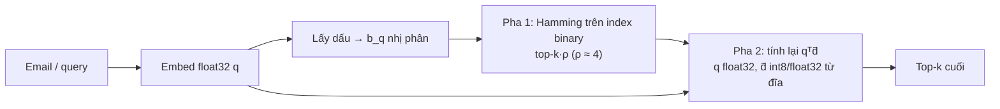

# Module 03 — Embedding & biểu diễn ngữ nghĩa

> Thời lượng: ~45 phút · Mức độ: Trung bình → Nâng cao · Tiên quyết: Module 01 (tokenization, Transformer, softmax), Module 02 (pipeline RAG naive)

Embedding là "giác quan" của RAG: nếu tài liệu đúng bị đặt xa câu hỏi, reranker hay LLM phía sau không cứu được. Khách viết *"em không login được, cứ báo sai mật khẩu dù đã reset"*, còn bài Help Center lại tên là *"Troubleshooting sign-in errors after password reset"* (tiếng Anh) và bản tiếng Nhật *"パスワード再設定後にサインインできない場合"*. Không từ nào trùng nhau, nhưng embedding tốt phải đặt ba văn bản này gần nhau.

## Mục tiêu học tập

Sau module này, bạn có thể:

1. Phân biệt bi-encoder, cross-encoder và late interaction (ColBERT) theo công thức chấm điểm, độ phức tạp tính toán và chi phí lưu trữ; chọn đúng kiến trúc cho từng tầng của pipeline Zendesk.
2. Viết và giải thích loss InfoNCE với in-batch negatives, tính tay xác suất softmax và gradient cho một ví dụ nhỏ, giải thích vai trò của nhiệt độ $\tau$, hard negative và rủi ro false negative.
3. Chứng minh $\|a-b\|^2 = 2 - 2\cos(a,b)$ cho vector chuẩn hóa và dùng nó để chọn độ đo/loại index phù hợp với model.
4. Nhận diện anisotropy và hubness trong không gian embedding, đo chúng trên dữ liệu thật và áp dụng biện pháp giảm thiểu.
5. Ước lượng bộ nhớ cho index và áp dụng Matryoshka + quantization (int8, binary + rescoring), giải thích được toán Hamming đằng sau.
6. Lập kế hoạch chọn model embedding đa ngữ (Việt/Anh/Nhật) tính đến 10/2026 và xây dựng một benchmark nội bộ từ ticket lịch sử để ra quyết định bằng số liệu.

---

## 1. Từ đếm từ đến vector ngữ nghĩa

### 1.1 Vấn đề: khớp từ khóa không đủ

Gọi $V$ là từ vựng (vocabulary) có $|V|$ phần tử. Cách biểu diễn đơn giản nhất cho một văn bản $x$ là vector đếm $\mathbf{c}(x) \in \mathbb{N}^{|V|}$, trong đó $c_w(x)$ là số lần từ $w$ xuất hiện. Mỗi từ riêng lẻ là một vector one-hot $\mathbf{e}_w$ (chỉ có một số 1 ở vị trí $w$). TF-IDF nhân thêm trọng số $\mathrm{idf}(w) = \log \frac{N}{\mathrm{df}(w)}$ để giảm vai trò của những từ xuất hiện ở khắp nơi ($N$ là số tài liệu, $\mathrm{df}(w)$ là số tài liệu chứa $w$). Công thức BM25 đầy đủ được dẫn ở Module 05; ở đây ta chỉ cần nhận xét hình học.

**Nhận xét then chốt:** với one-hot, hai từ khác nhau luôn trực giao: $\mathbf{e}_{\text{login}}^\top \mathbf{e}_{\text{đăng nhập}} = 0$. Do đó độ tương đồng giữa hai văn bản chỉ đến từ các từ *trùng nhau đúng chữ*.

**Ví dụ số.** Lấy từ vựng rút gọn $V=\{\text{không}, \text{login}, \text{được}, \text{đăng nhập}, \text{sign-in}, \text{error}\}$. Query $q$ = "không login được", tài liệu $d_1$ = "không đăng nhập được", $d_2$ = "sign-in error".

- $\mathbf{c}(q) = (1,1,1,0,0,0)$, $\mathbf{c}(d_1) = (1,0,1,1,0,0)$, $\mathbf{c}(d_2)=(0,0,0,0,1,1)$.
- $\cos(q,d_1) = \frac{2}{\sqrt{3}\sqrt{3}} = 0.667$ — nhưng điểm này đến từ "không" và "được", hai từ gần như vô nghĩa về chủ đề.
- $\cos(q,d_2) = 0$ — trong khi $d_2$ mới là bài Help Center đúng.

Đây là *vocabulary mismatch* — rất phổ biến trong email tiếng Việt ("ko", "dc", "tk"…). Sparse retrieval vẫn quý cho mã lỗi, tên tính năng (Module 05), nhưng ta cần biểu diễn mà *ý nghĩa gần thì vector gần*.

<!-- fig:onehot-vs-dense -->
<figure markdown="span">
  { loading=lazy }
  { loading=lazy }
  <figcaption>Hình 3.1 — Trái: với vector đếm từ, d₁ thắng chỉ nhờ hai từ chức năng, còn bài đúng d₂ có cosine 0. Phải: sơ đồ minh họa điều ta muốn — văn bản cùng nghĩa nằm gần nhau dù khác chữ, khác ngôn ngữ.</figcaption>
</figure>
<!-- /fig -->

### 1.2 Giả thuyết phân bố và word2vec

**Ý tưởng (distributional hypothesis):** từ xuất hiện trong ngữ cảnh giống nhau thì nghĩa giống nhau — "login" và "đăng nhập" cùng hay đi với "mật khẩu", "tài khoản".

**Toán (skip-gram với negative sampling, Mikolov et al. 2013).** Mỗi từ $w$ có hai vector: $\mathbf{u}_w$ (khi là từ trung tâm) và $\mathbf{v}_w$ (khi là từ ngữ cảnh), $\mathbf{u}_w,\mathbf{v}_w\in\mathbb{R}^d$ với $d$ cỡ 100–300. Với mỗi cặp (từ trung tâm $w$, từ ngữ cảnh $c$) quan sát được và $K$ từ "nhiễu" $c'_1,\dots,c'_K$ lấy mẫu ngẫu nhiên từ phân phối tần suất (mũ 3/4), loss là

$$
\ell(w,c) = -\log \sigma(\mathbf{u}_w^\top \mathbf{v}_c) - \sum_{k=1}^{K} \log \sigma(-\mathbf{u}_w^\top \mathbf{v}_{c'_k}),
$$

với $\sigma(z) = 1/(1+e^{-z})$. Số hạng đầu kéo cặp thật lại gần (tích vô hướng lớn), số hạng sau đẩy cặp nhiễu ra xa. Đây là **mầm mống của học tương phản** (mục 3).

<!-- fig:word2vec-skipgram -->
<figure markdown="span">
  { loading=lazy }
  { loading=lazy }
  <figcaption>Hình 3.2 — Skip-gram với negative sampling: từ trung tâm được kéo gần các từ trong cửa sổ ngữ cảnh và đẩy xa K từ nhiễu.</figcaption>
</figure>
<!-- /fig -->

Một kết quả lý thuyết đẹp (Levy & Goldberg, NeurIPS 2014): ở điểm tối ưu, $\mathbf{u}_w^\top\mathbf{v}_c \approx \mathrm{PMI}(w,c) - \log K$, với $\mathrm{PMI}(w,c)=\log\frac{p(w,c)}{p(w)p(c)}$. — word2vec ngầm phân rã ma trận PMI.

**Giới hạn:** mỗi từ một vector bất kể ngữ cảnh — "khóa" (lock / course / API key) bị trộn vào một điểm.

### 1.3 Contextual và sentence embeddings

Transformer encoder (BERT — xem Module 01) cho mỗi token một vector phụ thuộc cả câu: "khóa" trong "tài khoản bị khóa" và "khóa API hết hạn" giờ có hai vector khác nhau. Nhưng ta cần **một vector cho cả đoạn**, và lấy `[CLS]` hoặc trung bình token của BERT gốc cho kết quả tìm kiếm rất tệ: mục tiêu masked language modeling không hề yêu cầu "cùng nghĩa thì gần nhau", và không gian bị anisotropy nặng (mục 6).

Sentence-BERT (Reimers & Gurevych, 2019) là bước ngoặt: fine-tune BERT dạng siamese trên cặp câu để cosine của câu cùng nghĩa cao; việc tìm cặp giống nhất trong 10.000 câu giảm từ khoảng 65 giờ (cross-encoder) xuống khoảng 5 giây. Từ đó mọi model embedding hiện đại (E5, BGE, Qwen3-Embedding, Gemini Embedding…) theo cùng công thức: **backbone Transformer + pooling + huấn luyện tương phản trên lượng lớn cặp (query, tài liệu liên quan)** — mục 3 và 4.

> **Liên hệ Zendesk.** Không gian embedding chứa ba "vùng": email khách (ngắn, lộn xộn, đa ngữ, viết tắt), bài HC/tài liệu (dài, chuẩn mực) và macro/câu trả lời agent (văn phong CS). Model tốt phải "bắc cầu" giữa vùng đầu và hai vùng sau dù khác độ dài, văn phong, ngôn ngữ — tính *bất đối xứng* (mục 2.5, 9).

---

## 2. Ba kiến trúc chấm điểm: bi-encoder, cross-encoder, late interaction

### 2.1 Vấn đề

Ta cần hàm điểm $f(q,d)$ vừa **chính xác** (nhìn kỹ tương tác giữa từng từ của $q$ và $d$) vừa **rẻ** (không thể chạy mạng lớn cho từng chunk trong vài trăm nghìn chunk). Ba kiến trúc là ba điểm khác nhau trên đường cong trade-off này.

<!-- fig:scoring-architectures -->
<figure markdown="span">
  { loading=lazy }
  { loading=lazy }
  <figcaption>Hình 3.3 — Ba cách chấm điểm f(q, d). Bi-encoder và ColBERT tính trước được phía tài liệu; cross-encoder phải chạy lại cho từng cặp.</figcaption>
</figure>
<!-- /fig -->

### 2.2 Bi-encoder (dual encoder)

**Công thức.** Hai bộ mã hóa $E_Q$, $E_D$ (thường chia sẻ trọng số, $E_Q=E_D=E$) ánh xạ văn bản vào $\mathbb{R}^d$:

$$
f_{\text{bi}}(q,d) = \mathrm{sim}\big(E_Q(q),\, E_D(d)\big), \quad \mathrm{sim}\in\{\text{dot}, \cos\}.
$$

**Tính chất quyết định:** $E_D(d)$ không phụ thuộc $q$ nên tính **offline** cho cả kho. Online chỉ cần 1 forward cho $q$ + tìm láng giềng gần nhất ($O(Nd)$ brute-force, gần $O(\log N)$ với HNSW — Module 05). Lưu trữ $N\cdot d$ số thực.

**Điểm yếu:** mọi ý nghĩa của $d$ bị nén vào *một* vector trước khi biết câu hỏi; chi tiết nhỏ ("chỉ gói Enterprise", "từ phiên bản 4.2") dễ bị pha loãng.

### 2.3 Cross-encoder

**Công thức.** Ghép $q$ và $d$ thành một chuỗi rồi cho qua Transformer, lấy một vector tổng hợp $\mathbf{h}$ và chiếu ra một số:

$$
f_{\text{cross}}(q,d) = \mathbf{w}^\top \mathbf{h}_{\texttt{[CLS]}}\big(\,[\texttt{CLS}]\, q\, [\texttt{SEP}]\, d\,\big) + b.
$$

Mọi token của $q$ attend tới mọi token của $d$ → chính xác hơn nhiều, nhưng không tính trước được: $O(k)$ forward cho $k$ ứng viên. Vì vậy chỉ dùng làm **reranker** trên top-20–100 (Module 06).

### 2.4 Late interaction (ColBERT) và toán tử MaxSim

**Ý tưởng:** giữ lại vector *từng token* thay vì nén thành một vector, nhưng vẫn encode $q$ và $d$ độc lập (tính trước được cho $d$). Tương tác chỉ xảy ra "muộn", ở bước chấm điểm, bằng một phép rất rẻ.

**Công thức (Khattab & Zaharia, 2020).** Gọi $\mathbf{q}_1,\dots,\mathbf{q}_m$ là vector token của query và $\mathbf{d}_1,\dots,\mathbf{d}_n$ của tài liệu (đã chuẩn hóa, chiều nhỏ, ví dụ 128). Điểm là

$$
f_{\text{ColBERT}}(q,d) = \sum_{i=1}^{m} \max_{j=1..n} \mathbf{q}_i^\top \mathbf{d}_j .
$$

Với mỗi token câu hỏi, tìm token khớp nhất trong tài liệu rồi cộng lại — phiên bản mềm của "mọi khái niệm trong câu hỏi phải được tài liệu nhắc tới".

**Ví dụ số tính tay.** Query có 2 token, mỗi tài liệu có 3 token. Ma trận tương đồng $S_{ij}=\mathbf{q}_i^\top\mathbf{d}_j$:

| | $d^{(1)}$: tok 1 | tok 2 | tok 3 | | $d^{(2)}$: tok 1 | tok 2 | tok 3 |
|---|---|---|---|---|---|---|---|
| $q_1$ ("reset") | **0.9** | 0.2 | 0.1 | | 0.5 | **0.5** | 0.4 |
| $q_2$ ("mật khẩu") | 0.3 | **0.7** | 0.4 | | **0.6** | 0.3 | **0.6** |

- $f(q,d^{(1)}) = 0.9 + 0.7 = 1.6$.
- $f(q,d^{(2)}) = 0.5 + 0.6 = 1.1$.

$d^{(1)}$ khớp mạnh *từng* khái niệm; $d^{(2)}$ "hơi giống mọi thứ". Mean-pool rồi lấy cosine có thể không phân biệt được hai tài liệu này.

<!-- fig:colbert-maxsim -->
<figure markdown="span">
  { loading=lazy }
  { loading=lazy }
  <figcaption>Hình 3.4 — MaxSim trên ví dụ của mục 2.4: d⁽¹⁾ có token khớp mạnh cho cả hai khái niệm nên điểm cao hơn d⁽²⁾.</figcaption>
</figure>
<!-- /fig -->

**Chi phí lưu trữ cho Zendesk** (300.000 chunk — mục 7.1, 200 token/chunk, 128 chiều, fp16):

$$
300{,}000 \times 200 \times 128 \times 2 \ \text{byte} \approx 15.4\ \text{GB}.
$$

So với bi-encoder 1024 chiều fp32: $\approx 1.2$ GB. ColBERTv2 (Santhanam et al., 2021) nén residual (centroid + phần dư vài bit), báo cáo giảm 6–10 lần, còn khoảng 1.5–2.5 GB — chấp nhận được nhưng cần engine hỗ trợ multi-vector.

### 2.5 Bảng trade-off và khuyến nghị

| Tiêu chí | Bi-encoder | Late interaction (ColBERT) | Cross-encoder |
|---|---|---|---|
| Tính trước cho tài liệu | Có (1 vector) | Có ($n$ vector/tài liệu) | Không |
| Chi phí online cho $N$ tài liệu | 1 forward + ANN | 1 forward + ANN theo token + MaxSim | $N$ forward (không khả thi) |
| Lưu trữ | $N\cdot d$ | $N\cdot \bar n \cdot d'$ (lớn hơn 1–2 bậc trước nén) | Không cần index |
| Độ chính xác điển hình | Khá | Tốt | Tốt nhất |
| Vai trò trong pipeline | Truy hồi tầng 1 | Tầng 1 hoặc rerank | Rerank top-$k$ |

Trong thực tế, mình khuyên cho Zendesk: **bi-encoder đa ngữ + BM25 (hybrid, Module 05) cho tầng 1, cross-encoder đa ngữ cho rerank (Module 06)**. ColBERT chỉ đáng cân nhắc khi hybrid vẫn bỏ sót nhiều; BGE-M3 (Chen et al., 2024) sinh cùng lúc dense, sparse và multi-vector nên thử late interaction không cần đổi model.

> **Liên hệ Zendesk.** Hệ thống cần cả truy hồi *bất đối xứng* (email ngắn → bài HC/macro/Q&A dài) lẫn *đối xứng* (email mới → ticket cũ tương tự, để agent tham khảo và phát hiện sự cố hàng loạt kiểu "50 khách cùng báo lỗi thanh toán trong 1 giờ"). Đa số model phân biệt hai vai trò bằng instruction/prefix (mục 9); hãy đánh giá riêng từng tác vụ.

---

## 3. Học tương phản: embedding được huấn luyện thế nào

### 3.1 Thiết lập bài toán

Dữ liệu là các cặp $(q_i, d_i^+)$, $i=1..B$ trong một batch, $d_i^+$ liên quan tới $q_i$ (hỏi–đáp, câu–bản dịch, email–bài HC agent đã gửi…). Ký hiệu:

- $\mathbf{z}_q = E(q)/\|E(q)\|$, $\mathbf{z}_d = E(d)/\|E(d)\|$: embedding đã chuẩn hóa.
- $s(q,d) = \mathbf{z}_q^\top \mathbf{z}_d = \cos(q,d) \in [-1,1]$.
- $\tau>0$: nhiệt độ (temperature).

### 3.2 InfoNCE với in-batch negatives

Với query $q_i$, coi $d_i^+$ là "đáp án đúng" và các $d_j^+$ ($j\neq i$) của những query khác trong cùng batch là "đáp án sai" (**in-batch negatives**). Bài toán trở thành phân loại $B$ lớp, softmax trên điểm tương đồng:

$$
p_{ij} = \frac{\exp\big(s(q_i,d_j)/\tau\big)}{\sum_{k=1}^{B}\exp\big(s(q_i,d_k)/\tau\big)}, \qquad
\mathcal{L}_{\text{InfoNCE}} = -\frac{1}{B}\sum_{i=1}^{B}\log p_{ii}.
$$

Đây là cross-entropy (Module 01) với logit là cosine chia $\tau$. InfoNCE đến từ van den Oord et al. (2018); DPR (Karpukhin et al., 2020) phổ biến in-batch negatives cho retrieval.

**Vì sao "miễn phí"?** $B$ query và $B$ tài liệu đã được encode; ma trận $Z_Q Z_D^\top \in\mathbb{R}^{B\times B}$ cho $B^2$ điểm bằng một phép nhân, mỗi query có $B-1$ negative không tốn thêm forward.

### 3.3 Ví dụ số: ảnh hưởng của nhiệt độ $\tau$

Một query với 4 ứng viên trong batch, cosine lần lượt: $d^+$: 0.82; $d_2$: 0.75 (một bài HC gần chủ đề — "hard negative"); $d_3$: 0.40; $d_4$: 0.30.

| $\tau$ | $p(d^+)$ | $p(d_2)$ | $p(d_3)$ | $p(d_4)$ | Loss $-\log p(d^+)$ |
|---|---|---|---|---|---|
| 1.0 | 0.314 | 0.293 | 0.206 | 0.187 | 1.158 |
| 0.1 | 0.659 | 0.327 | 0.010 | 0.004 | 0.417 |
| 0.05 | 0.802 | 0.198 | 0.0002 | ≈0 | 0.221 |

Cách tính một ô, ví dụ $\tau=0.1$: logit $= (8.2, 7.5, 4.0, 3.0)$; trừ max để ổn định số: $(0, -0.7, -4.2, -5.2)$; mũ: $(1, 0.497, 0.015, 0.0055)$; tổng $\approx 1.517$; $p(d^+) = 1/1.517 \approx 0.659$.

**Đọc bảng:**

- $\tau$ lớn (1.0): logit chênh ít, softmax gần đều, loss cao dù thứ hạng đã đúng → tín hiệu học yếu.
- $\tau$ nhỏ (0.05): softmax rất nhọn; negative dễ gần như không đóng góp, "áp lực" dồn vào hard negative $d_2$.

Đây là trực giác cốt lõi: **$\tau$ điều khiển mức độ tập trung vào hard negative.** Các model embedding thường dùng $\tau$ khoảng 0.01–0.05. Hệ quả: model card multilingual-e5 lưu ý do $\tau=0.01$, cosine giữa văn bản bất kỳ thường nằm khoảng 0.7–1.0 — quan trọng là *thứ hạng*, không phải giá trị tuyệt đối (mục 5.4).

<!-- fig:infonce-temperature -->
<figure markdown="span">
  { loading=lazy }
  { loading=lazy }
  <figcaption>Hình 3.5 — Trái: phân phối softmax của bảng ở mục 3.3. Phải: khi τ giảm, p(d⁺) tăng và gần như toàn bộ lực đẩy dồn vào hard negative d₂.</figcaption>
</figure>
<!-- /fig -->

### 3.4 Dẫn xuất gradient: hard negative nhận trọng số bao nhiêu?

Xét loss của một query, $\ell = -\log p_{+}$ với $p_j = \mathrm{softmax}(s_j/\tau)_j$. Đạo hàm của cross-entropy theo logit $z_j = s_j/\tau$ là $p_j - \mathbb{1}[j=+]$. Theo quy tắc chuỗi:

$$
\frac{\partial \ell}{\partial s_j} = \frac{1}{\tau}\big(p_j - \mathbb{1}[j=+]\big).
$$

Và vì $s_j = \mathbf{z}_q^\top\mathbf{z}_{d_j}$:

$$
\frac{\partial \ell}{\partial \mathbf{z}_q} = \frac{1}{\tau}\Big(\sum_{j} p_j \mathbf{z}_{d_j} - \mathbf{z}_{d^+}\Big)
= \frac{1}{\tau}\Big(\underbrace{\mathbb{E}_{j\sim p}[\mathbf{z}_{d_j}]}_{\text{"trọng tâm" có trọng số}} - \mathbf{z}_{d^+}\Big).
$$

Gradient descent kéo $\mathbf{z}_q$ về phía $\mathbf{z}_{d^+}$ và đẩy ra khỏi trung bình có trọng số của các ứng viên, với trọng số chính là $p_j$. Với $\tau=0.05$ ở ví dụ trên, $d_2$ chiếm 0.198 trong khi $d_3,d_4$ gần 0: **chỉ negative "khó" mới thực sự tạo ra gradient.** Hệ quả: negative ngẫu nhiên nhanh chóng trở nên "quá dễ"; cần **hard negative mining** — dùng BM25 hoặc model hiện tại lấy top-$k$ tài liệu *không phải* đáp án và thêm vào batch.

<!-- fig:infonce-gradient -->
<figure markdown="span">
  { loading=lazy }
  { loading=lazy }
  <figcaption>Hình 3.6 — Hình học của gradient (τ = 0.05, góc dựng từ các cosine 0.82 / 0.75 / 0.40 / 0.30): z_q bị kéo về d⁺ và đẩy khỏi trọng tâm có trọng số, mà trọng tâm đó gần như chỉ gồm d⁺ và d₂.</figcaption>
</figure>
<!-- /fig -->

### 3.5 Hard negatives và cái bẫy false negative

Nếu "negative" thực ra cũng đúng (**false negative**), gradient ở trên *đẩy model ra khỏi một câu trả lời đúng* với trọng số lớn. Trong dữ liệu Zendesk điều này rất thường gặp:

- Cùng nội dung có ở bài HC tiếng Anh, bản dịch tiếng Nhật và một macro tiếng Việt — macro bị mine thành "hard negative".
- Hàng nghìn ticket lịch sử gần như trùng nhau; bài HC chồng lấn ("Reset password" vs "Account locked").

Cách giảm thiểu:

- **Positive-aware mining** (NV-Retriever, Moreira et al., 2024): dùng điểm cặp dương làm mốc, loại ứng viên có điểm vượt một tỷ lệ của điểm dương (ví dụ ~95%) — "negative" được teacher chấm gần bằng đáp án thì nhiều khả năng cũng là đáp án.
- Bỏ qua vài hạng đầu khi mine; khử trùng lặp trước (Module 04, MinHash); gom nhóm bản dịch theo `translation_group_id`; dùng cross-encoder làm trọng tài.

Quy trình fine-tune đầy đủ ở Module 09.

### 3.6 Liên hệ với thông tin tương hỗ (mutual information)

Gọi $(Q,D)$ là cặp biến ngẫu nhiên có phân phối đồng thời $p(q,d)$ (cặp dương). van den Oord et al. (2018) và Poole et al. (2019, "On Variational Bounds of Mutual Information") cho thấy với $B$ ứng viên (1 dương, $B-1$ lấy từ phân phối biên $p(d)$):

$$
I(Q;D) \;\ge\; \log B - \mathcal{L}_{\text{InfoNCE}}.
$$

**Phác thảo dẫn xuất (theo van den Oord et al.).** Hàm điểm tối ưu của bài toán "chọn đúng cặp dương trong $B$ ứng viên" tỷ lệ với tỷ số mật độ $r(q,d)=\frac{p(d\mid q)}{p(d)}$. Thay hàm tối ưu này vào loss:

$$
\mathcal{L}^\ast = \mathbb{E}\Big[\log\Big(1 + \frac{p(d^+)}{p(d^+\mid q)}\sum_{j\ne +}\frac{p(d_j\mid q)}{p(d_j)}\Big)\Big]
\approx \mathbb{E}\Big[\log\Big(1+\frac{p(d^+)}{p(d^+\mid q)}(B-1)\Big)\Big]
\ge \mathbb{E}\Big[\log\Big(\frac{p(d^+)}{p(d^+\mid q)}\,B\Big)\Big] = \log B - I(Q;D).
$$

Bước "≈" dùng $\mathbb{E}_{d_j\sim p(d)}\big[r(q,d_j)\big]=1$ (xấp xỉ tổng $B-1$ số hạng bằng kỳ vọng của nó); bước "≥" đúng khi $p(d^+)\le p(d^+\mid q)$, tức cặp dương thật sự có liên hệ. Sắp xếp lại được bất đẳng thức trên. (Poole et al. chứng minh chặt chẽ hơn mà không cần bước xấp xỉ.)

**Hệ quả thực tế:**

- Cận dưới bị chặn bởi $\log B$: với $B=32$, cận tối đa là $\log 32\approx 3.47$ nats; $B=256$: $5.55$; $B=4096$: $8.32$. → thêm lý do cho batch lớn.
- Embedding chỉ giữ những gì *giúp phân biệt* đáp án đúng với ứng viên khác trong dữ liệu huấn luyện. Nếu dữ liệu không bao giờ đòi phân biệt "phiên bản 4.1" với "4.2", embedding sẽ không giữ thông tin đó → số phiên bản, tên gói dịch vụ nên giao cho **metadata filter** và **BM25**.

<!-- fig:infonce-mi-bound -->
<figure markdown="span">
  { loading=lazy }
  { loading=lazy }
  <figcaption>Hình 3.7 — Cận dưới thông tin tương hỗ từ InfoNCE không thể vượt log B — một lý do định lượng cho batch lớn.</figcaption>
</figure>
<!-- /fig -->

### 3.7 Alignment và uniformity

Wang & Isola (2020) phân tách mục tiêu tương phản trên mặt cầu đơn vị thành hai tính chất có thể đo được:

$$
\mathcal{L}_{\text{align}} = \mathbb{E}_{(x,y)\sim p_{\text{pos}}}\big\|\mathbf{z}_x-\mathbf{z}_y\big\|^2, \qquad
\mathcal{L}_{\text{uniform}} = \log \mathbb{E}_{x,y \overset{\text{iid}}{\sim} p_{\text{data}}} e^{-t\|\mathbf{z}_x-\mathbf{z}_y\|^2}\ (t=2).
$$

Alignment thấp nghĩa là cặp dương nằm gần nhau; uniformity thấp (âm hơn) nghĩa là các điểm trải đều trên mặt cầu. Tử số của InfoNCE thúc đẩy alignment, mẫu số (log-sum-exp trên negative) thúc đẩy uniformity; chỉ có alignment thì model "sụp đổ" (mọi vector như nhau). Hai đại lượng này tiện để chẩn đoán model trên dữ liệu của bạn — và uniformity chính là mặt đối lập của anisotropy (mục 6).

<!-- fig:alignment-uniformity -->
<figure markdown="span">
  { loading=lazy }
  { loading=lazy }
  <figcaption>Hình 3.8 — Alignment và uniformity trên đường tròn đơn vị (dữ liệu mô phỏng). Chỉ tối ưu alignment dẫn tới sụp đổ; InfoNCE cần cả hai.</figcaption>
</figure>
<!-- /fig -->

### 3.8 Code minh họa: InfoNCE với in-batch negatives

```python
# Yêu cầu: torch>=2.1
import torch
import torch.nn.functional as F

def info_nce(q_emb: torch.Tensor, d_emb: torch.Tensor, tau: float = 0.05,
             hard_neg: torch.Tensor | None = None) -> torch.Tensor:
    """
    q_emb: [B, d] embedding query; d_emb: [B, d] embedding tài liệu dương (hàng i khớp query i)
    hard_neg: [B, d] (tùy chọn) mỗi query thêm 1 hard negative
    """
    q = F.normalize(q_emb, dim=-1)
    d = F.normalize(d_emb, dim=-1)
    if hard_neg is not None:
        d = torch.cat([d, F.normalize(hard_neg, dim=-1)], dim=0)  # [2B, d]
    logits = q @ d.T / tau            # [B, B] hoặc [B, 2B]: mọi cặp query–tài liệu
    labels = torch.arange(q.size(0))  # đáp án của query i nằm ở cột i
    return F.cross_entropy(logits, labels)

```

### 3.9 Các model hiện đại được huấn luyện thế nào (bức tranh chung)

Các model mạnh hiện nay thường qua ba giai đoạn: (1) tiền huấn luyện tương phản yếu giám sát trên hàng trăm triệu đến hàng tỷ cặp tự nhiên từ web — tiêu đề/nội dung, hỏi/đáp, câu/bản dịch (E5; multilingual-E5 dùng khoảng 1 tỷ cặp đa ngữ); (2) fine-tune có giám sát với hard negatives; (3) dữ liệu tổng hợp do LLM sinh và chưng cất từ model lớn hoặc reranker (Qwen3-Embedding, EmbeddingGemma, jina-embeddings-v5-text đều mô tả bước này). Xu hướng đáng chú ý: **backbone ngày càng là LLM decoder-only** (Qwen3, Gemma…), kéo theo thay đổi về pooling (mục 4) và ngữ cảnh dài 32K token.

---

## 4. Pooling: từ vector token đến vector văn bản

### 4.1 Vấn đề

Transformer cho ra ma trận $H = [\mathbf{h}_1,\dots,\mathbf{h}_n]\in\mathbb{R}^{n\times d}$. Cần một hàm $\mathrm{pool}: \mathbb{R}^{n\times d}\to\mathbb{R}^d$. Ba lựa chọn chính, và **bạn không được tự chọn** — phải dùng đúng cách model đã được huấn luyện.

### 4.2 Ba kiểu pooling

Gọi $m_t\in\{0,1\}$ là attention mask (1 nếu token thật, 0 nếu padding).

**CLS pooling** (ví dụ BGE-M3 dense): $\mathbf{e} = \mathbf{h}_{\texttt{[CLS]}}$.

**Mean pooling** (Sentence-BERT, E5, multilingual-e5):

$$
\mathbf{e} = \frac{\sum_{t=1}^n m_t \mathbf{h}_t}{\sum_{t=1}^n m_t}.
$$

Lỗi kinh điển: quên nhân mask → vector padding bị tính vào trung bình, embedding của cùng một câu thay đổi theo độ dài batch.

*Ví dụ số:* $\mathbf{h}_1=(1,2)$, $\mathbf{h}_2=(3,0)$, $\mathbf{h}_3=(0,0)$ là padding, $m=(1,1,0)$. Đúng: $\mathbf{e}=((1+3)/2,(2+0)/2)=(2,1)$. Sai (không mask): $\mathbf{e}=(4/3,2/3)$.

**Last-token pooling** (model decoder-only: Qwen3-Embedding, Harrier-OSS-v1, KaLM-Embedding-Gemma3, …):

$$
\mathbf{e} = \mathbf{h}_{t^\ast},\quad t^\ast = \max\{t : m_t = 1\}.
$$

**Vì sao last-token cho decoder-only?** Với causal mask (Module 01), token ở vị trí $t$ chỉ attend được tới $1..t$. Chỉ token cuối "đã nhìn thấy" toàn bộ văn bản; mean pooling sẽ trộn các token đầu vốn chỉ thấy vài từ. Một số model sửa kiến trúc (bỏ causal mask, thêm attention pooling) nên dùng cách khác — luôn đọc model card.

<!-- fig:pooling -->
<figure markdown="span">
  { loading=lazy }
  { loading=lazy }
  <figcaption>Hình 3.9 — Ba kiểu pooling trên cùng ma trận H. Mean pooling phải nhân attention mask để loại padding.</figcaption>
</figure>
<!-- /fig -->

**Cái bẫy padding side.** Pad bên phải thì vị trí cuối là padding; pad bên trái thì là token thật. Khi tự viết pipeline (vLLM, ONNX…), embed cùng một câu đơn lẻ và trong batch với câu dài hơn — hai vector phải gần như giống hệt (cos > 0.999).

### 4.3 Code: pooling thủ công có kiểm tra

```python
# transformers>=4.51 (cần cho Qwen3)
import torch, torch.nn.functional as F
from transformers import AutoTokenizer, AutoModel

def mean_pool(h, mask):
    m = mask.unsqueeze(-1).to(h.dtype)          # [B, n, 1]
    return (h * m).sum(1) / m.sum(1).clamp(min=1e-9)

def last_token_pool(h, mask):
    # Hoạt động với cả padding trái và phải
    if bool(mask[:, -1].all()):                 # padding trái: token cuối luôn là token thật
        return h[:, -1]
    idx = mask.sum(1) - 1                       # padding phải: vị trí token thật cuối cùng
    return h[torch.arange(h.size(0)), idx]

name = "Qwen/Qwen3-Embedding-0.6B"              # ~0.6B tham số, vừa GPU 6GB ở fp16
tok = AutoTokenizer.from_pretrained(name, padding_side="left")
model = AutoModel.from_pretrained(name, torch_dtype=torch.float16).cuda().eval()

texts = ["Không đăng nhập được sau khi đổi mật khẩu",
         "Cannot sign in after password reset. I tried clearing cache and it still fails."]
batch = tok(texts, padding=True, truncation=True, max_length=512, return_tensors="pt").to("cuda")
with torch.no_grad():
    h = model(**batch).last_hidden_state
emb = F.normalize(last_token_pool(h, batch["attention_mask"]), dim=-1)

# Bất biến theo batch: câu 1 embed đơn lẻ phải ra gần như cùng vector
single = tok(texts[:1], return_tensors="pt").to("cuda")
with torch.no_grad():
    e1 = F.normalize(last_token_pool(model(**single).last_hidden_state, single["attention_mask"]), dim=-1)
print("cos(batch, single) =", float(emb[0] @ e1[0]))   # kỳ vọng > 0.999
```

> **Liên hệ Zendesk.** Lỗi pooling/padding là lỗi "im lặng": hệ thống vẫn chạy, recall chỉ tụt vài điểm, nặng hơn với email dài. Đưa phép kiểm tra "batch vs single" vào test tự động của service embedding, nhất là khi chuyển sang server suy luận khác (TEI, vLLM, ONNX) để phục vụ 1.500 ticket/ngày, peak gấp 3.


---

## 5. Độ đo tương đồng: cosine, dot product, L2

### 5.1 Định nghĩa

Với $\mathbf{a},\mathbf{b}\in\mathbb{R}^d$:

- Tích vô hướng: $\mathrm{dot}(\mathbf{a},\mathbf{b}) = \mathbf{a}^\top\mathbf{b} = \sum_i a_i b_i$.
- Cosine: $\cos(\mathbf{a},\mathbf{b}) = \dfrac{\mathbf{a}^\top\mathbf{b}}{\|\mathbf{a}\|\,\|\mathbf{b}\|}$ — chỉ phụ thuộc góc, bỏ qua độ dài.
- Khoảng cách Euclid (L2): $\|\mathbf{a}-\mathbf{b}\| = \sqrt{\sum_i (a_i-b_i)^2}$.

### 5.2 Quan hệ khi chuẩn hóa — dẫn xuất

Khai triển bình phương:

$$
\|\mathbf{a}-\mathbf{b}\|^2 = (\mathbf{a}-\mathbf{b})^\top(\mathbf{a}-\mathbf{b}) = \|\mathbf{a}\|^2 + \|\mathbf{b}\|^2 - 2\,\mathbf{a}^\top\mathbf{b}.
$$

Nếu $\|\mathbf{a}\|=\|\mathbf{b}\|=1$ thì $\mathbf{a}^\top\mathbf{b}=\cos(\mathbf{a},\mathbf{b})$ và

$$
\boxed{\ \|\mathbf{a}-\mathbf{b}\|^2 = 2 - 2\cos(\mathbf{a},\mathbf{b})\ }
$$

**Hệ quả:** trên mặt cầu đơn vị, ba độ đo cho **cùng một thứ tự xếp hạng** (L2 nhỏ nhất ⇔ cos lớn nhất ⇔ dot lớn nhất). Vì $f(x)=2-2x$ là hàm giảm đơn điệu, kNN theo L2 và theo cosine trả về đúng cùng tập láng giềng.

**Ví dụ số.** $\mathbf{q}=(0.6,0.8,0)$, $\mathbf{d}_1=(0.8,0.6,0)$, $\mathbf{d}_2=(0,0.6,0.8)$ — cả ba đều có chuẩn 1.

- $\cos(\mathbf{q},\mathbf{d}_1) = 0.48+0.48 = 0.96$ → $\|\mathbf{q}-\mathbf{d}_1\|^2 = 2-1.92 = 0.08$. Kiểm tra trực tiếp: $(-0.2)^2+0.2^2+0 = 0.08$. Đúng.
- $\cos(\mathbf{q},\mathbf{d}_2) = 0+0.48+0 = 0.48$ → $\|\mathbf{q}-\mathbf{d}_2\|^2 = 2-0.96 = 1.04$. Trực tiếp: $0.36+0.04+0.64 = 1.04$. Đúng.

### 5.3 Khi nào chúng KHÁC nhau: vector chưa chuẩn hóa

Với vector chưa chuẩn hóa, dot product thưởng cho vector "dài". Lấy $\mathbf{a}=(3,4)$, $\mathbf{c}=(30,40)$ (cùng hướng, dài gấp 10), $\mathbf{b}=(1,1)$: $\cos(\mathbf{a},\mathbf{b})=\cos(\mathbf{c},\mathbf{b})\approx 0.990$, nhưng $\mathbf{a}^\top\mathbf{b}=7$ còn $\mathbf{c}^\top\mathbf{b}=70$.

Có model huấn luyện với dot không chuẩn hóa (độ dài vector mang thông tin), có model huấn luyện với cosine. **Quy tắc vàng:** dùng đúng độ đo mà model được huấn luyện; nếu model card nói "normalize embeddings", hãy chuẩn hóa L2 rồi dùng dot product (nhanh nhất) — tương đương cosine.

<!-- fig:similarity-metrics -->
<figure markdown="span">
  { loading=lazy }
  { loading=lazy }
  <figcaption>Hình 3.10 — Trái: trên mặt cầu đơn vị, L2² là hàm giảm tuyến tính của cosine nên ba độ đo cho cùng thứ hạng (điểm cam là ví dụ mục 5.2). Phải: khi chưa chuẩn hóa, dot product thưởng cho vector dài.</figcaption>
</figure>
<!-- /fig -->

Chi tiết chọn metric khi tạo index (pgvector/Qdrant) ở Module 05.

### 5.4 Điểm tuyệt đối không phải xác suất

Sai lầm phổ biến: ngưỡng cứng kiểu "cosine < 0.75 → không tìm thấy → escalate". Phân bố cosine phụ thuộc $\tau$ lúc huấn luyện, model, ngôn ngữ, độ dài; cosine Nhật–Nhật có thể cao hơn hẳn Việt–Anh dù mức liên quan như nhau.

Mình khuyên không dùng cosine thô làm tín hiệu tin cậy; nếu cần, hiệu chuẩn theo từng ngôn ngữ/tác vụ hoặc dùng điểm cross-encoder kết hợp tín hiệu khác (Module 06, Module 10).

---

## 6. Hình học của không gian embedding: anisotropy và hubness

### 6.1 Anisotropy — "mọi thứ đều giống nhau"

**Hiện tượng.** Ethayarajh (2019) cho thấy biểu diễn ngữ cảnh của BERT, ELMo, GPT-2 **không đẳng hướng** ở mọi tầng: vector chiếm một "hình nón hẹp", nên cosine giữa hai văn bản ngẫu nhiên đã rất cao.

**Định lượng.** Với tập embedding chuẩn hóa $\{\mathbf{z}_i\}$, đo

$$
\mathrm{aniso} = \mathbb{E}_{i\neq j}\big[\cos(\mathbf{z}_i,\mathbf{z}_j)\big].
$$

Không gian đẳng hướng có giá trị gần 0; không gian dị hướng có giá trị gần 1.

**Mô hình đơn giản.** Giả sử $\mathbf{x}_i = \boldsymbol{\mu} + \boldsymbol{\epsilon}_i$, với $\boldsymbol{\mu}$ là vector "chung" (tần suất token, bias, chủ đề chung của kho…) và $\boldsymbol{\epsilon}_i$ là phần riêng mang nghĩa, $\mathbb{E}[\boldsymbol{\epsilon}_i]=\mathbf{0}$, các $\boldsymbol\epsilon_i$ độc lập. Khi đó

$$
\mathbb{E}[\mathbf{x}_i^\top\mathbf{x}_j] = \|\boldsymbol{\mu}\|^2 \quad (i\ne j), \qquad \mathbb{E}\|\mathbf{x}_i\|^2 = \|\boldsymbol{\mu}\|^2 + \mathbb{E}\|\boldsymbol{\epsilon}\|^2,
$$

nên cosine giữa hai văn bản ngẫu nhiên xấp xỉ $\frac{\|\boldsymbol{\mu}\|^2}{\|\boldsymbol{\mu}\|^2+\mathbb{E}\|\boldsymbol{\epsilon}\|^2}$. Thành phần chung càng lớn, cosine của *mọi cặp* càng tiến về 1.

**Ví dụ số (mô phỏng).** Sinh 2.000 vector 64 chiều, mỗi tọa độ $= 2.0 + 0.3\cdot\mathcal{N}(0,1)$. Theo công thức: $\|\boldsymbol\mu\|^2 = 64\cdot 4 = 256$, $\mathbb{E}\|\boldsymbol\epsilon\|^2 = 64\cdot 0.09=5.76$ → cosine kỳ vọng $\approx 256/261.76\approx 0.978$. Chạy thật cho trung bình $0.978$. Sau khi trừ trung bình (centering) và chuẩn hóa lại, giá trị về $\approx 0.00$.

<!-- fig:anisotropy -->
<figure markdown="span">
  { loading=lazy }
  { loading=lazy }
  <figcaption>Hình 3.11 — Anisotropy: vector dồn vào một hình nón hẹp nên cosine giữa hai văn bản bất kỳ ≈ 0.978; trừ trung bình (centering) đưa phân phối về quanh 0. Số liệu bên phải là mô phỏng đúng như mục 6.1.</figcaption>
</figure>
<!-- /fig -->

**Biện pháp:**

1. **Dùng model đã huấn luyện tương phản đúng cách.** Mẫu số InfoNCE thúc đẩy uniformity, tức chống anisotropy (mục 3.7). SimCSE (Gao et al., 2021) chỉ ra học tương phản làm không gian đều hơn.
2. **Centering / whitening hậu kỳ.** Trừ vector trung bình $\boldsymbol\mu$ ước lượng từ kho; (tùy chọn) nhân ma trận whitening $W = U\Lambda^{-1/2}$ từ phân rã hiệp phương sai $\Sigma = U\Lambda U^\top$ (Su et al., 2021, BERT-whitening). Phải đánh giá: whitening có thể khuếch đại các chiều nhiễu có phương sai nhỏ.
3. **Đừng diễn giải giá trị cosine tuyệt đối** (mục 5.4).

> **Liên hệ Zendesk.** Toàn bộ kho tri thức đều nói về *một* sản phẩm SaaS, nên "thành phần chung" $\boldsymbol\mu$ rất lớn: mọi chunk đều chứa "tài khoản", "người dùng", "cài đặt", tên sản phẩm. Cosine của các chunk không liên quan vẫn ở mức 0.6–0.8. Hãy thử centering theo kho (trừ $\boldsymbol\mu$ ở cả query và tài liệu, chuẩn hóa lại) và **đo Recall@k trước/sau** (mục 11); không cải thiện thì bỏ.

### 6.2 Hubness — "láng giềng của tất cả mọi người"

**Hiện tượng (Radovanović et al., JMLR 2010).** Trong chiều cao, phân phối của $N_k(x)$ — số lần $x$ nằm trong $k$ láng giềng gần nhất của các điểm khác — **lệch phải mạnh**: vài "hub" có mặt trong top-$k$ của rất nhiều truy vấn, nhiều "anti-hub" gần như không bao giờ được truy hồi.

**Vì sao?** Trong chiều cao, mọi khoảng cách gần bằng nhau; điểm nằm gần *tâm* phân phối "hơi gần" mọi điểm khác hơn một chút, đủ để lọt vào top-$k$ của rất nhiều truy vấn. Anisotropy làm nặng thêm.

**Định lượng.** Độ lệch (skewness) của phân phối $N_k$:

$$
S_{N_k} = \frac{\mathbb{E}\big[(N_k - \mathbb{E}N_k)^3\big]}{\mathrm{Var}(N_k)^{3/2}}.
$$

Khi tập query trùng với tập điểm, $\mathbb{E}[N_k] = k$ (mỗi truy vấn đóng góp đúng $k$ lượt). $S_{N_k}$ lớn (ví dụ trên 1–2) là dấu hiệu hubness rõ.

**Hub trong dữ liệu CS** là các chunk chung chung: đoạn kết "liên hệ CS nếu cần thêm hỗ trợ" của mọi bài HC, câu chào của macro, chữ ký/disclaimer lọt vào khi ingest, bài "Bắt đầu với sản phẩm X". Khi chúng chiếm top-5 của mọi email, LLM nhận context vô ích và trả lời chung chung — đúng kiểu làm CSAT giảm.

**Biện pháp:**

1. **Làm sạch từ gốc** (Module 04): bỏ boilerplate trước khi embed.
2. **Đo hub:** chạy ~5.000 email lịch sử, đếm $N_{10}$ từng chunk, đọc thủ công top-50.
3. **Chuẩn hóa điểm theo láng giềng**, ví dụ CSLS (Conneau et al., 2017):

$$
\mathrm{CSLS}(q,d) = 2\cos(q,d) - r_D(q) - r_Q(d),
$$

trong đó $r_Q(d)$ là cosine trung bình giữa $d$ và $K$ query gần nó nhất (ước lượng offline trên tập query lịch sử), $r_D(q)$ tương tự cho $q$. Hub có $r_Q(d)$ cao nên bị trừ điểm; $r_D(q)$ không đổi theo tài liệu nên chỉ cần trừ $r_Q(d)$, tính trước và lưu làm metadata.

Cuối cùng, **reranker** (Module 06) xử lý phần lớn hub còn sót vì cross-encoder nhìn trực tiếp vào câu hỏi.

**Ví dụ số CSLS.** Query $q$ có hai ứng viên: $d_A$ (đoạn kết chung "liên hệ CS") với $\cos=0.71$, $r_Q(d_A)=0.68$; $d_B$ (bài "lỗi SSO với Azure AD") với $\cos=0.69$, $r_Q(d_B)=0.40$. Xếp theo cosine: $d_A$ thắng. Theo CSLS (bỏ hằng số $r_D(q)$): $d_A$: $1.42-0.68=0.74$; $d_B$: $1.38-0.40=0.98$ → $d_B$ thắng, đúng như mong muốn.

<!-- fig:hubness -->
<figure markdown="span">
  { loading=lazy }
  { loading=lazy }
  <figcaption>Hình 3.12 — Trái: mô phỏng hubness — ở 100 chiều, phân phối N₁₀ lệch phải mạnh, vài điểm lọt top-10 của hơn 150 điểm khác; centering làm giảm rõ rệt. Phải: ví dụ CSLS của mục 6.2 đảo lại thứ hạng giữa hub và tài liệu đúng.</figcaption>
</figure>
<!-- /fig -->

### 6.3 Code: đo anisotropy và hubness trên kho của bạn

```python
# numpy>=1.26, scipy>=1.11; emb_docs, emb_queries: mảng float32 đã chuẩn hóa L2
import numpy as np
from scipy.stats import skew

def anisotropy(E, n_pairs=20000, seed=0):
    rng = np.random.default_rng(seed)
    i, j = rng.integers(0, len(E), (2, n_pairs))
    keep = i != j
    return float(np.mean(np.sum(E[i[keep]] * E[j[keep]], axis=1)))

def hubness(E_docs, E_queries, k=10):
    # Đếm số lần mỗi tài liệu lọt vào top-k của các query (brute-force; dùng FAISS nếu kho lớn)
    S = E_queries @ E_docs.T                          # [Q, N]
    topk = np.argpartition(-S, k, axis=1)[:, :k]
    counts = np.bincount(topk.ravel(), minlength=len(E_docs))
    return skew(counts), np.argsort(-counts)[:50]     # độ lệch N_k và 50 "hub" lớn nhất

# Đọc nội dung các chunk trong danh sách hub để tìm boilerplate cần làm sạch
```

---

## 7. Nén embedding: Matryoshka và quantization

### 7.1 Vấn đề: bộ nhớ và tốc độ ở quy mô

**Ước lượng số chunk cho Zendesk (giả định để học):** 800 bài HC × ~3 locale × ~8 chunk ≈ 19K; 300 macro ≈ 0.5K; 200.000 ticket lịch sử, giữ ~60% sau lọc, ~2 chunk/ticket ≈ 240K; tài liệu sản phẩm/API/chính sách ≈ 20–40K. Tổng **≈ 300.000 chunk** (ước lượng thô, sai số ±50%). Bộ nhớ vector thô:

| Số chiều $d$ | float32 ($4d$ byte/vector) | int8 ($d$ byte) | binary ($d/8$ byte) |
|---|---|---|---|
| 4096 (Qwen3-Embedding-8B đầy đủ) | 4.6 GiB | 1.1 GiB | 146 MiB |
| 1024 | 1.14 GiB | 0.29 GiB | 36.6 MiB |
| 512 | 0.57 GiB | 0.14 GiB | 18.3 MiB |
| 256 | 0.29 GiB | 0.07 GiB | 9.2 MiB |

(Cách tính: $300{,}000 \times 1024 \times 4 / 2^{30} \approx 1.14$ GiB; chưa tính overhead của đồ thị HNSW — Module 05.)

<!-- fig:index-memory -->
<figure markdown="span">
  { loading=lazy }
  { loading=lazy }
  <figcaption>Hình 3.13 — Bộ nhớ vector thô cho ~300K chunk theo bảng mục 7.1 (trục log).</figcaption>
</figure>
<!-- /fig -->

300K vector 1024 chiều vẫn vừa RAM một máy chủ thường; nén đáng quan tâm khi kho lớn dần (~1.500 ticket/ngày), khi tách index theo tenant, hoặc khi muốn dùng model 4096 chiều.

### 7.2 Matryoshka Representation Learning (MRL)

**Vấn đề:** muốn *phần đầu* của embedding cũng là một embedding tốt, để cắt chiều tùy ngân sách mà không huấn luyện lại.

**Ý tưởng (Kusupati et al., 2022).** Như búp bê Matryoshka lồng nhau: thông tin quan trọng nhất được dồn vào các chiều đầu tiên. Chọn một tập độ dài lồng nhau $\mathcal{M}=\{m_1 < m_2 < \dots < m_L = d\}$, ví dụ $\{64,128,256,512,1024\}$. Ký hiệu $\mathbf{z}_{1:m}$ là $m$ tọa độ đầu, chuẩn hóa lại. Loss là tổng có trọng số của loss gốc trên từng "lát cắt":

$$
\mathcal{L}_{\text{MRL}} = \sum_{m\in\mathcal{M}} c_m\, \mathcal{L}_{\text{InfoNCE}}\big(\mathbf{z}^{(q)}_{1:m},\, \mathbf{z}^{(d)}_{1:m}\big),
$$

với $c_m\ge 0$ là trọng số (thường bằng nhau). Vì mỗi tiền tố đều phải tự giải được bài toán truy hồi, gradient buộc model sắp xếp thông tin theo mức quan trọng giảm dần. Bài báo báo cáo, với phân loại ImageNet-1K, embedding nhỏ hơn tới 14 lần mà độ chính xác không giảm, và tăng tốc truy hồi tương ứng.

**Ví dụ số: vì sao không thể tùy tiện cắt chiều model không có MRL.** Hai vector 4 chiều $\mathbf{u}=(0.7,0.5,0.4,0.3)$, $\mathbf{v}=(0.6,0.6,-0.3,0.4)$. Cosine đầy đủ: $\frac{0.42+0.30-0.12+0.12}{\|\mathbf{u}\|\|\mathbf{v}\|}=\frac{0.72}{0.995\cdot 0.985}\approx 0.735$. Cắt còn 2 chiều: $\cos\big((0.7,0.5),(0.6,0.6)\big)\approx 0.986$. Nếu model không được huấn luyện MRL, thông tin phân biệt có thể nằm ở bất kỳ chiều nào (ở đây chiều 3 mang dấu ngược nhau), và cắt chiều làm hai văn bản khác nghĩa trông như gần giống hệt.

<!-- fig:matryoshka -->
<figure markdown="span">
  { loading=lazy }
  { loading=lazy }
  <figcaption>Hình 3.14 — Trái: loss Matryoshka cộng InfoNCE trên từng tiền tố lồng nhau. Phải: ví dụ 4 chiều — với model không có MRL, cắt chiều biến hai vector khác nghĩa thành gần như trùng nhau.</figcaption>
</figure>
<!-- /fig -->

**Thực hành:**

- Chỉ cắt ở model có hỗ trợ MRL (model card ghi rõ). Tính đến 10/2026: Qwen3-Embedding (32–4096 tùy chỉnh), EmbeddingGemma (768/512/256/128), jina-embeddings-v5-text (32 … 1024), KaLM-Embedding-Gemma3-12B (3840 … 64), Gemini Embedding, OpenAI text-embedding-3. BGE-M3 và multilingual-e5 **không** có MRL.
- **Luôn chuẩn hóa L2 lại sau khi cắt.**
- Một mẫu kiến trúc hay: **truy hồi thô bằng 256 chiều, rescoring bằng 1024 chiều** trên top-100 (adaptive retrieval — ý tưởng có trong bài báo MRL).

### 7.3 Scalar quantization (int8)

**Ý tưởng:** ánh xạ mỗi tọa độ float32 về 256 mức. Với chiều $i$, lấy $[\min_i,\max_i]$ từ một **tập hiệu chuẩn** (calibration set — vài nghìn embedding đại diện), bước lượng tử $\Delta_i = (\max_i-\min_i)/255$:

$$
\hat{x}_i = \mathrm{clip}\Big(\mathrm{round}\Big(\frac{x_i-\min_i}{\Delta_i}\Big) - 128,\, -128,\, 127\Big), \qquad
\tilde{x}_i = (\hat{x}_i+128)\,\Delta_i + \min_i .
$$

**Ví dụ số.** Giả sử với mọi chiều $\min=-0.30$, $\max=0.30$ → $\Delta = 0.6/255\approx 0.00235$. Vector $\mathbf{x}=(0.13,-0.05,0.34,-0.21)$:

- $0.13 \to \mathrm{round}(0.43/0.00235)-128 = 183-128 = 55$; giải lượng tử $\approx 0.1306$.
- $-0.05 \to 106-128=-22$; giải lượng tử $\approx -0.0506$.
- $0.34 \to 272-128=144$, **clip về 127**; giải lượng tử $=0.30$ — mất thông tin vì ngoài dải hiệu chuẩn.
- $-0.21 \to 38-128=-90$; giải lượng tử $\approx -0.2106$.

Trong dải, sai số tối đa chỉ $\Delta/2\approx 0.0012$; ngoài dải thì bị cắt. **Bài học:** tập hiệu chuẩn phải đại diện cho cả ba ngôn ngữ và mọi loại nguồn; nếu chỉ hiệu chuẩn trên bài HC tiếng Anh, vector của email tiếng Nhật có thể rơi ra ngoài dải ở nhiều chiều.

<!-- fig:int8-quantization -->
<figure markdown="span">
  { loading=lazy }
  { loading=lazy }
  <figcaption>Hình 3.15 — Hàm lượng tử int8 với dải hiệu chuẩn [−0.30, 0.30] và bốn tọa độ của ví dụ; 0.34 nằm ngoài dải nên bị cắt về 127.</figcaption>
</figure>
<!-- /fig -->

Tiết kiệm: 4 lần bộ nhớ. Blog Hugging Face về embedding quantization (Shakir, Aarsen & Lee, 3/2024) báo cáo int8 kèm rescoring giữ khoảng 99% chất lượng truy hồi so với float32 trong thử nghiệm của họ, tăng tốc trung bình khoảng 3.7 lần.

### 7.4 Binary quantization và toán Hamming

**Ý tưởng:** giữ mỗi tọa độ đúng 1 bit — dấu của nó: $b_i = \mathbb{1}[x_i > 0]$. Tiết kiệm 32 lần. So sánh hai vector nhị phân bằng **khoảng cách Hamming** $H(\mathbf{b},\mathbf{b}') = \sum_i \mathbb{1}[b_i\neq b'_i] = \mathrm{popcount}(\mathbf{b}\oplus\mathbf{b}')$ — một lệnh XOR và một lệnh đếm bit trên CPU, cực nhanh.

**Vì sao dấu lại giữ được góc? (random hyperplane / SimHash, Charikar 2002).** Xét một siêu phẳng ngẫu nhiên đi qua gốc tọa độ với pháp tuyến $\mathbf{r}\sim\mathcal{N}(\mathbf{0},I)$. Xác suất siêu phẳng này "tách" hai vector $\mathbf{x},\mathbf{y}$ bằng đúng

$$
\Pr\big[\mathrm{sign}(\mathbf{r}^\top\mathbf{x})\ne\mathrm{sign}(\mathbf{r}^\top\mathbf{y})\big] = \frac{\theta(\mathbf{x},\mathbf{y})}{\pi},
$$

với $\theta$ là góc giữa hai vector. *Chứng minh ngắn:* chiếu $\mathbf{r}$ lên mặt phẳng chứa $\mathbf{x},\mathbf{y}$; hướng của hình chiếu phân bố đều trên đường tròn (do tính đối xứng quay của phân phối Gauss). Hai vector bị tách khi đường thẳng vuông góc với hình chiếu rơi vào "giữa" chúng — hai cung đối đỉnh có tổng góc $2\theta$ trên $2\pi$, tức xác suất $\theta/\pi$.

Với $d$ siêu phẳng độc lập: $\mathbb{E}[H] = d\,\theta/\pi$, nên có ước lượng

$$
\hat\theta = \pi \frac{H}{d}, \qquad \widehat{\cos} = \cos\Big(\pi\frac{H}{d}\Big).
$$

Binary quantization lấy dấu theo *các trục tọa độ* chứ không phải siêu phẳng ngẫu nhiên, nên công thức chỉ đúng xấp xỉ — tốt khi các chiều tương đối độc lập và cân bằng quanh 0 (một lý do nữa để centering!). Nếu một chiều luôn dương với mọi vector (anisotropy), bit đó luôn bằng 1 và vô dụng.

**Ví dụ số.** Hai vector 8 chiều: $\mathbf{u}=(0.12,-0.05,0.31,-0.27,0.02,-0.11,0.09,0.40)$, $\mathbf{v}=(0.10,0.03,0.25,-0.30,-0.01,-0.20,0.05,0.35)$.

- Bit: $\mathbf{b}_u = 10101011$, $\mathbf{b}_v = 11100011$. XOR $= 01001000$ → $H=2$.
- Ước lượng: $\widehat{\cos}=\cos(2\pi/8)=\cos 45°\approx 0.707$. Cosine thật: $\approx 0.966$.

Sai lệch lớn: với $d=8$ phương sai ước lượng rất cao, và hai bit khác nhau rơi đúng vào các chiều gần 0 ($-0.05$ vs $0.03$; $0.02$ vs $-0.01$) — những chiều mang ít thông tin. Với $d=1024$ ước lượng tốt hơn nhiều nhưng thứ hạng ở top vẫn nhiễu → cần **rescoring**.

<!-- fig:binary-hamming -->
<figure markdown="span">
  { loading=lazy }
  { loading=lazy }
  <figcaption>Hình 3.16 — Trái: vì sao xác suất một siêu phẳng ngẫu nhiên tách x và y bằng θ/π. Phải: mô phỏng ước lượng cos(π·H/d) — 8 bit rất nhiễu, 1024 bit bám sát đường chéo.</figcaption>
</figure>
<!-- /fig -->

### 7.5 Binary + rescoring: quy trình hai pha

1. **Pha 1 (thô):** query → vector float32 $\mathbf{q}$ và binary $\mathbf{b}_q$. Tìm top-$k\rho$ theo Hamming trên index binary ($\rho$ là hệ số rescore, ví dụ 4).
2. **Pha 2 (tinh):** với các ứng viên đó, tính lại điểm $\mathbf{q}^\top \tilde{\mathbf{d}}$, trong đó $\mathbf{q}$ vẫn là float32 (không mất gì phía query) và $\tilde{\mathbf{d}}$ là vector tài liệu dạng int8 hoặc float32 lấy từ đĩa. Giữ top-$k$.

Blog Hugging Face (3/2024) báo cáo binary + rescoring giữ khoảng 96% chất lượng, tăng tốc trung bình khoảng 25 lần so với float32, và khuyến nghị hệ số rescore cỡ 4–5. Đó là số trên benchmark tiếng Anh — **phải đo lại trên dữ liệu đa ngữ của bạn**. jina-embeddings-v5-text (2026) tuyên bố bền với binary và truncation.

<!-- fig:binary-rescore -->


<p class="fig-caption">Hình 3.17 — Quy trình binary + rescoring hai pha: pha thô rẻ trên bit, pha tinh chính xác trên ít ứng viên.</p>
<!-- /fig -->

Trong code, `sentence_transformers.quantization.quantize_embeddings(emb, precision="int8" | "ubinary", calibration_embeddings=...)` làm sẵn cả hai phép lượng tử; FAISS `IndexBinaryFlat` tính Hamming hiệu quả cho pha 1.

### 7.6 Trade-off tổng hợp

Tóm lại: MRL 1024→256 và int8 tiết kiệm 4× mỗi thứ với rủi ro thấp (nếu model hỗ trợ MRL và tập hiệu chuẩn đại diện); binary tiết kiệm 32× ở index nhưng cần rescoring và không nên dùng khi $d$ nhỏ; kết hợp MRL-256 + binary cho 128× nhưng chỉ đáng khi kho rất lớn.

<!-- fig:compression-tradeoff -->
<figure markdown="span">
  { loading=lazy }
  { loading=lazy }
  <figcaption>Hình 3.18 — Các mức nén cho ~300K chunk 1024 chiều và điều kiện để dùng an toàn.</figcaption>
</figure>
<!-- /fig -->

> **Liên hệ Zendesk.** Với ~300K chunk, mình khuyên **chưa cần nén mạnh**: 1024 chiều float32 (~1.2 GB) hoặc int8 là đủ. Nén đáng giá khi dùng model 4096 chiều, tách index theo tenant, hoặc mở rộng sang ticket nhiều năm. Lưu `embedding_model`, `embedding_dim`, `quantization` trong metadata (Module 04).

---

## 8. Đa ngữ và xuyên ngữ (Việt/Anh/Nhật)

### 8.1 Vấn đề

Email của khách có thể là tiếng Việt, tiếng Anh, tiếng Nhật, hoặc lẫn lộn ("Em bị lỗi *payment failed* khi upgrade lên gói Pro ạ"). Kho tri thức cũng không đồng đều: giả sử bài HC tiếng Anh đầy đủ nhất, bản tiếng Nhật và tiếng Việt có thể thiếu hoặc cập nhật chậm hơn. Ta cần:

- **Đơn ngữ (monolingual):** email tiếng Việt → chunk tiếng Việt.
- **Xuyên ngữ (cross-lingual):** email tiếng Việt → bài HC tiếng Anh khi không có bản tiếng Việt (hoặc bản tiếng Việt đã lỗi thời).
- **Lẫn mã (code-switching):** một câu nhiều ngôn ngữ, thuật ngữ kỹ thuật tiếng Anh nằm giữa câu tiếng Việt/Nhật.

### 8.2 Ý tưởng: một không gian chung cho mọi ngôn ngữ

Dữ liệu tương phản của model đa ngữ chứa cặp câu–bản dịch và cặp (câu hỏi ngôn ngữ A, tài liệu ngôn ngữ B), nên theo logic InfoNCE model buộc phải tạo biểu diễn "trung lập ngôn ngữ".

**Nhưng không gian không hoàn toàn trung lập.** Hầu hết model đa ngữ vẫn có **thiên lệch ngôn ngữ (language bias)**: một chunk *cùng ngôn ngữ* với query thường được cộng thêm một chút điểm, kể cả khi nội dung kém liên quan hơn. Có thể mô hình hóa đơn giản như sau: embedding $\mathbf{z} = \mathbf{s} + \mathbf{l}_{\text{lang}} + \boldsymbol\epsilon$, với $\mathbf{s}$ là phần ngữ nghĩa, $\mathbf{l}_{\text{lang}}$ là một thành phần đặc trưng ngôn ngữ (tương tự $\boldsymbol\mu$ ở mục 6.1 nhưng riêng cho từng ngôn ngữ). Tích vô hướng giữa query và chunk cùng ngôn ngữ nhận thêm $\|\mathbf{l}\|^2$ mà chunk khác ngôn ngữ không có.

**Ví dụ số (giả định).** Email tiếng Việt hỏi cách xuất hóa đơn: $d_{\text{vi}}$ (bài tiếng Việt về *đổi email đăng nhập*, sai chủ đề) có $\cos=0.62$; $d_{\text{en}}$ ("Export invoices as PDF", đúng) có $\cos=0.60$. Phần ngữ nghĩa của $d_{\text{en}}$ cao hơn, nhưng "thưởng cùng ngôn ngữ" (~0.05) đẩy $d_{\text{vi}}$ lên trên.

<!-- fig:language-bias -->
<figure markdown="span">
  { loading=lazy }
  { loading=lazy }
  <figcaption>Hình 3.19 — Ví dụ giả định của mục 8.2: «thưởng» cùng ngôn ngữ đủ để bài sai chủ đề vượt bài đúng.</figcaption>
</figure>
<!-- /fig -->

**Biện pháp:**

1. **Đo:** tách Recall@k theo cặp (ngôn ngữ query, ngôn ngữ tài liệu đúng); vi→en thấp hơn hẳn vi→vi là có vấn đề.
2. **Truy hồi theo ngôn ngữ rồi hợp nhất:** một truy vấn filter `language = query_lang`, một truy vấn không filter (hoặc `en`), hợp nhất bằng RRF (Module 05).
3. **Gom bản dịch** theo `translation_group_id` (Module 04), giữ một đại diện mỗi nhóm: đúng locale của khách → bản mới nhất → bản tiếng Anh.
4. **Dịch query** sang tiếng Anh làm truy vấn phụ (Module 06).

### 8.3 Đặc thù tiếng Việt và tiếng Nhật

- **Tiếng Việt không dấu / viết tắt** ("ko dang nhap dc"): model đa ngữ xử lý khá nhưng chất lượng giảm rõ — đưa loại email này vào tập đánh giá.
- **Unicode:** "ệ" có thể là 1 code point (NFC) hoặc 3 (NFD) → token khác → embedding khác. Chuẩn hóa NFC trước khi embed (Module 04).
- **Tiếng Nhật:** không có khoảng trắng; trộn kanji/kana/romaji; ký tự full-width và half-width katakana → chuẩn hóa NFKC (Module 04); keigo làm email dài, nhiều câu xã giao.
- **Số token:** tiếng Việt/Nhật thường tốn nhiều token hơn tiếng Anh (Module 01), dễ chạm giới hạn 512 token của model ngữ cảnh ngắn.

### 8.4 Chọn model: benchmark công khai

**MTEB và MMTEB.** MTEB (Muennighoff et al., 2022) là benchmark chuẩn gồm nhiều loại tác vụ; MMTEB (Enevoldsen et al., ICLR 2025) mở rộng lên hơn 500 tác vụ, hơn 250 ngôn ngữ — bảng "MTEB (Multilingual, v2)" là nơi tham khảo chính. Cho riêng tiếng Việt có **VN-MTEB** (Pham et al., 2025: 41 bộ dữ liệu, 6 loại tác vụ, xây dựng chủ yếu bằng cách dịch dữ liệu MTEB có lọc bằng LLM); cho tiếng Nhật có **JMTEB** (SB Intuitions).

**Cách đọc bảng xếp hạng một cách tỉnh táo:**

- Điểm trung bình gộp nhiều loại tác vụ. Với RAG, hãy nhìn **cột Retrieval** (và Reranking), không phải điểm tổng.
- Điểm chênh 1–2 điểm giữa các model đầu bảng thường *không* chuyển thành khác biệt trên dữ liệu của bạn.
- Benchmark Việt dịch từ tiếng Anh không phản ánh email CS thực (viết tắt, không dấu, lẫn mã).

**Bảng ứng viên (tính đến 10/2026, số liệu lấy từ model card/paper — leaderboard thay đổi hằng tháng, hãy kiểm tra lại trước khi quyết định):**

| Model | Kích thước | Chiều (MRL) | Ngữ cảnh | Giấy phép | Ghi chú |
|---|---|---|---|---|---|
| multilingual-e5-large / -large-instruct (Microsoft, 2024) | ~560M | 1024 (không MRL) | 512 | MIT | Baseline vững; prefix `query: `/`passage: `; bài báo MMTEB ghi nhận bản instruct là model công khai tốt nhất lúc đó |
| BGE-M3 (BAAI, 2024) | ~568M | 1024 (không MRL) | 8192 | MIT | Dense + sparse + multi-vector trong một model; >100 ngôn ngữ |
| Qwen3-Embedding 0.6B / 4B / 8B (Alibaba, 6/2025) | 0.6B–8B | 1024 / 2560 / 4096 (MRL, tùy chỉnh từ 32) | 32K | Apache 2.0 | Bản 8B đạt 70.58 trên MTEB multilingual (6/2025); cần instruction phía query; last-token pooling |
| EmbeddingGemma (Google, 9/2025) | 300M | 768 (MRL: 512/256/128) | 2048 | Gemma | Nhỏ, chạy được trên CPU/thiết bị biên; prompt dạng `task: search result \| query: ...` |
| jina-embeddings-v5-text-small / nano (Jina AI, 2/2026) | 677M (small) | 1024 (MRL tới 32) | 32K | CC BY-NC 4.0 (thương mại cần liên hệ) | Model card báo 67.7 trên MMTEB; adapter theo tác vụ; bền với binary/truncation |
| Harrier-OSS-v1 270M / 0.6B / 27B (Microsoft, 2026) | 270M–27B | 640 / 1024 / 5376 | 32K | MIT | Model card báo 66.5 / 69.0 / 74.3 trên MTEB multilingual v2; bắt buộc instruction phía query |
| KaLM-Embedding-Gemma3-12B (Tencent, 11/2025) | ~12B | 3840 (MRL tới 64) | 32K | Giấy phép cộng đồng riêng | Báo cáo 72.32, hạng 1 MMTEB tại thời điểm 11/2025; nặng cho self-host |
| Gemini Embedding / Gemini Embedding 2 (Google, API) | — | 3072 (MRL) | — | Thương mại | Bản 2 (2026) đa phương thức (text/ảnh/audio/video), báo cáo 69.9 MTEB multilingual |
| Cohere embed-v4, OpenAI text-embedding-3-large, Voyage (API) | — | tùy | tùy | Thương mại | Lựa chọn API; kiểm tra chính sách lưu trữ dữ liệu (PII trong email) |

Các con số trên do nhà phát triển tự báo cáo trên các phiên bản leaderboard khác nhau, **không so sánh trực tiếp được với nhau**.

**Khuyến nghị (quan điểm của mình):**

- **Lab trên GPU 6 GB:** Qwen3-Embedding-0.6B (fp16 ~1.2 GB trọng số), multilingual-e5-large, BGE-M3, EmbeddingGemma, Harrier-OSS-v1-0.6B đều chạy thoải mái; 4B chỉ chạy được khi lượng tử hóa trọng số và batch nhỏ; 8B trở lên thì không.
- **Production self-host:** chọn 2–3 ứng viên trong nhóm 0.3B–1B (dễ phục vụ 1.500 ticket/ngày + re-index 300K chunk) và một ứng viên 4B–8B làm mốc trần. Benchmark trên dữ liệu của bạn (mục 11). Chỉ lên model lớn nếu chênh lệch đo được đáng kể.
- **Giấy phép và dữ liệu:** CC BY-NC không dùng thương mại nếu không mua license; API thương mại thì email (có PII) đi ra ngoài — che PII trước (Module 04, Module 11).

> **Liên hệ Zendesk.** Một quyết định kiến trúc quan trọng: **mọi vector trong cùng một index phải được tạo bởi cùng một model (và cùng phiên bản, cùng prefix, cùng số chiều).** Đổi model = re-embed toàn bộ ~300K chunk và chạy lại đánh giá; lên kế hoạch blue/green index từ đầu (Module 11).

---

## 9. Instruction-prefixed embeddings

### 9.1 Vấn đề

"Tôi muốn hủy gói Pro" khi là *query* cần gần bài HC "Cách hủy đăng ký"; khi là dữ liệu phân loại intent cần gần các email "muốn hủy" khác; khi phát hiện trùng lặp cần gần câu gần y hệt. Cùng văn bản, mục đích khác → biểu diễn khác.

### 9.2 Ý tưởng và cơ chế

Thêm tiền tố mô tả tác vụ vào đầu văn bản; tiền tố tham gia attention và "điều hướng" vector đầu ra:

$$
\mathbf{z}_q = E(\,\text{instr}_{\text{task}} \oplus q\,), \qquad \mathbf{z}_d = E(\,\text{prefix}_{\text{doc}} \oplus d\,),
$$

với $\oplus$ là nối chuỗi. Huấn luyện với instruction theo tác vụ khiến $E(\text{instr}\oplus\cdot)$ thành một họ hàm phụ thuộc tác vụ (INSTRUCTOR, Su et al., 2022).

Các dạng phổ biến (lấy từ model card tương ứng):

| Model | Phía query | Phía tài liệu |
|---|---|---|
| multilingual-e5 | `query: <text>` | `passage: <text>` (tác vụ đối xứng: cả hai dùng `query: `) |
| Qwen3-Embedding, Harrier-OSS-v1 | `Instruct: <mô tả tác vụ>\nQuery: <text>` | Không cần prefix |
| EmbeddingGemma | `task: search result \| query: <text>` | `title: <tiêu đề hoặc none> \| text: <text>` |
| jina-embeddings-v5-text | Chọn adapter/biến thể theo tác vụ (retrieval, text-matching, classification, clustering) | Tương ứng |

Model card Qwen3-Embedding cho biết bỏ instruction phía query có thể giảm hiệu năng truy hồi khoảng 1–5% — một khoản "miễn phí" hay bị bỏ lỡ.

### 9.3 Bất đối xứng có chủ đích

Tài liệu được embed **một lần** cho mọi tác vụ; nếu gắn instruction vào tài liệu thì đổi tác vụ là phải re-embed cả kho. Instruction phía query cho phép **một index phục vụ nhiều tác vụ**.

<!-- fig:instruction-prefix -->
<figure markdown="span">
  { loading=lazy }
  { loading=lazy }
  <figcaption>Hình 3.20 — Cùng một câu, ba instruction khác nhau cho ba vector phục vụ ba tác vụ; phía tài liệu giữ nguyên.</figcaption>
</figure>
<!-- /fig -->

**Instruction cho Zendesk (ví dụ, định dạng Qwen3/Harrier):**

```python
INSTR = {
    "kb_search": "Given a customer support email, retrieve help center articles or resolved answers that solve the customer's problem",
    "similar_ticket": "Given a customer support email, retrieve past support tickets describing the same issue",
}
fmt_query = lambda text, task: f"Instruct: {INSTR[task]}\nQuery: {text}"   # tài liệu: không prefix
```

Model card Qwen3-Embedding khuyên viết instruction bằng tiếng Anh kể cả khi query là ngôn ngữ khác.

**Lỗi hay gặp:** quên `passage: ` phía tài liệu; prefix không khớp giữa index và query (thư viện mới tự thêm nên bị lặp); instruction quá dài chiếm ngân sách token. Lưu prefix trong cấu hình có phiên bản.

---

## 10. Sparse learned representations: SPLADE (giới thiệu)

### 10.1 Vấn đề

Dense embedding bỏ sót khớp chính xác (mã lỗi `ERR_PAYMENT_402`, tên tính năng hiếm, số phiên bản). BM25 khớp chính xác tốt nhưng không hiểu đồng nghĩa. Có cách nào lấy cả hai trong một biểu diễn?

### 10.2 Ý tưởng

SPLADE (Formal et al., 2021; SPLADE v2 cùng năm) dùng đầu masked language model của BERT để sinh một **vector thưa trên từ vựng** $\mathbf{w}(x)\in\mathbb{R}_{\ge 0}^{|V|}$. Với mỗi token đầu vào $i$ và mỗi từ $j$ trong từ vựng, đầu MLM cho logit $w_{ij}$ (mức "token $i$ gợi ý đến từ $j$"). Trọng số của từ $j$ là

$$
w_j(x) = \max_{i\in x} \log\big(1 + \mathrm{ReLU}(w_{ij})\big)
$$

(bản đầu dùng tổng, SPLADE v2 chuyển sang max pooling). Điểm là tích vô hướng $f(q,d)=\mathbf{w}(q)^\top\mathbf{w}(d)$, tính được bằng inverted index như BM25. $\log(1+\mathrm{ReLU})$ bảo đảm không âm và "bão hòa" giống TF của BM25; một regularizer (FLOPS) giữ vector thưa.

**Điểm hay:** vector của "không đăng nhập được" có thể có trọng số khác 0 cho cả "login", "sign", "mật khẩu" (**mở rộng từ — expansion**) dù văn bản không chứa các từ đó. Vừa khớp chính xác, vừa có đồng nghĩa, lại diễn giải được.

<!-- fig:splade-expansion -->
<figure markdown="span">
  { loading=lazy }
  { loading=lazy }
  <figcaption>Hình 3.21 — Minh họa vector SPLADE (trọng số giả định): ngoài từ có trong văn bản, model gán trọng số cho từ liên quan như «login», «sign».</figcaption>
</figure>
<!-- /fig -->

**Giới hạn:** checkpoint SPLADE phổ biến chủ yếu cho tiếng Anh. BGE-M3 có chế độ sparse đa ngữ tương tự — cách dễ nhất để thử cho Việt/Nhật. BM25 và hybrid ở Module 05.

---

## 11. Chọn và benchmark embedding trên dữ liệu ticket của chính mình

**Leaderboard cho danh sách rút gọn; dữ liệu của bạn cho quyết định.**

### 11.1 Xây tập đánh giá từ ticket lịch sử

Cần tập $\mathcal{Q}=\{(q_i, R_i)\}$: email đã làm sạch như lúc chạy thật và tập tài liệu liên quan. Nguồn nhãn gần như miễn phí trong Zendesk:

1. **Link bài HC trong câu trả lời của agent** ở ticket đã solved, CSAT tốt, không reopen → (email đầu, bài HC) là cặp dương khá tin cậy.
2. **Macro đã áp dụng** (ghi trong audit/event của ticket) → (email, macro).
3. **Ticket được merge/đánh dấu cùng sự cố** → cặp dương cho tác vụ "ticket tương tự".
4. **Gán nhãn thủ công** 100–300 email khó (lẫn ngôn ngữ, không dấu, nhiều câu hỏi) — không thay thế được.
5. **Câu hỏi sinh bằng LLM** — tăng độ phủ nhưng thiên vị (câu hỏi "sạch", dùng đúng từ của tài liệu); không bao giờ dùng *chỉ* tập này.

**Phân tầng** theo ngôn ngữ (vi/en/ja/lẫn), intent và nguồn tài liệu đúng; báo cáo theo tầng. Thống kê (khoảng tin cậy, kiểm định cặp) ở Module 10.

**Cạm bẫy rò rỉ:** nếu ticket làm query cũng nằm trong kho (dạng Q/A đã trích), model "tìm thấy chính nó" — loại ticket đánh giá và bản gần trùng ra khỏi kho.

### 11.2 Chỉ số

Hai chỉ số đủ dùng cho việc chọn embedding:

$$
\text{Recall@}k = \frac{1}{|\mathcal Q|}\sum_i \frac{|\text{top}_k(q_i)\cap R_i|}{|R_i|}, \qquad
\text{MRR@}k = \frac{1}{|\mathcal Q|}\sum_i \frac{1}{\text{rank}_i}\ (\text{0 nếu không có trong top-}k),
$$

với $\text{rank}_i$ là vị trí của tài liệu liên quan đầu tiên. Với embedding ở tầng 1, ưu tiên **Recall@20–50** (vì reranker phía sau sẽ sắp xếp lại); với hệ thống không có reranker, nhìn nDCG@10. Công thức nDCG và các chỉ số khác ở Module 10.

<!-- fig:recall-mrr -->
<figure markdown="span">
  { loading=lazy }
  { loading=lazy }
  <figcaption>Hình 3.22 — Tính Recall@k và MRR trên một danh sách xếp hạng.</figcaption>
</figure>
<!-- /fig -->

### 11.3 Quy trình thí nghiệm

```mermaid
flowchart LR
    A[Ticket lịch sử + HC + macro] --> B[Làm sạch & chunk<br/>giống pipeline thật - Module 04]
    A --> C[Trích cặp query - tài liệu đúng<br/>link HC, macro, ticket merge, nhãn tay]
    B --> D[Embed kho bằng model M_i<br/>đúng prefix, pooling, chuẩn hóa]
    C --> E[Embed query bằng M_i]
    D --> F[Exact kNN - không dùng ANN<br/>để tách lỗi model khỏi lỗi index]
    E --> F
    F --> G[Recall@k, MRR theo từng tầng<br/>ngôn ngữ x intent x nguồn]
    G --> H{Chênh lệch có ý nghĩa?<br/>bootstrap CI - Module 10}
    H -->|Có| I[Chọn model + cấu hình nén]
    H -->|Không| J[Chọn model rẻ/nhỏ hơn]
```

Dùng **exact kNN** khi so sánh model để lỗi ANN không lẫn vào kết luận; tối ưu ANN sau (Module 05).

### 11.4 Code: benchmark nhiều model

```python
# sentence-transformers>=3.0; chạy được trên GPU 6GB với model <= ~1B tham số
import numpy as np
from collections import defaultdict
from sentence_transformers import SentenceTransformer

def evaluate(model_id, pq, pd, queries, corpus, qrels, strata, k=20):
    # queries/corpus: dict id -> text; qrels: qid -> set(did); strata: qid -> 'vi'|'en'|'ja'|'mixed'
    m = SentenceTransformer(model_id, device="cuda", model_kwargs={"torch_dtype": "float16"})
    dids, qids = list(corpus), list(queries)
    D = m.encode([pd + corpus[d] for d in dids], batch_size=32, normalize_embeddings=True)
    Q = m.encode([pq + queries[q] for q in qids], batch_size=32, normalize_embeddings=True)
    top = np.argsort(-(Q @ D.T), axis=1)[:, :k]          # exact kNN, không ANN
    res = defaultdict(lambda: {"recall": [], "rr": []})
    for i, q in enumerate(qids):
        ranked, rel = [dids[j] for j in top[i]], qrels[q]
        res[strata[q]]["recall"].append(len(set(ranked) & rel) / len(rel))
        res[strata[q]]["rr"].append(next((1 / (r + 1) for r, d in enumerate(ranked) if d in rel), 0.0))
    return {s: (np.mean(v["recall"]), np.mean(v["rr"]), len(v["rr"])) for s, v in res.items()}

# evaluate("intfloat/multilingual-e5-large", "query: ", "passage: ", ...)
# evaluate("Qwen/Qwen3-Embedding-0.6B", "Instruct: <mô tả tác vụ>\nQuery: ", "", ...)
```

### 11.5 Ngoài chất lượng

Xét thêm: giới hạn ngữ cảnh, throughput re-index 300K chunk (đo thật; model 8B chậm hơn 0.6B hàng chục lần), bộ nhớ index (mục 7), giấy phép, nơi xử lý dữ liệu, hỗ trợ MRL, khả năng fine-tune (Module 09).

> **Liên hệ Zendesk.** Một kế hoạch thực tế cho tuần đầu: (1) trích ~2.000 cặp (email, bài HC/macro) từ link và macro trong ticket đã giải quyết có CSAT tốt, cộng 200 email gán tay, phân tầng vi/en/ja/lẫn; (2) benchmark 3–4 model ≤1B trên GPU 6 GB của bạn, cộng BM25 làm mốc (Module 05); (3) báo cáo Recall@20 theo tầng kèm khoảng tin cậy; (4) chọn model, ghi lại cấu hình (model id, revision, prefix, pooling, chuẩn hóa, số chiều) vào một file cấu hình có phiên bản. Tập đánh giá này cũng chính là nền móng cho regression test về sau (Module 10).

---

## Lỗi thường gặp & cách xử lý

| Triệu chứng | Nguyên nhân gốc | Cách xử lý |
|---|---|---|
| Recall thấp hơn hẳn kỳ vọng, không có lỗi nào | Thiếu/sai prefix hoặc instruction giữa index và query | Đọc model card; lưu prefix trong cấu hình có phiên bản; test "câu vàng" |
| Cùng một câu cho embedding khác nhau tùy batch | Pooling sai mask / padding side | Nhân mask; kiểm tra padding; test cos(batch, single) > 0.999 |
| Mọi cặp có cosine 0.7–0.9, ngưỡng cố định vô dụng | Anisotropy / $\tau$ thấp lúc huấn luyện | Không dùng ngưỡng cosine thô; hiệu chuẩn theo tầng; thử centering |
| Vài chunk chung chung có mặt trong top-5 của hầu hết email | Hubness; boilerplate lọt vào kho | Làm sạch ở ingestion; đo $N_k$; CSLS; reranker |
| Email tiếng Việt bỏ qua bài tiếng Anh đúng | Thiên lệch cùng ngôn ngữ | Truy vấn theo ngôn ngữ + không filter rồi RRF; dịch query; gom bản dịch |
| Kết quả tệ hẳn sau khi cắt còn 256 chiều | Model không có MRL hoặc quên chuẩn hóa lại | Chỉ cắt model MRL; chuẩn hóa L2 lại; đo trước/sau |
| Recall tụt sau khi bật int8 | Tập hiệu chuẩn chỉ tiếng Anh → giá trị bị clip | Hiệu chuẩn phân tầng vi/en/ja; rescoring |
| Sau khi đổi model, kết quả vô nghĩa | Trộn vector hai model trong một index | Mỗi index một model; ghi `embedding_model`; re-index blue/green |

---

## Tóm tắt (cheat-sheet)

- **Tiến hóa:** one-hot/TF-IDF → word2vec (ngầm phân rã PMI) → contextual → sentence embedding tương phản.
- **Ba kiến trúc:** bi-encoder (tính trước, truy hồi); cross-encoder (chính xác nhất, rerank); ColBERT $\sum_i\max_j \mathbf{q}_i^\top\mathbf{d}_j$ (ở giữa, tốn lưu trữ).
- **InfoNCE:** $\mathcal{L}=-\frac1B\sum_i\log\frac{e^{s_{ii}/\tau}}{\sum_k e^{s_{ik}/\tau}}$; gradient theo $\mathbf{z}_q$ là $\frac1\tau(\mathbb{E}_p[\mathbf{z}_d]-\mathbf{z}_{d^+})$ → chỉ negative khó tạo gradient; $\tau$ nhỏ = tập trung vào hard negative; false negative là kẻ thù.
- **MI:** $I(Q;D)\ge\log B-\mathcal{L}_{\text{InfoNCE}}$; chi tiết như phiên bản/gói dịch vụ nên giao cho metadata + BM25.
- **Pooling:** đúng như lúc huấn luyện; mean nhân mask; decoder-only dùng last-token.
- **Độ đo:** chuẩn hóa thì $\|a-b\|^2=2-2\cos$ → L2, cos, dot cùng thứ hạng. Chưa chuẩn hóa thì dùng đúng độ đo lúc huấn luyện. Cosine thô không phải xác suất.
- **Anisotropy** ($\mathbf{x}=\boldsymbol\mu+\boldsymbol\epsilon$): centering nếu đo thấy có lợi. **Hubness** ($N_k$ lệch phải): làm sạch boilerplate, CSLS, reranker.
- **Nén:** MRL (cắt chiều, chỉ với model hỗ trợ, chuẩn hóa lại); int8 (4×, hiệu chuẩn đại diện); binary (32×, Hamming ước lượng góc $\theta\approx\pi H/d$) + rescoring với query float.
- **Đa ngữ:** không gian chung nhưng có thiên lệch cùng ngôn ngữ → truy vấn theo ngôn ngữ + RRF, gom bản dịch. Chuẩn hóa NFC (Việt), NFKC (Nhật) trước khi embed.
- **Instruction/prefix:** đặt phía query để một index phục vụ nhiều tác vụ; thiếu prefix = tụt recall âm thầm.
- **SPLADE:** vector thưa trên từ vựng có expansion; BGE-M3 có chế độ sparse đa ngữ.
- **Chọn model (10/2026):** rút gọn bằng MMTEB (cột Retrieval), quyết định bằng benchmark nội bộ phân tầng với exact kNN.

---

## Câu hỏi tự kiểm tra / phỏng vấn

**1. Vì sao không dùng cross-encoder cho truy hồi tầng 1 trên 300.000 chunk?**

<details markdown="1">
<summary>Đáp án gợi ý</summary>

Điểm cross-encoder phụ thuộc đồng thời vào query và chunk nên không tính trước được: 300.000 forward cho mỗi email. Bi-encoder tính trước vector chunk, online chỉ 1 forward + ANN. Cross-encoder dùng rerank top-20–100 (Module 06).

</details>

**2. Viết loss InfoNCE với in-batch negatives. "In-batch" rẻ ở chỗ nào?**

<details markdown="1">
<summary>Đáp án gợi ý</summary>

$\mathcal{L}=-\frac1B\sum_i \log\frac{\exp(s(q_i,d_i)/\tau)}{\sum_{k=1}^B\exp(s(q_i,d_k)/\tau)}$. Tài liệu dương của các query khác trong batch được dùng làm negative; ma trận điểm $B\times B$ có được bằng một phép nhân $Z_QZ_D^\top$, không cần forward thêm. Mỗi query có $B-1$ negative miễn phí.

</details>

**3. Điều gì xảy ra với phân phối softmax khi giảm $\tau$ từ 1.0 xuống 0.05? Liên hệ với hard negative.**

<details markdown="1">
<summary>Đáp án gợi ý</summary>

Logit $s/\tau$ được khuếch đại nên softmax nhọn hơn; negative dễ có xác suất gần 0, khối lượng xác suất dồn vào negative khó. Vì gradient theo $\mathbf{z}_q$ là $\frac1\tau(\sum_j p_j\mathbf{z}_{d_j}-\mathbf{z}_{d^+})$, chỉ những negative có $p_j$ đáng kể (tức negative khó) mới đẩy model. $\tau$ quá nhỏ làm nhạy với false negative.

</details>

**4. Hard negative mining trên dữ liệu Zendesk có rủi ro gì đặc thù? Cách giảm?**

<details markdown="1">
<summary>Đáp án gợi ý</summary>

False negative (bản dịch, macro cùng nội dung, ticket gần trùng, bài HC chồng lấn) → gradient đẩy model khỏi đáp án đúng. Giảm bằng dedup trước, gom nhóm bản dịch, positive-aware mining (NV-Retriever), bỏ vài hạng đầu, lọc bằng cross-encoder.

</details>

**5. Chứng minh rằng với vector chuẩn hóa, xếp hạng theo L2 và theo cosine là như nhau.**

<details markdown="1">
<summary>Đáp án gợi ý</summary>

$\|a-b\|^2=\|a\|^2+\|b\|^2-2a^\top b = 2-2\cos(a,b)$ khi $\|a\|=\|b\|=1$. Hàm $x\mapsto 2-2x$ giảm đơn điệu nên L2 nhỏ nhất tương ứng cosine lớn nhất; tập kNN trùng nhau.

</details>

**6. Model decoder-only như Qwen3-Embedding dùng pooling nào và vì sao? Cái bẫy kỹ thuật là gì?**

<details markdown="1">
<summary>Đáp án gợi ý</summary>

Last-token pooling: với causal mask, chỉ token cuối đã attend tới toàn bộ chuỗi. Bẫy: padding phải khiến vị trí cuối là padding; phải lấy token thật cuối cùng theo attention mask hoặc dùng padding trái. Kiểm tra bằng cos(embedding trong batch, embedding đơn lẻ) > 0.999.

</details>

**7. Anisotropy là gì, và tại sao nó làm ngưỡng "cosine < 0.75 thì escalate" trở nên vô nghĩa?**

<details markdown="1">
<summary>Đáp án gợi ý</summary>

Embedding nằm trong hình nón hẹp nên cos giữa văn bản ngẫu nhiên đã cao ($\approx\|\mu\|^2/(\|\mu\|^2+\mathbb{E}\|\epsilon\|^2)$). Dải có nghĩa bị nén và thay đổi theo model, $\tau$, ngôn ngữ, độ dài → ngưỡng cố định vô nghĩa; cần hiệu chuẩn hoặc tín hiệu khác (Module 10).

</details>

**8. Giải thích vì sao khoảng cách Hamming giữa hai vector dấu ước lượng được góc giữa chúng.**

<details markdown="1">
<summary>Đáp án gợi ý</summary>

Với siêu phẳng ngẫu nhiên có pháp tuyến Gauss, xác suất tách hai vector là $\theta/\pi$ (hình chiếu của pháp tuyến lên mặt phẳng chứa hai vector có hướng phân bố đều). Với $d$ bit, $\mathbb{E}[H]=d\theta/\pi$ nên $\hat\theta=\pi H/d$. Binary quantization theo trục tọa độ chỉ xấp xỉ điều này (cần các chiều cân bằng quanh 0), nên cần rescoring.

</details>

**9. Email tiếng Việt, tài liệu đúng chỉ có tiếng Anh, nhưng top-5 toàn chunk tiếng Việt kém liên quan. Chẩn đoán và xử lý?**

<details markdown="1">
<summary>Đáp án gợi ý</summary>

Thiên lệch cùng ngôn ngữ. Đo Recall theo cặp ngôn ngữ (vi→vi, vi→en). Xử lý: truy vấn có filter ngôn ngữ + không filter rồi RRF; truy vấn phụ dịch sang tiếng Anh; gom bản dịch; cân nhắc model/fine-tune xuyên ngữ tốt hơn.

</details>

**10. Bạn có 3 model ứng viên và tập đánh giá 2.000 email. Mô tả quy trình chọn model tránh kết luận sai.**

<details markdown="1">
<summary>Đáp án gợi ý</summary>

Làm sạch/chunk giống pipeline thật; loại ticket đánh giá (và bản gần trùng) khỏi kho; đúng prefix/pooling/chuẩn hóa; exact kNN; Recall@20/MRR theo tầng; bootstrap CI + kiểm định cặp (Module 10); xét giấy phép, throughput, bộ nhớ; chênh lệch không có ý nghĩa thì chọn model rẻ hơn.

</details>

---

## Bài tập thực hành

**Bài 1 — Nhiệt độ và gradient (giấy bút + Python, không cần GPU).**
Cho một query với 5 ứng viên có cosine $(0.80, 0.78, 0.55, 0.30, 0.10)$, ứng viên đầu là dương.
(a) Tính $p_j$, loss với $\tau\in\{1, 0.1, 0.02\}$. (b) Tính hệ số $\frac1\tau(p_j-\mathbb 1[j=+])$. (c) Nếu ứng viên thứ hai thực ra là bản dịch tiếng Nhật của cùng bài HC (false negative), ở $\tau=0.02$ gradient "sai hướng" mạnh cỡ nào so với lực kéo về dương?

**Bài 2 — Benchmark 3 model đa ngữ trên dữ liệu CS tự tạo (GPU 6 GB).**
Tự tạo ~60 "bài HC" ngắn (20 chủ đề × vi/en/ja) và ~150 email (Việt có dấu, không dấu, Nhật, lẫn mã). Dùng code mục 11.4 với multilingual-e5-large, BGE-M3, Qwen3-Embedding-0.6B; báo cáo Recall@5, MRR theo tầng. Xóa bản tiếng Việt của một nửa chủ đề để đo thiên lệch cùng ngôn ngữ; thử thêm/bỏ prefix.

**Bài 3 — Anisotropy, hubness và centering (GPU 6 GB hoặc CPU).** Thêm 20 chunk boilerplate vào kho Bài 2; đo anisotropy và skewness $N_{10}$ (code mục 6.3), liệt kê top-10 hub; áp dụng centering và CSLS rồi đo lại Recall@5.

**Bài 4 — Nén: MRL + int8 + binary rescoring (GPU 6 GB).**
Với Qwen3-Embedding-0.6B trên ~20K chunk (nhân bản ticket giả), so sánh Recall@10 và thời gian tìm kiếm: float32-1024, MRL-256, int8 (hiệu chuẩn chỉ tiếng Anh vs. phân tầng vi/en/ja), binary + rescore $\rho\in\{1,2,4,8\}$. Đề xuất cấu hình cho 300K chunk.

---

## Tài liệu tham khảo

**Biểu diễn từ và câu**

- Mikolov, T., Chen, K., Corrado, G., Dean, J. (2013). *Efficient Estimation of Word Representations in Vector Space*. arXiv:1301.3781. https://arxiv.org/abs/1301.3781
- Mikolov, T. et al. (2013). *Distributed Representations of Words and Phrases and their Compositionality*. arXiv:1310.4546. https://arxiv.org/abs/1310.4546
- Levy, O., Goldberg, Y. (2014). *Neural Word Embedding as Implicit Matrix Factorization*. NeurIPS 2014.
- Reimers, N., Gurevych, I. (2019). *Sentence-BERT: Sentence Embeddings using Siamese BERT-Networks*. EMNLP 2019. arXiv:1908.10084. https://arxiv.org/abs/1908.10084

**Kiến trúc truy hồi**

- Karpukhin, V. et al. (2020). *Dense Passage Retrieval for Open-Domain Question Answering*. EMNLP 2020. arXiv:2004.04906. https://arxiv.org/abs/2004.04906
- Khattab, O., Zaharia, M. (2020). *ColBERT: Efficient and Effective Passage Search via Contextualized Late Interaction over BERT*. SIGIR 2020. arXiv:2004.12832. https://arxiv.org/abs/2004.12832
- Santhanam, K. et al. (2021). *ColBERTv2: Effective and Efficient Retrieval via Lightweight Late Interaction*. NAACL 2022. arXiv:2112.01488. https://arxiv.org/abs/2112.01488

**Học tương phản và hình học**

- van den Oord, A., Li, Y., Vinyals, O. (2018). *Representation Learning with Contrastive Predictive Coding*. arXiv:1807.03748. https://arxiv.org/abs/1807.03748
- Poole, B. et al. (2019). *On Variational Bounds of Mutual Information*. ICML 2019. arXiv:1905.06922. https://arxiv.org/abs/1905.06922
- Wang, T., Isola, P. (2020). *Understanding Contrastive Representation Learning through Alignment and Uniformity on the Hypersphere*. ICML 2020. arXiv:2005.10242. https://arxiv.org/abs/2005.10242
- Gao, T., Yao, X., Chen, D. (2021). *SimCSE: Simple Contrastive Learning of Sentence Embeddings*. EMNLP 2021. arXiv:2104.08821. https://arxiv.org/abs/2104.08821
- Moreira, G. de S. P. et al. (2024). *NV-Retriever: Improving text embedding models with effective hard-negative mining*. arXiv:2407.15831. https://arxiv.org/abs/2407.15831
- Ethayarajh, K. (2019). *How Contextual are Contextualized Word Representations? Comparing the Geometry of BERT, ELMo, and GPT-2 Embeddings*. EMNLP 2019. arXiv:1909.00512. https://arxiv.org/abs/1909.00512
- Su, J., Cao, J., Liu, W., Ou, Y. (2021). *Whitening Sentence Representations for Better Semantics and Faster Retrieval*. arXiv:2103.15316. https://arxiv.org/abs/2103.15316
- Radovanović, M., Nanopoulos, A., Ivanović, M. (2010). *Hubs in Space: Popular Nearest Neighbors in High-Dimensional Data*. JMLR 11. https://jmlr.org/papers/v11/radovanovic10a.html
- Conneau, A., Lample, G., Ranzato, M., Denoyer, L., Jégou, H. (2017). *Word Translation Without Parallel Data*. ICLR 2018. arXiv:1710.04087 (định nghĩa CSLS). https://arxiv.org/abs/1710.04087
- Charikar, M. (2002). *Similarity Estimation Techniques from Rounding Algorithms*. STOC 2002 (random hyperplane / SimHash).

**Nén embedding**

- Kusupati, A. et al. (2022). *Matryoshka Representation Learning*. NeurIPS 2022. arXiv:2205.13147. https://arxiv.org/abs/2205.13147
- Shakir, A., Aarsen, T., Lee, S. (2024). *Binary and Scalar Embedding Quantization for Significantly Faster & Cheaper Retrieval*. Hugging Face Blog. https://huggingface.co/blog/embedding-quantization

**Model và benchmark đa ngữ (tính đến 10/2026)**

- Wang, L. et al. (2022). *Text Embeddings by Weakly-Supervised Contrastive Pre-training* (E5). arXiv:2212.03533. https://arxiv.org/abs/2212.03533
- Wang, L. et al. (2024). *Multilingual E5 Text Embeddings: A Technical Report*. arXiv:2402.05672. https://arxiv.org/abs/2402.05672
- Chen, J. et al. (2024). *BGE M3-Embedding: Multi-Lingual, Multi-Functionality, Multi-Granularity Text Embeddings Through Self-Knowledge Distillation*. arXiv:2402.03216. https://arxiv.org/abs/2402.03216
- Zhang, Y. et al. (2025). *Qwen3 Embedding: Advancing Text Embedding and Reranking Through Foundation Models*. arXiv:2506.05176. https://arxiv.org/abs/2506.05176 — model card: https://huggingface.co/Qwen/Qwen3-Embedding-8B
- Lee, J. et al. (2025). *Gemini Embedding: Generalizable Embeddings from Gemini*. arXiv:2503.07891. https://arxiv.org/abs/2503.07891
- Shanbhogue, M. et al. (2026). *Gemini Embedding 2: A Native Multimodal Embedding Model from Gemini*. arXiv:2605.27295. https://arxiv.org/abs/2605.27295
- Schechter Vera, H. et al. (2025). *EmbeddingGemma: Powerful and Lightweight Text Representations*. arXiv:2509.20354. https://arxiv.org/abs/2509.20354 — model card: https://huggingface.co/google/embeddinggemma-300m
- Akram, M. K. et al. (2026). *jina-embeddings-v5-text: Task-Targeted Embedding Distillation*. arXiv:2602.15547. https://arxiv.org/abs/2602.15547
- Model card: Microsoft Harrier-OSS-v1 (https://huggingface.co/microsoft/harrier-oss-v1-0.6b); Tencent KaLM-Embedding-Gemma3-12B-2511 (https://huggingface.co/tencent/KaLM-Embedding-Gemma3-12B-2511).
- Muennighoff, N. et al. (2022). *MTEB: Massive Text Embedding Benchmark*. EACL 2023. arXiv:2210.07316. https://arxiv.org/abs/2210.07316
- Enevoldsen, K. et al. (2025). *MMTEB: Massive Multilingual Text Embedding Benchmark*. ICLR 2025. arXiv:2502.13595. https://arxiv.org/abs/2502.13595
- Pham, L. et al. (2025). *VN-MTEB: Vietnamese Massive Text Embedding Benchmark*. arXiv:2507.21500. https://arxiv.org/abs/2507.21500
- SB Intuitions. *JMTEB: Japanese Massive Text Embedding Benchmark*. https://huggingface.co/datasets/sbintuitions/JMTEB
- MTEB Leaderboard — Multilingual v2. https://mteb-leaderboard.hf.space/benchmark/MTEB(Multilingual,%20v2)

**Instruction và sparse learned**

- Su, H. et al. (2022). *One Embedder, Any Task: Instruction-Finetuned Text Embeddings* (INSTRUCTOR). Findings of ACL 2023. arXiv:2212.09741. https://arxiv.org/abs/2212.09741
- Formal, T., Piwowarski, B., Clinchant, S. (2021). *SPLADE: Sparse Lexical and Expansion Model for First Stage Ranking*. SIGIR 2021. arXiv:2107.05720. https://arxiv.org/abs/2107.05720
- Formal, T., Lassance, C., Piwowarski, B., Clinchant, S. (2021). *SPLADE v2: Sparse Lexical and Expansion Model for Information Retrieval*. arXiv:2109.10086. https://arxiv.org/abs/2109.10086

**Rủi ro riêng tư của embedding (đọc thêm)**

- Morris, J. X., Kuleshov, V., Shmatikov, V., Rush, A. M. (2023). *Text Embeddings Reveal (Almost) As Much As Text*. EMNLP 2023. arXiv:2310.06816. https://arxiv.org/abs/2310.06816 — embedding có thể bị đảo ngược để khôi phục văn bản; vector của email chứa PII cũng phải được bảo vệ như chính email (Module 04, Module 11).
