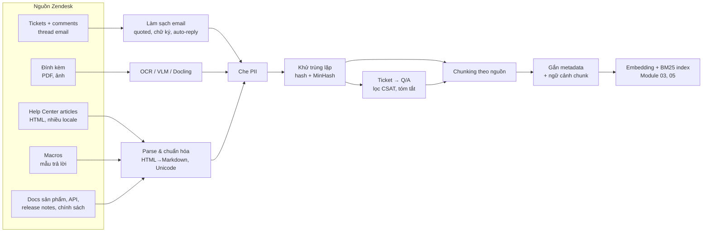
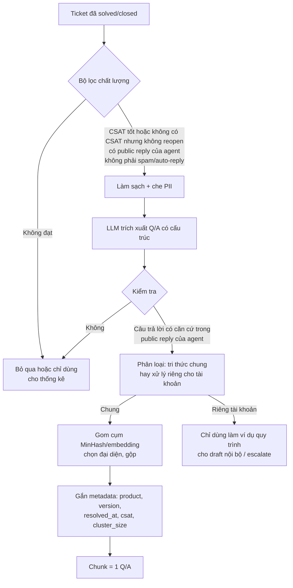
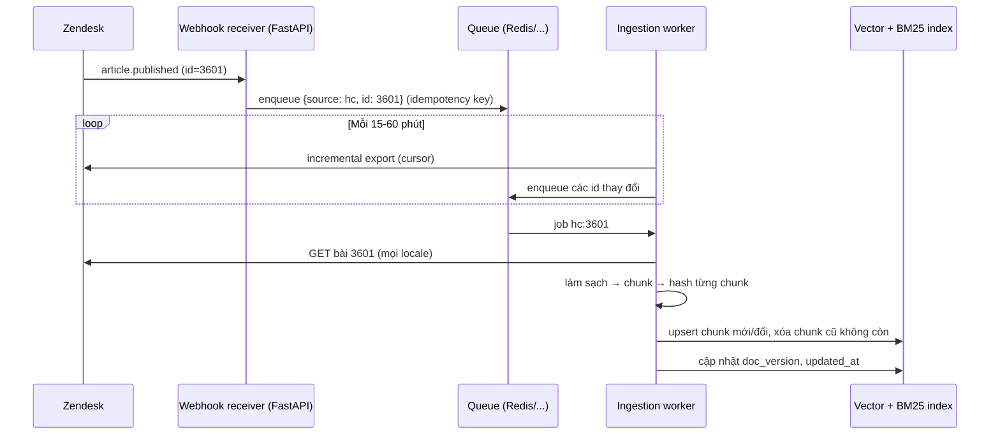

# Module 04 — Ingestion, làm sạch dữ liệu & chunking

> Thời lượng: ~40 phút · Mức độ: Trung bình → Nâng cao · Tiên quyết: Module 02 (pipeline RAG naive, các điểm hỏng), Module 03 (embedding, anisotropy/hubness, đa ngữ)

Rất nhiều lỗi "AI trả lời sai" truy ngược về đây: tài liệu đúng chưa từng vào index, hoặc vào dưới dạng chunk lẫn chữ ký, trích dẫn cũ và câu chào, hoặc là bản lỗi thời. Hai điểm hỏng đầu tiên trong Barnett et al. (2024, Module 02) — "nội dung bị thiếu" và "không nằm trong top-k" — thường bắt nguồn từ ingestion và chunking.

Dữ liệu Zendesk rất "bẩn": quoted reply lồng nhau, chữ ký và disclaimer ba thứ tiếng, auto-reply, ảnh chụp màn hình, PII khắp nơi, 200.000 ticket chất lượng không đều. Module này biến nó thành kho chunk sạch, có metadata, cập nhật tăng dần và xóa được theo yêu cầu.

## Mục tiêu học tập

Sau module này, bạn có thể:

1. Liệt kê các nguồn dữ liệu Zendesk (Help Center, macro, ticket, đính kèm, tài liệu sản phẩm), API dùng để lấy chúng, và các bẫy đặc thù của từng nguồn.
2. Viết bộ làm sạch email đa ngôn ngữ: chuẩn hóa Unicode (NFC/NFKC), tách quoted reply, chữ ký, disclaimer, lọc auto-reply.
3. Giải thích và tính tay MinHash/LSH: chứng minh $\Pr[h_{\min}(A)=h_{\min}(B)] = J(A,B)$, tính phương sai ước lượng và đường cong S của banding để chọn tham số khử trùng lặp.
4. Thiết kế quy trình biến ticket lịch sử thành tri thức (trích Q/A, lọc theo CSAT/độ mới, che PII) và nêu được rủi ro của từng bước.
5. So sánh các chiến lược chunking (fixed, recursive, theo cấu trúc, semantic, parent-child, late chunking, Contextual Retrieval, proposition) bằng một mô hình định lượng đơn giản về precision/recall/chi phí, và chọn chiến lược theo từng nguồn.
6. Thiết kế metadata schema và pipeline cập nhật tăng dần (webhook + incremental export), versioning và xóa dữ liệu (right to be forgotten).

---

## 1. Bức tranh tổng thể: pipeline ingestion



Ba nguyên tắc mình khuyên giữ từ đầu:

1. **Mỗi bước là hàm thuần có phiên bản** (`cleaner_version`, `chunker_version`) — đổi một bước thì biết chunk nào cần tính lại.
2. **Lưu bản thô bất biến**; mọi thứ phía sau tái tạo được từ đó.
3. **Cùng một bộ làm sạch cho dữ liệu index và email đến** — nếu không, phân phối query và tài liệu lệch nhau.

---

## 2. Nguồn dữ liệu Zendesk và cách lấy

### 2.1 Help Center articles

Mỗi bài có `id`, `title`, `body` (HTML), `locale`, `source_locale`, `section_id`, `label_names`, `draft`, `updated_at`, `edited_at`, `user_segment_id` (ai được xem), `permission_group_id`, `html_url`, `outdated` (bản dịch có thể lỗi thời so với bản gốc). Endpoint liệt kê theo locale: `GET /api/v2/help_center/{locale}/articles`; endpoint xuất tăng dần: `GET /api/v2/help_center/incremental/articles?start_time={epoch}` (chỉ agent/admin, tối đa 1.000 bài mỗi trang).

**Bẫy đặc thù:**

- **Bản dịch:** cùng một bài có bản `vi`, `en-us`, `ja`; bản dịch lỗi thời **không được** thắng bản gốc chỉ vì cùng ngôn ngữ với khách (Module 03). Gán `translation_group_id = article_id`.
- **Quyền xem:** `user_segment_id` cho biết bài chỉ dành cho nhóm người dùng nào (ví dụ chỉ agent, chỉ khách gói Enterprise). Bài nội bộ có thể chứa quy trình nội bộ không được lộ cho khách → metadata `visibility`.
- **Draft:** bài nháp không được vào index phục vụ khách.
- **HTML phong phú** (bảng, danh sách bước, code, ảnh): chuyển sang Markdown giữ cấu trúc là tiền đề cho chunking theo heading (mục 8.4).

### 2.2 Macros

Macro là mẫu trả lời của CS: `GET /api/v2/macros` (tối đa 100 bản ghi/trang). Nội dung câu trả lời nằm trong mảng `actions`, ở action có `field = "comment_value"` (hoặc biến thể HTML). Macro thường chứa **placeholder** kiểu `{{ticket.requester.first_name}}` và các action khác (đổi status, gán group, thêm tag).

**Bẫy:** macro trộn câu xã giao, hướng dẫn và *hành động* (macro "Hoàn tiền — đã duyệt" vừa có lời văn vừa đổi trạng thái). Mình khuyên: (1) bỏ câu chào/kết chuẩn trước khi embed (chúng là ứng viên hub — Module 03, mục 6.2); (2) thay placeholder bằng token trung tính `<TÊN_KHÁCH>`; (3) lưu danh sách action trong metadata để tầng generation biết macro này "kéo theo" thay đổi gì; (4) đánh dấu macro chứa chính sách nhạy cảm (giá, hoàn tiền) để guardrail xử lý (Module 07).

### 2.3 Tickets và comments

- Danh sách ticket thay đổi: `GET /api/v2/incremental/tickets/cursor?start_time={epoch}` (cursor-based, khuyến nghị), tối đa 1.000 ticket/trang, giới hạn 10 request/phút cho nhóm endpoint incremental. Mặc định các ticket bị xóa **vẫn xuất hiện** trong luồng (tham số `exclude_deleted` để lọc) — chính là tín hiệu cần cho việc xóa khỏi index (mục 9).
- Comment của một ticket: `GET /api/v2/tickets/{ticket_id}/comments` — mỗi comment có `body`, `html_body`, `plain_body`, `public` (public reply hay internal note), `author_id`, `attachments`, `via` (kênh tạo), `created_at`.
- Hoặc dùng `GET /api/v2/incremental/ticket_events?start_time=...&include=comment_events` để lấy comment theo luồng sự kiện.

**Bẫy:**

- **Internal note** (`public = false`) chứa thảo luận nội bộ, có khi nhạy cảm. Có thể dùng cho *draft gửi agent* nhưng không bao giờ lọt vào câu trả lời gửi khách → `visibility = internal`.
- **Comment của khách qua email** chứa toàn bộ thread cũ (quoted reply) mà Zendesk đã có ở các comment trước → trùng lặp lớn (mục 4).
- **Khối lượng:** 200.000 ticket × 3–4 lượt ≈ 700.000 comment. Danh sách ticket xuất trong cỡ 20 phút (10 request/phút × 1.000 ticket), nhưng lấy comment từng ticket chịu rate limit chung theo gói (Module 11) — backfill đầu có thể mất từ hàng giờ đến vài ngày; chạy nền, có checkpoint.

### 2.4 Đính kèm: PDF và ảnh

Khách hay gửi ảnh chụp màn hình lỗi; tài liệu sản phẩm thường là PDF.

- **PDF có lớp text:** trích text kèm bố cục. Docling (IBM, Auer et al., 2024) là một công cụ mã nguồn mở chuyển PDF/DOCX/HTML sang biểu diễn có cấu trúc (heading, bảng, thứ tự đọc) — hợp để đưa vào chunking theo cấu trúc.
- **Ảnh / PDF scan:** OCR (Tesseract, PaddleOCR — có hỗ trợ tiếng Việt và tiếng Nhật) hoặc **VLM** (vision-language model) để mô tả ảnh. Với ảnh chụp màn hình lỗi, cái cần là *thông điệp lỗi + màn hình nào*, nên một VLM nhỏ được prompt "trích nguyên văn thông báo lỗi, tên màn hình, mã lỗi" thường hữu ích hơn OCR thô.
- **Lưu ý PII:** ảnh chụp màn hình thường chứa email, tên, số tài khoản của khách — phải chạy che PII *sau* OCR/VLM.
- **Chi phí:** chỉ xử lý đính kèm cho ticket đang mở và tài liệu sản phẩm; với ticket lịch sử, bỏ qua ảnh trừ khi đo thấy thiếu thông tin.

### 2.5 Tài liệu sản phẩm, API, release notes, chính sách

Đây là nguồn "có thẩm quyền" (authoritative) nhất cho giá, hoàn tiền, SLA — đúng những chủ đề mà ràng buộc "không bịa chính sách" nhắm tới. Hai thuộc tính quan trọng phải trích được: **phạm vi áp dụng** (sản phẩm, gói dịch vụ, phiên bản) và **thời gian hiệu lực** (`valid_from`, `valid_to`). Release notes cho phép đánh dấu bài HC hoặc Q/A từ ticket cũ là lỗi thời khi tính năng thay đổi.

> **Liên hệ Zendesk.** Thứ tự ưu tiên thẩm quyền mình khuyên dùng khi các nguồn mâu thuẫn: chính sách chính thức > tài liệu sản phẩm/API > Help Center > macro > Q/A trích từ ticket. Ghi thứ hạng này vào metadata `authority_tier` ngay lúc ingest; tầng generation (Module 07) dùng nó để giải quyết mâu thuẫn.

<!-- fig:authority-tiers -->
<figure markdown="span">
  { loading=lazy }
  { loading=lazy }
  <figcaption>Hình 4.1 — Thang thẩm quyền của các nguồn (authority_tier): nguồn càng nhiều về khối lượng thì càng thấp về thẩm quyền.</figcaption>
</figure>
<!-- /fig -->

---

## 3. Làm sạch và chuẩn hóa văn bản

### 3.1 HTML → Markdown có cấu trúc

Bỏ thẻ HTML một cách ngây thơ sẽ làm mất ranh giới heading, gộp các ô bảng thành một dòng vô nghĩa, và trộn chú thích ảnh vào giữa câu. Chuyển sang Markdown giữ lại: heading (`#`, `##`), danh sách, bảng (dạng Markdown), khối code, liên kết (giữ URL vì có thể dẫn chiếu bài HC khác). Bỏ: script/style, menu điều hướng, nút "Bài viết này có hữu ích không?", phần "Bài viết liên quan" (ứng viên hub).

```python
# beautifulsoup4>=4.12, markdownify>=0.13
from bs4 import BeautifulSoup
from markdownify import markdownify as md

DROP_SELECTORS = ["script", "style", "nav", ".article-votes", ".related-articles", ".article-footer"]

def hc_html_to_markdown(html: str) -> str:
    soup = BeautifulSoup(html, "html.parser")
    for sel in DROP_SELECTORS:
        for node in soup.select(sel):
            node.decompose()
    for img in soup.find_all("img"):           # giữ alt text của ảnh như một dòng mô tả
        img.replace_with(f"[Hình: {img.get('alt', '').strip()}]" if img.get("alt") else "")
    text = md(str(soup), heading_style="ATX", bullets="-")
    return "\n".join(line.rstrip() for line in text.splitlines()).strip()
```

### 3.2 Chuẩn hóa Unicode: NFC, NFD, NFKC

**Vấn đề.** Chữ "ệ" có thể là:

- **NFC** (dựng sẵn — precomposed): 1 code point, U+1EC7.
- **NFD** (phân rã — decomposed): 3 code point: `e` (U+0065) + dấu nặng (U+0323) + dấu mũ (U+0302).

"Tiếng Việt" có 10 code point ở NFC, 14 ở NFD. Hiển thị giống hệt nhưng `==` sai, hash khác, token khác → BM25 không khớp, embedding lệch, dedup thất bại. Văn bản từ macOS, một số bộ gõ hoặc PDF hay ở dạng NFD.

<!-- fig:unicode-forms -->
<figure markdown="span">
  { loading=lazy }
  { loading=lazy }
  <figcaption>Hình 4.2 — Trái: cùng một chữ «ệ» ở dạng NFC và NFD. Phải: NFKC gộp các biến thể trình bày — hữu ích cho tiếng Nhật, nhưng cẩn thận với mã lỗi và ký hiệu.</figcaption>
</figure>
<!-- /fig -->

**Định nghĩa (Unicode UAX #15).**

- NFD: phân rã chính tắc (canonical decomposition).
- NFC: phân rã chính tắc rồi hợp lại chính tắc (canonical composition).
- NFKD / NFKC: như trên nhưng dùng phân rã *tương thích* (compatibility), gộp các biến thể trình bày: chữ full-width `ＡＢＣ１２３` → `ABC123`, katakana half-width `ｶﾀｶﾅ` → `カタカナ`, ký tự khoanh tròn `①` → `1`.

**Khuyến nghị:**

| Văn bản | Chuẩn hóa | Lý do |
|---|---|---|
| Tiếng Việt, Anh | **NFC** | Dạng chuẩn phổ biến; tokenizer đa ngữ được huấn luyện chủ yếu trên NFC |
| Tiếng Nhật | **NFKC** cho bản dùng để index/tìm kiếm | Gộp full-width/half-width; người dùng gõ lẫn lộn |
| Mã lỗi, số tiền, code | Cẩn thận với NFKC | NFKC có thể đổi ký tự đặc biệt (ví dụ ký hiệu số mũ `²` → `2`) |

Giữ bản gốc (NFC) để hiển thị/trích dẫn; **dùng chung một hàm chuẩn hóa cho index và email đến.**

**Ký tự vô hình** (U+200B, U+200D, U+FEFF, U+00A0) → bỏ hoặc thay bằng khoảng trắng; chúng còn là kênh giấu prompt injection (Module 07), nên log khi số lượng bất thường.

```python
import unicodedata, re

INVISIBLE = re.compile(r"[\u200b\u200c\u200d\u2060\ufeff]")

def normalize_text(text: str, lang: str | None = None) -> str:
    text = INVISIBLE.sub("", text).replace("\u00a0", " ")
    form = "NFKC" if lang == "ja" else "NFC"
    text = unicodedata.normalize(form, text)
    text = re.sub(r"[ \t]+", " ", text)              # gộp khoảng trắng ngang
    text = re.sub(r"\n{3,}", "\n\n", text)           # tối đa 1 dòng trống liên tiếp
    return text.strip()

s = "Tiếng Việt"
print(len(unicodedata.normalize("NFC", s)), len(unicodedata.normalize("NFD", s)))   # 10 14
print(unicodedata.normalize("NFKC", "ｶﾀｶﾅ ＡＢＣ１２３"))                              # カタカナ ABC123
```

### 3.3 Nhận diện ngôn ngữ

Mỗi tài liệu/chunk cần `language` (filter, chọn chuẩn hóa, chọn analyzer BM25 — Module 05). Email lẫn mã làm bộ nhận diện theo câu dễ sai: nhận diện ở mức **đoạn** (fastText `lid.176`, `lingua`) sau khi bỏ URL, mã lỗi, tên sản phẩm; với tiếng Nhật, tỷ lệ kana/kanji rất đáng tin. Lưu cả `language` (chính) và `languages` (tập xuất hiện); `locale` của requester là tín hiệu phụ.

---

## 4. Làm sạch thread email: quoted reply, chữ ký, disclaimer, auto-reply

### 4.1 Vấn đề

Một comment email của khách ở lượt thứ 3 thường trông như sau:

```text
Dạ em vẫn chưa xuất được hóa đơn ạ, em đã làm theo hướng dẫn nhưng nút Export bị mờ.

Trân trọng,
Nguyễn Văn A
Phòng Kế toán - Công ty ABC
ĐT: 09xx xxx xxx

Vào Th 3, 14 thg 10, 2026 lúc 09:12, Support <support@example.com> đã viết:
> Chào anh A, anh vui lòng vào Settings > Billing > Export...
> ...
>> On Mon, Oct 13, 2026 at 5:40 PM Nguyen Van A wrote:
>> Hi, I can't export invoice PDF...

CONFIDENTIAL: This email and any attachments are intended solely for...
```

Chỉ dòng đầu tiên là *nội dung mới*. Nếu embed nguyên comment, vector bị kéo về phía câu trả lời cũ của agent (trong phần trích dẫn), chữ ký và disclaimer. Hệ quả: truy hồi kém, và tệ hơn — trùng lặp lớn giữa các comment, chữ ký trở thành hub (Module 03, mục 6.2), PII (số điện thoại) lan khắp index.

<!-- fig:email-anatomy -->
<figure markdown="span">
  { loading=lazy }
  { loading=lazy }
  <figcaption>Hình 4.3 — Giải phẫu comment email ở ví dụ mục 4.1: chỉ một dòng là nội dung mới, phần còn lại phải cắt trước khi embed.</figcaption>
</figure>
<!-- /fig -->

### 4.2 Tách quoted reply

**Dấu hiệu nhận biết (heuristic):**

1. Dòng bắt đầu bằng `>` (một hoặc nhiều cấp).
2. **Dòng tiêu đề trích dẫn** do mail client sinh ra, khác nhau theo ngôn ngữ:
   - Tiếng Anh: `On <ngày>, <người> wrote:`; Outlook: `-----Original Message-----`, khối `From: … Sent: … To: … Subject: …`.
   - Tiếng Việt (Gmail): `Vào <ngày> lúc <giờ>, <người> đã viết:`.
   - Tiếng Nhật: các mẫu như `<日付> <名前> <email>:` hoặc `…さんは書きました:`; Outlook tiếng Nhật dùng khối `差出人: … 送信日時: … 宛先: … 件名: …`.
3. Đường kẻ phân cách (`________________`, `---`).

**Thuật toán:** duyệt từ trên xuống, gặp dòng tiêu đề trích dẫn hoặc dòng `>` đầu tiên thì cắt phần sau. Thư viện `talon` (Mailgun) làm việc này cho email text/HTML, kèm nhận diện chữ ký bằng luật và học máy; mẫu tiếng Việt/Nhật cần bổ sung.

**Lợi thế riêng của Zendesk:** các lượt trước đã nằm trong comment trước của cùng ticket, nên đoạn nào **trùng (gần) nguyên văn** với comment trước gần như chắc chắn là trích dẫn → cắt (so khớp chuỗi con hoặc shingle Jaccard, mục 5).

### 4.3 Chữ ký và disclaimer

- **Chữ ký:** nằm ở cuối phần nội dung mới, mở đầu bằng các mẫu chào kết (`Trân trọng`, `Thanks`, `Best regards`, `よろしくお願いいたします`, `以上`), hoặc dấu `-- ` (chuẩn chữ ký email), theo sau là vài dòng ngắn chứa tên, chức danh, số điện thoại, URL.
- **Disclaimer pháp lý:** khối văn bản dài, lặp lại y hệt ở hàng nghìn email của cùng một công ty khách hàng. Cách hiệu quả nhất: **học từ dữ liệu** — đếm tần suất các đoạn (paragraph hash) trên toàn kho ticket; đoạn nào xuất hiện ở hơn, ví dụ, 50 ticket khác nhau và không phải do agent viết thì gần như chắc chắn là boilerplate → đưa vào danh sách loại trừ.
- **Tiếng Nhật:** `よろしくお願いいたします` gần như luôn có, đôi khi cùng dòng với nội dung thật — chỉ cắt *dòng chỉ chứa câu kết*.

### 4.4 Auto-reply và thư hệ thống

RFC 3834 định nghĩa header `Auto-Submitted` với các giá trị `auto-replied` (trả lời tự động cho một thư), `auto-generated` (thư do quy trình tự động sinh ra) và `no` (do người gửi). Thư vắng mặt (out-of-office), thông báo bounce, thư từ hệ thống giám sát của khách… phải được nhận diện để: (1) không đưa vào kho tri thức; (2) **không để AI trả lời** (tránh vòng lặp hai bot trả lời nhau). Tín hiệu: header `Auto-Submitted`, `X-Autoreply`, `Precedence: bulk/auto_reply` (khi có trong metadata email Zendesk lưu lại), địa chỉ `mailer-daemon@`/`noreply@`, các mẫu tiêu đề "Out of Office", "自動返信", "Trả lời tự động". Trường `via` của comment cho biết kênh tạo ra nó.

### 4.5 Code: bộ làm sạch email tối thiểu

```python
import re

QUOTE_HEADERS = [
    r"^On .{5,200} wrote:\s*$",                                  # Gmail EN
    r"^Vào .{5,200} đã viết:\s*$",                               # Gmail VI
    r"^-{2,}\s*Original Message\s*-{2,}\s*$",                    # Outlook EN
    r"^(From|差出人|Từ):\s.+$",                                   # khối header Outlook (dòng đầu)
    r"^.{0,80}(さんは書きました|wrote)[:：]\s*$",                  # mẫu JA/EN khác
]
SIGNOFF = [r"^(Trân trọng|Thân ái|Cảm ơn|Thanks|Thank you|Best regards|Regards|Cheers)[,.!]?\s*$",
           r"^(よろしくお願いいたします|よろしくお願いします|以上)[。.]?\s*$", r"^-- $"]
QUOTE_RE = re.compile("|".join(QUOTE_HEADERS), re.IGNORECASE)
SIGN_RE = re.compile("|".join(SIGNOFF), re.IGNORECASE)

def strip_email(body: str, prev_comments: list[str], boilerplate: set[str]) -> str:
    lines = body.splitlines()
    out = []
    for line in lines:
        s = line.strip()
        if s.startswith(">") or QUOTE_RE.match(s):
            break                                   # từ đây trở xuống là phần trích dẫn
        out.append(line)
    # Cắt chữ ký: tìm dòng chào kết cuối cùng nằm trong 8 dòng cuối
    for i in range(len(out) - 1, max(-1, len(out) - 9), -1):
        if SIGN_RE.match(out[i].strip()):
            out = out[:i]
            break
    # Bỏ đoạn boilerplate đã học được (disclaimer) và đoạn trùng comment trước
    paras = [p.strip() for p in "\n".join(out).split("\n\n") if p.strip()]
    prev = "\n".join(prev_comments)
    paras = [p for p in paras if hash(p) not in boilerplate and not (len(p) > 40 and p in prev)]
    return "\n\n".join(paras)
```

Code cố ý đơn giản; thực tế cần **tập kiểm thử 100–200 email thật** (đã che PII) ba ngôn ngữ có nhãn "nội dung mới". Lỗi nguy hiểm nhất là **cắt mất nội dung thật** (inline reply xen giữa trích dẫn) — khi nghi ngờ, giữ lại.

> **Liên hệ Zendesk.** Bộ làm sạch dùng cả offline (ticket lịch sử) lẫn online (email mới trước khi tạo query — Module 06). Đặt nó thành package riêng có test, có phiên bản, và log "tỷ lệ độ dài bị cắt" để phát hiện bất thường (ví dụ mẫu email mới khiến bộ cắt xóa sạch nội dung).

---

## 5. Khử trùng lặp: exact hash, MinHash/LSH, SimHash

### 5.1 Vấn đề

Kho Zendesk đầy (gần) trùng lặp: hàng nghìn ticket "quên mật khẩu", một câu trả lời macro gửi hàng chục nghìn lần, bài HC sao chép giữa các section. Hậu quả:

- **Truy hồi:** top-$k$ bị chiếm bởi 5 bản gần giống nhau của cùng một nội dung → mất đa dạng, bỏ sót tài liệu thứ hai cần thiết.
- **Huấn luyện/fine-tune:** false negative khi mine hard negative (Module 03, mục 3.5); Lee et al. (2021) cũng chỉ ra khử trùng lặp dữ liệu giúp language model học tốt hơn và ít "học thuộc" hơn.
- **Đánh giá:** rò rỉ giữa tập đánh giá và kho (Module 03, mục 11.1).

Trùng lặp chính xác giải quyết bằng hash (SHA-256 của văn bản đã chuẩn hóa). Phần khó là **gần trùng lặp** — và so sánh từng cặp là bất khả: 200.000 ticket cho khoảng $2\times 10^{10}$ cặp.

### 5.2 Shingle và độ tương đồng Jaccard

Biểu diễn mỗi văn bản thành một **tập shingle** — các $n$-gram liên tiếp (theo từ, hoặc theo ký tự cho tiếng Nhật vì không có khoảng trắng). Độ tương đồng Jaccard:

$$
J(A,B) = \frac{|A\cap B|}{|A\cup B|} \in [0,1].
$$

**Ví dụ số.** Shingle 2 từ:

- $A$ = "tôi không đăng nhập được vào tài khoản" → {tôi không, không đăng, đăng nhập, nhập được, được vào, vào tài, tài khoản} (7 phần tử).
- $B$ = "tôi không đăng nhập được vào hệ thống" → {tôi không, không đăng, đăng nhập, nhập được, được vào, vào hệ, hệ thống} (7 phần tử).
- $|A\cap B| = 5$, $|A\cup B| = 9$ → $J = 5/9 \approx 0.556$.

<!-- fig:jaccard-shingles -->
<figure markdown="span">
  { loading=lazy }
  { loading=lazy }
  <figcaption>Hình 4.4 — Tập shingle 2 từ của hai câu ở ví dụ mục 5.2 và độ tương đồng Jaccard.</figcaption>
</figure>
<!-- /fig -->

### 5.3 MinHash: ước lượng Jaccard bằng một chữ ký ngắn

**Ý tưởng (Broder, 1997).** Lấy một hoán vị ngẫu nhiên $\pi$ của không gian shingle. Định nghĩa $h_\pi(A) = \min_{x\in A}\pi(x)$ — phần tử "nhỏ nhất" của $A$ theo thứ tự ngẫu nhiên.

**Mệnh đề.** $\Pr_\pi\big[h_\pi(A) = h_\pi(B)\big] = J(A,B)$.

**Chứng minh.** Xét phần tử $x^\ast$ có $\pi$ nhỏ nhất trong $A\cup B$. Vì $\pi$ là hoán vị ngẫu nhiên đều, $x^\ast$ có xác suất như nhau là bất kỳ phần tử nào của $A\cup B$. Nếu $x^\ast\in A\cap B$ thì nó là phần tử nhỏ nhất của cả $A$ lẫn $B$, nên $h_\pi(A)=h_\pi(B)$. Nếu $x^\ast$ chỉ thuộc một tập, chẳng hạn $A\setminus B$, thì $h_\pi(A)=\pi(x^\ast)$ còn $h_\pi(B) > \pi(x^\ast)$, nên khác nhau. Vậy xác suất bằng $|A\cap B|/|A\cup B|$. $\square$

**Chữ ký MinHash.** Dùng $k$ hàm băm độc lập $h_1,\dots,h_k$ (xấp xỉ hoán vị ngẫu nhiên bằng hàm băm phổ quát). Chữ ký của $A$ là vector $\big(h_1(A),\dots,h_k(A)\big)$. Ước lượng

$$
\hat J = \frac{1}{k}\sum_{i=1}^{k}\mathbb{1}\big[h_i(A)=h_i(B)\big].
$$

Mỗi số hạng là biến Bernoulli với tham số $J$, nên $\mathbb{E}[\hat J] = J$ và $\mathrm{Var}(\hat J) = \frac{J(1-J)}{k}$.

**Ví dụ số.** Với $J=0.7$: $k=64$ → độ lệch chuẩn $\sqrt{0.21/64}\approx 0.057$; $k=128$ → $0.041$; $k=256$ → $0.029$. Nghĩa là với $k=128$, ước lượng thường nằm trong khoảng $0.7\pm 0.08$ (khoảng 2 độ lệch chuẩn). Đủ để phân biệt "gần trùng" (0.8+) với "cùng chủ đề" (0.3–0.5), nhưng không đủ để đặt ngưỡng tinh ở 0.70 so với 0.75.

<!-- fig:minhash-variance -->
<figure markdown="span">
  { loading=lazy }
  { loading=lazy }
  <figcaption>Hình 4.5 — Trái: độ lệch chuẩn của ước lượng MinHash giảm theo 1/√k. Phải: với k = 128, phân phối Ĵ (mô phỏng) của các cặp J = 0.5, 0.7, 0.85 tách nhau rõ, nhưng vẫn chồng lấn ở mức sai khác 0.05.</figcaption>
</figure>
<!-- /fig -->

### 5.4 LSH banding: tìm ứng viên mà không so mọi cặp

**Ý tưởng.** Chia chữ ký $k$ số thành $b$ **băng (band)**, mỗi băng $r$ số ($k = b\cdot r$). Băm mỗi băng vào một bucket. Hai văn bản trở thành **ứng viên** nếu trùng hoàn toàn ở ít nhất một băng. Chỉ so sánh chính xác các cặp ứng viên.

**Toán.** Với hai tập có Jaccard $s$: xác suất trùng *cả* $r$ số trong một băng là $s^r$; xác suất không trùng băng nào là $(1-s^r)^b$. Vậy

$$
P_{\text{ứng viên}}(s) = 1 - \big(1 - s^r\big)^b .
$$

Đây là một **đường cong chữ S**, với điểm chuyển xấp xỉ tại $s^\ast \approx (1/b)^{1/r}$.

**Ví dụ số với $k=128$:**

| $(b, r)$ | Ngưỡng $s^\ast$ | $P(0.5)$ | $P(0.7)$ | $P(0.8)$ | $P(0.9)$ |
|---|---|---|---|---|---|
| (32, 4) | 0.42 | 0.873 | ≈1.000 | ≈1.000 | ≈1.000 |
| (16, 8) | 0.71 | 0.061 | 0.613 | 0.947 | ≈1.000 |
| (8, 16) | 0.88 | ≈0.000 | 0.026 | 0.204 | 0.806 |

Cách tính một ô, $(16,8)$ tại $s=0.8$: $0.8^8 = 0.168$; $1-0.168=0.832$; $0.832^{16}\approx 0.053$; $P = 0.947$.

**Đọc bảng:** để bắt cặp $J\ge 0.8$ mà ít ứng viên ở $J\approx 0.5$, chọn $(16, 8)$: bắt 95% cặp $J=0.8$, chỉ 6% cặp $J=0.5$ thành ứng viên. Muốn ít bỏ sót hơn, tăng $b$ (dịch ngưỡng sang trái) — đổi lại nhiều ứng viên hơn. `datasketch` (`MinHashLSH(threshold=..., num_perm=...)`) tự chọn $(b,r)$ theo ngưỡng.

<!-- fig:lsh-s-curve -->
<figure markdown="span">
  { loading=lazy }
  { loading=lazy }
  <figcaption>Hình 4.6 — Xác suất thành ứng viên 1 − (1 − sʳ)ᵇ cho ba cách chia băng của bảng mục 5.4; đường chấm là ngưỡng s* ≈ (1/b)^(1/r).</figcaption>
</figure>
<!-- /fig -->

### 5.5 SimHash (so sánh ngắn)

SimHash (Charikar, 2002) dùng đúng ý tưởng "dấu của phép chiếu ngẫu nhiên" ở Module 03, mục 7.4, nhưng trên vector đặc trưng có trọng số (ví dụ TF-IDF của token): mỗi văn bản thành một dấu vân tay 64 bit, và Hamming nhỏ ⇔ cosine lớn. Manku et al. (WWW 2007) dùng nó cho phát hiện trang web gần trùng ở quy mô web. Khác biệt: **MinHash xấp xỉ Jaccard trên tập** (nhạy với việc chia sẻ đoạn văn), **SimHash xấp xỉ cosine trên vector trọng số** (nhạy với phân phối từ). Với ticket và bài HC, MinHash trên shingle từ/ký tự thường dễ hiệu chỉnh hơn.

### 5.6 Dùng kết quả khử trùng lặp thế nào?

Không phải lúc nào cũng *xóa*. Với Zendesk:

- **Bài HC trùng:** giữ bản mới nhất, các bản khác vào `duplicate_of`.
- **Ticket gần trùng:** gom **cụm**, giữ 1–3 đại diện tốt nhất (mục 7), lưu `cluster_id`, `cluster_size` — cụm lớn là tín hiệu nên viết bài HC.
- **Đoạn lặp lại khắp nơi** (disclaimer, chữ ký, câu chào): đưa vào danh sách boilerplate cho bộ làm sạch (mục 4.3).

```python
# datasketch>=1.6
from datasketch import MinHash, MinHashLSH

def shingles(text: str, lang: str, n: int = 3) -> set[str]:
    if lang == "ja":                          # tiếng Nhật: n-gram ký tự
        t = text.replace(" ", "")
        return {t[i:i + n] for i in range(max(1, len(t) - n + 1))}
    w = text.lower().split()                  # Việt/Anh: n-gram từ (âm tiết với tiếng Việt)
    return {" ".join(w[i:i + n]) for i in range(max(1, len(w) - n + 1))}

def minhash(sh: set[str], k: int = 128) -> MinHash:
    m = MinHash(num_perm=k)
    for s in sh:
        m.update(s.encode("utf-8"))
    return m

lsh = MinHashLSH(threshold=0.8, num_perm=128)
sigs = {}
for doc_id, text, lang in corpus:             # corpus: (id, văn bản đã làm sạch & chuẩn hóa, ngôn ngữ)
    sigs[doc_id] = minhash(shingles(text, lang))
    lsh.insert(doc_id, sigs[doc_id])

near_dups = {d: [c for c in lsh.query(m) if c != d] for d, m in sigs.items()}
```

---

## 6. Che PII (PII redaction)

### 6.1 Vấn đề và nguyên tắc

Email chứa tên, email, số điện thoại, địa chỉ, số định danh, số thẻ, đôi khi cả mật khẩu gửi nhầm. Ràng buộc: **không lộ dữ liệu khách khác**. Nếu chunk từ ticket của khách X được truy hồi khi trả lời khách Y, LLM có thể chép số điện thoại của X vào email gửi Y. Embedding cũng không phải "băm một chiều": Morris et al. (2023) khôi phục được phần lớn văn bản ngắn từ embedding.

Nguyên tắc mình khuyên:

1. **Che PII trước khi bất cứ thứ gì rời khỏi vùng lưu trữ thô**: trước khi embed, trước khi đưa vào BM25, trước khi gửi tới API LLM bên ngoài, trước khi ghi log.
2. **Kho tri thức dùng chung (HC, macro, Q/A từ ticket) không được chứa PII của bất kỳ khách nào.** Thông tin cá nhân hóa (tên khách, gói dịch vụ) lấy *tại thời điểm trả lời* từ API Zendesk cho đúng requester, không lấy từ index.
3. **Thay bằng placeholder có kiểu và nhất quán trong phạm vi tài liệu**: `<EMAIL_1>`, `<PHONE_1>`, `<PERSON_2>`, để LLM vẫn hiểu cấu trúc ("khách gửi lại từ <EMAIL_2> thay vì <EMAIL_1>").
4. **Ưu tiên recall hơn precision** khi phát hiện PII trong dữ liệu đi vào kho dùng chung: che nhầm một từ thường thiệt hại ít hơn lộ một số điện thoại.

Khung pháp lý và chính sách lưu trữ: Module 11.

<!-- fig:pii-redaction -->
<figure markdown="span">
  { loading=lazy }
  { loading=lazy }
  <figcaption>Hình 4.7 — Che PII bằng placeholder có kiểu và nhất quán trong tài liệu; chuỗi số không qua kiểm tra Luhn được giữ nguyên.</figcaption>
</figure>
<!-- /fig -->

### 6.2 Kỹ thuật phát hiện

| Loại PII | Kỹ thuật | Ghi chú cho Việt/Nhật |
|---|---|---|
| Email, URL có token | Regex | Ổn định |
| Số điện thoại | Regex theo quốc gia + chuẩn hóa | VN: di động 10 số bắt đầu bằng 0 (hoặc +84); JP: 0X0-XXXX-XXXX, +81 |
| Số thẻ thanh toán | Regex 13–19 chữ số + **kiểm tra Luhn** | Giảm false positive mạnh |
| Số định danh | Regex độ dài + ngữ cảnh ("CCCD", "CMND", "マイナンバー") | Số 12 chữ số rất dễ nhầm với mã đơn hàng → cần từ khóa ngữ cảnh |
| Tên người, địa chỉ | NER (model đa ngữ, hoặc model NER tiếng Việt tự huấn luyện) | Tên tiếng Việt viết không dấu, tên Nhật kanji khó; dùng thêm danh sách tên từ trường requester/organization của chính ticket |
| Bí mật (API key, mật khẩu) | Regex theo mẫu khóa + entropy cao | Khách hay dán API key vào email khi báo lỗi |

**Kiểm tra Luhn — ví dụ tính tay.** Số `79927398713`. Từ phải sang trái, nhân đôi mỗi chữ số ở vị trí chẵn (thứ 2, 4, …) và trừ 9 nếu kết quả > 9:

- Chữ số (phải → trái): 3, 1, 7, 8, 9, 3, 7, 2, 9, 9, 7.
- Vị trí chẵn: 1→2, 8→16→7, 3→6, 2→4, 9→18→9.
- Tổng: $3 + 2 + 7 + 7 + 9 + 6 + 7 + 4 + 9 + 9 + 7 = 70$. Chia hết cho 10 → hợp lệ.

Chuỗi số ngẫu nhiên chỉ có xác suất 1/10 qua Luhn → loại ~90% mã đơn hàng bị nhận nhầm.

<!-- fig:luhn-check -->
<figure markdown="span">
  { loading=lazy }
  { loading=lazy }
  <figcaption>Hình 4.8 — Tính tay kiểm tra Luhn cho số 79927398713: các chữ số ở vị trí chẵn (cam) được nhân đôi và trừ 9 nếu lớn hơn 9.</figcaption>
</figure>
<!-- /fig -->

**Presidio** (mã nguồn mở) gồm *Analyzer* (regex, NER, luật, checksum, ngữ cảnh) và *Anonymizer*; cắm được model NER riêng cho Việt/Nhật. Chính tài liệu dự án lưu ý không bảo đảm bắt mọi PII — cần thêm kiểm tra đầu ra (Module 07).

### 6.3 Code: che PII nhất quán theo tài liệu

```python
import re

PATTERNS = {   # thứ tự quan trọng: CARD trước PHONE để regex điện thoại không "ăn" mất số thẻ
    "EMAIL": r"[\w.+-]+@[\w-]+\.[\w.-]+",
    "CARD":  r"\b(?:\d[ -]?){13,19}\b",
    "PHONE": r"(?:\+84|\+81|0)\d{1,3}[\s.-]?\d{3,4}[\s.-]?\d{3,4}",
}

def luhn_ok(num: str) -> bool:
    digits = [int(c) for c in num if c.isdigit()][::-1]
    total = sum(d if i % 2 == 0 else (d * 2 - 9 if d * 2 > 9 else d * 2) for i, d in enumerate(digits))
    return total % 10 == 0

def redact(text: str, extra_names: list[str] = ()) -> tuple[str, dict]:
    mapping, counters = {}, {}
    def sub(kind, value):
        if value not in mapping:                       # nhất quán: cùng giá trị -> cùng placeholder
            counters[kind] = counters.get(kind, 0) + 1
            mapping[value] = f"<{kind}_{counters[kind]}>"
        return mapping[value]
    for kind, pat in PATTERNS.items():
        def repl(m, kind=kind):
            v = m.group(0)
            if kind == "CARD" and not luhn_ok(v):
                return v                               # không qua Luhn -> có thể là mã đơn hàng
            return sub(kind, v)
        text = re.sub(pat, repl, text)
    for name in sorted(extra_names, key=len, reverse=True):   # tên requester/agent lấy từ Zendesk
        if name:
            text = re.sub(re.escape(name), lambda m: sub("PERSON", m.group(0)), text, flags=re.I)
    return text, {v: k for k, v in mapping.items()}           # mapping ngược: lưu trong vault, không index

print(luhn_ok("79927398713"))   # True
```

Mapping ngược (placeholder → giá trị thật) nếu cần giữ thì lưu ở kho riêng có kiểm soát truy cập, **không bao giờ** nằm trong index, prompt hay log.

> **Liên hệ Zendesk.** Đồ án NER của bạn có đất dụng võ ở đây: model NER tiếng Việt cho tên người/tổ chức/địa chỉ, kết hợp với tên lấy trực tiếp từ trường `requester`, `organization` của chính ticket (độ chính xác gần 100% cho tên khách và agent). Đánh giá bộ che PII bằng recall theo loại thực thể trên 200 email gán nhãn tay; theo dõi số placeholder trung bình mỗi chunk trong production để phát hiện trôi dạt.

---

## 7. Biến ticket lịch sử thành tri thức

### 7.1 Vấn đề

200.000 ticket đã giải quyết chứa những vấn đề Help Center chưa từng viết. Nhưng đưa nguyên thread vào index là sai lầm: thread dài và nhiều lượt đoán sai; chất lượng không đều (trả lời sai, reopen, lỗi thời); chứa PII; và có câu trả lời chỉ đúng *cho riêng khách đó* ("em đã hoàn tiền cho anh") — dùng làm tri thức chung thì AI sẽ hứa hoàn tiền với khách khác, vi phạm ràng buộc "không bịa chính sách".

### 7.2 Quy trình đề xuất



**Bộ lọc chất lượng (gợi ý):** solved/closed; có public reply của agent; không reopen trong 7 ngày; CSAT "good" hoặc không đánh giá (đa số ticket không có CSAT); không thuộc group nhạy cảm.

**Trọng số chất lượng và độ mới.** Thay vì lọc cứng theo tuổi, gán trọng số dùng khi xếp hạng hoặc chọn đại diện cụm:

$$
w = q_{\text{csat}} \cdot \exp\!\Big(-\frac{\Delta t}{T}\Big),
$$

với $q_{\text{csat}}\in\{1 \text{ (good)}, 0.5 \text{ (không đánh giá)}, 0 \text{ (bad)}\}$, $\Delta t$ là số ngày từ khi giải quyết, $T$ là "thời gian sống" đặc trưng (ví dụ 365 ngày — chọn theo nhịp phát hành sản phẩm). Ví dụ: ticket CSAT tốt cách đây 30 ngày: $w = e^{-30/365}\approx 0.92$; CSAT tốt cách đây 400 ngày: $w\approx 0.33$; không đánh giá, 30 ngày: $w\approx 0.46$. Release note nói tính năng đã đổi thì đặt $w=0$ cho các Q/A liên quan, bất kể tuổi.

<!-- fig:ticket-weight-decay -->
<figure markdown="span">
  { loading=lazy }
  { loading=lazy }
  <figcaption>Hình 4.9 — Trọng số w = q_csat · exp(−Δt/T) với T = 365 ngày và ba ví dụ của mục 7.2.</figcaption>
</figure>
<!-- /fig -->

**Trích xuất Q/A bằng LLM (schema đầu ra):**

```json
{
  "question": "Câu hỏi đã khái quát hóa, không chứa PII, ngôn ngữ gốc của khách",
  "answer": "Các bước/giải thích cuối cùng đã giải quyết vấn đề, tóm từ public reply của agent",
  "resolution_type": "general_howto | bug_workaround | account_specific_action | policy_explanation",
  "product": "billing", "feature": "invoice_export", "version_hint": "4.x",
  "conditions": "Chỉ áp dụng cho gói Pro trở lên",
  "evidence_comment_ids": [123, 125],
  "confidence": 0.0
}
```

Ba điểm then chốt: (1) `evidence_comment_ids` buộc LLM chỉ ra comment nào là căn cứ — kiểm tra lại tự động rằng nội dung `answer` thực sự có trong các comment đó (so khớp n-gram hoặc NLI — Module 07); (2) `resolution_type = account_specific_action` (hoàn tiền thủ công, sửa dữ liệu tài khoản) **không** vào kho tri thức trả lời khách; (3) câu hỏi được *khái quát hóa* và che PII, nhưng giữ thuật ngữ, mã lỗi gốc của khách (đó là cách khách thật sẽ hỏi).

**Chi phí (ước lượng):** 200.000 ticket × ~1.500 token ≈ 300 triệu token đầu vào một lần — chấp nhận được với model nhỏ self-host hoặc API batch; chạy thử 1.000 ticket và cho người đánh giá 100 Q/A trước.

### 7.3 Từ cụm Q/A đến FAQ chuẩn và phân tích khoảng trống

Gom các Q/A tương tự (MinHash trên câu hỏi + embedding, mục 5), chọn đại diện có $w$ cao nhất hoặc cho LLM **gộp** cụm thành một Q/A chuẩn kèm danh sách biến thể câu hỏi (các biến thể này rất quý cho fine-tune embedding — Module 09). Cụm lớn mà không có bài HC tương ứng là **khoảng trống tri thức** → gửi cho team nội dung viết bài HC chính thức.

> **Liên hệ Zendesk.** Q/A từ ticket có `authority_tier` thấp nhất. Khi Q/A mâu thuẫn với bài HC hoặc chính sách, nguồn có thẩm quyền cao hơn thắng (Module 07). Và mọi Q/A thuộc chủ đề giá/hoàn tiền/SLA nên được đánh dấu `requires_policy_check = true`: AI không bao giờ được trả lời các chủ đề này chỉ dựa trên Q/A từ ticket.

---

## 8. Chunking

### 8.1 Vì sao phải chunk, và đơn vị đo

Ba lý do: model embedding có giới hạn ngữ cảnh (512 token với multilingual-e5 — Module 03); một vector cho cả bài dài bị "pha loãng" (mục 8.2); ngân sách context của LLM có hạn và dễ "lost in the middle" (Module 02).

**Đo kích thước chunk bằng token của tokenizer model embedding**, không bằng ký tự: cùng số ký tự, Anh/Việt/Nhật cho số token rất khác (Module 01), và chunk tiếng Nhật có thể bị cắt cụt âm thầm.

### 8.2 Mô hình định lượng đơn giản cho kích thước chunk

Ký hiệu: $s$ là kích thước chunk (token), $o$ là phần chồng lấn (overlap), bước trượt $g = s - o$; $\ell$ là độ dài đoạn chứa câu trả lời (answer span); $u$ là độ dài trung bình của một "chủ đề" liền mạch trong tài liệu (ví dụ một mục H2); $B$ là ngân sách token context cho LLM. Bốn hiệu ứng:

**(a) Câu trả lời bị cắt đôi.** Giả sử vị trí bắt đầu của span phân bố đều. Span nằm trọn trong ít nhất một chunk khi vị trí bắt đầu, tính theo modulo $g$, rơi vào một khoảng dài $s-\ell$. Do đó

$$
P_{\text{trọn}}(s,o) = \min\Big(1,\ \frac{s-\ell}{s-o}\Big) \quad (\ell \le s).
$$

Chunk lớn và overlap lớn làm giảm rủi ro cắt đôi.

**(b) Pha loãng ngữ nghĩa.** Nếu chunk chứa $m \approx s/u$ chủ đề, và (mô hình hóa thô) embedding là trung bình của $m$ vector chủ đề đơn vị trực giao nhau, thì cosine giữa chunk và một query chỉ hỏi về một chủ đề là

$$
\cos = \frac{1}{\sqrt{m}} = \sqrt{u/s}\quad(s\ge u).
$$

*Dẫn xuất:* $\mathbf{c} = \frac1m\sum_{j=1}^m \mathbf{t}_j$, $\|\mathbf{c}\| = \frac{1}{m}\sqrt{m} = \frac{1}{\sqrt m}$; $\mathbf{q}=\mathbf{t}_1$ nên $\mathbf{q}^\top\mathbf{c}=\frac1m$; $\cos = \frac{1/m}{1/\sqrt m}=\frac{1}{\sqrt m}$. Chunk lớn → điểm thấp → khó lọt top-$k$ khi cạnh tranh với chunk nhỏ, "thuần" một chủ đề.

**(c) Độ chính xác của context.** Tỷ lệ token hữu ích trong một chunk được truy hồi đúng là $\ell/s$. Chunk lớn → LLM đọc nhiều token thừa (tốn tiền, dễ nhiễu).

**(d) Độ phủ.** Với ngân sách $B$, LLM nhận được $k = B/s$ chunk. Email có 2–3 câu hỏi con cần 2–3 chunk khác nhau; $k$ nhỏ làm tăng rủi ro thiếu một phần.

**Ví dụ số:** $\ell = 60$, $u = 200$, $o = 40$, $B = 4.000$ token.

| $s$ | $P_{\text{trọn}}$ | $\cos$ pha loãng | Độ chính xác $\ell/s$ | Số chunk $k=B/s$ | Lưu trữ thừa $s/g$ |
|---|---|---|---|---|---|
| 100 | 0.67 | 1.00 (nhưng mất ngữ cảnh) | 0.60 | 40 | 1.67× |
| 200 | 0.88 | 1.00 | 0.30 | 20 | 1.25× |
| 400 | 0.94 | 0.71 | 0.15 | 10 | 1.11× |
| 800 | 0.97 | 0.50 | 0.075 | 5 | 1.05× |

Cách tính hàng $s=400$: $P=(400-60)/(400-40)=340/360\approx 0.94$; $m=2$ → $\cos=1/\sqrt2\approx0.71$; $60/400=0.15$; $4000/400=10$; $400/360\approx1.11$.

**Đọc bảng:** không có kích thước tối ưu tuyệt đối; điểm ngọt thường quanh **một đơn vị ngữ nghĩa** ($s\approx u$). Chunk quá nhỏ có cosine "đẹp" nhưng mất ngữ cảnh ("Bấm nút này để xuất" — nút nào, sản phẩm nào?) — vấn đề mà heading path, parent-child và Contextual Retrieval giải quyết (mục 8.4–8.8). Mô hình còn gợi ý: **cắt theo ranh giới chủ đề** (heading) loại bỏ được cả (a) lẫn (b) mà không cần tăng overlap.

<!-- fig:chunk-size-model -->
<figure markdown="span">
  { loading=lazy }
  { loading=lazy }
  <figcaption>Hình 4.10 — Bốn hiệu ứng của mô hình định lượng mục 8.2 vẽ liên tục theo s; các điểm là những hàng của bảng ví dụ.</figcaption>
</figure>
<!-- /fig -->

Thực nghiệm khớp trực giác: báo cáo của Chroma (Smith & Troynikov, 7/2024) đo ở mức token và thấy chunk ~200 token không overlap thường tốt hơn 800 token overlap 400.

### 8.3 Fixed-size + overlap và recursive splitting

**Fixed-size:** cắt mỗi $s$ token, chồng lấn $o$ token. Đơn giản, dự đoán được chi phí, nhưng cắt giữa câu, giữa bảng, giữa khối code.

**Recursive splitting:** thử tách bằng dấu phân cách "thô" nhất trước, chỉ xuống cấp mịn hơn khi một mảnh vẫn quá lớn: `\n## ` → `\n### ` → đoạn trống `\n\n` → xuống dòng → dấu kết câu (`. ` `? ` `! ` và `。` `？` `！` cho tiếng Nhật) → khoảng trắng. Sau đó gộp các mảnh nhỏ liền kề cho tới gần $s$. Đây là baseline mình khuyên dùng đầu tiên cho mọi văn bản không có cấu trúc rõ.

**Ví dụ số (số chunk):** bài dài $L = 2.600$ token, $s=400$, $o=80$ → bước $g=320$, số chunk $=\lceil (L-o)/g\rceil = \lceil 2520/320\rceil = 8$, tổng token lưu $8\times400=3.200$ (thừa 23%).

<!-- fig:fixed-overlap -->
<figure markdown="span">
  { loading=lazy }
  { loading=lazy }
  <figcaption>Hình 4.11 — Fixed-size + overlap trên tài liệu 2.600 token: 8 cửa sổ, phần cam là token bị lưu lặp.</figcaption>
</figure>
<!-- /fig -->

**Khi nào không dùng:** tài liệu có heading tốt (dùng mục 8.4); bảng giá (giữ nguyên bảng).

### 8.4 Chunking theo cấu trúc (heading-aware)

Bài HC có sẵn cấu trúc (H2 "Điều kiện", "Các bước", "Lỗi thường gặp"…). Cắt theo H2/H3, mỗi chunk mang **heading path** — ngữ cảnh rẻ, xác định, không cần LLM:

```text
[Help Center > Thanh toán > Xuất hóa đơn PDF > Lỗi thường gặp]
Nếu nút Export bị mờ, kiểm tra quyền "Billing admin" của tài khoản...
```

Quy tắc: không cắt giữa bảng, khối code, danh sách bước; mục quá dài thì recursive split bên trong và lặp heading path; mục quá ngắn thì gộp; heading path vừa prepend để embed vừa lưu metadata cho citation.

<!-- fig:heading-aware -->
<figure markdown="span">
  { loading=lazy }
  { loading=lazy }
  <figcaption>Hình 4.12 — Chunking theo heading: mỗi mục H2 thành một chunk, mang heading path làm ngữ cảnh.</figcaption>
</figure>
<!-- /fig -->

```python
# Chunker theo heading cho Markdown (đã chuyển từ HTML ở mục 3.1)
import re
from transformers import AutoTokenizer

tok = AutoTokenizer.from_pretrained("Qwen/Qwen3-Embedding-0.6B")   # tokenizer của CHÍNH model embedding
ntok = lambda s: len(tok.encode(s, add_special_tokens=False))
SEPS = ["\n\n", "\n", "。", ". ", " "]

def recursive_split(text, max_tok, seps=SEPS):
    if ntok(text) <= max_tok or not seps:
        return [text]
    parts, out, buf = text.split(seps[0]), [], ""
    for p in parts:
        cand = (buf + seps[0] + p) if buf else p
        if ntok(cand) <= max_tok:
            buf = cand
        else:
            if buf: out.append(buf)
            buf = ""
            out.extend(recursive_split(p, max_tok, seps[1:]) if ntok(p) > max_tok else [p])
    if buf: out.append(buf)
    return out

def chunk_markdown(md: str, title: str, max_tok=400, min_tok=60):
    chunks, path = [], [title]
    for block in re.split(r"(?m)^(?=#{2,3} )", md):           # tách tại H2/H3
        m = re.match(r"^(#{2,3}) (.+)", block)
        if m:
            level = len(m.group(1))
            path = path[: level - 1] + [m.group(2).strip()]      # cập nhật heading path
            block = block[m.end():]                               # heading đã nằm trong path
        header = " > ".join(path)
        for piece in recursive_split(block.strip(), max_tok - ntok(header) - 4):
            if chunks and ntok(piece) < min_tok and chunks[-1]["path"] == header:
                chunks[-1]["text"] += "\n\n" + piece             # gộp mảnh quá ngắn
            else:
                chunks.append({"path": header, "text": piece})
    return [{"embed_text": f"[{c['path']}]\n{c['text']}", **c} for c in chunks]
```

### 8.5 Semantic chunking

**Ý tưởng:** cắt ở nơi *chủ đề thay đổi*, đo bằng embedding. Embed từng câu $\mathbf{e}_1,\dots,\mathbf{e}_n$; tính khoảng cách giữa hai câu liên tiếp $\delta_i = 1 - \cos(\mathbf{e}_i,\mathbf{e}_{i+1})$; cắt sau câu $i$ nếu $\delta_i$ vượt ngưỡng $\theta$, thường chọn theo phân vị (ví dụ phân vị 80–95 của các $\delta$ trong tài liệu). Biến thể: so mỗi câu với trung bình cửa sổ vài câu trước để giảm nhiễu.

**Ví dụ số.** 8 câu, cosine giữa các cặp liền kề: $(0.82, 0.78, 0.41, 0.80, 0.76, 0.35, 0.84)$ → $\delta = (0.18, 0.22, 0.59, 0.20, 0.24, 0.65, 0.16)$. Phân vị 80 của $\delta$ ≈ 0.52 → cắt sau câu 3 và câu 6 → ba chunk: câu 1–3, câu 4–6, câu 7–8.

<!-- fig:semantic-chunking -->
<figure markdown="span">
  { loading=lazy }
  { loading=lazy }
  <figcaption>Hình 4.13 — Semantic chunking trên ví dụ 8 câu: cắt tại các ranh giới có δ vượt phân vị 80.</figcaption>
</figure>
<!-- /fig -->

**Trade-off.** Embed từng câu (tốn nhiều lần), ngưỡng nhạy với model/ngôn ngữ (anisotropy — Module 03), câu ngắn có embedding nhiễu. Qu, Tu & Bao (2024) kết luận lợi ích không nhất quán, không bù chi phí so với chunk cố định; Chroma (2024) lại thấy một biến thể phân cụm cho precision/IoU tốt nhất trong thí nghiệm của họ. Quan điểm của mình: **với bài HC có heading, chunking theo cấu trúc gần như luôn đủ; semantic chunking chỉ đáng thử cho văn bản dài không cấu trúc** (biên bản, transcript cuộc gọi, PDF scan) — và phải đo.

### 8.6 Parent–child (small-to-big) và sentence window

**Vấn đề:** chunk nhỏ truy hồi chính xác (cosine cao, ít pha loãng) nhưng thiếu ngữ cảnh cho LLM; chunk lớn thì ngược lại.

**Ý tưởng:** tách hai vai trò. **Index các đơn vị nhỏ** (child: câu, đoạn, hoặc chunk 100–200 token), **trả về đơn vị lớn chứa nó** (parent: cả mục H2, hoặc cả bài HC ngắn) cho LLM. *Sentence window* là trường hợp riêng: index từng câu, trả về câu đó ± $w$ câu xung quanh.

Hình thức hóa: với các child $c$ thuộc parent $P$, điểm của parent có thể lấy là $\mathrm{score}(P) = \max_{c\in P} \mathrm{score}(c)$ (hoặc tổng của top vài child). Khi nhiều child cùng parent lọt top-$k$, gộp lại thành một parent để không lặp context.

<!-- fig:parent-child -->
<figure markdown="span">
  { loading=lazy }
  { loading=lazy }
  <figcaption>Hình 4.14 — Small-to-big: chấm điểm trên child, trả về parent; điểm parent là max điểm child (số minh họa).</figcaption>
</figure>
<!-- /fig -->

**Trade-off:** context gửi LLM lớn hơn (tốn token); parent quá lớn lại quay về vấn đề "lost in the middle". Khi nào không dùng: tài liệu vốn đã ngắn và tự đủ nghĩa (macro, Q/A từ ticket) — chunk chính là parent.

> **Liên hệ Zendesk.** Với chính sách hoàn tiền/SLA, mình khuyên small-to-big *bắt buộc*: index theo điều khoản, nhưng luôn trả về **cả mục chính sách** chứa điều khoản đó. Một điều khoản tách rời ngữ cảnh ("được hoàn 100%") có thể bỏ sót điều kiện nằm ở câu ngay trên ("trong 14 ngày đầu và chưa sử dụng quá 10% hạn mức") — đúng loại lỗi dẫn tới "bịa chính sách".

### 8.7 Late chunking

**Vấn đề:** khi embed từng chunk độc lập, chunk mất thông tin từ phần còn lại của tài liệu — "nó", "tính năng này", "bước trên" trở nên mơ hồ.

**Ý tưởng (Günther et al., 2024, Jina AI).** Đảo thứ tự: cho **toàn bộ tài liệu** (hoặc cửa sổ lớn) qua model embedding ngữ cảnh dài để lấy vector của mọi token $\mathbf{h}_1,\dots,\mathbf{h}_L$ — mỗi $\mathbf{h}_t$ đã "thấy" cả tài liệu qua attention. *Sau đó* mới chia thành các đoạn $[a_j, b_j)$ và mean-pool trong từng đoạn:

$$
\mathbf{e}_j = \frac{1}{b_j - a_j}\sum_{t=a_j}^{b_j - 1}\mathbf{h}_t .
$$

So với cách thường $\mathbf{e}_j = \mathrm{pool}\big(\mathrm{Enc}(x_{a_j:b_j})\big)$, khác biệt duy nhất là thứ tự "encode rồi cắt" thay vì "cắt rồi encode". Không cần LLM, không tăng số vector, chi phí xấp xỉ một lượt encode tài liệu.

<!-- fig:late-chunking -->
<figure markdown="span">
  { loading=lazy }
  { loading=lazy }
  <figcaption>Hình 4.15 — Cắt rồi encode so với late chunking: ở late chunking, vector token đã «thấy» cả tài liệu trước khi bị chia đoạn.</figcaption>
</figure>
<!-- /fig -->

**Điều kiện và giới hạn:** cần model ngữ cảnh dài và pooling dạng mean (bài báo thử trên các model như jina-embeddings-v2/v3). Với model dùng last-token pooling (Qwen3-Embedding, Harrier), mean-pool trên một đoạn token không phải là cách model được huấn luyện → phải đo trước khi dùng. Tài liệu dài hơn ngữ cảnh model thì phải chia cửa sổ (có overlap).

### 8.8 Contextual Retrieval (Anthropic, 2024)

**Vấn đề:** như trên, nhưng giải quyết bằng *văn bản* thay vì bằng embedding — nên giúp được cả BM25.

**Ý tưởng.** Anthropic công bố ngày 19/9/2024: với mỗi chunk, dùng một LLM đọc *toàn bộ tài liệu* và viết một đoạn ngữ cảnh ngắn (thường 50–100 token) giải thích chunk này nằm ở đâu và nói về gì; **ghép đoạn ngữ cảnh vào đầu chunk** trước khi tạo cả embedding ("contextual embeddings") lẫn chỉ mục BM25 ("contextual BM25").

**Kết quả họ báo cáo** (trên các bộ dữ liệu của họ, đo tỷ lệ truy hồi thất bại trong top-20): từ 5.7% xuống 3.7% với contextual embeddings (giảm 35%); xuống 2.9% khi thêm contextual BM25 (giảm 49%); xuống 1.9% khi thêm reranking (giảm 67%). Họ ước tính chi phí tạo ngữ cảnh khoảng 1.02 USD cho mỗi triệu token tài liệu nhờ **prompt caching** (tài liệu được cache một lần, mỗi chunk chỉ trả tiền phần nhỏ thay đổi) — con số theo bảng giá tại thời điểm đó. Họ cũng lưu ý: nếu toàn bộ kho tri thức nhỏ hơn khoảng 200.000 token, có thể đưa thẳng vào prompt thay vì RAG (xem CAG — Module 08).

<!-- fig:contextual-retrieval -->
<figure markdown="span">
  { loading=lazy }
  { loading=lazy }
  <figcaption>Hình 4.16 — Trái: chunk được ghép đoạn ngữ cảnh do LLM viết. Phải: tỷ lệ truy hồi thất bại top-20 theo số liệu Anthropic công bố (9/2024), phần trăm giảm so với baseline.</figcaption>
</figure>
<!-- /fig -->

**Prompt (diễn đạt lại, áp cho Zendesk):**

```text
<document>{toàn bộ bài HC hoặc tài liệu, đã che PII}</document>
Dưới đây là một đoạn trích từ tài liệu trên:
<chunk>{nội dung chunk}</chunk>
Viết 1-2 câu ngắn, cùng ngôn ngữ với đoạn trích, nêu: sản phẩm/tính năng, mục nào của tài liệu,
và điều kiện áp dụng (gói, phiên bản) nếu có, để đoạn trích dễ được tìm thấy khi tìm kiếm.
Chỉ trả về các câu đó.
```

**Ước lượng cho Zendesk:** 800 bài × 3 locale × ~1.500 token ≈ 3.6 triệu token → theo con số trên, cỡ vài USD cho cả Help Center. Q/A từ ticket gần như không cần (đã tự đủ nghĩa sau mục 7).

**Trade-off:** thêm một lượt LLM mỗi chunk khi ingest/cập nhật; LLM có thể viết ngữ cảnh *sai* (bịa phiên bản) — lưu riêng trường `context` để kiểm tra; heading path (mục 8.4) đã lấy được một phần lợi ích miễn phí — **làm heading path trước, đo, rồi mới thêm Contextual Retrieval.**

### 8.9 Proposition indexing

**Ý tưởng (Chen et al., 2023, "Dense X Retrieval").** Đơn vị truy hồi là **mệnh đề (proposition)**: một phát biểu nguyên tử, tự đủ nghĩa, chứa đúng một sự kiện. Dùng LLM (họ huấn luyện một "Propositionizer") viết lại đoạn văn thành danh sách mệnh đề, thay đại từ bằng danh từ đầy đủ. Ví dụ, đoạn "Tính năng này chỉ có ở gói Pro. Nó cho phép xuất tối đa 500 hóa đơn mỗi lần." thành: "Tính năng xuất hóa đơn hàng loạt chỉ có ở gói Pro." và "Tính năng xuất hóa đơn hàng loạt cho phép xuất tối đa 500 hóa đơn mỗi lần." Bài báo cho thấy index theo mệnh đề vượt index theo passage trong các thử nghiệm truy hồi và QA của họ.

<!-- fig:proposition -->
<figure markdown="span">
  { loading=lazy }
  { loading=lazy }
  <figcaption>Hình 4.17 — Proposition indexing trên ví dụ của mục 8.9: đoạn văn thành các mệnh đề tự đủ nghĩa.</figcaption>
</figure>
<!-- /fig -->

**Trade-off:** số vector tăng nhiều lần, chi phí LLM khi ingest, rủi ro LLM viết sai khi tách; thường kết hợp với small-to-big (index mệnh đề, trả về đoạn gốc). Hợp nhất với **chính sách và điều khoản** — nơi từng sự kiện riêng lẻ ("hoàn tiền trong 14 ngày") cần được tìm chính xác.

### 8.10 Chọn chiến lược theo nguồn (khuyến nghị)

| Nguồn | Chiến lược chunk | Kích thước gợi ý | Ngữ cảnh kèm theo | Trả về cho LLM |
|---|---|---|---|---|
| Bài HC | Theo heading H2/H3, recursive bên trong | 200–500 token | Tiêu đề + heading path; thêm Contextual Retrieval nếu đo thấy lợi | Mục H2 chứa chunk (small-to-big) |
| Macro | 1 macro = 1 chunk (đã bỏ chào/kết) | Thường < 300 token | Tên macro, nhóm, action liên quan | Cả macro |
| Q/A từ ticket | 1 Q/A = 1 chunk; có thể index thêm các biến thể câu hỏi trỏ về cùng Q/A | < 400 token | product/feature/version | Q/A |
| Docs sản phẩm/API | Theo cấu trúc (mỗi endpoint/mục), không cắt code | 300–600 token | Đường dẫn tài liệu, phiên bản API | Mục chứa chunk |
| Chính sách giá/hoàn tiền/SLA | Theo điều khoản hoặc proposition | Nhỏ | Hiệu lực, phạm vi | **Cả mục chính sách** |
| Release notes | Mỗi mục thay đổi | Nhỏ | Phiên bản, ngày phát hành | Mục |
| PDF/scan dài | Docling → theo cấu trúc; nếu không có cấu trúc: recursive hoặc semantic | 300–500 token | Tên tài liệu, trang | Trang/mục |

Các con số trên là điểm xuất phát, không phải chân lý: hãy chạy thí nghiệm chunking với tập đánh giá ở Module 03, mục 11 (Recall@k, MRR — Module 10) và lab chunking.

---

## 9. Metadata schema và pipeline cập nhật

### 9.1 Metadata schema

Metadata phục vụ: **lọc** (Module 05), **giải quyết mâu thuẫn** (Module 07), **trích dẫn**, **vận hành** (phiên bản, hash, xóa).

| Trường | Ví dụ | Mục đích |
|---|---|---|
| `chunk_id`, `doc_id`, `source_type`, `source_id` | `hc:3601:vi:5`, `hc:3601:vi`, `help_center`, `3601` | Định danh, truy vết nguồn |
| `url`, `title`, `heading_path` | `https://.../articles/3601`, "Xuất hóa đơn PDF", "Thanh toán > Xuất hóa đơn > Lỗi thường gặp" | Citation |
| `language`, `locale`, `translation_group_id` | `vi`, `vi`, `hc:3601` | Lọc, gom bản dịch (Module 03, mục 8.2) |
| `product`, `feature`, `version_min`, `version_max`, `plans` | `billing`, `invoice_export`, `4.0`, `null`, `["pro","enterprise"]` | Lọc theo phạm vi áp dụng |
| `visibility` | `public` / `agent_only` / `internal` | Không lộ tài liệu nội bộ cho khách |
| `tenant_id` | `null` (tri thức chung) hoặc `org_123` | **Cách ly multi-tenant**: dữ liệu riêng của một khách chỉ truy hồi được trong ngữ cảnh của khách đó |
| `authority_tier` | 1 (chính sách) … 5 (Q/A ticket) | Giải quyết mâu thuẫn |
| `created_at`, `updated_at`, `valid_from`, `valid_to` | ISO 8601 | Độ mới, hiệu lực chính sách |
| `quality_weight`, `csat`, `cluster_id`, `cluster_size` | `0.92`, `good`, `c_88`, `1200` | Chọn đại diện, xếp hạng |
| `requires_policy_check`, `pii_redacted` | `true`, `true` | Guardrail (Module 07) |
| `content_hash`, `context`, `cleaner_version`, `chunker_version`, `embedding_model` | `sha256:...`, "Đoạn này thuộc...", `v3`, `v5`, `Qwen3-Embedding-0.6B@rev` | Tái lập, cập nhật tăng dần |
| `lineage` | `{"ticket_ids":[...], "requester_ids":[...]}` (lưu ngoài index tìm kiếm) | Xóa theo yêu cầu (mục 9.4) |
| `deleted`, `doc_version` | `false`, `7` | Tombstone, versioning |

Hai nguyên tắc: quyền truy cập (`visibility`, `tenant_id`) áp dụng **trong truy vấn**, không lọc sau khi LLM đã đọc (Module 05, 11); metadata do LLM trích (product, version) mặc định an toàn (`null` = không biết, không phải "mọi phiên bản").

### 9.2 Cập nhật tăng dần: webhook + incremental export

Tri thức thay đổi hằng tuần; re-index toàn bộ mỗi đêm thì lãng phí và trễ tới 24 giờ. Mình khuyên kết hợp:

1. **Push — webhook:** Zendesk có webhook cho sự kiện Help Center, ví dụ `zen:event-type:article.published` và `zen:event-type:article.unpublished`; với ticket, dùng trigger/webhook khi ticket chuyển sang solved. Webhook cho độ trễ thấp nhưng **có thể mất hoặc đến trùng/không theo thứ tự**.
2. **Pull — incremental export định kỳ** (mục 2): mỗi 15–60 phút, đọc các thay đổi kể từ cursor/`start_time` cuối cùng. Đây là cơ chế **đối soát (reconciliation)** bảo đảm cuối cùng không sót thay đổi nào.



**Diff theo hash chunk.** Bài 20 chunk sửa một đoạn thì đừng embed lại cả 20: so `content_hash` từng chunk mới với tập hash cũ của `doc_id`, chỉ embed hash mới, xóa hash không còn. Với Contextual Retrieval, tái tạo ngữ cảnh cho cả tài liệu (rẻ nhờ caching) nhưng chỉ embed lại chunk có văn bản cuối thay đổi.

<!-- fig:hash-diff -->
<figure markdown="span">
  { loading=lazy }
  { loading=lazy }
  <figcaption>Hình 4.18 — Cập nhật tăng dần theo content_hash: chỉ chunk có hash mới được embed lại.</figcaption>
</figure>
<!-- /fig -->

**Idempotency:** job theo khóa `(source_type, source_id, updated_at)`; chạy lại không tạo chunk trùng. Queue, retry, rate limit: Module 11.

### 9.3 Versioning

- **Phiên bản tài liệu** (`doc_version`): log mỗi câu trả lời lưu `chunk_id` + `doc_version` đã dùng để giải thích được "vì sao hôm qua AI trả lời khác" (Module 11).
- **Phiên bản pipeline** (`cleaner_version`, `chunker_version`, `embedding_model`): đổi chunker hoặc model embedding = tạo **index mới song song** (blue/green), chạy đánh giá, rồi chuyển alias — không cập nhật tại chỗ một index đang phục vụ (Module 11).
- **Hiệu lực chính sách:** chính sách mới có `valid_from` trong tương lai thì đã có trong index nhưng bị filter loại cho tới ngày hiệu lực; chính sách cũ có `valid_to` để không bị truy hồi sau ngày hết hạn.

### 9.4 Xóa dữ liệu và "right to be forgotten"

Khi khách yêu cầu xóa dữ liệu, hoặc ticket bị xóa trong Zendesk (xuất hiện trong incremental export), phải xóa **mọi dạng dẫn xuất**:

1. Bản thô (raw) của ticket và comment.
2. Chunk và vector trực tiếp từ ticket đó (theo `source_id`).
3. **Dẫn xuất gián tiếp:** Q/A đã trích, Q/A đã gộp trong cụm (theo `lineage.ticket_ids`) → tái tạo Q/A đại diện của cụm mà không dùng ticket đó, hoặc xóa nếu cụm chỉ còn ticket đó.
4. Chỉ mục BM25, cache embedding, semantic cache (Module 11), tập đánh giá, dữ liệu fine-tune (Module 09).
5. Log và trace có chứa nội dung (nên che PII từ đầu để giảm phạm vi).
6. Backup: theo chính sách lưu trữ (thường hết hạn tự nhiên sau N ngày).

Cần: **bảng lineage**; **tombstone** (`deleted=true`, loại khỏi truy vấn ngay, xóa vật lý sau — HNSW thường xóa kiểu này, Module 05); **job kiểm tra** định kỳ không còn chunk trỏ tới nguồn đã xóa.

<!-- fig:deletion-lineage -->
<figure markdown="span">
  { loading=lazy }
  { loading=lazy }
  <figcaption>Hình 4.19 — Một yêu cầu xóa lan tới mọi dạng dẫn xuất; bảng lineage là thứ cho biết phải xóa những gì.</figcaption>
</figure>
<!-- /fig -->

> **Liên hệ Zendesk.** Vì kho tri thức dùng chung đã che PII ở mục 6, yêu cầu xóa của một khách chủ yếu tác động tới raw, các dẫn xuất qua lineage và log — không phải "tìm tên khách trong 300.000 chunk". — phần thưởng của việc che PII sớm.

---

## Lỗi thường gặp & cách xử lý

| Triệu chứng | Nguyên nhân gốc | Cách xử lý |
|---|---|---|
| AI trả lời dựa trên nội dung câu trả lời cũ của agent thay vì câu hỏi mới của khách | Không tách quoted reply; embedding bị kéo về phần trích dẫn | Bộ tách quoted reply đa ngôn ngữ + so khớp với comment trước trong ticket |
| Chunk chữ ký/disclaimer/câu chào xuất hiện trong top-k của nhiều email | Boilerplate lọt vào index (hub) | Học danh sách boilerplate theo tần suất đoạn; bỏ chào/kết của macro |
| Từ khóa tiếng Việt "không khớp" dù nhìn giống hệt; dedup bằng hash bỏ sót | Lẫn NFC/NFD, ký tự vô hình | Chuẩn hóa NFC (NFKC cho tiếng Nhật) ở một hàm duy nhất, dùng cho cả index và query |
| Top-5 toàn bản gần giống nhau của cùng một nội dung | Không khử gần trùng lặp | MinHash/LSH, gom cụm, giữ đại diện; gom bản dịch |
| AI hứa hoàn tiền/giảm giá như một ticket cũ | Q/A từ ticket chứa hành động riêng cho tài khoản được dùng làm tri thức chung | Phân loại `resolution_type`; loại `account_specific_action`; `requires_policy_check`; ưu tiên nguồn có thẩm quyền |
| Câu trả lời thiếu điều kiện áp dụng của chính sách | Chunk điều khoản tách rời ngữ cảnh | Small-to-big trả về cả mục chính sách; metadata phạm vi và hiệu lực |
| Câu trả lời lộ số điện thoại/email của khách khác | PII trong kho dùng chung | Che PII trước khi index; kiểm tra đầu ra (Module 07); filter `tenant_id` |
| Bài HC đã sửa nhưng AI vẫn trả lời theo bản cũ | Chỉ dựa vào webhook (bị mất sự kiện) hoặc không xóa chunk cũ | Incremental export đối soát; diff theo hash, xóa chunk không còn |
| Sau khi xóa ticket theo yêu cầu, nội dung vẫn được truy hồi | Dẫn xuất (Q/A, cụm, cache) không có lineage | Bảng lineage, tombstone, job kiểm tra định kỳ |

---

## Tóm tắt (cheat-sheet)

- **Pipeline:** raw bất biến → parse/chuẩn hóa → làm sạch email → che PII → dedup → (ticket → Q/A) → chunk theo nguồn → metadata (+ ngữ cảnh) → index. Mỗi bước có phiên bản; cùng bộ làm sạch cho index và query.
- **Nguồn Zendesk:** HC (`/api/v2/help_center/{locale}/articles`, incremental articles), macro (`/api/v2/macros`, `comment_value`), ticket (`/api/v2/incremental/tickets/cursor`, comments có `public`), đính kèm (Docling/OCR/VLM), docs/chính sách (thẩm quyền cao nhất).
- **Unicode:** NFC cho Việt/Anh, NFKC cho bản index tiếng Nhật; bỏ ký tự vô hình; "ệ" NFC 1 code point, NFD 3.
- **Email:** cắt quoted reply (mẫu EN/VI/JA + so với comment trước), chữ ký, disclaimer học từ tần suất, lọc auto-reply (`Auto-Submitted`, RFC 3834).
- **Dedup:** $J=|A\cap B|/|A\cup B|$; MinHash $\Pr[h(A)=h(B)]=J$, $\mathrm{Var}=J(1-J)/k$; LSH $P(s)=1-(1-s^r)^b$, ngưỡng $\approx(1/b)^{1/r}$; $k=128$, $(16,8)$ → ngưỡng ~0.71.
- **PII:** che trước khi embed/log/gửi API; placeholder có kiểu, nhất quán; regex + Luhn + NER + tên từ trường Zendesk; mapping ngược không bao giờ vào index.
- **Ticket → tri thức:** lọc chất lượng, trích Q/A có bằng chứng, loại hành động riêng tài khoản, trọng số $w=q_{\text{csat}}e^{-\Delta t/T}$, gom cụm → FAQ + phân tích khoảng trống.
- **Kích thước chunk:** $P_{\text{trọn}}=(s-\ell)/(s-o)$; pha loãng $\cos=\sqrt{u/s}$; độ chính xác $\ell/s$; số chunk $B/s$ → cắt theo đơn vị ngữ nghĩa ($s\approx u$).
- **Chiến lược:** recursive (baseline) → theo heading + heading path (bài HC) → small-to-big (chính sách) → late chunking (model mean-pool ngữ cảnh dài) → Contextual Retrieval (thêm 50–100 token ngữ cảnh do LLM viết, cho cả embedding và BM25) → proposition (điều khoản). Semantic chunking: chỉ khi văn bản không cấu trúc và đo thấy lợi.
- **Metadata:** language, translation_group, product/version/plans, visibility, tenant_id, authority_tier, valid_from/to, hash, versions, lineage, deleted.
- **Cập nhật:** webhook (nhanh, có thể mất) + incremental export (đối soát); diff hash chunk; idempotent; blue/green khi đổi chunker/model; xóa theo lineage + tombstone.

---

## Câu hỏi tự kiểm tra / phỏng vấn

**1. Vì sao phải dùng cùng một bộ làm sạch và chuẩn hóa cho dữ liệu index và cho email đến?**

<details markdown="1">
<summary>Đáp án gợi ý</summary>

Nếu hai phía xử lý khác nhau (ví dụ index đã bỏ chữ ký và chuẩn hóa NFC, còn query giữ chữ ký và ở dạng NFD), phân phối văn bản lệch nhau: token BM25 không khớp, embedding bị kéo về phần thừa. Kết quả là recall giảm mà không có lỗi rõ ràng.

</details>

**2. Chuỗi "Tiếng Việt" có bao nhiêu code point ở NFC và NFD? Vì sao điều này ảnh hưởng tới RAG?**

<details markdown="1">
<summary>Đáp án gợi ý</summary>

10 và 14. Hai dạng hiển thị giống nhau nhưng khác byte → hash khác (dedup thất bại), tokenizer cho token khác (BM25 không khớp, embedding lệch). Cần chuẩn hóa NFC trước mọi bước.

</details>

**3. Chứng minh $\Pr[h_{\min}(A) = h_{\min}(B)] = J(A,B)$.**

<details markdown="1">
<summary>Đáp án gợi ý</summary>

Xét phần tử có thứ hạng nhỏ nhất trong $A\cup B$ theo hoán vị ngẫu nhiên; nó có xác suất như nhau là bất kỳ phần tử nào của $A\cup B$. Hai min bằng nhau đúng khi phần tử đó thuộc $A\cap B$. Vậy xác suất là $|A\cap B|/|A\cup B|$.

</details>

**4. Với 128 hàm băm, chọn $(b,r)=(16,8)$. Xác suất một cặp có Jaccard 0.8 trở thành ứng viên là bao nhiêu? Ngưỡng xấp xỉ?**

<details markdown="1">
<summary>Đáp án gợi ý</summary>

$1-(1-0.8^8)^{16} = 1-(1-0.168)^{16}\approx 1-0.053 = 0.947$. Ngưỡng $\approx(1/16)^{1/8}\approx 0.71$.

</details>

**5. Tại sao không nên đưa nguyên thread ticket lịch sử vào index? Kể ít nhất bốn lý do.**

<details markdown="1">
<summary>Đáp án gợi ý</summary>

Thread dài và nhiều nhiễu (xã giao, đoán sai); chất lượng không đều (câu trả lời sai, reopen); chứa PII; có hành động riêng cho tài khoản (hoàn tiền) dễ bị khái quát hóa thành chính sách; trùng lặp cao giữa comment do quoted reply; có thể đã lỗi thời.

</details>

**6. Dùng mô hình đơn giản ở mục 8.2, giải thích vì sao chunk 800 token thường truy hồi kém hơn chunk 200 token khi bài HC có nhiều mục ngắn.**

<details markdown="1">
<summary>Đáp án gợi ý</summary>

Với $u\approx200$, chunk 800 token chứa ~4 chủ đề; mean pooling cho cosine với query một chủ đề chỉ $1/\sqrt4=0.5$, trong khi chunk 200 token "thuần" đạt gần 1. Ngoài ra chỉ 7.5% token hữu ích và ngân sách context chỉ chứa được 5 chunk. Lợi ích duy nhất (ít bị cắt đôi câu trả lời) có thể đạt bằng cắt theo heading.

</details>

**7. Contextual Retrieval khác late chunking ở điểm nào? Khi nào chọn cái nào?**

<details markdown="1">
<summary>Đáp án gợi ý</summary>

Contextual Retrieval thêm *văn bản* ngữ cảnh do LLM viết vào chunk — giúp cả embedding lẫn BM25, model-agnostic, nhưng tốn một lượt LLM mỗi chunk và có rủi ro LLM viết sai. Late chunking thêm ngữ cảnh *trong không gian embedding* bằng cách encode cả tài liệu rồi mới pool theo đoạn — rẻ, không cần LLM, nhưng chỉ giúp dense, cần model ngữ cảnh dài với mean pooling. Bắt đầu bằng heading path (miễn phí), rồi đo hai kỹ thuật này trên tập đánh giá.

</details>

**8. Vì sao chính sách hoàn tiền nên dùng small-to-big?**

<details markdown="1">
<summary>Đáp án gợi ý</summary>

Điều khoản nhỏ truy hồi chính xác, nhưng điều kiện áp dụng thường nằm ở câu/đoạn lân cận. Trả về cả mục chính sách giúp LLM thấy đủ điều kiện, tránh trả lời sai hoặc hứa hẹn vượt chính sách.

</details>

**9. Thiết kế cơ chế cập nhật khi một bài HC được sửa. Vì sao cần cả webhook và incremental export?**

<details markdown="1">
<summary>Đáp án gợi ý</summary>

Webhook `article.published` đưa job vào queue (độ trễ thấp); worker lấy bài mọi locale, làm sạch, chunk, so hash từng chunk, chỉ embed chunk mới, xóa chunk cũ, tăng `doc_version`; job idempotent. Webhook có thể mất/lặp/sai thứ tự nên incremental export định kỳ đóng vai trò đối soát.

</details>

**10. Khách yêu cầu xóa dữ liệu. Liệt kê những nơi phải xóa trong hệ thống RAG.**

<details markdown="1">
<summary>Đáp án gợi ý</summary>

Raw ticket/comment; chunk và vector trực tiếp; Q/A và cụm dẫn xuất (theo lineage); BM25 index; cache embedding và semantic cache; tập đánh giá, dữ liệu fine-tune; log/trace; backup theo chính sách lưu trữ. Dùng tombstone để loại khỏi truy vấn ngay, xóa vật lý sau, có job kiểm tra.

</details>

---

## Bài tập thực hành

**Bài 1 — Bộ làm sạch email ba ngôn ngữ (CPU, không cần GPU).**
Tự soạn 30 email giả (10 vi, 10 en, 10 ja) có quoted reply kiểu Gmail/Outlook, chữ ký, disclaimer, một vài inline reply và 3 auto-reply. Gán nhãn "nội dung mới" bằng tay. Hoàn thiện `strip_email` ở mục 4.5 (thêm mẫu tiếng Nhật, phát hiện auto-reply, học boilerplate theo tần suất). Đo: tỷ lệ email cắt đúng hoàn toàn, tỷ lệ cắt mất nội dung thật. Ghi lại các mẫu thất bại.

**Bài 2 — MinHash/LSH trên ticket giả (CPU).**
Sinh 2.000 "ticket" bằng cách lấy 50 câu hỏi gốc và tạo biến thể (đổi từ, thêm lời chào, viết không dấu, đổi thứ tự câu). Cài MinHash với `datasketch`, thử $k\in\{64,128,256\}$ và các $(b,r)$; vẽ $P_{\text{ứng viên}}$ lý thuyết so với thực nghiệm; đo precision/recall của việc tìm cặp gần trùng so với nhãn (cùng câu hỏi gốc). Thử shingle từ vs. ký tự cho tiếng Việt không dấu.

**Bài 3 — Thí nghiệm chunking (GPU 6 GB).**
Dùng 20–30 bài "Help Center" tự viết (có heading, bảng, danh sách bước, đủ vi/en) và 100 câu hỏi có nhãn đoạn trả lời. So sánh: fixed 200/0, fixed 800/400, recursive 400, theo heading (có và không có heading path), small-to-big. Embedding: Qwen3-Embedding-0.6B hoặc multilingual-e5-large. Đo Recall@5, MRR và tổng token context. Viết kết luận đối chiếu với bảng ở mục 8.2. (Phần này nối tiếp lab chunking trong `labs/`.)

**Bài 4 — Contextual Retrieval mini (GPU 6 GB với LLM nhỏ quantized, hoặc API).**
Trên kho của Bài 3, sinh ngữ cảnh cho từng chunk bằng một LLM nhỏ (ví dụ model 3–4B bản 4-bit qua Ollama/vLLM) với prompt ở mục 8.8. So sánh bốn cấu hình: dense thường, dense + ngữ cảnh, BM25 thường, BM25 + ngữ cảnh (BM25 xem Module 05). Kiểm tra thủ công 30 đoạn ngữ cảnh: bao nhiêu đoạn chứa thông tin sai?

---

## Tài liệu tham khảo

**Zendesk API (tài liệu chính thức)**

- Help Center API — Articles. https://developer.zendesk.com/api-reference/help_center/help-center-api/articles/
- Understanding incremental article exports. https://developer.zendesk.com/documentation/help_center/help-center-api/understanding-incremental-article-exports/
- Incremental Exports (tickets, ticket events). https://developer.zendesk.com/api-reference/ticketing/ticket-management/incremental_exports/
- Ticket Comments (bao gồm redaction). https://developer.zendesk.com/api-reference/ticketing/tickets/ticket_comments/
- Macros. https://developer.zendesk.com/api-reference/ticketing/business-rules/macros/
- Webhooks — Article events. https://developer.zendesk.com/api-reference/webhooks/event-types/article-events/

**Chuẩn và công cụ làm sạch**

- Unicode Standard Annex #15: Unicode Normalization Forms. https://unicode.org/reports/tr15/
- RFC 3834 (2004). *Recommendations for Automatic Responses to Electronic Mail* (header `Auto-Submitted`). https://www.rfc-editor.org/rfc/rfc3834
- Mailgun talon — trích quoted reply và chữ ký email. https://github.com/mailgun/talon
- Auer, C. et al. (2024). *Docling Technical Report*. arXiv:2408.09869. https://arxiv.org/abs/2408.09869
- Microsoft Presidio — phát hiện và ẩn danh PII. https://presidio.dataprivacystack.org/

**Khử trùng lặp**

- Broder, A. (1997). *On the Resemblance and Containment of Documents*. Compression and Complexity of Sequences 1997 (MinHash).
- Charikar, M. (2002). *Similarity Estimation Techniques from Rounding Algorithms*. STOC 2002 (SimHash).
- Manku, G. S., Jain, A., Das Sarma, A. (2007). *Detecting Near-Duplicates for Web Crawling*. WWW 2007.
- Leskovec, J., Rajaraman, A., Ullman, J. *Mining of Massive Datasets*, chương 3 (MinHash, LSH banding). http://www.mmds.org/
- Lee, K. et al. (2021). *Deduplicating Training Data Makes Language Models Better*. ACL 2022. arXiv:2107.06499. https://arxiv.org/abs/2107.06499
- datasketch — MinHash LSH. https://ekzhu.com/datasketch/lsh.html

**Chunking và ngữ cảnh**

- Anthropic (19/9/2024). *Introducing Contextual Retrieval*. https://www.anthropic.com/news/contextual-retrieval
- Günther, M., Mohr, I., Williams, D. J., Wang, B., Xiao, H. (2024). *Late Chunking: Contextual Chunk Embeddings Using Long-Context Embedding Models*. arXiv:2409.04701. https://arxiv.org/abs/2409.04701
- Chen, T. et al. (2023). *Dense X Retrieval: What Retrieval Granularity Should We Use?* arXiv:2312.06648. https://arxiv.org/abs/2312.06648
- Qu, R., Tu, R., Bao, F. (2024). *Is Semantic Chunking Worth the Computational Cost?* arXiv:2410.13070. https://arxiv.org/abs/2410.13070
- Smith, B., Troynikov, A. (2024). *Evaluating Chunking Strategies for Retrieval*. Chroma Technical Report. https://www.trychroma.com/research/evaluating-chunking
- Barnett, S. et al. (2024). *Seven Failure Points When Engineering a Retrieval Augmented Generation System*. arXiv:2401.05856. https://arxiv.org/abs/2401.05856

**Riêng tư**

- Morris, J. X., Kuleshov, V., Shmatikov, V., Rush, A. M. (2023). *Text Embeddings Reveal (Almost) As Much As Text*. EMNLP 2023. arXiv:2310.06816. https://arxiv.org/abs/2310.06816
