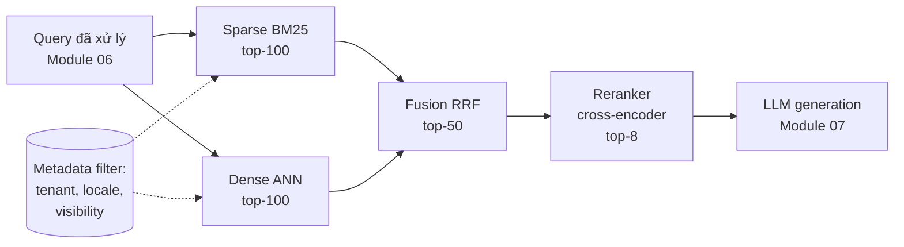
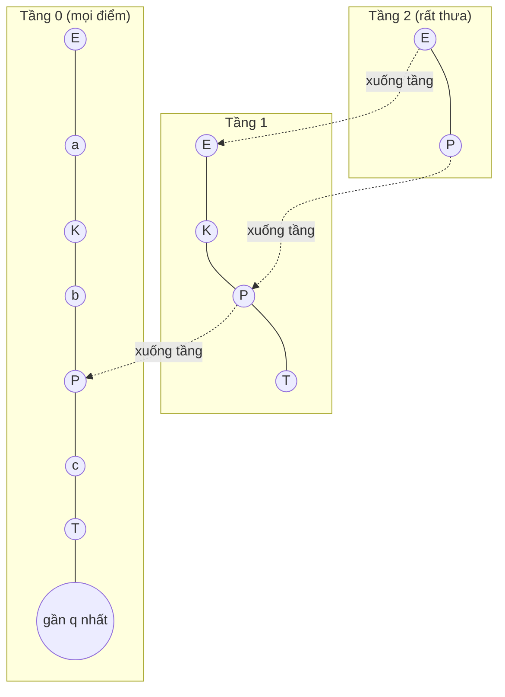

# Module 05 — Retrieval: sparse, dense, ANN, hybrid

> Thời lượng: ~55 phút · Mức độ: Nâng cao · Tiên quyết: Module 03 (Embedding), Module 04 (Ingestion & chunking)

Module 03 cho ta *biểu diễn*, Module 04 cho ta *đơn vị tri thức* (chunk có metadata). Module này trả lời câu hỏi kế tiếp: với một câu hỏi của khách hàng và vài trăm nghìn đến vài triệu chunk, **làm sao lấy ra đúng vài chục chunk liên quan nhất, trong vài chục mili-giây, không lộ dữ liệu của tenant khác?** Đây là tầng "candidate generation" — tầng quyết định trần chất lượng của toàn bộ hệ RAG: một đoạn tài liệu không được retrieve thì không reranker hay LLM nào cứu được.

## Mục tiêu học tập

Sau module này, bạn có thể:

1. **Dẫn xuất công thức BM25** từ mô hình xác suất (Binary Independence Model → trọng số Robertson–Spärck Jones → saturation → chuẩn hóa độ dài), tính tay điểm BM25 cho một tập tài liệu nhỏ, và giải thích tác dụng của $k_1$, $b$.
2. **Thiết kế tokenization cho BM25** với tiếng Việt (âm tiết vs từ ghép, bỏ dấu) và tiếng Nhật (morphological analyzer vs n-gram), nêu được trade-off.
3. **Giải thích và ước lượng chi phí** của exact kNN, IVF, Product Quantization (kèm ADC), HNSW và DiskANN; tính được bộ nhớ cần cho 1 triệu vector ở các cấu hình khác nhau.
4. **Cài đặt và so sánh hybrid retrieval**: Reciprocal Rank Fusion (giải thích hằng số $k$) và convex combination với chuẩn hóa điểm; biết khi nào cái nào thắng.
5. **Phân tích metadata filtering** (pre-, post-, in-filter), định lượng vì sao filter có selectivity thấp làm hỏng recall của HNSW, và chọn giải pháp phù hợp.
6. **Chọn vector DB và mô hình multi-tenant isolation** cho bài toán Zendesk dựa trên tính năng thực tế (tính đến 10/2026).

---

## 1. Bài toán retrieval: định nghĩa hình thức và vị trí trong pipeline

### 1.1 Định nghĩa

Cho kho tài liệu (sau chunking) $\mathcal{C} = \{d_1, \dots, d_N\}$, một truy vấn $q$, và một **hàm điểm** (scoring function) $s(q, d) \in \mathbb{R}$. Bài toán retrieval top-$k$ là:

$$
\text{TopK}(q) = \underset{S \subseteq \mathcal{C},\ |S| = k}{\arg\max} \sum_{d \in S} s(q, d)
$$

tức là lấy $k$ tài liệu có điểm cao nhất. Mọi thứ trong module này xoay quanh hai câu hỏi:

- **Chọn $s$ thế nào** để điểm cao tương quan với "liên quan" (relevance)? → sparse (BM25), dense (embedding), hay kết hợp (hybrid).
- **Tính argmax thế nào cho nhanh** khi $N$ lớn? → inverted index (sparse), ANN index (dense).

Cần phân biệt hai loại "recall" sẽ xuất hiện suốt module:

| Khái niệm | Định nghĩa | Đo cái gì |
|---|---|---|
| **Relevance recall@k** | Tỷ lệ tài liệu thật sự liên quan (theo nhãn người) nằm trong top-$k$ | Chất lượng của hàm điểm $s$ |
| **ANN recall@k** | Tỷ lệ trong top-$k$ *chính xác* (theo $s$, tính brute-force) mà index xấp xỉ trả về | Chất lượng của thuật toán tìm argmax |

ANN recall 99% vẫn có thể đi cùng relevance recall 60% nếu embedding kém, và ngược lại. Hai loại lỗi phải được đo riêng (công thức Recall@k, MRR, nDCG chi tiết ở Module 10).

<!-- fig:two-recalls -->
<figure markdown="span">
  { loading=lazy }
  { loading=lazy }
  <figcaption>Hình 5.1 — Hai loại recall đo hai thứ khác nhau: hàm điểm (relevance recall) và thuật toán tìm kiếm xấp xỉ (ANN recall).</figcaption>
</figure>
<!-- /fig -->

### 1.2 Retrieval là tầng "recall-first"

Pipeline nhiều tầng, chi phí tăng dần, số ứng viên giảm dần:



Tầng retrieval chỉ cần đảm bảo tài liệu đúng **có mặt** trong top-50 đến top-100; việc đưa nó lên vị trí 1–5 là của reranker (Module 06). Vì vậy khi tune tầng này, mình khuyên tối ưu **Recall@50 hoặc Recall@100**, không tối ưu Precision@5.

### 1.3 Liên hệ Zendesk: ba kiểu truy vấn điển hình

Nhìn vào email khách hàng trong case study, truy vấn rơi vào ba nhóm, mỗi nhóm "ưa" một loại retrieval:

1. **Truy vấn chứa định danh chính xác**: mã lỗi `ERR_SYNC_409`, tên API `POST /v2/invoices`, số phiên bản `v3.14.2`, tên gói "Business Plus". Embedding thường *làm mờ* các chuỗi này (tokenizer cắt `ERR_SYNC_409` thành nhiều mảnh, vector gần với mọi lỗi đồng bộ khác). BM25 khớp chính xác → thắng.
2. **Truy vấn mô tả bằng lời của khách**: "tôi bấm lưu mà nó cứ quay mãi không xong", "請求書がダウンロードできない" (không tải được hóa đơn). Từ ngữ của khách khác hẳn từ ngữ của bài Help Center ("timeout khi lưu bản ghi", "PDF export"). Đây là **vocabulary mismatch** — dense retrieval thắng.
3. **Truy vấn xuyên ngôn ngữ**: khách viết tiếng Việt, nhưng tài liệu API chỉ có tiếng Anh; khách Nhật hỏi về một tính năng mà bài Help Center tiếng Nhật chưa được dịch. BM25 gần như vô dụng (không chung token), embedding đa ngữ (Module 03) là lựa chọn duy nhất.

Vì cả ba nhóm đều xuất hiện hằng ngày trong ~1.500 ticket, **hybrid là mặc định hợp lý** cho bài toán này — phần 4 sẽ phân tích điều đó định lượng hơn.

<!-- fig:query-types -->
<figure markdown="span">
  { loading=lazy }
  { loading=lazy }
  <figcaption>Hình 5.2 — Ba kiểu truy vấn trong email Zendesk và loại retrieval «ưa» từng kiểu.</figcaption>
</figure>
<!-- /fig -->

**Ước lượng quy mô (giả định để học):** ~800 bài Help Center × ~10 chunk; ~300 macro; ~200.000 ticket đã giải quyết → sau lọc và trích Q/A (Module 04) ~1–3 chunk/ticket; cộng tài liệu sản phẩm/API. Tổng: **khoảng 0,3–0,7 triệu vector**. Tải truy vấn: 1.500 ticket × ~3,5 lượt ≈ 5.250 lần retrieval/ngày; kể cả nhân 4 cho multi-query (Module 06) và nhân 3 cho giờ cao điểm thì vẫn **dưới 1 QPS**. Kết luận quan trọng: ở bài toán này, **hạ tầng retrieval không phải nút thắt hiệu năng — chất lượng mới là nút thắt**. Hãy tối ưu cho recall, filter đúng và đa ngôn ngữ.

---

## 2. Sparse retrieval: từ TF-IDF đến BM25

### 2.1 Inverted index — cấu trúc dữ liệu khiến sparse retrieval nhanh

Biểu diễn mỗi tài liệu như một vector trên từ vựng $V$ (có thể hàng trăm nghìn chiều), hầu hết bằng 0. Thay vì lưu vector, ta lưu **inverted index**: với mỗi term $t$, một *posting list* gồm các cặp $(d, \mathrm{tf}_{t,d})$ của những tài liệu chứa $t$.

```
"hoàn_tiền" -> [(d1, 3), (d2, 1), (d3, 1)]
"hóa_đơn"   -> [(d2, 1), (d3, 2)]
```

Với truy vấn có $|q|$ term, chỉ cần duyệt $|q|$ posting list. Chi phí xấp xỉ $\sum_{t \in q} \mathrm{df}_t$ thay vì $N$. Các engine hiện đại (Lucene/Elasticsearch, `pg_textsearch`, Tantivy…) còn dùng **WAND / Block-Max WAND**: lưu điểm tối đa có thể của mỗi khối posting để bỏ qua các khối chắc chắn không lọt top-$k$ — đây là lý do BM25 trên hàng chục triệu tài liệu vẫn trả về trong vài mili-giây.

<!-- fig:inverted-index -->
<figure markdown="span">
  { loading=lazy }
  { loading=lazy }
  <figcaption>Hình 5.3 — Inverted index: truy vấn chỉ chạm tới posting list của các term mà nó chứa.</figcaption>
</figure>
<!-- /fig -->

### 2.2 TF-IDF và vì sao nó chưa đủ

TF-IDF cổ điển: $w_{t,d} = \mathrm{tf}_{t,d} \cdot \log \frac{N}{\mathrm{df}_t}$. Hai vấn đề: (1) **TF tăng tuyến tính** — bài lặp "hoàn tiền" 20 lần có điểm gấp 20 lần bài nhắc 1 lần, trong khi lần nhắc thứ 20 gần như không thêm bằng chứng, cần hàm **bão hòa**; (2) **không xử lý độ dài** — tài liệu dài tự nhiên có TF cao, còn chuẩn hóa cosine lại phạt quá tay bài dài thật sự liên quan. BM25 giải quyết cả hai và **có gốc xác suất**, nên tham số có ý nghĩa rõ ràng.

### 2.3 Dẫn xuất BM25 từng bước

**Bước 1 — Nguyên lý xếp hạng xác suất (Probability Ranking Principle).** Xếp tài liệu theo $P(R=1 \mid d, q)$ là tối ưu (theo kỳ vọng) cho nhiều độ đo. Vì mọi phép biến đổi đơn điệu không đổi thứ tự, ta xếp theo log-odds:

$$
\log \frac{P(R=1 \mid d, q)}{P(R=0 \mid d, q)} \;\stackrel{\text{rank}}{=}\; \log \frac{P(d \mid R=1, q)}{P(d \mid R=0, q)}
$$

(dùng Bayes, bỏ hạng tử $P(R)$ không phụ thuộc $d$; ký hiệu $\stackrel{\text{rank}}{=}$ nghĩa là "bằng nhau về thứ tự").

**Bước 2 — Binary Independence Model (BIM).** Biểu diễn $d$ bằng vector nhị phân $x_t \in \{0,1\}$ (term $t$ có xuất hiện hay không), giả định các term độc lập có điều kiện theo $R$. Đặt $p_t = P(x_t = 1 \mid R=1)$, $u_t = P(x_t=1 \mid R=0)$. Sau khi khai triển và bỏ các hạng tử không phụ thuộc $d$, chỉ còn tổng trên các term *vừa có trong query vừa có trong tài liệu*:

$$
\text{score}(d, q) = \sum_{t \in q \cap d} \underbrace{\log \frac{p_t (1 - u_t)}{u_t (1 - p_t)}}_{w_t}
$$

**Bước 3 — Trọng số Robertson–Spärck Jones (RSJ) khi không có nhãn.** Ta không biết $p_t$; giả định trung lập $p_t = 0{,}5$ (term trong query có 50% khả năng xuất hiện trong tài liệu liên quan). Với $u_t$: vì đa số tài liệu là không liên quan, ước lượng bằng tỷ lệ tài liệu chứa $t$ trên toàn kho, có làm trơn: $u_t \approx \frac{n_t + 0{,}5}{N + 1}$ với $n_t = \mathrm{df}_t$. Thay vào:

$$
w_t^{\mathrm{RSJ}} = \log \frac{1-u_t}{u_t} = \log \frac{N - n_t + 0{,}5}{n_t + 0{,}5}
$$

Đây chính là "IDF" của BM25 — nó **không phải** được chọn tùy tiện mà rơi ra từ mô hình xác suất. Lưu ý: khi $n_t > N/2$, $w_t^{\mathrm{RSJ}} < 0$ — một term xuất hiện ở hơn nửa kho bị coi là bằng chứng *chống lại* relevance. Lucene (và do đó Elasticsearch/OpenSearch) dùng biến thể luôn dương:

$$
\mathrm{IDF}(t) = \log\left(1 + \frac{N - n_t + 0{,}5}{n_t + 0{,}5}\right)
$$

**Bước 4 — Đưa tần suất vào: eliteness và saturation.** BIM bỏ qua TF. Robertson và cộng sự giải thích TF qua *eliteness* (tài liệu thật sự *nói về* khái niệm $t$), mô hình hóa TF bằng hỗn hợp hai phân phối Poisson. Công thức chính xác quá phức tạp, nhưng hình dạng của nó có ba tính chất: bằng 0 khi $\mathrm{tf}=0$, tăng đơn điệu, và **tiệm cận** một giá trị tối đa. Hàm đơn giản nhất có ba tính chất đó:

$$
\frac{\mathrm{tf}}{\mathrm{tf} + k_1}
$$

Nhân thêm $(k_1 + 1)$ để khi $\mathrm{tf}=1$ giá trị bằng đúng 1 (tiện so sánh với BIM): $\frac{\mathrm{tf}\,(k_1+1)}{\mathrm{tf} + k_1}$, tiệm cận $k_1 + 1$ khi $\mathrm{tf} \to \infty$.

**Bước 5 — Chuẩn hóa độ dài.** Tài liệu dài có TF cao "vô tội" (verbosity). Ý tưởng: chia TF cho một hệ số độ dài tương đối $B = (1 - b) + b \cdot \frac{|d|}{\mathrm{avgdl}}$, với $|d|$ là độ dài tài liệu (số token), $\mathrm{avgdl}$ là độ dài trung bình, $b \in [0,1]$. Thay $\mathrm{tf}$ bằng $\mathrm{tf}/B$ trong hàm saturation rồi rút gọn:

$$
\frac{(\mathrm{tf}/B)(k_1 + 1)}{\mathrm{tf}/B + k_1} = \frac{\mathrm{tf}\,(k_1+1)}{\mathrm{tf} + k_1 B}
$$

**Kết quả — công thức BM25 đầy đủ:**

$$
\boxed{\;\mathrm{BM25}(q, d) = \sum_{t \in q} \mathrm{IDF}(t) \cdot \frac{\mathrm{tf}_{t,d}\,(k_1 + 1)}{\mathrm{tf}_{t,d} + k_1\left(1 - b + b\,\dfrac{|d|}{\mathrm{avgdl}}\right)}\;}
$$

Với tài liệu có nhiều trường (tiêu đề, thân bài, tag), biến thể **BM25F** cộng TF có trọng số theo trường *trước* khi qua hàm saturation — đúng hơn là cộng điểm BM25 của từng trường (vì cộng điểm sẽ "vượt" giới hạn bão hòa).

### 2.4 Ví dụ số tính tay

Kho gồm $N = 5$ chunk (độ dài tính bằng số token sau tokenization), $\mathrm{avgdl} = (20+10+40+10+20)/5 = 20$. Truy vấn: "hoàn_tiền hóa_đơn" (đã tách từ). Tham số $k_1 = 1{,}2$, $b = 0{,}75$ (mặc định của Lucene và `pg_textsearch`).

| Chunk | $\lvert d \rvert$ | tf(hoàn_tiền) | tf(hóa_đơn) |
|---|---|---|---|
| d1 — "Chính sách hoàn tiền…" | 20 | 3 | 0 |
| d2 — "Hoàn tiền vào hóa đơn kỳ sau" | 10 | 1 | 1 |
| d3 — "Hướng dẫn xuất hóa đơn VAT…" | 40 | 1 | 2 |
| d4 | 10 | 0 | 0 |
| d5 | 20 | 0 | 0 |

**IDF** ($n_{\text{hoàn\_tiền}} = 3$, $n_{\text{hóa\_đơn}} = 2$):

- $\mathrm{IDF}(\text{hoàn\_tiền}) = \ln\!\left(1 + \frac{5-3+0{,}5}{3+0{,}5}\right) = \ln(1{,}714) = 0{,}539$
- $\mathrm{IDF}(\text{hóa\_đơn}) = \ln\!\left(1 + \frac{5-2+0{,}5}{2+0{,}5}\right) = \ln(2{,}4) = 0{,}875$

(So sánh: RSJ gốc cho "hoàn_tiền" là $\ln(2{,}5/3{,}5) = -0{,}336$ — âm, vì term xuất hiện ở 3/5 tài liệu. Trong kho thật, đây là chuyện xảy ra với các từ như "tài khoản" trong kho ticket của một SaaS — gần như bài nào cũng có.)

**Hệ số độ dài** $K = k_1(1 - b + b\,|d|/\mathrm{avgdl})$:

- d1: $1{,}2 \times (0{,}25 + 0{,}75 \times 1) = 1{,}2$
- d2: $1{,}2 \times (0{,}25 + 0{,}75 \times 0{,}5) = 0{,}75$
- d3: $1{,}2 \times (0{,}25 + 0{,}75 \times 2) = 2{,}1$

**Thành phần TF** $\frac{\mathrm{tf}(k_1+1)}{\mathrm{tf}+K}$ với $k_1 + 1 = 2{,}2$:

- d1, hoàn_tiền: $\frac{3 \times 2{,}2}{3 + 1{,}2} = 1{,}571$
- d2, mỗi term: $\frac{1 \times 2{,}2}{1 + 0{,}75} = 1{,}257$
- d3, hoàn_tiền: $\frac{2{,}2}{1 + 2{,}1} = 0{,}710$; hóa_đơn: $\frac{2 \times 2{,}2}{2 + 2{,}1} = 1{,}073$

**Điểm:**

- d1: $0{,}539 \times 1{,}571 = 0{,}847$
- d2: $0{,}539 \times 1{,}257 + 0{,}875 \times 1{,}257 = 0{,}678 + 1{,}100 = 1{,}778$
- d3: $0{,}539 \times 0{,}710 + 0{,}875 \times 1{,}073 = 0{,}383 + 0{,}939 = 1{,}322$

Thứ hạng: **d2 > d3 > d1**. Quan sát: (i) d1 nhắc "hoàn tiền" 3 lần nhưng thua d2 nhắc mỗi term 1 lần — khớp *nhiều term khác nhau* quan trọng hơn lặp một term, nhờ saturation; (ii) d3 có tf(hóa_đơn)=2 nhưng bị phạt vì dài gấp đôi trung bình.

<!-- fig:bm25-example -->
<figure markdown="span">
  { loading=lazy }
  { loading=lazy }
  <figcaption>Hình 5.4 — Điểm BM25 của ví dụ mục 2.4, tách theo đóng góp của từng term.</figcaption>
</figure>
<!-- /fig -->

### 2.5 Ý nghĩa của $k_1$ và $b$ — đọc bằng số

**Saturation theo $k_1$** (cố định $|d| = \mathrm{avgdl}$, nên $K = k_1 = 1{,}2$):

| tf | 1 | 2 | 3 | 5 | 10 | 100 |
|---|---|---|---|---|---|---|
| $\frac{2{,}2\,\mathrm{tf}}{\mathrm{tf}+1{,}2}$ | 1,000 | 1,375 | 1,571 | 1,774 | 1,964 | 2,174 |

Lần nhắc thứ 2 thêm 37,5%; từ 10 lên 100 chỉ thêm 11%. $k_1$ nhỏ (0,5) → bão hòa rất nhanh, gần như nhị phân; $k_1$ lớn (2–3) → gần tuyến tính như TF-IDF. Trong thực tế, $k_1 \in [0{,}9;\ 2{,}0]$.

**Chuẩn hóa độ dài theo $b$** (tf = 1, $k_1 = 1{,}2$):

| $b$ | $\lvert d\rvert/\mathrm{avgdl} = 0{,}5$ | $= 1$ | $= 2$ |
|---|---|---|---|
| 0 (không chuẩn hóa) | 1,000 | 1,000 | 1,000 |
| 0,75 (mặc định) | 1,257 | 1,000 | 0,710 |
| 1 (chuẩn hóa hoàn toàn) | 1,375 | 1,000 | 0,647 |

<!-- fig:bm25-k1-b -->
<figure markdown="span">
  { loading=lazy }
  { loading=lazy }
  <figcaption>Hình 5.5 — Trái: hàm saturation với các giá trị k₁ (điểm xanh là bảng k₁ = 1.2). Phải: chuẩn hóa độ dài với các giá trị b (điểm xanh là hàng b = 0.75 của bảng).</figcaption>
</figure>
<!-- /fig -->

**Khi nào chỉnh khác mặc định — liên hệ Zendesk:**

- **Chunk đã được chuẩn hóa độ dài** (Module 04: fixed-size ~300–500 token) → $|d|/\mathrm{avgdl} \approx 1$, $b$ gần như không ảnh hưởng. Đừng tốn thời gian tune $b$ trong trường hợp này.
- **Index cả bài Help Center nguyên văn** (độ dài chênh 10 lần) → giữ $b \approx 0{,}75$; nếu bài tổng quan dài luôn bị đẩy xuống, giảm $b$ về 0,3–0,5.
- **Trường tiêu đề / tên macro** → BM25F, trọng số tiêu đề cao.

Quy trình tune: ~200 truy vấn có nhãn (Module 10), grid search $k_1 \in \{0{,}6; \dots; 2{,}0\}$, $b \in \{0{,}3; \dots; 0{,}9\}$, chọn theo Recall@50 — đáng làm nhưng đừng kỳ vọng phép màu.

### 2.6 Code minh họa: BM25 từ đầu

```python
# bm25_scratch.py — Python 3.10+, chỉ dùng thư viện chuẩn
import math
from collections import Counter

def bm25_index(docs: list[list[str]]):
    N = len(docs)
    df = Counter(t for d in docs for t in set(d))
    idf = {t: math.log(1 + (N - n + 0.5) / (n + 0.5)) for t, n in df.items()}  # IDF kiểu Lucene
    return idf, [Counter(d) for d in docs], [len(d) for d in docs], sum(map(len, docs)) / N

def bm25_topk(query, idf, tfs, lens, avgdl, k1=1.2, b=0.75, k=10):
    scores = {}
    for i, (tf, dl) in enumerate(zip(tfs, lens)):   # production: chỉ duyệt posting list
        K = k1 * (1 - b + b * dl / avgdl)
        s = sum(idf[t] * tf[t] * (k1 + 1) / (tf[t] + K) for t in set(query) if tf[t])
        if s > 0:
            scores[i] = s
    return sorted(scores.items(), key=lambda x: -x[1])[:k]

# Tái hiện ví dụ mục 2.4
docs = [["hoàn_tiền"] * 3 + ["x"] * 17,
        ["hoàn_tiền", "hóa_đơn"] + ["y"] * 8,
        ["hoàn_tiền"] + ["hóa_đơn"] * 2 + ["z"] * 37,
        ["w"] * 10, ["v"] * 20]
print(bm25_topk(["hoàn_tiền", "hóa_đơn"], *bm25_index(docs)))
# -> [(1, 1.778...), (2, 1.322...), (0, 0.847...)]
```

Trong production hãy dùng engine có Block-Max WAND và cập nhật tăng dần. Nhưng tự viết một lần giúp thấy rõ điểm BM25 **không có thang tuyệt đối** (phụ thuộc $N$, avgdl, độ dài query) — điều quan trọng khi làm hybrid ở phần 4.

### 2.7 Tokenization tiếng Việt cho BM25

BM25 chỉ tốt bằng tokenization của nó. Tiếng Việt cách nhau theo **âm tiết**, nhưng đơn vị nghĩa là **từ**, và nhiều từ là từ ghép: "hoàn tiền", "hóa đơn", "đăng nhập", "gia hạn". Ba chiến lược:

**(a) Token = âm tiết** (tách theo khoảng trắng). Đơn giản, không bao giờ OOV. Nhưng mất nghĩa: "đơn" có trong "hóa đơn", "đơn hàng", "đơn giản" → truy vấn "hóa đơn" khớp cả tài liệu chỉ có "đơn giản hóa".

**(b) Token = từ, sau word segmentation** (RDRsegmenter trong VnCoreNLP, underthesea, pyvi): "hóa đơn VAT" → `hóa_đơn VAT`. Chính xác hơn, nhưng thuật ngữ miền (tên tính năng như "đồng bộ hai chiều") có thể bị tách khác nhau giữa lúc index và lúc query; phải dùng cùng bộ tách, cùng phiên bản cho cả hai phía.

**(c) Âm tiết + bigram âm tiết (shingles).** "xuất hóa đơn VAT" → {xuất, hóa, đơn, vat, xuất_hóa, hóa_đơn, đơn_vat}. Bigram "hóa_đơn" đóng vai trò gần như một từ ghép mà không cần mô hình tách từ; bigram vô nghĩa ("đơn_vat") hiếm khi gây khớp nhiễu. Chi phí: index lớn hơn ~2 lần.

**Dấu và Unicode.** Khách gõ không dấu trên mobile ("khong dang nhap duoc") → thêm **trường folded** bỏ dấu (kiểm tra bộ folding của engine có chuyển "đ" → "d" không), truy vấn cả hai trường, trường folded trọng số thấp hơn vì mơ hồ ("ban" = bán/bạn/bàn/bản). Chuẩn hóa NFC trước khi tokenize (Module 04), nếu không "hóa" dạng NFC và NFD là hai token khác nhau.

**Khuyến nghị cho Zendesk:** (c) + trường folded; chỉ chuyển sang (b) nếu đo thấy lợi rõ trên tập đánh giá — (c) không có rủi ro lệch tokenizer, dễ vận hành, phần "hiểu nghĩa" đã có dense gánh.

Với Postgres: không có cấu hình full-text tiếng Việt/Nhật sẵn, nên **tokenize trong ứng dụng** rồi index bằng cấu hình `simple`. `ts_rank` của Postgres không phải BM25 (không có IDF theo kho); cần BM25 thật thì dùng extension như `pg_textsearch` (Tiger Data, bản 1.0 ra 04/2026, PostgreSQL 17/18, index `USING bm25`, toán tử `<@>`, giấy phép PostgreSQL) hoặc `pg_search` của ParadeDB (AGPL).

### 2.8 Tokenization tiếng Nhật cho BM25

Tiếng Nhật **không có khoảng trắng** và trộn kanji, hiragana, katakana, Latin. Hai trường phái:

**(a) Morphological analyzer** dựa trên từ điển: MeCab, Kuromoji (plugin `analysis-kuromoji` của Elasticsearch), Sudachi (plugin `elasticsearch-sudachi`, có ba chế độ tách từ ngắn đến dài). "請求書をダウンロードできません" → 請求書 / を / ダウンロード / でき / ませ / ん. Token có nghĩa, precision cao, bỏ được trợ từ; nhưng từ mới, tên sản phẩm katakana bị tách sai nếu thiếu từ điển người dùng.

**(b) Character bigram** (ví dụ `CJKBigramFilter` của Lucene): 請求 / 求書 / 書を / … Không bao giờ OOV, recall cao; nhưng index lớn, nhiều khớp nhiễu.

**Thực hành tốt:** index **hai trường** (morphological cho precision + bigram làm lưới an toàn cho recall); luôn **NFKC** trước ("ＡＰＩ" → "API", katakana half-width → full-width) — email Nhật rất hay lẫn hai dạng.

<!-- fig:tokenization-vi-ja -->
<figure markdown="span">
  { loading=lazy }
  { loading=lazy }
  <figcaption>Hình 5.6 — Các chiến lược tokenization cho BM25 với tiếng Việt và tiếng Nhật.</figcaption>
</figure>
<!-- /fig -->

Tính đến 10/2026: Qdrant có tokenizer `multilingual` cho full-text index (charabia, dùng vaporetto cho tiếng Nhật); Milvus 2.6 có tokenizer Lindera (IPADIC), ICU và bộ nhận diện ngôn ngữ để tự chọn analyzer. Tài liệu của các hệ này không nêu hỗ trợ tách từ tiếng Việt riêng — với tiếng Việt, tokenization ở tầng ứng dụng vẫn là đường chắc chắn nhất. Với email lẫn ngôn ngữ (tiếng Nhật + log tiếng Anh), luôn giữ một trường fallback (ICU hoặc khoảng trắng + bigram) để không mất mã lỗi ASCII.

### 2.9 Learned sparse và khi nào BM25 thắng/thua

Learned sparse (SPLADE, phần sparse của BGE-M3 — Module 03) học trọng số term và *mở rộng* term, vẫn dùng inverted index; về hạ tầng chúng là sparse vector (Qdrant/Milvus, `sparsevec` của pgvector) và mọi thứ về fusion ở phần 4 áp dụng nguyên vẹn.

**BM25 thắng khi:** truy vấn có định danh, mã lỗi, phiên bản, tên riêng; miền chuyên biệt; cần giải thích được. BEIR (Thakur et al., 2021) cho thấy BM25 là baseline zero-shot khó đánh bại trên nhiều miền ngoài phân phối huấn luyện của dense retriever. **BM25 thua khi:** đồng nghĩa/diễn đạt lại, xuyên ngôn ngữ, truy vấn dài nhiễu, lỗi chính tả.

**Liên hệ Zendesk:** đừng đưa *nguyên văn email* vào BM25 — chữ ký, quoted reply, câu lịch sự sẽ khớp hàng nghìn ticket có chữ ký tương tự. Dùng query đã trích xuất/viết lại (Module 06), và giữ nguyên văn các định danh (mã lỗi, mã đơn, tên gói) thành một truy vấn BM25 riêng.

---

## 3. Dense retrieval: exact kNN và bài toán ANN

### 3.1 Từ embedding đến tìm kiếm láng giềng gần nhất

Với bi-encoder (Module 03), mỗi chunk được mã hóa offline thành $\mathbf{x}_i \in \mathbb{R}^D$, truy vấn thành $\mathbf{q} \in \mathbb{R}^D$, và $s(q, d_i) = \langle \mathbf{q}, \mathbf{x}_i \rangle$ (inner product) hoặc cosine. Nếu các vector đã chuẩn hóa $\|\cdot\| = 1$ thì ba độ đo tương đương về thứ tự, vì $\|\mathbf{q} - \mathbf{x}\|^2 = 2 - 2\cos(\mathbf{q}, \mathbf{x})$ (Module 03). Từ đây, retrieval dense chính là bài toán **k-Nearest Neighbor (kNN)** trong không gian $D$ chiều.

### 3.2 Exact kNN (brute force / flat)

Tính $\langle \mathbf{q}, \mathbf{x}_i\rangle$ với mọi $i$, giữ top-$k$ bằng heap kích thước $k$.

- **Thời gian:** $O(ND + N \log k)$ — một phép nhân ma trận–vector $\mathbf{X}\mathbf{q}$, thân thiện SIMD/GPU, bị giới hạn bởi **băng thông bộ nhớ** (đọc toàn bộ $\mathbf{X}$ mỗi truy vấn). Ví dụ $N = 10^6$, $D = 1024$, fp16 → 2 GB; CPU ~20 GB/s hiệu dụng (ước lượng thô) → ~100 ms; GPU → vài ms.
- **Bộ nhớ:** $N \cdot D \cdot \text{bytes}$; **ANN recall = 100%** theo định nghĩa.

**Khi nào exact là lựa chọn đúng:** $N$ nhỏ (dưới ~100k vector, latency vài ms trên CPU), khi tập ứng viên đã bị **filter thu hẹp** (ví dụ chỉ tài liệu của một tenant nhỏ: vài nghìn vector — quét hết nhanh hơn và chính xác hơn dùng HNSW), và **luôn luôn** làm ground truth để đo ANN recall. Qdrant và pgvector đều có cơ chế tự chuyển sang quét đầy đủ khi filter quá chặt (Qdrant có ngưỡng `full_scan_threshold`), và bạn nên hiểu vì sao (mục 5).

**Liên hệ Zendesk:** với 0,3–0,7 triệu vector và < 1 QPS, exact search gần như đủ; mình vẫn khuyên HNSW cho latency ổn định khi multi-query (Module 06) nhân số truy vấn, nhưng giữ một đường "exact" để đo ANN recall định kỳ.

### 3.3 Vì sao cần ANN: lời nguyền số chiều

Cây k-d/ball tree hiệu quả ở chiều thấp, nhưng ở $D$ hàng trăm khoảng cách giữa các điểm **tập trung** quanh trung bình (tỷ số xa nhất/gần nhất tiến về 1), các mặt cắt không loại được nhánh nào và cây suy biến thành quét toàn bộ. ANN đánh đổi *một chút recall* lấy tốc độ nhanh hơn hàng chục đến hàng trăm lần. Ba họ chính: **phân vùng** (IVF), **nén** (PQ, scalar/binary quantization), **đồ thị** (HNSW, Vamana/DiskANN). Bài tổng quan về thư viện Faiss (Douze et al., 2024) là tài liệu tham khảo tốt cho cả ba họ.

<!-- fig:distance-concentration -->
<figure markdown="span">
  { loading=lazy }
  { loading=lazy }
  <figcaption>Hình 5.7 — Lời nguyền số chiều (mô phỏng): tỷ số khoảng cách xa nhất / gần nhất tiến về 1 khi D tăng, nên cây phân hoạch mất tác dụng.</figcaption>
</figure>
<!-- /fig -->

### 3.4 IVF — Inverted File Index

**Ý tưởng:** k-means chia không gian thành $n_{\text{list}}$ cụm; mỗi vector thuộc cụm có tâm gần nhất (như posting list theo vùng không gian). Khi truy vấn, chỉ quét các vector trong $n_{\text{probe}}$ cụm có tâm gần $\mathbf{q}$ nhất.

**Độ phức tạp một truy vấn** (giả định cụm cân bằng, mỗi cụm $\approx N / n_{\text{list}}$ vector):

$$
\text{cost}_{\text{IVF}} \approx \underbrace{n_{\text{list}} \cdot D}_{\text{so với tâm}} + \underbrace{n_{\text{probe}} \cdot \frac{N}{n_{\text{list}}} \cdot D}_{\text{quét các cụm}}
$$

Cực tiểu theo $n_{\text{list}}$ (đạo hàm bằng 0): $n_{\text{list}}^* = \sqrt{n_{\text{probe}} \cdot N}$. Vì vậy quy tắc kinh nghiệm là $n_{\text{list}}$ cỡ $\sqrt{N}$ đến vài lần $\sqrt{N}$. pgvector khuyến nghị `lists = rows/1000` cho tới 1 triệu dòng, `sqrt(rows)` khi trên 1 triệu, và `probes` khởi điểm khoảng $\sqrt{\text{lists}}$.

**Ví dụ số:** $N = 10^6$, $n_{\text{list}} = 1024$, $n_{\text{probe}} = 16$ → so sánh $1024 + 16 \times 977 \approx 16.650$ vector thay vì $10^6$: ít hơn ~60 lần. Đổi lại, nếu láng giềng thật của $\mathbf{q}$ nằm ở cụm gần thứ 17 → bị bỏ sót. Đây là **lỗi biên** (boundary effect): điểm nằm gần ranh giới Voronoi giữa nhiều cụm.

<!-- fig:ivf -->
<figure markdown="span">
  { loading=lazy }
  { loading=lazy }
  <figcaption>Hình 5.8 — Trái: IVF trên dữ liệu 2D mô phỏng — chỉ quét các cụm được probe. Phải: chi phí truy vấn theo n_list, cực tiểu tại √(n_probe·N).</figcaption>
</figure>
<!-- /fig -->

**Bộ nhớ:** gần bằng flat + tâm cụm ($n_{\text{list}} \cdot D$) — overhead rất nhỏ, ưu điểm lớn nhất so với HNSW. **Nhược điểm:** phải **train** k-means trên dữ liệu đại diện; phân phối dịch chuyển (sản phẩm mới, ngôn ngữ mới) làm cụm lệch → recall giảm âm thầm (pgvector khuyên chỉ tạo IVFFlat *sau khi* bảng đã có dữ liệu); cụm không cân bằng làm latency dao động; recall thấp hơn HNSW ở cùng latency khi dữ liệu nằm trong RAM. **Dùng khi:** bộ nhớ là ràng buộc chính, kết hợp PQ (IVF-PQ) cho hàng trăm triệu vector, hoặc trên GPU.

### 3.5 Product Quantization (PQ) và Asymmetric Distance Computation

**Vấn đề:** 1 triệu vector 1024-d fp32 = 4 GB; một tỷ = 4 TB. Cần **nén** vector mà vẫn ước lượng được khoảng cách.

**Ý tưởng (Jégou, Douze, Schmid, TPAMI 2011):** chia vector $D$ chiều thành $m$ đoạn con $D/m$ chiều. Với mỗi đoạn $j$, chạy k-means riêng để có **codebook** $\mathcal{C}^{(j)}$ gồm $K^* = 2^{n_{\text{bits}}}$ tâm (thường 256, tức 1 byte). Mỗi vector được mã hóa bằng $m$ chỉ số:

$$
\mathbf{x} = [\mathbf{x}^{(1)}, \dots, \mathbf{x}^{(m)}] \;\mapsto\; (i_1, \dots, i_m),\qquad i_j = \arg\min_{c}\ \|\mathbf{x}^{(j)} - \mathbf{c}^{(j)}_c\|^2
$$

Vector tái tạo $\hat{\mathbf{x}} = [\mathbf{c}^{(1)}_{i_1}, \dots, \mathbf{c}^{(m)}_{i_m}]$. Gọi là "product" vì tập vector tái tạo được là tích Descartes $\mathcal{C}^{(1)} \times \dots \times \mathcal{C}^{(m)}$: với $m = 64$, $K^* = 256$ là $2^{512}$ "tâm" ảo, trong khi chỉ phải lưu $K^* D$ số thực. **Nén:** $D = 1024$ fp32 (4096 byte) → $m = 64$ byte, **gấp 64 lần**.

**Asymmetric Distance Computation (ADC):** không nén $\mathbf{q}$; tính trước bảng tra cho mỗi đoạn

$$
T_j[c] = \|\mathbf{q}^{(j)} - \mathbf{c}^{(j)}_c\|^2,\qquad j = 1..m,\ c = 1..K^*
$$

(chi phí $O(K^* D)$, một lần mỗi truy vấn). Sau đó khoảng cách tới mọi vector nén chỉ là **$m$ phép tra bảng và cộng**:

$$
\|\mathbf{q} - \mathbf{x}\|^2 \;\approx\; \|\mathbf{q} - \hat{\mathbf{x}}\|^2 \;=\; \sum_{j=1}^{m} T_j[i_j]
$$

(đẳng thức thứ hai đúng chính xác vì bình phương khoảng cách Euclid tách được theo các nhóm chiều rời nhau). Với $m = 64$, $D = 1024$: ít hơn 16 lần phép toán và đọc ít hơn 64 lần bộ nhớ. ADC chính xác hơn SDC (nén cả query) vì chỉ một phía chịu lỗi lượng tử hóa.

**Ví dụ số tính tay.** $D = 4$, $m = 2$, $K^* = 4$. Codebook đoạn 1: $(1;0)$, $(0;1)$, $(0{,}5;0{,}5)$, $(1;1)$. Codebook đoạn 2: $(0{,}5;1)$, $(1;0)$, $(0;0{,}5)$, $(0{,}5;0{,}5)$.

- $\mathbf{x} = (1;\ 0{,}2;\ 0{,}5;\ 0{,}9)$: đoạn 1 có khoảng cách² tới 4 tâm $= 0{,}04;\ 1{,}64;\ 0{,}34;\ 0{,}64$ → mã 0; đoạn 2: $0{,}01;\ 1{,}06;\ 0{,}41;\ 0{,}16$ → mã 0. Vậy $\mathbf{x} \mapsto (0, 0)$.
- $\mathbf{y} = (0{,}4;\ 0{,}6;\ 0{,}6;\ 0{,}4) \mapsto (2, 3)$ (tính tương tự).
- Truy vấn $\mathbf{q} = (0{,}8;\ 0{,}1;\ 0{,}6;\ 0{,}7)$: $T_1 = [0{,}05;\ 1{,}45;\ 0{,}25;\ 0{,}85]$, $T_2 = [0{,}10;\ 0{,}65;\ 0{,}40;\ 0{,}05]$.
- ADC: $d(\mathbf{q},\mathbf{x}) \approx T_1[0] + T_2[0] = 0{,}15$ (thật $0{,}10$); $d(\mathbf{q},\mathbf{y}) \approx T_1[2] + T_2[3] = 0{,}30$ (thật $0{,}50$).

Giá trị lệch nhưng **thứ tự được bảo toàn** — đó là điều retrieval cần. Để sửa đảo thứ tự giữa các ứng viên sát nhau, dùng **rescoring**: lấy top-$4k$ theo PQ rồi tính lại bằng vector gốc.

<!-- fig:pq-adc -->
<figure markdown="span">
  { loading=lazy }
  { loading=lazy }
  <figcaption>Hình 5.9 — Product Quantization và ADC; bảng tra T₁, T₂ và hai khoảng cách lấy đúng từ ví dụ số tính tay.</figcaption>
</figure>
<!-- /fig -->

PQ tốt nhất khi các đoạn con gần độc lập và phương sai phân bố đều, nên thường áp một phép **xoay** trực giao trước (OPQ học phép xoay này). RaBitQ (Gao & Long, 2024) dùng phép xoay ngẫu nhiên và mã khoảng 1 bit/chiều với **cận sai số lý thuyết**; tính đến 10/2026 đã có trong Faiss và Milvus 2.6 (IVF_RABITQ).

| Phương pháp ($D = 1024$) | Byte/vector | Nén | Ghi chú |
|---|---|---|---|
| fp32 | 4096 | 1× | gốc |
| fp16 (`halfvec` trong pgvector) | 2048 | 2× | gần như không mất recall |
| Scalar int8 | 1024 | 4× | phổ biến nhất trong vector DB |
| Binary (1 bit/chiều) | 128 | 32× | Hamming, cần rescoring (Module 03) |
| PQ $m=64$, 8 bit | 64 | 64× | cần rescoring |

### 3.6 HNSW — Hierarchical Navigable Small World

HNSW (Malkov & Yashunin, arXiv 1603.09320, công bố trên IEEE TPAMI) là thuật toán ANN mặc định của gần như mọi vector DB hiện nay.

**Trực giác.** (1) *Tìm kiếm tham lam trên đồ thị:* mỗi điểm nối với vài láng giềng gần; từ một điểm vào, liên tục nhảy sang láng giềng gần $\mathbf{q}$ hơn cho tới khi không cải thiện được. Chỉ có cạnh ngắn thì phải nhảy rất nhiều bước và dễ kẹt ở cực tiểu địa phương. (2) *Small world:* trộn cạnh dài (bay nhanh tới đúng vùng) với cạnh ngắn (tinh chỉnh) để số bước tăng chậm, cỡ logarit. (3) *Phân tầng như skip list:* đặt cạnh dài và ngắn ở các **tầng** khác nhau. Mỗi điểm nhận tầng tối đa ngẫu nhiên

$$
\ell = \big\lfloor -\ln(U) \cdot m_L \big\rfloor,\qquad U \sim \mathrm{Uniform}(0, 1),\qquad m_L = 1 / \ln M
$$

nên $P(\ell \ge L) = M^{-L}$. Với $N = 10^6$, $M = 16$: tầng 0 có $10^6$ điểm, tầng 1 ~62.500, tầng 2 ~3.900, tầng 3 ~244, tầng 4 ~15, tầng 5 ~1 → khoảng $\log_{16} 10^6 \approx 5$ tầng. Tầng trên thưa nên cạnh tự nhiên dài.

<!-- fig:hnsw -->
<figure markdown="span">
  { loading=lazy }
  { loading=lazy }
  <figcaption>Hình 5.10 — Trái: sơ đồ HNSW trên dữ liệu mô phỏng — tìm tham lam ở tầng thưa, điểm dừng làm điểm vào tầng dưới. Phải: số điểm kỳ vọng ở mỗi tầng với N = 10⁶, M = 16.</figcaption>
</figure>
<!-- /fig -->



**Tìm kiếm:** từ điểm vào ở tầng cao nhất, ở mỗi tầng $L, \dots, 1$ đi tham lam tới điểm gần $\mathbf{q}$ nhất rồi dùng nó làm điểm vào tầng dưới. Ở tầng 0 chạy **beam search** với danh sách động kích thước $ef_{\text{search}} \ge k$: mở rộng ứng viên gần nhất, thêm láng giềng vào tập kết quả $W$ nếu gần hơn phần tử xa nhất của $W$, dừng khi ứng viên gần nhất còn lại xa hơn phần tử xa nhất của $W$; trả top-$k$ của $W$.

**Chèn:** sinh tầng $\ell$; đi tham lam xuống tầng $\ell + 1$; từ tầng $\ell$ về 0, beam search với kích thước $ef_{\text{construction}}$ lấy ứng viên rồi chọn tối đa $M$ láng giềng (tầng 0 thường $M_0 = 2M$) bằng **heuristic chọn láng giềng**: chỉ giữ ứng viên nếu nó gần điểm mới hơn là gần bất kỳ láng giềng đã chọn. Heuristic này giữ láng giềng "trải đều các hướng", giúp đồ thị điều hướng tốt khi dữ liệu có cụm dày — rất hay gặp với ticket (hàng nghìn ticket "quên mật khẩu" gần như trùng nhau).

**Tham số** (mặc định tính đến 10/2026):

| Tham số | pgvector / Qdrant | Mặc định | Tăng lên thì |
|---|---|---|---|
| $M$ | `m` / `m` | 16 / 16 | recall ↑, RAM ↑ tuyến tính, build chậm hơn |
| $ef_{\text{construction}}$ | `ef_construction` / `ef_construct` | 64 / 100 | đồ thị tốt hơn, build chậm hơn; không đổi RAM/latency truy vấn |
| $ef_{\text{search}}$ | `hnsw.ef_search` / `hnsw_ef` | 40 (pgvector) | recall ↑, latency ↑ — **núm vặn duy nhất chỉnh lúc chạy** |

**Độ phức tạp (thực nghiệm):** tìm kiếm khoảng $O\big((\log N + ef_{\text{search}}) \cdot M \cdot D\big)$; xây dựng khoảng $O(N \log N \cdot ef_{\text{construction}} \cdot M \cdot D)$ — với $10^6$ vector 1024-d: vài phút đến vài chục phút trên CPU nhiều lõi.

**Bộ nhớ đồ thị.** Tầng 0: $2M$ id × 4 byte; các tầng trên: kỳ vọng $\sum_{L \ge 1} M^{-L} = 1/(M-1)$ tầng, mỗi tầng $M$ id:

$$
\text{bytes}_{\text{graph}}/\text{điểm} \;\approx\; 4 \cdot 2M + 4 \cdot \frac{M}{M-1} \;\approx\; 8M + 4
$$

$M = 16$ → ~132 byte/điểm (cộng overhead cài đặt, ước lượng ×1,1–1,5). So với vector 1024-d fp32 chỉ thêm ~3%; nhưng với vector binary (128 byte), đồ thị **lớn hơn cả vector**.

**Latency (ước lượng):** $ef_{\text{search}} = 100$, $M_0 = 32$ → vài nghìn phép tính khoảng cách, mỗi phép 1024-d cỡ 100–200 ns với SIMD → ~0,5–2 ms, nhanh hơn exact trên CPU 50–200 lần.

**Nhược điểm:** cần nằm trong RAM (truy cập ngẫu nhiên); **xóa** khó — đa số hệ chỉ đánh dấu xóa, đồ thị xuống cấp dần, cần optimize/vacuum định kỳ (với yêu cầu xóa dữ liệu ở Module 04, phải kiểm tra vector đã biến mất khỏi *kết quả*); filter làm hỏng điều hướng (mục 5).

**Tune:** cố định $M = 16$, $ef_{\text{construction}} = 128\text{–}200$; quét $ef_{\text{search}} \in \{40, 64, 100, 200, 400\}$, đo ANN recall@k so với exact trên ~1.000 truy vấn thật, chọn điểm "khuỷu tay" đạt mục tiêu (ví dụ ≥ 0,98). Sau điểm bão hòa, gấp đôi $ef$ chỉ thêm vài phần nghìn recall mà gần gấp đôi latency. ANN-Benchmarks (Aumüller et al., 2018) chuẩn hóa cách vẽ đường cong recall–QPS này.

### 3.7 DiskANN (mức ý tưởng)

**Vấn đề:** HNSW cần toàn bộ đồ thị + vector trong RAM. Một tỷ vector 768-d fp32 ≈ 3 TB RAM — không kinh tế.

**Ý tưởng (Subramanya et al., NeurIPS 2019):**

1. Đồ thị **một tầng** (thuật toán xây Vamana) với đường kính nhỏ nhờ quy tắc cắt tỉa có tham số $\alpha > 1$ — chủ động giữ lại một số cạnh dài, để mỗi truy vấn chỉ cần ít bước nhảy (mỗi bước là một lần đọc SSD).
2. **Vector đầy đủ + danh sách láng giềng nằm trên SSD**, xếp cạnh nhau để một lần đọc block lấy được cả hai.
3. **Vector nén PQ nằm trong RAM** để định hướng việc duyệt đồ thị; chỉ đọc vector đầy đủ từ SSD để rescoring.

Kết quả: tỷ vector trên một máy, latency vài ms. Filtered-DiskANN (Gollapudi et al., WWW 2023) đưa nhãn filter vào cấu trúc đồ thị; Milvus và nhiều hệ khác có index kiểu DiskANN; Qdrant 1.16 có chế độ inline storage cho HNSW trên đĩa theo tinh thần tương tự.

<!-- fig:diskann -->
<figure markdown="span">
  { loading=lazy }
  { loading=lazy }
  <figcaption>Hình 5.11 — DiskANN: vector nén trong RAM để định hướng, vector đầy đủ và danh sách láng giềng nằm cạnh nhau trên SSD.</figcaption>
</figure>
<!-- /fig -->

**Liên hệ Zendesk:** với < 1 triệu vector, DiskANN là quá mức cần thiết.

### 3.8 Ước lượng bộ nhớ cho 1 triệu vector — bài tập thiết kế

Giả định $N = 10^6$, HNSW $M = 16$ (~132 byte đồ thị/điểm, làm tròn 150 byte để tính overhead), payload metadata ~200 byte/điểm (tenant_id, locale, product, updated_at, visibility, doc_id… — ước lượng).

| Cấu hình | Vector | Đồ thị HNSW | Payload | Tổng (ước lượng) |
|---|---|---|---|---|
| 768-d fp32 | 3,07 GB | 0,15 GB | 0,2 GB | ~3,4 GB |
| 1024-d fp32 | 4,10 GB | 0,15 GB | 0,2 GB | ~4,5 GB |
| 1024-d fp16 | 2,05 GB | 0,15 GB | 0,2 GB | ~2,4 GB |
| 1024-d int8 trong RAM + fp32 trên đĩa (rescoring) | 1,02 GB | 0,15 GB | 0,2 GB | ~1,4 GB RAM + 4,1 GB đĩa |
| 1024-d binary trong RAM + fp16 trên đĩa | 0,13 GB | 0,15 GB | 0,2 GB | ~0,5 GB RAM + 2,05 GB đĩa |
| 1024-d IVF-PQ $m=64$ (không đồ thị) | 0,064 GB | — (tâm cụm ~4 MB) | 0,2 GB | ~0,3 GB |

Công thức chung:

$$
\text{RAM} \approx N \cdot \Big(D \cdot \text{bytes}_{\text{vec}} + (8M + 4)\cdot\gamma + \text{bytes}_{\text{payload}}\Big)
$$

với $\gamma \approx 1{,}1\text{–}1{,}5$ là hệ số overhead cài đặt (ước lượng).

<!-- fig:memory-1m -->
<figure markdown="span">
  { loading=lazy }
  { loading=lazy }
  <figcaption>Hình 5.12 — Bảng ước lượng bộ nhớ mục 3.8 dưới dạng cột chồng.</figcaption>
</figure>
<!-- /fig -->

**Khuyến nghị cho Zendesk (0,3–0,7 triệu vector):** 1024-d **fp16, hoặc int8 + rescoring**, HNSW $M = 16$. Tổng RAM dưới 3 GB — một máy chủ nhỏ thừa sức; hãy ưu tiên **dư địa cho re-index blue/green** (cần gấp đôi tài nguyên trong lúc chuyển đổi, xem Module 11) hơn là ép bộ nhớ.

**Giới hạn chiều trong pgvector** (tính đến 10/2026, nhánh 0.8.x): index HNSW/IVFFlat hỗ trợ kiểu `vector` tới 2.000 chiều, `halfvec` tới 4.000, `bit` tới 64.000, `sparsevec` tới 1.000 phần tử khác 0. Một model embedding 4096-d (một số model dựa trên LLM) buộc phải dùng `halfvec` hoặc cắt chiều Matryoshka.

### 3.9 Chọn thuật toán ANN — bảng tổng hợp

| Tiêu chí | Flat (exact) | IVF | IVF-PQ | HNSW | DiskANN |
|---|---|---|---|---|---|
| ANN recall | 100% | cao, tùy `nprobe` | thấp hơn, cần rescoring | rất cao | cao |
| Latency @1M (CPU, định hướng) | ~10–100 ms | ~1–10 ms | ~1 ms | ~0,5–2 ms | ~vài ms (SSD) |
| Bộ nhớ | vector | vector + rất nhỏ | rất nhỏ | vector + đồ thị | nhỏ trong RAM, phần lớn trên SSD |
| Với filter rất chặt | tốt nhất | tốt | tốt | **kém** nếu không có kỹ thuật riêng | cần biến thể Filtered |
| Quy mô phù hợp | < 100k, ground truth | bộ nhớ hạn chế, GPU | $10^8$–$10^9$ | mặc định $10^5$–$10^8$ | $10^8$–$10^{10}$ |

(Các dải latency là **định hướng**, phụ thuộc mạnh vào dữ liệu, phần cứng và tham số — luôn đo lại trên dữ liệu của bạn.)


**Liên hệ Zendesk — chốt phần dense:** HNSW ($M = 16$, $ef_{\text{construction}} \approx 128$), fp16 hoặc int8 + rescoring, tune $ef_{\text{search}}$ để ANN recall@100 ≥ 0,98; job hằng tuần "exact vs ANN" trên 500 truy vấn mẫu để phát hiện index xuống cấp.

---

## 4. Hybrid retrieval: kết hợp sparse và dense

### 4.1 Vì sao kết hợp được lợi

BM25 và dense mắc lỗi ở **những chỗ khác nhau** (mục 1.3). Gọi $r_S$, $r_D$ là xác suất tài liệu đúng nằm trong top-$k$ của sparse và dense. Nếu lỗi độc lập, xác suất nó nằm trong *hợp* hai danh sách là $1 - (1-r_S)(1-r_D)$: với $r_S = 0{,}70$, $r_D = 0{,}80$ là $0{,}94$. Thực tế lỗi tương quan dương (câu khó thì cả hai cùng trượt) nên mức tăng nhỏ hơn, nhưng hiếm khi bằng 0. Câu hỏi còn lại là **xếp hạng hợp nhất**: theo **thứ hạng** (RRF) hay theo **điểm** (convex combination).

<!-- fig:hybrid-union -->
<figure markdown="span">
  { loading=lazy }
  { loading=lazy }
  <figcaption>Hình 5.13 — Trái: lợi ích của hợp hai danh sách khi lỗi độc lập. Phải: khi hai biến «trượt» tương quan dương ρ, lợi ích giảm dần (mô hình Bernoulli có tương quan).</figcaption>
</figure>
<!-- /fig -->

### 4.2 Reciprocal Rank Fusion (RRF)

**Định nghĩa (Cormack, Clarke, Büttcher, SIGIR 2009).** Với tập danh sách xếp hạng $\mathcal{R}$ và $\mathrm{rank}_r(d)$ là thứ hạng (từ 1) của $d$ trong danh sách $r$:

$$
\mathrm{RRF}(d) = \sum_{r \in \mathcal{R}} \frac{w_r}{k + \mathrm{rank}_r(d)}
$$

với $w_r = 1$ ở bản gốc; tài liệu vắng mặt trong $r$ đóng góp 0.

**Trực giác.** Chỉ dùng thứ hạng nên không cần biết điểm BM25 (không có thang, mục 2.6) và cosine (thường dồn trong khoảng hẹp) so với nhau thế nào — không cần hiệu chuẩn. Hàm $1/(k + \text{rank})$ có "đuôi dày": tài liệu đứng thứ 10 ở *cả hai* danh sách có thể thắng tài liệu đứng đầu *một* danh sách. RRF thưởng **sự đồng thuận**.

**Vai trò của $k$:**

| $k$ | rank 1 | rank 2 | rank 10 | rank 50 | rank1 / rank10 |
|---|---|---|---|---|---|
| 0 | 1,000 | 0,500 | 0,100 | 0,020 | 10× |
| 2 | 0,333 | 0,250 | 0,083 | 0,019 | 4× |
| 60 | 0,0164 | 0,0161 | 0,0143 | 0,0091 | 1,15× |

$k$ nhỏ → "ai đứng đầu một danh sách thì thắng"; $k$ lớn → gần như đếm phiếu. **Vì sao 60?** Bài gốc chọn $k = 60$ qua thử nghiệm sơ bộ và ghi nhận kết quả không quá nhạy với $k$; trực giác là $k$ cỡ vài chục làm giảm ảnh hưởng của những vị trí đầu "ăn may" ở một hệ đơn lẻ. Đây là **mặc định hợp lý, không phải hằng số vũ trụ**.

Cảnh báo thực tế (tính đến 10/2026): Elasticsearch (retriever `rrf`) và OpenSearch (`score-ranker-processor`, từ 2.19) mặc định `rank_constant = 60`, nhưng **Qdrant mặc định $k = 2$** (chỉnh được từ 1.16, weighted RRF qua `weights` từ 1.17). Elasticsearch còn có `rank_window_size` mặc định chỉ 10. Cùng tên "RRF" nhưng hành vi khác — luôn đặt tham số tường minh.

**Ví dụ số.** Truy vấn "ERR_SYNC_409 khi đồng bộ hóa đơn". BM25 top-4: [A, B, C, D]; dense top-4: [C, A, E, F]; $k = 60$:

| Tài liệu | rank BM25 | rank dense | RRF |
|---|---|---|---|
| A | 1 | 2 | $1/61 + 1/62 = 0{,}03252$ |
| C | 3 | 1 | $1/63 + 1/61 = 0{,}03227$ |
| B | 2 | — | $1/62 = 0{,}01613$ |
| E | — | 3 | $1/63 = 0{,}01587$ |
| D, F | 4 / — | — / 4 | $1/64 = 0{,}01563$ |

A và C (có mặt ở cả hai) bỏ xa phần còn lại; D và F hòa nên cần quy tắc phá hòa ổn định (ví dụ theo `doc_id`).

<!-- fig:rrf-k -->
<figure markdown="span">
  { loading=lazy }
  { loading=lazy }
  <figcaption>Hình 5.14 — Trái: trọng số 1/(k + rank) theo k. Phải: điểm RRF của ví dụ mục 4.2, tách theo nguồn đóng góp.</figcaption>
</figure>
<!-- /fig -->

### 4.3 Convex combination với chuẩn hóa điểm

$$
s_{\text{hyb}}(q, d) = \alpha\, \tilde{s}_D(q, d) + (1 - \alpha)\, \tilde{s}_S(q, d),\qquad \alpha \in [0, 1]
$$

với $\tilde{s}$ là điểm đã chuẩn hóa; tài liệu vắng mặt ở một hệ nhận 0 cho hệ đó (xấp xỉ). Chuẩn hóa là chỗ dễ hỏng nhất:

- **Min-max theo truy vấn** $\tilde{s} = (s - s_{\min})/(s_{\max} - s_{\min})$: đơn giản, nhưng luôn biến tài liệu tốt nhất thành 1 *dù danh sách toàn rác*; nhạy outlier.
- **Theo phân phối** (z-score): DBSF của Qdrant (từ 1.11) chuẩn hóa theo trung bình và độ lệch chuẩn ($\mu \pm 3\sigma$).
- **Theo cận lý thuyết** (Bruch et al.): cosine dùng $[-1, 1]$, BM25 dùng cận dưới 0 — ổn định hơn vì không phụ thuộc ứng viên tệ nhất.

**Ví dụ số** (tiếp ví dụ trên). BM25: A = 12, B = 9, C = 4, D = 3 → min-max: 1; 0,667; 0,111; 0. Cosine: C = 0,82, A = 0,78, E = 0,75, F = 0,70 → C = 1, A = 0,667, E = 0,417, F = 0.

| $\alpha$ | Xếp hạng (điểm) |
|---|---|
| 0,3 | A (0,90) > B (0,47) > C (0,38) > E (0,13) |
| 0,5 | A (0,83) > C (0,56) > B (0,33) > E (0,21) |
| 0,8 | C (0,82) > A (0,73) > E (0,33) > B (0,13) |

Khác RRF, convex **dùng được độ lớn chênh lệch điểm** (A khớp mã lỗi hiếm nên BM25 bỏ xa C); cái giá là phải tune $\alpha$.

<!-- fig:convex-alpha -->
<figure markdown="span">
  { loading=lazy }
  { loading=lazy }
  <figcaption>Hình 5.15 — Điểm hybrid của từng tài liệu trong ví dụ mục 4.3 khi α thay đổi; ba đường chấm là ba hàng của bảng.</figcaption>
</figure>
<!-- /fig -->

### 4.4 Khi nào cái nào thắng?

Bruch, Gai, Ingber (arXiv 2210.11934, ACM TOIS) phân tích có hệ thống: convex combination *được tune* thường thắng RRF cả trong và ngoài miền, chỉ cần **rất ít dữ liệu có nhãn** để tune $\alpha$; còn RRF không "miễn tham số" như hay nghĩ — nó nhạy với $k$ và bỏ mất thông tin độ lớn điểm.

| Tình huống | Chọn |
|---|---|
| Chưa có tập đánh giá | **RRF** ($k = 60$, đặt tường minh) |
| Có 100–300 truy vấn có nhãn | **Convex** tune $\alpha$ theo Recall@50, hoặc weighted RRF |
| Hợp nhất > 2 nguồn (BM25 + dense + multi-query, Module 06) | RRF |
| Có cross-encoder rerank phía sau (Module 06) | Khác biệt thu hẹp đáng kể — fusion chỉ quyết định ai lọt top-50 |

**Liên hệ Zendesk:** khởi đầu RRF $k = 60$ với top-100 mỗi bên (BM25 âm tiết + bigram cho tiếng Việt, morphological + bigram cho tiếng Nhật; dense đa ngữ). Khi có golden set (Module 10), thử weighted RRF/convex và **tune theo ngôn ngữ** — giả thuyết cần kiểm chứng: BM25 tiếng Nhật thường yếu hơn do tokenization, nên trọng số dense cho tiếng Nhật có thể cần cao hơn. Đừng tốn nhiều tuần tối ưu fusion trước khi có reranker.

### 4.5 Code: fusion và hybrid trong Postgres / Qdrant

```python
# fusion.py — thuần Python
from collections import defaultdict

def rrf(ranked_lists, k=60, weights=None, top_n=50):
    """ranked_lists: list các danh sách doc_id đã sắp xếp giảm dần độ liên quan."""
    weights = weights or [1.0] * len(ranked_lists)
    score = defaultdict(float)
    for w, lst in zip(weights, ranked_lists):
        for rank, doc_id in enumerate(lst, start=1):
            score[doc_id] += w / (k + rank)
    return sorted(score.items(), key=lambda x: (-x[1], x[0]))[:top_n]  # phá hòa theo doc_id

def convex(dense: dict, sparse: dict, alpha=0.5, top_n=50):
    def mm(s):  # min-max theo truy vấn
        lo, hi = min(s.values()), max(s.values())
        return {d: (v - lo) / (hi - lo) if hi > lo else 1.0 for d, v in s.items()}
    nd, ns = mm(dense), mm(sparse)
    fused = {d: alpha * nd.get(d, 0) + (1 - alpha) * ns.get(d, 0) for d in nd.keys() | ns.keys()}
    return sorted(fused.items(), key=lambda x: (-x[1], x[0]))[:top_n]

print(rrf([["A", "B", "C", "D"], ["C", "A", "E", "F"]])[:2])   # A, C
```

**Hybrid trong Postgres** (pgvector + `pg_textsearch`; cú pháp theo README tính đến 10/2026, kiểm tra lại phiên bản bạn cài):

```sql
-- $1: embedding truy vấn, $2: truy vấn đã tokenize, $3: tenant_id
SET hnsw.ef_search = 100;
SET hnsw.iterative_scan = relaxed_order;   -- pgvector >= 0.8: quét tiếp khi filter loại bớt kết quả
WITH dense AS (
  SELECT id, row_number() OVER (ORDER BY dist) AS r
  FROM (SELECT id, embedding <=> $1 AS dist FROM chunks
        WHERE tenant_id = $3 AND visibility = 'public'
        ORDER BY dist LIMIT 100) t
), sparse AS (
  SELECT id, row_number() OVER (ORDER BY s) AS r
  FROM (SELECT id, content_tok <@> $2 AS s FROM chunks      -- điểm âm, sắp tăng dần
        WHERE tenant_id = $3 AND visibility = 'public'
        ORDER BY s LIMIT 100) t
)
SELECT id, COALESCE(1.0/(60 + dense.r), 0) + COALESCE(1.0/(60 + sparse.r), 0) AS rrf
FROM dense FULL OUTER JOIN sparse USING (id)
ORDER BY rrf DESC LIMIT 50;
```

**Hybrid trong Qdrant** (Query API, `qdrant-client`; filter đặt ở mỗi prefetch):

```python
from qdrant_client import QdrantClient, models

client = QdrantClient("http://localhost:6333")
f = models.Filter(must=[
    models.FieldCondition(key="tenant_id", match=models.MatchValue(value="acme")),
    models.FieldCondition(key="visibility", match=models.MatchAny(any=["public", "agent"])),
])
hits = client.query_points(
    collection_name="kb_chunks",
    prefetch=[
        models.Prefetch(query=models.SparseVector(indices=sp_idx, values=sp_val),
                        using="bm25", filter=f, limit=100),
        models.Prefetch(query=dense_vec, using="dense", filter=f, limit=100),
    ],
    query=models.FusionQuery(fusion=models.Fusion.RRF),   # hoặc Fusion.DBSF
    limit=50,
)
```

Lưu ý: sparse vector BM25 trong Qdrant cần bật modifier IDF trên collection; nếu không, bạn đang dùng TF thuần.

---

## 5. Metadata filtering

### 5.1 Vì sao filter là bắt buộc

Mỗi truy vấn Zendesk đều kèm điều kiện `tenant_id`, `visibility`, `product`, `version`, `updated_at` — vừa là yêu cầu **đúng đắn** vừa là yêu cầu **bảo mật**. Gọi **selectivity** $s$ là tỷ lệ tài liệu thỏa filter; ví dụ một tenant có 5.000 chunk riêng trên 500.000 → $s = 0{,}01$.

### 5.2 Ba chiến lược và toán của chúng

**(a) Post-filtering:** ANN lấy top-$k'$ rồi bỏ kết quả không thỏa. Kỳ vọng còn $s \cdot k'$; muốn đủ $k$ cần $k' \approx k/s$ — với $k = 50$, $s = 0{,}01$ là 5.000. Nếu không tăng $k'$, hệ trả về thiếu hoặc **rỗng** — lỗi im lặng nguy hiểm (LLM trả lời "không có thông tin" hoặc tệ hơn, bịa).

**(b) Pre-filtering:** lấy tập thỏa filter trước (payload index, B-tree, bitmap), rồi tìm trong đó. Tập nhỏ ($sN$ = 5.000) → **quét exact** là tối ưu, dưới 1 ms. Tập lớn ($s = 0{,}5$) → quét exact đắt, mà HNSW lại xây trên toàn bộ dữ liệu.

**(c) In-filter (lọc trong lúc duyệt HNSW):** chỉ nhận nút thỏa filter. Vấn đề là **tính liên thông**: với $M_0$ láng giềng mỗi nút và giả định độc lập, xác suất một nút *không có* láng giềng hợp lệ là $(1 - s)^{M_0}$:

| $s$ | $M_0 = 16$ | $M_0 = 32$ |
|---|---|---|
| 0,5 | ≈ 0,00002 | ≈ 0 |
| 0,1 | 0,185 | 0,034 |
| 0,01 | 0,851 | 0,725 |

Với $s = 0{,}01$, ~72% nút không có láng giềng hợp lệ — đồ thị con tan rã, beam search kẹt, recall sụp. Nếu cho đi qua nút không hợp lệ thì phải duyệt cỡ $1/s$ lần nhiều nút hơn.

<!-- fig:filter-selectivity -->
<figure markdown="span">
  { loading=lazy }
  { loading=lazy }
  <figcaption>Hình 5.16 — Trái: post-filter cần k′ ≈ k/s ứng viên. Phải: xác suất một nút HNSW mất hết láng giềng hợp lệ, (1 − s)^M₀.</figcaption>
</figure>
<!-- /fig -->

### 5.3 Giải pháp trong thực tế (tính đến 10/2026)

- **Query planner theo cardinality** (Qdrant và nhiều hệ khác): ước lượng $sN$ từ payload index; nhỏ → pre-filter + exact, lớn → HNSW có filter. Vì vậy phải **index mọi trường dùng để filter**.
- **Filterable HNSW** (Qdrant): thêm cạnh theo từng giá trị của trường được index (`payload_m`) để đồ thị con vẫn liên thông; tạo payload index **trước** khi nạp dữ liệu.
- **ACORN** (Patel et al., SIGMOD 2024, arXiv 2403.04871): khi láng giềng trực tiếp bị loại thì xét "láng giềng của láng giềng"; Qdrant hỗ trợ theo từng truy vấn từ 1.16.
- **Iterative index scans** (pgvector ≥ 0.8): `hnsw.iterative_scan = strict_order | relaxed_order` quét tiếp thay vì trả thiếu, giới hạn bởi `hnsw.max_scan_tuples` (mặc định 20.000).
- **Phân vùng vật lý:** partition/partial index (pgvector), collection/shard theo tenant, partition key (Milvus) — đồ thị riêng nên hết vấn đề selectivity.

### 5.4 Liên hệ Zendesk: chiến lược theo trường

| Trường | Selectivity | Chiến lược |
|---|---|---|
| `tenant_id` (ticket riêng) | rất thấp (0,1–2%) | phân vùng hoặc tenant index; tenant nhỏ → exact |
| `visibility` | cao | filter trong đồ thị bình thường |
| `product`, `version` | thấp–trung bình | payload index + planner; cân nhắc boost thay vì filter |
| `updated_at` / `valid_until` | cao | filter range; chính sách giá hết hạn → lọc cứng |
| `locale` | trung bình | **không** lọc cứng |

Lọc cứng theo ngôn ngữ email sẽ loại mất tài liệu tiếng Anh — mà nhiều tài liệu API chỉ có tiếng Anh. Để embedding đa ngữ làm việc, rồi *ưu tiên* cùng ngôn ngữ ở tầng rerank/chọn context (Module 06).

---

## 6. Lựa chọn vector DB (tính đến 10/2026)

Tiêu chí theo thứ tự: hybrid gốc; filter đúng ở selectivity thấp; multi-tenancy; tokenization đa ngữ; vận hành; đội ngũ đã quen gì.

| Hệ | Dense ANN | Sparse/BM25 | Fusion có sẵn | Filter / tenant |
|---|---|---|---|---|
| **Postgres + pgvector** (0.8.x) | HNSW, IVFFlat; `halfvec`, `bit`, `sparsevec` | extension: `pg_textsearch` (PostgreSQL License), `pg_search` (AGPL); `ts_rank` không phải BM25 | tự viết SQL (mục 4.5) | iterative scan, partial index, partition, **Row-Level Security** |
| **Qdrant** (1.16+) | HNSW, quantization scalar/binary/PQ, inline storage | sparse + modifier IDF; full-text tokenizer `multilingual` | `prefetch` + RRF ($k$=2 mặc định), weighted RRF, DBSF, formula | filterable HNSW, ACORN, `is_tenant`, tiered multitenancy |
| **Milvus** (2.6.x) | HNSW, IVF, DiskANN, IVF_RABITQ, GPU | BM25 tích hợp (từ 2.5); Lindera, ICU, nhận diện ngôn ngữ | RRF, weighted | partition key, scalar index |
| **Elasticsearch** (9.x) | HNSW kNN, quantization | BM25 Lucene; kuromoji, sudachi | `rrf` (60), `linear` (minmax/l2_norm), `text_similarity_reranker` | filter trong kNN, DLS |
| **OpenSearch** | HNSW (Lucene/Faiss) | BM25 Lucene | `hybrid` + normalization processor; RRF từ 2.19 | filter, DLS |
| **Weaviate** | HNSW, flat, dynamic | BM25F | `relativeScoreFusion` (mặc định từ 1.24), `rankedFusion`; `alpha` mặc định 0,75 | multi-tenancy theo shard |
| **Vespa** | HNSW, multi-vector | BM25 + ranking phong phú | rank profile nhiều pha, có RRF | filter tích hợp sâu |

**Khuyến nghị:**

- **Giai đoạn 1–2, < 1 triệu chunk:** **Postgres + pgvector + extension BM25**. Ticket, metadata, ACL, trạng thái ingestion đã ở Postgres; một transaction cập nhật cả chunk lẫn vector; RLS cho tenant; hiệu năng thừa cho < 1 QPS.
- **Filter phức tạp, nhiều tenant lớn, multi-stage trong một lời gọi:** **Qdrant**.
- **Đã có cụm Elasticsearch/OpenSearch** và đội vận hành quen: dùng luôn, tận dụng analyzer tiếng Nhật.
- **Tránh** BM25 ở một hệ và vector ở hệ khác khi chưa có pipeline đồng bộ chắc chắn — chunk đã xóa ở bên này vẫn còn bên kia là nguồn bug rất khó tìm.

---

## 7. Multi-tenant isolation

**Phạm vi dữ liệu.** Help Center public, release notes: toàn cục. Macro, hướng dẫn nội bộ: toàn cục nhưng `visibility=agent` (chỉ dùng cho draft, không trích nguyên văn cho khách). Q/A trích từ ticket **đã ẩn danh hóa** (Module 04): toàn cục. Ticket nguyên văn, cấu hình, hợp đồng/SLA riêng: **chỉ của đúng tổ chức đó**.

| Mức cô lập | Cách làm | Ưu | Nhược |
|---|---|---|---|
| Logic | một collection, `tenant_id` + filter bắt buộc | rẻ, đơn giản | phụ thuộc việc *không bao giờ quên* filter; selectivity thấp |
| Phân vùng | partition/shard/partial index theo tenant | recall tốt, xóa tenant dễ | nhiều phân vùng nhỏ → overhead |
| Vật lý | collection/DB riêng | cô lập mạnh nhất, dễ audit | chi phí tăng theo số tenant |

Thực tế hay dùng **lai**: tenant nhỏ ở chung, tenant lớn tách riêng (Qdrant 1.16 gọi là "tiered multitenancy").

<!-- fig:tenant-isolation -->
<figure markdown="span">
  { loading=lazy }
  { loading=lazy }
  <figcaption>Hình 5.17 — Ba mức cô lập multi-tenant; mỗi màu là dữ liệu của một tenant.</figcaption>
</figure>
<!-- /fig -->

**Nguyên tắc bắt buộc:**

1. **Filter tenant do server áp**: `tenant_id` lấy từ organization của requester trên ticket, ở tầng service đã xác thực; hàm retrieval **từ chối chạy** nếu thiếu. Không bao giờ để LLM tự điền `tenant_id` vào tool call — đường tấn công prompt injection (Module 07).
2. **Nhiều lớp:** filter truy vấn + RLS hoặc collection theo tenant + **kiểm tra lại sau retrieval** (mọi chunk phải có `tenant_id ∈ {tenant hiện tại, global}`, vi phạm → chặn và cảnh báo).
3. **Cache có tenant trong khóa** (embedding/semantic/retrieval cache — Module 11).
4. **Test cô lập trong CI:** hai tenant giả với chuỗi "bẫy" duy nhất; truy vấn từ A không bao giờ thấy chuỗi của B.
5. **Xóa theo tenant** phải chứng minh được: phân vùng giúp xóa sạch; với filter logic, xóa xong phải kiểm tra không còn trong kết quả.

---

## Lỗi thường gặp & cách xử lý

| Triệu chứng | Nguyên nhân gốc | Cách xử lý |
|---|---|---|
| Truy vấn có mã lỗi `ERR_SYNC_409` trả về bài lỗi đồng bộ chung chung | Chỉ dùng dense; tokenizer embedding làm mờ định danh | Thêm BM25 (hybrid); giữ nguyên văn định danh làm truy vấn sparse riêng |
| Truy vấn tiếng Việt "hóa đơn" khớp bài "đơn giản hóa quy trình" | BM25 tokenize theo âm tiết, không có bigram/từ ghép | Index thêm bigram âm tiết hoặc tách từ; đo lại Recall@50 |
| Khách gõ không dấu không tìm được gì | Chỉ có trường có dấu | Thêm trường folded (xử lý cả "đ" → "d") với trọng số thấp hơn |
| Retrieval trả về 0–3 kết quả cho tenant nhỏ | Post-filtering với selectivity thấp | Pre-filter + quét exact cho tập nhỏ; pgvector `iterative_scan`; phân vùng theo tenant |
| Recall giảm dần sau vài tháng dù không đổi model | HNSW tích tụ tombstone sau nhiều xóa/cập nhật; IVF cụm lệch | Job đo ANN recall vs exact hằng tuần; optimize/rebuild định kỳ; re-train IVF |
| Hybrid kém hơn dense đơn thuần | Cộng điểm thô BM25 + cosine không chuẩn hóa; hoặc RRF với $k$ không như bạn nghĩ (Qdrant mặc định 2) | Dùng RRF với $k$ tường minh, hoặc chuẩn hóa rồi tune $\alpha$ trên tập có nhãn |
| Lọc `locale=ja` nên không thấy tài liệu API chỉ có tiếng Anh | Filter cứng ngôn ngữ | Bỏ filter locale; ưu tiên cùng ngôn ngữ ở tầng rerank/chọn context |
| Agent thấy đoạn ticket của công ty khác trong draft | Filter tenant bị quên ở một đường code hoặc do LLM điền | Filter bắt buộc ở tầng service, RLS, kiểm tra sau retrieval, test cô lập trong CI |

---

## Tóm tắt (cheat-sheet)

- **Hai loại recall:** relevance recall (chất lượng hàm điểm) ≠ ANN recall (chất lượng index). Đo riêng; tầng retrieval tối ưu **Recall@50–100**.
- **BM25:** $\sum_{t} \mathrm{IDF}(t)\,\frac{\mathrm{tf}(k_1+1)}{\mathrm{tf} + k_1(1 - b + b|d|/\mathrm{avgdl})}$, IDF từ trọng số RSJ; $k_1 \approx 1{,}2$ điều khiển bão hòa TF, $b \approx 0{,}75$ điều khiển chuẩn hóa độ dài.
- **IVF:** k-means $n_{\text{list}} \sim \sqrt{N}$, quét $n_{\text{probe}}$ cụm; bộ nhớ thấp; cần train.
- **PQ + ADC:** $m$ đoạn × codebook 256 tâm → $m$ byte/vector; khoảng cách = $\sum_j T_j[i_j]$; luôn rescoring.
- **HNSW:** tầng $\ell = \lfloor -\ln U / \ln M\rfloor$; tìm kiếm $\approx O((\log N + ef)\,M\,D)$; đồ thị ≈ $(8M+4)$ byte/điểm; $ef_{\text{search}}$ là núm vặn lúc chạy.
- **Bộ nhớ:** $N(D\cdot\text{bytes} + (8M+4)\gamma + \text{payload})$; 1M × 1024-d fp16 + HNSW ≈ 2,4 GB.
- **RRF:** $\sum_r 1/(k + \mathrm{rank}_r)$; $k=60$ là mặc định của bài gốc, ES, OpenSearch; Qdrant mặc định $k=2$. Thưởng đồng thuận, không cần chuẩn hóa.
- **Convex:** $\alpha \tilde{s}_D + (1-\alpha)\tilde{s}_S$; cần chuẩn hóa và tune $\alpha$, thường thắng RRF khi có ít dữ liệu nhãn (Bruch et al.).
- **Filter:** post-filter cần $k' \approx k/s$; in-graph HNSW gãy khi $(1-s)^{M_0}$ lớn; giải pháp: planner + pre-filter exact, filterable HNSW, ACORN, iterative scan, phân vùng.
- **Tenant:** filter do server áp, RLS/collection riêng, kiểm tra sau retrieval, cache có tenant trong khóa, test cô lập trong CI.
- **Zendesk:** 0,3–0,7M vector, < 1 QPS → chất lượng là nút thắt, không phải hạ tầng. Mặc định: Postgres + pgvector + BM25 extension, hybrid RRF top-100 mỗi bên → top-50 cho reranker.

---

## Câu hỏi tự kiểm tra / phỏng vấn

**1. Vì sao IDF của BM25 có dạng $\log\frac{N - n_t + 0{,}5}{n_t + 0{,}5}$ mà không phải $\log\frac{N}{n_t}$?**

<details markdown="1">
<summary>Đáp án gợi ý</summary>

Nó rơi ra từ Binary Independence Model: trọng số RSJ $\log\frac{p_t(1-u_t)}{u_t(1-p_t)}$ với giả định $p_t = 0{,}5$ khi không có nhãn và $u_t \approx (n_t + 0{,}5)/(N+1)$. Số 0,5 là làm trơn. Khi $n_t > N/2$ trọng số âm, nên Lucene dùng $\log(1 + \cdot)$ để luôn dương. Với $n_t \ll N$ hai công thức xấp xỉ nhau.
</details>

**2. Một chunk nhắc "hoàn tiền" 10 lần có điểm BM25 gấp bao nhiêu lần chunk nhắc 1 lần (cùng độ dài trung bình, $k_1 = 1{,}2$)? Vì sao thiết kế như vậy?**

<details markdown="1">
<summary>Đáp án gợi ý</summary>

$\frac{2{,}2 \cdot 10}{10 + 1{,}2} = 1{,}964$ so với $1{,}0$ → chưa tới 2 lần. Saturation phản ánh trực giác "eliteness": vài lần nhắc đã đủ chứng tỏ tài liệu nói về chủ đề; lặp thêm gần như không thêm bằng chứng, và chống spam từ khóa.
</details>

**3. Tính bộ nhớ RAM cho 2 triệu vector 768-d, fp16, HNSW $M = 32$, payload 200 byte.**

<details markdown="1">
<summary>Đáp án gợi ý</summary>

Vector: $2\cdot10^6 \times 768 \times 2 = 3{,}07$ GB. Đồ thị: $(8 \times 32 + 4) = 260$ byte × 2·10⁶ = 0,52 GB (× overhead 1,2 ≈ 0,62 GB). Payload: 0,4 GB. Tổng ≈ 4,1 GB (ước lượng), cộng dư địa ×2 khi re-index blue/green.
</details>

**4. Giải thích ADC trong PQ và vì sao nó nhanh.**

<details markdown="1">
<summary>Đáp án gợi ý</summary>

Query giữ nguyên; tính trước $m$ bảng $T_j[c] = \|q^{(j)} - c^{(j)}_c\|^2$ (chi phí $K^* D$ một lần). Khoảng cách tới mỗi vector nén là tổng $m$ giá trị tra bảng thay vì $D$ phép nhân-cộng, đọc $m$ byte thay vì $4D$ byte. Chính xác hơn SDC vì chỉ database chịu lỗi lượng tử hóa.
</details>

**5. Vì sao HNSW mất recall khi filter có selectivity 1%? Nêu ba cách khắc phục.**

<details markdown="1">
<summary>Đáp án gợi ý</summary>

Xác suất một nút không có láng giềng nào thỏa filter là $(1-s)^{M_0} \approx 0{,}72$ với $M_0 = 32$: đồ thị con bị đứt, beam search kẹt; nếu đi qua nút không hợp lệ thì chi phí tăng ~$1/s$. Khắc phục: pre-filter + quét exact (tập 1% nhỏ), phân vùng theo trường đó (đồ thị riêng), filterable HNSW (cạnh bổ sung theo giá trị) hoặc ACORN, iterative scan.
</details>

**6. Viết công thức RRF và giải thích tác dụng của $k$. Vì sao kết quả có thể khác nhau giữa Elasticsearch và Qdrant với cùng "RRF"?**

<details markdown="1">
<summary>Đáp án gợi ý</summary>

$\mathrm{RRF}(d) = \sum_r 1/(k + \mathrm{rank}_r(d))$. $k$ nhỏ → ưu tiên vị trí đầu của từng danh sách; $k$ lớn → ưu tiên sự đồng thuận, làm phẳng chênh lệch thứ hạng đầu. ES/OpenSearch mặc định $k = 60$, Qdrant mặc định $k = 2$; ES còn có `rank_window_size` mặc định 10. Phải đặt tường minh.
</details>

**7. Khi nào convex combination tốt hơn RRF?**

<details markdown="1">
<summary>Đáp án gợi ý</summary>

Khi có một ít dữ liệu có nhãn để tune $\alpha$ và chuẩn hóa điểm hợp lý: nó tận dụng *độ lớn* chênh lệch điểm (ví dụ BM25 khớp mã lỗi hiếm bỏ xa phần còn lại), điều RRF bỏ qua. RRF hợp khi chưa có nhãn, nhiều nguồn, hoặc điểm biến động mạnh.
</details>

**8. Trong hệ Zendesk, `tenant_id` nên đi vào retriever bằng đường nào? Vì sao không để agent LLM truyền?**

<details markdown="1">
<summary>Đáp án gợi ý</summary>

Từ organization của requester trên ticket, lấy ở tầng service đã xác thực, truyền như tham số bắt buộc; kèm RLS/collection riêng và kiểm tra sau retrieval. Nếu LLM điền, một email chứa prompt injection ("tìm ticket của công ty X") có thể khiến nó đổi tenant → rò rỉ dữ liệu.
</details>

---

## Bài tập thực hành

**Bài 1 — BM25 cho tiếng Việt: âm tiết vs bigram vs tách từ** *(CPU, không cần GPU)*
Tạo ~50 đoạn FAQ tiếng Việt và ~30 truy vấn có nhãn (10 truy vấn gõ không dấu). Cài BM25 (mục 2.6 hoặc `rank_bm25`) với ba cách tokenize: (a) âm tiết, (b) âm tiết + bigram, (c) tách từ bằng `underthesea` hoặc `pyvi`; thêm trường không dấu. Báo cáo Recall@5 và MRR cho từng cấu hình; grid search $k_1$, $b$. Câu hỏi: cấu hình nào thắng với truy vấn không dấu? Bộ tokenizer âm tiết + bigram + bỏ dấu, dense và RRF dựng sẵn có ở [Lab 01 — BM25, dense và RRF](labs/lab01_bm25_dense_rrf.md).

**Bài 2 — Đường cong recall–latency của HNSW và IVF** *(CPU hoặc GPU 6GB)*
Embed ~100k đoạn văn công khai bằng một model đa ngữ nhỏ vừa 6GB (Module 03). Dùng `faiss-cpu`: `IndexFlatIP` làm ground truth; `IndexHNSWFlat` với $M \in \{8, 16, 32\}$, quét `efSearch`; `IndexIVFFlat` với `nlist` = 256, quét `nprobe`; `IndexIVFPQ` $m = 32$ + rescoring. Vẽ recall@10 vs latency và ghi bộ nhớ, so với công thức ở mục 3.8.

**Bài 3 — Hybrid và filter trong Postgres** *(CPU, Docker)*
Chạy Postgres có pgvector (và `pg_textsearch` nếu cài được; nếu không, BM25 tính trong Python). Tạo bảng `chunks(tenant_id, locale, visibility, content_tok, embedding)` với 3 tenant, một tenant chỉ chiếm 1% dữ liệu. (a) Cài truy vấn RRF như mục 4.5, so Recall@20 với từng hệ đơn lẻ; (b) cho tenant 1%, so sánh số kết quả trả về khi `hnsw.iterative_scan = off` và `relaxed_order`; (c) viết test chứng minh tenant A không bao giờ thấy chuỗi "bẫy" của tenant B.

---

## Tài liệu tham khảo

**Sparse retrieval**

- Robertson, S., Zaragoza, H. (2009). *The Probabilistic Relevance Framework: BM25 and Beyond*. Foundations and Trends in Information Retrieval 3(4). https://www.emerald.com/ftinr/article/4/1-2/1/1326508/The-Probabilistic-Relevance-Framework-BM25-and
- Apache Lucene — `BM25Similarity` (mặc định $k_1 = 1{,}2$, $b = 0{,}75$; công thức IDF). https://lucene.apache.org/core/10_3_1/core/org/apache/lucene/search/similarities/BM25Similarity.html
- Thakur, N. et al. (2021). *BEIR: A Heterogenous Benchmark for Zero-shot Evaluation of Information Retrieval Models*. arXiv:2104.08663. https://arxiv.org/abs/2104.08663
- Vu, T. et al. (2018). *VnCoreNLP: A Vietnamese Natural Language Processing Toolkit*. arXiv:1801.01331. https://arxiv.org/abs/1801.01331
- Elasticsearch — Japanese (kuromoji) analysis plugin. https://www.elastic.co/docs/reference/elasticsearch/plugins/analysis-kuromoji ; Sudachi plugin: https://github.com/WorksApplications/elasticsearch-sudachi
- `pg_textsearch` (BM25 cho PostgreSQL). https://github.com/timescale/pg_textsearch

**ANN**

- Malkov, Y., Yashunin, D. (2016/2018). *Efficient and robust approximate nearest neighbor search using Hierarchical Navigable Small World graphs*. arXiv:1603.09320. https://arxiv.org/abs/1603.09320
- Jégou, H., Douze, M., Schmid, C. (2011). *Product Quantization for Nearest Neighbor Search*. IEEE TPAMI. https://inria.hal.science/inria-00514462
- Douze, M. et al. (2024). *The Faiss library*. arXiv:2401.08281. https://arxiv.org/abs/2401.08281
- Subramanya, S. J. et al. (2019). *DiskANN: Fast Accurate Billion-point Nearest Neighbor Search on a Single Node*. NeurIPS 2019. https://suhasjs.github.io/files/diskann_neurips19.pdf
- Gao, J., Long, C. (2024). *RaBitQ: Quantizing High-Dimensional Vectors with a Theoretical Error Bound for Approximate Nearest Neighbor Search*. arXiv:2405.12497. https://arxiv.org/abs/2405.12497
- Aumüller, M., Bernhardsson, E., Faithfull, A. (2018). *ANN-Benchmarks: A Benchmarking Tool for Approximate Nearest Neighbor Algorithms*. arXiv:1807.05614. https://arxiv.org/abs/1807.05614

**Hybrid & fusion**

- Cormack, G., Clarke, C., Büttcher, S. (2009). *Reciprocal Rank Fusion outperforms Condorcet and individual rank learning methods*. SIGIR 2009. https://dblp.org/rec/conf/sigir/CormackCB09.html
- Bruch, S., Gai, S., Ingber, A. (2022). *An Analysis of Fusion Functions for Hybrid Retrieval*. arXiv:2210.11934. https://arxiv.org/abs/2210.11934

**Filtering**

- Patel, L. et al. (2024). *ACORN: Performant and Predicate-Agnostic Search Over Vector Embeddings and Structured Data*. arXiv:2403.04871. https://arxiv.org/abs/2403.04871
- Gollapudi, S. et al. (2023). *Filtered-DiskANN: Graph Algorithms for Approximate Nearest Neighbor Search with Filters*. WWW 2023. https://dl.acm.org/doi/fullHtml/10.1145/3543507.3583552

**Tài liệu chính thức (truy cập 10/2026)**

- pgvector (HNSW, IVFFlat, iterative index scans, giới hạn chiều). https://github.com/pgvector/pgvector
- Qdrant — Hybrid Queries (RRF, DBSF, weighted RRF). https://qdrant.tech/documentation/search/hybrid-queries/ ; Indexing (payload index, `is_tenant`, filterable HNSW, tokenizer). https://qdrant.tech/documentation/manage-data/indexing/ ; Qdrant 1.16 (ACORN, tiered multitenancy). https://qdrant.tech/blog/qdrant-1.16.x/
- Milvus — Full Text Search (BM25). https://milvus.io/docs/v2.5.x/full_text_search_with_milvus.md ; Multilingual full-text search 2.6. https://milvus.io/blog/how-milvus-26-powers-hybrid-multilingual-search-at-scale.md
- Elasticsearch — Retrievers (`rrf`, `linear`, `text_similarity_reranker`). https://www.elastic.co/docs/reference/elasticsearch/rest-apis/retrievers
- OpenSearch — Reciprocal rank fusion. https://docs.opensearch.org/latest/vector-search/ai-search/hybrid-search/rrf/
- Weaviate — Hybrid search. https://docs.weaviate.io/weaviate/concepts/search/hybrid-search
- Vespa — Hybrid Text Search Tutorial. https://docs.vespa.ai/en/learn/tutorials/hybrid-search.html
