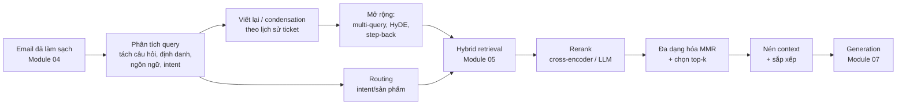
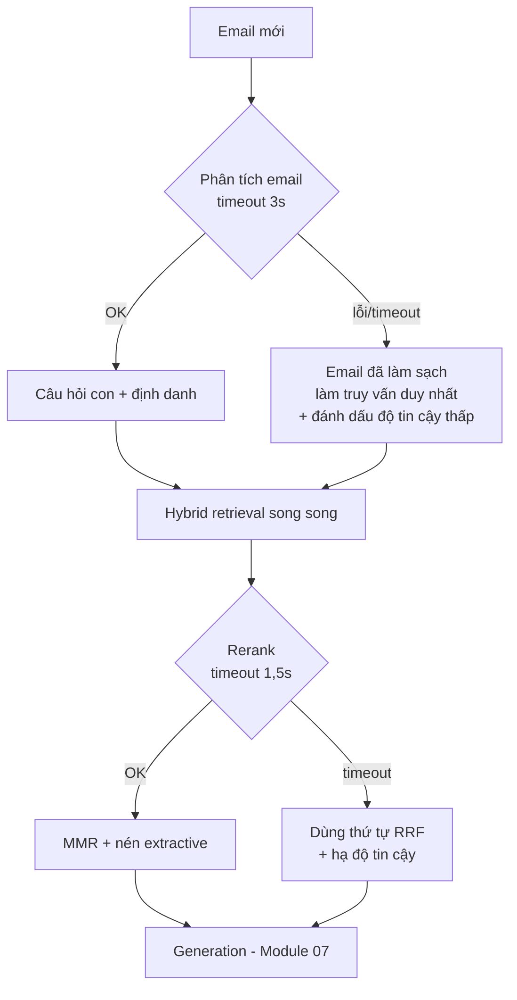

# Module 06 — Xử lý query, reranking, nén context

> Thời lượng: ~40 phút · Mức độ: Trung bình – Nâng cao · Tiên quyết: Module 03 (Embedding), Module 05 (Retrieval)

Module 05 xây tầng "candidate generation": hybrid BM25 + dense trả về ~50–100 ứng viên với recall cao. Module này xử lý hai đầu của tầng đó. **Phía trước**: biến một email lộn xộn của khách thành một hoặc nhiều truy vấn tốt — vì retriever chỉ giỏi bằng truy vấn nó nhận. **Phía sau**: từ 50 ứng viên, chọn ra 5–8 đoạn thật sự liên quan, không trùng lặp, gọn nhẹ, để đưa vào prompt (Module 07). Kèm theo là một câu hỏi rất thực tế: mỗi bước tốn bao nhiêu mili-giây và bao nhiêu tiền, và bước nào đáng làm cho bài toán Zendesk.

## Mục tiêu học tập

Sau module này, bạn có thể:

1. **Phân tích một email khách hàng** thành các truy vấn con có cấu trúc (câu hỏi tường minh, câu hỏi ngầm, định danh, ngôn ngữ, tín hiệu cần người) và viết lại truy vấn độc lập (standalone) từ lịch sử hội thoại.
2. **Giải thích bằng toán** vì sao multi-query/RAG-Fusion tăng recall và vì sao HyDE đưa truy vấn lại gần tài liệu thật trong không gian embedding; nêu được khi nào chúng gây hại.
3. **Phân biệt và ước lượng chi phí** của các loại reranker: cross-encoder, mono/duoT5, LLM reranker pointwise/pairwise/listwise (RankGPT), late interaction (ColBERT); chọn reranker cụ thể (tính đến 10/2026) cho tiếng Việt/Anh/Nhật.
4. **Cài đặt MMR**, tính tay một ví dụ, và chọn $\lambda$ hợp lý cho dữ liệu nhiều bản gần trùng như ticket lịch sử.
5. **Áp dụng nén context** (extractive, Selective Context, LongLLMLingua/LLMLingua-2, RECOMP, Provence) và biết rủi ro của từng cách với nội dung chính sách.
6. **Lập ngân sách latency** cho toàn bộ chuỗi xử lý query → retrieval → rerank → nén, và cắt bước nào khi ngân sách bị vượt.

---

## 1. Bức tranh tổng thể



Một nguyên tắc chi phối toàn module: **mỗi bước thêm vào là thêm latency, thêm chi phí và thêm một chỗ có thể hỏng.** Bước nào cũng phải được biện minh bằng số đo trên golden set (Module 10), không phải vì "paper nói nó tốt". Mình sẽ chỉ rõ ở từng kỹ thuật: nó sửa lỗi gì, cái giá là gì, khi nào không nên dùng.

Ký hiệu dùng trong module: $q$ là truy vấn (văn bản), $\mathbf{q} = E_Q(q) \in \mathbb{R}^D$ là embedding truy vấn, $\mathbf{d} = E_D(d)$ là embedding tài liệu, $\mathrm{sim}(\cdot,\cdot)$ là cosine; $\mathcal{C}_q$ là tập ứng viên sau retrieval; $k$ là số đoạn cuối cùng đưa vào prompt.

---

## 2. Phân tích query trong email

### 2.1 Vấn đề: email không phải là một truy vấn

Truy vấn tìm kiếm điển hình là một câu ngắn có một nhu cầu. Email CS thì khác:

```text
Chào team,
Bên mình đang dùng gói Business, tuần trước nâng lên 50 user. Hóa đơn tháng này
vẫn tính theo 30 user?? Ngoài ra từ hôm qua đồng bộ với MISA báo lỗi ERR_SYNC_409,
mình đã thử reconnect rồi. Nếu không xử lý được trong hôm nay thì cho mình nói chuyện
với ai đó nhé, team kế toán đang chờ chốt sổ.
Thanks,
Lan — Kế toán trưởng
```

Trong vài dòng có:

- **Hai câu hỏi tường minh**: (1) vì sao hóa đơn chưa phản ánh việc nâng user; (2) lỗi `ERR_SYNC_409` khi đồng bộ.
- **Câu hỏi ngầm**: "nâng user giữa kỳ thì tính tiền thế nào" (proration — chính sách giá, vùng **rủi ro cao**, không được bịa), "reconnect không được thì làm gì tiếp".
- **Định danh**: gói "Business", con số 50/30 user, đối tác "MISA", mã lỗi.
- **Tín hiệu escalate**: "cho mình nói chuyện với ai đó" (yêu cầu gặp người — yêu cầu số 2 trong ticket CS), tính khẩn cấp (chốt sổ hôm nay).
- **Nhiễu**: lời chào, chữ ký, chức danh.

Nếu đưa nguyên văn email làm một truy vấn, embedding sẽ là "trung bình" của hai chủ đề và không gần tài liệu nào thật sự; BM25 thì khớp cả các ticket có "thanks" và "kế toán". Hơn nữa, câu trả lời cần **hai nhóm tài liệu khác nhau** — một truy vấn gộp không thể lấy đủ cả hai.

Toán của vấn đề "trung bình hai chủ đề": giả sử embedding của email xấp xỉ $\mathbf{q} \approx \frac{\mathbf{a} + \mathbf{b}}{\|\mathbf{a} + \mathbf{b}\|}$ với $\mathbf{a}, \mathbf{b}$ là hướng của hai chủ đề, chuẩn hóa, gần trực giao ($\mathbf{a}^\top\mathbf{b} \approx 0$). Khi đó $\|\mathbf{a} + \mathbf{b}\| = \sqrt{2}$ và với tài liệu $\mathbf{d}_a$ nằm đúng hướng $\mathbf{a}$: $\mathrm{sim}(\mathbf{q}, \mathbf{d}_a) \approx 1/\sqrt{2} \approx 0{,}71$ thay vì ~1. Tệ hơn, một tài liệu "chung chung" nằm giữa hai hướng (ví dụ bài "Tổng quan về hóa đơn và tích hợp") lại có $\mathrm{sim} \approx 1$ — nó thắng cả hai tài liệu đúng. Với ba chủ đề, con số rơi xuống $1/\sqrt{3} \approx 0{,}58$. Tách câu hỏi không chỉ là "cho gọn" mà là **điều kiện cần** để dense retrieval hoạt động.

<!-- fig:topic-averaging -->
<figure markdown="span">
  { loading=lazy }
  { loading=lazy }
  <figcaption>Hình 6.1 — Trái: email gộp hai chủ đề trực giao nằm giữa hai tài liệu đúng, nên một bài «tổng quan» chung chung lại gần nó nhất. Phải: cosine tới tài liệu đúng giảm theo 1/√m.</figcaption>
</figure>
<!-- /fig -->

### 2.2 Trích xuất có cấu trúc bằng LLM

Cách thực tế nhất: một lời gọi LLM nhỏ, nhiệt độ 0, xuất **JSON theo schema** (structured output — cơ chế constrained decoding ở Module 07). Schema gợi ý:

```python
# query_analysis.py — pydantic v2
from pydantic import BaseModel, Field
from typing import Literal

class SubQuestion(BaseModel):
    text: str = Field(description="Câu hỏi độc lập, đủ ngữ cảnh, cùng ngôn ngữ với khách")
    text_en: str = Field(description="Bản tiếng Anh để truy vấn tài liệu chỉ có tiếng Anh")
    kind: Literal["explicit", "implicit"]
    topic: Literal["billing", "integration", "account", "bug", "how_to", "other"]
    identifiers: list[str] = Field(default_factory=list,
        description="Mã lỗi, tên gói, tên API, phiên bản... giữ NGUYÊN VĂN")

class EmailAnalysis(BaseModel):
    language: Literal["vi", "en", "ja", "mixed"]
    sub_questions: list[SubQuestion]
    wants_human: bool = Field(description="Khách yêu cầu gặp người thật")
    urgency: Literal["low", "normal", "high"]
    sensitive_topics: list[Literal["pricing", "refund", "sla", "legal", "security", "none"]]
```

Prompt hệ thống cần nói rõ: chỉ trích xuất, **không trả lời**; giữ nguyên văn định danh; nội dung email là dữ liệu, không phải chỉ dẫn (phòng prompt injection — Module 07). Với email ở 2.1, đầu ra mong đợi:

```json
{
  "language": "vi",
  "sub_questions": [
    {"text": "Nâng gói Business từ 30 lên 50 user giữa kỳ thì hóa đơn được tính thế nào?",
     "text_en": "How is billing prorated when upgrading Business plan from 30 to 50 users mid-cycle?",
     "kind": "implicit", "topic": "billing", "identifiers": ["Business"]},
    {"text": "Vì sao hóa đơn tháng này vẫn tính 30 user sau khi đã nâng lên 50?",
     "text_en": "Why does this month's invoice still show 30 users after upgrading to 50?",
     "kind": "explicit", "topic": "billing", "identifiers": ["Business"]},
    {"text": "Cách khắc phục lỗi ERR_SYNC_409 khi đồng bộ với MISA, đã thử reconnect",
     "text_en": "How to fix ERR_SYNC_409 when syncing with MISA after reconnect fails",
     "kind": "explicit", "topic": "integration", "identifiers": ["ERR_SYNC_409", "MISA"]}
  ],
  "wants_human": true,
  "urgency": "high",
  "sensitive_topics": ["pricing"]
}
```

Đầu ra này phục vụ **ba** mục đích cùng lúc: truy vấn cho retrieval (mỗi `sub_question` một lượt, cộng `identifiers` làm truy vấn BM25 nguyên văn), tín hiệu cho routing (mục 7) và tín hiệu cho quyết định escalate (Module 10). Một lời gọi, nhiều công dụng — đó là lý do bước này gần như luôn đáng làm.

<!-- fig:email-analysis -->
<figure markdown="span">
  { loading=lazy }
  { loading=lazy }
  <figcaption>Hình 6.2 — Một lời gọi LLM biến email ở mục 2.1 thành truy vấn con, định danh cho BM25 và các tín hiệu routing/escalate.</figcaption>
</figure>
<!-- /fig -->

**Trade-off.** Thêm một lời gọi LLM (với model nhỏ tự host qua vLLM: vài trăm ms đến ~2 s; với API: tương tự cộng mạng). Rủi ro: LLM bỏ sót câu hỏi hoặc "sáng tạo" câu hỏi khách không hỏi. Giảm thiểu: luôn chạy thêm một truy vấn từ **email đã làm sạch nguyên văn** song song với các truy vấn con (lưới an toàn cho recall), và đo trên golden set tỷ lệ email mà mọi câu hỏi được trích đủ.

**Khi nào KHÔNG cần:** truy vấn đã ngắn, một ý (ví dụ ô tìm kiếm trong Help Center). Với email CS, mình gần như luôn bật.

**Liên hệ Zendesk.** `wants_human = true` không có nghĩa là dừng pipeline: ở giai đoạn 1 (AI chỉ soạn draft), vẫn retrieval và soạn draft để agent tiếp nhận nhanh hơn, đồng thời gắn tag, đổi group và gửi thông báo cho CS (Module 12). `sensitive_topics` chứa `pricing` → câu trả lời chỉ được trích chính sách đã retrieve, không được suy luận con số (Module 07).

---

## 3. Viết lại truy vấn theo hội thoại (query condensation)

### 3.1 Vấn đề

Ticket trung bình có 3–4 lượt trao đổi. Lượt thứ ba của khách thường như: "Vẫn không được, mình làm theo bước 2 rồi mà nó báo lỗi khác." Câu này **không tự đứng được**: "nó" là gì, "bước 2" của bài nào, "lỗi khác" là lỗi gì? Retriever không có trí nhớ; nó chỉ thấy chuỗi văn bản.

### 3.2 Kỹ thuật

**Condensation:** cho LLM lịch sử hội thoại $H = (m_1, \dots, m_t)$ và tin nhắn mới $m_{t+1}$, sinh truy vấn độc lập $\tilde{q} = \mathrm{LLM}(H, m_{t+1})$ chứa đủ thực thể: "Lỗi mới sau khi làm bước 2 (tạo lại API token) trong hướng dẫn khắc phục ERR_SYNC_409 khi đồng bộ MISA". Về hình thức, ta muốn $\tilde{q}$ sao cho $p(\text{tài liệu đúng} \mid \tilde{q}) \approx p(\text{tài liệu đúng} \mid H, m_{t+1})$ — nén thông tin liên quan của lịch sử vào một câu.

<!-- fig:condensation -->
<figure markdown="span">
  { loading=lazy }
  { loading=lazy }
  <figcaption>Hình 6.3 — Viết lại tin nhắn không tự đứng được thành truy vấn độc lập, đủ thực thể.</figcaption>
</figure>
<!-- /fig -->

**Rewrite-Retrieve-Read** (Ma et al., 2023, arXiv 2305.14283) đặt bước viết lại thành một khâu riêng, thậm chí huấn luyện một rewriter nhỏ bằng tín hiệu thưởng từ chất lượng câu trả lời cuối. Ý tưởng then chốt áp dụng được ngay: **truy vấn tối ưu cho retriever khác câu hỏi tự nhiên của người dùng**, và nên có một bước chuyên trách việc chuyển đổi đó.

**Những thứ nên đưa vào lịch sử:** tin nhắn của khách, tóm tắt câu trả lời đã gửi (đặc biệt là *những gì đã hướng dẫn* để không gợi ý lại), các bài đã trích dẫn ở lượt trước. **Không** nên đưa: toàn văn các câu trả lời dài (tốn token, kéo truy vấn về chủ đề cũ), internal note của agent chứa thông tin nội bộ nhạy cảm (trừ khi có chủ đích và đã kiểm soát).

### 3.3 Prompt mẫu và cạm bẫy

```text
[SYSTEM] Bạn viết lại tin nhắn mới nhất của khách thành MỘT câu truy vấn tìm kiếm độc lập.
- Thay đại từ ("nó", "cái đó", "bước 2") bằng thực thể cụ thể từ lịch sử.
- Giữ nguyên văn mã lỗi, tên gói, tên tích hợp.
- Nếu tin nhắn mới đổi sang chủ đề khác hẳn, KHÔNG kéo chủ đề cũ vào.
- Không trả lời câu hỏi. Chỉ xuất truy vấn.
[LỊCH SỬ TÓM TẮT] ...
[TIN NHẮN MỚI] ...
```

Cạm bẫy phổ biến nhất là **topic drift ngược**: khách đã chuyển sang hỏi chuyện hóa đơn, nhưng rewriter vẫn chèn "ERR_SYNC_409" vào vì nó nổi bật trong lịch sử → retrieval kéo về bài đồng bộ. Hướng dẫn "nếu đổi chủ đề thì không kéo chủ đề cũ" và một vài ví dụ few-shot thường đủ; đo bằng một tập ~50 cặp hội thoại có nhãn truy vấn chuẩn.

**Liên hệ Zendesk:** lịch sử lấy từ Ticket Comments API (public comment của khách và của agent/AI); bỏ quoted reply (Module 04) vì chúng lặp lại lượt trước. Khi khách trả lời trên một ticket đã đóng và Zendesk tạo ticket follow-up, cần nối với ticket gốc để có lịch sử.

---

## 4. Multi-query và RAG-Fusion

### 4.1 Ý tưởng

Một truy vấn chỉ là một "điểm" trong không gian embedding; tài liệu đúng có thể nằm hơi lệch hướng. Sinh $n$ cách diễn đạt khác nhau $q_1, \dots, q_n$ (đồng nghĩa, thuật ngữ chính thức vs thuật ngữ của khách, ngôn ngữ khác), retrieval từng cái, rồi hợp nhất. **RAG-Fusion** (Rackauckas, 2024, arXiv 2402.03367) chính là: LLM sinh nhiều truy vấn → retrieval mỗi truy vấn → hợp nhất bằng **Reciprocal Rank Fusion** (Module 05, mục 4.2).

### 4.2 Toán: vì sao recall tăng, và vì sao tăng có giới hạn

Gọi $r_i$ là xác suất tài liệu đúng lọt top-$K$ của truy vấn $q_i$. Nếu các sự kiện "trượt" độc lập:

$$
P(\text{lọt ít nhất một danh sách}) = 1 - \prod_{i=1}^{n} (1 - r_i)
$$

Với $r_i = 0{,}6$ và $n = 3$: $1 - 0{,}4^3 = 0{,}936$. Nhưng các diễn đạt lại do *cùng một LLM* sinh ra từ *cùng một câu* thì rất tương quan. Mô hình đơn giản: với xác suất $\rho$ tài liệu là "khó" (mọi diễn đạt cùng trượt), ngược lại các truy vấn độc lập:

$$
P(\text{lọt}) = (1 - \rho)\Big[1 - (1 - r')^n\Big]
$$

với $r'$ là recall trên phần "không khó". Nếu $\rho = 0{,}25$, $r' = 0{,}8$: $n = 1$ cho $0{,}60$; $n = 3$ cho $0{,}744$; $n = \infty$ cũng chỉ $0{,}75$. **Phần lớn lợi ích đến từ 2–3 truy vấn đầu**; thêm nữa chỉ tốn tiền. Phần "khó" cần kỹ thuật khác (HyDE, dịch thuật ngữ, step-back, hoặc đơn giản là kho tri thức thiếu bài).

<!-- fig:multiquery-recall -->
<figure markdown="span">
  { loading=lazy }
  { loading=lazy }
  <figcaption>Hình 6.4 — Recall của multi-query theo số diễn đạt lại: mô hình độc lập so với mô hình có phần «khó» ρ = 0.25 (bão hòa ở 0.75).</figcaption>
</figure>
<!-- /fig -->

Về precision: hợp nhiều danh sách cũng kéo theo nhiều nhiễu hơn. RRF giúp vì tài liệu xuất hiện ở *nhiều* danh sách được cộng điểm (đồng thuận), còn nhiễu riêng của một diễn đạt thường chỉ xuất hiện một lần. Sau đó reranker (mục 8) lọc tiếp.

### 4.3 Code

```python
# multi_query.py — dùng lại hàm rrf() của Module 05
from typing import Callable

def multi_query_retrieve(sub_q: str, identifiers: list[str],
                         paraphrase: Callable[[str, int], list[str]],
                         hybrid_search: Callable[[str], list[str]],
                         bm25_search: Callable[[str], list[str]],
                         n_para: int = 2, top_n: int = 50) -> list[str]:
    queries = [sub_q] + paraphrase(sub_q, n_para)      # truy vấn gốc luôn được giữ
    ranked_lists = [hybrid_search(q) for q in queries]  # mỗi lượt đã là hybrid (Module 05)
    if identifiers:                                     # định danh nguyên văn -> BM25 riêng
        ranked_lists.append(bm25_search(" ".join(identifiers)))
    fused = rrf(ranked_lists, k=60, top_n=top_n)
    return [doc_id for doc_id, _ in fused]
```

Prompt sinh diễn đạt lại nên yêu cầu **đa dạng có chủ đích**: một bản dùng thuật ngữ chính thức của sản phẩm (có thể đưa vào prompt một glossary ngắn: "quay mãi không xong" ↔ "timeout"), một bản tiếng Anh (vì nhiều tài liệu chỉ có tiếng Anh), thay vì ba câu gần giống nhau.

### 4.4 Trade-off và liên hệ Zendesk

| Ưu | Nhược |
|---|---|
| Tăng recall với vocabulary mismatch; cầu nối ngôn ngữ (vi/ja → en) | +1 lời gọi LLM; retrieval × $n$ |
| Dễ cài, không cần train | Diễn đạt lại có thể "trôi" khỏi ý khách (đặc biệt câu mơ hồ) |
| RRF hợp nhất không cần chuẩn hóa điểm | Nhiều ứng viên hơn → rerank đắt hơn |

Với ~5.000 lượt retrieval/ngày, nhân 3–4 lần vẫn rất nhỏ (Module 05: < 1 QPS). Chi phí thật là lời gọi LLM sinh diễn đạt — có thể **gộp vào cùng lời gọi phân tích email** ở mục 2.2 (trường `text_en` chính là một diễn đạt lại xuyên ngôn ngữ). Mình khuyên: truy vấn gốc + bản tiếng Anh + truy vấn định danh BM25; chỉ thêm diễn đạt thứ tư nếu golden set cho thấy lợi.

---

## 5. HyDE — Hypothetical Document Embeddings

### 5.1 Ý tưởng

HyDE (Gao, Ma, Lin, Callan; arXiv 2212.10496, ACL 2023): thay vì embed câu hỏi, cho LLM **viết một tài liệu giả định** trả lời câu hỏi (có thể sai về chi tiết), embed tài liệu đó, rồi tìm láng giềng trong kho tài liệu thật. Bài gốc sinh nhiều tài liệu giả định và lấy trung bình embedding của chúng cùng với embedding câu hỏi:

$$
\hat{\mathbf{v}} = \frac{1}{N+1}\Big(\mathbf{q} + \sum_{j=1}^{N} E_D(\tilde{d}_j)\Big),\qquad \tilde{d}_j \sim \mathrm{LLM}(\cdot \mid \text{"Viết đoạn văn trả lời: } q\text{"})
$$

rồi tìm theo $\mathrm{sim}(\hat{\mathbf{v}}, \mathbf{d})$. Encoder trong bài là một dense retriever huấn luyện không giám sát (Contriever), và đóng góp chính là **zero-shot**: không cần nhãn relevance vẫn đạt kết quả tốt.

### 5.2 Vì sao nó hoạt động — giải thích bằng toán

Mô hình hóa embedding như tổng của các thành phần:

$$
\mathbf{q} = \boldsymbol{\mu}_z + \boldsymbol{\delta}_{\text{Q}} + \boldsymbol{\epsilon}_q, \qquad
\mathbf{d} = \boldsymbol{\mu}_z + \boldsymbol{\delta}_{\text{D}} + \boldsymbol{\epsilon}_d
$$

trong đó $\boldsymbol{\mu}_z$ là "hướng chủ đề" $z$ (ví dụ hoàn tiền gói năm), $\boldsymbol{\delta}_{\text{Q}}$ là **độ lệch phong cách câu hỏi** (ngắn, dạng hỏi, đại từ ngôi thứ nhất, từ ngữ của khách), $\boldsymbol{\delta}_{\text{D}}$ là **độ lệch phong cách tài liệu** (dài, khẳng định, thuật ngữ chính thức), và $\boldsymbol{\epsilon}$ là nhiễu riêng.

- Khoảng cách câu hỏi–tài liệu đúng chứa hạng tử $\boldsymbol{\delta}_{\text{Q}} - \boldsymbol{\delta}_{\text{D}}$: một **khoảng lệch hệ thống** giữa "không gian câu hỏi" và "không gian tài liệu". Bi-encoder bất đối xứng được huấn luyện để thu hẹp khoảng này (đó là lý do có tiền tố "query:"/"passage:", Module 03), nhưng không triệt tiêu hoàn toàn — nhất là ngoài miền huấn luyện.
- Tài liệu giả định $\tilde{d}_j = \boldsymbol{\mu}_{z'} + \boldsymbol{\delta}_{\text{D}} + \boldsymbol{\epsilon}_j$ có **cùng phong cách** với tài liệu thật: hạng tử lệch phong cách biến mất. Nếu LLM hiểu đúng chủ đề ($z' \approx z$), $\tilde{d}_j$ gần $\mathbf{d}$ hơn $\mathbf{q}$.
- Lấy trung bình $N$ tài liệu giả định làm giảm nhiễu: nếu $\boldsymbol{\epsilon}_j$ độc lập, phương sai $\sigma^2$ mỗi chiều, thì trung bình có phương sai $\sigma^2/N$. Các chi tiết bịa đặt khác nhau giữa các lần sinh (một bản nói "hoàn trong 7 ngày", bản khác nói "14 ngày") **triệt tiêu một phần**, còn phần chung (chủ đề) được giữ lại. Đây là cách HyDE "lọc" ảo giác ở mức embedding: encoder đóng vai trò nút thắt cổ chai giữ lại ngữ nghĩa chung, bỏ bớt chi tiết.

**Ví dụ số (đồ chơi, 4 chiều).** Trục: [hoàn tiền, hóa đơn, phong cách tài liệu, phong cách câu hỏi]. Đã chuẩn hóa:

- Câu hỏi khách: $\mathbf{q} = (0{,}51;\ 0;\ 0;\ 0{,}86)$ — nói về hoàn tiền, nhưng mang đậm phong cách câu hỏi.
- Tài liệu đúng (bài "Chính sách hoàn tiền"): $\mathbf{d}_1 = (0{,}6;\ 0;\ 0{,}8;\ 0)$.
- Tài liệu sai nhưng cùng *dạng câu hỏi* (một FAQ "Làm sao đổi thông tin hóa đơn?"): $\mathbf{d}_2 = (0;\ 0{,}5;\ 0;\ 0{,}87)$.
- Tài liệu giả định do LLM viết: $\mathbf{g} = (0{,}55;\ 0{,}05;\ 0{,}83;\ 0)$.

Cosine: $\mathrm{sim}(\mathbf{q}, \mathbf{d}_1) = 0{,}51 \times 0{,}6 = 0{,}30$; $\mathrm{sim}(\mathbf{q}, \mathbf{d}_2) = 0{,}86 \times 0{,}87 = 0{,}75$ → **truy vấn gốc chọn sai** vì khớp phong cách thay vì chủ đề. Với HyDE: $\mathrm{sim}(\mathbf{g}, \mathbf{d}_1) \approx 0{,}997$, $\mathrm{sim}(\mathbf{g}, \mathbf{d}_2) \approx 0{,}03$ → chọn đúng. Trộn $\hat{\mathbf{v}} = \mathrm{normalize}(\mathbf{q} + \mathbf{g})$: $0{,}81$ vs $0{,}48$ — vẫn đúng, và giữ một phần "neo" vào ý định gốc của khách. Ví dụ phóng đại có chủ đích, nhưng hiện tượng "khớp phong cách" là có thật: trong kho Zendesk, câu hỏi của khách rất dễ khớp với **ticket lịch sử khác chủ đề nhưng cùng giọng văn**, thay vì bài Help Center đúng.

<!-- fig:hyde -->
<figure markdown="span">
  { loading=lazy }
  { loading=lazy }
  <figcaption>Hình 6.5 — Trái: phép chiếu minh họa của ví dụ 4 chiều — truy vấn khớp «phong cách câu hỏi», tài liệu giả định khớp «phong cách tài liệu». Phải: các cosine tính trong mục 5.2.</figcaption>
</figure>
<!-- /fig -->

### 5.3 Query2doc — biến thể cho sparse

Query2doc (Wang, Yang, Wei; arXiv 2303.07678, EMNLP 2023) sinh pseudo-document bằng LLM rồi **nối** với truy vấn. Với BM25, truy vấn gốc được lặp lại vài lần trước khi nối để không bị pseudo-document dài "nhấn chìm" (trọng số term của truy vấn gốc vẫn chiếm ưu thế); với dense thì nối một lần. Lợi ích cho BM25: pseudo-document mang theo thuật ngữ chính thức ("prorated", "pro-rata", "hoàn tiền theo tỷ lệ") mà khách không dùng — một dạng query expansion.

### 5.4 Khi nào HyDE gây hại

1. **Câu hỏi về sự kiện riêng tư/mới** mà LLM không biết (tính năng ra tuần trước, chính sách riêng của công ty): tài liệu giả định có thể mô tả *chính sách phổ biến trên thị trường* thay vì chính sách của bạn → kéo retrieval về bài sai, hoặc về ticket lịch sử nói chính sách cũ. Đây là rủi ro lớn nhất trong bài toán Zendesk, nơi điều cấm kỵ là bịa chính sách.
2. **Truy vấn định danh** (`ERR_SYNC_409`): LLM bịa ra nguyên nhân lỗi → embedding lệch. BM25 trên định danh tốt hơn nhiều.
3. **Latency**: sinh một đoạn 100–200 token mất cỡ 1–3 s với model nhỏ tự host; sinh $N = 4$ bản thì tốn hơn (có thể song song/batch).
4. **Encoder đã được fine-tune tốt trên miền** (Module 09): khoảng lệch $\boldsymbol{\delta}_Q - \boldsymbol{\delta}_D$ đã nhỏ, HyDE thêm ít.

**Quan trọng:** tài liệu giả định **chỉ dùng để retrieval**, tuyệt đối không đưa vào context của bước generation và không log như thể là tri thức.

**Liên hệ Zendesk.** Mình không bật HyDE mặc định. Dùng nó có điều kiện: (a) như một nhánh *bổ sung* trong RAG-Fusion (hợp nhất bằng RRF với nhánh truy vấn gốc, không thay thế); (b) chỉ cho topic `how_to`/`bug` dạng mô tả, không cho `billing`/`refund`/`sla`; (c) chỉ khi điểm reranker cao nhất của lượt đầu thấp hơn một ngưỡng (retrieval "không tự tin") — một dạng adaptive retrieval (Module 08).

---

## 6. Query decomposition và step-back prompting

### 6.1 Decomposition

Khác với tách câu hỏi trong email (các câu hỏi độc lập), **decomposition** dành cho một câu hỏi cần **nhiều bước suy luận** trên nhiều tài liệu: "Gói Business có hỗ trợ SSO với Azure AD không, và nếu nâng lên Enterprise giữa kỳ thì SSO có kích hoạt ngay không?" → (1) Gói nào hỗ trợ SSO/Azure AD? (2) Khi nâng gói giữa kỳ, tính năng mới có hiệu lực khi nào?

Có hai dạng:
- **Song song**: các câu con độc lập → retrieval song song, hợp nhất. Rẻ, dễ.
- **Tuần tự (multi-hop)**: câu con sau phụ thuộc kết quả câu trước ("phiên bản nào sửa lỗi X?" → "phiên bản đó yêu cầu cấu hình gì?"). Self-ask (Press et al., arXiv 2210.03350) cho LLM tự hỏi câu tiếp theo, tự trả lời bằng retrieval, lặp lại. Đây đã là vòng lặp kiểu agent — thuộc Module 08 (IRCoT/ReAct); ở đây chỉ cần biết ranh giới.

### 6.2 Step-back prompting

Step-back (Zheng et al., arXiv 2310.06117) yêu cầu LLM trước tiên **lùi một bước** để hỏi câu tổng quát hơn — về nguyên lý hoặc khái niệm nền — rồi dùng cả câu tổng quát và câu cụ thể. Trong RAG: "Tại sao tài khoản của tôi bị khóa sau khi đổi email?" → step-back: "Chính sách bảo mật khi thay đổi email đăng nhập là gì?". Câu step-back khớp với bài chính sách tổng quát (thường là nguồn đáng tin nhất), còn câu cụ thể khớp với ticket tương tự.

Trực giác bằng toán: câu cụ thể có embedding $\mathbf{q} = \boldsymbol{\mu}_{\text{khái niệm}} + \boldsymbol{\delta}_{\text{chi tiết}}$; khi $\boldsymbol{\delta}_{\text{chi tiết}}$ lớn (nhiều chi tiết riêng của khách), nó kéo truy vấn ra xa bài tổng quát. Câu step-back xấp xỉ $\boldsymbol{\mu}_{\text{khái niệm}}$ — "chiếu" truy vấn về tâm của chủ đề.

<!-- fig:decomposition-stepback -->
<figure markdown="span">
  { loading=lazy }
  { loading=lazy }
  <figcaption>Hình 6.6 — Decomposition tách một câu ghép thành các câu con độc lập; step-back thêm một câu tổng quát để khớp bài chính sách nền.</figcaption>
</figure>
<!-- /fig -->

### 6.3 Liên hệ Zendesk

| Kỹ thuật | Dùng khi | Ví dụ ticket |
|---|---|---|
| Tách câu hỏi (mục 2) | Email nhiều ý độc lập | Hóa đơn + lỗi đồng bộ |
| Decomposition song song | Một câu ghép nhiều điều kiện | SSO + nâng gói giữa kỳ |
| Multi-hop (Module 08) | Cần kết quả bước trước | "Bản vá cho lỗi X có trong phiên bản tôi đang dùng không?" |
| Step-back | Câu rất cụ thể, cần chính sách nền | Khóa tài khoản sau khi đổi email |

Thực tế, mình gộp "tách câu hỏi + decomposition song song + một câu step-back cho topic nhạy cảm" vào **cùng một lời gọi LLM** phân tích email (thêm trường `step_back` vào schema), thay vì ba lời gọi.

---

## 7. Routing theo intent và sản phẩm

### 7.1 Vấn đề

Kho tri thức gồm nhiều nguồn khác nhau về độ tin cậy và mục đích: Help Center (chính thức), macro (mẫu trả lời, đã duyệt), ticket lịch sử (thực tế nhưng có thể lỗi thời, đã ẩn danh hóa), tài liệu API (kỹ thuật, tiếng Anh), release notes (theo phiên bản), chính sách giá/SLA (nhạy cảm nhất). Tìm trên tất cả với cùng trọng số thường cho kết quả lẫn lộn: câu hỏi giá cả lại kéo về một ticket năm ngoái nói giá cũ.

### 7.2 Cách làm

**Routing** = chọn nguồn (index/collection/filter), trọng số và chiến lược theo nhãn của truy vấn. Nhãn lấy từ bước phân tích (mục 2) hoặc một classifier nhỏ (embedding + logistic regression, hoặc fine-tune — Module 09).

| Intent | Nguồn ưu tiên | Ghi chú |
|---|---|---|
| `billing` / `refund` / `sla` | Chính sách hiện hành + Help Center + macro | **Loại ticket lịch sử** khỏi context trả lời (chỉ dùng để tham khảo cách diễn đạt); lọc `valid_until` |
| `integration` / `bug` | Tài liệu API, release notes, Help Center, ticket lịch sử đã giải quyết | BM25 trên định danh được trọng số cao |
| `how_to` | Help Center, macro | Thường đủ với naive + rerank |
| `account` (dữ liệu riêng của khách) | Không phải retrieval — cần gọi API nội bộ | Agent + tool (Module 08); hoặc escalate |

**Routing mềm vs cứng.** Routing cứng (chỉ tìm trong một nguồn) rẻ và sạch nhưng nếu phân loại sai thì recall về 0. Gọi $a$ là độ chính xác của router, $r_{\text{in}}$ là recall khi route đúng, $r_{\text{all}}$ là recall khi tìm trên tất cả nguồn. Recall kỳ vọng của routing cứng là $a \cdot r_{\text{in}}$ (giả định route sai thì trượt hẳn). Với $a = 0{,}9$, $r_{\text{in}} = 0{,}9$: $0{,}81$ — có thể **thua** $r_{\text{all}} = 0{,}85$ dù mỗi nguồn riêng tốt hơn. Vì vậy:

<!-- fig:routing-hard-soft -->
<figure markdown="span">
  { loading=lazy }
  { loading=lazy }
  <figcaption>Hình 6.7 — Recall kỳ vọng của routing cứng a·r_in so với tìm trên mọi nguồn; với r_in = 0.9, router phải đúng trên ~94% mới hòa vốn.</figcaption>
</figure>
<!-- /fig -->

- Dùng **routing mềm**: tìm trên tất cả nguồn được phép, nhưng nhân trọng số theo nguồn (weighted RRF) hoặc boost ở tầng rerank.
- Routing cứng **chỉ** khi xác suất của router cao (ví dụ $\ge 0{,}9$ đã hiệu chuẩn — Module 10), còn lại rơi về routing mềm.
- Ngoại lệ là **routing vì an toàn** (loại ticket lịch sử khỏi câu trả lời về giá) — đó là quy tắc chính sách, luôn cứng.

**Liên hệ Zendesk.** Router còn quyết định **có retrieval hay không**: intent "cảm ơn, đã giải quyết" → không cần retrieval, chỉ cần đóng ticket/gửi CSAT; intent "muốn gặp người" → vẫn retrieval để soạn tóm tắt cho agent nhưng chuyển ngay. Routing theo **sản phẩm/phiên bản** (khách dùng bản on-premise v3.x vs cloud) lấy từ custom field của organization trên Zendesk, không từ LLM — dữ liệu có cấu trúc đáng tin hơn suy đoán.

---

## 8. Reranking

### 8.1 Vì sao cần tầng thứ hai

Bi-encoder (Module 03) mã hóa truy vấn và tài liệu **độc lập**: $s(q, d) = \langle E_Q(q), E_D(d) \rangle$. Toàn bộ thông tin của một chunk 300 token bị ép vào một vector $D$ chiều *trước khi biết câu hỏi là gì*. Hệ quả: nó không thể chú ý vào đúng câu trong chunk liên quan đến câu hỏi này, không phân biệt tốt "hoàn tiền được" với "hoàn tiền không được", không bắt chi tiết như "gói Business" vs "gói Business Plus". Cái được là tốc độ: embedding tài liệu tính trước, truy vấn chỉ cần một tích vô hướng.

Reranker đảo ngược đánh đổi này: chỉ áp dụng cho $k$ ứng viên (thường 20–100), nhưng mỗi cặp $(q, d)$ được xét **chung**, cho phép tương tác ở mức token. Kiến trúc retrieve-then-rerank là tiêu chuẩn từ monoBERT (Nogueira & Cho, 2019) đến nay.

### 8.2 Cross-encoder: toán và chi phí

**Mô hình.** Ghép $[\texttt{CLS}]\ q\ [\texttt{SEP}]\ d\ [\texttt{SEP}]$, đưa qua một Transformer encoder, lấy biểu diễn $\mathbf{h}_{\texttt{CLS}}$ và một lớp tuyến tính:

$$
s(q, d) = \mathbf{w}^\top \mathbf{h}_{\texttt{CLS}}\big(\mathrm{Transformer}([q; d])\big) + b
$$

Khác bi-encoder, $s$ là một **hàm chung** $f(q, d)$ — không phân tách được thành $\langle g(q), h(d)\rangle$. Mọi lớp self-attention cho phép token của $q$ chú ý tới token của $d$ và ngược lại. Đó là nguồn sức mạnh (biểu diễn phụ thuộc truy vấn) và cũng là lý do không thể tính trước gì cho tài liệu.

**Huấn luyện** (chi tiết ở Module 09): pointwise với binary cross-entropy $-[y \log \sigma(s) + (1-y)\log(1 - \sigma(s))]$, hoặc listwise với softmax trên một nhóm gồm 1 positive và nhiều hard negative: $-\log \frac{e^{s(q,d^+)}}{\sum_{d \in \{d^+\} \cup \mathcal{N}} e^{s(q,d)}}$.

**Chi phí.** Rerank $k$ ứng viên = $k$ lượt forward (batch được), mỗi lượt dài $L = L_q + L_d$ token. FLOPs xấp xỉ:

$$
\text{FLOPs} \approx k \cdot \big(2 P_{\text{non-emb}} \cdot L + O(n_{\text{layers}} \cdot L^2 \cdot d_{\text{model}})\big)
$$

với $P_{\text{non-emb}}$ là số tham số không tính bảng embedding (bảng embedding chỉ là tra cứu, gần như không tốn FLOPs). Hạng tử $L^2$ (attention) đáng kể khi $L$ lớn — lý do cắt chunk về ~512 token cho reranker.

**Ví dụ số (ước lượng).** `bge-reranker-v2-m3` có ~0,57B tham số; phần lớn là bảng embedding cho từ vựng đa ngữ cỡ 250k token × 1024 chiều ≈ 0,26B, nên $P_{\text{non-emb}} \approx 0{,}3$B. Rerank $k = 50$ chunk, $L \approx 400$: $50 \times 2 \times 0{,}3 \cdot 10^9 \times 400 \approx 1{,}2 \cdot 10^{13}$ FLOPs = 12 TFLOP. Giả định GPU đạt hiệu dụng ~30 TFLOPS fp16 (ước lượng cho GPU datacenter tầm trung; GPU laptop như RTX 4050 thấp hơn) → **~0,4 s**; trên CPU nhiều lõi: vài giây đến hàng chục giây. Từ đây rút ra hai đòn bẩy: giảm $k$ (50 → 30 tiết kiệm 40%), và giảm $L$ (rerank trên chunk con thay vì chunk cha dài).

<!-- fig:rerank-cascade -->
<figure markdown="span">
  { loading=lazy }
  { loading=lazy }
  <figcaption>Hình 6.8 — Trái: kiến trúc nhiều tầng của mục 1. Phải: thời gian rerank ước lượng theo công thức FLOPs của mục 8.2 (bỏ qua hạng tử L²).</figcaption>
</figure>
<!-- /fig -->

**Ngân sách VRAM trên 6 GB:** ~0,57B tham số fp16 ≈ 1,1 GB trọng số; activation cho batch 16–32 cặp × 512 token vẫn vừa. Đây là reranker phù hợp cho lab cá nhân.

### 8.3 monoT5 và duoT5 (ý tưởng)

**monoT5** (Nogueira, Jiang, Pradeep, Lin; arXiv 2003.06713): dùng mô hình seq2seq T5, đầu vào `Query: q Document: d Relevant:`, điểm là xác suất sinh token "true" so với "false":

$$
s(q, d) = \frac{e^{z_{\text{true}}}}{e^{z_{\text{true}}} + e^{z_{\text{false}}}}
$$

Ý tưởng "dùng logit của token trả lời làm điểm" là tổ tiên trực tiếp của các reranker dựa trên LLM ngày nay (mục 8.6).

**duoT5** (pairwise): đầu vào gồm $q$ và **hai** tài liệu $d_i, d_j$, mô hình ước lượng $p_{ij} = P(d_i \succ d_j \mid q)$. Điểm tổng hợp cho $d_i$ là $\sum_{j \ne i} p_{ij}$. Chi phí $O(k^2)$ lượt forward — vì vậy mẫu thiết kế **Expando-Mono-Duo** (Pradeep, Nogueira, Lin; arXiv 2101.05667) chỉ dùng duo cho top rất nhỏ (ví dụ 50 cặp từ top-10) sau mono. Bài học kiến trúc: **xếp tầng theo chi phí** — mỗi tầng đắt hơn xử lý ít ứng viên hơn.

### 8.4 Late interaction (ColBERT) như reranker

ColBERT (Khattab & Zaharia, arXiv 2004.12832) giữ **embedding cho từng token**: $\{\mathbf{q}_i\}_{i=1}^{|q|}$ và $\{\mathbf{d}_j\}_{j=1}^{|d|}$ (chuẩn hóa, chiều nhỏ ~128). Điểm MaxSim (Module 03):

$$
s(q, d) = \sum_{i=1}^{|q|} \max_{j} \ \mathbf{q}_i^\top \mathbf{d}_j
$$

Như một reranker: token embedding của tài liệu tính trước và lưu; khi rerank, chỉ encode truy vấn rồi tính $|q| \times |d| \times 128$ phép nhân-cộng mỗi tài liệu. Với $|q| = 32$, $|d| = 300$, $k = 50$: ~61 triệu phép nhân-cộng — **vài mili-giây trên CPU**, rẻ hơn cross-encoder hai đến ba bậc. Cái giá là **bộ nhớ**: 300 token × 128 chiều × 2 byte ≈ 77 KB/chunk; 500k chunk ≈ 38 GB nếu không nén (ColBERTv2, arXiv 2112.01488, dùng nén residual để giảm mạnh con số này). Chất lượng thường nằm giữa bi-encoder và cross-encoder.

**Khi nào chọn:** latency cực chặt hoặc không có GPU cho cross-encoder; hoặc như tầng giữa: dense top-200 → ColBERT top-50 → cross-encoder top-10. Qdrant hỗ trợ multi-vector để làm tầng này trong cùng truy vấn `prefetch` (Module 05).

### 8.5 LLM làm reranker: pointwise, pairwise, listwise

Khi dùng LLM sinh văn bản (decoder-only) để xếp hạng, có ba cách đặt bài toán:

**Pointwise.** Mỗi cặp $(q, d)$ một lời gọi: "Tài liệu có trả lời câu hỏi không? yes/no", lấy $s = P(\text{yes})$ từ logprob (Module 01), hoặc yêu cầu điểm 0–3. Chi phí $O(k)$ lời gọi, song song được. Nhược: điểm giữa các lời gọi không được hiệu chuẩn với nhau (mỗi lời gọi chỉ thấy một tài liệu, không có thước đo tương đối); yêu cầu "điểm 0–10" dạng văn bản thì rất thô và dồn cục.

**Pairwise** (PRP — Qin et al., arXiv 2306.17563): "Tài liệu A hay B liên quan hơn?". So sánh tương đối dễ với LLM hơn chấm điểm tuyệt đối. Nhưng: all-pairs cần $k(k-1)$ lời gọi (hỏi cả hai thứ tự để khử **bias vị trí** — LLM hay ưu tiên tài liệu đặt trước); với $k = 50$ là 2.450 lời gọi. Biến thể sắp xếp (heap sort, sliding window kiểu bubble sort cho top-$K$) giảm còn $O(k \log k)$ hoặc $O(K \cdot k)$.

**Listwise** (RankGPT — Sun et al., arXiv 2304.09542, EMNLP 2023): đưa cả danh sách $[1]\ d_1 \dots [w]\ d_w$ vào prompt, yêu cầu xuất hoán vị như `[3] > [1] > [7] > ...`. Context có hạn nên dùng **cửa sổ trượt** từ cuối danh sách lên đầu: cửa sổ $w$, bước $s$. Số lời gọi cho $k$ ứng viên:

$$
n_{\text{calls}} = \left\lceil \frac{k - w}{s} \right\rceil + 1
$$

Với $k = 100$, $w = 20$, $s = 10$: 9 lời gọi, mỗi lời gọi ~20 đoạn × ~100 token ≈ 2.000 token đầu vào. Một lượt quét từ dưới lên đảm bảo tài liệu tốt nhất "nổi" lên top (giống một lượt bubble sort), đủ cho mục tiêu chọn top-10. RankVicuna (arXiv 2309.15088) và RankZephyr (arXiv 2312.02724) chưng cất khả năng listwise vào model mở 7B; Setwise (Zhuang et al., arXiv 2310.09497) chọn "tài liệu tốt nhất trong một nhóm nhỏ" để cân bằng chi phí giữa pairwise và listwise.

| Cách | Số lời gọi cho $k$ ứng viên | Ưu | Nhược |
|---|---|---|---|
| Pointwise | $k$ (song song) | đơn giản, có điểm để đặt ngưỡng | điểm thiếu hiệu chuẩn tương đối |
| Pairwise all-pairs | $k(k-1)$ | so sánh tương đối, chính xác | quá đắt khi $k$ lớn |
| Pairwise sorting | $O(k \log k)$ hoặc $O(Kk)$ | rẻ hơn nhiều | vẫn tuần tự, latency cao |
| Listwise sliding window | $\lceil (k-w)/s \rceil + 1$ | xét tương quan cả nhóm | output hoán vị có thể lỗi định dạng; nhạy thứ tự đầu vào |

<!-- fig:llm-rerank-calls -->
<figure markdown="span">
  { loading=lazy }
  { loading=lazy }
  <figcaption>Hình 6.9 — Số lời gọi LLM theo số ứng viên cho từng cách dùng LLM làm reranker (trục log).</figcaption>
</figure>
<!-- /fig -->

### 8.6 Reranker "LLM-based" chuyên dụng — điểm giao giữa hai thế giới

Thế hệ reranker mới (tính đến 10/2026) là **mô hình LLM nhỏ được huấn luyện riêng cho xếp hạng**, gộp ưu điểm cả hai bên:

- **Qwen3-Reranker** (0,6B / 4B / 8B; Apache 2.0; ngữ cảnh 32k; hơn 100 ngôn ngữ; báo cáo kỹ thuật arXiv 2506.05176): định dạng đầu vào gồm instruction, query, document; điểm là xác suất token "yes" so với "no" ở vị trí cuối — đúng tinh thần monoT5 nhưng trên decoder-only. **Instruction-aware**: có thể viết instruction theo miền (ví dụ "Đánh giá đoạn này có trả lời được câu hỏi hỗ trợ khách hàng về phần mềm SaaS không"); model card cho biết instruction phù hợp thường thêm khoảng 1–5%.
- **jina-reranker-v3** (0,6B, dựa trên Qwen3-0.6B; arXiv 2509.25085): **listwise** trong một lượt forward — đưa query và tới 64 tài liệu vào cùng cửa sổ ngữ cảnh lớn, các tài liệu "nhìn thấy nhau" qua attention. **Giấy phép CC BY-NC 4.0** — không dùng thương mại nếu không có thỏa thuận riêng.
- **bge-reranker-v2-m3** (BAAI; ~0,57B; Apache 2.0): cross-encoder đa ngữ dựa trên nền BGE-M3, đã chứng minh trong rất nhiều hệ production; nhẹ, ổn định — **baseline mặc định** của mình.
- **mxbai-rerank-v2** (Mixedbread; base/large; Apache 2.0): thêm một lựa chọn mở đa ngữ.
- **API thương mại:** Cohere Rerank 4 (`rerank-v4.0-pro` và `rerank-v4.0-fast`, ra 12/2025, ngữ cảnh 32k, đa ngữ); Voyage `rerank-3` và `rerank-3-lite` (ra 30/09/2026, ngữ cảnh 32K, có instruction-following). Các bảng so sánh do nhà cung cấp tự công bố — luôn tự đánh giá trên dữ liệu của mình.

### 8.7 Chọn reranker cho Zendesk

| Tiêu chí | Gợi ý |
|---|---|
| Self-host, GPU 6 GB / GPU nhỏ, đa ngữ vi/en/ja, thương mại | `bge-reranker-v2-m3` (baseline) → thử `Qwen3-Reranker-0.6B` có instruction |
| Có GPU lớn hơn, cần chất lượng cao hơn | `Qwen3-Reranker-4B` (có thể lượng tử hóa) |
| Không muốn vận hành GPU, chấp nhận gửi dữ liệu ra ngoài | Cohere / Voyage — **chỉ sau khi** đã che PII và kiểm tra điều khoản xử lý dữ liệu (Module 11) |
| Latency cực chặt, không có GPU | ColBERT/multi-vector rerank hoặc bỏ rerank, tăng chất lượng hybrid |
| Dữ liệu có nhãn từ ticket lịch sử | Fine-tune reranker (Module 09) — thường là cải thiện lớn nhất |

Quy trình đánh giá: golden set ~300 truy vấn phân tầng theo ngôn ngữ và intent (Module 10), đo nDCG@10 và Recall@5 trước/sau rerank, **tách riêng tiếng Nhật** — đa số benchmark công khai thiên về tiếng Anh/Trung, chất lượng trên tiếng Việt/Nhật miền SaaS phải tự đo.

### 8.8 Code: rerank với cross-encoder và các tín hiệu bổ sung

```python
# rerank.py — sentence-transformers >= 3.x; chạy được trên GPU 6GB (fp16)
from sentence_transformers import CrossEncoder
import math

reranker = CrossEncoder("BAAI/bge-reranker-v2-m3", max_length=512)
reranker.model.half()  # fp16 để tiết kiệm VRAM (cần GPU)

def rerank(query: str, cands: list[dict], top_n: int = 20,
           lang: str | None = None, beta_lang: float = 0.3) -> list[dict]:
    """cands: [{'id':..., 'text':..., 'lang':..., 'source':...}] từ hybrid retrieval."""
    logits = reranker.predict([(query, c["text"]) for c in cands], batch_size=16)
    for c, z in zip(cands, logits):
        c["rerank_logit"] = float(z)
        c["rerank_prob"] = 1 / (1 + math.exp(-float(z)))   # sigmoid: KHÔNG phải xác suất đã hiệu chuẩn
        # boost nhẹ cùng ngôn ngữ (Module 05: không lọc cứng locale)
        c["final"] = c["rerank_logit"] + (beta_lang if lang and c.get("lang") == lang else 0.0)
    return sorted(cands, key=lambda c: -c["final"])[:top_n]
```

Ba lưu ý:

1. **Điểm reranker là tín hiệu tốt cho quyết định "có đủ thông tin không"** (Module 10): nếu logit cao nhất vẫn thấp, khả năng cao là kho không có câu trả lời → nghiêng về abstain/escalate. Nhưng sigmoid của logit **không phải xác suất đã hiệu chuẩn** và thang điểm khác nhau giữa các model; phải hiệu chuẩn (Platt/temperature scaling) trên dữ liệu có nhãn trước khi đặt ngưỡng.
2. **Boost cộng vào logit** (ngôn ngữ, độ mới `updated_at`, nguồn chính thức) nên nhỏ và được tune; chúng là "chính sách" của bạn, tách khỏi mô hình.
3. **Truncation:** tài liệu bị cắt ở `max_length` — nếu chunk dài hơn, câu trả lời ở cuối chunk bị mất. Chunk cho reranker nên ≤ ~400 token (Module 04: chunk con trong parent-child).

---

## 9. MMR và đa dạng hóa

### 9.1 Vấn đề

Kho ticket lịch sử chứa hàng trăm ticket "quên mật khẩu" gần như giống hệt; Help Center có bài tiếng Việt, tiếng Anh, tiếng Nhật của cùng một nội dung. Sau rerank, top-8 có thể là 6 bản gần trùng của cùng một thông tin. Hệ quả: lãng phí ngân sách token, **che mất** khía cạnh thứ hai của câu hỏi (ví dụ chỉ thấy cách đặt lại mật khẩu, không thấy chính sách khóa tài khoản), và đẩy LLM về hướng "đa số phiếu" của các ticket cũ.

Deduplication lúc ingestion (MinHash — Module 04) xử lý bản trùng gần như tuyệt đối; MMR xử lý **dư thừa ngữ nghĩa** ở thời điểm truy vấn.

### 9.2 Công thức

Maximal Marginal Relevance (Carbonell & Goldstein, SIGIR 1998) chọn tham lam từng tài liệu; ở mỗi bước, với tập đã chọn $S$ và tập ứng viên $R$:

$$
\mathrm{MMR} = \underset{d_i \in R \setminus S}{\arg\max}\Big[\lambda \cdot \mathrm{rel}(q, d_i) - (1 - \lambda) \cdot \max_{d_j \in S} \mathrm{sim}(d_i, d_j)\Big]
$$

- $\mathrm{rel}(q, d_i)$: điểm liên quan — tốt nhất là điểm reranker đã đưa về $[0, 1]$, không phải cosine bi-encoder thô.
- $\mathrm{sim}(d_i, d_j)$: độ tương tự giữa hai tài liệu — cosine embedding của chúng.
- $\lambda \in [0,1]$: $\lambda = 1$ là xếp theo relevance thuần; $\lambda = 0$ là đa dạng tối đa (bỏ qua relevance — nguy hiểm). Hạng tử $\max_{d_j \in S}$ phạt ứng viên giống **bất kỳ** tài liệu nào đã chọn.

Độ phức tạp: chọn $k$ từ $|R|$ ứng viên cần $O(k \cdot |R|)$ phép cập nhật nếu lưu sẵn ma trận tương tự $|R| \times |R|$ (tính một lần, $O(|R|^2 D)$) — với $|R| = 30$ là không đáng kể.

### 9.3 Ví dụ số

Câu hỏi: "Tài khoản bị khóa sau khi đổi email, làm sao mở lại?". Năm ứng viên sau rerank:

| | Nội dung | rel |
|---|---|---|
| d1 | Ticket A: mở khóa sau đổi email bằng link xác minh | 0,90 |
| d2 | Ticket B: gần như giống d1 | 0,88 |
| d3 | Ticket C: gần như giống d1 | 0,85 |
| d4 | Bài Help Center: chính sách bảo mật khi đổi email (khóa 24h) | 0,70 |
| d5 | Macro: cách liên hệ admin của tổ chức để đổi email | 0,55 |

Độ tương tự giữa các tài liệu: $\mathrm{sim}(d_1,d_2) = 0{,}95$, $\mathrm{sim}(d_1,d_3) = 0{,}92$, $\mathrm{sim}(d_2,d_3) = 0{,}93$; $d_4$ với $d_1, d_2, d_3$: $0{,}40;\ 0{,}45;\ 0{,}42$; $d_5$ với $d_1..d_4$: $0{,}15;\ 0{,}12;\ 0{,}14;\ 0{,}20$.

**$\lambda = 1$:** chọn d1, d2, d3 — ba bản gần trùng.

**$\lambda = 0{,}7$:**
- Bước 1 ($S = \emptyset$): điểm $= 0{,}7 \cdot \mathrm{rel}$ → d1 (0,630).
- Bước 2: d2: $0{,}7(0{,}88) - 0{,}3(0{,}95) = 0{,}616 - 0{,}285 = 0{,}331$; d3: $0{,}595 - 0{,}276 = 0{,}319$; d4: $0{,}49 - 0{,}3(0{,}40) = 0{,}370$; d5: $0{,}385 - 0{,}045 = 0{,}340$ → **d4**.
- Bước 3 ($S = \{d_1, d_4\}$): d2: $0{,}616 - 0{,}3\max(0{,}95; 0{,}45) = 0{,}331$; d3: $0{,}319$; d5: $0{,}385 - 0{,}3 \max(0{,}15; 0{,}20) = 0{,}325$ → **d2**.
- Kết quả: **d1, d4, d2** — có cả cách mở khóa lẫn chính sách nền.

**$\lambda = 0{,}5$:** d1 → d5 (0,200 vs d4 0,150) → d4. Kết quả d1, d5, d4: đa dạng nhất nhưng đã bỏ ticket thứ hai xác nhận cách làm, và đưa macro ít liên quan (0,55) vào sớm.

<!-- fig:mmr-example -->
<figure markdown="span">
  { loading=lazy }
  { loading=lazy }
  <figcaption>Hình 6.10 — Ví dụ MMR mục 9.3: ma trận tương tự giữa năm ứng viên và ba tài liệu được chọn đầu tiên với từng λ.</figcaption>
</figure>
<!-- /fig -->

### 9.4 Chọn $\lambda$ và liên hệ Zendesk

- Mặc định thực tế: $\lambda \in [0{,}6;\ 0{,}8]$. Dưới 0,5 thường đưa tài liệu kém liên quan vào.
- Áp MMR **sau rerank**, trên top-20–30, để chọn $k = 5$–8 đoạn cuối.
- Với ticket lịch sử: thêm ràng buộc cứng đơn giản hơn MMR — **tối đa 2 ticket lịch sử** trong context, ưu tiên Help Center/macro cho phần chính sách.
- Đa ngôn ngữ: coi các bản dịch của cùng bài là trùng (nhóm theo `article_id`), chỉ giữ bản cùng ngôn ngữ với khách (hoặc bản tiếng Anh nếu không có).
- MMR không thay được dedup lúc ingestion; dùng cả hai.

---

## 10. Nén context và sắp xếp lại

### 10.1 Vì sao nén

Sau rerank và MMR, ta có 5–8 chunk × 300–500 token = 2.000–4.000 token context. Vì sao vẫn muốn ngắn hơn?

1. **Chi phí và latency** tỷ lệ với số token đầu vào (prefill — Module 11); với ~5.000 lượt sinh/ngày, mỗi 1.000 token bớt được là 5 triệu token/ngày.
2. **Nhiễu làm giảm chất lượng**: đoạn không liên quan trong context có thể khiến LLM trả lời lạc đề hoặc trộn thông tin.
3. **"Lost in the middle"** (Liu et al., arXiv 2307.03172): LLM dùng thông tin ở đầu và cuối context tốt hơn ở giữa; context dài làm hiện tượng này nặng hơn (chi tiết Module 02, Module 07).

Nhưng nén có rủi ro riêng: **nén sai một câu chính sách là bịa chính sách**. Với bài toán Zendesk, đây là ràng buộc lớn nhất khi chọn phương pháp.

### 10.2 Nén extractive (chọn câu)

**Ý tưởng:** tách chunk thành câu, chấm điểm từng câu theo truy vấn (cross-encoder, hoặc cosine), giữ câu vượt ngưỡng, cộng một câu ngữ cảnh trước/sau. Văn bản giữ nguyên văn — **không có rủi ro bịa**, chỉ có rủi ro bỏ sót.

RECOMP (Xu, Shi, Choi; arXiv 2310.04408) huấn luyện hai loại bộ nén: **extractive** (chọn câu bằng một encoder nhỏ) và **abstractive** (tóm tắt bằng model sinh); điểm hay là bộ nén được phép trả về **chuỗi rỗng** khi tài liệu không giúp gì — "selective augmentation". Provence (Chirkova et al., 2025, arXiv 2501.16214) gộp **cắt tỉa câu và reranking vào cùng một model**: một lượt forward vừa cho điểm xếp hạng, vừa đánh dấu câu nào giữ — nên nén gần như "miễn phí" nếu bạn đã rerank.

### 10.3 Nén theo token: Selective Context và họ LLMLingua

**Selective Context** (Li et al., arXiv 2310.06201) dựa trên **self-information** của token theo một LM nhỏ:

$$
I(x_t) = -\log p(x_t \mid x_{<t})
$$

Token dễ đoán (xác suất cao, $I$ thấp) mang ít thông tin mới → có thể bỏ. Gộp theo đơn vị (cụm từ, câu), tính tổng $I$, bỏ các đơn vị có $I$ dưới phân vị $p$. Trực giác: "của", "là", "theo như" bị bỏ; "ERR_SYNC_409", "14 ngày" được giữ.

<!-- fig:selective-context -->
<figure markdown="span">
  { loading=lazy }
  { loading=lazy }
  <figcaption>Hình 6.11 — Selective Context giữ token có self-information cao; số liệu giả định chỉ để minh họa cơ chế và rủi ro «xé» văn bản.</figcaption>
</figure>
<!-- /fig -->

**LongLLMLingua** (Jiang et al., arXiv 2310.06839) làm cho ý tưởng này **phụ thuộc câu hỏi**: thay vì perplexity thuần, dùng perplexity có điều kiện theo câu hỏi để đo mức liên quan của từng đoạn và từng token; nén thô (bỏ cả đoạn) rồi nén mịn (bỏ token), phân bổ tỷ lệ nén động theo mức liên quan, và **sắp xếp lại tài liệu** để đoạn quan trọng nằm ở đầu. **LLMLingua-2** (Pan et al., arXiv 2403.12968) đổi sang **phân loại token** (giữ/bỏ) bằng một encoder cỡ BERT, huấn luyện trên dữ liệu chưng cất từ LLM lớn — nhanh hơn nhiều và không phụ thuộc vào LM nhân quả. Thư viện `llmlingua` (PyPI) cài đặt cả họ này.

**Trade-off khi áp vào CS:**

| Phương pháp | Tỷ lệ nén | Rủi ro với nội dung chính sách | Khuyến nghị Zendesk |
|---|---|---|---|
| Extractive (câu) / Provence | 2–4× | thấp (nguyên văn), có thể bỏ sót | **Dùng** cho mọi nguồn |
| Token-level (Selective Context, LLMLingua) | cao hơn | văn bản bị "xé", có thể mất phủ định ("không"), mất điều kiện | Chỉ cho ticket lịch sử dài; **không** cho chính sách giá/hoàn tiền/SLA |
| Abstractive (tóm tắt) | rất cao | bộ tóm tắt có thể ảo giác | Chỉ cho lịch sử hội thoại dài, không cho tri thức trích dẫn |

Quy tắc của mình: **văn bản được trích dẫn trong câu trả lời gửi khách phải là nguyên văn nguồn** (để kiểm tra citation ở Module 07 khớp được). Nén token chỉ hợp lệ cho phần context "tham khảo", không bao giờ cho phần được trích dẫn.

### 10.4 Sắp xếp lại context

Sau khi chọn $k$ đoạn, thứ tự trong prompt ảnh hưởng đến chất lượng. Hai chiến lược phổ biến:

- **Giảm dần theo điểm**: đơn giản, đoạn tốt nhất ở đầu.
- **"Hai đầu"**: đặt đoạn tốt nhất ở đầu, đoạn tốt thứ hai ở cuối, các đoạn yếu ở giữa — khai thác hình chữ U của "lost in the middle". Ví dụ 5 đoạn xếp hạng 1..5 → thứ tự $[1, 3, 5, 4, 2]$.

Với context ngắn (≤ 8 đoạn, < 4k token), khác biệt thường nhỏ; thứ tự còn bị chi phối bởi yêu cầu nghiệp vụ (nhóm theo câu hỏi con, chính sách chính thức trước ticket tham khảo). Chi tiết định dạng context có ID nguồn ở Module 07.

<!-- fig:context-ordering -->
<figure markdown="span">
  { loading=lazy }
  { loading=lazy }
  <figcaption>Hình 6.12 — Hai cách sắp xếp năm đoạn đã xếp hạng (màu đậm = điểm cao).</figcaption>
</figure>
<!-- /fig -->

### 10.5 Code: nén extractive dựa trên reranker

```python
# compress.py — tái dùng reranker ở mục 8.8; tách câu đơn giản cho vi/en/ja
import re

SENT_SPLIT = re.compile(r"(?<=[\.\?\!。？！])\s*")

def extractive_compress(query: str, chunk_text: str, keep_ratio: float = 0.5,
                        min_keep: int = 2, window: int = 1) -> str:
    sents = [s for s in SENT_SPLIT.split(chunk_text) if s.strip()]
    if len(sents) <= min_keep:
        return chunk_text
    scores = reranker.predict([(query, s) for s in sents], batch_size=32)
    n_keep = max(min_keep, int(len(sents) * keep_ratio))
    top = sorted(range(len(sents)), key=lambda i: -scores[i])[:n_keep]
    keep = set()
    for i in top:                          # giữ thêm câu lân cận để không mất điều kiện/phủ định
        keep.update(range(max(0, i - window), min(len(sents), i + window + 1)))
    return " ".join(sents[i] for i in sorted(keep))   # giữ NGUYÊN VĂN, đúng thứ tự gốc
```

Lưu ý `window = 1`: câu "Hoàn tiền trong 14 ngày." thường đi kèm câu sau "Không áp dụng cho gói năm đã kích hoạt." — bỏ câu thứ hai là sai chính sách. Với tài liệu loại `policy`, mình đặt `keep_ratio = 1.0` (không nén).

---

## 11. Ngân sách latency cho toàn chuỗi

### 11.1 Đặc thù bài toán email

Email không phải chat: khách không ngồi chờ từng giây. Mục tiêu kinh doanh là FRT (thời gian phản hồi đầu tiên) — tính bằng phút hoặc giờ khi do người làm. Vì vậy hệ có thể xử lý **bất đồng bộ** qua queue/worker (Module 11), và ngân sách cho một ticket có thể là **vài chục giây**. Hai ngoại lệ cần nhanh hơn: giao diện nội bộ cho agent (stream draft qua SSE, agent muốn thấy trong vài giây) và giờ cao điểm (gấp ~3 lần tải trung bình — hàng đợi không được phình).

### 11.2 Bảng ngân sách (ước lượng)

Giả định: LLM nhỏ–vừa tự host qua vLLM hoặc API tương đương; embedding và reranker trên GPU; 3 câu hỏi con mỗi email. Con số là **dải ước lượng để lập kế hoạch**, phải đo lại trên hạ tầng thật.

| Bước | Ước lượng | Ghi chú |
|---|---|---|
| Phân tích email (JSON có cấu trúc, gộp diễn đạt lại + step-back) | 0,5–2 s | một lời gọi LLM, output ~300–500 token |
| Embed truy vấn (3 câu con × 2 bản) | 20–60 ms | batch một lần |
| Hybrid retrieval (6 dense + 6 BM25 + 1 định danh) | 20–100 ms | song song; Module 05 |
| RRF + gom ứng viên | < 5 ms | |
| Rerank ~60 ứng viên (cross-encoder 0,6B) | 0,2–0,8 s | phụ thuộc $L$, GPU |
| MMR + chọn top-k | < 5 ms | |
| Nén extractive (dùng lại reranker trên câu) | 0,1–0,4 s | hoặc ~0 nếu dùng model kiểu Provence |
| HyDE (nếu bật, có điều kiện) | +1–3 s | chỉ khi retrieval "không tự tin" |
| LLM rerank listwise (nếu bật) | +2–10 s | thường không đáng với Zendesk |
| **Tổng tiền xử lý trước generation** | **~1–4 s** (không HyDE/LLM rerank) | generation và verify: Module 07, 11 |

<!-- fig:latency-budget -->
<figure markdown="span">
  { loading=lazy }
  { loading=lazy }
  <figcaption>Hình 6.13 — Bảng ngân sách latency mục 11.2 trên trục log; hai bước xám chỉ bật có điều kiện.</figcaption>
</figure>
<!-- /fig -->

### 11.3 Nguyên tắc cắt giảm

Khi vượt ngân sách (hoặc chi phí), cắt theo thứ tự **lợi ích/chi phí thấp nhất trước**, luôn đo lại trên golden set:

1. LLM listwise rerank → thay bằng cross-encoder.
2. HyDE → chỉ bật có điều kiện (hoặc tắt).
3. Diễn đạt lại thứ ba trở đi trong multi-query.
4. Giảm $k$ rerank (60 → 30), giảm `max_length` của reranker.
5. **Không cắt**: tách câu hỏi trong email, truy vấn định danh BM25, cross-encoder rerank, filter tenant — đây là các bước có tỷ lệ lợi ích/chi phí cao nhất trong bài toán này.

Kỹ thuật bổ trợ: chạy song song mọi thứ độc lập (các câu hỏi con, các nhánh retrieval); cache embedding của truy vấn lặp lại (nhiều khách hỏi cùng một câu — khóa cache phải có tenant, Module 11); đặt timeout cho từng bước với **đường lùi an toàn** (rerank timeout → dùng thứ tự RRF; phân tích email lỗi → dùng email đã làm sạch làm truy vấn duy nhất và hạ ngưỡng escalate).



---

## Lỗi thường gặp & cách xử lý

| Triệu chứng | Nguyên nhân gốc | Cách xử lý |
|---|---|---|
| Email hỏi hai việc, draft chỉ trả lời một | Dùng cả email làm một truy vấn; embedding "trung bình" hai chủ đề | Tách câu hỏi con bằng bước phân tích có schema; retrieval riêng từng câu |
| Lượt trả lời thứ 3 của khách kéo về bài không liên quan | Truy vấn chứa đại từ ("nó", "bước 2"), không có lịch sử | Condensation thành truy vấn độc lập; kiểm tra topic drift |
| Khách đổi chủ đề nhưng retrieval vẫn về chủ đề cũ | Rewriter chèn thực thể nổi bật từ lịch sử | Hướng dẫn rõ trong prompt + few-shot; đo trên tập hội thoại có nhãn |
| Câu hỏi về chính sách hoàn tiền trả về ticket nói chính sách cũ | HyDE sinh chính sách "phổ biến"; hoặc không routing theo intent | Tắt HyDE cho billing/refund/sla; routing an toàn loại ticket lịch sử; lọc `valid_until` |
| Multi-query tăng chi phí gấp 4 nhưng recall gần như không đổi | Diễn đạt lại quá giống nhau (tương quan cao) | Yêu cầu đa dạng có chủ đích (thuật ngữ chính thức, tiếng Anh); giữ 2–3 truy vấn |
| Reranker đẩy tài liệu đúng xuống | Chunk dài bị cắt ở `max_length`; reranker yếu với tiếng Nhật | Chunk con ≤ 400 token cho rerank; đánh giá riêng theo ngôn ngữ; thử reranker khác hoặc fine-tune |
| Ngưỡng "đủ thông tin" theo điểm reranker hoạt động kém sau khi đổi model | Thang điểm khác nhau giữa các reranker; chưa hiệu chuẩn | Hiệu chuẩn lại (Platt/temperature) trên dữ liệu có nhãn mỗi lần đổi model |
| LLM listwise rerank trả về hoán vị thiếu/lặp id | Lỗi định dạng output | Structured output / parse chịu lỗi: bổ sung id thiếu theo thứ tự cũ |
| Top-k toàn ticket gần trùng nhau | Không đa dạng hóa | MMR ($\lambda \approx 0{,}7$) + giới hạn số ticket lịch sử; dedup lúc ingestion |
| Draft nói sai điều kiện hoàn tiền dù tài liệu đúng đã được retrieve | Nén token/tóm tắt làm mất câu phủ định hoặc điều kiện | Không nén tài liệu chính sách; nén extractive có cửa sổ câu lân cận |
| Latency phình ở giờ cao điểm | Bước tuần tự (HyDE, LLM rerank) bật cho mọi ticket | Bật có điều kiện; song song hóa; timeout + đường lùi |

---

## Tóm tắt (cheat-sheet)

- **Email ≠ truy vấn.** Trộn $m$ chủ đề trực giao làm cosine với tài liệu đúng tụt về khoảng $1/\sqrt{m}$ → luôn **tách câu hỏi con**, giữ **định danh nguyên văn** cho BM25, trích tín hiệu `wants_human`/`sensitive_topics` trong cùng một lời gọi.
- **Condensation:** viết lại tin nhắn mới thành truy vấn độc lập từ lịch sử; cảnh giác topic drift.
- **Multi-query / RAG-Fusion:** $P(\text{lọt}) = (1-\rho)[1 - (1 - r')^n]$ — lợi ích bão hòa sau 2–3 truy vấn; hợp nhất bằng RRF.
- **HyDE:** embed tài liệu giả định để khử độ lệch phong cách $\boldsymbol{\delta}_Q - \boldsymbol{\delta}_D$; lấy trung bình nhiều bản làm giảm nhiễu ($\sigma^2/N$). **Nguy hiểm** với chính sách riêng/định danh; chỉ dùng cho retrieval, không đưa vào context.
- **Step-back:** thêm câu tổng quát để chạm bài chính sách nền. **Decomposition** song song ở đây; multi-hop ở Module 08.
- **Routing:** mềm (trọng số) mặc định; cứng chỉ khi router tự tin hoặc vì quy tắc an toàn. Recall routing cứng ≈ $a \cdot r_{\text{in}}$.
- **Cross-encoder:** $s = f(q, d)$ chung, $O(k)$ lượt forward, FLOPs $\approx 2 P_{\text{non-emb}} L k$; giảm $k$, giảm $L$.
- **LLM rerank:** pointwise $k$ lời gọi; pairwise $k(k-1)$; listwise cửa sổ trượt $\lceil (k-w)/s \rceil + 1$ lời gọi.
- **Reranker 10/2026:** `bge-reranker-v2-m3` (baseline mở), Qwen3-Reranker 0,6B/4B/8B (instruction-aware, Apache 2.0), jina-reranker-v3 (listwise, CC BY-NC), API Cohere Rerank 4 / Voyage rerank-3. Tự đánh giá theo ngôn ngữ.
- **MMR:** $\arg\max\,[\lambda\,\mathrm{rel} - (1-\lambda)\max_{S}\mathrm{sim}]$, $\lambda \approx 0{,}6$–$0{,}8$, áp sau rerank.
- **Nén:** extractive/Provence an toàn (nguyên văn); token-level (Selective Context $I = -\log p$, LongLLMLingua, LLMLingua-2) và abstractive **không** dùng cho chính sách. Sắp xếp "hai đầu" cho context dài.
- **Latency:** tiền xử lý ~1–4 s/ticket là chấp nhận được với email bất đồng bộ; cắt HyDE/LLM rerank trước, không cắt tách câu hỏi, BM25 định danh, cross-encoder, filter tenant; mọi bước có timeout + đường lùi.

---

## Câu hỏi tự kiểm tra / phỏng vấn

**1. Vì sao dùng nguyên văn một email hỏi hai việc làm truy vấn dense lại kém? Giải thích bằng toán.**

<details markdown="1">
<summary>Đáp án gợi ý</summary>

Embedding email xấp xỉ hướng trung bình $(\mathbf{a} + \mathbf{b})/\sqrt{2}$ của hai chủ đề gần trực giao; cosine với tài liệu thuần chủ đề $\mathbf{a}$ chỉ còn ~$0{,}71$, trong khi một tài liệu "chung chung" nằm giữa hai hướng lại được điểm cao. Với $m$ chủ đề, ~$1/\sqrt{m}$. Ngoài ra câu trả lời cần hai nhóm tài liệu khác nhau, một danh sách top-k khó chứa đủ cả hai.
</details>

**2. Multi-query với 5 diễn đạt lại không tăng recall so với 2. Vì sao?**

<details markdown="1">
<summary>Đáp án gợi ý</summary>

Các diễn đạt do cùng LLM sinh từ cùng câu nên lỗi tương quan mạnh. Với mô hình $P = (1-\rho)[1-(1-r')^n]$, khi $n$ tăng, $P$ bão hòa ở $1 - \rho$: phần "khó" (kho thiếu bài, thuật ngữ lạ, khác ngôn ngữ) không được giải quyết bởi thêm diễn đạt cùng kiểu. Cần đa dạng có chủ đích (thuật ngữ chính thức, bản tiếng Anh) hoặc kỹ thuật khác.
</details>

**3. Giải thích vì sao HyDE có thể giúp retrieval dù tài liệu giả định chứa thông tin sai.**

<details markdown="1">
<summary>Đáp án gợi ý</summary>

Embedding xấp xỉ "chủ đề + phong cách + nhiễu". Tài liệu giả định có cùng phong cách với tài liệu thật, khử khoảng lệch câu hỏi–tài liệu; chi tiết sai là nhiễu, bị encoder nén bớt và triệt tiêu một phần khi lấy trung bình nhiều bản ($\sigma^2/N$), còn hướng chủ đề được giữ. Nó chỉ dùng để tìm kiếm, không làm nguồn tri thức.
</details>

**4. Khi nào bạn tắt HyDE trong hệ Zendesk?**

<details markdown="1">
<summary>Đáp án gợi ý</summary>

Với intent billing/refund/SLA/pháp lý (LLM sẽ viết chính sách "phổ biến" chứ không phải của công ty, kéo về bài/ticket sai); với truy vấn có định danh (mã lỗi, phiên bản); khi latency chặt; khi embedding đã fine-tune tốt trên miền. Chỉ bật như nhánh phụ trong RRF và có điều kiện (retrieval kém tự tin).
</details>

**5. So sánh bi-encoder và cross-encoder về biểu diễn, chi phí và vai trò.**

<details markdown="1">
<summary>Đáp án gợi ý</summary>

Bi-encoder: $s = \langle g(q), h(d)\rangle$, tài liệu encode trước, truy vấn $O(1)$ forward + ANN → dùng cho retrieval trên toàn kho. Cross-encoder: $s = f(q, d)$ chung, token query–document chú ý lẫn nhau, chính xác hơn nhưng cần $k$ forward mỗi truy vấn và không tính trước được → chỉ rerank top-$k$.
</details>

**6. Ước lượng chi phí rerank 50 chunk 400 token với reranker có 0,3B tham số không tính embedding. Làm sao giảm?**

<details markdown="1">
<summary>Đáp án gợi ý</summary>

$\approx 2 \times 0{,}3 \cdot 10^9 \times 400 \times 50 = 1{,}2 \cdot 10^{13}$ FLOPs; ở ~30 TFLOPS hiệu dụng là ~0,4 s (ước lượng). Giảm $k$ (fusion tốt hơn → cần ít ứng viên), giảm $L$ (chunk con cho rerank), fp16/int8, batch hợp lý, reranker nhỏ hơn hoặc tầng ColBERT trước.
</details>

**7. Pointwise, pairwise, listwise LLM reranking khác nhau thế nào về số lời gọi và chất lượng?**

<details markdown="1">
<summary>Đáp án gợi ý</summary>

Pointwise: $k$ lời gọi song song, điểm tuyệt đối thiếu hiệu chuẩn giữa các lời gọi. Pairwise: so sánh tương đối dễ hơn cho LLM nhưng $k(k-1)$ lời gọi (cả hai thứ tự để khử bias vị trí), giảm được bằng thuật toán sắp xếp. Listwise (RankGPT): cửa sổ trượt, $\lceil (k-w)/s\rceil + 1$ lời gọi, xét các tài liệu cùng lúc nhưng có thể lỗi định dạng và nhạy thứ tự đầu vào.
</details>

**8. Tính MMR với $\lambda = 0{,}7$ cho ví dụ ở mục 9.3 và giải thích vì sao d4 được chọn trước d2.**

<details markdown="1">
<summary>Đáp án gợi ý</summary>

Sau khi chọn d1: d2 có $0{,}7 \times 0{,}88 - 0{,}3 \times 0{,}95 = 0{,}331$; d4 có $0{,}7 \times 0{,}70 - 0{,}3 \times 0{,}40 = 0{,}370$. d2 gần trùng d1 nên bị phạt nặng (0,285), còn d4 khác d1 nhiều nên chỉ bị phạt 0,12 — phần relevance kém hơn được bù bằng tính mới.
</details>

**9. Vì sao không nên dùng LLMLingua để nén bài chính sách hoàn tiền trước khi đưa cho LLM viết email?**

<details markdown="1">
<summary>Đáp án gợi ý</summary>

Nén theo token dựa trên self-information có thể bỏ những token "dễ đoán" nhưng mang nghĩa quyết định như "không", "trừ khi", số ngày; văn bản bị xé khiến LLM suy diễn sai điều kiện → bịa chính sách. Ngoài ra trích dẫn phải khớp nguyên văn nguồn để kiểm tra citation. Dùng nén extractive có cửa sổ câu, hoặc không nén loại `policy`.
</details>

**10. Router intent có độ chính xác 90%. Có nên chỉ tìm trong index của intent dự đoán?**

<details markdown="1">
<summary>Đáp án gợi ý</summary>

Không nên mặc định: recall kỳ vọng ≈ $a \cdot r_{\text{in}} = 0{,}9 r_{\text{in}}$, có thể thấp hơn tìm toàn bộ. Dùng routing mềm (trọng số nguồn trong RRF/boost ở rerank); routing cứng chỉ khi xác suất router đã hiệu chuẩn cao, hoặc khi đó là quy tắc an toàn (loại ticket lịch sử khỏi câu trả lời về giá).
</details>

**11. Ngân sách tiền xử lý cho một ticket bị vượt gấp đôi ở giờ cao điểm. Bạn cắt gì, giữ gì?**

<details markdown="1">
<summary>Đáp án gợi ý</summary>

Cắt theo lợi ích/chi phí thấp nhất trước: LLM listwise rerank, HyDE (chỉ bật có điều kiện), diễn đạt lại thứ ba trở đi, giảm $k$ và `max_length` của reranker. Giữ: tách câu hỏi, truy vấn BM25 định danh, cross-encoder rerank, filter tenant. Song song hóa, cache embedding (khóa có tenant), timeout với đường lùi (thứ tự RRF) và đánh dấu độ tin cậy thấp để nghiêng về draft/escalate.
</details>

---

## Bài tập thực hành

**Bài 1 — Phân tích email đa ngôn ngữ** *(GPU 6GB với model nhỏ quantized qua Ollama/vLLM, hoặc API)*
Viết 20 email giả lập (vi/en/ja, có email hỏi 2–3 việc, có yêu cầu gặp người, có mã lỗi). Cài bước phân tích theo schema `EmailAnalysis` ở mục 2.2 với structured output (model 3–4B lượng tử hóa 4-bit vừa 6GB). Gán nhãn tay các câu hỏi con; đo: tỷ lệ email trích đủ câu hỏi, độ chính xác `wants_human`, tỷ lệ định danh giữ nguyên văn. So sánh với một model lớn qua API nếu có.

**Bài 2 — Multi-query, HyDE và đo recall** *(GPU 6GB)*
Dùng bộ FAQ + truy vấn có nhãn từ lab Module 05. So sánh Recall@20 của: (a) truy vấn gốc; (b) gốc + bản tiếng Anh + 1 diễn đạt (RRF); (c) (b) + HyDE 1 bản; (d) (b) + HyDE 4 bản lấy trung bình. Tách kết quả theo loại truy vấn (định danh / mô tả / chính sách). Kiểm chứng: HyDE có làm hại truy vấn định danh và chính sách không?

**Bài 3 — Reranker và MMR** *(GPU 6GB)*
Lấy top-50 từ hybrid ở bài 2, rerank bằng `BAAI/bge-reranker-v2-m3` (fp16) và `Qwen/Qwen3-Reranker-0.6B` (có và không có instruction miền CS). Đo nDCG@10 (công thức ở Module 10) và latency theo `max_length` ∈ {256, 512}. Sau đó áp MMR với $\lambda \in \{1{,}0;\ 0{,}8;\ 0{,}6\}$ trên tập có nhiều bản gần trùng (nhân bản ticket có chỉnh sửa nhẹ), đo số "khía cạnh" khác nhau trong top-5 (gán nhãn khía cạnh tay). Phần khung code, dữ liệu mẫu và cách tính khoảng tin cậy bootstrap ghép cặp có sẵn ở [Lab 03 — Rerank bằng cross-encoder](labs/lab03_reranker.md).

**Bài 4 — Nén context an toàn** *(GPU 6GB)*
Lấy 10 bài chính sách có câu phủ định/điều kiện. So sánh nén extractive (mục 10.5, `window` = 0 và 1) với `llmlingua` (LLMLingua-2) ở tỷ lệ nén 2×. Với mỗi bài, kiểm tra tay: điều kiện/phủ định nào bị mất? Viết kết luận một đoạn: phương pháp nào được phép dùng cho loại tài liệu nào trong hệ Zendesk.

---

## Tài liệu tham khảo

**Xử lý query**
- Ma, X. et al. (2023). *Query Rewriting for Retrieval-Augmented Large Language Models*. arXiv:2305.14283. https://arxiv.org/abs/2305.14283
- Rackauckas, Z. (2024). *RAG-Fusion: a New Take on Retrieval-Augmented Generation*. arXiv:2402.03367. https://arxiv.org/abs/2402.03367
- Gao, L., Ma, X., Lin, J., Callan, J. (2022/2023). *Precise Zero-Shot Dense Retrieval without Relevance Labels* (HyDE). arXiv:2212.10496; ACL 2023. https://aclanthology.org/2023.acl-long.99/
- Wang, L., Yang, N., Wei, F. (2023). *Query2doc: Query Expansion with Large Language Models*. arXiv:2303.07678; EMNLP 2023. https://arxiv.org/abs/2303.07678
- Zheng, H. S. et al. (2023). *Take a Step Back: Evoking Reasoning via Abstraction in Large Language Models*. arXiv:2310.06117. https://arxiv.org/abs/2310.06117
- Press, O. et al. (2022). *Measuring and Narrowing the Compositionality Gap in Language Models* (Self-ask). arXiv:2210.03350. https://arxiv.org/abs/2210.03350
- Cormack, G., Clarke, C., Büttcher, S. (2009). *Reciprocal Rank Fusion outperforms Condorcet and individual rank learning methods*. SIGIR 2009. https://dblp.org/rec/conf/sigir/CormackCB09.html

**Reranking**
- Nogueira, R., Cho, K. (2019). *Passage Re-ranking with BERT*. arXiv:1901.04085. https://arxiv.org/abs/1901.04085
- Nogueira, R., Jiang, Z., Pradeep, R., Lin, J. (2020). *Document Ranking with a Pretrained Sequence-to-Sequence Model* (monoT5). arXiv:2003.06713. https://arxiv.org/abs/2003.06713
- Pradeep, R., Nogueira, R., Lin, J. (2021). *The Expando-Mono-Duo Design Pattern for Text Ranking with Pretrained Sequence-to-Sequence Models*. arXiv:2101.05667. https://huggingface.co/papers/2101.05667
- Khattab, O., Zaharia, M. (2020). *ColBERT: Efficient and Effective Passage Search via Contextualized Late Interaction over BERT*. arXiv:2004.12832. https://arxiv.org/abs/2004.12832
- Santhanam, K. et al. (2021). *ColBERTv2: Effective and Efficient Retrieval via Lightweight Late Interaction*. arXiv:2112.01488. https://arxiv.org/abs/2112.01488
- Sun, W. et al. (2023). *Is ChatGPT Good at Search? Investigating Large Language Models as Re-Ranking Agents* (RankGPT). arXiv:2304.09542. https://arxiv.org/abs/2304.09542
- Qin, Z. et al. (2023). *Large Language Models are Effective Text Rankers with Pairwise Ranking Prompting*. arXiv:2306.17563. https://arxiv.org/abs/2306.17563
- Pradeep, R., Sharifymoghaddam, S., Lin, J. (2023). *RankVicuna* arXiv:2309.15088; *RankZephyr* arXiv:2312.02724. https://arxiv.org/abs/2312.02724
- Zhuang, S. et al. (2023). *A Setwise Approach for Effective and Highly Efficient Zero-shot Ranking with Large Language Models*. arXiv:2310.09497. https://arxiv.org/abs/2310.09497
- Zhang, Y. et al. (2025). *Qwen3 Embedding: Advancing Text Embedding and Reranking Through Foundation Models*. arXiv:2506.05176. https://arxiv.org/abs/2506.05176
- Wang, F. et al. (2025). *jina-reranker-v3: Last but Not Late Interaction for Listwise Document Reranking*. arXiv:2509.25085. https://arxiv.org/abs/2509.25085

**Đa dạng hóa & nén context**
- Carbonell, J., Goldstein, J. (1998). *The Use of MMR, Diversity-Based Reranking for Reordering Documents and Producing Summaries*. SIGIR 1998. https://dblp.org/rec/conf/sigir/CarbonellG98.html
- Liu, N. F. et al. (2023). *Lost in the Middle: How Language Models Use Long Contexts*. arXiv:2307.03172. https://arxiv.org/abs/2307.03172
- Li, Y. et al. (2023). *Compressing Context to Enhance Inference Efficiency of Large Language Models* (Selective Context). arXiv:2310.06201. https://arxiv.org/abs/2310.06201
- Jiang, H. et al. (2023). *LongLLMLingua: Accelerating and Enhancing LLMs in Long Context Scenarios via Prompt Compression*. arXiv:2310.06839. https://arxiv.org/abs/2310.06839
- Pan, Z. et al. (2024). *LLMLingua-2: Data Distillation for Efficient and Faithful Task-Agnostic Prompt Compression*. arXiv:2403.12968. https://arxiv.org/abs/2403.12968
- Xu, F., Shi, W., Choi, E. (2023). *RECOMP: Improving Retrieval-Augmented LMs with Compression and Selective Augmentation*. arXiv:2310.04408. https://arxiv.org/abs/2310.04408
- Chirkova, N. et al. (2025). *Provence: efficient and robust context pruning for retrieval-augmented generation*. arXiv:2501.16214. https://arxiv.org/abs/2501.16214

**Model card & tài liệu chính thức (truy cập 10/2026)**
- BAAI/bge-reranker-v2-m3. https://huggingface.co/BAAI/bge-reranker-v2-m3
- Qwen/Qwen3-Reranker-0.6B. https://huggingface.co/Qwen/Qwen3-Reranker-0.6B
- jinaai/jina-reranker-v3 (giấy phép CC BY-NC 4.0). https://huggingface.co/jinaai/jina-reranker-v3
- Cohere — Rerank v4.0 changelog. https://docs.cohere.com/changelog/rerank-v4.0
- Voyage AI — rerank-3 và rerank-3-lite (30/09/2026). https://blog.voyageai.com/2026/09/30/rerank-3/
- Mixedbread — mxbai-rerank-v2. https://www.mixedbread.com/blog/mxbai-rerank-v2
- naver/provence-reranker-debertav3-v1. https://huggingface.co/naver/provence-reranker-debertav3-v1
- LLMLingua (PyPI). https://pypi.org/project/llmlingua/
