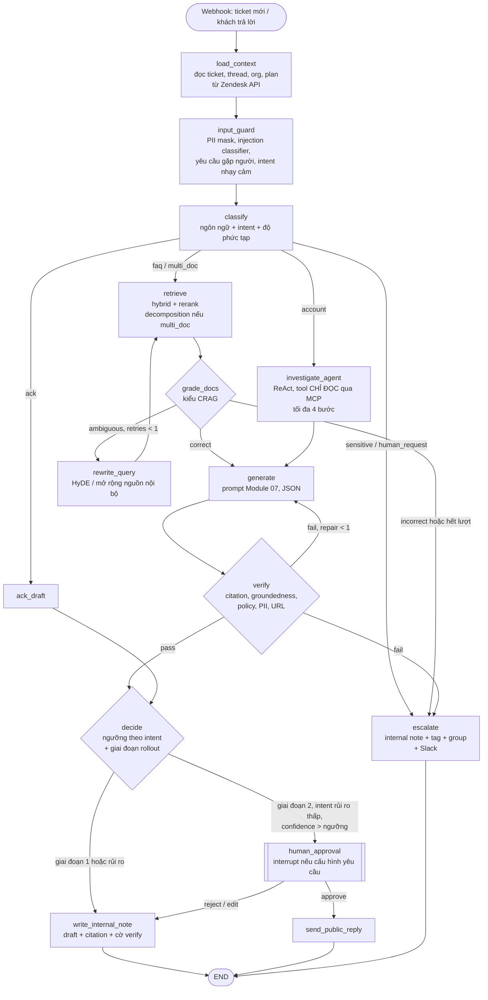

# Module 08 — Kiến trúc RAG nâng cao & Agentic RAG

> Thời lượng: ~55 phút (đọc kỹ + làm bài: ~2 giờ) · Mức độ: Nâng cao · Tiên quyết: Module 02 (hình thức hóa RAG), Module 05–06 (retrieval, reranking), Module 07 (grounding, verify, prompt injection)

Pipeline ở Module 02–07 là một **đường ống tĩnh**: query → retrieve một lần → generate → verify. Nó đủ cho phần lớn câu hỏi FAQ. Nhưng có ba loại câu hỏi làm nó gãy: (1) câu hỏi mà một lần retrieve không đủ (cần nhiều bước, câu sau phụ thuộc kết quả câu trước); (2) câu hỏi mà retrieve *sai* và hệ thống không biết mình sai; (3) câu hỏi cần dữ liệu không nằm trong kho văn bản mà nằm sau một API (trạng thái tài khoản, hóa đơn, log lỗi). Module này đi qua các kiến trúc giải quyết từng loại — Self-RAG, CRAG, Adaptive-RAG, FLARE, IRCoT/ReAct, RAPTOR, GraphRAG, long-context/CAG — rồi ghép lại thành một **agentic RAG** bằng LangGraph với MCP làm lớp tool. Thông điệp xuyên suốt: mỗi lớp phức tạp phải *trả tiền* cho chính nó bằng chất lượng đo được.

## Mục tiêu học tập

Sau module này, bạn có thể:

1. Mô tả RAG nâng cao như một **chính sách điều khiển** (khi nào retrieve, retrieve gì, khi nào dừng) và ước lượng chi phí/latency kỳ vọng của một hệ thống có định tuyến.
2. Giải thích và tính tay cơ chế ra quyết định của **FLARE** (ngưỡng xác suất token), **Self-RAG** (reflection tokens, điểm phân đoạn), **CRAG** (retrieval evaluator với hai ngưỡng) và **Adaptive-RAG** (bộ phân loại độ phức tạp).
3. Trình bày **RAPTOR** (UMAP + GMM + BIC, collapsed tree) và **GraphRAG** (trích xuất thực thể, Leiden, modularity, local/global search) ở mức toán ý tưởng; nhận diện khi nào chúng có ích cho dữ liệu CS.
4. So sánh RAG với **long-context** và **CAG** bằng mô hình chi phí, và ước lượng bộ nhớ KV cache cho phương án CAG.
5. Thiết kế một đồ thị **LangGraph** cho agentic RAG Zendesk: state, node, cạnh điều kiện, tool qua **MCP**, human-in-the-loop, memory — kèm các ràng buộc bảo mật từ Module 07.
6. Lập luận "khi nào phức tạp hóa là xứng đáng" cho từng loại ticket.

---

## 1. Từ đường ống tĩnh đến vòng điều khiển

### 1.1 Ba quyết định mà naive RAG bỏ qua

Naive RAG cố định ba thứ: **luôn** retrieve, retrieve **một lần** với query gốc, lấy **top-$k$ cố định**. RAG nâng cao biến chúng thành quyết định:

| Quyết định | Câu hỏi | Kỹ thuật đại diện |
|---|---|---|
| *Có* retrieve không? | Model đã biết, hay cần tra cứu? | Adaptive-RAG, Self-RAG (`Retrieve`), FLARE |
| Retrieve *cái gì*, *từ đâu*? | Query nào, kho nào (Help Center, ticket, API, graph)? | Query rewriting (Module 06), routing, agent tool calling, GraphRAG |
| Kết quả *có dùng được* không, *dừng* chưa? | Tài liệu có liên quan? Câu trả lời đủ chưa? | CRAG evaluator, Self-RAG `IsRel`/`IsSup`, IRCoT, ReAct |

Hình thức hóa: tại bước $t$, hệ thống có trạng thái $s_t$ (câu hỏi, tài liệu đã có, bản nháp, lịch sử hành động) và chọn hành động $a_t \in \{\texttt{retrieve}(q, \text{kho}), \texttt{call\_tool}(\cdot), \texttt{generate}, \texttt{escalate}, \texttt{stop}\}$ theo một **chính sách** $\pi(a_t \mid s_t)$. Naive RAG là chính sách cố định "retrieve → generate → stop". Self-RAG học $\pi$ bằng token đặc biệt; CRAG và Adaptive-RAG dùng bộ phân loại nhỏ; agentic RAG để chính LLM làm $\pi$ (qua tool calling), còn LangGraph cho ta khung để **ràng buộc** $\pi$ bằng đồ thị.

<!-- fig:control-loop -->
<figure markdown="span">
  { loading=lazy }
  { loading=lazy }
  <figcaption>Hình 8.1 — Từ đường ống cố định sang chính sách điều khiển π chọn hành động theo trạng thái.</figcaption>
</figure>
<!-- /fig -->

### 1.2 Mô hình chi phí cho kiến trúc có định tuyến

Gọi $R$ là tập các "tuyến" (route) xử lý, $\pi_r$ là tỷ lệ ticket đi vào tuyến $r$, $n_r$ là số lượt gọi LLM trung bình của tuyến, $\ell_r$ là latency trung bình. Chi phí và latency kỳ vọng:

$$
\mathbb{E}[\text{số lượt LLM}] = \sum_{r \in R} \pi_r\, n_r, \qquad \mathbb{E}[\ell] = \sum_{r \in R} \pi_r\, \ell_r .
$$

**Ví dụ số (giả định để học).** Giả sử phân phối ticket: 55% FAQ/how-to một bước; 25% nhiều câu hỏi hoặc cần tổng hợp vài tài liệu; 15% cần điều tra tài khoản (gọi API nội bộ); 5% nhạy cảm, escalate ngay sau phân loại. Số lượt LLM trung bình mỗi tuyến (gồm phân loại, generate, verify): 1,3; 2,5; 5; 0,5.

$$
\mathbb{E}[n] = 0{,}55 \cdot 1{,}3 + 0{,}25 \cdot 2{,}5 + 0{,}15 \cdot 5 + 0{,}05 \cdot 0{,}5 = 0{,}715 + 0{,}625 + 0{,}75 + 0{,}025 \approx 2{,}1 .
$$

Nếu cho *mọi* ticket đi qua agent (5 lượt), chi phí gấp ~2,4 lần, latency tăng tương ứng, và — quan trọng hơn — bề mặt tấn công (tool calling) mở ra cho cả 100% ticket thay vì 15%. Đây là lý lẽ định lượng cho nguyên tắc: **định tuyến trước, phức tạp hóa có chọn lọc**.

<!-- fig:routing-cost -->
<figure markdown="span">
  { loading=lazy }
  { loading=lazy }
  <figcaption>Hình 8.2 — Số lượt LLM kỳ vọng của ví dụ mục 1.2: định tuyến (≈ 2,1) so với cho mọi ticket qua agent (5).</figcaption>
</figure>
<!-- /fig -->

> **Liên hệ Zendesk.** Với ~1.500 ticket/ngày × 3–4 lượt trao đổi, khác biệt 2,1 vs 5 lượt LLM mỗi lượt xử lý là ~11.000 vs ~26.000 lượt gọi/ngày (ước lượng). Con số cụ thể về tiền và GPU ở Module 11; ở đây hãy nhớ rằng phân phối intent của *chính bạn* (đo từ 200.000 ticket lịch sử) quyết định kiến trúc, không phải độ "hot" của kỹ thuật.

---

## 2. Adaptive retrieval: khi nào cần retrieve

### 2.1 Adaptive-RAG — phân loại độ phức tạp câu hỏi

**Vấn đề.** Retrieve đa bước cho câu hỏi đơn giản là lãng phí; retrieve một bước cho câu hỏi đa bước là thiếu. Jeong et al. (2024, NAACL) đề xuất huấn luyện một **bộ phân loại nhỏ** dự đoán độ phức tạp của câu hỏi, rồi chọn chiến lược:

- **A** — không retrieve (LLM tự trả lời);
- **B** — retrieve một bước;
- **C** — retrieve lặp nhiều bước (kiểu IRCoT, mục 4).

**Nhãn tự động.** Không ai gán nhãn tay. Với mỗi câu hỏi mẫu, chạy cả ba chiến lược; nhãn là chiến lược **đơn giản nhất** trả lời đúng (A ưu tiên hơn B, B hơn C). Câu hỏi không chiến lược nào đúng thì dùng "thiên lệch của dataset": câu từ dataset single-hop gán B, multi-hop gán C. Bộ phân loại trong bài là T5-Large (~770M tham số), và ablation cho thấy bản nhỏ hơn nhiều vẫn hoạt động gần tương đương; dữ liệu huấn luyện chỉ khoảng 400 câu mỗi dataset.

**Toán.** Đây là phân loại 3 lớp với cross-entropy:

$$
\mathcal{L} = -\sum_{i} \log p_\phi(c_i \mid q_i), \quad c_i \in \{A, B, C\}.
$$

Ý tưởng sâu hơn nằm ở *cách tạo nhãn*: nhãn mã hóa **chi phí tối thiểu để đúng**. Có thể tổng quát hóa thành bài toán chọn hành động có chi phí: chọn $c^\star = \arg\min_c \big[\text{cost}(c) + \lambda\, \mathbb{1}[\text{sai} \mid c]\big]$.

<!-- fig:adaptive-rag -->
<figure markdown="span">
  { loading=lazy }
  { loading=lazy }
  <figcaption>Hình 8.3 — Adaptive-RAG tạo nhãn bằng cách chạy cả ba chiến lược và chọn chiến lược rẻ nhất vẫn trả lời đúng.</figcaption>
</figure>
<!-- /fig -->

**Áp vào Zendesk.** Không nên có lớp A ("không retrieve") cho câu hỏi về sản phẩm — tri thức tham số của LLM về sản phẩm *của bạn* gần như bằng không và dễ bịa. Lớp A hợp lý chỉ cho lời cảm ơn, xác nhận đã nhận ("ok cảm ơn, mình thử rồi được"). Bảng nhãn thực tế mình khuyên:

| Nhãn | Ví dụ email | Tuyến |
|---|---|---|
| `ack` | "Cảm ơn, đã giải quyết" | Không retrieve, có thể đóng ticket theo rule (vẫn cần người duyệt ở giai đoạn 1) |
| `faq` | "Xuất hóa đơn VAT ở đâu?" | Naive + rerank (Module 05–07) |
| `multi_doc` | "So sánh gói Business và Enterprise về SSO và giới hạn API" | Decomposition + retrieve nhiều lần |
| `account` | "Tại sao tài khoản tôi bị khóa sau khi thanh toán?" | Agent + tool (API nội bộ) |
| `sensitive` | Hoàn tiền, pháp lý, sự cố bảo mật | Escalate (draft hỗ trợ nếu an toàn) |

Nhãn có thể tạo bán tự động từ ticket lịch sử: ticket mà agent giải quyết chỉ bằng một macro → `faq`; ticket mà agent phải xem trang admin hoặc hỏi kỹ thuật → `account`. Đây là "inductive bias" của dữ liệu CS, tương tự cách Adaptive-RAG dùng nguồn dataset làm nhãn dự phòng.

### 2.2 FLARE — retrieve khi model "không chắc" từng token

**Vấn đề.** Với văn bản dài (một email hướng dẫn nhiều bước), thông tin cần thiết thay đổi theo từng đoạn. Retrieve một lần ở đầu có thể thiếu tài liệu cho bước thứ ba.

**Ý tưởng.** Jiang et al. (2023, "Active Retrieval Augmented Generation") đề xuất FLARE (Forward-Looking Active REtrieval): sinh **tạm** câu tiếp theo; nếu model tự tin ở mọi token thì giữ câu đó; nếu có token xác suất thấp thì dùng câu tạm làm truy vấn (nhìn về phía trước — *forward-looking*), retrieve, rồi sinh lại câu.

**Toán.** Gọi câu tạm là $\hat s = (\hat y_1, \dots, \hat y_m)$ sinh theo $p_\theta(\cdot \mid x, D, y_{<t})$ với $D$ là tài liệu hiện có. Quy tắc kích hoạt:

$$
\text{retrieve} \iff \min_{1 \le j \le m} p_\theta(\hat y_j \mid x, D, y_{<t}, \hat y_{<j}) < \theta .
$$

Khi kích hoạt, truy vấn được tạo bằng cách **che** (mask) các token có xác suất dưới ngưỡng $\beta$ — vì token không chắc chắn có thể sai và kéo retrieval lệch:

$$
q = \text{mask}(\hat s, \{ j : p(\hat y_j) < \beta \}),
$$

hoặc (biến thể tường minh) sinh một câu hỏi nhắm vào đúng đoạn không chắc chắn. Bài báo dùng $\theta$ khác nhau theo dataset (khoảng 0,4–0,8) và $\beta$ thường 0,4.

**Ví dụ số.** Email đang viết: "Để bật SSO, vào Cài đặt > Bảo mật, chọn ..." Câu tạm tiếp theo: "Nhập *Entity ID* và *Metadata URL* do *Okta* cung cấp." Xác suất token (rút gọn theo từ): Nhập 0,92; Entity 0,81; ID 0,95; Metadata 0,44; URL 0,88; Okta 0,31. Với $\theta = 0{,}5$: $\min = 0{,}31 < 0{,}5$ → retrieve. Với $\beta = 0{,}4$: che "Okta" (0,31), giữ "Metadata" (0,44 ≥ 0,4) → query "Nhập Entity ID và Metadata URL do ___ cung cấp". Kết quả retrieve có thể là bài "Cấu hình SAML với nhà cung cấp danh tính" — đúng tài liệu, không bị kéo về riêng Okta trong khi khách dùng Azure AD.

<!-- fig:flare-tokens -->
<figure markdown="span">
  { loading=lazy }
  { loading=lazy }
  <figcaption>Hình 8.4 — FLARE trên ví dụ mục 2.2: token thấp nhất dưới θ kích hoạt retrieve; token dưới β bị che khỏi truy vấn.</figcaption>
</figure>
<!-- /fig -->

**Trade-off.** FLARE cần **logprobs** từng token (API thương mại không phải lúc nào cũng trả đủ; vLLM tự host thì có — Module 01). Mỗi câu có thể tốn hai lượt sinh. Xác suất token thấp không đồng nghĩa với sai (một tên riêng hiếm có xác suất thấp dù đúng), và xác suất cao không đồng nghĩa với đúng (model tự tin sai — vấn đề hiệu chuẩn, Module 10). Với email CS ngắn (150–250 từ), mình thấy FLARE hiếm khi đáng chi phí; một bước "retrieve đủ rộng + decomposition" (Module 06) thường tốt hơn. FLARE đáng thử khi sinh tài liệu dài (ví dụ báo cáo sự cố, tóm tắt release cho khách Enterprise).

---

## 3. Tự đánh giá retrieval: Self-RAG và CRAG

### 3.1 Self-RAG — reflection tokens

**Vấn đề.** Model RAG thông thường luôn dùng mọi tài liệu được đưa vào, kể cả tài liệu không liên quan, và không tự kiểm tra câu trả lời có được hỗ trợ không.

**Ý tưởng.** Asai et al. (2023, ICLR 2024) huấn luyện một LM duy nhất vừa sinh văn bản vừa sinh **reflection tokens** — token đặc biệt trong từ vựng mở rộng — để tự quyết định và tự phê bình:

| Loại token | Giá trị | Ý nghĩa |
|---|---|---|
| `Retrieve` | yes / no / continue | Có cần retrieve cho đoạn tiếp theo không |
| `IsRel` | relevant / irrelevant | Đoạn tài liệu $d$ có liên quan tới $x$ không |
| `IsSup` | fully / partially / no support | Đoạn sinh ra có được $d$ hỗ trợ không |
| `IsUse` | 5, 4, 3, 2, 1 | Mức hữu ích tổng thể của câu trả lời |

**Huấn luyện (hai giai đoạn, không cần RL).**

1. **Critic** $\mathcal{C}$: prompt GPT-4 để gán reflection token cho dữ liệu mẫu (vài nghìn tới ~20 nghìn mẫu mỗi loại token), rồi huấn luyện critic bằng mục tiêu ngôn ngữ có điều kiện $\max_{\mathcal C} \mathbb{E}\,[\log p_{\mathcal C}(r \mid x, y)]$.
2. **Generator** $\mathcal{M}$: dùng critic chèn reflection token *offline* vào corpus huấn luyện, rồi huấn luyện generator bằng next-token prediction thông thường trên chuỗi đã chèn: $\max_{\mathcal M} \mathbb{E}\,[\log p_{\mathcal M}(y, r \mid x)]$. Phần văn bản tài liệu được retrieve bị **mask** khỏi loss (model không học "chép" tài liệu). Base model trong bài là Llama 2 7B/13B.

Điểm tinh tế: critic chỉ cần lúc tạo dữ liệu, không cần lúc suy luận.

**Suy luận — quyết định retrieve.** Gọi $p(\texttt{yes})$, $p(\texttt{no})$ là xác suất model gán cho token `Retrieve`. Retrieve khi tỷ lệ chuẩn hóa vượt ngưỡng $\delta$:

$$
\frac{p(\texttt{Retrieve}=\texttt{yes})}{p(\texttt{Retrieve}=\texttt{yes}) + p(\texttt{Retrieve}=\texttt{no})} > \delta .
$$

Mã nguồn chính thức dùng mặc định $\delta = 0{,}2$ — ngưỡng thấp, nghiêng về retrieve nhiều.

**Suy luận — chấm điểm phân đoạn.** Khi retrieve $K$ tài liệu, model sinh song song một ứng viên $y_t^{(d)}$ cho mỗi tài liệu $d$ rồi chấm. Bài báo định nghĩa điểm cho phân đoạn:

$$
f(y_t, d) = p(y_t \mid x, d, y_{<t}) + \mathcal{S}(\text{Critique}), \qquad \mathcal{S} = \sum_{G \in \{\text{IsRel}, \text{IsSup}, \text{IsUse}\}} w^G s_t^G ,
$$

trong đó $s_t^G$ là xác suất chuẩn hóa của giá trị **mong muốn nhất** của nhóm token $G$ (ví dụ `relevant`, `fully supported`, `5`). Trọng số $w^G$ là **núm điều chỉnh lúc suy luận** — không cần huấn luyện lại: tăng $w^{\text{IsSup}}$ khi cần ưu tiên tính có căn cứ (như CS), giảm khi cần văn phong trôi chảy. Phân đoạn tốt nhất được giữ bằng beam search ở mức phân đoạn.

Bản cài đặt chính thức tinh chỉnh công thức một chút: `IsSup` cho điểm một phần với "partially" (hệ số 0,5), `IsUse` lấy kỳ vọng với trọng số $(-1, -0{,}5, 0, 0{,}5, 1)$ cho mức 1–5; mặc định $w^{\text{IsRel}} = 1$, $w^{\text{IsSup}} = 1$, $w^{\text{IsUse}} = 0{,}5$.

**Ví dụ số (theo cách cài đặt chính thức).** Hai tài liệu cho câu hỏi "Gói Business có hỗ trợ SSO không?":

- $d_1$ (bài "So sánh gói"): $P(\text{relevant}) = 0{,}9$ → $s^{\text{Rel}} = 0{,}9$. IsSup: full 0,7; partial 0,2; no 0,1 → $s^{\text{Sup}} = 0{,}7 + 0{,}5 \cdot 0{,}2 = 0{,}8$. IsUse (mức 5→1): 0,5; 0,3; 0,1; 0,05; 0,05 → $s^{\text{Use}} = 0{,}5 \cdot 1 + 0{,}3 \cdot 0{,}5 + 0{,}1 \cdot 0 + 0{,}05 \cdot (-0{,}5) + 0{,}05 \cdot (-1) = 0{,}575$. Tổng $\mathcal S_1 = 0{,}9 + 0{,}8 + 0{,}5 \cdot 0{,}575 \approx 1{,}99$.
- $d_2$ (ticket cũ): $s^{\text{Rel}} = 0{,}6$; IsSup: 0,2/0,3/0,5 → $0{,}2 + 0{,}15 = 0{,}35$; IsUse: 0,2/0,3/0,3/0,1/0,1 → $0{,}2 + 0{,}15 + 0 - 0{,}05 - 0{,}1 = 0{,}2$. $\mathcal S_2 = 0{,}6 + 0{,}35 + 0{,}1 = 1{,}05$.

Ứng viên từ $d_1$ được chọn. Nếu đặt $w^{\text{IsSup}} = 2$, khoảng cách còn lớn hơn: tính có căn cứ chi phối quyết định.

<!-- fig:selfrag-scores -->
<figure markdown="span">
  { loading=lazy }
  { loading=lazy }
  <figcaption>Hình 8.5 — Điểm phê bình Self-RAG của hai tài liệu trong ví dụ, tách theo IsRel/IsSup/IsUse, với w_Sup = 1 và 2.</figcaption>
</figure>
<!-- /fig -->

**Trade-off & áp dụng thực tế.** Self-RAG đòi hỏi **fine-tune generator** với từ vựng mở rộng — không áp dụng được trực tiếp cho API thương mại. Bài học hữu ích hơn cho production là *mẫu thiết kế*: tách các câu hỏi phê bình thành **tín hiệu có cấu trúc** (relevance của từng tài liệu, support của từng câu, utility tổng thể) và kết hợp tuyến tính với trọng số điều chỉnh được. Bạn có thể tái tạo điều này *không cần fine-tune*: reranker cho IsRel (Module 06), NLI/verifier cho IsSup (Module 07), LLM-judge cho IsUse — và tập trọng số $w$ trở thành tham số hiệu chuẩn ở Module 10. Nếu tự host và fine-tune (Module 09), có thể huấn luyện một generator nhỏ phát token kiểu `[Escalate]` theo đúng tinh thần Self-RAG.

### 3.2 CRAG — Corrective RAG

**Vấn đề.** Khi retrieval trả về tài liệu sai, generator vẫn "cố" dùng chúng. Yan et al. (2024, "Corrective Retrieval Augmented Generation") thêm một **bộ đánh giá retrieval** nhẹ, độc lập với generator, và các **hành động sửa chữa**.

**Retrieval evaluator.** Một model T5-Large (~0,77B tham số) fine-tune để chấm cặp (câu hỏi, tài liệu) với điểm trong $[-1, 1]$ (nhãn huấn luyện: liên quan = 1, không liên quan = −1). Với các tài liệu $d_1, \dots, d_k$ có điểm $e_i$, và hai ngưỡng $\tau_{\text{low}} < \tau_{\text{up}}$:

$$
\text{action} = \begin{cases}
\textbf{Correct} & \text{nếu } \exists i:\ e_i \ge \tau_{\text{up}} \\
\textbf{Incorrect} & \text{nếu } \forall i:\ e_i < \tau_{\text{low}} \\
\textbf{Ambiguous} & \text{ngược lại.}
\end{cases}
$$

Ngưỡng được chọn theo dataset (ví dụ trên PopQA: $\tau_{\text{up}} = 0{,}59$, $\tau_{\text{low}} = -0{,}99$).

**Hành động.**

- **Correct** → *tinh lọc tri thức* (knowledge refinement) bằng **decompose-then-recompose**: cắt tài liệu thành các "strip" nhỏ (1–vài câu), chấm từng strip bằng evaluator, loại strip dưới ngưỡng (bài dùng −0,5), giữ top vài strip (bài dùng 5), ghép lại thành context gọn.
- **Incorrect** → bỏ tài liệu nội bộ, **tìm kiếm web**: viết lại câu hỏi thành từ khóa (bài dùng ChatGPT), lấy vài URL đầu, ưu tiên nguồn uy tín, rồi tinh lọc như trên.
- **Ambiguous** → kết hợp cả tri thức nội bộ đã tinh lọc và kết quả web.

**Ví dụ số.** Email: "API rate limit của gói Business là bao nhiêu request/phút?" Ba tài liệu có $e = (0{,}72;\ 0{,}10;\ -0{,}40)$, ngưỡng $\tau_{\text{up}} = 0{,}5$, $\tau_{\text{low}} = -0{,}9$ → có $e_1 \ge 0{,}5$ → **Correct**; strip từ $d_1$ được chấm và giữ lại câu chứa con số rate limit. Nếu $e = (0{,}2;\ -0{,}3;\ -0{,}5)$ → không tài liệu nào $\ge 0{,}5$, không phải tất cả $< -0{,}9$ → **Ambiguous**.

<!-- fig:crag-thresholds -->
<figure markdown="span">
  { loading=lazy }
  { loading=lazy }
  <figcaption>Hình 8.6 — Hai ngưỡng của CRAG chia trục điểm thành ba vùng hành động; hai bộ điểm là hai ví dụ trong bài.</figcaption>
</figure>
<!-- /fig -->

**Áp vào Zendesk — thay "web search" bằng gì?** Đây là chỗ phải điều chỉnh mạnh. Với CS, **không** dùng web công khai làm fallback cho câu hỏi chính sách/sản phẩm: web không biết chính sách của bạn, và là nguồn prompt injection gián tiếp (Module 07, OWASP LLM01). Ánh xạ hợp lý:

| Hành động CRAG | Phiên bản cho CS |
|---|---|
| Correct | Tinh lọc strip → generate có citation |
| Ambiguous | Mở rộng *nội bộ*: thêm ticket lịch sử, release notes, query rewriting/HyDE (Module 06); nếu vẫn mơ hồ → draft một phần + escalate |
| Incorrect | **Escalate** với lý do `insufficient_context`, ghi "knowledge gap" cho team nội dung; *không* đoán, *không* web |

Evaluator không nhất thiết là T5 fine-tune: một cross-encoder reranker đa ngữ đã có (Module 06) cho điểm liên quan; chỉ cần **hiệu chuẩn ngưỡng** trên golden set (Module 10). Đó là CRAG "rẻ": gần như miễn phí vì điểm rerank đã được tính.

```python
from dataclasses import dataclass

@dataclass
class Doc:
    id: str
    text: str
    score: float  # điểm reranker đã hiệu chuẩn về [-1, 1] hoặc [0, 1]

def crag_action(docs: list[Doc], t_up: float, t_low: float) -> str:
    """Quyết định hành động kiểu CRAG từ điểm evaluator/reranker."""
    if any(d.score >= t_up for d in docs):
        return "correct"
    if all(d.score < t_low for d in docs):
        return "incorrect"
    return "ambiguous"

def refine(docs: list[Doc], strip_scorer, keep: int = 5, min_score: float = 0.0) -> str:
    """Decompose-then-recompose: tách câu, chấm từng strip, giữ top strip."""
    strips = []
    for d in docs:
        for sent in d.text.split(". "):          # production: dùng bộ tách câu đa ngữ
            s = strip_scorer(sent)                # ví dụ: cross-encoder(query, sent)
            if s >= min_score:
                strips.append((s, d.id, sent))
    strips.sort(reverse=True)
    # Giữ ID nguồn để còn citation ở Module 07
    return "\n".join(f"[{doc_id}] {sent}" for _, doc_id, sent in strips[:keep])
```

Lưu ý khi tinh lọc: cắt tài liệu thành strip rồi ghép lại có thể làm mất **điều kiện** nằm ở câu khác ("…áp dụng cho hợp đồng ký sau 1/1/2026"). Với tài liệu chính sách, hãy giữ nguyên chunk (hoặc parent chunk — Module 04) thay vì strip.

### 3.3 So sánh nhanh

| | Self-RAG | CRAG |
|---|---|---|
| Ai đánh giá | Chính generator (token đặc biệt) | Evaluator riêng, nhẹ |
| Cần fine-tune generator | Có | Không (plug-and-play) |
| Đánh giá cái gì | Retrieve?, relevance, support, utility | Chất lượng tập tài liệu retrieve |
| Hành động khi tài liệu kém | Bỏ ứng viên điểm thấp | Tinh lọc / tìm nguồn khác |
| Hợp với API thương mại | Kém | Tốt |
| Trong hệ CS | Mượn *ý tưởng* (tín hiệu + trọng số) | Dùng gần như nguyên vẹn, fallback = escalate |

---

## 4. Retrieval đa bước: IRCoT và ReAct

### 4.1 Vì sao một lần retrieve không đủ

Câu hỏi đa bước (multi-hop) có cấu trúc "tìm A, rồi dùng A để tìm B". Ví dụ CS: *"Từ bản cập nhật tháng trước, tính năng xuất báo cáo của bọn mình bị lỗi định dạng ngày — có phải do thay đổi trong release đó không và có cách khắc phục chưa?"* Cần: (1) tìm release notes tháng trước, (2) xác định thay đổi liên quan định dạng ngày, (3) tìm known issue/workaround cho thay đổi đó. Query ban đầu chứa ít từ khóa của bước (3), nên retrieve một lần với email gốc thường trượt.

Gọi $q$ là câu hỏi, cần chuỗi tài liệu $d^{(1)}, d^{(2)}$ với $d^{(2)}$ chỉ "tìm thấy được" khi biết nội dung $d^{(1)}$. Nếu retriever một bước có $P(d^{(1)} \in \text{top-}k \mid q) = 0{,}8$ và $P(d^{(2)} \in \text{top-}k \mid q) = 0{,}3$, xác suất có đủ cả hai là tối đa 0,3. Với retrieve hai bước, $P(d^{(2)} \in \text{top-}k \mid q, d^{(1)})$ có thể lên 0,7, cho xác suất có đủ $\approx 0{,}8 \times 0{,}7 = 0{,}56$ (giả định minh họa). Đa bước đổi **thêm latency** lấy **recall chuỗi**.

### 4.2 IRCoT

Trivedi et al. (2022, ACL 2023) — *Interleaving Retrieval with Chain-of-Thought* — xen kẽ hai thao tác: sinh **một câu** chain-of-thought (CoT), dùng chính câu đó làm query để retrieve thêm tài liệu, thêm tài liệu vào context, sinh câu CoT tiếp theo; dừng khi CoT chứa câu trả lời hoặc đạt số bước tối đa.

$$
d^{(t+1)} = \text{Retrieve}\big(\text{cot}_t\big), \qquad \text{cot}_{t+1} \sim p_\theta\big(\cdot \mid q, D^{(\le t+1)}, \text{cot}_{\le t}\big).
$$

Trực giác: mỗi câu suy luận "đẩy" query về đúng vùng không gian embedding của bước tiếp theo — giống HyDE (Module 06) nhưng lặp và có trạng thái.

<!-- fig:multihop -->
<figure markdown="span">
  { loading=lazy }
  { loading=lazy }
  <figcaption>Hình 8.7 — Trái: vết ReAct/IRCoT của ví dụ mục 4.3. Phải: xác suất có đủ chuỗi tài liệu với một lần và hai bước retrieve (số minh họa của mục 4.1).</figcaption>
</figure>
<!-- /fig -->

### 4.3 ReAct — suy luận + hành động với tool

Yao et al. (2022, ICLR 2023) — *ReAct* — tổng quát hóa: model sinh xen kẽ **Thought** (suy nghĩ), **Action** (gọi tool: search, lookup, API…), **Observation** (kết quả tool trả về). Retrieval chỉ là một tool trong số nhiều. Đây là tổ tiên trực tiếp của tool calling hiện đại: các API LLM ngày nay trả về `tool_calls` có cấu trúc thay vì chuỗi "Action: …" để parse.

```text
Thought: Khách hỏi lỗi định dạng ngày sau bản cập nhật. Cần release notes tháng 9.
Action: search_kb(query="release notes 2026-09 export date format", source="release_notes")
Observation: [R12] v5.8: đổi định dạng ngày mặc định trong export sang ISO 8601...
Thought: Cần workaround cho thay đổi này.
Action: search_kb(query="v5.8 export ISO 8601 đổi lại định dạng ngày cũ")
Observation: [H331] Vào Cài đặt > Xuất dữ liệu > Định dạng ngày để chọn lại dd/mm/yyyy.
Thought: Đủ thông tin. Soạn trả lời có citation [R12][H331].
```

**Trade-off.** Mỗi vòng = một lượt LLM + một lần retrieve. Rủi ro: lặp vô hạn, "trôi" khỏi câu hỏi, chi phí không đoán trước (OWASP LLM06 Unbounded Consumption), và mỗi Observation là một điểm chèn prompt injection mới. Trong production: **giới hạn số bước** (ví dụ ≤ 4), **ngân sách token** mỗi ticket, và **danh sách tool đóng** (allowlist).

> **Liên hệ Zendesk.** Phần lớn email "đa bước" trong CS thực ra là **nhiều câu hỏi độc lập** (Module 06 — decomposition, retrieve song song) chứ không phải multi-hop thật. Multi-hop thật xuất hiện chủ yếu ở loại "điều tra": nối triệu chứng của khách → thay đổi gần đây → known issue → workaround, hoặc nối tài khoản → hóa đơn → chính sách áp dụng. Đó là lúc ReAct/agent đáng tiền.

---

## 5. RAPTOR: cây tóm tắt phân cụm

### 5.1 Vấn đề

Chunk nhỏ tốt cho câu hỏi chi tiết ("menu nào để đổi định dạng ngày?") nhưng tệ cho câu hỏi cần **tổng hợp** nhiều phần của một tài liệu dài hoặc nhiều tài liệu ("gói Enterprise khác gói Business những điểm nào về bảo mật?"). Top-$k$ chunk chỉ chứa vài mảnh rời rạc.

### 5.2 Ý tưởng

Sarthi et al. (2024, ICLR) — RAPTOR — xây một **cây** từ dưới lên:

1. Lá = các chunk (~100 token, giữ ranh giới câu), embed bằng một sentence encoder.
2. **Phân cụm** các embedding; với mỗi cụm, LLM viết **tóm tắt**; tóm tắt trở thành node ở tầng trên, được embed lại.
3. Lặp lại cho tới khi không phân cụm được nữa.

Khi truy vấn, cách tốt nhất trong bài là **collapsed tree**: trải phẳng *mọi* node (lá và tóm tắt các tầng) vào một chỉ mục, rồi retrieve theo similarity cho tới khi hết ngân sách token (bài dùng ~2.000 token). Nhờ đó câu hỏi chi tiết trúng lá, câu hỏi tổng hợp trúng node tóm tắt — "độ phân giải" tự khớp với câu hỏi. Tóm tắt trong bài nén còn khoảng 28% độ dài các con của nó.

<!-- fig:raptor-tree -->
<figure markdown="span">
  { loading=lazy }
  { loading=lazy }
  <figcaption>Hình 8.8 — RAPTOR: cây tóm tắt xây từ dưới lên, và collapsed tree trải phẳng mọi node vào một chỉ mục.</figcaption>
</figure>
<!-- /fig -->

### 5.3 Toán phân cụm: UMAP + GMM + BIC

**Vì sao giảm chiều trước?** Embedding có $d$ cỡ 768–1024. Trong không gian chiều cao, khoảng cách giữa các điểm tập trung quanh một giá trị (hiện tượng tập trung độ đo — concentration of measure), và GMM với ma trận hiệp phương sai đầy đủ có $O(d^2)$ tham số mỗi thành phần — không ước lượng nổi với vài trăm điểm. RAPTOR dùng **UMAP** giảm xuống vài chiều; tham số `n_neighbors` điều khiển cấu trúc toàn cục (giá trị lớn) hay cục bộ (giá trị nhỏ), và bài dùng hai cấp: phân cụm toàn cục trước, rồi phân cụm cục bộ trong mỗi cụm toàn cục.

**GMM.** Giả sử các điểm $z_i \in \mathbb{R}^{d'}$ (sau UMAP) sinh từ hỗn hợp $K$ Gaussian:

$$
p(z) = \sum_{k=1}^{K} \pi_k\, \mathcal{N}(z \mid \mu_k, \Sigma_k), \qquad \sum_k \pi_k = 1 .
$$

EM ước lượng tham số; bước E cho **xác suất thành viên** (responsibility):

$$
\gamma_{ik} = \frac{\pi_k\, \mathcal{N}(z_i \mid \mu_k, \Sigma_k)}{\sum_{j} \pi_j\, \mathcal{N}(z_i \mid \mu_j, \Sigma_j)} .
$$

**Phân cụm mềm**: chunk $i$ thuộc mọi cụm $k$ có $\gamma_{ik}$ vượt một ngưỡng — một chunk về "SSO cho gói Enterprise" có thể nằm trong cả cụm "bảo mật" lẫn cụm "gói dịch vụ". K-means không làm được điều này.

**Chọn $K$ bằng BIC.** Với $\hat L$ là likelihood cực đại, $p$ số tham số tự do, $n$ số điểm:

$$
\text{BIC}(K) = -2 \ln \hat{L} + p \ln n .
$$

Chọn $K$ làm BIC nhỏ nhất: số hạng đầu thưởng mô hình khớp dữ liệu, số hạng sau phạt độ phức tạp.

**Ví dụ số.** $n = 200$ chunk, $d' = 10$, GMM hiệp phương sai đầy đủ: mỗi thành phần có $10$ (trung bình) $+ 55$ (hiệp phương sai đối xứng $10 \cdot 11/2$) $= 65$ tham số, cộng $K-1$ trọng số. $\ln 200 \approx 5{,}30$.

- $K = 3$: $p = 3 \cdot 65 + 2 = 197$, phạt $= 197 \cdot 5{,}30 \approx 1.044$. Giả sử $-2\ln\hat L = 4.100$ → BIC ≈ 5.144.
- $K = 5$: $p = 5 \cdot 65 + 4 = 329$, phạt $\approx 1.744$. Giả sử $-2\ln\hat L = 3.300$ → BIC ≈ 5.044.
- $K = 8$: $p = 8 \cdot 65 + 7 = 527$, phạt $\approx 2.793$. Giả sử $-2\ln\hat L = 2.900$ → BIC ≈ 5.693.

Chọn $K = 5$ (log-likelihood là số giả định để minh họa). Ví dụ này cũng cho thấy vì sao phải giảm chiều: với $d' = 768$, mỗi thành phần có ~296.000 tham số — vô nghĩa với 200 điểm.

<!-- fig:gmm-bic -->
<figure markdown="span">
  { loading=lazy }
  { loading=lazy }
  <figcaption>Hình 8.9 — Trái: GMM cho phân cụm mềm (dữ liệu mô phỏng; vòng đen là điểm thuộc hơn một cụm). Phải: BIC của ví dụ mục 5.3.</figcaption>
</figure>
<!-- /fig -->

### 5.4 Khi nào dùng RAPTOR cho CS

| Dùng | Không dùng |
|---|---|
| Tài liệu sản phẩm/API dài, hỏi tổng hợp ("tóm tắt các thay đổi bảo mật từ v5 đến v6") | FAQ ngắn, mỗi bài trả lời một câu hỏi — naive RAG đã tốt |
| Tạo "bản đồ chủ đề" cho 200.000 ticket để phân tích (không phục vụ trả lời trực tiếp) | Dữ liệu thay đổi hằng tuần: cây phải xây lại cụm và tóm tắt bị ảnh hưởng — tốn LLM |
| Khách Enterprise hỏi câu tổng quan về hợp đồng/tài liệu kỹ thuật | Chính sách giá/hoàn tiền: tóm tắt là *diễn đạt lại*, có thể làm mất điều kiện → citation phải trỏ về lá |

Quy tắc an toàn cho CS: node tóm tắt được dùng để **tìm** và **định hướng**, nhưng claim trong draft phải được cite về **lá** (văn bản gốc). Tóm tắt do LLM viết là một lớp có thể hallucinate.

---

## 6. GraphRAG và các biến thể

### 6.1 Vấn đề: câu hỏi "toàn cục"

Câu hỏi kiểu "những chủ đề khiếu nại chính của khách Nhật trong quý này là gì?" không có *đoạn văn nào* chứa câu trả lời — câu trả lời là **tổng hợp toàn bộ** corpus. Vector RAG lấy top-$k$ đoạn gần nhất, nên chỉ thấy một góc nhỏ. Edge et al. (2024, Microsoft — "From Local to Global: A Graph RAG Approach to Query-Focused Summarization") đề xuất GraphRAG để trả lời loại câu hỏi này (query-focused summarization ở quy mô corpus).

### 6.2 Pipeline indexing

1. **Chia chunk** tài liệu nguồn.
2. **Trích xuất bằng LLM**: với mỗi chunk, LLM liệt kê **thực thể** (tên, loại, mô tả) và **quan hệ** (nguồn, đích, mô tả, độ mạnh); có thể thêm "claims". Thực thể trùng tên được gộp, mô tả được tóm tắt lại.
3. **Đồ thị**: node = thực thể, cạnh = quan hệ, trọng số = số lần/độ mạnh đồng xuất hiện.
4. **Phát hiện cộng đồng** (community detection) bằng thuật toán **Leiden**, đệ quy để có **phân cấp** cộng đồng (cấp thô → cấp mịn).
5. **Tóm tắt cộng đồng**: LLM viết "community report" cho mỗi cộng đồng ở mỗi cấp, từ dưới lên.

### 6.3 Toán: modularity và Leiden (mức ý tưởng)

**Modularity** đo mức một phân hoạch node thành cộng đồng có "nhiều cạnh bên trong hơn mức ngẫu nhiên". Với đồ thị vô hướng có ma trận kề $A$, bậc $k_i = \sum_j A_{ij}$, tổng trọng số cạnh $m = \frac{1}{2}\sum_{ij} A_{ij}$, và $c_i$ là cộng đồng của node $i$:

$$
Q = \frac{1}{2m} \sum_{i,j} \left[ A_{ij} - \gamma \frac{k_i k_j}{2m} \right] \delta(c_i, c_j) .
$$

Số hạng $k_i k_j / 2m$ là số cạnh *kỳ vọng* giữa $i$ và $j$ nếu cạnh được nối ngẫu nhiên giữ nguyên bậc (null model). $\gamma$ là tham số **resolution**: $\gamma$ lớn → cộng đồng nhỏ hơn, nhiều hơn. Viết lại theo cộng đồng:

$$
Q = \sum_{c} \left[ \frac{L_c}{m} - \gamma \left( \frac{K_c}{2m} \right)^2 \right],
$$

với $L_c$ là số cạnh trong cộng đồng $c$, $K_c$ là tổng bậc các node của $c$.

**Ví dụ số.** Đồ thị 6 node, $m = 7$ cạnh: tam giác {SSO, SAML, Okta} (3 cạnh), tam giác {Hóa đơn, VAT, Thanh toán} (3 cạnh), và 1 cạnh nối SAML–Thanh toán ("SSO chỉ có ở gói trả phí"). Phân hoạch thành hai tam giác: mỗi cộng đồng có $L_c = 3$; tổng bậc $K_c = 2+3+2 = 7$ (node SAML/Thanh toán có bậc 3). Với $\gamma = 1$:

$$
Q = 2 \left[ \frac{3}{7} - \left(\frac{7}{14}\right)^2 \right] = 2\,[0{,}4286 - 0{,}25] \approx 0{,}357 .
$$

Nếu gộp tất cả vào một cộng đồng: $Q = \frac{7}{7} - 1^2 = 0$. Phân hoạch hai cụm tốt hơn hẳn — đúng trực giác "chủ đề SSO" và "chủ đề thanh toán".

<!-- fig:modularity -->
<figure markdown="span">
  { loading=lazy }
  { loading=lazy }
  <figcaption>Hình 8.10 — Đồ thị 6 node của ví dụ mục 6.3 và modularity của phân hoạch hai cộng đồng.</figcaption>
</figure>
<!-- /fig -->

**Louvain → Leiden.** Tối đa hóa $Q$ là NP-khó; Louvain là heuristic tham lam (chuyển node cục bộ để tăng $Q$ → gộp cộng đồng thành siêu-node → lặp). Traag, Waltman & van Eck (2019, *Scientific Reports*) chỉ ra Louvain có thể tạo cộng đồng **không liên thông** bên trong, và đề xuất **Leiden** thêm pha **tinh chỉnh** (refinement) giữa pha di chuyển node và pha gộp, đảm bảo cộng đồng liên thông tốt, đồng thời hội tụ nhanh hơn. Áp dụng đệ quy (mỗi cộng đồng lại được chia tiếp) cho ra phân cấp mà GraphRAG dùng.

### 6.4 Truy vấn: local vs global

- **Global search**: dùng community report ở một cấp đã chọn theo kiểu **map-reduce** — mỗi report (hoặc lô report) sinh một câu trả lời cục bộ kèm điểm hữu ích (map), rồi các câu trả lời tốt nhất được gộp thành câu trả lời cuối (reduce). Hợp với câu hỏi "chủ đề chính là gì?". Rất tốn token: số lượt LLM tỷ lệ với số report ở cấp được chọn.
- **Local search**: từ query tìm các thực thể liên quan (qua embedding mô tả thực thể), rồi gom các chunk gốc, quan hệ, thực thể lân cận và report của cộng đồng chứa chúng. Hợp với câu hỏi về một thực thể cụ thể.
- Thư viện Microsoft GraphRAG còn có **DRIFT search** (local search có bổ sung thông tin cộng đồng) và **basic search** (vector RAG thường, để so sánh). Microsoft cũng giới thiệu LazyGraphRAG (2024) để giảm chi phí indexing bằng cách hoãn phần lớn công việc dùng LLM tới lúc truy vấn.

Bài báo đánh giá trên corpus cỡ ~1 triệu token, dùng LLM-judge so sánh theo cặp về **comprehensiveness** (độ bao quát) và **diversity** (đa dạng góc nhìn), và GraphRAG global thắng vector RAG trên các tiêu chí này cho câu hỏi toàn cục.

### 6.5 LightRAG và HippoRAG

- **LightRAG** (Guo et al., 2024; EMNLP 2025 theo repo chính thức): cũng trích xuất đồ thị bằng LLM, nhưng bỏ bước community report đắt; truy vấn **hai cấp** — cấp thấp (thực thể cụ thể) và cấp cao (từ khóa chủ đề/quan hệ), kết hợp với vector retrieval; hỗ trợ **cập nhật tăng dần** bằng cách hợp nhất đồ thị con của tài liệu mới vào đồ thị cũ. Điểm cuối này quan trọng với dữ liệu thay đổi hằng tuần.
- **HippoRAG** (Gutiérrez et al., 2024, NeurIPS) lấy cảm hứng từ trí nhớ dài hạn của hồi hải mã: LLM trích xuất bộ ba (chủ thể, quan hệ, đối tượng) thành một knowledge graph "không schema"; khi truy vấn, thực thể trong câu hỏi làm **seed** cho **Personalized PageRank** (PPR) trên đồ thị:

$$
\mathbf{r} = (1-\alpha)\, \mathbf{e}_{\text{seed}} + \alpha\, \mathbf{P}^{\top} \mathbf{r},
$$

với $\mathbf{P}$ là ma trận chuyển (chuẩn hóa theo hàng), $\mathbf{e}_{\text{seed}}$ là phân phối khởi động tập trung vào node seed, $\alpha$ là xác suất "đi tiếp". Node có $r$ cao là node "gần" seed theo nhiều đường — cho phép multi-hop **trong một bước retrieve**. HippoRAG 2 (Gutiérrez et al., 2025, "From RAG to Memory") cải tiến theo hướng trí nhớ liên tục (continual) cho LLM.

<!-- fig:ppr -->
<figure markdown="span">
  { loading=lazy }
  { loading=lazy }
  <figcaption>Hình 8.11 — Personalized PageRank trên một đồ thị đồ chơi với seed «SSO»: các node gần seed theo nhiều đường nhận điểm cao.</figcaption>
</figure>
<!-- /fig -->

### 6.6 Khi nào graph đáng tiền cho Zendesk?

Chi phí indexing GraphRAG ≈ (số chunk) × (lượt LLM trích xuất) + (số cộng đồng) × (lượt LLM tóm tắt). Ước lượng cho 800 bài Help Center × ~6 chunk ≈ 4.800 chunk → ~4.800 lượt trích xuất (cộng gleaning nếu bật), cộng vài trăm report: chấp nhận được. Với 200.000 ticket × vài chunk mỗi ticket → hàng trăm nghìn lượt LLM, và phải cập nhật liên tục: đắt, khó bảo trì.

| Bài toán | Graph có giúp? | Gợi ý |
|---|---|---|
| FAQ một bước | Không | Vector + BM25 + rerank |
| "Tính năng X có ở gói nào, cần add-on gì, áp dụng cho khu vực nào?" | Có thể — quan hệ sản phẩm/gói/tính năng | Một **knowledge graph có schema** viết tay (bảng quan hệ) thường tốt và rẻ hơn graph trích xuất bằng LLM |
| "Chủ đề khiếu nại chính quý này" (cho manager CS) | **Có** — đây là câu hỏi toàn cục | GraphRAG global/LazyGraphRAG chạy **offline** trên ticket, phục vụ báo cáo, không phục vụ trả lời khách |
| Điều tra một tài khoản | Không (cần dữ liệu sống) | Agent + tool API |

Quan điểm của mình: với hệ thống trả lời email, graph hiếm khi là bước đầu tiên. Dữ liệu sản phẩm–gói–tính năng là dữ liệu **có cấu trúc** — hãy đưa nó vào bảng/JSON và cho agent một tool tra cứu (mục 9), chính xác hơn để LLM trích xuất lại từ văn bản.

---

## 7. Long-context, RAG và CAG

### 7.1 Kết quả nghiên cứu

Li et al. (2024, EMNLP Industry — "Retrieval Augmented Generation or Long-Context LLMs? A Comprehensive Study and Hybrid Approach") so sánh có hệ thống: khi đủ tài nguyên, model long-context (LC) cho chất lượng trung bình **cao hơn** RAG trên các benchmark đọc hiểu dài; nhưng RAG **rẻ hơn rất nhiều**. Họ đề xuất **Self-Route**: thử RAG trước, để model tự đánh giá câu hỏi có trả lời được từ các chunk đã retrieve không; nếu không, chuyển sang LC với toàn bộ tài liệu. Phần lớn câu hỏi được RAG xử lý, nên chi phí giảm mạnh mà chất lượng gần với LC.

Self-Route chính là một trường hợp của mô hình định tuyến mục 1.2, với tuyến rẻ (RAG) và tuyến đắt (LC):

$$
\mathbb{E}[\text{cost}] = c_{\text{RAG}} + \rho \cdot c_{\text{LC}},
$$

với $\rho$ là tỷ lệ câu hỏi bị chuyển. Nếu $c_{\text{LC}} = 20\, c_{\text{RAG}}$ và $\rho = 0{,}15$: $\mathbb{E}[\text{cost}] = c_{\text{RAG}}(1 + 3) = 4\,c_{\text{RAG}}$ — vẫn rẻ hơn 5 lần so với LC cho mọi câu.

<!-- fig:selfroute-cost -->
<figure markdown="span">
  { loading=lazy }
  { loading=lazy }
  <figcaption>Hình 8.12 — Chi phí kỳ vọng của Self-Route theo tỷ lệ chuyển ρ, với giả định c_LC = 20·c_RAG.</figcaption>
</figure>
<!-- /fig -->

### 7.2 CAG — Cache-Augmented Generation

Chan et al. (2024, "Don't Do RAG: When Cache-Augmented Generation is All You Need for Knowledge Tasks") đề xuất: khi kho tri thức **nhỏ và ổn định**, nạp toàn bộ vào context **một lần**, tính trước **KV cache**, lưu lại; mỗi câu hỏi chỉ cần nối câu hỏi vào sau cache (và cắt bỏ phần token mới sau khi trả lời để tái sử dụng cache). Không có retrieval → không có lỗi chọn tài liệu, không có latency retrieve.

**Ước lượng bộ nhớ KV cache** (công thức chi tiết ở Module 11): với $n_\ell$ lớp, $n_{kv}$ head KV, $d_h$ chiều mỗi head, $b$ byte mỗi giá trị và $L$ token:

$$
M_{KV} = 2 \cdot n_\ell \cdot n_{kv} \cdot d_h \cdot b \cdot L .
$$

**Ví dụ số.** Một model cỡ 8B kiểu GQA với $n_\ell = 32$, $n_{kv} = 8$, $d_h = 128$, FP16 ($b = 2$): mỗi token $2 \cdot 32 \cdot 8 \cdot 128 \cdot 2 = 131.072$ byte = 128 KiB. 800 bài Help Center × ~1.200 token ≈ 960.000 token — vượt context của phần lớn model và cần ~117 GiB KV cache: **CAG không khả thi cho toàn bộ Help Center**. Nhưng **300 macro × ~250 token ≈ 75.000 token** → ~9,2 GiB KV: khả thi trên một GPU datacenter, không khả thi trên RTX 4050 6 GB (đã chiếm gần hết bởi trọng số model quantized).

<!-- fig:cag-kv-memory -->
<figure markdown="span">
  { loading=lazy }
  { loading=lazy }
  <figcaption>Hình 8.13 — Bộ nhớ KV cache cho các kho tri thức theo công thức mục 7.2 (trục log); kho chính sách dùng giả định ~30K token.</figcaption>
</figure>
<!-- /fig -->

### 7.3 Ma trận quyết định cho CS

| Kho tri thức | Kích thước (giả định) | Tần suất thay đổi | Lựa chọn |
|---|---|---|---|
| Chính sách giá/hoàn tiền/SLA | Vài chục trang, ~20–40K token | Hàng tháng | **CAG/prefix caching** khả thi; hoặc luôn đưa đoạn chính sách liên quan vào prompt theo intent |
| 300 macro | ~75K token | Hàng tuần | Prefix cache theo nhóm intent, hoặc RAG nhẹ |
| 800 bài Help Center | ~1M token | Hàng tuần | RAG |
| 200.000 ticket lịch sử | Hàng trăm triệu token | Hằng ngày | RAG (+ tóm tắt/QA pairs — Module 04) |
| Dữ liệu tài khoản | Sống, riêng từng khách | Liên tục | **Tool/API**, không phải retrieval |

Một biến thể thực dụng của CAG mà mình dùng nhiều nhất: **prefix caching** của vLLM hoặc prompt caching của API (Module 11) cho phần system prompt + khối chính sách cố định theo intent. Bạn được phần lớn lợi ích của CAG (không tính lại phần context lặp lại) mà vẫn giữ RAG cho phần còn lại.

---

## 8. Agentic RAG với LangGraph

### 8.1 "Agent" trong bài toán này nghĩa là gì

Có một dải liên tục từ cứng đến tự do:

| Mức | LLM quyết định gì | Ví dụ | Kiểm soát |
|---|---|---|---|
| Pipeline cố định | Không gì (chỉ sinh văn bản) | Naive RAG | Tối đa |
| Router | Chọn một nhánh trong vài nhánh định sẵn | Adaptive-RAG, phân loại intent | Cao |
| Vòng lặp có giới hạn | Retrieve lại / sửa / dừng | CRAG, Self-RAG, repair ở Module 07 | Cao |
| Agent có tool trong đồ thị ràng buộc | Gọi tool nào, với tham số gì, bao nhiêu lần (≤ giới hạn) | ReAct trong một node của LangGraph | Trung bình |
| Agent tự do | Mọi thứ | "Autonomous agent" | Thấp |

Với CS production, mình khuyên dừng ở mức thứ tư: **đồ thị do người viết** (các bước, các cổng kiểm tra, điểm dừng cho người duyệt), bên trong có **một** node agent tự do gọi tool đọc trong một ngân sách. Đây chính là điều LangGraph được thiết kế để làm.

<!-- fig:agent-spectrum -->
<figure markdown="span">
  { loading=lazy }
  { loading=lazy }
  <figcaption>Hình 8.14 — Dải mức tự chủ của hệ thống RAG; mức được khuyến nghị cho CS là agent có tool nằm trong đồ thị ràng buộc.</figcaption>
</figure>
<!-- /fig -->

### 8.2 LangGraph: state machine cho LLM

Tính đến 10/2026, LangGraph đã ở dòng 1.x (bản 1.0 phát hành tháng 10/2025; bản mới nhất trên PyPI khi viết là 1.2.x) và là nền tảng mà agent của LangChain được xây trên đó. Các khái niệm cốt lõi:

- **State**: một kiểu dữ liệu (thường `TypedDict` hoặc Pydantic) chứa mọi thứ đồ thị cần; mỗi node nhận state và trả về **phần cập nhật**; có thể khai báo *reducer* cho từng trường (ví dụ nối thêm vào list thay vì ghi đè).
- **Node**: hàm Python (đồng bộ hoặc async) — gọi LLM, gọi retriever, gọi tool, chạy rule.
- **Edge**: cạnh cố định hoặc **cạnh điều kiện** (hàm đọc state và trả về tên node tiếp theo). Đồ thị có thể có **chu trình** — điều mà chuỗi (chain) tuyến tính không làm được.
- **Checkpointer**: lưu state sau mỗi bước theo `thread_id` → **durable execution** (worker crash thì chạy tiếp từ checkpoint), xem lại lịch sử, và **human-in-the-loop**: một node gọi `interrupt(...)` để tạm dừng; về sau ứng dụng gọi lại đồ thị với `Command(resume=...)` để tiếp tục. Production dùng checkpointer bền (ví dụ Postgres) thay cho bộ nhớ trong RAM.

Hình thức hóa: LangGraph là một máy trạng thái $\langle S, N, E, s_0 \rangle$ trong đó hàm chuyển tại node $n$ là $s \mapsto s \oplus f_n(s)$ ($\oplus$ là phép gộp theo reducer), và cạnh điều kiện $g: S \to N$. Điểm mấu chốt về an toàn: **tập hành động khả dĩ bị giới hạn bởi đồ thị**, không phải bởi những gì LLM "muốn" làm — đây là cách hiện thực hóa các pattern Action-Selector/Plan-Then-Execute ở Module 07.

<!-- fig:langgraph-state -->
<figure markdown="span">
  { loading=lazy }
  { loading=lazy }
  <figcaption>Hình 8.15 — LangGraph như một máy trạng thái: node trả về cập nhật, reducer gộp vào state, cạnh điều kiện chọn node tiếp.</figcaption>
</figure>
<!-- /fig -->

### 8.3 Đồ thị agentic RAG cho Zendesk



Vài quyết định thiết kế đáng chú ý:

1. **Phân loại trước, agent sau.** Chỉ tuyến `account` mới vào node agent có tool. Tuyến FAQ không bao giờ thấy tool — giảm chi phí và bề mặt tấn công (mục 1.2).
2. **Vòng lặp có đếm.** `rewrite_query` và repair đều có bộ đếm trong state; cạnh điều kiện đọc bộ đếm. Không có vòng lặp nào chỉ dừng khi "LLM thấy đủ".
3. **Escalate là một node, không phải ngoại lệ.** Mọi nhánh lỗi đều hội tụ về `escalate`, nơi viết internal note tóm tắt (kể cả draft một phần), đổi group/tag và thông báo — đúng yêu cầu số 2 của ticket.
4. **Hành động ghi nằm ở node tất định cuối đồ thị** (`write_internal_note`, `send_public_reply`, `escalate`), do code thực hiện từ các trường đã validate — LLM không có tool ghi vào Zendesk.
5. **Human-in-the-loop qua `interrupt`.** Ở giai đoạn 2, nếu cấu hình yêu cầu, `human_approval` dừng đồ thị; khi agent bấm duyệt trong UI nội bộ, ứng dụng resume với `Command(resume=...)`. Nhờ checkpointer, việc chờ có thể kéo dài hàng giờ mà không giữ worker.

### 8.4 Code khung (rút gọn)

```python
# pip install langgraph   (dòng 1.x; tính đến 10/2026)
# Chỉ minh họa cấu trúc đồ thị; các hàm llm_*/retrieve/... là stub cần tự cài đặt.
from typing import TypedDict, Literal
from langgraph.graph import StateGraph, START, END
from langgraph.types import interrupt
from langgraph.checkpoint.memory import InMemorySaver  # production: checkpointer Postgres

class TicketState(TypedDict, total=False):
    ticket_id: str
    email: str                 # đã làm sạch + datamark (Module 07)
    meta: dict                 # org, plan, locale — từ Zendesk API
    route: Literal["ack", "faq", "multi_doc", "account", "sensitive"]
    docs: list[dict]
    grade: Literal["correct", "ambiguous", "incorrect"]
    rewrites: int
    repairs: int
    output: dict               # JSON theo schema Module 07
    verify_ok: bool
    escalate_reasons: list[str]

def classify(s: TicketState) -> dict:
    route = llm_classify(s["email"], s["meta"])          # model nhỏ, rẻ
    reasons = rule_flags(s["email"])                      # rule độc lập với LLM
    if reasons:                                           # rule thắng LLM
        route = "sensitive"
    return {"route": route, "escalate_reasons": reasons, "rewrites": 0, "repairs": 0}

def retrieve(s: TicketState) -> dict:
    query = s["meta"].get("query_override", s["email"])   # sau rewrite_query thì dùng query mới
    return {"docs": hybrid_search_and_rerank(query, s["meta"])}

def grade_docs(s: TicketState) -> dict:
    return {"grade": crag_action(s["docs"], t_up=0.55, t_low=0.15)}  # ngưỡng hiệu chuẩn ở Module 10

def rewrite_query(s: TicketState) -> dict:
    return {"docs": [], "rewrites": s["rewrites"] + 1,
            "meta": {**s["meta"], "query_override": llm_rewrite(s["email"])}}

def generate(s: TicketState) -> dict:
    return {"output": llm_generate_json(s), "repairs": s.get("repairs", 0)}

def verify(s: TicketState) -> dict:
    ok, issues = run_verifiers(s["output"], s["docs"])    # Module 07: citation, NLI, policy
    upd = {"verify_ok": ok}
    if not ok:
        upd["repairs"] = s["repairs"] + 1
    return upd

def human_approval(s: TicketState) -> dict:
    decision = interrupt({"ticket_id": s["ticket_id"], "draft": s["output"]["draft"]})
    return {"verify_ok": decision == "approve"}

# --- cạnh điều kiện: đọc state, trả tên node ---
def after_classify(s):  return {"sensitive": "escalate", "ack": "generate",
                                "account": "investigate_agent"}.get(s["route"], "retrieve")
def after_grade(s):
    if s["grade"] == "correct": return "generate"
    if s["grade"] == "ambiguous" and s["rewrites"] < 1: return "rewrite_query"
    return "escalate"
def after_verify(s):
    if s["verify_ok"]: return "decide"
    return "generate" if s["repairs"] < 2 else "escalate"   # repairs đã +1 → cho phép 1 lần sửa

g = StateGraph(TicketState)
for name, fn in [("classify", classify), ("retrieve", retrieve), ("grade_docs", grade_docs),
                 ("rewrite_query", rewrite_query), ("generate", generate), ("verify", verify),
                 ("investigate_agent", investigate_agent), ("decide", decide),
                 ("human_approval", human_approval), ("write_note", write_note),
                 ("send_reply", send_reply), ("escalate", escalate)]:
    g.add_node(name, fn)
g.add_edge(START, "classify")
g.add_conditional_edges("classify", after_classify)
g.add_edge("retrieve", "grade_docs")
g.add_conditional_edges("grade_docs", after_grade)
g.add_edge("rewrite_query", "retrieve")
g.add_edge("investigate_agent", "generate")
g.add_edge("generate", "verify")
g.add_conditional_edges("verify", after_verify)
g.add_conditional_edges("decide", route_by_phase)       # → write_note | human_approval | escalate
g.add_conditional_edges("human_approval", lambda s: "send_reply" if s["verify_ok"] else "write_note")
for n in ["write_note", "send_reply", "escalate"]:
    g.add_edge(n, END)

app = g.compile(checkpointer=InMemorySaver())
# app.invoke({"ticket_id": "123", ...}, config={"configurable": {"thread_id": "zd-123"}})
# Khi bị interrupt: app.invoke(Command(resume="approve"), config=...)  (from langgraph.types import Command)
```

`thread_id = "zd-<ticket_id>"` là lựa chọn tự nhiên: mỗi ticket Zendesk là một thread, khách trả lời lại → webhook mới → chạy tiếp trên cùng thread với lịch sử state. Chi tiết state schema đầy đủ, xử lý idempotency của webhook và multi-turn thuộc Module 12.

### 8.5 Node agent và tool qua MCP

**Model Context Protocol (MCP)** là giao thức mở chuẩn hóa cách ứng dụng LLM kết nối tới tool và dữ liệu. Tính đến 10/2026: Anthropic đã chuyển MCP cho **Agentic AI Foundation** (một directed fund thuộc Linux Foundation, công bố 12/2025); bản đặc tả mới nhất là **2026-07-28**, chuyển sang lõi **stateless** (bỏ bước handshake/session, mỗi request tự mô tả nên có thể cân bằng tải bình thường), thêm cơ chế extension chính thức (ví dụ Tasks cho tác vụ dài, MCP Apps), siết chặt phần ủy quyền, và một chính sách deprecation tối thiểu 12 tháng. Ba primitive phía server quen thuộc vẫn là **tools**, **resources**, **prompts**.

Vì sao dùng MCP làm lớp tool thay vì hàm Python trực tiếp?

- **Tách biệt quyền và triển khai**: MCP server "zendesk-readonly" và "billing-readonly" do team sở hữu dữ liệu vận hành, với credential và scope riêng; agent chỉ thấy tool mà server cấp.
- **Tái sử dụng**: cùng server phục vụ agent CS, công cụ nội bộ cho agent người, và IDE của kỹ sư.
- **Chuẩn hóa quan sát**: log/metric ở một lớp (Module 11).

Trong LangGraph, gói `langchain-mcp-adapters` chuyển tool của MCP server thành tool LangChain:

```python
# pip install langchain-mcp-adapters   (0.3.x tính đến 10/2026)
from langchain_mcp_adapters.client import MultiServerMCPClient

client = MultiServerMCPClient({
    "account": {"url": "http://account-mcp.internal/mcp", "transport": "streamable_http",
                "headers": {"Authorization": "Bearer <token-scope-readonly>"}},
})
tools = await client.get_tools()
# Lọc allowlist phía client: chỉ nhận tool chỉ-đọc dù server có khai báo thêm
ALLOWED = {"get_account_status", "get_recent_invoices", "get_error_logs", "search_kb"}
tools = [t for t in tools if t.name in ALLOWED]
```

**Thiết kế tool cho tuyến `account`** (ví dụ):

| Tool | Tham số | Trả về | Ràng buộc |
|---|---|---|---|
| `get_account_status` | — (org lấy từ state, **không** từ LLM) | trạng thái, gói, ngày gia hạn | Chỉ đọc; scope = org của requester |
| `get_recent_invoices` | `limit ≤ 5` | danh sách hóa đơn (đã che số thẻ) | Chỉ đọc |
| `get_error_logs` | `feature`, `since ≤ 7 ngày` | log lỗi đã tóm tắt | Chỉ đọc; không trả PII người dùng cuối |
| `search_kb` | `query`, `source` | chunk có ID | Như retriever thường |

Chi tiết then chốt: **định danh tenant không phải là tham số LLM điền**. Tool nhận `org_id` từ state (lấy từ Zendesk API ở `load_context`), được inject phía server/adapter. Nếu LLM được phép truyền `org_id`, một email chứa "kiểm tra hóa đơn của org 4711 giúp tôi" có thể khiến agent đọc dữ liệu khách khác (OWASP LLM02 + LLM03). Kết quả tool cũng là **dữ liệu không tin cậy** (log lỗi có thể chứa chuỗi do người dùng nhập) — spotlight trước khi đưa lại cho LLM (Module 07).

<!-- fig:mcp-tenant -->
<figure markdown="span">
  { loading=lazy }
  { loading=lazy }
  <figcaption>Hình 8.16 — org_id đi từ state qua adapter, không đi qua LLM; agent chỉ thấy các tool chỉ đọc trong allowlist.</figcaption>
</figure>
<!-- /fig -->

> **Liên hệ Zendesk.** "Khi nào cần agent gọi tool?" — khi câu trả lời phụ thuộc **trạng thái riêng của khách** mà kho văn bản không thể chứa: "vì sao tài khoản tôi bị khóa", "hóa đơn tháng này sao cao hơn", "webhook của tôi không nhận được sự kiện từ hôm qua". Retrieval cho biết *chính sách và cách làm*; tool cho biết *chuyện gì đang xảy ra với khách này*. Draft tốt kết hợp cả hai: "Tài khoản của anh/chị bị tạm khóa do hóa đơn ngày 01/10 chưa thanh toán [T1]; theo chính sách, tài khoản sẽ mở lại tự động trong vòng 1 giờ sau khi thanh toán [S4]." — với `[T1]` là citation tới kết quả tool, được verify như mọi nguồn khác.

### 8.6 Memory: hội thoại và khách hàng

| Loại | Phạm vi | Lưu ở đâu | Ví dụ | Rủi ro |
|---|---|---|---|---|
| Ngắn hạn (thread) | Một ticket | Checkpointer theo `thread_id` | Các lượt trước, cam kết agent đã đưa, tài liệu đã dùng | Thread dài → cần tóm tắt (Module 07) |
| Dài hạn (khách/org) | Nhiều ticket | Store riêng có khóa theo org | "Org dùng Azure AD", "đã được hứa hỗ trợ migration", ngôn ngữ ưa thích | Lỗi thời; **rò rỉ chéo tenant**; poisoning (khách tự ghi "tôi được giảm 50%") |
| Thủ tục | Toàn hệ thống | Prompt/macro/eval | Cách xử lý loại ticket mới | Thay đổi phải qua eval |

Quy tắc cho memory dài hạn trong CS: (1) chỉ ghi **sự kiện đã xác thực** (từ API hoặc từ agent người xác nhận), không ghi lời khách tự khai; (2) khóa truy cập theo org ở tầng lưu trữ, không ở prompt; (3) có `source` và `updated_at`, hết hạn tự động; (4) memory là **nguồn có citation** như mọi nguồn khác, không phải "kiến thức nền" vô hình của agent.

---

## 9. Khi nào phức tạp hóa là xứng đáng

### 9.1 Khung quyết định

Một kỹ thuật nâng cao đáng đưa vào khi **cả ba** điều kiện đúng:

1. **Có loại lỗi cụ thể đo được** trên golden set (Module 10) mà kỹ thuật đó nhắm vào — ví dụ "38% lỗi của tuyến multi_doc là thiếu tài liệu bước 2".
2. **Cải thiện có ý nghĩa thống kê** trên đúng phân tầng đó (kiểm định cặp, Module 10), không làm hồi quy phân tầng khác.
3. **Chi phí biên chấp nhận được**: $\Delta \text{quality} \times \text{giá trị} > \pi_r \cdot \Delta\text{cost} + \text{chi phí bảo trì} + \text{rủi ro bảo mật tăng thêm}$.

### 9.2 Áp vào Zendesk

| Loại ticket (giả định tỷ lệ) | Kiến trúc đề xuất | Không nên |
|---|---|---|
| FAQ/how-to (~55%) | Hybrid + rerank + prompt Module 07 + CRAG-lite (ngưỡng điểm rerank) | Agent, GraphRAG, FLARE |
| Nhiều câu hỏi/tổng hợp (~25%) | Decomposition + retrieve song song; RAPTOR cho tài liệu dài nếu đo thấy lợi | Agent tự do |
| Điều tra tài khoản (~15%) | LangGraph + node ReAct ≤ 4 bước, tool **chỉ đọc** qua MCP, tenant inject phía server | Tool ghi; LLM tự điền org_id |
| Nhạy cảm (~5%) | Rule → escalate ngay; draft hỗ trợ cho agent | Bất kỳ tự động gửi nào |
| Báo cáo cho manager CS (offline) | GraphRAG global/LazyGraphRAG hoặc RAPTOR trên ticket | Chạy online trong đường trả lời khách |

Lộ trình mình khuyên: bắt đầu với naive + rerank + guardrails cho FAQ (giai đoạn 1) → thêm CRAG-lite và decomposition khi golden set chỉ ra lỗi retrieval → thêm tuyến agent cho `account` sau khi có MCP server chỉ đọc và eval cho tool calling → các kỹ thuật nặng (graph, RAPTOR) chỉ khi có bằng chứng. Tài liệu nhiều sơ đồ và bảng (PDF tích hợp, slide) là một trục phức tạp hóa riêng — truy xuất thị giác và lai văn bản–thị giác — được bàn ở [Module 13](13-rag-da-phuong-thuc.md); câu hỏi cần tính toán trên dữ liệu tài khoản (tool, text-to-SQL, bảo mật truy vấn) ở [Module 14](14-rag-du-lieu-co-cau-truc.md).

<!-- fig:architecture-by-route -->
<figure markdown="span">
  { loading=lazy }
  { loading=lazy }
  <figcaption>Hình 8.17 — Kiến trúc đề xuất cho từng loại ticket theo bảng mục 9.2.</figcaption>
</figure>
<!-- /fig -->

---

## Lỗi thường gặp & cách xử lý

| Triệu chứng | Nguyên nhân gốc | Cách xử lý |
|---|---|---|
| Chi phí/latency tăng vọt sau khi "lên agent" | Mọi ticket đi qua agent; vòng lặp không giới hạn | Router trước; giới hạn bước và ngân sách token mỗi ticket; đo $\mathbb{E}[n]$ theo tuyến |
| Agent lặp gọi cùng một tool | Không có bộ đếm/điều kiện dừng; observation không đổi | Bộ đếm trong state; phát hiện lặp (cùng tool + tham số); dừng → escalate |
| Agent đọc dữ liệu của org khác | `org_id` là tham số LLM điền | Inject tenant từ state phía server; scope credential theo org |
| CRAG escalate quá nhiều | Ngưỡng evaluator chưa hiệu chuẩn; điểm reranker lệch theo ngôn ngữ | Hiệu chuẩn $\tau_{\text{up}}, \tau_{\text{low}}$ theo ngôn ngữ trên golden set (Module 10) |
| Draft trích tóm tắt RAPTOR/community report sai điều kiện chính sách | Claim cite node tóm tắt do LLM viết | Chỉ cite lá (văn bản gốc); tóm tắt chỉ để tìm |
| GraphRAG index lỗi thời sau mỗi tuần | Pipeline trích xuất + tóm tắt cộng đồng chạy lại toàn bộ | Chỉ dùng offline cho báo cáo; hoặc LightRAG/cập nhật tăng dần; hoặc KG có schema cho dữ liệu cấu trúc |
| FLARE kích hoạt retrieve ở mọi câu | $\theta$ quá cao; tên riêng/thuật ngữ hiếm có xác suất thấp | Hạ $\theta$; bỏ qua token thuộc thực thể đã có trong context |
| Interrupt chờ người làm treo worker | Không có checkpointer bền; giữ tiến trình trong lúc chờ | Checkpointer Postgres; resume bằng `Command(resume=...)` từ webhook/UI |
| Kết quả tool chứa lệnh tấn công được agent làm theo | Observation coi như tin cậy | Spotlight observation; tool chỉ đọc; quyết định ghi do node tất định |

---

## Tóm tắt (cheat-sheet)

- RAG nâng cao = **chính sách điều khiển** $\pi(a \mid s)$: có retrieve? retrieve gì? đủ chưa? Chi phí kỳ vọng $\sum_r \pi_r n_r$ → **định tuyến trước, phức tạp hóa có chọn lọc**.
- **Adaptive-RAG**: classifier nhỏ (T5-Large) chọn A/B/C; nhãn = chiến lược rẻ nhất trả lời đúng.
- **FLARE**: sinh câu tạm; retrieve nếu $\min_j p(\hat y_j) < \theta$; query = câu tạm che token $< \beta$.
- **Self-RAG**: reflection tokens `Retrieve`, `IsRel`, `IsSup`, `IsUse`; retrieve khi $p(\text{yes})/(p(\text{yes})+p(\text{no})) > \delta$; điểm phân đoạn $p(y_t) + \sum_G w^G s^G$ — $w$ chỉnh lúc suy luận. Cần fine-tune; mượn ý tưởng nếu dùng API.
- **CRAG**: evaluator nhẹ, hai ngưỡng → Correct (tinh lọc strip) / Ambiguous (kết hợp) / Incorrect (nguồn khác). Với CS: fallback = escalate, **không** web.
- **IRCoT/ReAct**: xen kẽ suy luận và retrieve/tool; giới hạn bước, allowlist tool.
- **RAPTOR**: UMAP → GMM (mềm, $\gamma_{ik}$) → chọn $K$ bằng BIC → tóm tắt → lặp; truy vấn collapsed tree. Cite lá.
- **GraphRAG**: LLM trích thực thể/quan hệ → Leiden tối đa modularity $Q$ → community reports → global (map-reduce) / local search. Hợp câu hỏi toàn cục, offline. LightRAG: cập nhật tăng dần; HippoRAG: PPR.
- **Long-context vs RAG**: LC tốt hơn khi đủ tài nguyên, RAG rẻ hơn nhiều → Self-Route. **CAG** khi kho nhỏ, ổn định; $M_{KV} = 2 n_\ell n_{kv} d_h b L$.
- **LangGraph** (1.x): State + Node + Edge điều kiện + Checkpointer + `interrupt`/`Command(resume)`. **MCP** (spec 2026-07-28, stateless; thuộc Agentic AI Foundation/Linux Foundation): tools/resources/prompts; tool CS **chỉ đọc**, tenant inject phía server.

---

## Câu hỏi tự kiểm tra / phỏng vấn

**1.** Phân phối tuyến 60% FAQ (1,2 lượt LLM), 30% multi_doc (2,4), 10% account (6). Tính $\mathbb{E}[n]$ và so với cho tất cả đi agent (6 lượt).

<details markdown="1"><summary>Gợi ý</summary>

$0{,}6 \cdot 1{,}2 + 0{,}3 \cdot 2{,}4 + 0{,}1 \cdot 6 = 0{,}72 + 0{,}72 + 0{,}6 = 2{,}04$. Agent cho mọi ticket: 6 → gấp ~2,9 lần, chưa kể bề mặt tấn công tăng cho 100% ticket.

</details>

**2.** Trong FLARE, vì sao phải che token xác suất thấp khi tạo query?

<details markdown="1"><summary>Gợi ý</summary>

Token xác suất thấp có khả năng là phần model đang "đoán" — có thể sai. Đưa nó vào query kéo retrieval về tài liệu khớp với phỏng đoán sai (ví dụ "Okta" khi khách dùng Azure AD). Che đi giữ phần ngữ cảnh chắc chắn và để retriever tìm phần còn thiếu.

</details>

**3.** Self-RAG: $p(\text{yes}) = 0{,}15$, $p(\text{no}) = 0{,}45$, $\delta = 0{,}2$. Có retrieve không?

<details markdown="1"><summary>Gợi ý</summary>

Tỷ lệ $0{,}15 / 0{,}60 = 0{,}25 > 0{,}2$ → có retrieve. Lưu ý chuẩn hóa chỉ trên hai giá trị yes/no, nên dù $p(\text{yes})$ tuyệt đối nhỏ, quyết định vẫn là retrieve.

</details>

**4.** Vì sao trọng số $w^G$ của Self-RAG là "núm điều chỉnh lúc suy luận" và điều đó có ích gì cho CS?

<details markdown="1"><summary>Gợi ý</summary>

Các $s^G$ là xác suất model đã học; $w^G$ chỉ dùng khi xếp hạng ứng viên, nên đổi $w$ không cần huấn luyện lại. Với CS, tăng $w^{\text{IsSup}}$ ưu tiên câu có căn cứ hơn câu trôi chảy; có thể đặt khác nhau theo intent (chính sách vs how-to).

</details>

**5.** CRAG: điểm $e = (0{,}3;\ 0{,}1;\ -0{,}95)$, $\tau_{\text{up}} = 0{,}5$, $\tau_{\text{low}} = -0{,}9$. Hành động? Phiên bản CS nên làm gì?

<details markdown="1"><summary>Gợi ý</summary>

Không điểm nào $\ge 0{,}5$; không phải tất cả $< -0{,}9$ → Ambiguous. Với CS: mở rộng nguồn nội bộ (ticket lịch sử, release notes, rewrite query) một lần; nếu vẫn không đạt Correct → draft một phần + escalate `insufficient_context`.

</details>

**6.** Vì sao RAPTOR dùng GMM thay vì k-means, và vì sao cần UMAP trước?

<details markdown="1"><summary>Gợi ý</summary>

GMM cho phân cụm mềm ($\gamma_{ik}$) — một chunk có thể thuộc nhiều chủ đề — và có likelihood để chọn $K$ bằng BIC. UMAP giảm chiều vì trong không gian 768+ chiều khoảng cách kém phân biệt và GMM hiệp phương sai đầy đủ có $O(d^2)$ tham số mỗi thành phần, không ước lượng nổi với vài trăm điểm.

</details>

**7.** Viết công thức modularity và giải thích số hạng $k_i k_j / 2m$. Leiden cải thiện gì so với Louvain?

<details markdown="1"><summary>Gợi ý</summary>

$Q = \frac{1}{2m}\sum_{ij}[A_{ij} - \gamma k_i k_j/2m]\,\delta(c_i, c_j)$. $k_ik_j/2m$ là số cạnh kỳ vọng giữa $i, j$ trong null model nối ngẫu nhiên giữ bậc; $Q$ đo "nhiều cạnh trong cộng đồng hơn ngẫu nhiên". Leiden thêm pha tinh chỉnh để tránh cộng đồng không liên thông của Louvain và hội tụ nhanh hơn.

</details>

**8.** Khi nào GraphRAG global search hợp lý trong bối cảnh Zendesk, khi nào không?

<details markdown="1"><summary>Gợi ý</summary>

Hợp lý cho câu hỏi toàn cục trên corpus ticket (chủ đề khiếu nại, xu hướng) — chạy offline phục vụ manager. Không hợp cho trả lời email khách: tốn nhiều lượt LLM (map-reduce trên nhiều report), index phải cập nhật liên tục, community report là tóm tắt có thể sai điều kiện chính sách.

</details>

**9.** Ước lượng KV cache để CAG 300 macro (~75.000 token) với model $n_\ell = 32$, $n_{kv} = 8$, $d_h = 128$, FP16. Có chạy trên RTX 4050 6 GB không?

<details markdown="1"><summary>Gợi ý</summary>

Mỗi token $2 \cdot 32 \cdot 8 \cdot 128 \cdot 2 = 131.072$ byte; $\times 75.000 \approx 9{,}8 \cdot 10^9$ byte ≈ 9,2 GiB. Không — vượt cả VRAM, chưa tính trọng số model.

</details>

**10.** Vì sao `org_id` không được là tham số mà LLM điền khi gọi tool, và cách đúng là gì?

<details markdown="1"><summary>Gợi ý</summary>

Email/observation có thể chứa injection khiến LLM điền org khác → đọc dữ liệu khách khác (OWASP LLM02, LLM03). Cách đúng: lấy org từ Zendesk API ở bước tất định, lưu trong state, inject phía adapter/server; credential của MCP server có scope theo org và chỉ đọc.

</details>

**11.** Trình bày vai trò của checkpointer và `interrupt` trong luồng duyệt draft ở giai đoạn 2.

<details markdown="1"><summary>Gợi ý</summary>

Checkpointer lưu state theo `thread_id` sau mỗi bước. Node `human_approval` gọi `interrupt(payload)` → đồ thị dừng, state được lưu, worker giải phóng. Khi agent người duyệt trong UI, ứng dụng gọi lại đồ thị với `Command(resume=decision)` và cùng `thread_id`; giá trị resume trở thành kết quả của `interrupt` và đồ thị đi tiếp tới `send_reply` hoặc `write_note`.

</details>

**12.** Một đồng nghiệp đề xuất "dùng Self-RAG cho toàn hệ thống vì nó tốt nhất trên benchmark". Bạn phản biện thế nào?

<details markdown="1"><summary>Gợi ý</summary>

Self-RAG cần fine-tune generator với từ vựng mở rộng — không dùng được với API thương mại, và với self-host thì tốn công huấn luyện/bảo trì. Benchmark (QA mở, sinh tiểu sử…) khác phân phối ticket CS đa ngôn ngữ. Đề xuất: tái tạo ý tưởng bằng tín hiệu rời (reranker, verifier, judge) + trọng số hiệu chuẩn, đo trên golden set; chỉ cân nhắc fine-tune khi có bằng chứng lợi ích ở phân tầng cụ thể.

</details>

---

## Bài tập thực hành

**Bài 1 — CRAG-lite trên tập FAQ (GPU 6GB hoặc CPU).** Dùng retriever + reranker cross-encoder từ lab Module 05–06. Gán nhãn 50 câu hỏi (30 có đáp án trong kho, 20 không). Chuẩn hóa điểm rerank về $[0,1]$, quét lưới $(\tau_{\text{low}}, \tau_{\text{up}})$, vẽ tỷ lệ escalate vs tỷ lệ trả lời sai khi không escalate. Chọn cặp ngưỡng theo chi phí $c_w/c_e = 10$ (Module 07, mục 4.2).

**Bài 2 — Đồ thị LangGraph (CPU; LLM nhỏ quantized qua Ollama/vLLM trên GPU 6GB, hoặc API).** Cài đặt đồ thị mục 8.4 với: `classify` bằng rule + model nhỏ; `retrieve` gọi index từ lab; `grade_docs` kiểu CRAG-lite; `generate` dùng prompt Module 07; `verify` bằng bộ kiểm citation Module 07; `human_approval` bằng `interrupt`. Chạy 10 email mẫu, in đường đi qua đồ thị cho từng email, và thử resume một ticket bị interrupt sau khi khởi động lại tiến trình (dùng checkpointer SQLite/Postgres thay vì bộ nhớ). Khung đầy đủ chạy được (kể cả khi chưa cài LangGraph) có ở [Lab 06](labs/lab06_agentic_langgraph.md).

**Bài 3 — MCP server chỉ đọc (CPU).** Viết một MCP server nhỏ (Python SDK chính thức) với hai tool `get_account_status` và `get_recent_invoices` đọc từ file JSON giả lập 5 org. Tenant lấy từ header/metadata của request, **không** từ tham số tool. Kết nối vào node agent bằng `langchain-mcp-adapters`. Viết 3 email injection cố gắng đọc org khác và chứng minh chúng thất bại *ở tầng server*.

---

## Tài liệu tham khảo

*Paper (đã kiểm tra arXiv ID):*

- Asai, A., Wu, Z., Wang, Y., Sil, A., Hajishirzi, H. (2023). *Self-RAG: Learning to Retrieve, Generate, and Critique through Self-Reflection.* arXiv:2310.11511 (ICLR 2024).
- Yan, S.-Q., Gu, J.-C., Zhu, Y., Ling, Z.-H. (2024). *Corrective Retrieval Augmented Generation.* arXiv:2401.15884.
- Jeong, S., Baek, J., Cho, S., Hwang, S. J., Park, J. C. (2024). *Adaptive-RAG: Learning to Adapt Retrieval-Augmented Large Language Models through Question Complexity.* arXiv:2403.14403 (NAACL 2024).
- Jiang, Z. et al. (2023). *Active Retrieval Augmented Generation* (FLARE). arXiv:2305.06983 (EMNLP 2023).
- Trivedi, H., Balasubramanian, N., Khot, T., Sabharwal, A. (2022). *Interleaving Retrieval with Chain-of-Thought Reasoning for Knowledge-Intensive Multi-Step Questions* (IRCoT). arXiv:2212.10509 (ACL 2023).
- Yao, S. et al. (2022). *ReAct: Synergizing Reasoning and Acting in Language Models.* arXiv:2210.03629 (ICLR 2023).
- Sarthi, P. et al. (2024). *RAPTOR: Recursive Abstractive Processing for Tree-Organized Retrieval.* arXiv:2401.18059 (ICLR 2024).
- Edge, D. et al. (2024). *From Local to Global: A Graph RAG Approach to Query-Focused Summarization.* arXiv:2404.16130.
- Traag, V. A., Waltman, L., van Eck, N. J. (2019). *From Louvain to Leiden: guaranteeing well-connected communities.* Scientific Reports 9, 5233. arXiv:1810.08473.
- Guo, Z. et al. (2024). *LightRAG: Simple and Fast Retrieval-Augmented Generation.* arXiv:2410.05779.
- Gutiérrez, B. J. et al. (2024). *HippoRAG: Neurobiologically Inspired Long-Term Memory for Large Language Models.* arXiv:2405.14831 (NeurIPS 2024).
- Gutiérrez, B. J. et al. (2025). *From RAG to Memory: Non-Parametric Continual Learning for Large Language Models* (HippoRAG 2). arXiv:2502.14802.
- Li, Z., Li, C., Zhang, M., Mei, Q., Bendersky, M. (2024). *Retrieval Augmented Generation or Long-Context LLMs? A Comprehensive Study and Hybrid Approach.* arXiv:2407.16833 (EMNLP 2024 Industry).
- Chan, B. J., Chen, C.-T., Cheng, J.-H., Huang, H.-H. (2024). *Don't Do RAG: When Cache-Augmented Generation is All You Need for Knowledge Tasks.* arXiv:2412.15605.
- Singh, A. et al. (2025). *Agentic Retrieval-Augmented Generation: A Survey on Agentic RAG.* arXiv:2501.09136.
- Beurer-Kellner, L. et al. (2025). *Design Patterns for Securing LLM Agents against Prompt Injections.* arXiv:2506.08837.

*Tài liệu chính thức:*

- Self-RAG — mã nguồn và tham số suy luận: https://github.com/AkariAsai/self-rag
- Microsoft GraphRAG — Query overview (local, global, DRIFT, basic): https://microsoft.github.io/graphrag/query/overview/
- LangGraph — Interrupts / human-in-the-loop: https://docs.langchain.com/oss/python/langgraph/interrupts
- LangGraph trên PyPI: https://pypi.org/project/langgraph/
- langchain-mcp-adapters trên PyPI: https://pypi.org/project/langchain-mcp-adapters/
- MCP — bài công bố đặc tả 2026-07-28: https://blog.modelcontextprotocol.io/posts/2026-07-28/
- Anthropic — Donating the Model Context Protocol and establishing the Agentic AI Foundation (12/2025): https://www.anthropic.com/news/donating-the-model-context-protocol-and-establishing-of-the-agentic-ai-foundation
