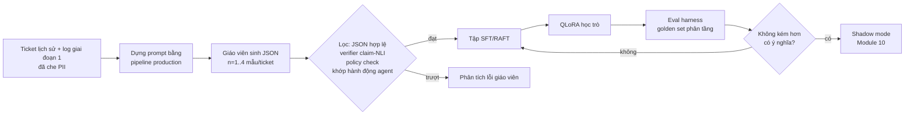

# Module 09 — Huấn luyện / fine-tune cho RAG

> Thời lượng: ~40 phút · Mức độ: Nâng cao · Tiên quyết: Module 01 (post-training, DPO), Module 03 (embedding, InfoNCE), Module 05–06 (retrieval, reranking), Module 07 (grounding, abstention). Nên đọc song song Module 10 (đánh giá) vì mọi quyết định fine-tune đều phải được đo trước/sau.

## Mục tiêu học tập

Sau module này, bạn có thể:

1. **Quyết định có nên fine-tune hay không** và fine-tune thành phần nào (embedding, reranker, generator, bộ phân loại) dựa trên triệu chứng lỗi đo được, thay vì cảm tính.
2. **Xây dữ liệu huấn luyện từ Zendesk**: cặp (query, passage) từ ticket lịch sử, câu hỏi tổng hợp do LLM sinh, hard negative có lọc false negative, chia train/test không rò rỉ, và xử lý PII đúng cách.
3. **Viết và giải thích loss**: MultipleNegativesRanking/InfoNCE (kèm gradient), Matryoshka, binary cross-entropy cho reranker, loss SFT có mask, DPO/ORPO/KTO — tính được bằng tay trên ví dụ nhỏ.
4. **Tính số tham số LoRA** cho một model cụ thể (Qwen3-1.7B / Qwen3-4B), giải thích NF4 và double quantization của QLoRA, và **ước lượng VRAM** để biết cấu hình nào chạy được trên GPU 6 GB.
5. **Thiết kế dữ liệu RAFT** (oracle + distractor) và dữ liệu dạy abstention phù hợp với yêu cầu "không bịa chính sách → escalate".
6. **Lập kế hoạch distillation** từ model lớn (API) sang model nhỏ tự host, cùng cổng đánh giá (regression gate) trước khi đưa vào production.

---

## 1. Khi nào fine-tune, khi nào không

### 1.1 Vấn đề: "model trả lời sai, vậy fine-tune đi" là phản xạ đắt và thường sai

Khi hệ thống RAG cho Zendesk trả lời sai, có ít nhất bốn nơi có thể hỏng: (a) không lấy được tài liệu đúng (retrieval), (b) lấy được nhưng xếp hạng thấp nên bị cắt khỏi context (ranking), (c) có tài liệu đúng trong context nhưng LLM đọc sai, bỏ qua hoặc bịa thêm (generation/grounding), (d) lẽ ra không nên trả lời mà phải chuyển người (quyết định). Fine-tune chỉ là một công cụ, và mỗi thành phần có công cụ fine-tune riêng. Nếu bạn fine-tune generator để chữa lỗi (a), bạn đang dạy model *đoán* câu trả lời mà không có bằng chứng — đúng thứ chúng ta muốn tránh trong bài toán CS có ràng buộc "không bịa giá, hoàn tiền, SLA".

### 1.2 Trực giác: fine-tune dạy **hành vi và thước đo**, RAG cung cấp **tri thức**

Hai kết quả thực nghiệm đáng nhớ:

- Ovadia et al. (2023, arXiv:2312.05934) so sánh việc "nhồi" tri thức bằng fine-tune không giám sát với RAG, và thấy RAG thắng ổn định, kể cả với kiến thức model đã từng thấy lẫn kiến thức mới hoàn toàn.
- Gekhman et al. (2024, arXiv:2405.05904) cho thấy LLM học dữ kiện mới qua fine-tune rất chậm, và khi cuối cùng nó "học" được thì xu hướng hallucinate lại tăng lên. Diễn giải của họ: tri thức chủ yếu đến từ pre-training; fine-tune chủ yếu dạy model *cách dùng* tri thức sẵn có.

Với Zendesk, điều này có hệ quả rất cụ thể: chính sách giá/hoàn tiền thay đổi hằng tuần. Nếu bạn SFT generator trên 200.000 reply cũ, model sẽ "thuộc" giá cũ và tự tin nói ra khi context không có — một dạng hallucination khó phát hiện vì câu trả lời nghe rất "đúng giọng công ty". Vì vậy mình đặt nguyên tắc: **tri thức biến động sống trong index; trọng số model chỉ học phong cách, định dạng, cách đọc context, cách từ chối, và hàm tương đồng giữa câu hỏi và tài liệu.**

<!-- fig:where-to-finetune -->
<figure markdown="span">
  { loading=lazy }
  { loading=lazy }
  <figcaption>Hình 9.1 — Bốn chỗ có thể hỏng trong RAG và công cụ tương ứng: luôn thử cách rẻ trước, fine-tune đúng thành phần đang hỏng.</figcaption>
</figure>
<!-- /fig -->

### 1.3 Ma trận quyết định theo triệu chứng

Trước khi fine-tune bất cứ gì, bạn cần bộ đánh giá của Module 10 để biết lỗi nằm ở đâu. Bảng dưới đây giả định bạn đã có golden set và đo được các chỉ số tương ứng.

| Triệu chứng đo được (Module 10) | Thành phần nghi ngờ | Thử trước (rẻ) | Fine-tune khi nào |
|---|---|---|---|
| Recall@20 thấp, đặc biệt với thuật ngữ nội bộ ("gói Pro-Plus", mã lỗi `E-4012`), email tiếng Nhật | Embedding | Hybrid BM25 + dense (Module 05), chuẩn hóa query, thêm từ đồng nghĩa | Recall@20 vẫn < mục tiêu sau hybrid; có ≥ vài nghìn cặp (query, passage) |
| Recall@20 tốt nhưng nDCG@5/MRR thấp (tài liệu đúng nằm ở hạng 8–20) | Reranker | Đổi reranker đa ngữ mạnh hơn, tăng top-k vào reranker (Module 06) | Reranker zero-shot nhầm giữa các bài gần giống nhau (phiên bản cũ/mới, gói A/gói B) |
| Context đúng, câu trả lời vẫn bịa hoặc lẫn tài liệu nhiễu | Generator (grounding) | Prompt chặt hơn, citation bắt buộc, verifier (Module 07) | Lỗi có hệ thống, model nhỏ tự host không làm theo prompt; muốn giảm chi phí bằng model nhỏ |
| Văn phong sai: kính ngữ tiếng Nhật kém, xưng hô tiếng Việt lộn xộn, quá dài | Generator (style) | Few-shot với macro mẫu, system prompt có quy tắc văn phong | Agent sửa draft chủ yếu vì giọng văn (đo bằng edit distance phân loại theo lý do) |
| Model trả lời cả khi nên chuyển người | Generator (abstention) + bộ phân loại escalate | Ngưỡng confidence, rule cho intent nhạy cảm (Module 10) | Tín hiệu confidence yếu; cần model biết nói "không đủ thông tin" |
| Chi phí API quá cao ở 1.500 ticket/ngày | Toàn bộ generator | Cascade nhỏ/lớn, prompt caching (Module 11) | Có đủ output chất lượng từ model lớn để distill |

### 1.4 Thứ tự ưu tiên mình khuyên dùng

1. **Đo** (Module 10) — không có số đo thì không biết fine-tune có giúp hay hại.
2. **Sửa dữ liệu và chunking** (Module 04) — rất nhiều "lỗi retrieval" thực chất là chunk chứa chữ ký email, quoted reply, hoặc bài Help Center lỗi thời chưa bị xóa.
3. **Hybrid + reranker có sẵn** (Module 05–06).
4. **Fine-tune embedding / reranker** — rẻ (model vài trăm triệu tham số), chạy được trên GPU 6 GB, lợi ích thường rõ ràng với domain hẹp và đa ngữ.
5. **Fine-tune generator** (LoRA/QLoRA) — đắt hơn về dữ liệu, đánh giá và vận hành; làm khi có lý do mạnh (chi phí, latency, tự host bắt buộc, văn phong).

### 1.5 Khi nào KHÔNG fine-tune

- Khi lượng dữ liệu sạch quá ít (vài trăm cặp) và nhiễu nhãn cao — mô hình sẽ học nhiễu.
- Khi lỗi chủ yếu là tri thức thiếu/cũ — sửa index.
- Khi bạn chưa có pipeline đánh giá và rollback. Một embedding fine-tune xong bắt buộc phải **re-embed toàn bộ corpus** (Module 11: blue/green index); nếu không có quy trình này, đừng bắt đầu.
- Khi model nền sắp được thay (ví dụ nhà cung cấp ra phiên bản mới mỗi vài tháng) — adapter LoRA không chuyển được giữa các model nền khác nhau.

> **Liên hệ Zendesk.** Ở giai đoạn 1 (AI chỉ soạn internal note cho agent duyệt), mình thường chỉ fine-tune embedding + reranker, còn generator dùng model lớn qua API hoặc model tự host chưa fine-tune. Giai đoạn 1 tạo ra một "mỏ vàng" dữ liệu: mỗi draft được agent sửa thành câu trả lời cuối cùng là một cặp sở thích (draft, bản sửa) — chính là dữ liệu cho SFT/DPO ở giai đoạn 2 (mục 5).

---

## 2. Dữ liệu huấn luyện từ Zendesk

Fine-tune thành công hay thất bại phần lớn quyết định ở đây. Phần này tập trung vào dữ liệu cho embedding/reranker; dữ liệu cho generator ở mục 5.

### 2.1 Khai thác cặp (query, positive) từ ticket lịch sử — giám sát yếu

**Vấn đề.** Ta cần nhiều cặp (câu hỏi thật của khách, đoạn tài liệu trả lời được nó). Không ai gán nhãn sẵn, nhưng 200.000 ticket đã giải quyết chứa tín hiệu ngầm.

**Ý tưởng.** Khi agent trả lời, họ thường: (a) dán link bài Help Center, (b) áp dụng một macro, (c) trích đoạn tài liệu sản phẩm. Mỗi hành động đó nối một câu hỏi với một tài liệu. Ta chuyển chúng thành cặp huấn luyện:

| Tín hiệu trong ticket | Cặp tạo ra | Độ tin cậy |
|---|---|---|
| Reply của agent chứa URL `/hc/.../articles/<id>` | (câu hỏi khách, các chunk của bài `<id>`) | Trung bình — cần chọn đúng chunk trong bài |
| Ticket có sự kiện áp dụng macro `<macro_id>` (audit log) | (câu hỏi khách, nội dung macro) | Cao nếu agent không sửa nhiều |
| Reply chứa đoạn văn trùng (n-gram/embedding) với tài liệu | (câu hỏi, đoạn trùng) | Trung bình |
| Ticket CSAT "good", không reopen trong 7 ngày | Tăng trọng số cặp | Lọc chất lượng |

Các bước làm sạch (dựa trên Module 04): tách quoted reply và chữ ký, chỉ giữ **lượt đầu tiên của khách** làm query (hoặc lượt đã "condense" theo Module 06), loại auto-reply, loại ticket spam. Chọn chunk positive trong bài bằng cách lấy chunk có điểm cross-encoder cao nhất với *reply của agent* (không phải với câu hỏi — để tránh thiên lệch về chính model mình đang muốn cải thiện).

**Ước lượng sản lượng (giả định để học).** Nếu ~30% trong 200.000 ticket có link bài hoặc macro rõ ràng, sau lọc CSAT/reopen còn ~50% → khoảng 30.000 cặp. Đó là quy mô rất đủ cho fine-tune embedding cỡ base.

<!-- fig:weak-pairs-funnel -->
<figure markdown="span">
  { loading=lazy }
  { loading=lazy }
  <figcaption>Hình 9.2 — Ước lượng sản lượng cặp huấn luyện từ ticket lịch sử theo các tỷ lệ giả định của mục 2.1.</figcaption>
</figure>
<!-- /fig -->

**Cạm bẫy.** Phân bố bị lệch về các câu hỏi phổ biến (đặt lại mật khẩu, hóa đơn). Hãy giới hạn số cặp tối đa cho mỗi tài liệu (ví dụ ≤ 50) để model không chỉ giỏi top-20 bài phổ biến.

### 2.2 Câu hỏi tổng hợp do LLM sinh

**Vấn đề.** Bài Help Center mới (ra theo release notes) chưa có ticket nào; tiếng Nhật có ít ticket hơn tiếng Việt.

**Ý tưởng.** Dùng LLM sinh câu hỏi mà một đoạn tài liệu trả lời được, rồi dùng cặp (câu hỏi sinh, đoạn) để huấn luyện. Dòng nghiên cứu: InPars (Bonifacio et al., 2022, arXiv:2202.05144), Promptagator (Dai et al., 2022, arXiv:2209.11755 — chỉ cần ~8 ví dụ mẫu), GPL (Wang et al., 2021, arXiv:2112.07577 — sinh câu hỏi + gán nhãn mềm bằng cross-encoder), và Wang et al. (2023, arXiv:2401.00368) dùng LLM sinh dữ liệu đa nhiệm cho embedding trên 93 ngôn ngữ.

Các lưu ý khi áp dụng cho Zendesk:

1. **Bắt chước phong cách email thật**, không phải câu hỏi "sạch sẽ". Đưa vào prompt 3–5 email thật (đã che PII) làm mẫu: có lời chào, mô tả bối cảnh, lỗi chính tả, trộn Anh–Việt ("em bị lỗi khi export invoice ạ").
2. **Sinh đa ngữ có chủ đích**: cùng một đoạn, sinh 1 câu tiếng Việt, 1 tiếng Anh, 1 tiếng Nhật (lịch sự kiểu email doanh nghiệp). Đây là cách rẻ nhất để có dữ liệu cross-lingual (câu hỏi tiếng Nhật, tài liệu tiếng Anh).
3. **Lọc round-trip (consistency filtering)**: với mỗi câu hỏi sinh, chạy retriever hiện tại (hoặc cross-encoder) trên toàn corpus; chỉ giữ nếu đoạn gốc nằm trong top-$k$ (ví dụ $k=3$). Câu hỏi quá chung chung ("làm sao để dùng tính năng này?") sẽ bị loại vì đoạn gốc không nổi lên.
4. **Không để LLM thấy câu trả lời quá rõ**: nếu câu hỏi sinh chép nguyên cụm từ của đoạn, model học "khớp từ khóa" — thứ BM25 đã làm tốt. Yêu cầu LLM diễn đạt lại bằng ngôn ngữ của khách, tránh lặp từ khóa hiếm.

```python
# Prompt sinh câu hỏi tổng hợp (rút gọn). Gọi bằng LLM bất kỳ (API hoặc vLLM).
GEN_PROMPT = """Bạn là khách hàng doanh nghiệp đang dùng phần mềm SaaS của chúng tôi.
Dưới đây là một đoạn tài liệu hỗ trợ. Hãy viết {n} email ngắn (1-4 câu) mà khách hàng
có thể gửi tới bộ phận CS, sao cho đoạn tài liệu trả lời được email đó.
Yêu cầu:
- Ngôn ngữ: {lang}. Văn phong email thật (có thể có lời chào, mô tả tình huống).
- KHÔNG chép nguyên cụm từ hiếm trong tài liệu; diễn đạt theo cách người dùng mô tả triệu chứng.
- Không bịa tên công ty, số tài khoản, email thật.
Ví dụ email thật (đã ẩn danh):
{few_shot_emails}
Đoạn tài liệu:
<doc>{passage}</doc>
Trả về JSON: {{"emails": ["...", "..."]}}"""
```

### 2.3 Chia train / dev / test không rò rỉ

Ba kiểu rò rỉ hay gặp:

- **Rò rỉ theo tài liệu**: cùng một bài Help Center xuất hiện ở cả train và test → model "thuộc" bài đó, điểm test đẹp giả. Chia theo **nhóm tài liệu** (group split), không chia ngẫu nhiên theo cặp.
- **Rò rỉ theo thời gian**: chính sách đổi theo tuần; test phải là giai đoạn *sau* train (ví dụ train trên ticket đến tháng 6, test trên tháng 7–8) để mô phỏng đúng điều kiện production.
- **Rò rỉ do trùng lặp gần**: khách gửi cùng một email cho nhiều ticket, hoặc các macro gần như giống nhau. Dùng MinHash/SimHash (Module 04) để khử trùng lặp *trước* khi chia.

Và quan trọng nhất: **golden set của Module 10 không bao giờ được dùng để train.** Lưu danh sách ID ticket/tài liệu của golden set và lọc chúng ra khỏi mọi tập train.

<!-- fig:leak-free-split -->
<figure markdown="span">
  { loading=lazy }
  { loading=lazy }
  <figcaption>Hình 9.3 — Chia dữ liệu không rò rỉ: theo thời gian, theo nhóm tài liệu, và tách hẳn golden set.</figcaption>
</figure>
<!-- /fig -->

### 2.4 Data governance: PII và dữ liệu khách hàng trong dữ liệu huấn luyện

Đây là chỗ nhiều nhóm làm ẩu. Với index, bạn có thể xóa một tài liệu là xong; với trọng số model thì **không xóa được** một ví dụ đã học. Do đó:

1. **Che PII trước khi train**, không phải sau. Thay tên, email, số điện thoại, mã khách hàng, địa chỉ bằng placeholder nhất quán (`<CUSTOMER_NAME>`, `<EMAIL>`, `<ORDER_ID>`). Dùng cùng bộ redaction như Module 04 nhưng chạy với ngưỡng bảo thủ hơn (thà che nhầm còn hơn sót).
2. **Không trộn dữ liệu đặc thù của từng tenant** vào model dùng chung nếu hợp đồng không cho phép. Câu hỏi "model có thể nhả ra nội dung ticket của khách A khi trả lời khách B không?" là câu hỏi pháp lý thật, không chỉ kỹ thuật — LLM có thể ghi nhớ nguyên văn chuỗi hiếm xuất hiện nhiều lần.
3. **Quyền bị lãng quên**: nếu khách yêu cầu xóa dữ liệu, bạn phải chứng minh được dữ liệu đó không nằm trong tập train của model hiện hành — hoặc có quy trình train lại. Lưu **manifest** (danh sách ID ticket dùng để train) cho mỗi phiên bản model.
4. **Kiểm tra ghi nhớ (memorization probe)**: sau khi train, prompt model bằng phần đầu của một vài ticket trong tập train và xem nó có hoàn thành nguyên văn phần sau (kèm placeholder hay PII sót) không.
5. Các yêu cầu pháp lý (Nghị định 13/2023/NĐ-CP của Việt Nam, APPI của Nhật) được bàn ở Module 11; ở đây chỉ cần nhớ: dữ liệu huấn luyện là "xử lý dữ liệu cá nhân" và cần cơ sở pháp lý, mục đích rõ ràng, thời hạn lưu trữ.

> **Liên hệ Zendesk.** Mình khuyên tách hai "kho": (1) kho cặp huấn luyện cho embedding/reranker — chỉ cần câu hỏi đã che PII + ID tài liệu công khai (Help Center, macro), rủi ro thấp; (2) kho hội thoại cho SFT generator — chứa nguyên văn reply, rủi ro cao hơn, cần review và phê duyệt riêng. Nhiều nhóm chỉ cần kho (1) là đã đạt phần lớn cải thiện.

---

## 3. Fine-tune embedding (bi-encoder)

### 3.1 Vấn đề

Model embedding đa ngữ dùng sẵn (ví dụ họ `multilingual-e5`, `bge-m3`, `Qwen3-Embedding` — xem Module 03 về lựa chọn) được huấn luyện trên dữ liệu web chung. Nó không biết rằng trong sản phẩm của bạn "workspace" và "không gian làm việc" và 「ワークスペース」 là một khái niệm, hay rằng "bị trừ tiền 2 lần" nên gần bài "Hoàn tiền giao dịch trùng" hơn là bài "Bảng giá". Fine-tune dạy lại **hàm tương đồng** cho domain của bạn.

### 3.2 Loss MultipleNegativesRanking (InfoNCE với in-batch negatives)

Module 03 đã dẫn xuất InfoNCE và liên hệ với cận dưới thông tin tương hỗ; ở đây ta tập trung vào **dạng cụ thể dùng khi huấn luyện** và hành vi gradient của nó.

**Ký hiệu.** Một batch gồm $B$ cặp $(q_i, p_i)$, $i=1..B$. Encoder $f_\theta$ cho ra vector đã chuẩn hóa $\mathbf{u}_i = f_\theta(q_i)$, $\mathbf{v}_j = f_\theta(p_j)$. Độ tương đồng $s_{ij} = \cos(\mathbf{u}_i, \mathbf{v}_j)$. Hệ số scale $\gamma = 1/\tau$ (trong `sentence-transformers` mặc định $\gamma = 20$, tức $\tau = 0{,}05$). Nếu có thêm hard negative $n_i$ cho mỗi query, tập ứng viên của query $i$ là $\{p_1..p_B, n_1..n_B\}$.

**Loss** (MultipleNegativesRankingLoss — Henderson et al., 2017, arXiv:1705.00652; về bản chất là InfoNCE của van den Oord et al., 2018, arXiv:1807.03748):

$$
\mathcal{L} = -\frac{1}{B}\sum_{i=1}^{B} \log \frac{\exp(\gamma\, s_{ii})}{\sum_{j=1}^{B} \exp(\gamma\, s_{ij}) + \sum_{j=1}^{B}\exp(\gamma\, \cos(\mathbf{u}_i, f_\theta(n_j)))}
$$

Đây đơn giản là cross-entropy của một bài toán phân loại "trong $C$ ứng viên, đâu là passage đúng của $q_i$?", với logit $\gamma s_{ij}$.

**Gradient — trực giác quan trọng nhất.** Đặt $\pi_{ij} = \mathrm{softmax}_j(\gamma s_{ij})$. Với một query $i$:

$$
\frac{\partial \mathcal{L}_i}{\partial s_{ij}} = \gamma\left(\pi_{ij} - \mathbb{1}[j = i]\right)
$$

Nghĩa là: positive bị kéo lại gần với lực $\gamma(1-\pi_{ii})$; mỗi negative bị đẩy ra với lực tỷ lệ với $\pi_{ij}$ — **xác suất model hiện tại nhầm nó là positive**. Negative dễ ($\pi_{ij}\approx 0$) gần như không đóng góp gradient. Đó là lý do hard negative quan trọng, và cũng là lý do **false negative cực kỳ độc hại**: nếu $n_j$ thực ra cũng trả lời được $q_i$, model đang nhận lực đẩy mạnh nhất vào đúng chỗ sai.

**Ví dụ số tính tay** ($\gamma = 20$, một query, 4 ứng viên, ứng viên đầu là positive):

| Tình huống | $s_{i\cdot}$ (cosine) | Logit $\gamma s$ | $\pi$ (softmax) | $\mathcal{L}_i = -\log \pi_{ii}$ |
|---|---|---|---|---|
| Negative dễ | 0,80 · 0,60 · 0,30 · 0,10 | 16 · 12 · 6 · 2 | 0,982 · 0,018 · ~0 · ~0 | **0,018** |
| Hard negative | 0,80 · 0,78 · 0,75 · 0,30 | 16 · 15,6 · 15 · 6 | 0,491 · 0,329 · 0,181 · ~0 | **0,712** |
| False negative (ứng viên 2 thực ra cũng đúng) | 0,80 · 0,82 · 0,30 · 0,10 | 16 · 16,4 · 6 · 2 | 0,401 · 0,599 · ~0 · ~0 | **0,913** |

Kiểm tra dòng 1: $e^{16}/(e^{16}+e^{12}+e^{6}+e^{2}) = 1/(1+e^{-4}+e^{-10}+e^{-14}) \approx 1/1{,}0183 = 0{,}982$, $-\ln 0{,}982 \approx 0{,}018$. Dòng 3 có loss lớn nhất và gradient đẩy ứng viên 2 ra xa với lực $20 \times 0{,}599 \approx 12$ — model bị phạt nặng vì một điều *đúng*.

**Vai trò của $\gamma$ (hay $\tau$).** Nếu bỏ scale ($\gamma = 1$), cùng dòng 1 có $\pi_{ii} = e^{0{,}8}/(e^{0{,}8}+e^{0{,}6}+e^{0{,}3}+e^{0{,}1}) \approx 0{,}342$ và loss $\approx 1{,}07$: cosine nằm trong $[-1,1]$ nên không đủ "biên độ" để softmax trở nên sắc. $\gamma$ lớn làm phân phối sắc hơn và tập trung gradient vào negative khó; quá lớn thì nhạy với nhiễu nhãn. Giá trị 20 (tức $\tau=0{,}05$) là mặc định hợp lý; hiếm khi cần chỉnh.

<!-- fig:mnrl-cases -->
<figure markdown="span">
  { loading=lazy }
  { loading=lazy }
  <figcaption>Hình 9.4 — Trái: phân phối softmax và loss của ba trường hợp trong bảng mục 3.2. Phải: loss của trường hợp negative dễ theo hệ số scale γ.</figcaption>
</figure>
<!-- /fig -->

**Batch size.** Với $C$ ứng viên, loss ngẫu nhiên ban đầu khoảng $\log C$, và cận dưới MI mà InfoNCE ước lượng bị chặn bởi $\log C$ (Module 03). Thực tế: batch lớn hơn = nhiều negative hơn = tín hiệu tốt hơn, đến một mức bão hòa. Trên GPU 6 GB, batch 32–64 với model base là giới hạn thực tế; `CachedMultipleNegativesRankingLoss` (dựa trên GradCache của Gao et al., 2021, arXiv:2101.06983) cho phép batch hiệu dụng vài trăm–vài nghìn bằng cách tính embedding theo mini-batch không giữ graph, rồi tính lại gradient từng phần — đổi bộ nhớ lấy thời gian (~gấp đôi forward).

**Trùng lặp trong batch.** Nếu hai cặp trong cùng batch có cùng passage (hai khách hỏi cùng một bài), passage của cặp kia trở thành "negative" của query này — một false negative tự tạo. Dùng batch sampler `NO_DUPLICATES` để tránh.

### 3.3 Hard negative mining và vấn đề false negative

**Ý tưởng.** Với mỗi query, lấy top-$K$ từ một retriever (BM25, dense hiện tại, hoặc cả hai), bỏ positive, và chọn vài ứng viên làm negative. Các nghiên cứu như RocketQA (Qu et al., 2020, arXiv:2010.08191) đã chỉ ra hard negative lấy từ retriever chứa rất nhiều false negative và cần khử nhiễu bằng cross-encoder.

**Bao nhiêu là false negative?** NV-Retriever (Moreira et al., 2024, arXiv:2407.15831) dùng LLM để kiểm tra và ước lượng rằng với Natural Questions, cách lấy top-$k$ ngây thơ chứa khoảng **39% false negative**. Họ đề xuất *positive-aware mining*: chỉ nhận một ứng viên làm negative nếu điểm của nó thấp hơn một ngưỡng tính từ điểm của positive — ví dụ $s(q,n) < 0{,}95 \cdot s(q,p)$ (TopK-PercPos), hoặc $s(q,n) < s(q,p) - 0{,}05$ (TopK-MarginPos).

**Vì sao Zendesk còn tệ hơn NQ.** Corpus của bạn có nhiều bài gần như trùng: "Hoàn tiền gói tháng" vs "Hoàn tiền gói năm", bài v2 vs v3 của cùng hướng dẫn, macro tiếng Việt và macro tiếng Anh cùng nội dung. Với query tiếng Nhật về hoàn tiền, bài tiếng Anh cùng nội dung là **positive**, không phải negative. Quy tắc thực tế:

1. Loại khỏi tập ứng viên negative mọi tài liệu cùng **họ tài liệu** với positive (cùng `article_family_id`, bản dịch, phiên bản khác) — dùng metadata từ Module 04.
2. Áp positive-aware threshold bằng một cross-encoder mạnh (không phải chính embedding đang train).
3. Bỏ qua hạng 1–$r$ đầu (ví dụ `range_min=10`) nếu corpus có nhiều trùng lặp — hạng quá cao thường là false negative.
4. Lấy mẫu kiểm tra tay 100 bộ ba (query, positive, negative) trước khi train. Nếu > 10% negative thực ra là đúng, quay lại bước 1.

<!-- fig:positive-aware-mining -->
<figure markdown="span">
  { loading=lazy }
  { loading=lazy }
  <figcaption>Hình 9.5 — Positive-aware mining (số minh họa): loại ứng viên cùng họ tài liệu và ứng viên có điểm vượt 95% điểm positive.</figcaption>
</figure>
<!-- /fig -->

### 3.4 Matryoshka loss — một model, nhiều kích thước vector

Module 03 đã giới thiệu Matryoshka Representation Learning (Kusupati et al., 2022, arXiv:2205.13147). Khi fine-tune, ta có thể bọc loss chính để giữ được tính chất "cắt chiều":

$$
\mathcal{L}_{\text{MRL}} = \sum_{m \in \mathcal{M}} w_m \, \mathcal{L}_{\text{MNRL}}\big(\text{trunc}_m(\mathbf{u}), \text{trunc}_m(\mathbf{v})\big)
$$

với $\mathcal{M}$ là tập số chiều (ví dụ $\{768, 512, 256, 128, 64\}$), $\text{trunc}_m$ lấy $m$ chiều đầu rồi chuẩn hóa lại, $w_m$ là trọng số (thường bằng 1). Gradient từ các mức nhỏ ép thông tin quan trọng nhất dồn về các chiều đầu.

**Trade-off.** Thời gian train tăng nhẹ (chỉ phần tính loss lặp lại, encoder chạy 1 lần). Chất lượng ở chiều đầy đủ thường giảm rất ít. Lợi ích: ở quy mô ~1 triệu chunk (800 bài + 300 macro + 200.000 ticket đã chunk), vector 256 chiều thay vì 1024 giảm 4 lần bộ nhớ index (tính toán chi tiết ở Module 05/11). Nếu model gốc **không** được huấn luyện Matryoshka mà bạn fine-tune *không* dùng MRL, đừng cắt chiều — chất lượng sụp mạnh.

### 3.5 Code: fine-tune embedding với sentence-transformers

Đoạn code dưới đây viết cho `sentence-transformers` 6.x (bản 6.1.0 phát hành 09/2026; tính đến 10/2026). Từ v5.4 nhiều module được chuyển vào gói con `sentence_transformers.sentence_transformer.*`; đường dẫn cũ vẫn import được nhưng nên dùng đường dẫn mới.

```python
# pip install "sentence-transformers>=6.1" datasets
# Chạy được trên GPU 6GB với model cỡ small/base, batch 32, seq 256, bf16/fp16.
from datasets import load_dataset
from sentence_transformers import (
    SentenceTransformer, SentenceTransformerTrainer,
    SentenceTransformerTrainingArguments, mine_hard_negatives,
)
from sentence_transformers.base.sampler import BatchSamplers
from sentence_transformers.cross_encoder import CrossEncoder
from sentence_transformers.sentence_transformer.losses import (
    CachedMultipleNegativesRankingLoss, MatryoshkaLoss,
)
from sentence_transformers.sentence_transformer.evaluation import InformationRetrievalEvaluator

# 1) Dữ liệu: JSONL với cột "anchor" (email khách đã che PII) và "positive" (chunk tài liệu)
pairs = load_dataset("json", data_files="zendesk_pairs_train.jsonl", split="train")
corpus = [r["text"] for r in load_dataset("json", data_files="kb_chunks.jsonl", split="train")]

model = SentenceTransformer("intfloat/multilingual-e5-base")  # ví dụ; chọn model theo Module 03
# Model họ e5 cần prefix "query: " / "passage: " — khai báo qua prompts để train và infer nhất quán
prompts = {"anchor": "query: ", "positive": "passage: ", "negative": "passage: "}

# 2) Hard negative có lọc false negative bằng cross-encoder + ngưỡng tương đối
reranker = CrossEncoder("BAAI/bge-reranker-v2-m3")  # reranker đa ngữ làm "trọng tài"
train = mine_hard_negatives(
    pairs, model, corpus=corpus, cross_encoder=reranker,
    range_min=5, range_max=50,      # bỏ 5 hạng đầu (hay là false negative), xét tới hạng 50
    relative_margin=0.05,           # negative phải thấp hơn positive ít nhất 5% (positive-aware)
    num_negatives=1, sampling_strategy="top",
    query_prompt="query: ", corpus_prompt="passage: ",
    output_format="triplet",        # cột: anchor, positive, negative
)
# (Ở production: lọc thêm theo article_family_id trước khi gọi hàm này — xem 3.3)

# 3) Loss: MNRL có cache (batch hiệu dụng lớn trên GPU nhỏ) bọc trong Matryoshka
base_loss = CachedMultipleNegativesRankingLoss(model, mini_batch_size=16)  # scale mặc định 20
loss = MatryoshkaLoss(model, base_loss, matryoshka_dims=[768, 512, 256, 128])

# 4) Evaluator: Recall/MRR/nDCG trên tập dev (chia theo nhóm tài liệu + theo thời gian)
dev = load_dataset("json", data_files="zendesk_dev.jsonl", split="train")
evaluator = InformationRetrievalEvaluator(
    queries={r["qid"]: r["query"] for r in dev},
    corpus={f"c{i}": t for i, t in enumerate(corpus)},
    relevant_docs={r["qid"]: set(r["relevant_cids"]) for r in dev},
    query_prompt="query: ", corpus_prompt="passage: ",
    mrr_at_k=[10], ndcg_at_k=[10], name="zendesk-dev",
)

args = SentenceTransformerTrainingArguments(
    output_dir="out/e5-zendesk",
    num_train_epochs=1, per_device_train_batch_size=128,  # batch logic; cache chia nhỏ thành 16
    learning_rate=2e-5, warmup_ratio=0.1, bf16=True,       # GPU không hỗ trợ bf16 thì dùng fp16=True
    batch_sampler=BatchSamplers.NO_DUPLICATES,             # tránh false negative trong batch
    prompts=prompts,
    eval_strategy="steps", eval_steps=200, save_steps=200,
    load_best_model_at_end=True, metric_for_best_model="eval_zendesk-dev_cosine_ndcg@10",
)
print("Trước fine-tune:", evaluator(model))  # luôn đo baseline trước
trainer = SentenceTransformerTrainer(model=model, args=args, train_dataset=train,
                                     loss=loss, evaluator=evaluator)
trainer.train()
print("Sau fine-tune:", evaluator(model))
```

### 3.6 Đánh giá trước/sau và các bẫy

1. **Đo baseline trên cùng evaluator** (đã làm trong code). Báo cáo Recall@k, MRR@10, nDCG@10 theo từng **ngôn ngữ** và **nhóm intent**; trung bình chung có thể che một sự sụt giảm ở tiếng Nhật.
2. **Đo cả pipeline**, không chỉ embedding: hybrid + reranker phía sau có thể "bù" phần lớn cải thiện của embedding. Nếu end-to-end Recall@20 sau rerank chỉ tăng 0,5 điểm, chi phí re-index có thể không đáng.
3. **Kiểm tra quên thảm họa (catastrophic forgetting)**: chạy thêm một bộ benchmark chung nhỏ (ví dụ một phần của MMTEB hoặc NanoBEIR mà `sentence-transformers` hỗ trợ). Nếu điểm chung giảm mạnh, model có thể tệ đi trên các câu hỏi lạ (khách hỏi về thứ chưa có trong train).
4. **Khoảng tin cậy**: dev set vài trăm query → chênh lệch 1–2 điểm nDCG có thể chỉ là nhiễu. Dùng paired bootstrap (Module 10, mục 5) trước khi tuyên bố "tốt hơn".

**VRAM để fine-tune embedding.** Fine-tune *toàn bộ* với AdamW cần khoảng 16 byte/tham số cho trọng số + gradient + 2 moment khi huấn luyện mixed precision với master weights fp32 (4 + 4 + 4 + 4), chưa tính activation. Model ~118M tham số (cỡ small) → ~1,9 GB; ~278M (cỡ base) → ~4,4 GB; ~568M (cỡ `bge-m3`) → ~9 GB — vượt 6 GB. Với model ≥ 0,5B trên GPU 6 GB, dùng LoRA cho encoder (sentence-transformers hỗ trợ adapter qua PEFT) hoặc thuê GPU cloud vài giờ. (Số tham số trên là xấp xỉ theo model card; kiểm tra lại với model bạn chọn.)

<!-- fig:embedding-vram -->
<figure markdown="span">
  { loading=lazy }
  { loading=lazy }
  <figcaption>Hình 9.6 — Bộ nhớ cho full fine-tune theo quy tắc 16 byte/tham số của mục 3.6.</figcaption>
</figure>
<!-- /fig -->

> **Liên hệ Zendesk.** Kinh nghiệm thực tế: lợi ích lớn nhất của fine-tune embedding thường đến từ (1) thuật ngữ nội bộ/mã lỗi, (2) truy vấn cross-lingual (email tiếng Nhật ↔ bài tiếng Anh chưa dịch), (3) email dài nhiều nhiễu. Đừng kỳ vọng cải thiện lớn ở các câu FAQ phổ biến — model chung đã làm tốt.

---

## 4. Fine-tune reranker (cross-encoder)

### 4.1 Vấn đề và mô hình

Reranker (Module 06) chấm điểm chung $f_\phi(q, d) = \mathbf{w}^\top \mathbf{h}_{\texttt{[CLS]}}(q \oplus d) + b$ — query và tài liệu được đưa qua transformer cùng lúc nên attention giữa chúng là đầy đủ. Nó chính xác hơn bi-encoder nhưng tốn $O(k)$ lượt forward cho mỗi query. Reranker zero-shot thường nhầm ở những cặp *gần giống nhau về bề mặt nhưng khác về nghĩa nghiệp vụ*: "hủy gói" vs "hạ gói", "hoàn tiền trong 14 ngày" (gói tháng) vs "trong 30 ngày" (gói năm). Đó là chỗ fine-tune trên dữ liệu của bạn giúp nhiều.

### 4.2 Các loss

**Pointwise — binary cross-entropy.** Với nhãn $y \in \{0,1\}$ và $\hat{p} = \sigma(f_\phi(q,d))$:

$$
\mathcal{L}_{\text{BCE}} = -\big[y \log \hat{p} + (1-y)\log(1-\hat{p})\big]
$$

Ví dụ: positive có logit 2,0 → $\hat p = 0{,}881$, loss $= -\ln 0{,}881 = 0{,}127$. Hard negative có logit 1,5 → $\hat p = 0{,}818$, loss $= -\ln(1-0{,}818) = 1{,}70$ — gradient chủ yếu đến từ negative khó, như ta muốn.

Ưu điểm: đầu ra $\hat p$ có nghĩa xác suất "liên quan" và — sau hiệu chuẩn (Module 10, mục 6.4) — là một tín hiệu confidence rất tốt cho quyết định escalate. Đây là lý do mình hay chọn BCE cho reranker trong bài toán CS.

<!-- fig:reranker-bce -->
<figure markdown="span">
  { loading=lazy }
  { loading=lazy }
  <figcaption>Hình 9.7 — Binary cross-entropy cho reranker với hai ví dụ của mục 4.2.</figcaption>
</figure>
<!-- /fig -->

**Listwise — softmax cross-entropy.** Với 1 positive và $n$ negative của cùng query:

$$
\mathcal{L}_{\text{list}} = -\log \frac{\exp(f_\phi(q,d^+))}{\exp(f_\phi(q,d^+)) + \sum_{j=1}^{n}\exp(f_\phi(q,d_j^-))}
$$

Đây là InfoNCE áp lên cross-encoder. Tối ưu trực tiếp *thứ tự tương đối* nên thường cho nDCG tốt hơn một chút, nhưng điểm số không còn ý nghĩa xác suất tuyệt đối (chỉ có hiệu số giữa các tài liệu trong cùng query là có nghĩa). Các loss dựa trên metric xếp hạng như LambdaLoss cũng có sẵn trong thư viện.

**Distillation — Margin-MSE** (Hofstätter et al., 2020, arXiv:2010.02666). Khi có một "giáo viên" mạnh (cross-encoder lớn hoặc LLM chấm điểm), học *hiệu số* điểm thay vì nhãn cứng:

$$
\mathcal{L}_{\text{MarginMSE}} = \Big( \big[f_\phi(q,d^+) - f_\phi(q,d^-)\big] - \big[t(q,d^+) - t(q,d^-)\big] \Big)^2
$$

với $t$ là điểm của giáo viên. Học hiệu số giúp bỏ qua chênh lệch thang điểm giữa hai kiến trúc. Rất hợp khi bạn dùng LLM lớn (API) chấm độ liên quan cho 20.000 cặp rồi dạy lại cho reranker nhỏ tự host.

### 4.3 Dữ liệu và code

Tái sử dụng dữ liệu mục 2–3: `mine_hard_negatives(..., output_format="labeled-pair")` sinh ra các cặp (query, passage, label ∈ {0,1}). Tỷ lệ negative:positive khoảng 3–5:1 là phổ biến.

```python
# Fine-tune reranker đa ngữ với BCE — chạy được trên GPU 6GB với model cỡ base, seq 512, batch 16.
from sentence_transformers.cross_encoder import CrossEncoder, CrossEncoderTrainer, CrossEncoderTrainingArguments
from sentence_transformers.cross_encoder.losses import BinaryCrossEntropyLoss
from sentence_transformers.cross_encoder.evaluation import CrossEncoderRerankingEvaluator
import torch

model = CrossEncoder("BAAI/bge-reranker-v2-m3", num_labels=1, max_length=512)
# train_pairs: Dataset với cột "query", "passage", "label" (từ mine_hard_negatives, output_format="labeled-pair")
loss = BinaryCrossEntropyLoss(model, pos_weight=torch.tensor(4.0))  # bù tỷ lệ 1 pos : 4 neg

args = CrossEncoderTrainingArguments(
    output_dir="out/reranker-zendesk", num_train_epochs=1,
    per_device_train_batch_size=16, gradient_accumulation_steps=4,
    learning_rate=2e-5, warmup_ratio=0.1, fp16=True,
    gradient_checkpointing=True,   # cần cho model ~0,5B trên 6GB
    eval_strategy="steps", eval_steps=500,
)
# dev_samples: list[{"query": ..., "positive": [...], "negative": [...]}]
evaluator = CrossEncoderRerankingEvaluator(samples=dev_samples, at_k=10, name="zendesk-dev")
trainer = CrossEncoderTrainer(model=model, args=args, train_dataset=train_pairs,
                              loss=loss, evaluator=evaluator)
trainer.train()
```

Lưu ý VRAM: reranker ~0,57B tham số (cỡ `bge-reranker-v2-m3`) fine-tune toàn bộ cần ~9 GB cho trạng thái optimizer theo phép tính ở 3.6 → trên 6 GB phải dùng LoRA, optimizer 8-bit, hoặc chọn reranker nhỏ hơn. Nếu số tham số model bạn chọn khác, tính lại theo 16 byte/tham số.

**Trade-off / khi nào không fine-tune reranker.** Khi reranker zero-shot đã đạt gần trần (Recall@20 trước rerank là giới hạn trên của mọi reranker — reranker không thể đưa lên thứ retriever không lấy được). Kiểm tra: nếu tỷ lệ "positive có trong top-20 nhưng không trong top-5 sau rerank" nhỏ, lợi ích còn lại cũng nhỏ.

> **Liên hệ Zendesk.** Điểm $\hat p$ của reranker sau hiệu chuẩn là một trong các tín hiệu mạnh nhất cho "AI tự đánh giá cần người can thiệp": nếu không tài liệu nào có $\hat p > 0{,}5$, khả năng cao là câu hỏi nằm ngoài tri thức hiện có → escalate (Module 10, mục 6).

---

## 5. Fine-tune generator: SFT, RAFT và học abstention

Khi chuyển sang model nhỏ tự host (ví dụ Qwen3-4B trên vLLM — Module 11), dù giữ prompt Module 07 ta thường gặp lỗi **định dạng** (enum sai, citation lung tung — constrained decoding chữa cú pháp, không chữa nội dung), **grounding** (bị distractor kéo, trộn số liệu hai gói) và **hành vi** (abstain sai lúc, xưng hô/kính ngữ sai). Cả ba là hành vi, không phải tri thức — đúng vùng fine-tune làm tốt.

### 5.1 SFT: cross-entropy có mask trên phần trả lời

**Ký hiệu.** Một mẫu huấn luyện là cặp $(x, y)$, với $x$ là toàn bộ prompt (system prompt + `<ticket_meta>` + `<sources>` + `<customer_email>` như Module 07, mục 7) và $y = (y_1, \dots, y_T)$ là chuỗi token của đầu ra JSON mong muốn. Model $\pi_\theta$ định nghĩa $\pi_\theta(y_t \mid x, y_{<t})$.

**Loss SFT** chỉ tính trên token của câu trả lời:

$$
\mathcal{L}_{\text{SFT}}(\theta) = -\frac{1}{\sum_{i} T_i}\sum_{i}\sum_{t=1}^{T_i} \log \pi_\theta\big(y^{(i)}_t \mid x^{(i)}, y^{(i)}_{<t}\big)
$$

Về cài đặt, ta nối $x \oplus y$ thành một chuỗi và đặt nhãn của các vị trí thuộc $x$ bằng $-100$ (giá trị `ignore_index` của PyTorch) — gọi là **completion-only loss** hay **loss masking**.

**Vì sao phải mask?** Trong RAG, $x$ dài gấp 5–20 lần $y$. Không mask thì phần lớn gradient dạy model *chép lại tài liệu và email* — vô ích, và còn dạy ghi nhớ tài liệu cũ (mục 1.2) cùng PII.

**Ví dụ số.** $|x| = 2.400$, $|y| = 200$ token; loss trung bình 1,2 nat/token prompt, 0,6 nat/token trả lời. Không mask: $(2.400 \times 1{,}2 + 200 \times 0{,}6)/2.600 \approx 1{,}154$, câu trả lời chỉ đóng góp $120/3.000 = 4\%$. Có mask: loss $= 0{,}6$, 100% tín hiệu từ hành vi cần dạy.

<!-- fig:sft-mask -->
<figure markdown="span">
  { loading=lazy }
  { loading=lazy }
  <figcaption>Hình 9.8 — Vì sao phải mask phần prompt khi SFT cho RAG.</figcaption>
</figure>
<!-- /fig -->

### 5.2 Dữ liệu SFT từ Zendesk: dạy đúng "hợp đồng" đầu ra của Module 07

Nguyên tắc số một: **định dạng train trùng từng ký tự với lúc inference** — cùng system prompt, ID nguồn `S1..Sk`, datamarking, và schema JSON Module 07 (mục 7.3: `customer_questions`, `answer_plan`, `claims`, `draft`, `unanswered_questions`, `escalate`, `escalate_reasons`, `confidence`, `note_for_agent`).

Nguồn dữ liệu, xếp theo chất lượng giảm dần: (1) draft giai đoạn 1 được agent **gửi nguyên văn** — đúng phân phối production nhưng chỉ toàn ca "dễ"; (2) draft được agent **sửa nhẹ** — thay `draft.body` bằng bản agent gửi để học văn phong thật; (3) ticket lịch sử với $x$ dựng lại bằng retrieval hiện tại và $y$ do model lớn sinh rồi lọc (mục 8) — **không** dùng nguyên văn reply cũ vì chứa chính sách cũ; (4) mẫu tổng hợp có chủ đích cho ca hiếm (abstain, mâu thuẫn, injection).

Cạm bẫy ở nguồn (2): agent hay thêm câu như "tài khoản của anh/chị đã được gia hạn tới 30/11" — thông tin lấy từ CRM, không có trong `<sources>`. Đưa vào $y$ là dạy model **bịa thông tin tài khoản nghe hợp lý**. Lọc bằng claim-level NLI (Module 07, mục 8) giữa bản sửa và `<sources>` + `<ticket_meta>`; câu không được hỗ trợ thì loại mẫu hoặc giữ draft gốc cho câu đó.

### 5.3 RAFT — Retrieval-Augmented Fine-Tuning

**Vấn đề.** SFT thường chỉ cho model thấy context "sạch". Ở production, top-$k$ luôn có distractor — bài gần giống, phiên bản cũ, gói khác. Model cần học **đọc có chọn lọc**.

**Ý tưởng RAFT** (Zhang et al., 2024, arXiv:2403.10131). Với mỗi câu hỏi $Q$ có tài liệu "oracle" $D^*$ (chứa đáp án) và một tập distractor $\{D_1, \dots, D_k\}$:

- Với tỷ lệ $P$ các câu hỏi: context = $\{D^*, D_1, \dots, D_{k}\}$ (xáo thứ tự).
- Với tỷ lệ $1-P$ còn lại: context chỉ gồm distractor.
- Đáp án huấn luyện là **chuỗi suy luận có trích dẫn nguyên văn** từ tài liệu (trong bài báo, đoạn trích được bao bởi các marker kiểu `##begin_quote##` … `##end_quote##`), rồi mới đến kết luận.

Bài báo dùng 1 oracle + 4 distractor và thấy giữ một phần mẫu *không* có oracle ($P < 100\%$) có lợi trên một số tập, với $P$ tốt nhất thay đổi theo tập.

**Điều chỉnh bắt buộc cho Zendesk.** Trong bài báo, khi vắng oracle, đích huấn luyện vẫn là đáp án đúng — tức buộc model *nhớ* tri thức vào trọng số, trái nguyên tắc ở mục 1.2 (model sẽ thuộc chính sách hoàn tiền tháng 6 và nói ra vào tháng 9). Mình thiết kế lại:

| Loại mẫu | Context | Đáp án mục tiêu $y$ | Tỷ lệ gợi ý |
|---|---|---|---|
| A. Có oracle + distractor | $D^*$ + 3–4 distractor (xáo) | Trả lời, cite đúng $D^*$, không cite distractor | ~60% |
| B. Chỉ distractor | 4–5 distractor | `unanswered_questions`, `escalate=true`, `insufficient_context`, draft hẹn chuyên viên | ~20% |
| C. Một phần | Email 2–3 câu hỏi, chỉ có oracle cho một số câu | Trả lời phần có nguồn, liệt kê phần thiếu | ~10% |
| D. Mâu thuẫn | Oracle mới + bản cũ trái ngược | Theo quy tắc ưu tiên; không giải quyết được → `conflicting_sources` | ~5% |
| E. Injection | Email/tài liệu chứa lệnh giả | Bỏ qua lệnh, `suspected_injection` | ~5% |

Tỷ lệ là điểm xuất phát, chỉnh theo số đo (mục 5.4). Distractor lấy từ **chính retriever production** (top-$k$ thật trừ oracle) — distractor ngẫu nhiên quá dễ, model không học được gì.

**Ví dụ mẫu loại A.** Khách hỏi giới hạn API gói Business. S1 = giới hạn gói Enterprise (1.000 request/phút), S2 = giới hạn gói Business (300 request/phút, oracle), S3, S4 = distractor khác. Đích có `claims: [{"text": "Gói Business giới hạn 300 request/phút.", "source_ids": ["S2"]}]` và `answer_plan` ghi "S1 là gói Enterprise, không áp dụng" — đúng loại lỗi "lấy nhầm số của gói khác" trong Lab 05.

Trường `answer_plan` + `claims` của schema Module 07 đóng vai trò "suy luận có trích dẫn" của RAFT; giữ ngắn (1–3 câu) vì mỗi token sinh thêm nhân với 1.500 ticket/ngày.

<!-- fig:raft-mix -->
<figure markdown="span">
  { loading=lazy }
  { loading=lazy }
  <figcaption>Hình 9.9 — Hỗn hợp dữ liệu RAFT điều chỉnh cho Zendesk và mẫu loại A của ví dụ giới hạn API.</figcaption>
</figure>
<!-- /fig -->

### 5.4 Học abstention: dạy model nói "không đủ thông tin"

LLM sau post-training có thiên hướng trả lời bằng mọi giá (Module 07, mục 4); model nhỏ thường cần được *dạy* abstain bằng ví dụ. R-Tuning (Zhang et al., 2023, arXiv:2311.09677) tách dữ liệu theo việc model có biết đáp án không và dạy nó biểu thị không chắc chắn ở phần không biết. Với RAG, câu hỏi dễ kiểm soát hơn là **context có đủ không?** — Joren et al. (2024, arXiv:2411.06037) hình thức hóa *sufficient context* và cho thấy model hay trả lời (sai) thay vì từ chối khi context thiếu. Mẫu loại B, C ở bảng 5.3 dạy đúng hành vi đó.

**Hai loại lỗi phải đo cùng lúc.** Gọi $\mathcal{A}$ = tập câu hỏi trả lời được từ context, $\mathcal{U}$ = tập không trả lời được. Định nghĩa:

$$
\text{AnsRate}_{\mathcal{A}} = \frac{\#\{q \in \mathcal{A} : \text{model trả lời}\}}{|\mathcal{A}|}, \qquad
\text{AbsRate}_{\mathcal{U}} = \frac{\#\{q \in \mathcal{U} : \text{model abstain}\}}{|\mathcal{U}|}.
$$

Chỉ có loại A → $\text{AbsRate}_{\mathcal{U}}$ thấp (bịa); quá nhiều loại B → $\text{AnsRate}_{\mathcal{A}}$ giảm (abstain cả khi có đáp án, mất lợi ích automation).

**Ví dụ số.** Bốn phiên bản trên dev set có 400 câu thuộc $\mathcal{A}$ và 100 câu thuộc $\mathcal{U}$:

| Phiên bản | Trả lời trong $\mathcal{A}$ | Abstain trong $\mathcal{U}$ | $\text{AnsRate}_{\mathcal{A}}$ | $\text{AbsRate}_{\mathcal{U}}$ |
|---|---|---|---|---|
| Base + prompt | 388 | 41 | 0,97 | 0,41 |
| SFT chỉ loại A | 392 | 22 | 0,98 | 0,22 |
| SFT A+B+C (60/20/10) | 376 | 87 | 0,94 | 0,87 |
| SFT với B chiếm 50% | 312 | 96 | 0,78 | 0,96 |

Theo ma trận chi phí Module 07 (mục 4.2) với $c_w = 5$ (trả lời câu thuộc $\mathcal{U}$), $c_e = 1$ (abstain câu thuộc $\mathcal{A}$), chi phí trên 500 câu:

Base: $5 \times 59 + 12 = 307$; SFT chỉ A: $5 \times 78 + 8 = 398$ (**tệ hơn base** — fine-tune ngây thơ làm model tự tin hơn); A+B+C: $5 \times 13 + 24 = 89$; B 50%: $5 \times 4 + 88 = 108$.

Phiên bản thứ ba thắng. Với intent hoàn tiền ($c_w = 50$) thứ hạng có thể đảo — vì vậy ngưỡng escalate cuối cùng đặt theo intent ở Module 10; fine-tune chỉ cần làm *tín hiệu* abstain tốt hơn.

<!-- fig:abstention-tradeoff -->
<figure markdown="span">
  { loading=lazy }
  { loading=lazy }
  <figcaption>Hình 9.10 — Bốn phiên bản của bảng mục 5.4 trên mặt phẳng AnsRate / AbsRate, kèm chi phí trên 500 câu.</figcaption>
</figure>
<!-- /fig -->

Abstention của model **không thay thế** bộ quyết định escalate: quy tắc cứng vẫn chạy ngoài model (Module 12, mục 8.1) và `confidence` vẫn phải hiệu chuẩn (Module 10, mục 6).

### 5.5 Code: SFT với TRL + LoRA (prompt–completion)

TRL 1.14 (29/09/2026), PEFT 0.21, Transformers 5.x (tính đến 10/2026). Từ TRL 1.0, `SFTTrainer`/`DPOTrainer` thuộc lõi ổn định; với dataset prompt–completion, `completion_only_loss` mặc định bật (mask như mục 5.1).

```python
# pip install "trl>=1.14" "peft>=0.21" "transformers>=5.0" bitsandbytes datasets
# GPU 6GB: Qwen3-1.7B + QLoRA (ước lượng VRAM ở mục 7.4)
import torch
from datasets import load_dataset
from peft import LoraConfig
from transformers import AutoModelForCausalLM, AutoTokenizer, BitsAndBytesConfig
from trl import SFTConfig, SFTTrainer

MODEL = "Qwen/Qwen3-1.7B"
# Mỗi dòng JSONL: {"prompt": [system M07, user <ticket_meta><sources>...], "completion": [assistant JSON]}
# prompt phải dựng bằng ĐÚNG hàm build_prompt() của production
train = load_dataset("json", data_files="sft_raft_train.jsonl", split="train")
dev = load_dataset("json", data_files="sft_raft_dev.jsonl", split="train")

bnb = BitsAndBytesConfig(load_in_4bit=True, bnb_4bit_quant_type="nf4",     # QLoRA (mục 7.3)
                         bnb_4bit_use_double_quant=True, bnb_4bit_compute_dtype=torch.bfloat16)
tok = AutoTokenizer.from_pretrained(MODEL)
model = AutoModelForCausalLM.from_pretrained(MODEL, quantization_config=bnb, dtype=torch.bfloat16)
lora = LoraConfig(r=16, lora_alpha=32, lora_dropout=0.05, target_modules="all-linear", task_type="CAUSAL_LM")

args = SFTConfig(
    output_dir="out/qwen3-1.7b-cs-sft", max_length=3072,      # đo phân phối độ dài prompt trước
    per_device_train_batch_size=1, gradient_accumulation_steps=16, gradient_checkpointing=True,
    learning_rate=1e-4, lr_scheduler_type="cosine", warmup_ratio=0.03, num_train_epochs=2,
    bf16=True, optim="paged_adamw_8bit",
    eval_strategy="steps", eval_steps=200, save_steps=200,
)   # completion_only_loss mặc định True với dataset prompt-completion
trainer = SFTTrainer(model=model, args=args, train_dataset=train, eval_dataset=dev,
                     processing_class=tok, peft_config=lora)
trainer.train()
trainer.save_model("out/qwen3-1.7b-cs-sft/adapter")   # chỉ lưu adapter (vài chục MB)
```

Đừng quyết định bằng `eval_loss` — loss thấp không có nghĩa grounding tốt. Chạy eval harness Module 10: faithfulness, tỷ lệ JSON hợp lệ, $\text{AnsRate}_{\mathcal{A}}$/$\text{AbsRate}_{\mathcal{U}}$, recall escalate theo lý do bắt buộc, văn phong theo ngôn ngữ.

### 5.6 Trade-off và khi nào KHÔNG fine-tune generator

- **Model nền thay đổi nhanh**: mỗi lần nâng model nền phải train lại adapter và chạy lại toàn bộ eval. Nếu model lớn qua API đã đủ tốt và chi phí chấp nhận được, đừng fine-tune.
- **Quên thảm họa**: Biderman et al. (2024, arXiv:2405.09673) thấy LoRA học ít hơn full fine-tune trên miền đích nhưng cũng *quên ít hơn* năng lực ngoài miền — lý do mặc định chọn LoRA. Cân bằng dữ liệu theo ngôn ngữ, nếu không tiếng Nhật (ít dữ liệu) sẽ xấu đi.

> **Liên hệ Zendesk.** Thứ tự mình khuyên: (1) giai đoạn 1 chạy model lớn qua API, log đủ prompt và JSON; (2) sau 4–8 tuần có hàng chục nghìn draft kèm hành động của agent; (3) distill + RAFT vào model nhỏ (mục 8); (4) chỉ chuyển một nhóm intent rủi ro thấp sang model nhỏ khi kiểm định non-inferiority đạt (Module 10).

---

## 6. Tối ưu theo sở thích: DPO, ORPO, KTO

SFT tăng xác suất câu mẫu nhưng không trực tiếp *giảm* xác suất câu tệ trông gần giống (hứa hẹn ngầm, dài dòng, kính ngữ sai). Zendesk cho sẵn dữ liệu so sánh: **draft của AI** và **bản agent gửi**.

### 6.1 DPO — nhắc lại và áp dụng

Module 01 đã dẫn xuất DPO (Rafailov et al., 2023, arXiv:2305.18290); ở đây chỉ dùng kết quả. Với prompt $x$, câu trả lời được chọn $y_w$ (chosen) và bị loại $y_l$ (rejected), model tham chiếu $\pi_{\text{ref}}$ (thường là model sau SFT, đóng băng):

$$
\mathcal{L}_{\text{DPO}} = -\log \sigma\Big(\beta \Big[\underbrace{\log\frac{\pi_\theta(y_w\mid x)}{\pi_{\text{ref}}(y_w\mid x)}}_{\hat r_w} - \underbrace{\log\frac{\pi_\theta(y_l\mid x)}{\pi_{\text{ref}}(y_l\mid x)}}_{\hat r_l}\Big]\Big)
$$

$\hat r$ là "phần thưởng ngầm" (model tăng xác suất câu trả lời bao nhiêu so với tham chiếu); $\beta$ điều khiển độ bám vào $\pi_{\text{ref}}$ (mặc định TRL: 0,1).

**Ví dụ số.** $\beta = 0{,}1$. Log-prob (tổng trên token) của chosen: $\log\pi_\theta = -40$, $\log\pi_{\text{ref}} = -42$ → $\hat r_w = +2$. Của rejected: $-45$ và $-44$ → $\hat r_l = -1$. Margin $= 0{,}1 \times (2 - (-1)) = 0{,}3$; $\sigma(0{,}3) = 1/(1+e^{-0{,}3}) = 1/1{,}7408 \approx 0{,}574$; loss $= -\ln 0{,}574 \approx 0{,}554$. Lúc bắt đầu train ($\pi_\theta = \pi_{\text{ref}}$), margin = 0 và loss $= \ln 2 \approx 0{,}693$. Gradient đẩy $\hat r_w$ lên và $\hat r_l$ xuống, với hệ số $\beta\,\sigma(-\text{margin})$ — cặp nào model đã phân biệt tốt thì đóng góp ít.

**Dựng cặp sở thích từ Zendesk.** (1) *Agent sửa draft*: chosen = JSON với body là bản agent gửi, rejected = draft gốc — chỉ giữ cặp mà phần sửa là văn phong/cấu trúc hoặc xóa câu sai, loại cặp agent thêm thông tin ngoài sources (như mục 5.2). (2) *Sinh nhiều ứng viên + judge*: on-policy nên tín hiệu sạch hơn, nhưng judge phải đã được đối chiếu với người (Module 10, mục 4). (3) *Lỗi có chủ đích*: rejected là draft đúng bị chèn lỗi (hứa hoàn tiền, đổi con số, sai kính ngữ) — rẻ và nhắm thẳng vào lỗi chính sách.

**Bẫy độ dài.** DPO dùng tổng log-prob; nếu chosen thường dài hơn rejected, model học "dài hơn = tốt hơn". Kiểm tra phân phối độ dài trước khi train, cân bằng lại hoặc thử `loss_type` có chuẩn hóa độ dài của TRL.

### 6.2 ORPO — gộp SFT và sở thích, không cần model tham chiếu

ORPO (Hong et al., 2024, arXiv:2403.07691) bỏ $\pi_{\text{ref}}$ và cộng một số hạng phạt dựa trên **tỷ số odds** vào loss SFT. Định nghĩa xác suất chuẩn hóa độ dài $P_\theta(y\mid x) = \exp\big(\frac{1}{|y|}\sum_t \log\pi_\theta(y_t\mid x,y_{<t})\big)$ và odds $\text{odds}_\theta(y\mid x) = \frac{P_\theta(y\mid x)}{1-P_\theta(y\mid x)}$:

$$
\mathcal{L}_{\text{ORPO}} = \mathcal{L}_{\text{SFT}}(y_w) + \lambda\cdot\Big[-\log\sigma\Big(\log\frac{\text{odds}_\theta(y_w\mid x)}{\text{odds}_\theta(y_l\mid x)}\Big)\Big]
$$

**Ví dụ số.** $P_\theta(y_w) = 0{,}6$ (odds 1,5), $P_\theta(y_l) = 0{,}4$ (odds 0,667): $\log(1{,}5/0{,}667) \approx 0{,}811$, phạt $= -\ln\sigma(0{,}811) \approx 0{,}368$; nếu hai xác suất bằng nhau, phạt $= \ln 2 \approx 0{,}693$.

<!-- fig:dpo-orpo -->
<figure markdown="span">
  { loading=lazy }
  { loading=lazy }
  <figcaption>Hình 9.11 — Trái: loss DPO theo hiệu phần thưởng ngầm (β = 0.1). Phải: số hạng phạt odds ratio của ORPO; các điểm là ví dụ trong bài.</figcaption>
</figure>
<!-- /fig -->

**Trade-off.** ORPO gộp hai giai đoạn và không cần $\pi_{\text{ref}}$. Nhưng với LoRA, DPO cũng không cần bản sao model thứ hai ($\pi_{\text{ref}}$ = model nền khi *tắt adapter*), nên lợi thế bộ nhớ nhỏ. Trong TRL 1.x, ORPO nằm ở `trl.experimental` (API có thể đổi) còn DPO thuộc lõi ổn định — cho production mình ưu tiên SFT → DPO.

### 6.3 KTO — khi chỉ có nhãn "tốt/xấu", không có cặp

KTO (Ethayarajh et al., 2024, arXiv:2402.01306) học từ dữ liệu **không ghép cặp** $(x, y, \text{label} \in \{\text{tốt}, \text{xấu}\})$ — khớp tự nhiên với Zendesk: draft gửi nguyên văn → tốt; draft bị bỏ, viết lại, hoặc dẫn tới reopen → xấu. Không cần agent viết bản thay thế nên dữ liệu nhiều hơn hẳn cặp DPO. `KTOTrainer` của TRL nhận `{"prompt", "completion", "label"}` và cho đặt trọng số riêng cho mẫu tốt/xấu khi mất cân bằng. Cảnh báo: "gửi nguyên văn" không chắc là "đúng" (agent bận duyệt lướt) — review lại 100–200 nhãn để ước lượng nhiễu trước khi train.

> **Liên hệ Zendesk.** Giai đoạn 1 sinh dữ liệu cho cả SFT, DPO, KTO — nếu log đủ ngay từ đầu: `ticket_id`, `prompt_hash`, `model_version`, `draft_json`, `agent_action` (sent_as_is / edited / rewritten / discarded), `final_public_reply`, `edit_distance`, `reopened_7d`, `csat`. Thiếu một cột, ba tháng sau không dựng lại được dữ liệu.

---

## 7. PEFT: LoRA và QLoRA trên GPU 6 GB

### 7.1 LoRA: cập nhật hạng thấp

**Vấn đề.** Full fine-tune với AdamW tốn ~16 byte/tham số (mục 3.6): Qwen3-1.7B (~1,72 tỷ tham số) cần ~27,5 GB chỉ cho trạng thái huấn luyện. Không khả thi trên 6 GB.

**Ý tưởng** (Hu et al., 2021, arXiv:2106.09685). Giả thuyết: phần thay đổi trọng số khi thích nghi một model lớn cho tác vụ hẹp có "hạng nội tại" thấp. Thay vì học $\Delta W \in \mathbb{R}^{d_{\text{out}}\times d_{\text{in}}}$ đầy đủ, ta tham số hóa nó bằng tích hai ma trận mỏng và đóng băng $W_0$:

$$
h = W_0 x + \Delta W x = W_0 x + \frac{\alpha}{r}\, B A x, \qquad B \in \mathbb{R}^{d_{\text{out}}\times r},\ A \in \mathbb{R}^{r\times d_{\text{in}}},\ r \ll \min(d_{\text{in}}, d_{\text{out}}).
$$

- **Khởi tạo**: $A$ ngẫu nhiên (Gaussian/Kaiming), $B = 0$ → lúc đầu $\Delta W = 0$, model y hệt model nền; train bắt đầu từ đúng điểm xuất phát.
- **Scaling $\alpha/r$**: giữ độ lớn cập nhật ổn định khi đổi $r$ (đỡ phải tune lại learning rate); quy ước phổ biến $\alpha = 2r$. rsLoRA (Kalajdzievski, 2023, arXiv:2312.03732) đề xuất $\alpha/\sqrt{r}$ cho hạng lớn (`use_rslora=True` trong PEFT).
- **Gộp khi inference**: $W' = W_0 + \frac{\alpha}{r}BA$, không tăng latency; hoặc giữ adapter tách rời để vLLM phục vụ nhiều adapter trên một model nền (Module 11).

**Số tham số một ma trận**: $r(d_{\text{in}} + d_{\text{out}})$ thay vì $d_{\text{in}} d_{\text{out}}$.

<!-- fig:lora -->
<figure markdown="span">
  { loading=lazy }
  { loading=lazy }
  <figcaption>Hình 9.12 — LoRA: nhánh hạng thấp B·A cộng vào đầu ra của W₀ đóng băng.</figcaption>
</figure>
<!-- /fig -->

### 7.2 Đếm tham số LoRA cho Qwen3-1.7B và Qwen3-4B

Cấu hình từ `config.json` chính thức trên Hugging Face (kiểm tra 10/2026): Qwen3-1.7B có $d = 2.048$, $L = 28$, 16 query head / 8 KV head, $d_h = 128$, $d_{ff} = 6.144$; Qwen3-4B có $d = 2.560$, $L = 36$, 32 / 8 head, $d_h = 128$, $d_{ff} = 9.728$; cả hai có từ vựng 151.936 và embedding gắn với LM head. Lưu ý $n_{\text{heads}} \cdot d_h$ không nhất thiết bằng $d$ (ở 4B: $32 \times 128 = 4.096 \neq 2.560$). Kích thước các phép chiếu trong một lớp:

| Ma trận | $(d_{\text{in}}, d_{\text{out}})$ — 1.7B | Tham số LoRA $r=16$ | $(d_{\text{in}}, d_{\text{out}})$ — 4B | Tham số LoRA $r=16$ |
|---|---|---|---|---|
| `q_proj` | (2.048, 16·128=2.048) | 16·4.096 = 65.536 | (2.560, 4.096) | 16·6.656 = 106.496 |
| `k_proj` | (2.048, 8·128=1.024) | 16·3.072 = 49.152 | (2.560, 1.024) | 16·3.584 = 57.344 |
| `v_proj` | (2.048, 1.024) | 49.152 | (2.560, 1.024) | 57.344 |
| `o_proj` | (2.048, 2.048) | 65.536 | (4.096, 2.560) | 106.496 |
| `gate_proj` | (2.048, 6.144) | 16·8.192 = 131.072 | (2.560, 9.728) | 16·12.288 = 196.608 |
| `up_proj` | (2.048, 6.144) | 131.072 | (2.560, 9.728) | 196.608 |
| `down_proj` | (6.144, 2.048) | 131.072 | (9.728, 2.560) | 196.608 |
| **Một lớp** | | **622.592** | | **917.504** |
| **× $L$ lớp** | | **17.432.576 ≈ 17,4M** | | **33.030.144 ≈ 33,0M** |

So với tổng tham số: model 1.7B có ~1,41 tỷ tham số ở các lớp tuyến tính + ~0,31 tỷ ở embedding ($151.936 \times 2.048$) ≈ 1,72 tỷ (bỏ qua norm). LoRA $r=16$ trên mọi lớp tuyến tính = **~1,0%** tham số. Với 4B: 3,63 tỷ + 0,39 tỷ ≈ 4,02 tỷ; LoRA = **~0,8%**. Số tham số tỷ lệ tuyến tính với $r$ ($r=64$ → 69,7M / 132,1M).

<!-- fig:lora-params -->
<figure markdown="span">
  { loading=lazy }
  { loading=lazy }
  <figcaption>Hình 9.13 — Tham số LoRA r = 16 cho từng ma trận chiếu của Qwen3-1.7B và Qwen3-4B (bảng mục 7.2).</figcaption>
</figure>
<!-- /fig -->

**Chọn module và hạng.** QLoRA paper cho thấy gắn LoRA vào **tất cả lớp tuyến tính** quan trọng hơn tăng $r$. Ta chỉ dạy hành vi (định dạng, cite, xưng hô, abstain) nên $r \in \{8, 16, 32\}$ thường đủ; hạng cao vẫn không học được thường là dấu hiệu đang nhồi tri thức hoặc dữ liệu mâu thuẫn. DoRA (Liu et al., 2024, arXiv:2402.09353) tách độ lớn và hướng trọng số, đôi khi tốt hơn ở cùng hạng (`use_dora=True` trong PEFT).

### 7.3 QLoRA: NF4, double quantization, paged optimizer

QLoRA (Dettmers et al., 2023, arXiv:2305.14314) giữ model nền ở **4-bit** đóng băng, dequantize sang bf16 khi tính, chỉ train adapter. Ba thành phần:

**(1) NormalFloat 4-bit (NF4).** Trọng số đã huấn luyện xấp xỉ phân phối chuẩn quanh 0. Lượng tử hóa đều (INT4) phí mức ở vùng đuôi thưa; NF4 đặt 16 mức theo **phân vị của phân phối chuẩn** (chuẩn hóa vào $[-1, 1]$) để mỗi mức phục vụ xấp xỉ cùng số trọng số. Trọng số chia block 64; mỗi block lưu scale $c = \max|w|$ (absmax), mỗi trọng số lưu chỉ số mức gần nhất của $w/c$.

*Ví dụ tính tay:* block có absmax $c = 0{,}08$, trọng số $w = 0{,}021$ → $w/c = 0{,}2625$. Trong bảng NF4 có các mức dương ≈ 0,0796; 0,1609; 0,2461; 0,3379; … Mức gần nhất là 0,2461 → giá trị khôi phục $0{,}2461 \times 0{,}08 \approx 0{,}0197$, sai số $\approx 0{,}0013$ (6%). (Giá trị bảng lấy theo cài đặt của bitsandbytes; con số cụ thể chỉ để minh họa cách tính.)

<!-- fig:nf4-levels -->
<figure markdown="span">
  { loading=lazy }
  { loading=lazy }
  <figcaption>Hình 9.14 — 16 mức NF4 (giá trị theo bitsandbytes) so với 16 mức INT4 đều, cùng ví dụ lượng tử hóa của mục 7.3.</figcaption>
</figure>
<!-- /fig -->

**(2) Double quantization.** Mỗi block 64 trọng số tốn thêm một scale fp32 = 32 bit → $32/64 = 0{,}5$ bit/tham số chi phí phụ. QLoRA lượng tử hóa *chính các scale* này sang 8-bit theo block 256, kèm một scale fp32 cho mỗi block 256: chi phí còn $8/64 + 32/(64 \times 256) \approx 0{,}125 + 0{,}002 = 0{,}127$ bit/tham số. Tiết kiệm ~0,373 bit/tham số (~66 MB với 1,41 tỷ tham số) — nhỏ, nhưng trên 6 GB đáng kể.

**(3) Paged optimizer.** Trạng thái optimizer cấp phát bằng unified memory; khi đỉnh bộ nhớ (chuỗi dài) xảy ra, trang được đẩy tạm sang RAM CPU thay vì OOM (`optim="paged_adamw_8bit"`).

### 7.4 Ước lượng VRAM cho RTX 4050 6 GB

**Mô hình bộ nhớ** khi train QLoRA ($N_{\text{lin}}$, $N_{\text{emb}}$, $N_{\text{LoRA}}$: số tham số tuyến tính, embedding, adapter; $S$: độ dài chuỗi; batch 1):

$$
M \approx \underbrace{N_{\text{lin}} \cdot \tfrac{4{,}127}{8}}_{\text{NF4 + double quant}} + \underbrace{2 N_{\text{emb}}}_{\text{embedding bf16}} + \underbrace{N_{\text{LoRA}}\cdot(4+4+2)}_{\text{fp32 weight+grad, Adam 8-bit}} + \underbrace{M_{\text{act}}(S)}_{\text{activation}} + \underbrace{M_{\text{logits}}(S)}_{\text{LM head + loss}} + M_{\text{CUDA}}
$$

(byte; Adam 8-bit lưu 2 moment × 1 byte.) Thay số:

| Thành phần | Qwen3-1.7B, $S=3.072$ | Qwen3-4B, $S=2.048$ |
|---|---|---|
| Trọng số tuyến tính NF4: $N_{\text{lin}} \times 4{,}127/8$ | $1{,}409\text{B} \times 0{,}516 \approx 0{,}73$ GB | $3{,}633\text{B} \times 0{,}516 \approx 1{,}87$ GB |
| Embedding bf16 (gắn LM head, không lượng tử hóa) | $0{,}311\text{B} \times 2 \approx 0{,}62$ GB | $0{,}389\text{B} \times 2 \approx 0{,}78$ GB |
| LoRA $r=16$: weight+grad fp32 + Adam 8-bit (10 B/tham số) | $17{,}4\text{M} \times 10 \approx 0{,}17$ GB | $33{,}0\text{M} \times 10 \approx 0{,}33$ GB |
| Activation với gradient checkpointing: lưu đầu vào mỗi lớp $S \cdot d \cdot 2 \cdot L$ | $3.072 \times 2.048 \times 2 \times 28 \approx 0{,}35$ GB | $2.048 \times 2.560 \times 2 \times 36 \approx 0{,}38$ GB |
| Tính lại một lớp + CUDA context + phân mảnh (ước lượng) | ~0,7–1,1 GB | ~0,7–1,1 GB |
| **Tạm cộng (chưa tính logits)** | **~2,6–3,0 GB** | **~4,1–4,5 GB** |
| Logits fp32 $S \times V \times 4$ (+ gradient cùng cỡ) | $3.072 \times 151.936 \times 4 \approx 1{,}87$ GB (×2) | $2.048 \times 151.936 \times 4 \approx 1{,}24$ GB (×2) |

**Bài học quan trọng nhất: thủ phạm OOM thường là logits, không phải trọng số.** Từ vựng 151.936 làm ma trận logits $S \times V$ ở fp32 cỡ 2 GB, chưa kể gradient. Xử lý: (1) **fused linear cross-entropy** (tính loss theo khối, không vật chất hóa cả ma trận logits — ví dụ Liger Kernel qua cờ `use_liger_kernel`; TRL đang chuyển loss tiết kiệm bộ nhớ thành mặc định, đọc trang "Reducing memory usage" của đúng phiên bản); (2) giảm $S$ (ít chunk hơn, bỏ quoted reply); (3) batch 1 + gradient accumulation.

<!-- fig:qlora-vram -->
<figure markdown="span">
  { loading=lazy }
  { loading=lazy }
  <figcaption>Hình 9.15 — Ước lượng VRAM QLoRA theo bảng mục 7.4 (dùng giữa dải cho phần CUDA/tính lại lớp); phần gạch là logits và gradient của chúng.</figcaption>
</figure>
<!-- /fig -->

**Kết luận cho 6 GB** (ước lượng; đo thật bằng `torch.cuda.max_memory_allocated()`): full fine-tune 1.7B (~27,5 GB) — không; LoRA trên nền bf16 1.7B — rất sát, chỉ khi $S \le 1.024$; **QLoRA 1.7B, $S = 3.072$ + fused CE — thoải mái (~3 GB)**, không fused CE thì dễ OOM ở chuỗi dài nhất; **QLoRA 4B, $S = 2.048$ + fused CE — được nhưng sát (~4,5 GB)**; 4B với $S = 4.096$ hoặc model ≥ 8B — thuê GPU cloud.

**Trade-off của QLoRA.** Chậm hơn LoRA bf16 (dequantize mỗi lượt); adapter train trên trọng số lượng tử hóa nên gộp vào model bf16 có thể lệch nhẹ — serve bằng nền lượng tử hóa + adapter, hoặc gộp rồi chạy lại golden set (Module 11).

> **Liên hệ Zendesk.** Trên RTX 4050, dùng QLoRA Qwen3-1.7B để **lặp nhanh** công thức dữ liệu (định dạng RAFT, tỷ lệ abstain, pipeline eval) trên 1–2 nghìn mẫu; khi ổn, thuê GPU 24–48 GB vài giờ để train model đích trên toàn bộ dữ liệu — code giữ nguyên.

---

## 8. Distillation: từ model lớn sang model nhỏ tự host

### 8.1 Vấn đề và hai họ phương pháp

Giai đoạn 1 chạy model lớn (giáo viên $p_T$) qua API: tốt nhưng tốn chi phí và dữ liệu rời hạ tầng. Mục tiêu: học trò nhỏ $q_\theta$ tự host đạt chất lượng "đủ" trên phân phối ticket của ta.

**(a) Sequence-level KD (distill bằng dữ liệu).** Kim & Rush (2016, arXiv:1606.07947): cho giáo viên sinh đầu ra $\hat y \sim p_T(\cdot \mid x)$ rồi SFT học trò trên $(x, \hat y)$. Đây là cách duy nhất khả dụng khi giáo viên là API không trả đủ logprobs. Về mặt toán, SFT trên mẫu của giáo viên là cực tiểu hóa xấp xỉ **forward KL**:

$$
\mathrm{KL}(p_T \,\|\, q_\theta) = \mathbb{E}_{y\sim p_T}\big[\log p_T(y\mid x) - \log q_\theta(y\mid x)\big] = \text{const} - \mathbb{E}_{y\sim p_T}\big[\log q_\theta(y\mid x)\big].
$$

**(b) Token-level KD.** Học trò khớp cả phân phối token của giáo viên tại mỗi vị trí — tín hiệu giàu hơn, nhưng cần logits nên chỉ làm được với giáo viên tự host cùng tokenizer.

### 8.2 Forward KL hay reverse KL — trực giác "phủ" và "chọn"

Forward KL phạt khi $q_\theta$ gán xác suất thấp cho thứ giáo viên hay sinh → học trò **phủ mọi mode**, và nếu quá nhỏ thì trải xác suất vào vùng giữa các mode. Reverse KL $\mathrm{KL}(q_\theta\|p_T) = \mathbb{E}_{y\sim q_\theta}[\log q_\theta - \log p_T]$ phạt khi học trò sinh thứ giáo viên thấy khó xảy ra → học trò **chọn một mode**. MiniLLM (Gu et al., 2023, arXiv:2306.08543) lập luận reverse KL hợp hơn cho LLM nhỏ; GKD (Agarwal et al., 2023, arXiv:2306.13649) huấn luyện trên chuỗi do **chính học trò sinh** (on-policy), giảm lệch phân phối giữa train và inference.

**Ví dụ số** (một vị trí, 2 token): giáo viên $p_T = (0{,}5;\ 0{,}5)$. Học trò A $q = (0{,}5;\ 0{,}5)$ có cả hai KL bằng 0. Học trò B $q = (0{,}9;\ 0{,}1)$:
forward $= 0{,}5\ln\frac{0{,}5}{0{,}9} + 0{,}5\ln\frac{0{,}5}{0{,}1} = -0{,}294 + 0{,}805 = 0{,}511$;
reverse $= 0{,}9\ln\frac{0{,}9}{0{,}5} + 0{,}1\ln\frac{0{,}1}{0{,}5} = 0{,}529 - 0{,}161 = 0{,}368$.
Reverse KL khoan dung hơn với việc bỏ một mode — với email CS, chọn chắc một cách diễn đạt an toàn thường tốt hơn trộn hai cách.

<!-- fig:forward-reverse-kl -->
<figure markdown="span">
  { loading=lazy }
  { loading=lazy }
  <figcaption>Hình 9.16 — Trái: minh họa học trò theo forward KL (phủ) và reverse KL (chọn). Phải: hai giá trị KL của ví dụ mục 8.2.</figcaption>
</figure>
<!-- /fig -->

### 8.3 Quy trình distill cho Zendesk



Mấu chốt là bước **lọc**: chỉ giữ đầu ra giáo viên đúng schema, mọi claim được sources hỗ trợ, không vi phạm chính sách, và khớp hành động thật của agent. Nhờ vậy học trò có thể vượt giáo viên về grounding vì chưa từng thấy ví dụ bịa. Distilling Step-by-Step (Hsieh et al., 2023, arXiv:2305.02301) cho thấy rationale của giáo viên làm tín hiệu phụ giúp model nhỏ học hiệu quả hơn với ít dữ liệu — tương ứng trường `answer_plan`.

**Trade-off.** Học trò yếu ở ca hiếm ngoài dữ liệu lọc → giữ cascade lên model lớn hoặc người khi confidence thấp (Module 11). Điều khoản của một số nhà cung cấp API giới hạn việc dùng đầu ra để huấn luyện model khác — kiểm tra trước.

---

## 9. Data governance và cổng phát hành model

Mục 2.4 đã nêu nguyên tắc cho dữ liệu embedding/reranker. Với generator, rủi ro cao hơn vì model sinh văn bản tự do:

1. **Che PII trước khi train và kiểm tra bằng canary**: chèn vài chuỗi ngẫu nhiên vào mẫu train, sau train xem model có hoàn thành chúng từ tiền tố không (ý tưởng canary/*exposure* của Carlini et al., 2018, arXiv:1802.08232). Canary bị nhả ra thì PII sót cũng có thể.
2. **Manifest + dòng dõi dữ liệu (lineage)** cho từng phiên bản adapter: ID ticket, phiên bản bộ redaction, phiên bản giáo viên, prompt template. Yêu cầu xóa dữ liệu → tra manifest → quyết định train lại.
3. **Không train trên dữ liệu tenant khác nếu hợp đồng không cho phép**; với khách Nhật, kiểm tra yêu cầu APPI về mục đích sử dụng (Module 11).
4. **Cổng phát hành (regression gate)**: adapter mới chỉ lên production khi trên golden set nó **không kém hơn** bản hiện hành ở mọi tầng intent × ngôn ngữ (kiểm định cặp, Module 10), **tốt hơn** ở chỉ số mục tiêu, JSON hợp lệ ≥ 99,5%, và không vi phạm policy trên bộ test đối kháng.

<!-- fig:release-gate -->
<figure markdown="span">
  { loading=lazy }
  { loading=lazy }
  <figcaption>Hình 9.17 — Cổng phát hành adapter: mọi điều kiện phải đạt trước khi vào shadow mode.</figcaption>
</figure>
<!-- /fig -->

---

## Lỗi thường gặp & cách xử lý

| Triệu chứng | Nguyên nhân gốc | Cách xử lý |
|---|---|---|
| Recall@k trên dev tăng mạnh, production không đổi | Rò rỉ train/test theo tài liệu hoặc thời gian; dev là câu hỏi tổng hợp "sạch" | Group split theo tài liệu + split theo thời gian; dev từ email thật (mục 2.3) |
| Embedding fine-tune xong tệ hơn baseline | False negative trong hard negative; trùng passage trong batch | Positive-aware mining, loại cùng `article_family_id`, `NO_DUPLICATES`, kiểm tay 100 bộ ba (mục 3.3) |
| Điểm reranker sau fine-tune không còn dùng làm ngưỡng được | Train listwise → điểm chỉ có nghĩa tương đối | Dùng BCE nếu cần điểm tuyệt đối; luôn hiệu chuẩn lại (Module 10) |
| Model SFT nói giá/chính sách cũ khi context không có | Dùng reply lịch sử của agent làm đích; RAFT không có mẫu "chỉ distractor → abstain" | Đích do giáo viên sinh + lọc; thêm mẫu loại B/C (mục 5.3) |
| Model SFT tự bịa thông tin tài khoản | Bản sửa của agent chứa dữ liệu CRM ngoài sources | Lọc claim-NLI trước khi đưa vào $y$ (mục 5.2) |
| OOM ở vài batch có chuỗi dài nhất | Logits $S \times V$ ở fp32 | Fused cross-entropy, giảm `max_length`, batch 1 + accumulation (mục 7.4) |

## Tóm tắt (cheat-sheet)

- **Nguyên tắc**: tri thức biến động ở index; trọng số học hàm tương đồng, cách đọc context, định dạng, văn phong, abstention. Không có eval (Module 10) thì không fine-tune.
- **Embedding**: MNRL/InfoNCE, $\partial\mathcal{L}/\partial s_{ij} = \gamma(\pi_{ij} - \mathbb{1}[j=i])$; hard negative có lọc false negative; `NO_DUPLICATES`; Matryoshka nếu muốn cắt chiều; fine-tune xong phải re-embed toàn corpus.
- **Reranker**: BCE cho điểm có nghĩa xác suất (tốt cho escalate), listwise cho thứ hạng, Margin-MSE để distill.
- **SFT**: loss chỉ trên completion; định dạng train = định dạng production.
- **RAFT cho CS**: oracle + distractor thật; mẫu chỉ distractor → **abstain**, không phải đáp án đúng; thêm mẫu một phần, mâu thuẫn, injection.
- **Abstention**: đo cả $\text{AnsRate}_{\mathcal{A}}$ và $\text{AbsRate}_{\mathcal{U}}$; chọn theo chi phí.
- **DPO** $= -\log\sigma(\beta[\hat r_w - \hat r_l])$, cặp từ draft–bản sửa; **ORPO** không cần ref (experimental trong TRL 1.x); **KTO** cho nhãn đơn tốt/xấu.
- **LoRA**: $W_0 + \frac{\alpha}{r}BA$, tham số $r(d_{\text{in}}+d_{\text{out}})$/ma trận; Qwen3-1.7B $r=16$ all-linear ≈ 17,4M (~1%); Qwen3-4B ≈ 33,0M (~0,8%).
- **QLoRA**: NF4 (mức theo phân vị chuẩn, block 64) + double quant (0,5 → ~0,127 bit/tham số phụ) + paged AdamW 8-bit. Trên 6 GB: 1.7B @ 3k token thoải mái, 4B @ 2k token sát; logits $S\times V$ là thủ phạm OOM.
- **Distillation**: SFT trên đầu ra giáo viên ≈ forward KL; reverse KL/on-policy cho học trò nhỏ; **lọc** đầu ra giáo viên bằng verifier + hành động agent.
- **Governance**: che PII trước train, canary, manifest, regression gate theo tầng.

## Câu hỏi tự kiểm tra / phỏng vấn

**1. Đội của bạn đề xuất SFT generator trên 200.000 reply lịch sử của agent để "model hiểu sản phẩm". Bạn phản biện thế nào?**

<details markdown="1">
<summary>Gợi ý đáp án</summary>

Reply cũ chứa chính sách/giá cũ; SFT đưa chúng vào trọng số và model tự tin nói ra khi context thiếu. Ovadia et al. (2023), Gekhman et al. (2024): fine-tune kém RAG trong nạp tri thức, học dữ kiện mới còn tăng hallucination. Thay thế: tri thức ở index; nếu SFT thì đích do giáo viên sinh trên context thật, lọc bằng verifier, kèm mẫu abstain.

</details>

**2. RAFT gốc huấn luyện model trả lời đúng ngay cả khi không có tài liệu oracle. Vì sao ta đổi thành abstain cho Zendesk?**

<details markdown="1">
<summary>Gợi ý đáp án</summary>

Trả lời đúng khi vắng oracle = buộc model ghi nhớ tri thức. Chính sách đổi hằng tuần và ràng buộc "không bịa" đòi hỏi model báo `insufficient_context` và escalate. Giữ phần cốt lõi của RAFT: distractor thật để dạy đọc chọn lọc và cite đúng.

</details>

**3. Tính số tham số LoRA $r=8$ chỉ trên `q_proj` và `v_proj` cho Qwen3-4B.**

<details markdown="1">
<summary>Gợi ý đáp án</summary>

`q_proj`: $(2.560, 4.096)$ → $8 \times 6.656 = 53.248$. `v_proj`: $(2.560, 1.024)$ → $8 \times 3.584 = 28.672$. Một lớp: 81.920; × 36 lớp = 2.949.120 ≈ 2,95M (~0,07% của ~4,0 tỷ).

</details>

**4. Vì sao $B$ được khởi tạo bằng 0 trong LoRA? Nếu khởi tạo cả $A$ và $B$ bằng 0 thì sao?**

<details markdown="1">
<summary>Gợi ý đáp án</summary>

$B=0$ làm $\Delta W = 0$ lúc đầu: model bắt đầu đúng bằng model nền. Nếu cả hai bằng 0, $\partial\mathcal{L}/\partial A = B^\top(\cdot) = 0$ và $\partial\mathcal{L}/\partial B = (\cdot)(Ax)^\top = 0$ → gradient của cả hai bằng 0, không bao giờ học được (điểm yên ngựa). Cần ít nhất một ma trận khác 0.

</details>

**5. Train QLoRA Qwen3-1.7B với `max_length=4096` bị OOM dù trọng số chỉ ~1,4 GB. Nguyên nhân khả dĩ nhất và cách xử lý?**

<details markdown="1">
<summary>Gợi ý đáp án</summary>

Logits: $4.096 \times 151.936 \times 4$ byte ≈ 2,5 GB ở fp32, thêm gradient cùng cỡ và bản sao khi tính softmax. Xử lý: fused linear cross-entropy (Liger), giảm độ dài chuỗi (ít chunk hơn, bỏ quoted reply), gradient checkpointing, batch 1 + accumulation.

</details>

**6. Với $\beta = 0{,}1$, $\hat r_w = 1$, $\hat r_l = 1$, loss DPO bằng bao nhiêu? Điều gì xảy ra nếu chosen và rejected chỉ khác nhau ở độ dài?**

<details markdown="1">
<summary>Gợi ý đáp án</summary>

Margin $= 0$ → loss $= \ln 2 \approx 0{,}693$. Nếu chosen thường dài hơn, model có thể học "dài = tốt" vì DPO dùng tổng log-prob; cân bằng độ dài hoặc dùng `loss_type` có chuẩn hóa độ dài.

</details>

**7. Vì sao LoRA phù hợp với mục tiêu fine-tune generator cho CS hơn full fine-tune, ngoài lý do bộ nhớ?**

<details markdown="1">
<summary>Gợi ý đáp án</summary>

Ta chỉ dạy hành vi (định dạng, cite, xưng hô, abstain) — thay đổi hạng thấp; LoRA quên ít năng lực ngoài miền hơn (Biderman et al., 2024), adapter nhỏ dễ versioning/rollback, và vLLM phục vụ nhiều adapter trên một model nền.

</details>

**8. Nêu điều kiện của một regression gate trước khi triển khai adapter mới.**

<details markdown="1">
<summary>Gợi ý đáp án</summary>

Trên golden set không dùng để train: non-inferiority ở mọi tầng intent × ngôn ngữ (kiểm định cặp, margin định trước); tốt hơn ở chỉ số mục tiêu; JSON hợp lệ ≥ ngưỡng; 0 vi phạm policy trên bộ đối kháng; recall escalate không giảm; canary probe đạt. Sau đó shadow mode (Module 10).

</details>

## Bài tập thực hành

1. **Fine-tune embedding đa ngữ nhỏ (GPU 6 GB).** Từ `labs/data` (40 bài Help Center, 60 email) sinh thêm ~500 câu hỏi vi/en/ja theo mục 2.2 (cần LLM local hoặc API). Fine-tune `intfloat/multilingual-e5-small` với `CachedMultipleNegativesRankingLoss` + `MatryoshkaLoss`; báo cáo Recall@5, MRR@10, nDCG@10 trước/sau theo ngôn ngữ kèm bootstrap CI (Module 10), có và không lọc false negative.
2. **Kiểm chứng LoRA (CPU).** Viết `count_lora_params(config, r, targets)` từ `config.json`, đối chiếu bảng 7.2 và `model.print_trainable_parameters()` của PEFT.
3. **QLoRA RAFT mini (GPU 6 GB).** Dựng 1.000 mẫu RAFT theo bảng 5.3 từ dữ liệu lab (distractor lấy từ retriever của Lab 01). QLoRA Qwen3-1.7B, `max_length` 2.048. Đo $\text{AnsRate}_{\mathcal{A}}$, $\text{AbsRate}_{\mathcal{U}}$, tỷ lệ JSON hợp lệ, và faithfulness (judge Lab 05) trên 100 mẫu giữ lại. Lặp lại với tỷ lệ mẫu loại B = 0%, 20%, 40% và vẽ đánh đổi. Ghi `torch.cuda.max_memory_allocated()` để so với ước lượng mục 7.4.
4. **Thiết kế (không cần GPU).** Viết script chuyển bảng log giai đoạn 1 (mục 6.3) thành ba tập SFT / DPO / KTO kèm bộ lọc claim-NLI, độ dài, PII.

## Tài liệu tham khảo

Đã kiểm tra tên, tác giả, năm, arXiv ID qua tìm kiếm web (10/2026).

**Fine-tune vs RAG** (các paper về dữ liệu tổng hợp, InfoNCE, hard negative, Matryoshka đã dẫn trong mục 2–3)
- Ovadia, O. et al. (2023). *Fine-Tuning or Retrieval? Comparing Knowledge Injection in LLMs*. arXiv:2312.05934.
- Gekhman, Z. et al. (2024). *Does Fine-Tuning LLMs on New Knowledge Encourage Hallucinations?* arXiv:2405.05904.

**Embedding & reranker**
- Moreira, G. et al. (2024). *NV-Retriever: Improving text embedding models with effective hard-negative mining*. arXiv:2407.15831.
- Hofstätter, S. et al. (2020). *Improving Efficient Neural Ranking Models with Cross-Architecture Knowledge Distillation* (Margin-MSE). arXiv:2010.02666.

**Generator, sở thích, abstention**
- Zhang, T., Patil, S. G. et al. (2024). *RAFT: Adapting Language Model to Domain Specific RAG*. arXiv:2403.10131.
- Zhang, H. et al. (2023). *R-Tuning: Instructing Large Language Models to Say 'I Don't Know'*. arXiv:2311.09677 (NAACL 2024).
- Joren, H. et al. (2024). *Sufficient Context: A New Lens on Retrieval Augmented Generation Systems*. arXiv:2411.06037 (ICLR 2025).
- Rafailov, R. et al. (2023). *Direct Preference Optimization*. arXiv:2305.18290.
- Hong, J., Lee, N., Thorne, J. (2024). *ORPO: Monolithic Preference Optimization without Reference Model*. arXiv:2403.07691.
- Ethayarajh, K. et al. (2024). *KTO: Model Alignment as Prospect Theoretic Optimization*. arXiv:2402.01306.

**PEFT**
- Hu, E. et al. (2021). *LoRA: Low-Rank Adaptation of Large Language Models*. arXiv:2106.09685.
- Dettmers, T. et al. (2023). *QLoRA: Efficient Finetuning of Quantized LLMs*. arXiv:2305.14314.
- Kalajdzievski, D. (2023). *A Rank Stabilization Scaling Factor for Fine-Tuning with LoRA*. arXiv:2312.03732.
- Liu, S.-Y. et al. (2024). *DoRA: Weight-Decomposed Low-Rank Adaptation*. arXiv:2402.09353.
- Biderman, D. et al. (2024). *LoRA Learns Less and Forgets Less*. arXiv:2405.09673.

**Distillation & governance**
- Kim, Y., Rush, A. M. (2016). *Sequence-Level Knowledge Distillation*. arXiv:1606.07947.
- Gu, Y. et al. (2023). *MiniLLM: Knowledge Distillation of Large Language Models*. arXiv:2306.08543.
- Agarwal, R. et al. (2023). *On-Policy Distillation of Language Models: Learning from Self-Generated Mistakes* (GKD). arXiv:2306.13649.
- Hsieh, C.-Y. et al. (2023). *Distilling Step-by-Step!* arXiv:2305.02301.
- Carlini, N. et al. (2018). *The Secret Sharer: Evaluating and Testing Unintended Memorization in Neural Networks*. arXiv:1802.08232.

**Thư viện (tính đến 10/2026)**: sentence-transformers 6.1 (https://sbert.net), TRL 1.x — SFT/DPO/KTO trong lõi, ORPO trong `trl.experimental` (https://huggingface.co/docs/trl), PEFT 0.21 (https://huggingface.co/docs/peft), bitsandbytes 0.50; cấu hình Qwen3: https://huggingface.co/Qwen/Qwen3-1.7B, https://huggingface.co/Qwen/Qwen3-4B.
