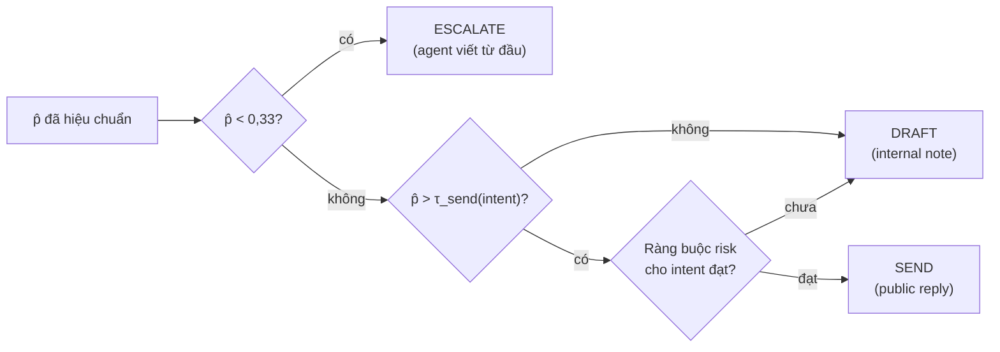
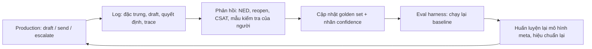

# Module 10 — Đánh giá RAG, confidence và escalation

> Thời lượng: ~45–55 phút · Mức độ: Nâng cao · Tiên quyết: Module 05, 06, 07 (Module 08, 09 giúp hiểu thêm)

Module này trả lời câu hỏi khó nhất của ticket gốc: **"AI tự đánh giá cần người can thiệp"** nghĩa là gì, đo bằng gì, và chọn ngưỡng thế nào để dám bật chế độ tự gửi. Nhưng để quyết định được, trước hết phải đo được: đo retrieval, đo câu trả lời, đo chính người chấm (kể cả LLM-judge), rồi đo trên production. Thứ tự các phần đi đúng theo chuỗi phụ thuộc đó.

## Mục tiêu học tập

Sau module này, bạn có thể:

- Tính tay và giải thích ý nghĩa của Precision@k, Recall@k, MRR, MAP, nDCG; chọn metric retrieval phù hợp với cách LLM tiêu thụ context.
- Định nghĩa và đo faithfulness, answer relevance, context precision/recall, citation precision/recall; hiểu giới hạn của từng thước đo.
- Thiết kế LLM-as-a-judge có rubric, nhận diện các bias, hiệu chuẩn judge với nhãn người bằng Cohen's kappa, sensitivity/specificity, và hiệu chỉnh tỷ lệ lỗi quan sát.
- Áp dụng thống kê cơ bản cho eval: khoảng tin cậy Wilson, cỡ mẫu, McNemar, bootstrap cặp, cận trên khi không quan sát thấy lỗi.
- Xây hệ thống quyết định SEND / DRAFT / ESCALATE: kết hợp tín hiệu confidence, hiệu chuẩn (ECE, temperature scaling, Platt), chọn ngưỡng theo chi phí và ràng buộc rủi ro trên đường cong risk–coverage.
- Thiết kế đánh giá online (shadow mode, A/B, KPI CS) và một eval harness chạy trong CI.

## 1. Vì sao đánh giá là xương sống của hệ thống RAG

Một hệ thống RAG có hàng chục "núm vặn": kích thước chunk, model embedding, $k$ của retriever, trọng số hybrid, reranker, prompt, model sinh, nhiệt độ, ngưỡng escalate. Mỗi núm tương tác với các núm khác. Không có đánh giá tự động, mọi thay đổi chỉ là cảm giác — và cảm giác thì thường sai theo hướng "ví dụ mình vừa thử chạy tốt hơn".

Ta chia đánh giá thành bốn tầng, mỗi tầng trả lời một câu hỏi khác nhau:

| Tầng | Câu hỏi | Ví dụ thước đo | Chạy khi nào |
|---|---|---|---|
| Thành phần (retrieval) | Context đưa vào có chứa bằng chứng cần thiết không? | Recall@k, nDCG@k, context precision | Mỗi lần đổi chunking, embedding, index, reranker |
| End-to-end (generation) | Câu trả lời có đúng, đủ, có căn cứ, đúng giọng không? | Faithfulness, correctness, citation, policy compliance | Mỗi lần đổi prompt, model, retrieval |
| Quyết định (decision) | Hệ thống có biết khi nào mình sai không? | Recall nhóm "cần người", ECE, risk tại coverage cho trước | Mỗi lần đổi bất kỳ thứ gì ở trên, và định kỳ |
| Online (business) | Khách hàng và team CS có được lợi thật không? | FRT, tỷ lệ tự giải quyết, reopen, CSAT, tỷ lệ sửa draft | Liên tục trên production |

Điểm cần nhấn mạnh: **tầng quyết định là tầng riêng**. Một hệ thống có thể trả lời đúng 85% câu hỏi (tầng end-to-end khá), nhưng nếu nó không phân biệt được 15% sai với 85% đúng thì không bao giờ được phép tự gửi. Ngược lại, một hệ thống chỉ đúng 70% nhưng biết chính xác 70% đó là những ticket nào thì có thể tự động hóa an toàn 70% lượng việc.

```mermaid
flowchart LR
    E[Email khách] --> C[Phân loại: intent, ngôn ngữ, muốn gặp người, injection]
    C --> R[Retrieval + rerank]
    R --> G[Sinh draft JSON]
    G --> V[Verify: groundedness, policy, câu hỏi chưa trả lời]
    V --> S[Tính confidence đã hiệu chuẩn]
    S --> D{Policy gate}
    D -->|p cao, intent cho phép| SEND[Gửi public reply]
    D -->|p trung bình| DRAFT[Internal note cho agent duyệt]
    D -->|quy tắc cứng hoặc p thấp| ESC[Escalate + thông báo CS]
    R -.đo.-> M1[Recall@k, nDCG]
    G -.đo.-> M2[Faithfulness, correctness]
    S -.đo.-> M3[ECE, risk-coverage]
    D -.đo.-> M4[FRT, CSAT, reopen]
```

> **Liên hệ Zendesk.** Đầu ra của Module 07 là một JSON có `customer_questions`, `claims` (mỗi claim kèm `source_ids`), `draft`, `unanswered_questions`, `escalate`, `escalate_reasons`, `confidence`, `note_for_agent`. Module này đánh giá **từng trường** đó: `claims` cho faithfulness và citation, `unanswered_questions` cho completeness, `escalate` cho tầng quyết định, và `confidence` — như Module 07 đã cảnh báo — chỉ là **một đặc trưng** trong mô hình confidence, không phải xác suất dùng thẳng làm ngưỡng.

## 2. Đánh giá retrieval

### 2.1 Ký hiệu

Với một truy vấn $q$, retriever trả về danh sách xếp hạng $L_q = (d_1, d_2, \dots, d_K)$. Gọi $\mathcal{R}_q$ là tập tài liệu (hoặc chunk) liên quan theo nhãn, và $\mathrm{rel}_i \in \{0,1\}$ cho biết $d_i$ có liên quan hay không. Với nhãn nhiều mức (graded), $\mathrm{rel}_i \in \{0,1,2,3\}$, ví dụ 3 = trả lời trọn vẹn, 2 = trả lời một phần, 1 = liên quan chủ đề, 0 = không liên quan.

Ví dụ xuyên suốt mục này. Khách hỏi: *"Làm sao xuất hóa đơn VAT cho kỳ tháng 9, và có đổi được thông tin công ty trên hóa đơn đã xuất không?"*. Ba chunk liên quan: $A$ (hướng dẫn xuất hóa đơn), $C$ (chính sách điều chỉnh hóa đơn), $F$ (FAQ thông tin pháp nhân). Retriever trả về top-5:

$$
L_q = (B, A, D, C, E), \qquad \mathrm{rel} = (0, 1, 0, 1, 0), \qquad |\mathcal{R}_q| = 3.
$$

### 2.2 Precision@k, Recall@k, Hit@k

$$
\mathrm{P@}k = \frac{1}{k}\sum_{i=1}^{k} \mathrm{rel}_i, \qquad
\mathrm{R@}k = \frac{1}{|\mathcal{R}_q|}\sum_{i=1}^{k} \mathrm{rel}_i, \qquad
\mathrm{Hit@}k = \mathbb{1}\Big[\sum_{i=1}^{k} \mathrm{rel}_i \ge 1\Big].
$$

Tính tay: $\mathrm{P@5} = 2/5 = 0{,}4$; $\mathrm{R@5} = 2/3 \approx 0{,}667$; $\mathrm{Hit@1} = 0$, $\mathrm{Hit@5} = 1$.

Trực giác: Precision đo "rác" trong context, Recall đo "thiếu" trong context. Với RAG, hai loại lỗi có hậu quả không đối xứng. Thiếu bằng chứng (recall thấp) gần như chắc chắn dẫn tới trả lời thiếu hoặc bịa. Thừa rác (precision thấp) làm tốn token và có thể gây nhiễu, nhưng LLM hiện đại thường chịu được vài chunk không liên quan. Vì vậy **Recall@k với $k$ bằng đúng số chunk thật sự đưa vào prompt** là metric retrieval quan trọng nhất trong RAG.

Lưu ý: ở ví dụ trên, $F$ không được lấy về. Nếu câu hỏi thứ hai của khách cần $F$, LLM sẽ không có căn cứ — đây đúng là tình huống mà trường `unanswered_questions` ở Module 07 phải bắt được.

### 2.3 MRR

Reciprocal Rank là nghịch đảo vị trí của tài liệu liên quan **đầu tiên**:

$$
\mathrm{RR}(q) = \frac{1}{\min\{i : \mathrm{rel}_i = 1\}}, \qquad \mathrm{MRR} = \frac{1}{|Q|}\sum_{q \in Q} \mathrm{RR}(q).
$$

Ở ví dụ: tài liệu liên quan đầu tiên ở vị trí 2 nên $\mathrm{RR} = 0{,}5$. MRR phù hợp khi chỉ cần **một** tài liệu đúng (FAQ một câu hỏi), không phù hợp với email nhiều câu hỏi cần nhiều tài liệu.

### 2.4 Average Precision và MAP

$$
\mathrm{AP}(q) = \frac{1}{|\mathcal{R}_q|} \sum_{i=1}^{K} \mathrm{P@}i \cdot \mathrm{rel}_i.
$$

Mỗi lần gặp một tài liệu liên quan, ta cộng precision tại vị trí đó; tài liệu liên quan không được lấy về đóng góp 0. Tính tay: tại $i=2$, $\mathrm{P@2} = 1/2$; tại $i=4$, $\mathrm{P@4} = 2/4$. Do đó

$$
\mathrm{AP} = \frac{0{,}5 + 0{,}5 + 0}{3} \approx 0{,}333.
$$

MAP là trung bình AP trên tập truy vấn. Giả sử có thêm hai truy vấn: $q_2$ có 1 tài liệu liên quan nằm ở vị trí 1 ($\mathrm{AP}=1$, $\mathrm{RR}=1$); $q_3$ có 1 tài liệu liên quan ở vị trí 2 ($\mathrm{AP}=0{,}5$, $\mathrm{RR}=0{,}5$). Khi đó

$$
\mathrm{MAP} = \frac{0{,}333 + 1 + 0{,}5}{3} \approx 0{,}611, \qquad \mathrm{MRR} = \frac{0{,}5 + 1 + 0{,}5}{3} \approx 0{,}667.
$$

AP phạt cả việc thiếu tài liệu ($F$) lẫn việc tài liệu đúng bị đẩy xuống thấp — hợp với email nhiều câu hỏi hơn MRR.

### 2.5 nDCG

Khi nhãn có nhiều mức, ta muốn tài liệu "rất liên quan" đứng trên tài liệu "hơi liên quan". Discounted Cumulative Gain:

$$
\mathrm{DCG@}k = \sum_{i=1}^{k} \frac{2^{\mathrm{rel}_i} - 1}{\log_2(i+1)}, \qquad
\mathrm{nDCG@}k = \frac{\mathrm{DCG@}k}{\mathrm{IDCG@}k},
$$

trong đó $\mathrm{IDCG@}k$ là DCG của thứ tự lý tưởng (sắp nhãn giảm dần). Tử số $2^{\mathrm{rel}}-1$ làm tài liệu mức 3 có giá trị gấp hơn hai lần mức 2; mẫu số $\log_2(i+1)$ giảm giá trị theo vị trí, mô phỏng việc "người đọc" (ở đây là LLM, xem lost-in-the-middle ở Module 02) chú ý ít hơn tới vị trí sau.

Ví dụ: top-5 có nhãn $(2, 3, 0, 1, 0)$; thứ tự lý tưởng là $(3, 2, 1, 0, 0)$. Hệ số chiết khấu: vị trí 1 → 1; vị trí 2 → $1/\log_2 3 \approx 0{,}6309$; vị trí 3 → $0{,}5$; vị trí 4 → $1/\log_2 5 \approx 0{,}4307$.

$$
\mathrm{DCG@5} = 3\cdot 1 + 7 \cdot 0{,}6309 + 0 + 1 \cdot 0{,}4307 + 0 \approx 7{,}847
$$

$$
\mathrm{IDCG@5} = 7 \cdot 1 + 3 \cdot 0{,}6309 + 1 \cdot 0{,}5 \approx 9{,}393, \qquad \mathrm{nDCG@5} \approx \frac{7{,}847}{9{,}393} \approx 0{,}835.
$$

Chỉ cần hoán đổi hai tài liệu đầu (để tài liệu mức 3 lên vị trí 1) là nDCG tăng đáng kể — nDCG nhạy với **thứ tự ở đầu danh sách**, nên nó là metric tự nhiên để đánh giá reranker (Module 06).

### 2.6 Context precision kiểu RAGAS

RAGAS định nghĩa context precision có trọng số theo vị trí, với $v_k \in \{0,1\}$ là nhãn liên quan:

$$
\mathrm{CP@}K = \frac{\sum_{k=1}^{K} \mathrm{P@}k \cdot v_k}{\sum_{k=1}^{K} v_k}.
$$

Khác với AP, mẫu số là **số tài liệu liên quan có trong top-$K$**, không phải tổng số tài liệu liên quan. Ở ví dụ $(B, A, D, C, E)$: $\mathrm{CP@5} = (0{,}5 + 0{,}5)/2 = 0{,}5$, trong khi AP là 0,333 vì AP còn phạt việc thiếu $F$. Nói cách khác, context precision đo **chất lượng thứ tự** của những gì đã lấy về; muốn đo **độ đủ** phải dùng context recall (mục 3.2).

### 2.7 Lấy nhãn liên quan từ đâu

Đây là chỗ hầu hết dự án vấp. Ba nguồn thực tế cho bài toán Zendesk:

1. **Tín hiệu có sẵn trong lịch sử ticket.** Ticket đã giải quyết thường có dấu vết: agent dùng macro nào, chèn link bài Help Center nào, ticket được gắn tag sản phẩm nào. Một bài Help Center được agent dán link trong câu trả lời là nhãn "liên quan" khá tin cậy cho câu hỏi đầu tiên của khách. Rẻ, nhiều, nhưng **thiếu** (agent có thể trả lời từ trí nhớ, không dán link).
2. **Pooling + gán nhãn.** Chạy vài retriever khác nhau (BM25, dense, hybrid), gộp top-10 của mỗi cái thành một "pool", rồi gán nhãn pool đó (bằng người hoặc LLM có kiểm chứng). Đây là cách các benchmark IR kinh điển như TREC làm. Nhược điểm: tài liệu liên quan mà **không retriever nào** lấy được sẽ không bao giờ được gán nhãn, nên recall đo được luôn là cận trên của recall thật.
3. **Nhãn tổng hợp.** Chọn một chunk, cho LLM sinh câu hỏi mà chunk đó trả lời (cách làm của Module 09 để tạo dữ liệu fine-tune). Rẻ và có nhãn chắc chắn, nhưng câu hỏi tổng hợp thường "sạch" hơn email thật: ít lỗi chính tả, không lẫn ngôn ngữ, không có chữ ký và quoted reply. Đừng chỉ đánh giá trên dữ liệu tổng hợp.

> **Khuyến nghị thực tế.** Bắt đầu với 300–500 truy vấn thật lấy từ email (đã làm sạch theo Module 04), gán nhãn bằng pooling: LLM gán nhãn trước, người kiểm tra lại toàn bộ nhãn "liên quan" và 10–20% nhãn "không liên quan". Đo Recall@k với $k$ là số chunk thực sự đưa vào prompt, và nDCG@10 cho reranker. Ghi lại tách theo ngôn ngữ (vi/en/ja) — rất thường gặp trường hợp recall trung bình tốt nhưng tiếng Nhật kém hẳn.

## 3. Đánh giá generation

### 3.1 Các chiều chất lượng của một email trả lời

Một draft "tốt" trong bài toán CS phải thỏa nhiều chiều cùng lúc, và mỗi chiều cần một cách đo khác nhau:

| Chiều | Định nghĩa | Cách đo khả thi |
|---|---|---|
| Faithfulness / groundedness | Mọi khẳng định đều được context hỗ trợ | Tách claim + kiểm tra NLI/LLM-judge với context |
| Correctness | Nội dung đúng so với đáp án chuẩn (của agent giỏi) | So với reference bằng LLM-judge có rubric |
| Completeness | Trả lời đủ mọi câu hỏi trong email | Đối chiếu `customer_questions` với câu hỏi gán nhãn |
| Answer relevance | Trả lời đúng điều khách hỏi, không lan man | Embedding hoặc judge |
| Citation quality | Trích dẫn đúng nguồn, không thiếu, không thừa | Citation precision/recall |
| Policy compliance | Không hứa hoàn tiền, không báo giá ngoài nguồn, không lộ dữ liệu | Kiểm tra tất định (regex, danh sách cấm) + judge |
| Style & language | Đúng ngôn ngữ, đúng mức lịch sự (keigo, "anh/chị") | Detector ngôn ngữ + judge theo rubric |

Hai chiều đầu hay bị nhầm lẫn. **Faithfulness đo quan hệ giữa câu trả lời và context**, không đo đúng/sai so với thế giới. Một câu trả lời có thể hoàn toàn faithful mà vẫn sai, nếu context lỗi thời (bài Help Center chưa cập nhật giá mới). Ngược lại, một câu trả lời đúng sự thật nhưng lấy từ "trí nhớ" của model là **không faithful** — và trong CS, điều đó vẫn là lỗi, vì không kiểm soát được nguồn.

### 3.2 Các metric kiểu RAGAS

RAGAS (Es et al., 2023) phổ biến bộ metric "không cần đáp án chuẩn" cho phần sinh. Ký hiệu: $q$ là câu hỏi, $c$ là context, $a$ là câu trả lời, $g$ là đáp án chuẩn (nếu có).

**Faithfulness.** Dùng LLM tách $a$ thành tập claim nguyên tử $S(a)$, rồi kiểm tra từng claim có suy ra được từ $c$ không:

$$
\mathrm{Faithfulness}(a, c) = \frac{|\{s \in S(a) : c \models s\}|}{|S(a)|}.
$$

Ví dụ: draft có 5 claim, 4 claim được context hỗ trợ, 1 claim ("hoàn tiền trong 3–5 ngày làm việc") không có trong nguồn. Faithfulness $= 4/5 = 0{,}8$. Ở bài toán CS, **một** claim không có căn cứ về chính sách đã đủ để không được gửi, nên ngoài trung bình ta luôn theo dõi tỷ lệ draft có faithfulness $< 1$.

**Answer relevance.** Cho LLM sinh $N$ câu hỏi $q_1, \dots, q_N$ mà câu trả lời $a$ đang trả lời, rồi đo độ gần với câu hỏi gốc:

$$
\mathrm{AR}(q, a) = \frac{1}{N}\sum_{i=1}^{N} \cos\big(E(q), E(q_i)\big).
$$

Ví dụ $N=3$ với cosine 0,92; 0,88; 0,71 cho $\mathrm{AR} \approx 0{,}837$. Câu hỏi sinh ra thứ ba lệch hẳn thường là dấu hiệu draft có một đoạn lan man. Metric này phụ thuộc mạnh vào model embedding và **không** bắt được câu trả lời sai mà vẫn đúng chủ đề.

**Context recall.** Cần đáp án chuẩn $g$. Tách $g$ thành các câu/claim, kiểm tra từng câu có quy được về context không:

$$
\mathrm{CR}(g, c) = \frac{|\{s \in S(g) : c \models s\}|}{|S(g)|}.
$$

Đáp án chuẩn có 4 claim, 3 claim có trong context: $\mathrm{CR} = 0{,}75$. Nghĩa là dù model sinh hoàn hảo, nó vẫn không thể đạt đáp án chuẩn mà không bịa — lỗi nằm ở retrieval, không phải ở prompt.

> **Cách đọc kết hợp.** Context recall thấp → sửa retrieval (Module 05–06). Context recall cao mà faithfulness thấp → model bịa, sửa prompt/model (Module 07). Faithfulness cao mà correctness thấp → context sai hoặc lỗi thời, sửa dữ liệu (Module 04). Ba metric này cùng nhau cho ta **chẩn đoán vị trí lỗi**, giá trị hơn nhiều so với một điểm tổng.

### 3.3 Citation precision và citation recall

Theo hướng của ALCE (Gao et al., 2023), với mỗi câu $s$ trong câu trả lời có tập trích dẫn $C_s$:

- **Citation recall** của câu $s$ bằng 1 nếu ghép các đoạn trong $C_s$ lại thì suy ra được $s$. Citation recall của câu trả lời là trung bình trên các câu.
- **Citation precision**: một trích dẫn $c \in C_s$ được coi là "không cần thiết" nếu bỏ nó đi mà các trích dẫn còn lại vẫn đủ hỗ trợ $s$, và chính nó một mình không hỗ trợ $s$. Precision là tỷ lệ trích dẫn không bị coi là thừa.

Ví dụ: draft có 4 câu chứa thông tin; 3 câu được trích dẫn đủ hỗ trợ, 1 câu trích [S3] nhưng S3 không nói điều đó → citation recall $= 3/4$. Có 5 trích dẫn tổng cộng, 1 trích dẫn thừa → citation precision $= 4/5$.

Ở hệ thống của ta, trường `claims[].source_ids` cho phép kiểm tra này **ngay trong pipeline** (bước verify của Module 07), không chỉ lúc đánh giá offline. Khác biệt duy nhất: offline ta dùng judge mạnh và chậm, online dùng model NLI nhỏ hoặc judge rẻ.

### 3.4 Đánh giá có đáp án chuẩn

Với email CS, đáp án chuẩn không phải một chuỗi duy nhất: nhiều cách viết khác nhau đều đúng. Do đó exact match hay BLEU/ROUGE gần như vô dụng. Hai cách hợp lý:

1. **So khớp theo "điểm thông tin bắt buộc".** Với mỗi ticket trong golden set, người gán nhãn ghi các *must-have facts* (ví dụ "đường dẫn Cài đặt > Thanh toán > Hóa đơn", "không tự hứa hoàn tiền") và *must-not* (ví dụ "không báo số ngày xử lý"). Judge chỉ cần trả lời có/không cho từng mục — dễ, nhất quán và giải thích được.
2. **Judge so sánh với câu trả lời của agent.** Hữu ích cho văn phong, nhưng lệ thuộc vào chất lượng câu trả lời lịch sử; agent cũng có lúc trả lời sai.

Cách 1 nên là mặc định: nó biến một đánh giá mơ hồ thành nhiều câu hỏi nhị phân, mỗi câu dễ kiểm định với người.

### 3.5 Khi nhãn người ít mà đầu ra nhiều: Prediction-Powered Inference

Giả sử ta có $N = 5.000$ draft đã được judge chấm, nhưng chỉ $n = 300$ draft có nhãn người. Nếu chỉ dùng 300 nhãn người, khoảng tin cậy rộng. Nếu chỉ dùng judge, kết quả bị lệch theo sai số của judge. ARES (Saad-Falcon et al., 2023) dùng **prediction-powered inference** (Angelopoulos et al., 2023) để kết hợp hai nguồn:

$$
\hat\theta_{\mathrm{PP}} = \underbrace{\frac{1}{N}\sum_{j=1}^{N} f(\tilde x_j)}_{\text{trung bình judge trên tập lớn}} \;-\; \underbrace{\frac{1}{n}\sum_{i=1}^{n} \big(f(x_i) - y_i\big)}_{\text{độ lệch của judge, ước lượng trên tập có nhãn}},
$$

với $f(\cdot) \in \{0,1\}$ là phán quyết của judge và $y_i$ là nhãn người.

Ví dụ: judge cho tỷ lệ đạt 0,88 trên 5.000 draft; trên 300 draft có nhãn, judge cho 0,89 còn người cho 0,84, nên độ lệch là $+0{,}05$. Ước lượng hiệu chỉnh: $\hat\theta = 0{,}88 - 0{,}05 = 0{,}83$.

Phương sai xấp xỉ là $\mathrm{Var}(f)/N + \mathrm{Var}(f - y)/n$. Khi judge tương quan tốt với người, $f - y$ hầu như bằng 0 nên số hạng thứ hai nhỏ, và khoảng tin cậy hẹp hơn đáng kể so với chỉ dùng 300 nhãn người. Khi judge tệ, phương pháp vẫn **không lệch** — chỉ là không được lợi về độ hẹp.

## 4. LLM-as-a-judge

### 4.1 Hai kiểu chấm

- **Pointwise:** judge nhận (email, context, draft, rubric) và cho điểm hoặc phán quyết đạt/không đạt. Dùng cho regression test và giám sát.
- **Pairwise:** judge nhận hai draft A, B và chọn draft tốt hơn. Nhạy hơn khi so hai phiên bản prompt/model gần nhau, nhưng không cho biết "đủ tốt để gửi chưa".

Zheng et al. (2023) cho thấy judge mạnh có mức đồng thuận với người tương đương mức đồng thuận giữa hai người, đồng thời chỉ ra ba bias kinh điển:

| Bias | Biểu hiện | Giảm thiểu |
|---|---|---|
| Position bias | Pairwise: ưu tiên phương án đứng trước (hoặc sau) | Chấm hai lần với thứ tự đổi chỗ; chỉ tính khi hai lần nhất quán |
| Verbosity bias | Ưu tiên câu trả lời dài hơn | Rubric phạt nội dung thừa; kiểm soát độ dài; chấm theo checklist thay vì ấn tượng chung |
| Self-enhancement | Ưu tiên câu trả lời do chính model cùng họ sinh ra | Judge khác họ model với generator; đối chiếu với nhãn người |

Ngoài ra, trong CS còn hai bias đáng chú ý: judge **dễ dãi với văn phong lịch sự** (một email trau chuốt nhưng hứa sai chính sách vẫn được điểm cao), và judge **kém hơn ở tiếng Nhật/tiếng Việt** so với tiếng Anh. Cả hai chỉ phát hiện được bằng cách đo đồng thuận với người **theo từng ngôn ngữ**.

### 4.2 Thiết kế rubric cho email CS

Nguyên tắc: chia nhỏ thành câu hỏi nhị phân có tiêu chí rõ ràng, yêu cầu judge trích bằng chứng trước khi kết luận, xuất JSON.

```text
You are auditing a customer-support email draft. Use ONLY the provided
sources and the labeled checklist. For each item answer PASS or FAIL and
quote the exact span of the draft you relied on.

Checklist:
1. GROUNDED: every factual statement in the draft is supported by a source.
2. COMPLETE: every question in <customer_questions> is answered or
   explicitly handed off to a human.
3. NO_FORBIDDEN_PROMISE: the draft does not promise refunds, discounts,
   deadlines, or actions not stated in the sources.
4. MUST_HAVE: all facts in <must_have> appear (paraphrase allowed).
5. LANGUAGE: the draft is in <expected_language> with appropriate
   politeness.
6. CITATIONS: each factual sentence cites at least one correct source id.

Return JSON: {"items": [{"id": 1, "verdict": "PASS|FAIL",
"evidence": "..."}], "overall": "PASS|FAIL"}
overall = PASS only if items 1, 2, 3 all PASS.
```

Chú ý dòng cuối: quy tắc tổng hợp được **định nghĩa tất định**, không để judge tự cân nhắc. Đó là cách giữ cho kết quả nhất quán giữa các lần chạy.

### 4.3 Đo độ tin cậy của judge: Cohen's kappa

Lấy 200 draft, cho cả người và judge chấm PASS/FAIL:

| | Judge PASS | Judge FAIL | Tổng |
|---|---|---|---|
| Người PASS | 140 | 10 | 150 |
| Người FAIL | 20 | 30 | 50 |
| Tổng | 160 | 40 | 200 |

Tỷ lệ đồng thuận quan sát: $p_o = (140 + 30)/200 = 0{,}85$. Nghe có vẻ cao, nhưng nếu hai bên chấm ngẫu nhiên theo tỷ lệ biên của mình thì vẫn trùng khá nhiều:

$$
p_e = \underbrace{0{,}75 \times 0{,}80}_{\text{cùng PASS}} + \underbrace{0{,}25 \times 0{,}20}_{\text{cùng FAIL}} = 0{,}65.
$$

Cohen's kappa đo phần đồng thuận vượt trên mức ngẫu nhiên:

$$
\kappa = \frac{p_o - p_e}{1 - p_e} = \frac{0{,}85 - 0{,}65}{0{,}35} \approx 0{,}57.
$$

Mức 0,57 thường được xếp vào loại "vừa phải". Quan trọng hơn kappa là **judge bắt được bao nhiêu lỗi thật**. Coi FAIL là "phát hiện lỗi":

- Sensitivity (bắt được lỗi): $\mathrm{Se} = 30/50 = 0{,}60$ — judge bỏ sót 40% draft lỗi.
- Specificity (không báo nhầm): $\mathrm{Sp} = 140/150 \approx 0{,}933$.

Với judge này, dùng nó làm **cổng an toàn trước khi gửi** là không đủ; dùng để **theo dõi xu hướng** thì vẫn được, miễn là hiệu chỉnh.

### 4.4 Hiệu chỉnh tỷ lệ lỗi quan sát (Rogan–Gladen)

Trên production, judge báo 12% draft FAIL. Tỷ lệ lỗi thật $\pi$ là bao nhiêu? Tỷ lệ FAIL quan sát là

$$
p_{\mathrm{obs}} = \mathrm{Se}\cdot \pi + (1 - \mathrm{Sp})(1 - \pi) \;\Longrightarrow\; \pi = \frac{p_{\mathrm{obs}} + \mathrm{Sp} - 1}{\mathrm{Se} + \mathrm{Sp} - 1}.
$$

Thay số: $\pi = (0{,}12 + 0{,}933 - 1)/(0{,}60 + 0{,}933 - 1) = 0{,}053/0{,}533 \approx 0{,}099$. Tức là khoảng 10% draft thật sự lỗi. Công thức này chỉ đúng khi Se và Sp ổn định giữa tập hiệu chuẩn và production — một giả định cần kiểm tra lại mỗi khi đổi judge, đổi prompt judge, hoặc khi phân bố intent thay đổi.

### 4.5 Danh sách kiểm tra khi dùng judge

1. Judge **khác họ model** với generator, hoặc ít nhất khác prompt và nhiệt độ 0.
2. Đo kappa, Se, Sp **riêng cho từng ngôn ngữ và nhóm intent** trên tối thiểu 100–200 mẫu mỗi nhóm.
3. Đổi chỗ A/B trong pairwise; bỏ các cặp không nhất quán.
4. Bắt judge trích bằng chứng; kiểm tra ngẫu nhiên bằng chứng có thật sự nằm trong draft.
5. Cố định phiên bản judge (model + prompt) như một **artifact có version**; đổi judge thì phải đo lại toàn bộ baseline.
6. Không dùng judge một mình cho quyết định có hậu quả lớn (gửi email về chính sách); kết hợp với kiểm tra tất định.

## 5. Golden dataset từ lịch sử ticket

### 5.1 Thành phần

Golden set là "bài thi chuẩn" mà mọi phiên bản hệ thống phải làm lại. Nó phải phản ánh **phân bố thật** của ticket và **cố ý dư thừa** ở những chỗ nguy hiểm. Với giả định ~200.000 ticket đã giải quyết, một cách lấy mẫu hợp lý:

| Nhóm | Mô tả | Gợi ý số lượng |
|---|---|---|
| FAQ trả lời được | Câu hỏi thao tác, tính năng, có bài Help Center/macro tương ứng | 40% |
| Nhiều câu hỏi | Một email 2–4 câu hỏi, có câu không có trong nguồn | 10% |
| Không trả lời được | Không có nguồn phù hợp → phải abstain | 10% |
| Chính sách nhạy cảm | Hoàn tiền, báo giá, hủy gói, pháp lý → phải escalate | 15% |
| Muốn gặp người | Tường minh hoặc ngầm ("tôi đã hỏi 3 lần rồi") | 10% |
| Tấn công / bất thường | Prompt injection, email giả mạo, nội dung độc hại | 5% |
| Đa ngôn ngữ khó | Tiếng Nhật kính ngữ, email trộn Việt–Anh, có ảnh chụp lỗi | 10% |

Mỗi nhóm lại phân tầng theo ngôn ngữ (vi/en/ja). Với 3 ngôn ngữ × 7 nhóm = 21 tầng, mục tiêu tối thiểu 30–50 mẫu/tầng → khoảng 800–1.000 mẫu cho phiên bản đầu. Con số này đến từ mục 6: dưới ~30 mẫu, khoảng tin cậy của một tỷ lệ quá rộng để ra quyết định.

### 5.2 Schema một test case

```json
{
  "id": "gs-0412",
  "version": 3,
  "source": "ticket_history",
  "language": "vi",
  "strata": ["policy_sensitive", "multi_question"],
  "email": "…email đã làm sạch, đã che PII…",
  "conversation_summary": "",
  "gold_relevant_chunks": ["hc-1203#2", "macro-77"],
  "customer_questions": ["Có được hoàn tiền không?", "Xuất hóa đơn VAT ở đâu?"],
  "must_have": ["đường dẫn Cài đặt > Thanh toán > Hóa đơn"],
  "must_not": ["hứa hoàn tiền", "nêu số ngày xử lý cụ thể"],
  "expected_decision": "ESCALATE",
  "expected_reasons": ["policy_sensitive"],
  "notes": "Khách gia hạn 8 ngày trước — vẫn không được tự hứa."
}
```

Trường `expected_decision` biến golden set thành bộ kiểm tra cho **tầng quyết định**, không chỉ cho chất lượng văn bản.

### 5.3 Rò rỉ dữ liệu (leakage)

Nếu ticket lịch sử vừa nằm trong index (làm nguồn tri thức, Module 04) vừa nằm trong golden set, retriever sẽ tìm ra chính ticket đó và hệ thống trông giỏi một cách giả tạo. Ba quy tắc:

1. **Chia theo thời gian**: index dùng ticket trước ngày $T$, golden set lấy ticket sau $T$. Điều này cũng mô phỏng đúng thực tế: hệ thống luôn trả lời câu hỏi "tương lai".
2. Loại khỏi index mọi ticket cùng **thread** hoặc cùng **khách hàng trong cùng tuần** với test case.
3. Câu hỏi tổng hợp sinh từ chunk $X$ thì không dùng để đánh giá retrieval của chính chunk $X$ mà không ghi chú rõ.

### 5.4 Bảo trì

Golden set không đứng yên. Mỗi tuần: lấy các ticket mà agent sửa nhiều hoặc bỏ draft, các ticket bị reopen sau khi AI gửi, các ticket khách đánh giá CSAT xấu → gán nhãn → thêm vào golden set (phiên bản mới). Theo thời gian, golden set trở thành **bộ nhớ các lỗi đã từng gặp**, và regression test bảo đảm không mắc lại.

## 6. Thống kê tối thiểu cho người làm eval

### 6.1 Khoảng tin cậy của một tỷ lệ

Nếu 180/200 draft đạt ($\hat p = 0{,}9$), độ lệch chuẩn ước lượng là $\sqrt{\hat p(1-\hat p)/n} = \sqrt{0{,}09/200} \approx 0{,}0212$. Khoảng tin cậy 95% xấp xỉ chuẩn: $0{,}9 \pm 1{,}96 \times 0{,}0212 \approx [0{,}858;\ 0{,}942]$.

Khoảng xấp xỉ chuẩn kém chính xác khi $\hat p$ gần 0 hoặc 1 — chính là vùng ta quan tâm (tỷ lệ lỗi nhỏ). Nên dùng **khoảng Wilson**:

$$
\frac{\hat p + \frac{z^2}{2n}}{1 + \frac{z^2}{n}} \;\pm\; \frac{z}{1 + \frac{z^2}{n}}\sqrt{\frac{\hat p (1-\hat p)}{n} + \frac{z^2}{4n^2}}.
$$

Với $\hat p = 0{,}9$, $n = 200$, $z = 1{,}96$: tâm $\approx 0{,}8925$, nửa độ rộng $\approx 0{,}0419$, khoảng $\approx [0{,}851;\ 0{,}934]$. Tâm bị kéo về 0,5 một chút — đó là sự "thận trọng" có chủ đích của Wilson.

**Bài học:** với 200 mẫu, "phiên bản mới đạt 91% so với 89% của phiên bản cũ" **không** nói lên điều gì; hai khoảng tin cậy chồng lấn gần hết.

### 6.2 Cần bao nhiêu mẫu?

Muốn ước lượng tỷ lệ $p$ với sai số $\pm E$ ở mức tin cậy 95%:

$$
n \approx \frac{z^2\, p(1-p)}{E^2}.
$$

Với $p \approx 0{,}9$ và $E = 0{,}03$: $n \approx 3{,}8416 \times 0{,}09 / 0{,}0009 \approx 385$. Muốn $E = 0{,}03$ **cho từng ngôn ngữ** thì cần ~385 mẫu mỗi ngôn ngữ. Đây là lý do golden set ~1.000 mẫu là mức tối thiểu chứ không phải xa xỉ.

### 6.3 So sánh hai phiên bản trên cùng tập: McNemar

Khi hai hệ thống A, B chạy trên **cùng** 300 test case, các kết quả là cặp, không độc lập. Chỉ các case mà hai hệ thống bất đồng mới mang thông tin:

| | B đúng | B sai |
|---|---|---|
| A đúng | 250 | $b = 18$ |
| A sai | $c = 7$ | 25 |

Kiểm định McNemar (có hiệu chỉnh liên tục):

$$
\chi^2 = \frac{(|b - c| - 1)^2}{b + c} = \frac{(11 - 1)^2}{25} = 4{,}0,
$$

với 1 bậc tự do cho $p \approx 0{,}046$. Kiểm định nhị thức chính xác ($X \sim \mathrm{Bin}(25; 0{,}5)$, xét $X \le 7$, hai phía) cho $p \approx 0{,}043$. Kết luận: A tốt hơn B có ý nghĩa ở mức 5%, dù chênh lệch tổng chỉ $11/300 \approx 3{,}7$ điểm phần trăm. Kiểm định cặp nhạy hơn nhiều so với so sánh hai tỷ lệ độc lập vì nó loại bỏ phương sai do "độ khó của từng câu".

### 6.4 Bootstrap cặp cho metric bất kỳ

Với metric liên tục (nDCG, faithfulness trung bình) hoặc metric phức tạp (ECE), dùng bootstrap: lấy mẫu lại có hoàn lại **các test case** (giữ nguyên cặp A–B trong mỗi case), tính chênh lệch, lặp nhiều lần.

```python
import numpy as np

def paired_bootstrap(scores_a, scores_b, n_boot=10_000, seed=0):
    """Khoảng tin cậy 95% cho mean(A) - mean(B) trên cùng tập test case."""
    rng = np.random.default_rng(seed)
    a, b = np.asarray(scores_a, float), np.asarray(scores_b, float)
    n = len(a)
    diffs = np.empty(n_boot)
    for i in range(n_boot):
        idx = rng.integers(0, n, n)          # lấy lại chỉ số test case
        diffs[i] = a[idx].mean() - b[idx].mean()
    lo, hi = np.percentile(diffs, [2.5, 97.5])
    p_le_0 = (diffs <= 0).mean()             # xác suất bootstrap A không tốt hơn B
    return a.mean() - b.mean(), (lo, hi), p_le_0
```

Nếu khoảng tin cậy không chứa 0, ta có bằng chứng cho sự khác biệt. Lưu ý: nếu golden set có nhiều test case cùng một khách hàng hoặc cùng một bài Help Center, nên bootstrap theo **cụm** (lấy lại cả cụm) để không đánh giá thấp phương sai.

### 6.5 Khi chưa thấy lỗi nào: cận trên của tỷ lệ lỗi

Câu hỏi thường gặp trước khi bật tự gửi: "chạy shadow 150 ticket nhóm `how_to` mà chưa thấy lỗi nào — tỷ lệ lỗi thật có thể là bao nhiêu?". Nếu tỷ lệ lỗi là $r$, xác suất không thấy lỗi nào trong $n$ lần là $(1-r)^n$. Đặt bằng 0,05 và giải:

$$
r_{\max} = 1 - 0{,}05^{1/n} \approx \frac{3}{n} \quad(\text{"quy tắc số 3"}).
$$

Với $n = 150$: $r_{\max} = 1 - 0{,}05^{1/150} \approx 0{,}0198$. Vậy 150 ticket không lỗi cho phép khẳng định (95%) tỷ lệ lỗi dưới khoảng 2%. Muốn khẳng định dưới 1% cần ~300 ticket không lỗi.

Nếu có lỗi, dùng cận trên Clopper–Pearson hoặc Wilson. Ví dụ 2 lỗi trên 300 ticket ($\hat r \approx 0{,}67\%$) cho cận trên 95% khoảng **2,4%** — tức là **chưa** đạt ràng buộc 2%, dù tỷ lệ quan sát thấp hơn nhiều. Tỷ lệ quan sát thấp chưa đủ; cái cần vượt qua là **cận trên**.

### 6.6 Bẫy khi gộp nhiều tầng

Giả sử phiên bản mới tốt hơn ở cả tiếng Việt và tiếng Nhật, nhưng golden set phiên bản mới có tỷ lệ tiếng Nhật cao hơn (tiếng Nhật khó hơn), khiến điểm tổng **giảm**. Đây là nghịch lý Simpson. Cách tránh: luôn báo cáo theo tầng, và tính điểm tổng có trọng số **theo phân bố production** (trọng số cố định), không theo phân bố ngẫu nhiên của golden set.

Khi báo cáo 21 tầng cùng lúc, sẽ có vài tầng "giảm có ý nghĩa" do ngẫu nhiên. Dùng ngưỡng chặt hơn (ví dụ hiệu chỉnh Bonferroni $\alpha/m$) cho cảnh báo tự động, và xem tầng bất thường như tín hiệu để điều tra, không phải kết luận.

## 7. Confidence và escalation: khi nào AI phải gọi người

Đây là phần trả lời trực tiếp yêu cầu thứ hai của ticket. Ta tách nó thành hai bài toán khác nhau về bản chất:

1. **Escalate theo yêu cầu hoặc theo quy tắc** — khách muốn gặp người, intent nhạy cảm, nghi ngờ injection. Đây là bài toán **phân loại** trên email đầu vào; đáp án đúng/sai được định nghĩa rõ ràng.
2. **Escalate vì AI không chắc** — AI tự đánh giá đầu ra của chính nó. Đây là bài toán **ước lượng độ bất định** và **dự đoán có chọn lọc** (selective prediction).

Module 12 (mục 8) biến hai lớp này thành bảng quy tắc cứng H1–H10 và hàm `decide()`. Ở đây ta xây nền tảng định lượng cho chúng.

### 7.1 Hình thức hóa: dự đoán có chọn lọc

Gọi $f(x)$ là draft hệ thống sinh cho ticket $x$, $y(x) \in \{0, 1\}$ là việc draft đó có chấp nhận được hay không (1 = đúng, đủ, an toàn để gửi). Một **hàm chọn** $g(x) \in \{0, 1\}$ quyết định có gửi ($g=1$) hay không. Hai đại lượng (Geifman & El-Yaniv, 2017):

$$
\text{coverage}(g) = \mathbb{E}[g(x)], \qquad
\text{risk}(f, g) = \frac{\mathbb{E}\big[(1 - y(x))\, g(x)\big]}{\mathbb{E}[g(x)]}.
$$

Coverage là tỷ lệ ticket được tự gửi (lợi ích tự động hóa). Risk là tỷ lệ sai **trong số đã gửi** (chi phí). Thông thường $g(x) = \mathbb{1}[\hat p(x) \ge \tau]$ với $\hat p(x)$ là điểm confidence và $\tau$ là ngưỡng. Toàn bộ mục 7 xoay quanh hai câu hỏi: **làm sao có $\hat p$ tốt** (7.3–7.5), và **chọn $\tau$ thế nào** (7.6–7.7).

Một điểm then chốt: thứ ta cần là **xếp hạng tốt** (ticket nào chắc hơn ticket nào) **và** **hiệu chuẩn tốt** (khi $\hat p = 0{,}9$ thì thật sự đúng khoảng 90%). Xếp hạng tốt quyết định đường cong risk–coverage đẹp đến đâu; hiệu chuẩn tốt quyết định ta có đọc được ngưỡng theo chi phí hay không.

### 7.2 Lớp 1: escalate theo yêu cầu và quy tắc

"Khách muốn gặp người" nghe dễ, nhưng dữ liệu thật có nhiều dạng:

- Tường minh: "cho tôi nói chuyện với nhân viên", "please escalate to a human", 「担当者と話したい」.
- Ngầm: "tôi đã hỏi ba lần rồi", "bot trả lời không hiểu gì cả", "gọi lại cho tôi số …".
- Gây nhiễu: "nhân viên của bên tôi không đăng nhập được" (có chữ "nhân viên" nhưng không muốn gặp người).

Vì vậy nên dùng **bộ phân loại** (LLM nhỏ hoặc classifier fine-tune trên ticket lịch sử) kết hợp danh sách cụm từ cho tiếng Việt, Anh, Nhật — và đo nó như một classifier, ưu tiên **recall**.

Ví dụ trên 1.000 ticket golden, 180 ticket thật sự phải escalate theo lớp 1:

| | Dự đoán escalate | Dự đoán không |
|---|---|---|
| Thật sự cần escalate (180) | TP = 171 | FN = 9 |
| Không cần (820) | FP = 59 | TN = 761 |

Recall $= 171/180 = 0{,}95$; precision $= 171/230 \approx 0{,}74$. Với 1.500 ticket/ngày và tỷ lệ tương tự, mỗi ngày có khoảng 13–14 ticket đáng ra phải chuyển người nhưng bị bỏ sót, và khoảng 89 ticket bị chuyển người không cần thiết. Hai loại lỗi có giá rất khác nhau: bỏ sót một khách đòi gặp người → khách bực, có thể leo thang; chuyển thừa → tốn vài phút agent.

Hạ ngưỡng classifier có thể đưa recall lên 0,99 nhưng số ticket bị gắn cờ tăng, ví dụ lên 320/1.000. Đánh đổi này phải được **team CS** quyết định cùng kỹ thuật (đây chính là một phần của subtask "Business").

> **Phòng thủ nhiều lớp.** 9 ticket bị lớp 1 bỏ sót không đi thẳng ra khách: chúng vẫn phải qua lớp 2 (confidence gate) và kiểm tra policy (H7). Một ticket "khách bực vì hỏi ba lần" thường cũng có confidence thấp vì vấn đề chưa được giải quyết bằng nguồn hiện có. Thiết kế tốt là thiết kế mà **một lớp hỏng không đủ gây hại**.

### 7.3 Lớp 2: các tín hiệu confidence

Không có một tín hiệu đơn lẻ nào đủ tốt. Dưới đây là các họ tín hiệu, cùng ưu nhược điểm.

**(a) Tín hiệu retrieval.**
- Điểm reranker của chunk tốt nhất $s_1$; khoảng cách $s_1 - s_2$; số chunk có điểm trên ngưỡng.
- Tỷ lệ câu hỏi trong email có ít nhất một chunk liên quan.

Trực giác: nếu không tìm thấy bằng chứng tốt thì không thể trả lời tốt. Tín hiệu này rẻ, có trước khi sinh, và là cơ sở cho quy tắc H6 (abstain sớm). Nhược: retrieval tốt chưa chắc câu trả lời tốt.

**(b) Xác suất token.** Với chuỗi đầu ra $a = (t_1, \dots, t_L)$:

$$
\log p(a \mid x) = \sum_{l=1}^{L} \log p(t_l \mid t_{<l}, x), \qquad
\bar\ell = \frac{1}{L}\sum_{l=1}^{L} \log p(t_l \mid t_{<l}, x).
$$

Tổng log-xác suất giảm tuyến tính theo độ dài nên phải chuẩn hóa: ví dụ $\bar\ell = -0{,}15$ tương ứng xác suất trung bình mỗi token $e^{-0{,}15} \approx 0{,}86$. Hữu ích hơn là **các token quan trọng**: xác suất của token `true`/`false` ở trường `escalate`, hoặc xác suất thấp nhất trong các token thuộc phần claim. Nhược: nhiều API không trả logprob cho mọi model; logprob phản ánh độ chắc về **cách diễn đạt** nhiều hơn về **nội dung** — có nhiều cách nói cùng một ý đúng, làm xác suất từng cách bị chia nhỏ.

**(c) Confidence tự khai (verbalized).** Trường `confidence` trong JSON của Module 07. Các nghiên cứu (Tian et al., 2023; Xiong et al., 2023) cho thấy hỏi thẳng model về độ tự tin có thể cho kết quả hiệu chuẩn khá hơn logprob ở model đã qua RLHF, nhưng **vẫn có xu hướng quá tự tin** và hay dồn vào vài giá trị tròn (0,8; 0,9; 0,95). Dùng làm đặc trưng, không dùng làm xác suất.

**(d) Tự nhất quán và entropy ngữ nghĩa.** Sinh $N$ câu trả lời với nhiệt độ $> 0$, gom thành các cụm **cùng nghĩa** (bằng NLI hai chiều hoặc judge), rồi đo entropy trên phân bố cụm (Kuhn et al., 2023; Farquhar et al., 2024):

$$
\mathrm{SE}(x) = -\sum_{k} \hat p(C_k \mid x)\log \hat p(C_k \mid x), \qquad \hat p(C_k \mid x) = \frac{|C_k|}{N}.
$$

Ví dụ $N = 5$: nếu cả 5 câu trả lời cùng nghĩa, $\mathrm{SE} = 0$. Nếu chia thành ba cụm kích thước 3, 1, 1: $\mathrm{SE} = -(0{,}6\ln 0{,}6 + 2 \times 0{,}2\ln 0{,}2) \approx 0{,}307 + 0{,}644 = 0{,}950$ nats (tối đa $\ln 5 \approx 1{,}609$). Entropy cao nghĩa là model "nghĩ ra" nhiều đáp án khác nhau — dấu hiệu đang đoán. Đây là một trong những tín hiệu phát hiện bịa đặt mạnh nhất, nhưng **tốn gấp $N$ lần chi phí sinh**. Với email (không cần trả lời tức thời, xem Module 11) chi phí này có thể chấp nhận cho các intent rủi ro trung bình; với $N = 3$–5 và model nhỏ cho bước so cụm.

Biến thể rẻ hơn: SelfCheckGPT (Manakul et al., 2023) kiểm tra từng câu của câu trả lời chính có được các mẫu khác ủng hộ không.

**(e) Tín hiệu từ bộ kiểm tra (verifier).**
- Tỷ lệ claim được hỗ trợ (groundedness ratio) từ bước verify của Module 07.
- Số phần tử trong `unanswered_questions`.
- Có vi phạm kiểm tra tất định không: số tiền, phần trăm, ngày tháng trong draft không xuất hiện trong context (H7).
- Hỏi model "câu trả lời này có đúng không?" và lấy xác suất "Yes" — ý tưởng P(True) của Kadavath et al. (2022).

**(f) Tín hiệu ngữ cảnh ticket.** Intent, ngôn ngữ, độ dài thread, số lần AI đã trả lời trong ticket, khách mới hay lâu năm, có đính kèm ảnh không. Những đặc trưng này không đo "độ chắc" của model mà đo **độ khó** của ticket, và thường có sức dự báo đáng kể.

### 7.4 Kết hợp tín hiệu bằng một mô hình meta

Cách thực dụng và hiệu quả: huấn luyện một **mô hình logistic** dự đoán xác suất draft chấp nhận được từ véc-tơ đặc trưng $\mathbf{z}(x)$ gồm các tín hiệu ở 7.3:

$$
\hat p(x) = \sigma\big(\mathbf{w}^\top \mathbf{z}(x) + b\big), \qquad \sigma(u) = \frac{1}{1 + e^{-u}},
$$

với $\mathbf{w}, b$ học bằng cách cực tiểu log-loss trên dữ liệu có nhãn:

$$
\mathcal{L}(\mathbf{w}, b) = -\frac{1}{n}\sum_{i=1}^{n}\Big[y_i \log \hat p(x_i) + (1 - y_i)\log\big(1 - \hat p(x_i)\big)\Big] + \lambda\|\mathbf{w}\|^2.
$$

Vì sao logistic mà không phải mô hình phức tạp hơn?
1. Log-loss là **quy tắc chấm điểm đúng đắn** (proper scoring rule) nên logistic regression có xu hướng cho xác suất tương đối hiệu chuẩn ngay trên phân bố huấn luyện.
2. Hệ số $w_j$ đọc được: team CS có thể hỏi "vì sao ticket này bị giữ lại?" và ta trả lời bằng các đặc trưng đóng góp nhiều nhất.
3. Dữ liệu nhãn ban đầu ít (vài nghìn), mô hình đơn giản ít overfit.

**Nhãn $y$ lấy từ đâu?** Ở giai đoạn 1 (AI chỉ viết draft), mỗi ticket cho ta một nhãn gần như miễn phí: agent gửi draft **gần như nguyên văn** (khoảng cách chỉnh sửa nhỏ, mục 8.1) → $y = 1$; agent viết lại hoặc bỏ draft → $y = 0$. Nhãn này **nhiễu**: agent có thể sửa vì thói quen văn phong, hoặc gửi nguyên văn một draft sai vì vội. Nên lấy mẫu 5–10% để người kiểm tra lại, và loại các chỉnh sửa thuần văn phong (lời chào, chữ ký) trước khi tính khoảng cách.

> **Liên hệ Zendesk.** Mỗi ticket ở giai đoạn 1 lưu lại: đặc trưng $\mathbf{z}(x)$ tại thời điểm sinh draft (ghi vào log/trace, Module 11), draft, và phiên bản cuối agent gửi (đọc lại qua Ticket Comments API). Sau vài tuần với ~1.500 ticket/ngày, ta có hàng chục nghìn cặp — đủ để huấn luyện và hiệu chuẩn mô hình meta theo từng intent.

### 7.5 Hiệu chuẩn (calibration)

**Định nghĩa.** $\hat p$ được hiệu chuẩn hoàn hảo nếu $\Pr\big(y = 1 \mid \hat p(x) = p\big) = p$ với mọi $p$. Nói nôm na: trong tất cả ticket có $\hat p \approx 0{,}9$, đúng khoảng 90% là chấp nhận được.

**Reliability diagram và ECE.** Chia $[0, 1]$ thành $M$ khoảng $B_1, \dots, B_M$; trong mỗi khoảng so độ chính xác thực tế $\mathrm{acc}(B_m)$ với confidence trung bình $\mathrm{conf}(B_m)$:

$$
\mathrm{ECE} = \sum_{m=1}^{M}\frac{|B_m|}{n}\,\big|\mathrm{acc}(B_m) - \mathrm{conf}(B_m)\big|, \qquad
\mathrm{MCE} = \max_m \big|\mathrm{acc}(B_m) - \mathrm{conf}(B_m)\big|.
$$

Ví dụ trên 1.000 ticket, dùng **trực tiếp** trường `confidence` tự khai của model:

| Khoảng | $\lvert B_m \rvert$ | conf trung bình | acc thực tế | $\lvert$chênh$\rvert$ |
|---|---|---|---|---|
| [0; 0,2) | 50 | 0,12 | 0,20 | 0,08 |
| [0,2; 0,4) | 80 | 0,31 | 0,35 | 0,04 |
| [0,4; 0,6) | 150 | 0,52 | 0,45 | 0,07 |
| [0,6; 0,8) | 270 | 0,71 | 0,60 | 0,11 |
| [0,8; 1] | 450 | 0,91 | 0,78 | 0,13 |

$$
\mathrm{ECE} = \frac{50(0{,}08) + 80(0{,}04) + 150(0{,}07) + 270(0{,}11) + 450(0{,}13)}{1000} = \frac{105{,}9}{1000} \approx 0{,}106.
$$

$\mathrm{MCE} = 0{,}13$. Model **quá tự tin** ở vùng confidence cao — đúng vùng ta định dùng để tự gửi. Nếu đặt ngưỡng 0,9 và tin rằng tỷ lệ lỗi chỉ ~10%, tỷ lệ lỗi thật ở nhóm này là ~22%. Đây là lý do số một khiến các dự án "AI tự trả lời" gặp sự cố: ngưỡng được chọn trên một con số chưa hiệu chuẩn.

Ngoài ECE nên theo dõi **Brier score** $\frac{1}{n}\sum_i(\hat p_i - y_i)^2$: nó là proper scoring rule, phạt cả hiệu chuẩn kém lẫn khả năng phân biệt kém, và không phụ thuộc cách chia khoảng như ECE.

**Các phương pháp hiệu chuẩn sau huấn luyện** (học trên một **tập hiệu chuẩn riêng**, không trùng tập huấn luyện mô hình meta):

1. **Temperature scaling** (Guo et al., 2017). Với logit $u = \log\frac{\hat p}{1 - \hat p}$, đặt $\hat p_T = \sigma(u / T)$, chọn $T > 0$ cực tiểu log-loss trên tập hiệu chuẩn. $T > 1$ làm "mềm" xác suất, sửa quá tự tin; chỉ có một tham số nên không thay đổi thứ hạng. Ví dụ $\hat p = 0{,}95$ → $u = \ln 19 \approx 2{,}944$; với $T = 1{,}8$: $u/T \approx 1{,}636$ → $\hat p_T \approx 0{,}837$.
2. **Platt scaling.** $\hat p' = \sigma(a u + b)$ với hai tham số; xử lý được cả lệch (bias) chứ không chỉ độ "nhọn". Ví dụ $a = 0{,}6$, $b = -0{,}2$: $0{,}6 \times 2{,}944 - 0{,}2 \approx 1{,}566$ → $\hat p' \approx 0{,}827$.
3. **Isotonic regression.** Học một hàm đơn điệu không tham số từ $\hat p$ sang xác suất; linh hoạt nhất nhưng cần nhiều dữ liệu hơn (vài nghìn mẫu trở lên) và dễ overfit ở vùng ít mẫu.

```python
import numpy as np
from scipy.optimize import minimize_scalar
from sklearn.linear_model import LogisticRegression

def fit_temperature(p_raw, y):
    """Temperature scaling cho xác suất nhị phân (p_raw: xác suất thô)."""
    u = np.log(np.clip(p_raw, 1e-6, 1 - 1e-6) / np.clip(1 - p_raw, 1e-6, 1))
    y = np.asarray(y, float)
    def nll(T):
        p = 1 / (1 + np.exp(-u / T))
        return -np.mean(y * np.log(p + 1e-12) + (1 - y) * np.log(1 - p + 1e-12))
    return minimize_scalar(nll, bounds=(0.05, 20), method="bounded").x

def fit_platt(p_raw, y):
    """Platt scaling: hồi quy logistic 1 chiều trên logit."""
    u = np.log(np.clip(p_raw, 1e-6, 1 - 1e-6) / np.clip(1 - p_raw, 1e-6, 1))
    return LogisticRegression(C=1e6).fit(u.reshape(-1, 1), y)

def ece(p, y, n_bins=10):
    p, y = np.asarray(p), np.asarray(y)
    bins = np.minimum((p * n_bins).astype(int), n_bins - 1)
    total = 0.0
    for m in range(n_bins):
        mask = bins == m
        if mask.any():
            total += mask.mean() * abs(y[mask].mean() - p[mask].mean())
    return total
```

**Ba cảnh báo thực tế.**
- **Hiệu chuẩn theo tầng.** Một hệ số $T$ chung có thể làm tiếng Việt hiệu chuẩn tốt nhưng tiếng Nhật vẫn quá tự tin. Hoặc hiệu chuẩn riêng từng tầng có đủ dữ liệu, hoặc đưa ngôn ngữ/intent vào làm đặc trưng của mô hình meta.
- **Trôi hiệu chuẩn.** Đổi model sinh, đổi prompt, thêm sản phẩm mới, hay phát hành tính năng mới đều làm hiệu chuẩn cũ mất giá trị. Tính lại ECE hằng tuần trên dữ liệu mới nhất và đặt cảnh báo.
- **Hiệu chuẩn không sửa được xếp hạng kém.** Temperature/Platt là biến đổi đơn điệu: chúng làm con số "thật thà" hơn nhưng không giúp tách ticket đúng khỏi ticket sai. Muốn tách tốt hơn phải thêm tín hiệu tốt hơn (7.3).

### 7.6 Chọn ngưỡng theo chi phí

Với $\hat p$ đã hiệu chuẩn, gọi $C_w$ là chi phí kỳ vọng khi **gửi một câu trả lời sai** (xử lý hậu quả, CSAT, rủi ro mất khách) và $C_h$ là chi phí khi **chuyển người** (thời gian agent, FRT chậm hơn). Gửi khi chi phí kỳ vọng của việc gửi thấp hơn:

$$
(1 - \hat p)\, C_w < C_h \iff \hat p > \tau^* = 1 - \frac{C_h}{C_w}.
$$

Đây đúng là công thức Module 12 dùng cho policy gate. Điều đáng chú ý là $C_w$ **phụ thuộc intent**, nên ngưỡng cũng phụ thuộc intent. Với $C_h = 1{,}5$ USD (giả định):

| Intent | $C_w$ (giả định) | $\tau^* = 1 - C_h/C_w$ | Diễn giải |
|---|---|---|---|
| `how_to` | 8 | 0,8125 | Sai thì khách hỏi lại, hậu quả nhẹ |
| `feature_question` | 10 | 0,85 | |
| `bug_report` | 15 | 0,90 | Hướng dẫn sai có thể làm khách mất dữ liệu cấu hình |
| `account_access` | 100 | 0,985 | Gần như không bao giờ tự gửi |
| `billing_refund` | — | không áp dụng | Quy tắc cứng H2: luôn có người |

**Mở rộng ba hành động.** Thực tế có ba lựa chọn: SEND, DRAFT (agent duyệt nhanh draft) và ESCALATE không kèm draft hữu ích. Giả định: agent duyệt một draft tốn $C_r = 0{,}5$ USD; nếu draft sai, sửa tốn thêm $C_{\mathrm{fix}} = 1{,}5$ USD; viết từ đầu tốn $C_h = 1{,}5$ USD. Chi phí kỳ vọng theo $p = \hat p$:

$$
\mathrm{Cost}_{\mathrm{SEND}} = (1 - p)\,C_w, \qquad
\mathrm{Cost}_{\mathrm{DRAFT}} = C_r + (1 - p)\,C_{\mathrm{fix}}, \qquad
\mathrm{Cost}_{\mathrm{ESC}} = C_h.
$$

Với `how_to` ($C_w = 8$):
- SEND tốt hơn DRAFT khi $(1 - p)(8 - 1{,}5) < 0{,}5$, tức $p > 1 - 0{,}5/6{,}5 \approx 0{,}923$.
- DRAFT tốt hơn ESCALATE khi $0{,}5 + 1{,}5(1 - p) < 1{,}5$, tức $p > 1/3$.

Vậy vùng quyết định là: $p < 0{,}33$ → ESCALATE (draft gần như vô ích), $0{,}33 \le p \le 0{,}923$ → DRAFT, $p > 0{,}923$ → SEND. Bài học: **khi có lựa chọn DRAFT rẻ, ngưỡng tự gửi tăng lên** (từ 0,8125 lên 0,923), vì so sánh giờ đây là với một phương án thay thế rẻ hơn nhiều so với "chuyển người từ đầu".



### 7.7 Đường cong risk–coverage và ràng buộc rủi ro

Ngưỡng theo chi phí dựa trên các con số $C_w, C_h$ ước lượng thô. Doanh nghiệp thường muốn một cam kết dễ hiểu hơn: **"trong số email AI tự gửi, tỷ lệ sai không quá 2%"**. Đường cong risk–coverage giúp chọn ngưỡng theo cam kết đó.

Cách dựng: sắp ticket theo $\hat p$ giảm dần; với mỗi điểm cắt $j$ (gửi $j$ ticket đầu), coverage $= j/n$, risk = tỷ lệ sai trong $j$ ticket đó. Ví dụ 10 ticket:

| Thứ tự | $\hat p$ | Đúng? | Coverage | Risk |
|---|---|---|---|---|
| 1 | 0,98 | ✓ | 0,1 | 0 |
| 2 | 0,96 | ✓ | 0,2 | 0 |
| 3 | 0,95 | ✓ | 0,3 | 0 |
| 4 | 0,93 | ✗ | 0,4 | 0,25 |
| 5 | 0,91 | ✓ | 0,5 | 0,20 |
| 6 | 0,88 | ✓ | 0,6 | 0,167 |
| 7 | 0,85 | ✗ | 0,7 | 0,286 |
| 8 | 0,80 | ✓ | 0,8 | 0,25 |
| 9 | 0,70 | ✗ | 0,9 | 0,333 |
| 10 | 0,55 | ✗ | 1,0 | 0,40 |

Diện tích dưới đường cong (AURC), tính bằng trung bình risk tại mọi điểm cắt, là $\approx 0{,}189$; AURC càng thấp, $\hat p$ xếp hạng càng tốt. AURC dùng để **so sánh hai phiên bản mô hình confidence**, độc lập với ngưỡng.

Ví dụ 10 ticket chỉ để minh họa; với dữ liệu thật, risk tại mỗi điểm cắt có độ bất định lớn. Quy trình chọn ngưỡng nên là:

1. Trên tập hiệu chuẩn của từng intent, với mỗi ngưỡng ứng viên $\tau$, đếm số ticket được gửi $n_\tau$ và số lỗi $k_\tau$.
2. Tính **cận trên 95%** của risk (Clopper–Pearson hoặc Wilson, mục 6.5).
3. Chọn $\tau$ nhỏ nhất (coverage lớn nhất) mà cận trên $\le$ mức rủi ro cho phép, ví dụ 2%.
4. Ngưỡng cuối cùng $= \max(\tau_{\text{chi phí}}, \tau_{\text{rủi ro}})$.

Cách làm này là phiên bản đơn giản của các phương pháp có bảo đảm thống kê như **conformal risk control** và "learn then test" (Angelopoulos et al., 2022). Ý chính giữ nguyên: chọn ngưỡng trên dữ liệu **chưa dùng để huấn luyện**, và kiểm soát **cận trên** thay vì giá trị quan sát.

Hệ quả quan trọng: ở intent có ít ticket, cận trên luôn rộng, nên coverage hợp lệ gần như bằng 0 dù model tốt. Điều đó **đúng về mặt quản trị rủi ro**: chưa có đủ bằng chứng thì chưa được tự động hóa. Để mở khóa, phải tích lũy thêm dữ liệu ở giai đoạn DRAFT.

### 7.8 Giám sát quyết định trên production

Sau khi bật tự gửi, theo dõi hằng ngày theo từng intent × ngôn ngữ:

- **Coverage thực tế** so với kỳ vọng: coverage tăng đột ngột thường là dấu hiệu $\hat p$ bị lệch lên (đổi model, đổi prompt), chứ không phải hệ thống tốt lên.
- **Risk ước lượng** từ mẫu kiểm tra: lấy ngẫu nhiên 2–5% email đã tự gửi cho người chấm.
- **ECE trên dữ liệu mới** (nhãn từ mẫu kiểm tra và từ reopen/CSAT).
- **Tỷ lệ reopen trong 7 ngày** và **CSAT** của nhóm tự gửi so với nhóm agent gửi.
- **Kill switch:** nếu cận trên risk vượt ngưỡng hoặc có một sự cố nghiêm trọng (hứa hoàn tiền sai), tự động hạ intent đó về chế độ DRAFT và báo team CS.

## 8. Đánh giá online

### 8.1 Shadow mode và khoảng cách chỉnh sửa

Ở giai đoạn 1, AI viết draft dưới dạng internal note, agent quyết định dùng hay không. Đây vừa là chế độ an toàn, vừa là **máy sinh nhãn**. Thước đo trung tâm là mức độ agent phải sửa draft trước khi gửi.

Khoảng cách chỉnh sửa chuẩn hóa ở mức từ:

$$
\mathrm{NED}(d, f) = \frac{\mathrm{ED}_{\text{word}}(d, f)}{\max(|d|, |f|)},
$$

với $d$ là draft, $f$ là bản agent gửi, $\mathrm{ED}$ là khoảng cách Levenshtein tính trên từ (số thao tác chèn/xóa/thay từ tối thiểu). Ví dụ draft 40 từ, agent thay 4 từ và thêm 6 từ, bản cuối có 46 từ: $\mathrm{NED} = 10/46 \approx 0{,}22$.

Nên chia thành các mức để báo cáo và làm nhãn:

| NED | Ý nghĩa | Nhãn cho mô hình confidence |
|---|---|---|
| 0 (sau khi bỏ lời chào/chữ ký) | Gửi nguyên văn | $y = 1$ |
| $< 0{,}1$ | Chỉnh nhỏ (văn phong, tên riêng) | $y = 1$ |
| $0{,}1$–$0{,}4$ | Sửa nội dung một phần | $y = 0$ (hoặc nhãn mềm) |
| $> 0{,}4$ hoặc không dùng | Viết lại / bỏ draft | $y = 0$ |

Khoảng cách chuỗi không phân biệt được "sửa một con số chính sách" (nghiêm trọng) và "đổi 'Kính gửi' thành 'Chào'" (vô hại). Cách bổ sung: cho judge phân loại **loại chỉnh sửa** (sửa sự thật, thêm thông tin thiếu, bỏ thông tin sai, chỉnh văn phong), và ưu tiên các chỉnh sửa loại "sửa sự thật" khi thêm vào golden set.

### 8.2 KPI chăm sóc khách hàng

| KPI | Định nghĩa | Kỳ vọng khi AI hoạt động tốt |
|---|---|---|
| FRT (First Response Time) | Thời gian từ lúc tạo ticket tới phản hồi công khai đầu tiên; theo dõi trung vị và p90 | Giảm mạnh với nhóm tự gửi |
| Full resolution time | Thời gian tới khi ticket được giải quyết | Giảm |
| Automation rate | Ticket được giải quyết chỉ với phản hồi của AI / tổng ticket | Tăng dần theo giai đoạn rollout |
| Reopen rate (7 ngày) | Ticket bị mở lại sau khi giải quyết / ticket đã giải quyết | **Không được tăng** — guardrail |
| CSAT | Đánh giá tốt / (tốt + xấu) | **Không được giảm** — guardrail |
| Escalation rate | Ticket AI chuyển người / ticket AI xử lý | Ổn định; tăng đột biến cần điều tra |
| Draft acceptance | Draft có NED < 0,1 / draft được tạo | Tăng theo thời gian |
| Agent handle time | Thời gian agent xử lý ticket có draft so với không có draft | Giảm |

Hai dòng in đậm là **guardrail metrics**: chúng không phải mục tiêu tối ưu, mà là ràng buộc. Tối ưu automation rate mà không ràng buộc reopen và CSAT sẽ dẫn tới một hệ thống trả lời thật nhiều, thật nhanh, và sai.

### 8.3 A/B test

Khi chuyển từ giai đoạn DRAFT sang tự gửi cho một intent, nên chạy thí nghiệm có kiểm soát: nhóm điều trị được AI tự gửi khi qua ngưỡng, nhóm đối chứng giữ nguyên quy trình cũ.

- **Đơn vị ngẫu nhiên hóa** nên là **khách hàng** (hoặc tổ chức), không phải ticket: cùng một khách mà lúc AI trả lời lúc người trả lời sẽ làm nhiễu CSAT và gây trải nghiệm không nhất quán.
- **Cỡ mẫu** cho chênh lệch hai tỷ lệ (ví dụ CSAT), mức ý nghĩa 5% hai phía, power 80%:

$$
n_{\text{mỗi nhóm}} \approx \frac{(z_{1-\alpha/2} + z_{1-\beta})^2\,\big[p_1(1 - p_1) + p_2(1 - p_2)\big]}{\delta^2}.
$$

Muốn phát hiện CSAT giảm từ 0,85 xuống 0,82 ($\delta = 0{,}03$): $(1{,}96 + 0{,}84)^2 = 7{,}84$; $0{,}85 \times 0{,}15 + 0{,}82 \times 0{,}18 = 0{,}2751$; vậy $n \approx 7{,}84 \times 0{,}2751 / 0{,}0009 \approx 2.400$ **phản hồi CSAT** mỗi nhóm. Nếu chỉ khoảng 20% khách trả lời khảo sát, cần ~12.000 ticket mỗi nhóm, tức ~24.000 ticket — khoảng 16 ngày với toàn bộ 1.500 ticket/ngày, và lâu hơn nhiều nếu chỉ một intent tham gia.

Kết luận thực tế: **CSAT là thước đo chậm và nhiễu**. Dùng nó làm guardrail dài hạn và kiểm định **không thua kém** (non-inferiority: chứng minh CSAT không giảm quá một biên cho trước), còn các quyết định hằng tuần dựa vào thước đo nhanh hơn: tỷ lệ reopen, mẫu kiểm tra của người, NED.

### 8.4 Vòng phản hồi



Mỗi vòng (1–2 tuần) làm ba việc: thêm lỗi mới vào golden set, hiệu chuẩn lại $\hat p$, và xem lại ngưỡng từng intent. Đây là cách hệ thống mở rộng coverage **dựa trên bằng chứng** chứ không dựa trên cảm giác.

## 9. Eval harness trong CI

### 9.1 Kiến trúc

Eval harness là một chương trình chạy toàn bộ pipeline trên golden set, tính metric theo tầng, so với baseline và trả về đạt/không đạt. Nó nên chạy:
- tự động trên mọi pull request đổi prompt, model, cấu hình retrieval, hoặc mã policy;
- định kỳ hằng đêm trên phiên bản production để phát hiện trôi (ví dụ nhà cung cấp API đổi model ngầm);
- thủ công trước mỗi lần mở rộng rollout.

Thành phần:
1. **Dataset có version** (golden set + nhãn), lưu cùng repo hoặc kho dữ liệu, không sửa tại chỗ.
2. **Runner** gọi đúng pipeline production (cùng code, cùng cấu hình), ghi lại toàn bộ đầu ra và trace.
3. **Scorers**: metric tất định (Recall@k, nDCG, kiểm tra policy, JSON hợp lệ, ngôn ngữ) và metric dùng judge (faithfulness, must-have, completeness).
4. **Báo cáo** theo tầng, có khoảng tin cậy và so sánh cặp với baseline.
5. **Gate**: các điều kiện chặn merge.

### 9.2 Gate điển hình

| Gate | Điều kiện chặn | Lý do |
|---|---|---|
| An toàn quyết định | Recall nhóm "phải escalate" $< 0{,}98$, hoặc bất kỳ test case `must_escalate` nào bị SEND | Lỗi nghiêm trọng nhất |
| Policy | Bất kỳ vi phạm `must_not` trong nhóm policy-sensitive | Không thương lượng |
| Groundedness | Tỷ lệ draft faithfulness $= 1$ giảm có ý nghĩa (McNemar, $p < 0{,}05$) | Bịa tăng |
| Retrieval | Recall@k giảm hơn 2 điểm ở bất kỳ ngôn ngữ nào, với khoảng tin cậy bootstrap không chứa 0 | Lỗi gốc cho mọi thứ khác |
| Hiệu chuẩn | ECE $> 0{,}05$ trên tập hiệu chuẩn | Ngưỡng không còn đọc được |
| Chi phí/độ trễ | Token trung bình hoặc p95 thời gian tăng > 20% | Giữ ngân sách (Module 11) |

Nguyên tắc: gate an toàn dùng **ngưỡng tuyệt đối**; gate chất lượng dùng **so sánh có kiểm định** với baseline để không chặn merge vì nhiễu.

### 9.3 Khung mã

```python
# eval/run_eval.py — chạy: python -m eval.run_eval --baseline results/main.json
import json, argparse
from collections import defaultdict
from statistics import mean

from app.pipeline import process_ticket        # đúng pipeline production
from eval.scorers import (recall_at_k, ndcg_at_k, judge_checklist,
                          policy_violations, decision_correct)
from eval.stats import paired_bootstrap, mcnemar

def run(golden_path: str) -> list[dict]:
    rows = []
    for case in map(json.loads, open(golden_path, encoding="utf-8")):
        out = process_ticket(case["email"], dry_run=True)   # không gọi Zendesk thật
        rows.append({
            "id": case["id"], "strata": case["strata"], "lang": case["language"],
            "recall@k": recall_at_k(out.retrieved_ids, case["gold_relevant_chunks"]),
            "ndcg@10": ndcg_at_k(out.retrieved_ids, case["gold_relevant_chunks"], 10),
            "checklist": judge_checklist(case, out),        # dict PASS/FAIL theo mục
            "policy_violation": bool(policy_violations(case, out)),
            "decision_ok": decision_correct(case["expected_decision"], out.decision),
            "must_escalate": case["expected_decision"] == "ESCALATE",
            "decision": out.decision,
            "p_hat": out.p_hat,
        })
    return rows

def gates(rows, baseline):
    failures = []
    must = [r for r in rows if r["must_escalate"]]
    if any(r["decision"] == "SEND" for r in must):
        failures.append("Có ticket bắt buộc escalate bị SEND")
    if must and mean(r["decision"] == "ESCALATE" for r in must) < 0.98:
        failures.append("Recall nhóm phải escalate < 0.98")
    if any(r["policy_violation"] for r in rows):
        failures.append("Vi phạm policy must_not")
    # so cặp groundedness với baseline trên cùng id
    base = {r["id"]: r for r in baseline}
    pairs = [(r["checklist"]["GROUNDED"] == "PASS",
              base[r["id"]]["checklist"]["GROUNDED"] == "PASS")
             for r in rows if r["id"] in base]
    p_value, worse = mcnemar(pairs)
    if worse and p_value < 0.05:
        failures.append(f"Groundedness giảm có ý nghĩa (p={p_value:.3f})")
    for lang in {r["lang"] for r in rows}:
        cur = [r["recall@k"] for r in rows if r["lang"] == lang and r["id"] in base]
        old = [base[r["id"]]["recall@k"] for r in rows if r["lang"] == lang and r["id"] in base]
        diff, (lo, hi), _ = paired_bootstrap(cur, old)
        if hi < 0 and diff < -0.02:
            failures.append(f"Recall@k giảm ở '{lang}': {diff:+.3f}")
    return failures

if __name__ == "__main__":
    ap = argparse.ArgumentParser()
    ap.add_argument("--golden", default="eval/golden_v3.jsonl")
    ap.add_argument("--baseline", required=True)
    args = ap.parse_args()
    rows = run(args.golden)
    json.dump(rows, open("results/current.json", "w"), ensure_ascii=False)
    fails = gates(rows, json.load(open(args.baseline)))
    print("\n".join(fails) or "Tất cả gate đạt")
    raise SystemExit(1 if fails else 0)
```

### 9.4 Chi phí của chính việc đánh giá

Chạy 1.000 test case với pipeline đầy đủ cộng judge cho 6 mục checklist có thể tốn tương đương vài nghìn lượt gọi LLM. Cách giữ chi phí hợp lý:
- **Cache** đầu ra theo khóa (hash của đầu vào + cấu hình): khi chỉ đổi mã policy, không cần sinh lại draft.
- **Phân lớp**: PR nhỏ chạy tập "smoke" ~150 case phủ mọi tầng; tập đầy đủ chạy hằng đêm và trước khi rollout.
- **Judge rẻ cho mục dễ**: ngôn ngữ, JSON hợp lệ, vi phạm số tiền kiểm tra bằng code; chỉ dùng judge mạnh cho groundedness và completeness.

Về công cụ: các thư viện như RAGAS, DeepEval, promptfoo và các nền tảng tracing/eval như Langfuse, LangSmith, Arize Phoenix đều hỗ trợ một phần quy trình trên. Chúng thay đổi nhanh, nên hãy kiểm tra phiên bản và API hiện hành trước khi dùng. Lời khuyên: dùng chúng cho phần tiện ích (tracing, giao diện xem kết quả, metric có sẵn), nhưng giữ **định nghĩa golden set, scorer quan trọng và gate** trong mã của chính mình để kiểm soát và tái lập được.

## Lỗi thường gặp & cách xử lý

| Triệu chứng | Nguyên nhân gốc | Cách xử lý |
|---|---|---|
| Điểm eval rất cao nhưng production kém | Leakage: ticket test nằm trong index; golden set toàn câu hỏi tổng hợp "sạch" | Chia theo thời gian; loại cùng thread; thêm email thật đã làm sạch |
| "Phiên bản mới tốt hơn 2%" rồi production không khác | Chênh lệch nằm trong nhiễu lấy mẫu | Dùng McNemar/bootstrap cặp; báo khoảng tin cậy |
| Bật tự gửi với ngưỡng 0,9 mà tỷ lệ sai ~20% | Dùng `confidence` tự khai chưa hiệu chuẩn | Mô hình meta + temperature/Platt; kiểm tra ECE trước khi chọn ngưỡng |
| Judge nói chất lượng ổn nhưng agent liên tục sửa | Judge có sensitivity thấp, dễ dãi với văn phong lịch sự | Đo Se/Sp với người theo ngôn ngữ; rubric dạng checklist; kiểm tra tất định cho policy |
| Điểm tổng giảm dù từng ngôn ngữ đều tăng | Nghịch lý Simpson do đổi tỷ lệ tầng | Báo cáo theo tầng, trọng số cố định theo production |
| Coverage tăng vọt sau khi đổi model | Phân bố $\hat p$ dịch chuyển, hiệu chuẩn cũ hết hiệu lực | Hiệu chuẩn lại sau mỗi thay đổi; cảnh báo khi coverage lệch xa kỳ vọng |
| Intent ít dữ liệu không bao giờ được tự gửi | Cận trên risk quá rộng với ít mẫu | Đúng thiết kế; tích lũy thêm dữ liệu ở giai đoạn DRAFT |
| Bỏ sót khách muốn gặp người | Classifier chỉ bắt câu tường minh | Thêm mẫu ngầm vào golden set; ưu tiên recall; phòng thủ nhiều lớp |
| CI chậm và đắt | Chạy toàn bộ golden set với judge mạnh cho mọi PR | Tập smoke + cache + judge rẻ cho mục tất định |

## Tóm tắt (cheat-sheet)

- **Retrieval:** Recall@k (với $k$ = số chunk đưa vào prompt) là metric quan trọng nhất; nDCG cho reranker; AP/MAP cho email nhiều câu hỏi.
- **Generation:** chẩn đoán bằng bộ ba context recall → faithfulness → correctness; citation precision/recall kiểm tra được ngay trong pipeline.
- **Judge:** checklist nhị phân, khác họ model, đo kappa + Se/Sp theo ngôn ngữ; hiệu chỉnh tỷ lệ lỗi bằng Rogan–Gladen; kết hợp nhãn người ít + judge nhiều bằng PPI.
- **Thống kê:** khoảng Wilson; $n \approx z^2 p(1-p)/E^2$; McNemar cho so sánh cặp; bootstrap cho metric bất kỳ; 0 lỗi trong $n$ → cận trên $\approx 3/n$.
- **Escalation lớp 1:** classifier cho yêu cầu gặp người/intent nhạy cảm, ưu tiên recall.
- **Escalation lớp 2:** $\hat p$ = logistic trên nhiều tín hiệu (retrieval, logprob, tự khai, entropy ngữ nghĩa, verifier, ngữ cảnh) → hiệu chuẩn (ECE, temperature, Platt) → ngưỡng $\tau^* = 1 - C_h/C_w$ theo intent → kiểm tra cận trên risk trên đường cong risk–coverage → $\tau = \max(\tau_{\text{chi phí}}, \tau_{\text{rủi ro}})$.
- **Online:** shadow mode sinh nhãn qua NED; KPI có guardrail (reopen, CSAT); A/B theo khách hàng; vòng phản hồi 1–2 tuần.
- **CI:** gate an toàn tuyệt đối + gate chất lượng so cặp với baseline.

## Câu hỏi tự kiểm tra / phỏng vấn

1. Vì sao Recall@k quan trọng hơn Precision@k trong RAG, và $k$ nên chọn bằng bao nhiêu?

    <details markdown="1"><summary>Đáp án gợi ý</summary>

    Thiếu bằng chứng gần như chắc chắn gây trả lời thiếu hoặc bịa, còn thừa vài chunk không liên quan thường chỉ tốn token. $k$ nên bằng đúng số chunk thật sự đưa vào prompt sau rerank, vì đó là thứ LLM "nhìn thấy".

    </details>

2. Một draft faithfulness = 1 nhưng vẫn sai. Có thể không? Ví dụ?

    <details markdown="1"><summary>Đáp án gợi ý</summary>

    Có. Faithfulness đo quan hệ với context. Nếu bài Help Center lỗi thời (giá cũ), draft trung thành với nó vẫn sai. Lỗi nằm ở dữ liệu/ingestion (Module 04), cần metric correctness với đáp án chuẩn và quy trình cập nhật nguồn.

    </details>

3. Judge đạt 85% đồng thuận với người. Vì sao con số này có thể gây hiểu lầm?

    <details markdown="1"><summary>Đáp án gợi ý</summary>

    Khi phần lớn draft đều đạt, hai bên trùng nhau nhiều chỉ do tỷ lệ biên. Cần kappa để trừ phần ngẫu nhiên, và quan trọng hơn là sensitivity với draft lỗi: ở ví dụ mục 4.3, judge chỉ bắt được 60% draft lỗi dù đồng thuận 85%.

    </details>

4. Phiên bản B đúng 274/300, phiên bản A đúng 268/300 trên cùng tập. Bạn cần thêm thông tin gì để kết luận?

    <details markdown="1"><summary>Đáp án gợi ý</summary>

    Cần bảng cặp: số case A đúng B sai ($b$) và A sai B đúng ($c$), rồi dùng McNemar. Chênh lệch tổng 6 case có thể đến từ $b = 2, c = 8$ (khá thuyết phục) hoặc $b = 20, c = 26$ (nhiễu).

    </details>

5. Chạy shadow 200 ticket nhóm `how_to`, không thấy lỗi nào. Có được tự gửi với ràng buộc risk ≤ 1% không?

    <details markdown="1"><summary>Đáp án gợi ý</summary>

    Chưa. Cận trên 95% xấp xỉ $3/200 = 1{,}5\% > 1\%$. Cần khoảng 300 ticket không lỗi (hoặc nới ràng buộc lên 2%).

    </details>

6. Vì sao không dùng trực tiếp trường `confidence` model tự khai làm ngưỡng?

    <details markdown="1"><summary>Đáp án gợi ý</summary>

    Nó thường quá tự tin và dồn vào vài giá trị tròn, nên chưa hiệu chuẩn. Ví dụ ở mục 7.5: nhóm tự khai ~0,91 chỉ đúng 78%. Dùng nó làm một đặc trưng trong mô hình meta, rồi hiệu chuẩn và kiểm tra ECE.

    </details>

7. Temperature scaling có làm đường cong risk–coverage tốt hơn không?

    <details markdown="1"><summary>Đáp án gợi ý</summary>

    Không. Nó là biến đổi đơn điệu nên giữ nguyên thứ hạng, AURC không đổi. Nó chỉ làm con số xác suất khớp với tần suất thật để đọc được ngưỡng theo chi phí. Muốn đường cong tốt hơn phải thêm tín hiệu phân biệt tốt hơn.

    </details>

8. Với `how_to`, $C_w = 8$, $C_h = 1{,}5$, vì sao ngưỡng SEND lại là 0,923 thay vì 0,8125 khi có thêm lựa chọn DRAFT?

    <details markdown="1"><summary>Đáp án gợi ý</summary>

    Ngưỡng 0,8125 so SEND với chuyển người từ đầu ($C_h = 1{,}5$). Khi có DRAFT với chi phí $0{,}5 + 1{,}5(1-p)$ — rẻ hơn nhiều ở vùng $p$ cao — SEND chỉ đáng chọn khi $(1-p)(C_w - 1{,}5) < 0{,}5$, tức $p > 0{,}923$. Phương án thay thế càng rẻ, ngưỡng tự gửi càng cao.

    </details>

9. Entropy ngữ nghĩa khác gì entropy trên token, và vì sao phù hợp hơn để phát hiện bịa?

    <details markdown="1"><summary>Đáp án gợi ý</summary>

    Entropy token bị "chia nhỏ" bởi các cách diễn đạt khác nhau của cùng một ý, nên cao ngay cả khi model chắc chắn về nội dung. Entropy ngữ nghĩa gom các câu trả lời cùng nghĩa vào một cụm rồi mới đo, nên chỉ cao khi model thật sự đưa ra nhiều đáp án khác nhau về nội dung.

    </details>

10. Thiết kế A/B test để quyết định bật tự gửi cho `bug_report`. Chọn đơn vị ngẫu nhiên hóa, metric chính, guardrail?

    <details markdown="1"><summary>Đáp án gợi ý</summary>

    Ngẫu nhiên hóa theo tổ chức khách hàng. Metric chính là FRT và thời gian giải quyết. Guardrail: reopen 7 ngày (nhanh, đủ mẫu), CSAT (chậm, kiểm định non-inferiority), tỷ lệ sai từ mẫu người kiểm tra (cận trên ≤ ngưỡng). Có kill switch tự hạ về DRAFT khi vượt guardrail.

    </details>

11. Vì sao gate an toàn trong CI dùng ngưỡng tuyệt đối còn gate chất lượng dùng kiểm định so với baseline?

    <details markdown="1"><summary>Đáp án gợi ý</summary>

    Lỗi an toàn (gửi ticket bắt buộc escalate, vi phạm policy) là không chấp nhận được dù chỉ một trường hợp, nên chặn tuyệt đối. Metric chất lượng dao động do nhiễu; dùng ngưỡng tuyệt đối sẽ chặn merge ngẫu nhiên hoặc bỏ lọt suy giảm thật, nên cần kiểm định cặp.

    </details>

## Bài tập thực hành

1. **Tính tay metric retrieval** (không cần GPU). Lấy 5 email trong `labs/data/emails.jsonl`, chạy retriever BM25 của Lab 01, tự gán nhãn liên quan cho top-5, tính P@5, R@5, MRR, AP, nDCG@5. So với hàm cài đặt sẵn trong [Lab 02](labs/lab02_chunking_metrics.md).
2. **Đo judge** (cần LLM local hoặc API). Chọn 40 draft trong `labs/data/judge_set.jsonl`, tự chấm PASS/FAIL theo checklist mục 4.2, rồi cho judge chấm. Tính kappa, Se, Sp; thử đổi prompt judge thành thang 1–10 và so sánh độ ổn định qua 3 lần chạy.
3. **Hiệu chuẩn và chọn ngưỡng** (không cần GPU). Làm [Lab 05](labs/lab05_eval_escalation.md): tính ECE trước/sau Platt và temperature scaling, vẽ reliability diagram, dựng đường cong risk–coverage, chọn ngưỡng theo chi phí và theo cận trên risk 2%. Thay đổi $C_w$ để thấy ngưỡng dịch chuyển.
4. **Eval harness mini.** Viết `run_eval.py` theo khung mục 9.3 cho pipeline của Lab 04 với LLM giả lập; thêm gate "không ticket `needs_human` nào bị SEND" và cho nó chạy trong GitHub Actions khi đổi file prompt.

## Tài liệu tham khảo

- Järvelin, K., & Kekäläinen, J. (2002). *Cumulated gain-based evaluation of IR techniques*. ACM Transactions on Information Systems 20(4).
- Es, S., James, J., Espinosa-Anke, L., & Schockaert, S. (2023). *RAGAS: Automated Evaluation of Retrieval Augmented Generation*. arXiv:2309.15217.
- Saad-Falcon, J., Khattab, O., Potts, C., & Zaharia, M. (2023). *ARES: An Automated Evaluation Framework for Retrieval-Augmented Generation Systems*. arXiv:2311.09476.
- Angelopoulos, A. N., Bates, S., Fannjiang, C., Jordan, M. I., & Zrnic, T. (2023). *Prediction-Powered Inference*. Science; arXiv:2301.09633.
- Gao, T., Yen, H., Yu, J., & Chen, D. (2023). *Enabling Large Language Models to Generate Text with Citations* (ALCE). arXiv:2305.14627.
- Min, S. et al. (2023). *FActScore: Fine-grained Atomic Evaluation of Factual Precision in Long Form Text Generation*. arXiv:2305.14251.
- Zheng, L. et al. (2023). *Judging LLM-as-a-Judge with MT-Bench and Chatbot Arena*. arXiv:2306.05685.
- Cohen, J. (1960). *A coefficient of agreement for nominal scales*. Educational and Psychological Measurement 20(1).
- Rogan, W. J., & Gladen, B. (1978). *Estimating prevalence from the results of a screening test*. American Journal of Epidemiology 107(1).
- McNemar, Q. (1947). *Note on the sampling error of the difference between correlated proportions or percentages*. Psychometrika 12(2).
- Wilson, E. B. (1927). *Probable inference, the law of succession, and statistical inference*. JASA 22(158).
- Efron, B. (1979). *Bootstrap methods: another look at the jackknife*. Annals of Statistics 7(1).
- Geifman, Y., & El-Yaniv, R. (2017). *Selective Classification for Deep Neural Networks*. arXiv:1705.08500.
- Guo, C., Pleiss, G., Sun, Y., & Weinberger, K. Q. (2017). *On Calibration of Modern Neural Networks*. arXiv:1706.04599.
- Platt, J. (1999). *Probabilistic outputs for support vector machines and comparisons to regularized likelihood methods*. Advances in Large Margin Classifiers.
- Naeini, M. P., Cooper, G., & Hauskrecht, M. (2015). *Obtaining Well Calibrated Probabilities Using Bayesian Binning*. AAAI.
- Kadavath, S. et al. (2022). *Language Models (Mostly) Know What They Know*. arXiv:2207.05221.
- Tian, K. et al. (2023). *Just Ask for Calibration: Strategies for Eliciting Calibrated Confidence Scores from Language Models Fine-Tuned with Human Feedback*. arXiv:2305.14975.
- Xiong, M. et al. (2023). *Can LLMs Express Their Uncertainty? An Empirical Evaluation of Confidence Elicitation in LLMs*. arXiv:2306.13063.
- Kuhn, L., Gal, Y., & Farquhar, S. (2023). *Semantic Uncertainty: Linguistic Invariances for Uncertainty Estimation in Natural Language Generation*. arXiv:2302.09664.
- Farquhar, S., Kossen, J., Kuhn, L., & Gal, Y. (2024). *Detecting hallucinations in large language models using semantic entropy*. Nature 630.
- Manakul, P., Liusie, A., & Gales, M. J. F. (2023). *SelfCheckGPT: Zero-Resource Black-Box Hallucination Detection for Generative Large Language Models*. arXiv:2303.08896.
- Angelopoulos, A. N., Bates, S., Fisch, A., Lei, L., & Schuster, T. (2022). *Conformal Risk Control*. arXiv:2208.02814.
- Kohavi, R., Tang, D., & Xu, Y. (2020). *Trustworthy Online Controlled Experiments: A Practical Guide to A/B Testing*. Cambridge University Press.

> Ghi chú biên tập: danh sách tham khảo được lập từ kiến thức của người viết và chưa được đối chiếu lại bằng tìm kiếm web trong phiên này; nên kiểm tra arXiv ID trước khi trích dẫn chính thức.
