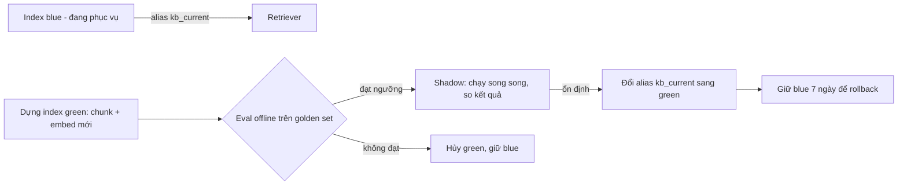
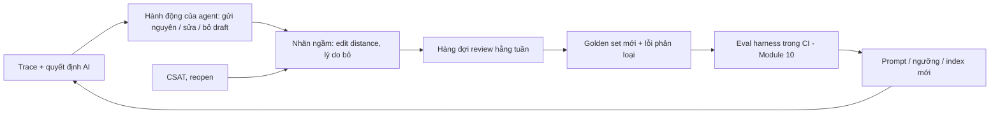
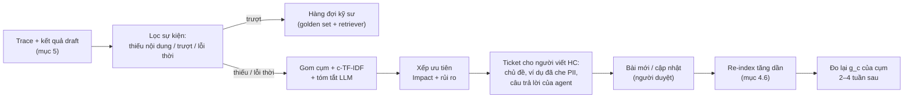

# Module 11 — Production & quy mô

> Thời lượng: ~50 phút · Mức độ: Nâng cao · Tiên quyết: Module 01 (KV cache, decoding), Module 05 (ANN/HNSW), Module 07 (guardrails, prompt injection), Module 10 (đánh giá, confidence & escalation)

Đến module này, bạn đã có một pipeline RAG "đúng" trên laptop: retrieve tốt, rerank tốt, sinh câu trả lời có citation, biết khi nào nên escalate. Câu hỏi bây giờ không còn là "có trả lời đúng không" mà là: **chạy 24/7 cho 1.500 ticket/ngày thì tốn bao nhiêu tiền, cần bao nhiêu GPU, chậm ở đâu, hỏng thì biết bằng cách nào, và có vi phạm luật dữ liệu cá nhân không?**

Mọi con số về quy mô trong module này là **giả định để học** (theo case study chung của khóa), không phải số liệu thật của doanh nghiệp nào. Giá API được tra cứu trên trang giá chính thức ngày **06/10/2026** — giá thay đổi thường xuyên, hãy luôn tính lại bằng bảng giá hiện hành.

## Mục tiêu học tập

Sau module này, bạn có thể:

1. **Ước lượng tải** từ số ticket/ngày ra số lượt chạy pipeline, QPS đỉnh, token/ngày, chi phí/tháng cho ít nhất ba phương án (API một model, API có routing + caching, self-host), trình bày rõ giả định và độ nhạy.
2. **Tính bộ nhớ KV cache** cho một model cụ thể (đọc từ `config.json`), suy ra số request đồng thời một GPU chịu được, và giải thích tác dụng của GQA, quantization trọng số (AWQ/GPTQ/FP8) và FP8 KV cache.
3. **Thiết kế latency budget** end-to-end cho luồng email bất đồng bộ (webhook → queue → worker → Zendesk), áp dụng định luật Little để tính số worker, và xử lý retry/idempotency/rate limit của Zendesk API.
4. **Chọn chiến lược cache** phù hợp (embedding cache, prompt/prefix caching, semantic cache) và chỉ ra rủi ro sai lệch của semantic cache bằng phân tích chi phí kỳ vọng.
5. **Thiết kế observability** (trace, metric, log che PII, alert, feedback loop) và một service FastAPI đạt chuẩn vận hành (healthcheck liveness/readiness, SSE cho UI nội bộ).
6. **Liệt kê các yêu cầu tuân thủ** chính khi xử lý email khách hàng Việt Nam/Nhật bằng LLM (Luật BVDLCN 91/2025/QH15 và Nghị định 356/2025/NĐ-CP thay thế Nghị định 13/2023/NĐ-CP; APPI sửa đổi 2026) và chuyển chúng thành quyết định kiến trúc (ACL-aware retrieval, data residency, retention).
7. **Dựng vòng phản hồi cho kho tri thức**: phân biệt thiếu nội dung / truy xuất trượt / lỗi thời từ log, gom cụm và gán nhãn chủ đề bằng c-TF-IDF, xếp ưu tiên theo tác động.

---

## 1. Ước lượng tải: từ ticket/ngày đến token/ngày và tiền/tháng

### 1.1. Vấn đề

Không ước lượng thì hoặc mua thừa GPU, hoặc chọn API rẻ nhất rồi thiếu chất lượng, hoặc bị Zendesk trả `429` giờ cao điểm. Ước lượng tốt là ước lượng **có cấu trúc** (chia thừa số rõ ràng) và **có độ nhạy** (biết thừa số nào quan trọng nhất).

### 1.2. Trực giác: chuỗi nhân Fermi

Chi phí LLM là tích của một chuỗi thừa số:

$$
\text{Chi phí/ngày} = \underbrace{N_{\text{ticket}}}_{\text{ticket/ngày}} \times \underbrace{r}_{\text{lượt chạy/ticket}} \times \sum_{j \in \text{bước}} \left( T^{\text{in}}_j \cdot p^{\text{in}}_{m(j)} + T^{\text{out}}_j \cdot p^{\text{out}}_{m(j)} \right)
$$

Trong đó:

- $N_{\text{ticket}}$: ticket mới/ngày (1.500).
- $r$: số lượt pipeline chạy mỗi ticket; 3–4 lượt trao đổi ≈ 2 tin nhắn từ khách → $r \approx 2$.
- $j$: các bước gọi LLM trong một lượt chạy (phân loại, viết lại query, sinh draft, kiểm chứng…).
- $T^{\text{in}}_j, T^{\text{out}}_j$: số token vào/ra của bước $j$.
- $m(j)$: model được dùng cho bước $j$; $p^{\text{in}}_m, p^{\text{out}}_m$: giá USD trên mỗi token vào/ra của model $m$.

Mỗi thừa số là một "núm vặn" tối ưu: giảm $r$ (debounce tin nhắn liên tiếp), giảm $T^{\text{in}}$ (rerank, nén context — Module 06), giảm $p$ (routing, caching).

### 1.3. Ví dụ số: từ 1.500 ticket/ngày ra lượt chạy và QPS

**Bước 1 — Lượt chạy/ngày.**

$$
R_{\text{ngày}} = N_{\text{ticket}} \times r = 1.500 \times 2 = 3.000 \text{ lượt chạy/ngày}.
$$

**Bước 2 — Phân bố theo giờ.** Khách Việt Nam (UTC+7) và Nhật (UTC+9) lệch nhau 2 giờ, khách quốc tế rải rác. Giả định 80% lưu lượng rơi vào ~10 giờ làm việc mở rộng:

$$
\lambda_{\text{TB giờ làm việc}} = \frac{0{,}8 \times 3.000}{10 \times 3.600 \text{ s}} = \frac{2.400}{36.000} \approx 0{,}067 \text{ lượt/s} \approx 4 \text{ lượt/phút}.
$$

**Bước 3 — Đỉnh.** Case giả định đỉnh gấp ~3 lần giờ cao điểm:

$$
\lambda_{\text{đỉnh}} \approx 3 \times 4 = 12 \text{ lượt/phút} = 0{,}2 \text{ lượt/s}.
$$

Thêm hệ số an toàn ×2 cho burst (ví dụ sự cố sản phẩm làm hàng trăm khách cùng gửi email trong 15 phút): **thiết kế cho ~24 lượt/phút ≈ 0,4 lượt/s**.

0,4 request/giây là **tải rất nhỏ**. Bài toán khó vì mỗi request **đắt** và **rủi ro**; trong phỏng vấn hãy nói rõ: nút thắt là chi phí token, độ trễ LLM và rate limit Zendesk — không phải throughput.

**Bước 4 — Token mỗi lượt chạy.** Giả định cấu trúc pipeline (chi tiết các bước ở Module 12):

| Bước | Model | $T^{\text{in}}$ | $T^{\text{out}}$ | Ghi chú giả định |
|---|---|---:|---:|---|
| Phân loại intent/ngôn ngữ/độ nhạy | nhỏ | 1.500 | 100 | system prompt 500 + email đã làm sạch 1.000 |
| Viết lại query (condense) | nhỏ | 1.500 | 150 | thread rút gọn |
| Sinh draft trả lời | lớn | 6.500 | 400 | system 1.500 + thread 1.500 + 6 chunk × 500 + hướng dẫn 500 |
| Kiểm chứng (groundedness/policy) | nhỏ | 3.500 | 200 | context + draft |
| **Tổng** | | **13.000** | **850** | |

**Bước 5 — Token/ngày và token/tháng.**

$$
T^{\text{in}}_{\text{ngày}} = 3.000 \times 13.000 = 39 \times 10^6 \text{ token}, \qquad T^{\text{out}}_{\text{ngày}} = 3.000 \times 850 = 2{,}55 \times 10^6 \text{ token}.
$$

Một tháng 30 ngày: ~1,17 tỷ token vào và ~76,5 triệu token ra. Tỷ lệ vào/ra ≈ 15:1 — điển hình cho RAG: **chi phí bị chi phối bởi input**, nên tối ưu input (ít chunk hơn, caching) đáng giá hơn tối ưu output.

<!-- fig:tokens-per-step -->
<figure markdown="span">
  { loading=lazy }
  { loading=lazy }
  <figcaption>Hình 11.1 — Token vào/ra của từng bước trong một lượt chạy theo bảng giả định của mục 1.3.</figcaption>
</figure>
<!-- /fig -->

### 1.4. Chi phí theo ba phương án (giá tra cứu 06/10/2026)

Giá tham khảo từ trang giá chính thức (USD / 1 triệu token, tier tiêu chuẩn):

| Model (nhà cung cấp) | Input | Output | Ghi chú |
|---|---:|---:|---|
| Claude Sonnet 5.5 (Anthropic) | 2,00 | 10,00 | prompt caching: ghi cache 5 phút ×1,25; đọc cache ×0,1; Batch −50% |
| GPT-5.6 Terra (OpenAI) | 2,00 | 12,00 | cached input 0,20; Batch −50% |
| GPT-5.6 Luna (OpenAI) | 0,20 | 1,20 | cached input 0,02 |
| Gemini 3.8 Flash (Google) | 0,75 | 3,75 | giá khuyến mãi đến 31/12/2026, sau đó gấp đôi |

Bảng chỉ để **minh họa phương pháp**; chọn model phải dựa trên golden set (Module 10).

**Phương án A — Một model lớn cho mọi bước** (ví dụ Sonnet 5.5):

$$
C_A = 39 \times 2{,}00 + 2{,}55 \times 10{,}00 = 78{,}0 + 25{,}5 = 103{,}5 \text{ USD/ngày} \approx 3.105 \text{ USD/tháng}.
$$

**Phương án B — Routing: bước phụ dùng model nhỏ, chỉ bước sinh draft dùng model lớn.** Các bước nhỏ (phân loại + condense + verify): $T^{\text{in}} = 6.500$, $T^{\text{out}} = 450$ mỗi lượt; dùng model nhỏ giá 0,20/1,20:

$$
C_{\text{nhỏ}} = 3.000 \times (6.500 \times 0{,}20 + 450 \times 1{,}20) \times 10^{-6} = 3.000 \times (1.300 + 540) \times 10^{-6} \approx 5{,}5 \text{ USD/ngày}.
$$

Bước sinh draft ($6.500$ vào, $400$ ra) với model lớn 2,00/10,00:

$$
C_{\text{lớn}} = 3.000 \times (6.500 \times 2{,}00 + 400 \times 10{,}00) \times 10^{-6} = 3.000 \times 17.000 \times 10^{-6} = 51{,}0 \text{ USD/ngày}.
$$

$C_B \approx 56{,}5$ USD/ngày ≈ **1.695 USD/tháng** — giảm ~45% so với A.

**Phương án C — B + prompt caching cho phần tĩnh.** System prompt 1.500 token của bước sinh draft giống hệt nhau giữa các lượt. Với ~4 lượt/phút trong giờ làm việc, cache 5 phút gần như luôn "nóng". Tiết kiệm mỗi lượt: $1.500 \times (2{,}00 - 0{,}20) \times 10^{-6} = 0{,}0027$ USD → $3.000 \times 0{,}0027 \approx 8{,}1$ USD/ngày (bỏ qua chi phí ghi cache vài lần/ngày khi cache hết hạn ban đêm). $C_C \approx 48$ USD/ngày ≈ **1.450 USD/tháng**.

**Batch API (−50%)** không hợp cho luồng trả lời khách (cửa sổ xử lý tới 24 giờ), nhưng rất hợp cho tác vụ offline: tóm tắt 200.000 ticket lịch sử (2.000 token vào, 300 ra mỗi ticket, giá batch 1,00/5,00) tốn khoảng $200.000 \times 0{,}0035 = 700$ USD một lần; sinh golden set; LLM-judge hằng đêm.

### 1.5. Phương án E — Self-host bằng vLLM

Self-host không được tính bằng token mà bằng **giờ GPU**. Giá thuê GPU biến động mạnh theo nhà cung cấp và hợp đồng; ở đây mình dùng một **giả định minh họa** $g = 2{,}5$ USD/giờ cho một GPU lớp 80 GB (bạn phải thay bằng báo giá thực tế):

$$
C_E = n_{\text{GPU}} \times g \times 720 \text{ giờ/tháng}.
$$

Một GPU 24/7: $2{,}5 \times 720 = 1.800$ USD/tháng. Production cần tối thiểu 2 replica để chịu lỗi/triển khai không downtime → ~3.600 USD/tháng, chưa tính công vận hành (on-call, nâng cấp driver, theo dõi bộ nhớ). Ở quy mô 1.500 ticket/ngày, **API có routing + caching rẻ hơn self-host**. Điểm hòa vốn:

$$
N^*_{\text{ticket}} = \frac{C_E}{r \times c_{\text{lượt}}}, \quad c_{\text{lượt}} = \frac{C_C}{3.000} \approx 0{,}016 \text{ USD/lượt}.
$$

$$
N^* \approx \frac{3.600 / 30}{2 \times 0{,}016} \approx \frac{120}{0{,}032} \approx 3.750 \text{ ticket/ngày}.
$$

Tức là khi lưu lượng vượt ~2,5 lần hiện tại, self-host bắt đầu cạnh tranh về tiền. Nhưng lý do mạnh nhất để self-host thường là **dữ liệu**: gửi email chứa PII sang API nước ngoài kéo theo nghĩa vụ chuyển dữ liệu xuyên biên giới (mục 7). Kiến trúc lai phổ biến: model nhỏ self-host làm phân loại + che PII, chỉ gửi văn bản đã che sang API lớn.

<!-- fig:cost-options -->
<figure markdown="span">
  { loading=lazy }
  { loading=lazy }
  <figcaption>Hình 11.2 — Trái: chi phí/tháng của các phương án ở mục 1.4–1.5. Phải: điểm hòa vốn giữa API (phương án C) và self-host hai GPU với giá thuê giả định.</figcaption>
</figure>
<!-- /fig -->

### 1.6. Phân tích độ nhạy

| Thừa số thay đổi | Ảnh hưởng tới $C_C$ | Bình luận |
|---|---|---|
| $r$ từ 2 → 3 (khách hay trả lời lại) | +50% | Debounce tin nhắn liên tiếp 2–3 phút giúp giảm $r$ |
| Số chunk 6 → 10 | +~20% | Lý do đầu tư reranker (Module 06) |
| Tỷ lệ ticket bị lọc trước LLM (spam, auto-reply, "cảm ơn") 15% | −15% | Bộ lọc rule rẻ nhất trong mọi tối ưu |

<!-- fig:cost-sensitivity -->
<figure markdown="span">
  { loading=lazy }
  { loading=lazy }
  <figcaption>Hình 11.3 — Phân tích độ nhạy của mục 1.6: số lượt chạy mỗi ticket là thừa số ảnh hưởng mạnh nhất.</figcaption>
</figure>
<!-- /fig -->

> **Liên hệ Zendesk.** Trong hàng 1.500 ticket/ngày luôn có một phần không cần LLM: email tự động "Out of office", thông báo bounce, khách chỉ trả lời "Thanks!". Zendesk trigger có thể gắn tag (ví dụ `auto_reply`) dựa trên điều kiện tiêu đề/nội dung; worker đọc tag này và bỏ qua. Mỗi ticket bỏ qua tiết kiệm trọn một lượt ~0,016 USD và, quan trọng hơn, tránh AI trả lời một email tự động — vòng lặp hai bot trả lời nhau là sự cố có thật ở nhiều hệ thống.

### 1.7. Code: máy tính chi phí

```python
# cost_model.py — ước lượng chi phí mỗi lượt (giá tra cứu 06/10/2026, PHẢI cập nhật)
PRICES = {"large": (2.00, 10.00, 0.20), "small": (0.20, 1.20, 0.02)}  # in, out, cached_in (USD/1M)
STEPS = [  # (tên, model, token vào, token ra, prefix trúng cache)
    ("classify", "small", 1500, 100, 0), ("condense", "small", 1500, 150, 0),
    ("generate", "large", 6500, 400, 1500), ("verify", "small", 3500, 200, 0),
]
def cost_per_run(steps=STEPS) -> float:
    total = 0.0
    for _, m, t_in, t_out, cached in steps:
        p_in, p_out, p_cache = PRICES[m]
        total += ((t_in - cached) * p_in + cached * p_cache + t_out * p_out) / 1e6
    return total
c = cost_per_run(); runs = 1500 * 2
print(f"{c:.4f} USD/lượt, {c*runs:.1f} USD/ngày, {c*runs*30:,.0f} USD/tháng")  # ~0.016 / ~48 / ~1.450
```

### 1.8. Trade-off

Ước lượng Fermi đúng **bậc độ lớn**, không đúng từng USD; sau 2 tuần shadow mode (Module 10), thay giả định bằng số đo từ trace (mục 5). Và đừng tối ưu chi phí trước chất lượng: một email sai chính sách hoàn tiền có thể đắt hơn cả năm chi phí token. Thứ tự đúng: **đúng → an toàn → nhanh → rẻ**.

---

## 2. Serving LLM tự host: vLLM, KV cache và throughput

Phần này áp dụng khi bạn self-host (phương án E hoặc kiến trúc lai), và cũng là nền tảng cho dự án vLLM với mentor.

### 2.1. Vấn đề: vì sao serving LLM khác serving một model ML thường

LLM sinh **từng token một**: mỗi request gồm một pha **prefill** (xử lý toàn bộ prompt song song, tạo KV cache — giới thiệu ở Module 01) và một pha **decode** (mỗi bước sinh một token, đọc lại toàn bộ KV cache). Hai hệ quả:

1. Bộ nhớ GPU bị chiếm không chỉ bởi trọng số mà còn bởi **KV cache tăng dần theo độ dài từng request**, và độ dài output không biết trước.
2. Pha decode bị giới hạn bởi **băng thông bộ nhớ** (mỗi bước phải đọc toàn bộ trọng số chỉ để sinh một token cho mỗi sequence), nên muốn tận dụng GPU phải **gom nhiều sequence vào một batch**.

vLLM (Kwon et al., 2023, arXiv:2309.06180) giải quyết cả hai bằng PagedAttention và continuous batching.

### 2.2. Toán: bộ nhớ KV cache

Với mỗi token đã xử lý, mỗi layer lưu một vector Key và một vector Value cho mỗi KV head. Ký hiệu:

- $n_{\text{layers}}$: số layer decoder;
- $n_{\text{kv}}$: số KV head (với GQA nhỏ hơn số query head);
- $d_{\text{head}}$: chiều mỗi head;
- $b$: số byte mỗi phần tử (BF16/FP16 = 2, FP8 = 1);
- $L$: số token của sequence (prompt + output đã sinh).

$$
M_{\text{KV}}(L) = \underbrace{2}_{K \text{ và } V} \cdot n_{\text{layers}} \cdot n_{\text{kv}} \cdot d_{\text{head}} \cdot b \cdot L.
$$

Đặt $m_{\text{tok}} = 2 \cdot n_{\text{layers}} \cdot n_{\text{kv}} \cdot d_{\text{head}} \cdot b$ là **byte/token**; khi đó $M_{\text{KV}} = m_{\text{tok}} \cdot L$, và với batch $B$ sequence độ dài trung bình $\bar L$: $M_{\text{KV}}^{\text{batch}} = m_{\text{tok}} \cdot B \cdot \bar L$.

**Ví dụ số 1 — Qwen3-8B** (đọc từ `config.json` trên Hugging Face: 36 layer, 32 attention head, 8 KV head, `head_dim` 128, BF16):

$$
m_{\text{tok}} = 2 \times 36 \times 8 \times 128 \times 2 = 147.456 \text{ byte} = 144 \text{ KiB/token}.
$$

Một lượt sinh draft của chúng ta dài ~$6.500 + 400 \approx 7.000$ token, làm tròn 8.000 token cho an toàn:

$$
M_{\text{KV}}(8.000) = 147.456 \times 8.000 \approx 1{,}18 \text{ GB}.
$$

**Ví dụ số 2 — Qwen3-32B** (64 layer, 64 attention head, 8 KV head, `head_dim` 128, BF16):

$$
m_{\text{tok}} = 2 \times 64 \times 8 \times 128 \times 2 = 262.144 \text{ byte} = 256 \text{ KiB/token}, \quad M_{\text{KV}}(8.000) \approx 2{,}1 \text{ GB}.
$$

**Vai trò của GQA** (Ainslie et al., 2023, arXiv:2305.13245). Nếu Qwen3-32B dùng multi-head attention đầy đủ ($n_{\text{kv}} = 64$ thay vì 8), KV cache lớn gấp $64/8 = 8$ lần: ~16,8 GB cho một sequence 8.000 token — một GPU 80 GB chỉ chứa nổi vài request. GQA cho nhiều query head dùng chung một cặp K/V, giảm bộ nhớ KV theo tỷ lệ $n_{\text{heads}}/n_{\text{kv}}$ với mất mát chất lượng nhỏ.

<!-- fig:kv-cache-length -->
<figure markdown="span">
  { loading=lazy }
  { loading=lazy }
  <figcaption>Hình 11.4 — Bộ nhớ KV cache theo độ dài sequence cho hai cấu hình Qwen3 (đọc từ config.json) và một cấu hình giả định không dùng GQA.</figcaption>
</figure>
<!-- /fig -->

### 2.3. Ví dụ số: một GPU 80 GB chịu được bao nhiêu request đồng thời?

Ngân sách bộ nhớ (vLLM mặc định dùng `--gpu-memory-utilization 0.92`, tức 92% VRAM — kiểm tra lại trong docs phiên bản bạn dùng):

$$
M_{\text{dùng được}} = 0{,}92 \times 80 = 73{,}6 \text{ GB}.
$$

$$
M_{\text{KV khả dụng}} = M_{\text{dùng được}} - M_{\text{trọng số}} - M_{\text{activation \& overhead}}.
$$

Qwen3-32B có ~32,8 tỷ tham số. Giả định overhead (activation, CUDA graph, buffer) ~4 GB:

| Cấu hình | $M_{\text{trọng số}}$ | $M_{\text{KV khả dụng}}$ | KV/seq 8k | Số seq 8k đồng thời |
|---|---:|---:|---:|---:|
| BF16 trọng số, BF16 KV | ~65,6 GB | ~4 GB | 2,1 GB | ~1 (không khả thi) |
| FP8 trọng số, BF16 KV | ~32,8 GB | ~36,8 GB | 2,1 GB | ~17 |
| FP8 trọng số, FP8 KV | ~32,8 GB | ~36,8 GB | 1,05 GB | ~35 |
| INT4 (AWQ/GPTQ) trọng số, BF16 KV | ~18 GB (ước lượng, gồm scale) | ~51 GB | 2,1 GB | ~24 |

Bài học: **với model 30B+ trên một GPU 80 GB, quantization trọng số gần như bắt buộc** để còn chỗ cho KV cache. Nhu cầu của chúng ta ở giờ đỉnh: định luật Little (mục 3.3) cho ~8 lượt chạy đồng thời, mỗi lượt chỉ một phần thời gian nằm ở bước sinh dài → 17 sequence đồng thời là dư.

<!-- fig:gpu-memory-budget -->
<figure markdown="span">
  { loading=lazy }
  { loading=lazy }
  <figcaption>Hình 11.5 — Bảng mục 2.3 dưới dạng ngân sách VRAM: phần còn lại sau trọng số và overhead quyết định số sequence 8k chạy đồng thời.</figcaption>
</figure>
<!-- /fig -->

**Ví dụ số 3 — GPU 6 GB của bạn (RTX 4050).** Qwen3-8B INT4: trọng số ~$8{,}2 \times 10^9 \times 0{,}5$ byte ≈ 4,1 GB, cộng overhead ~1 GB, còn ~0,5 GB cho KV → $0{,}5 \times 10^9 / 147.456 \approx 3.400$ token **tổng cho mọi request**. Không đủ cho một prompt RAG 7.000 token → lab 6 GB nên dùng model 1,5B–4B quantized, `--max-model-len` 4.096–8.192 (Bài tập 1).

### 2.4. PagedAttention: vì sao không cấp phát KV cache liền mạch

Cấp phát trước vùng nhớ liền mạch bằng `max_seq_len` cho mỗi request gây lãng phí lớn (internal và external fragmentation).

PagedAttention mượn ý tưởng bộ nhớ ảo của hệ điều hành: KV cache được chia thành **block** cố định (ví dụ 16 token/block), mỗi sequence có một **block table** ánh xạ vị trí logic → block vật lý không cần liền kề. Lãng phí chỉ còn trung bình nửa block cuối mỗi sequence.

Ví dụ số: 20 sequence, độ dài thực tế trung bình 3.000 token, `max_seq_len` 8.192.

- Cấp phát liền mạch: dùng $20 \times 8.192 = 163.840$ slot, hữu ích $60.000$ → hiệu dụng 37%.
- PagedAttention (block 16): $\approx 20 \times (3.000 + 8) = 60.160$ slot → hiệu dụng >99%.

Hệ quả phụ quan trọng: block có thể **chia sẻ** giữa các sequence có cùng prefix (copy-on-write) — nền tảng của prefix caching.

<!-- fig:paged-attention -->
<figure markdown="span">
  { loading=lazy }
  { loading=lazy }
  <figcaption>Hình 11.6 — Ví dụ mục 2.4: cấp phát liền mạch theo max_seq_len lãng phí gần 2/3 slot; PagedAttention chỉ lãng phí nửa block cuối mỗi sequence.</figcaption>
</figure>
<!-- /fig -->

### 2.5. Continuous batching

Static batching chờ cả batch xong mới nhận request mới; request ngắn phải "đợi" request dài nhất. Continuous batching (iteration-level scheduling) cho phép **sau mỗi bước decode**, sequence nào xong thì rời batch và request mới vào ngay. vLLM còn hỗ trợ **chunked prefill**: chia prompt dài thành nhiều phần để trộn với các bước decode, tránh việc một prompt 8.000 token làm "đứng hình" mọi sequence khác đang decode.

Ví dụ: batch 8 sequence, 7 cái cần 100 token, 1 cái cần 800. Static batching chạy 800 bước với hiệu dụng $\frac{1.500}{6.400} \approx 23\%$; continuous batching lấp chỗ trống bằng request mới, hiệu dụng tiến gần 100% khi hàng đợi không rỗng.

### 2.6. Throughput: ước lượng trần bằng băng thông bộ nhớ

Ở pha decode, mỗi bước phải đọc toàn bộ trọng số từ HBM một lần cho cả batch. Bỏ qua chi phí đọc KV:

$$
\text{bước/s} \lesssim \frac{\text{BW}_{\text{HBM}}}{M_{\text{trọng số}}}, \qquad \text{token/s (tổng)} \lesssim B \cdot \frac{\text{BW}_{\text{HBM}}}{M_{\text{trọng số}}}.
$$

Ví dụ: GPU có băng thông ~3,35 TB/s (lớp H100 SXM), Qwen3-32B FP8 (32,8 GB): trần ~100 bước/s → mỗi sequence tối đa ~100 token/s; batch 16 → trần ~1.600 token/s tổng. Thực tế đạt 40–70% trần do đọc KV cache, kernel overhead, scheduling. Nhu cầu đỉnh của chúng ta cho output: $0{,}4$ lượt/s × 400 token ≈ **160 token/s** — một GPU dư sức.

Pha prefill bị giới hạn bởi **tính toán**: khoảng $2 N_{\text{params}}$ FLOP/token. Nhu cầu đỉnh prefill nếu mọi bước chạy trên model 32B: $0{,}4 \times 13.000 = 5.200$ token/s × $2 \times 32{,}8 \times 10^9 \approx 3{,}4 \times 10^{14}$ FLOP/s = 340 TFLOP/s. Mức đáng kể với một GPU; giải pháp: chạy bước phụ trên model nhỏ và dùng **prefix caching**.

### 2.7. Prefix caching trong vLLM

vLLM băm (hash) nội dung từng block KV theo prefix; request mới có prefix trùng với block đã có trong cache thì dùng lại, bỏ qua tính toán prefill cho phần đó. Chỉ giảm thời gian prefill (TTFT), **không giảm thời gian decode**. Bật bằng `--enable-prefix-caching` (trong trang engine args của bản docs mới nhất mà mình tra cứu, mặc định đang ghi là tắt — hãy kiểm tra lại cho đúng phiên bản bạn cài, vì mặc định này đã thay đổi qua các phiên bản).

Quy tắc thiết kế prompt để cache trúng (áp dụng cho cả vLLM lẫn prompt caching của API thương mại):

1. **Phần tĩnh lên đầu, phần động xuống cuối**: system prompt → policy pack → định nghĩa tool/format → context retrieve → thread email.
2. **Không chèn thứ thay đổi vào phần tĩnh**: timestamp, ticket ID, tên khách trong system prompt là cách phá cache phổ biến nhất.

Ví dụ số: system + policy pack 3.000 token, prompt tổng 7.000 token. Tỷ lệ trúng cache 95% → giảm $0{,}95 \times 3.000 / 7.000 \approx 41\%$ token phải prefill.

### 2.8. Speculative decoding

Ý tưởng (Leviathan et al., 2022, arXiv:2211.17192): một model nháp (draft) rẻ đề xuất $k$ token, model chính kiểm tra cả $k$ token trong **một** lượt forward song song, chấp nhận tiền tố đúng. Thuật toán chấp nhận/từ chối được thiết kế để **phân phối output giữ nguyên** như model chính.

Toán ngắn: nếu mỗi token nháp được chấp nhận độc lập với xác suất $\alpha$, số token kỳ vọng sinh được mỗi lượt verify là

$$
\mathbb{E}[\text{token/lượt}] = \frac{1 - \alpha^{k+1}}{1 - \alpha}.
$$

Với $\alpha = 0{,}7$, $k = 4$: $\frac{1 - 0{,}7^5}{0{,}3} = \frac{1 - 0{,}168}{0{,}3} \approx 2{,}77$ token/lượt. Nếu chi phí một lượt verify ≈ một bước decode thường (vì decode bị giới hạn băng thông, verify thêm vài token gần như "miễn phí") và chi phí nháp nhỏ, tốc độ decode tăng ~2–2,5 lần.

<!-- fig:speculative-decoding -->
<figure markdown="span">
  { loading=lazy }
  { loading=lazy }
  <figcaption>Hình 11.7 — Số token kỳ vọng mỗi lượt verify của speculative decoding theo xác suất chấp nhận α và số token nháp k.</figcaption>
</figure>
<!-- /fig -->

vLLM hiện hỗ trợ nhiều phương pháp: n-gram (prompt lookup — tìm token tiếp theo bằng cách khớp n-gram trong chính prompt), EAGLE/EAGLE-3 (Li et al., 2025, arXiv:2503.01840), MTP, draft model riêng, suffix decoding… cấu hình bằng `--speculative-config` dạng JSON.

> **Liên hệ Zendesk.** N-gram speculation **đặc biệt hợp** với RAG trả lời email: câu trả lời thường chép lại nguyên cụm từ trong context (tên tính năng, đường dẫn menu "Cài đặt > Thanh toán > Hóa đơn", câu chữ của macro). Khi output lặp lại prompt nhiều, $\alpha$ cao mà không cần train model nháp. Nhưng với email bất đồng bộ, giảm decode 8 s → 4 s ít giá trị với khách; nó đáng giá hơn cho UI agent (mục 6) hoặc để tiết kiệm GPU-giây.

```bash
# Ví dụ khởi chạy vLLM (tính đến 10/2026, vLLM 0.31.x) — kiểm tra lại cờ theo phiên bản
vllm serve Qwen/Qwen3-32B-FP8 \
  --max-model-len 16384 \
  --gpu-memory-utilization 0.90 \
  --enable-prefix-caching \
  --kv-cache-dtype fp8 \
  --speculative-config '{"method": "ngram", "num_speculative_tokens": 4, "prompt_lookup_min": 2, "prompt_lookup_max": 5}'
```

### 2.9. Quantization: chọn gì

- **FP8** (trọng số/activation): mất chất lượng rất nhỏ, nhanh trên GPU thế hệ mới; GPU cũ không lợi.
- **AWQ** (Lin et al., 2023, arXiv:2306.00978): bảo vệ kênh trọng số quan trọng theo thống kê activation rồi lượng tử 4-bit; không cần backprop.
- **GPTQ** (Frantar et al., 2022, arXiv:2210.17323): lượng tử từng layer, bù sai số bằng xấp xỉ bậc hai; nhiều checkpoint sẵn. AWQ/GPTQ cần dữ liệu hiệu chuẩn — thường là tiếng Anh.
- **FP8 KV cache**: gấp đôi số token trong cache; có thể giảm chất lượng ở context rất dài.

Nguyên tắc: **luôn chạy lại golden set (Module 10) sau khi quantize**, phân tầng theo ngôn ngữ. Lượng tử hóa có thể làm giảm chất lượng tiếng Nhật kính ngữ nhiều hơn tiếng Anh mà điểm trung bình không phản ánh.

### 2.10. Trade-off: self-host hay API

API: rẻ hơn ở quy mô hiện tại, chất lượng thường cao nhất, không phải vận hành — nhưng dữ liệu rời hạ tầng, ít kiểm soát (logprob, constrained decoding, LoRA) và phụ thuộc giá/deprecate của nhà cung cấp. Self-host: dữ liệu ở lại, kiểm soát đầy đủ — nhưng tối thiểu 2 GPU và gánh on-call. Khuyến nghị của mình cho case: **giai đoạn đầu dùng API (sau lớp che PII), song song dựng vLLM cho model nhỏ** (phân loại, PII, verify); bọc mọi lời gọi qua một `LLMClient` theo giao diện tương thích OpenAI (vLLM có server tương thích) để chuyển đổi chỉ là đổi cấu hình.

---

## 3. Latency budget, xử lý bất đồng bộ và độ tin cậy

### 3.1. Vấn đề: email không phải chat, nhưng vẫn có SLA

Khác chatbot (TTFT dưới 1–2 giây), khách gửi email kỳ vọng phản hồi trong vài phút đến vài giờ; mục tiêu FRT của case là **vài phút**. Như vậy:

- Không cần tối ưu từng trăm mili-giây như chat; **xử lý bất đồng bộ** (webhook → queue → worker) là kiến trúc tự nhiên.
- Nhưng cần **độ tin cậy cao**: không mất ticket, không xử lý trùng, không gửi hai email cho khách, không bị Zendesk chặn vì vượt rate limit.

Webhook của Zendesk có timeout **12 giây** và sẽ thử lại khi timeout (tối đa 5 lần); một số mã lỗi như 409 cũng được thử lại; 429/503 chỉ được thử lại nếu có header `Retry-After` dưới 60 giây. Ngoài ra Zendesk có **circuit breaker**: nếu trong 5 phút có 70% request lỗi hoặc hơn 1.000 lỗi (và tổng số request từ 100 trở lên), webhook bị tạm ngừng gửi. Hệ quả thiết kế: endpoint nhận webhook **phải trả lời trong vài trăm mili-giây** — chỉ xác minh chữ ký, ghi vào queue rồi trả `200/202`. Không bao giờ chạy pipeline LLM bên trong request webhook.

### 3.2. Latency budget cho một lượt chạy

Ngân sách là bảng phân bổ thời gian cho từng bước, dùng để (i) đặt timeout từng bước, (ii) biết bước nào cần tối ưu, (iii) đặt SLO. Giả định cho luồng chính (p50 / p95):

| Bước | p50 | p95 | Ghi chú |
|---|---:|---:|---|
| Webhook nhận → enqueue | 30 ms | 150 ms | Xác minh HMAC + ghi Redis/Postgres |
| Thời gian chờ trong queue | 1 s | 60 s | Phụ thuộc số worker; p95 chịu ảnh hưởng burst |
| Lấy ticket + comments, làm sạch, che PII | 500 ms | 1,9 s | 1–2 request Zendesk; NER nhỏ |
| Phân loại + condense (LLM nhỏ, 2 lượt) | 1,6 s | 4 s | Có thể gộp một lượt |
| Embedding query + hybrid retrieval | 150 ms | 500 ms | BM25 + ANN + RRF (Module 05) |
| Rerank top-50 (cross-encoder) | 300 ms | 900 ms | GPU nhỏ hoặc API |
| Sinh draft (LLM lớn, 400 token out) | 8 s | 20 s | TTFT 1–2 s + decode |
| Verify (LLM nhỏ) | 1,5 s | 4 s | |
| Ghi internal note / public reply vào Zendesk | 400 ms | 2 s | Update Ticket; rate limit riêng |
| **Tổng (không tính chờ queue)** | **~13 s** | **~33 s** | |

Nhận xét:

1. **Sinh draft chiếm >60% thời gian** — tối ưu ở đây có lợi nhất.
2. p95 tổng không phải tổng các p95, nhưng tổng p95 là chặn trên an toàn để đặt timeout tổng (ví dụ 60 s/lượt).

SLO đề xuất: **95% ticket đủ điều kiện có draft/phản hồi trong 2 phút** từ `created_at` tới lúc comment AI được ghi (đủ cho một lần retry và chờ queue khi burst).

<!-- fig:latency-budget -->
<figure markdown="span">
  { loading=lazy }
  { loading=lazy }
  <figcaption>Hình 11.8 — Latency budget của mục 3.2 (giả định): thanh là p50, vạch là p95 của từng bước.</figcaption>
</figure>
<!-- /fig -->

### 3.3. Định luật Little: cần bao nhiêu worker?

Định luật Little cho hệ thống ổn định: số phần tử trung bình trong hệ thống bằng tốc độ đến nhân thời gian lưu trú trung bình:

$$
L = \lambda W.
$$

Áp dụng cho số lượt chạy **đồng thời** khi đang xử lý: $\lambda_{\text{đỉnh}} = 0{,}4$ lượt/s (đã gồm hệ số burst), $W \approx 20$ s (giữa p50 và p95):

$$
L = 0{,}4 \times 20 = 8 \text{ lượt chạy đồng thời}.
$$

Mỗi worker là một coroutine async (phần lớn thời gian chờ I/O mạng tới LLM/Zendesk), nên **một process với 16–32 slot đồng thời** là đủ; triển khai 2 process trên 2 máy để chịu lỗi. Giữ mức sử dụng $\rho = \lambda/(c\mu)$ khoảng 50% ở đỉnh, vì thời gian chờ tăng rất nhanh khi $\rho \to 1$. Ràng buộc thật sự là rate limit của nhà cung cấp LLM và Zendesk, không phải số worker.

<!-- fig:utilization-wait -->
<figure markdown="span">
  { loading=lazy }
  { loading=lazy }
  <figcaption>Hình 11.9 — Minh họa định tính bằng hàng đợi M/M/1: thời gian lưu trú tăng rất nhanh khi mức sử dụng tiến tới 1 — lý do giữ ρ quanh 50% ở giờ đỉnh.</figcaption>
</figure>
<!-- /fig -->

### 3.4. Rate limit của Zendesk API: tính ngân sách request

Theo tài liệu chính thức (tra cứu 06/10/2026), giới hạn toàn tài khoản phụ thuộc gói: ví dụ Suite Team 200 request/phút, Growth/Professional 400, Enterprise 700, Enterprise Plus 2.500; add-on High Volume API nâng lên 2.500 (không cộng dồn). Endpoint **Update Ticket** có giới hạn riêng: 30 lần/10 phút cho mỗi cặp (user, ticket), và một giới hạn theo tài khoản mỗi phút (trang Tickets API ghi 20/phút mức chuẩn, 100/phút với add-on; trang tổng quan ghi con số khác — **kiểm tra header `Zendesk-RateLimit-tickets-update` trên tài khoản của bạn**). Khi vượt, API trả `429` kèm `Retry-After` (giây); response bình thường có header `X-Rate-Limit` và `X-Rate-Limit-Remaining`.

Ngân sách cho một lượt chạy: đọc ticket (1) + đọc comments (1) + có thể đọc user/organization (1) + ghi comment & cập nhật tag/group trong **một** Update Ticket (1) ≈ 4 request, trong đó 1 là update.

$$
\text{Request/phút đỉnh} = 24 \text{ lượt/phút} \times 4 \approx 96 \text{ request/phút}, \qquad \text{Update/phút đỉnh} \approx 24.
$$

96/phút nằm trong 400/phút (gói Professional), nhưng **24 update/phút vượt 20/phút** nếu tài khoản ở mức chuẩn của giới hạn update. Đó là con số dẫn tới các quyết định:

1. **Gộp mọi thay đổi vào một lần Update Ticket**: comment + `additional_tags` + `group_id` + `custom_fields` trong cùng một PUT — không gọi riêng từng thứ.
2. **Token bucket phía client** cho cả hai lớp giới hạn (tài khoản và update), chia sẻ qua Redis giữa các worker, để không "đốt" quota mà agent người thật và các integration khác cũng dùng chung. Đặt trần cho AI ở ~50% quota tài khoản.
3. Khi bucket cạn, job chờ vài giây (chấp nhận được với email); cân nhắc add-on High Volume khi tăng trưởng.

Cài đặt token bucket bằng một script Lua nguyên tử trên Redis (đọc số token còn lại và thời điểm nạp gần nhất, nạp thêm theo thời gian trôi qua, trừ 1 nếu đủ) để mọi worker chia sẻ chung một bucket; dùng hai bucket lồng nhau: `zd:rl:account` (AI ≤ 50% quota tài khoản) và `zd:rl:update`. Phần code khung ở Module 12 và Bài tập 3.

### 3.5. Retry với exponential backoff và jitter

Lỗi tạm thời (timeout mạng, 429, 5xx của LLM API hoặc Zendesk) phải được thử lại; lỗi vĩnh viễn (400 do payload sai, 403, 404 ticket đã xóa) thì không. Công thức backoff thông dụng ("full jitter"):

$$
t_{\text{chờ}}(n) = U\!\left(0,\ \min(t_{\max},\ t_0 \cdot 2^{n})\right),
$$

với $n$ là số lần đã thử, $t_0$ là thời gian chờ gốc, $U(a,b)$ là phân phối đều. Jitter ngẫu nhiên tránh hiện tượng **thundering herd**: sau một sự cố, hàng trăm job cùng thử lại đúng một thời điểm và lại làm sập dịch vụ. Nếu server trả `Retry-After`, luôn tôn trọng nó thay cho công thức.

Ví dụ $t_0 = 1$ s: tổng thời gian chờ kỳ vọng qua 5 lần thử là $0{,}5 + 1 + 2 + 4 + 8 = 15{,}5$ s — vẫn trong SLO 2 phút.

<!-- fig:backoff-jitter -->
<figure markdown="span">
  { loading=lazy }
  { loading=lazy }
  <figcaption>Hình 11.10 — Exponential backoff với full jitter (t₀ = 1 s): mỗi lần thử chờ ngẫu nhiên trong [0, t₀·2ⁿ], nên các client tản ra thay vì thử lại cùng lúc.</figcaption>
</figure>
<!-- /fig -->

Hết số lần thử → **dead-letter queue (DLQ)** + alert, và **ticket phải được chuyển cho người** (tag `ai_failed`, group CS) — thất bại của AI không được làm ticket "biến mất".

### 3.6. Idempotency: không xử lý trùng, không gửi trùng

Nguồn trùng lặp có thật: Zendesk retry khi endpoint chậm; worker crash sau khi gửi comment nhưng trước khi ack; trigger cấu hình trùng; và thứ tự sự kiện không được đảm bảo (tài liệu event webhook nói rõ).

Thiết kế idempotency theo ba lớp:

1. **Khử trùng ở cửa vào**: khóa idempotency = hash của `(ticket_id, comment_id)` nếu có (event `zen:event-type:ticket.comment_added` mang `comment.id`), hoặc `(ticket_id, event_id)`. Dùng `SET key NX EX 86400` trong Redis hoặc unique constraint trong Postgres. Trùng → trả 200 và bỏ qua.
2. **Khóa theo ticket khi xử lý**: chỉ một worker xử lý một ticket tại một thời điểm (advisory lock Postgres hoặc Redis lock có TTL). Nếu khách gửi hai email liên tiếp, lượt sau chờ lượt trước hoặc gộp (debounce).
3. **Kiểm tra trước khi ghi (check-then-act có bảo vệ)**: trước khi ghi comment, đọc lại ticket; nếu đã có comment của AI cho cùng `source_comment_id` (lưu trong bảng `ai_actions` của bạn) thì không ghi nữa. Khi cập nhật, dùng `safe_update: true` kèm `updated_stamp` của lần đọc gần nhất: nếu ticket đã bị agent khác sửa trong lúc AI đang xử lý, Zendesk trả **409** (collision) và bạn biết cần đọc lại và cân nhắc lại — thay vì ghi đè lên quyết định của người.

Trạng thái job lưu bền vững trong Postgres: `RECEIVED → PROCESSING → DRAFTED/SENT/ESCALATED → DONE` hoặc `FAILED → DLQ` — một dạng outbox pattern thu nhỏ.

### 3.7. Chọn queue

| Lựa chọn | Ưu | Nhược | Khi nào dùng |
|---|---|---|---|
| Redis Streams + consumer group | Đơn giản, đã có Redis, ack/pending list | Độ bền phụ thuộc cấu hình persistence | Team nhỏ, quy mô này — **khuyến nghị** |
| Postgres làm queue (`SELECT … FOR UPDATE SKIP LOCKED`) | Giao dịch cùng DB với trạng thái job, không thêm hạ tầng | Hiệu năng giới hạn ở rất lớn | Rất hợp ở 3.000 job/ngày |
| RabbitMQ / SQS / Kafka | Bền, DLQ có sẵn, replay (Kafka) | Thêm hạ tầng | Khi tổ chức đã có; Kafka quá mức cho case |

> **Liên hệ Zendesk.** Nên đăng ký **event-subscribed webhook** cho `zen:event-type:ticket.created` và `zen:event-type:ticket.comment_added` hay dùng **trigger + webhook**? Hai cơ chế loại trừ nhau trên cùng một webhook. Trigger cho phép lọc sớm bằng điều kiện nghiệp vụ (chỉ group CS, chỉ kênh email, bỏ ticket có tag `ai_skip`) và tự soạn body JSON tối giản; event webhook cho payload chuẩn có `comment.id`, `is_public` và thông tin tác giả (`is_staff`), tiện cho idempotency và để **bỏ qua comment do chính AI hoặc agent tạo ra** — nếu không lọc, comment của AI lại kích hoạt AI, tạo vòng lặp vô hạn. Chi tiết lựa chọn ở Module 12.

---

## 4. Caching và index ở quy mô

### 4.1. Ba loại cache, ba mức rủi ro

| Loại cache | Khóa | Giá trị | Rủi ro sai | Lợi ích |
|---|---|---|---|---|
| **Embedding cache** | hash(model_id, phiên bản tiền xử lý, văn bản) | vector | Gần như 0 (tất định) | Không embed lại chunk không đổi khi re-index |
| **Prompt/prefix cache** (vLLM APC, prompt caching API) | prefix token chính xác | KV cache | 0 (kết quả giống hệt) | Giảm TTFT và chi phí input |
| **Semantic cache** (câu trả lời cho câu hỏi "gần giống") | embedding của query, ngưỡng tương đồng | câu trả lời đã sinh | **Cao** | Bỏ qua cả pipeline |

Hai loại đầu là tối ưu "miễn phí" về độ đúng — luôn nên làm. Loại thứ ba cần phân tích cẩn thận.

### 4.2. Embedding cache

Với ~158.000 chunk (ước lượng: ~8.000 từ Help Center, ~300 macro, ~150.000 Q/A từ ticket lịch sử) và ~3% thay đổi mỗi tuần, cache theo hash nội dung chỉ phải embed lại ~4.900 chunk/tuần. Khóa cache **phải** gồm tên model và phiên bản tiền xử lý — nếu không sẽ trộn hai không gian vector, retrieval hỏng âm thầm.

### 4.3. Semantic cache: phân tích bằng chi phí kỳ vọng

Ý tưởng: nếu query mới có cosine similarity với một query đã trả lời $\geq \theta$, trả lại câu trả lời cũ. Gọi:

- $h(\theta)$: tỷ lệ trúng cache tại ngưỡng $\theta$ (giảm khi $\theta$ tăng);
- $e(\theta)$: xác suất câu trả lời từ cache **sai** cho query mới khi trúng (giảm khi $\theta$ tăng);
- $c_{\text{run}}$: chi phí một lượt pipeline (~0,016 USD);
- $c_{\text{err}}$: chi phí kỳ vọng của một câu trả lời sai gửi cho khách (thời gian agent sửa, rủi ro CSAT, rủi ro hợp đồng).

Lợi ích ròng kỳ vọng mỗi query:

$$
\Delta(\theta) = h(\theta)\left[c_{\text{run}} - e(\theta)\, c_{\text{err}}\right].
$$

Semantic cache chỉ có lợi khi $e(\theta) < c_{\text{run}}/c_{\text{err}}$.

Ví dụ số: giả sử một câu trả lời sai tốn $c_{\text{err}} = 5$ USD (15 phút agent xử lý hậu quả, chưa tính mất khách). Khi đó cần $e < 0{,}016/5 = 0{,}0032$ — tức cache chỉ được sai **dưới 0,32%** các lần trúng. Trong email CS, hai câu hỏi "Làm sao hủy gói Pro?" và "Làm sao hủy gói Enterprise?" có cosine rất cao nhưng câu trả lời khác hẳn (Enterprise có hợp đồng, phí chấm dứt…). Đạt $e < 0{,}3\%$ gần như không khả thi cho câu trả lời **cá nhân hóa** theo tài khoản.

Kết luận thực dụng của mình: **không dùng semantic cache cho câu trả lời cuối gửi khách**. Dạng an toàn hơn: cache **kết quả retrieval** cho query trùng sau chuẩn hóa, hoặc FAQ tĩnh thuần túy, vẫn qua verify; khóa cache gồm `tenant`, `locale`, `product`, `plan`.

<!-- fig:semantic-cache -->
<figure markdown="span">
  { loading=lazy }
  { loading=lazy }
  <figcaption>Hình 11.11 — Lợi ích ròng của semantic cache theo tỉ lệ trả lời sai khi trúng cache, với tỉ lệ trúng h = 0,3 và ba mức chi phí của một câu trả lời sai.</figcaption>
</figure>
<!-- /fig -->

### 4.4. Bộ nhớ index: ước lượng

Số chunk: ~158.000, làm tròn **200.000** để có dư địa tăng trưởng. Giả định embedding 1.024 chiều, float32 (4 byte):

$$
M_{\text{vector}} = 200.000 \times 1.024 \times 4 \approx 819 \text{ MB}.
$$

HNSW thêm danh sách láng giềng: tầng 0 có tới $2M$ láng giềng, mỗi ID 4 byte (các tầng trên nhỏ, bỏ qua). Với $M = 16$:

$$
M_{\text{graph}} \approx 200.000 \times 2 \times 16 \times 4 \approx 25{,}6 \text{ MB}.
$$

Cộng payload/metadata (product, version, language, tenant, updated_at, visibility, URL, văn bản chunk ~2 KB): $200.000 \times 2 \text{ KB} \approx 400$ MB (có thể nằm trên đĩa). Tổng **dưới 1,5 GB** — vừa một instance Qdrant hoặc Postgres + pgvector cỡ nhỏ.

Với int8 scalar quantization: vector còn ~205 MB; binary quantization: ~25,6 MB và rescoring bằng vector gốc trên đĩa (Module 03, 05). Ở quy mô 200.000 vector, **không cần sharding** — sharding là lời giải cho bài toán chưa tồn tại. Đây cũng là câu trả lời đúng trong phỏng vấn: nêu con số rồi kết luận "một node + replica đọc là đủ; shard khi vượt ~vài chục triệu vector hoặc khi cô lập tenant đòi hỏi".

<!-- fig:index-memory -->
<figure markdown="span">
  { loading=lazy }
  { loading=lazy }
  <figcaption>Hình 11.12 — Ước lượng bộ nhớ index của mục 4.4 cho ba kiểu lưu vector.</figcaption>
</figure>
<!-- /fig -->

Nếu cần shard (hàng chục triệu vector, hoặc cô lập theo khu vực như dữ liệu khách Nhật ở vùng Nhật), shard theo **tenant/khu vực** để truy vấn chỉ chạm một shard, thay vì shard theo hash phải scatter-gather.

### 4.5. Re-index không downtime: blue/green index

Khi đổi model embedding, đổi chiến lược chunking hoặc tham số HNSW, bạn phải dựng lại toàn bộ index. Quy trình blue/green:



Cốt lõi là **alias** (Qdrant, Elasticsearch/OpenSearch có alias; pgvector dùng view hoặc cột `index_version`): ứng dụng luôn truy vấn alias nên chuyển đổi là nguyên tử. Trong lúc dựng green, cập nhật tăng dần phải **ghi kép** vào cả hai index.

### 4.6. Freshness SLA và cập nhật tăng dần

Case nói một phần dữ liệu thay đổi hằng tuần (giá, chính sách, release notes). Đặt SLA rõ ràng theo loại nguồn:

| Nguồn | Cơ chế cập nhật | Freshness SLA đề xuất |
|---|---|---|
| Help Center articles | Incremental export bài viết (`/api/v2/help_center/incremental/articles?start_time=…`) mỗi 10 phút, hoặc webhook từ CMS | ≤ 15 phút |
| Macro | Đồng bộ định kỳ qua API macros | ≤ 1 giờ |
| Chính sách giá/hoàn tiền | Nguồn chuẩn (bảng cấu hình có version), **không** suy ra từ ticket | Ngay khi phát hành (đẩy chủ động) |
| Ticket đã giải quyết → Q/A | Incremental ticket export (cursor, giới hạn 10 request/phút) theo lô hằng đêm, qua lọc CSAT | ≤ 24 giờ |
| Xóa theo yêu cầu dữ liệu cá nhân | Xóa theo `source_id` trong mọi index và cache | ≤ 72 giờ (đề xuất nội bộ) |

Đo bằng `kb_staleness_seconds` theo nguồn, alert khi vượt SLA — lỗi kinh điển là job đồng bộ chết im lặng và AI trả lời bằng giá quý trước.

> **Liên hệ Zendesk.** Bài viết Help Center có trường `draft`, `user_segment_id` (ai được xem) và `locale`. Chỉ index bài **đã publish** và hiển thị công khai (hoặc đúng segment khách hàng được xem) — nếu index nhầm bài nội bộ dành cho agent (ví dụ "Cách xử lý ngoại lệ hoàn tiền cho khách VIP"), AI có thể trích nguyên văn quy trình nội bộ cho khách. Đây là một dạng rò rỉ thông qua retrieval, chủ đề của mục 7.

---

## 5. Observability: biết hệ thống đang làm gì

### 5.1. Vấn đề

Pipeline có 8–10 bước, ba dịch vụ bên ngoài (LLM, vector DB, Zendesk). Khi agent CS phàn nàn "AI trả lời sai cho ticket #48213", bạn phải trả lời trong 5 phút: query viết lại thành gì, retrieve được chunk nào, prompt cuối cùng là gì, verify chấm bao nhiêu, vì sao không escalate. Không có tracing thì không trả lời được.

### 5.2. Ba trụ cột áp vào LLM

- **Trace**: mỗi lượt chạy là một trace (`trace_id`), mỗi bước là một span có thuộc tính: model, số token vào/ra, latency, chi phí, top-k chunk ID và điểm, quyết định. Dùng **OpenTelemetry** làm chuẩn thu thập; backend có thể là Langfuse, LangSmith, Phoenix hoặc Jaeger/Tempo. OpenTelemetry có semantic conventions cho GenAI (tên thuộc tính `gen_ai.*`) — tính đến 10/2026 phần lớn vẫn ở trạng thái thử nghiệm, nên hãy cố định phiên bản convention bạn dùng.
- **Metric**: số liệu tổng hợp để alert và dashboard.
- **Log**: sự kiện có cấu trúc (JSON), luôn kèm `trace_id`, `ticket_id`.

Mỗi span bước sinh nên có: `zendesk.ticket_id`, `gen_ai.request.model`, `gen_ai.usage.input_tokens/output_tokens`, chi phí USD, danh sách **chunk ID** (không phải nội dung) và `pipeline_version`. Không ghi prompt/response thô vào span; nội dung đã che PII lưu ở kho riêng (mục 5.4).

### 5.3. Bộ metric tối thiểu và alert

| Nhóm | Metric | Alert gợi ý |
|---|---|---|
| Độ tin cậy | tỷ lệ job lỗi, độ dài DLQ, tuổi job cũ nhất trong queue | DLQ > 0 trong 10 phút; job cũ nhất > 5 phút |
| Latency | p50/p95 từ `ticket.created_at` tới comment AI | p95 > 2 phút trong 15 phút |
| Chi phí | USD/giờ, USD/lượt, token/lượt | USD/giờ > 2× trung bình 7 ngày (dấu hiệu vòng lặp) |
| Chất lượng (proxy online) | tỷ lệ escalate, tỷ lệ agent chỉnh draft (edit distance, Module 10), tỷ lệ abstain, điểm verify trung bình | lệch > 3σ so với baseline tuần |
| Freshness | `kb_staleness_seconds` theo nguồn | vượt SLA mục 4.6 |
| An toàn | số lần guardrail chặn, số nghi vấn prompt injection | tăng đột biến → có thể đang bị tấn công |

Alert chi phí theo giờ nghe có vẻ phụ, nhưng là alert **phát hiện vòng lặp bot** nhanh nhất: AI trả lời email tự động, email tự động trả lời lại, chi phí tăng vọt trước khi bất kỳ ai đọc ticket.

### 5.4. Log prompt/response có che PII

Nội dung prompt/response cần cho debug nhưng tập trung nhiều PII nhất. Nguyên tắc:

1. **Che trước khi log**: email, số điện thoại, số tài khoản, địa chỉ, mã số thuế → thay bằng placeholder có kiểu (`<EMAIL_1>`, `<PHONE_1>`). Nếu cần khôi phục để debug, lưu bảng ánh xạ ở kho riêng, mã hóa, quyền truy cập hẹp, TTL ngắn.
2. **Tách kho**: trace/metric (không PII) giữ lâu; nội dung (đã che) giữ ngắn hạn (ví dụ 30–90 ngày) theo chính sách lưu trữ đã công bố.
3. Phân quyền theo vai trò và audit log truy cập.
4. **Không gửi nội dung lên SaaS observability ở nước ngoài** khi chưa đánh giá pháp lý — đó cũng là chuyển dữ liệu xuyên biên giới (mục 7). Langfuse có thể self-host, là lý do nó phổ biến trong bối cảnh này.

### 5.5. Feedback loop

Observability chỉ có giá trị khi đóng vòng:



Tín hiệu sẵn có trong Zendesk: so internal note của AI với public reply kế tiếp của agent, reopen, CSAT (event `csat_received`); thêm custom field `ai_draft_outcome` (used_as_is / edited / discarded) — rẻ mà giá trị cao.

---

## 6. Thiết kế service FastAPI cho vận hành

### 6.1. Tách thành các thành phần

- `ingress-api` (FastAPI): nhận webhook, xác minh chữ ký, khử trùng, enqueue; API nội bộ cho UI agent.
- `worker`: chạy graph LangGraph (Module 12), scale theo độ sâu queue.
- `indexer`: đồng bộ Help Center/macro/ticket → chunk → embed → upsert.
- `llm-gateway` (tùy chọn): routing model, retry, rate limit, ghi chi phí, che PII; nơi duy nhất cầm API key LLM.

Tách `ingress` khỏi `worker` để webhook luôn phản hồi nhanh bất kể LLM chậm.

### 6.2. Healthcheck: liveness khác readiness

- **Liveness** (`/healthz`): process còn sống không. Không kiểm tra phụ thuộc ngoài — nếu kiểm tra, khi Zendesk sập Kubernetes sẽ restart toàn bộ pod của bạn trong vòng lặp vô ích.
- **Readiness** (`/readyz`): có sẵn sàng nhận việc không — kiểm tra kết nối DB/Redis (phụ thuộc bắt buộc). Với worker, readiness có thể gồm "đã load model reranker".
- **Deep health** (`/health/deps`, chỉ nội bộ): trạng thái từng phụ thuộc (LLM, vector DB, Zendesk) để dashboard, không gắn với restart.

```python
# app.py — FastAPI 0.14x: healthcheck và SSE cho UI nội bộ của agent
import asyncio, json
from fastapi import FastAPI, Response
from fastapi.responses import StreamingResponse

app = FastAPI()

@app.get("/healthz")
async def liveness():
    return {"status": "ok"}  # chỉ cần event loop còn phản hồi

@app.get("/readyz")
async def readiness(response: Response):
    checks = {"postgres": await ping_postgres(), "redis": await ping_redis()}
    if not all(checks.values()):
        response.status_code = 503
    return checks

@app.get("/internal/tickets/{ticket_id}/draft/stream")
async def stream_draft(ticket_id: int):
    """SSE: agent xem draft đang sinh, kèm các sự kiện tiến trình."""
    async def events():
        async for ev in pipeline_events(ticket_id):  # sinh từ worker qua Redis pub/sub
            # mỗi sự kiện SSE: dòng 'event:' + 'data:' + dòng trống
            yield f"event: {ev['type']}\ndata: {json.dumps(ev['data'], ensure_ascii=False)}\n\n"
        yield "event: done\ndata: {}\n\n"
    return StreamingResponse(events(), media_type="text/event-stream",
                             headers={"Cache-Control": "no-cache", "X-Accel-Buffering": "no"})
```

SSE (một chiều server → client, HTTP thường, tự reconnect) chỉ phục vụ agent xem tiến trình khi "tạo lại draft" trong sidebar Zendesk; khách nhận email hoàn chỉnh. `X-Accel-Buffering: no` tắt buffering của Nginx.

### 6.3. Graceful shutdown và triển khai

Idempotency lớp 3 (mục 3.6) cứu trường hợp worker bị kill sau khi đã ghi comment. Ngoài ra: bắt SIGTERM, ngừng nhận job mới, chờ job đang chạy tối đa N giây (`terminationGracePeriodSeconds` lớn hơn timeout một lượt), sau đó trả job chưa xong về queue. Triển khai rolling hoặc canary theo phiên bản prompt/model (gắn `pipeline_version` vào mọi trace để so sánh).

---

## 7. Bảo mật và tuân thủ ở quy mô

### 7.1. Multi-tenant và ACL-aware retrieval

Rủi ro số một của RAG doanh nghiệp là **trả lời khách A bằng dữ liệu của khách B** — nguồn rủi ro: ticket lịch sử, bài Help Center theo segment, tài liệu nội bộ.

Nguyên tắc: **quyền được áp ở tầng retrieval, bằng filter bắt buộc, trước khi xếp hạng** — không dựa vào việc "nhắc LLM đừng tiết lộ".

Mỗi chunk mang metadata `visibility ∈ {public, customer_segment:<id>, org:<org_id>, internal}` và `tenant_id`. Truy vấn từ ticket của tổ chức $o$ được phép thấy:

$$
\mathcal{A}(o) = \{d : \text{vis}(d) = \text{public}\} \cup \{d : \text{vis}(d) = \text{org}{:}o\} \cup \{d : \text{vis}(d) = \text{segment}{:}s,\ s \in S(o)\},
$$

và retrieval là $\text{top-}k$ trên $\mathcal{A}(o)$, **không bao giờ** trên toàn tập. Với HNSW, filter chọn lọc mạnh có thể làm giảm recall (Module 05) — Qdrant/pgvector có cơ chế filter trong lúc duyệt đồ thị; kiểm tra recall có filter trong eval.

Khuyến nghị mạnh của mình: **Q/A trích từ ticket lịch sử phải được ẩn danh hóa và tổng quát hóa** thành tri thức chung trước khi index với `visibility = public-internal-knowledge`, thay vì index nguyên văn ticket. Khi đó dù filter có lỗi, thứ lộ ra là kiến thức sản phẩm, không phải dữ liệu khách khác.

Kiểm thử bằng "canary" trong CI: chèn tài liệu giả của org X chứa chuỗi độc nhất, truy vấn từ org Y, khẳng định chuỗi đó không bao giờ xuất hiện.

### 7.2. Lớp phòng thủ prompt injection trong vận hành

Kỹ thuật phòng thủ chi tiết ở Module 07 (spotlighting — Hines et al., 2024, arXiv:2403.14720; tách kênh dữ liệu/lệnh; quyền tối thiểu cho tool). Ở góc độ production, thêm ba điều:

1. **Quyền của API token Zendesk tối thiểu**: tài khoản AI chỉ được thêm comment, sửa tag/group/custom field — không xóa ticket, không sửa user, không truy cập admin. Zendesk không có phân quyền token chi tiết như ý muốn trong mọi gói, nên lớp `zendesk_client` của bạn phải **chặn ở mã nguồn**: chỉ cho phép một danh sách trắng các thao tác.
2. **Hành động gửi public reply là hành động có hậu quả** → phải qua policy gate tất định (Module 12) chứ không chỉ quyết định của LLM.

### 7.3. Bảo vệ dữ liệu cá nhân Việt Nam (tính đến 10/2026)

Bối cảnh pháp lý đã thay đổi so với nhiều tài liệu cũ: **Luật Bảo vệ dữ liệu cá nhân số 91/2025/QH15** được Quốc hội thông qua ngày 26/06/2025, có hiệu lực từ **01/01/2026**; **Nghị định 356/2025/NĐ-CP** hướng dẫn thi hành, cũng hiệu lực từ 01/01/2026, **thay thế Nghị định 13/2023/NĐ-CP**. Nếu bạn đọc tài liệu cũ chỉ nhắc Nghị định 13, hãy hiểu đó là khung trước 2026.

Những điểm có hệ quả trực tiếp tới kiến trúc AI CS (tóm tắt từ các bản phân tích của công ty luật — **không phải tư vấn pháp lý**, cần bộ phận pháp chế xác nhận):

| Yêu cầu (tóm tắt) | Hệ quả kiến trúc |
|---|---|
| Xử lý dữ liệu cá nhân cần căn cứ hợp pháp (đồng ý hoặc ngoại lệ như thực hiện hợp đồng) | Ghi rõ trong chính sách quyền riêng tư rằng email hỗ trợ được xử lý bằng hệ thống tự động; xác định căn cứ với pháp chế |
| Chuyển dữ liệu ra nước ngoài (kể cả xử lý/lưu trữ trên cloud ở nước ngoài) cần hồ sơ đánh giá tác động chuyển dữ liệu; theo phân tích về Nghị định 356, nộp cho Bộ Công an trong 60 ngày kể từ khi bắt đầu chuyển | Gửi email khách tới LLM API đặt ngoài Việt Nam **là chuyển dữ liệu xuyên biên giới** → hoặc lập hồ sơ, hoặc che PII trước khi gửi, hoặc self-host trong nước |
| Thông báo vi phạm trong 72 giờ (theo các bản phân tích) | Audit log, phát hiện rò rỉ, quy trình ứng phó sự cố có người chịu trách nhiệm |
| Quyền truy cập, chỉnh sửa, xóa của chủ thể dữ liệu | Có khả năng xóa theo khách hàng ở mọi nơi: index, cache, log nội dung, dữ liệu fine-tune |
| Xử lý tự động/AI ảnh hưởng tới cá nhân: yêu cầu minh bạch (theo phân tích về Nghị định 356) | Công bố rằng phản hồi có sự hỗ trợ của AI; luôn cho phép khách yêu cầu gặp người |
| Mức phạt hành chính tối đa: tới 5% doanh thu năm trước cho vi phạm chuyển dữ liệu xuyên biên giới; tới 10 lần khoản thu từ mua bán dữ liệu trái phép; tối đa 3 tỷ đồng với vi phạm khác | Rủi ro đủ lớn để pháp lý là yêu cầu phi chức năng hạng nhất |

**Nhật Bản (APPI)**: với khách Nhật, APPI vẫn áp dụng. Bản sửa đổi APPI được ban hành tháng 7/2026, hiệu lực theo từng giai đoạn (một phần từ 01/2027, phần chính chậm nhất 07/2028), bổ sung cơ chế phạt tiền hành chính (surcharge) và ngoại lệ cho việc dùng dữ liệu để tạo thống kê/huấn luyện AI trong điều kiện rủi ro thấp. Điểm cần làm ngay: điều khoản cung cấp dữ liệu cho bên thứ ba ở nước ngoài (LLM API) và quy trình báo cáo sự cố.

### 7.4. Biến tuân thủ thành quyết định kỹ thuật

1. **Data inventory**: bảng liệt kê mọi nơi lưu nội dung email (Zendesk, queue, Postgres trạng thái job, log nội dung, index, cache, dữ liệu eval, dữ liệu fine-tune) kèm vị trí địa lý, thời hạn lưu, ai truy cập.
2. **PII redaction trước biên giới**: gateway LLM che PII trước khi gửi ra API ở nước ngoài; placeholder được khôi phục ở phía bạn khi ghi phản hồi (ví dụ chèn lại tên khách vào lời chào). Che PII không làm hết nghĩa vụ pháp lý (dữ liệu đã che vẫn có thể bị coi là dữ liệu cá nhân nếu còn nhận diện được), nhưng giảm mạnh rủi ro.
3. **Retention tự động** (TTL log nội dung); không dùng dữ liệu khách để huấn luyện khi chưa có căn cứ; chọn chế độ không lưu dữ liệu của nhà cung cấp API nếu có.
4. **Right to be forgotten**: một job xóa nhận `requester_id`, xóa trong mọi kho ở bước 1, ghi audit.

> **Liên hệ Zendesk.** Zendesk có API **redact** nội dung comment và xóa vĩnh viễn ticket/user. Khi khách yêu cầu xóa dữ liệu và CS thực hiện trên Zendesk, event `zen:event-type:ticket.comment_redacted` hoặc `ticket.permanently_deleted` nên kích hoạt job xóa tương ứng trong index và log của bạn. Nếu không, hệ thống AI trở thành "bản sao lưu ngoài ý muốn" của dữ liệu đã bị xóa.

---

## 8. Tối ưu chi phí: routing và cascade

### 8.1. Routing tĩnh theo bước

Đã làm ở mục 1: bước dễ dùng model nhỏ. Đây là tối ưu có lợi nhất và ít rủi ro nhất.

### 8.2. Cascade theo độ tin cậy

Ý tưởng (FrugalGPT — Chen et al., 2023, arXiv:2305.05176; RouteLLM — Ong et al., 2024, arXiv:2406.18665): gửi tới model nhỏ trước; nếu bộ chấm (verifier/confidence) cho điểm thấp, chuyển lên model lớn. Gọi $q$ là tỷ lệ lượt chạy model nhỏ "đạt", $c_s, c_\ell$ là chi phí bước sinh của model nhỏ và lớn, $c_v$ là chi phí chấm:

$$
\mathbb{E}[c_{\text{cascade}}] = c_s + c_v + (1-q)\, c_\ell.
$$

Cascade có lợi khi $\mathbb{E}[c_{\text{cascade}}] < c_\ell \iff c_s + c_v < q\, c_\ell$.

Ví dụ số với bước sinh draft: $c_\ell = 0{,}017$ USD, $c_s = 0{,}0018$ USD (giá 0,20/1,20), $c_v = 0{,}001$ USD. Điều kiện: $0{,}0028 < 0{,}017\,q \iff q > 0{,}165$. Nếu 60% ticket là FAQ đơn giản model nhỏ xử lý đạt chuẩn ($q = 0{,}6$):

$$
\mathbb{E}[c] = 0{,}0018 + 0{,}001 + 0{,}4 \times 0{,}017 = 0{,}0096 \text{ USD} \quad (\text{giảm } 44\% \text{ so với } 0{,}017).
$$

Đánh đổi: latency tăng cho phần bị leo thang, và **chất lượng phụ thuộc hoàn toàn vào verifier** — chỉ bật sau khi đo risk–coverage (Module 10).

<!-- fig:cascade-cost -->
<figure markdown="span">
  { loading=lazy }
  { loading=lazy }
  <figcaption>Hình 11.13 — Chi phí kỳ vọng của cascade theo tỉ lệ q lượt model nhỏ đạt chuẩn (số liệu mục 8.2).</figcaption>
</figure>
<!-- /fig -->

### 8.3. Thứ tự áp dụng

(1) Lọc ticket không cần AI → (2) routing tĩnh theo bước → (3) prompt/prefix caching → (4) giảm số chunk nhờ rerank → (5) cascade, chỉ khi verifier đã được đo. Batch API cho tác vụ offline làm song song. Semantic cache câu trả lời: không khuyến nghị.

---

## 9. Vòng phản hồi bảo trì kho tri thức

Mục 5.5 đóng vòng cho *hệ thống* (prompt, ngưỡng, index). Còn một vòng thứ hai thường bị bỏ quên: vòng cho *kho tri thức*. Điểm hỏng FP1 "missing content" của Module 02 (mục 6.2) không sửa được bằng retriever tốt hơn — chỉ sửa được bằng cách viết thêm hoặc cập nhật bài Help Center. Mục này biến log của hệ thống RAG thành danh sách việc có thứ tự ưu tiên cho người viết tài liệu.

### 9.1 Vấn đề

Kho 800 bài Help Center (giả định) thay đổi hằng tuần, nhưng không ai biết *bài nào còn thiếu*. Trong Zendesk, tính năng Content Cues (gợi ý bài cần viết dựa trên dữ liệu ticket) đã bị gỡ bỏ từ 01/05/2025; thông báo của Zendesk nói không có lựa chọn thay thế nào tái hiện đầy đủ chức năng đó. Hệ thống RAG của ta lại có sẵn tín hiệu tốt hơn bất kỳ báo cáo tìm kiếm nào: với *mỗi* email, ta biết retriever tìm được gì, model có abstain không, và agent đã sửa draft thế nào.

### 9.2 Ba loại lỗ hổng, ba cách sửa

Không phải mọi lần thất bại đều là "kho thiếu bài". Phân biệt đúng quyết định ai phải sửa:

| Loại | Tín hiệu trong log | Ai sửa |
|---|---|---|
| **Thiếu nội dung** (content gap) | Abstain/escalate với lý do "không đủ căn cứ"; điểm rerank cao nhất thấp; agent trả lời bằng thông tin không có trong tài liệu nào được truy xuất (ví dụ thêm số liệu, bước làm mới) và không dán link bài nào | Người viết Help Center |
| **Truy xuất trượt** (retrieval miss) | Agent dán link một bài *có* trong kho nhưng không nằm trong top-$k$ | Kỹ sư: retriever, query rewriting, đa ngữ (Module 05, 06, 09) |
| **Nội dung lỗi thời** (stale) | Bài được truy xuất và trích dẫn, nhưng agent sửa đúng chỗ nói về tính năng/giá; hoặc bài cũ hơn release note liên quan | Người viết Help Center (cập nhật), kèm metadata hiệu lực (Module 04) |

Điểm then chốt là link trong câu trả lời của agent: nó là nhãn yếu cho "tài liệu đúng" (Module 10, mục 5). Có link mà retriever không tìm thấy → lỗi kỹ thuật. Không có link nào và agent tự viết → khả năng cao kho thiếu.

### 9.3 Từ hàng nghìn sự kiện đến vài chủ đề: gom cụm và gán nhãn

Mỗi tuần có thể có hàng trăm sự kiện "thiếu nội dung". Người viết cần *chủ đề*, không cần danh sách email. Quy trình:

1. **Lấy văn bản câu hỏi đã che PII** (Module 04, mục 6) của các sự kiện thiếu nội dung trong 1–2 tuần.
2. **Embed và gom cụm** bằng embedding đa ngữ của Module 03 để email vi/en/ja cùng chủ đề rơi vào cùng cụm; dùng gom cụm phân cấp với ngưỡng khoảng cách cosine, hoặc HDBSCAN (không cần chọn trước số cụm, chấp nhận điểm nhiễu).
3. **Gán nhãn cụm** bằng c-TF-IDF — biến thể TF-IDF theo lớp mà BERTopic (Grootendorst, 2022) dùng: gộp mọi văn bản của cụm $c$ thành một "tài liệu", rồi

$$
W_{t,c} = \mathrm{tf}_{t,c} \cdot \log\Big(1 + \frac{A}{f_t}\Big),
$$

với $\mathrm{tf}_{t,c}$ là tần suất từ $t$ trong cụm $c$, $f_t$ là tần suất của $t$ trên mọi cụm, $A$ là số từ trung bình mỗi cụm. Từ xuất hiện nhiều trong *một* cụm nhưng ít ở cụm khác được điểm cao.

**Ví dụ số.** Hai cụm sau khi tách từ: cụm A = {hóa_đơn, hóa_đơn, mã_số_thuế, lỗi}, cụm B = {webhook, webhook, timeout, lỗi}. $A = 4$; $f_{\text{hóa\_đơn}} = 2$, $f_{\text{mã\_số\_thuế}} = 1$, $f_{\text{lỗi}} = 2$ (có ở cả hai cụm).

- $W_{\text{hóa\_đơn},A} = 2 \ln(1 + 4/2) = 2\ln 3 \approx 2.20$
- $W_{\text{mã\_số\_thuế},A} = 1 \cdot \ln(1 + 4/1) = \ln 5 \approx 1.61$
- $W_{\text{lỗi},A} = 1 \cdot \ln(1 + 4/2) \approx 1.10$

Nhãn cụm A là "hóa đơn, mã số thuế"; từ chung "lỗi" xếp cuối. Sau đó cho LLM viết một câu tóm tắt chủ đề từ nhãn + 5 câu hỏi đại diện (đã che PII) để người viết đọc nhanh.

### 9.4 Xếp ưu tiên theo tác động

Với cụm $c$, gọi $n_c$ là số ticket mỗi tuần thuộc cụm, $g_c$ là tỉ lệ ticket trong cụm thất bại vì thiếu nội dung, $h_c$ là thời gian xử lý trung bình của agent (phút) cho loại ticket đó. Phút agent có thể tiết kiệm mỗi tuần nếu lấp được lỗ hổng:

$$
\text{Impact}_c \approx n_c \cdot g_c \cdot h_c.
$$

| Cụm (giả định) | $n_c$/tuần | $g_c$ | $h_c$ (phút) | Impact (phút/tuần) |
|---|---|---|---|---|
| Xuất hóa đơn điện tử lỗi mã số thuế | 120 | 0,7 | 12 | 1.008 |
| Cấu hình SSO với Azure AD | 40 | 0,9 | 25 | 900 |
| Đổi mật khẩu | 300 | 0,15 | 8 | 360 |

Cụm "đổi mật khẩu" có nhiều ticket nhất nhưng tác động thấp nhất: kho đã có bài, chỉ thỉnh thoảng thiếu. Công thức bỏ qua hai thứ cần cân nhắc bằng tay: rủi ro (cụm liên quan chính sách giá/hoàn tiền cần ưu tiên dù ít ticket) và độ khó viết.

<!-- fig:gap-impact -->
<figure markdown="span">
  { loading=lazy }
  { loading=lazy }
  <figcaption>Hình 11.14 — Xếp ưu tiên lỗ hổng kho tri thức theo tác động (ví dụ giả định của mục 9.4).</figcaption>
</figure>
<!-- /fig -->

### 9.5 Quy trình hằng tuần



Ba nguyên tắc an toàn:

- **Không tự động xuất bản bài do LLM viết từ ticket.** Câu trả lời của agent có thể là một ngoại lệ cho riêng một khách ("lần này bên mình hoàn tiền giúp anh") — biến nó thành bài Help Center là biến ngoại lệ thành chính sách. LLM chỉ được viết *bản nháp* cho người viết, và nội dung chính sách phải do người có thẩm quyền duyệt.
- **Mọi thứ đi ra khỏi hệ thống đã che PII**, kể cả ví dụ đính kèm trong ticket gửi người viết (mục 5.4).
- **Đo hiệu quả bằng so sánh trước/sau theo cụm**, có tính đến mùa vụ (ví dụ cuối tháng nhiều ticket hóa đơn hơn): so $g_c$ của cụm với một cụm đối chứng không được sửa trong cùng khoảng thời gian.

### 9.6 Code: khai thác lỗ hổng từ trace (rút gọn)

```python
# Gom cụm sự kiện "thiếu nội dung" và xếp ưu tiên (chạy CPU)
# events: list[dict] với các trường text (đã che PII), cluster_hint, aht_min, outcome, agent_links, retrieved_ids
import math
from collections import Counter
import numpy as np
from sklearn.cluster import AgglomerativeClustering

def gap_type(e: dict) -> str | None:
    links, got = set(e["agent_links"]), set(e["retrieved_ids"])
    if links and not (links & got):
        return "retrieval_miss"              # bài đúng có trong kho nhưng không được tìm thấy
    if e["outcome"] in {"abstain", "escalate_no_evidence"} or (not links and e["agent_added_facts"]):
        return "content_gap"
    return None

def cluster(emb: np.ndarray, threshold: float = 0.35) -> np.ndarray:
    # emb đã chuẩn hóa L2; ngưỡng là khoảng cách cosine giữa hai cụm khi gộp (average linkage)
    return AgglomerativeClustering(n_clusters=None, metric="cosine", linkage="average",
                                   distance_threshold=threshold).fit_predict(emb)

def ctfidf_labels(tokens_by_cluster: dict[int, list[str]], top: int = 4) -> dict[int, list[str]]:
    tf = {c: Counter(toks) for c, toks in tokens_by_cluster.items()}
    f = Counter()
    for counts in tf.values():
        f.update(counts)
    A = np.mean([len(t) for t in tokens_by_cluster.values()])
    return {c: [t for t, _ in sorted(((t, n * math.log(1 + A / f[t])) for t, n in counts.items()),
                                     key=lambda x: -x[1])[:top]]
            for c, counts in tf.items()}

def impact(n_week: int, gap_rate: float, aht_min: float) -> float:
    return n_week * gap_rate * aht_min

# Ví dụ c-TF-IDF ở mục 9.3
print(ctfidf_labels({0: ["hóa_đơn", "hóa_đơn", "mã_số_thuế", "lỗi"], 1: ["webhook", "webhook", "timeout", "lỗi"]}))
print([impact(*r) for r in [(120, 0.7, 12), (40, 0.9, 25), (300, 0.15, 8)]])   # [1008.0, 900.0, 360.0]
```

Trường `agent_added_facts` cần một bước so sánh câu trả lời của agent với các chunk được truy xuất: dùng lại bộ tách claim + NLI của Module 07 (mục 8.1) — claim của agent *không* được chunk nào hỗ trợ là "thông tin mới". Ngưỡng gom cụm phải chỉnh trên dữ liệu thật: đọc thử 20 cụm, nếu nhiều cụm trộn hai chủ đề thì hạ ngưỡng.

> **Liên hệ Zendesk.** Đầu ra của vòng này nên là một ticket nội bộ hằng tuần gửi group "Knowledge" trong chính Zendesk: 5 chủ đề có Impact cao nhất, mỗi chủ đề kèm nhãn c-TF-IDF, tóm tắt, 3 câu hỏi mẫu đã che PII và 1–2 câu trả lời của agent. Sau khi bài mới được xuất bản, chỉ số $g_c$ của cụm là KPI của chính đội viết tài liệu — đội CS và đội AI cùng nhìn một con số.

---

## Lỗi thường gặp & cách xử lý

| Triệu chứng | Nguyên nhân gốc | Cách xử lý |
|---|---|---|
| Khách nhận hai email trả lời giống nhau | Webhook bị Zendesk thử lại do endpoint xử lý quá 12 s; hoặc worker crash sau khi ghi comment | Trả 202 ngay sau enqueue; idempotency key theo `(ticket_id, comment_id)`; kiểm tra bảng `ai_actions` trước khi ghi |
| Chi phí LLM tăng vọt trong vài giờ | Vòng lặp: AI trả lời email tự động hoặc comment của AI kích hoạt lại AI | Bỏ qua comment có `author.is_staff = true` hoặc của user AI; tag `auto_reply`; alert USD/giờ |
| Nhiều `429` từ Zendesk giờ cao điểm, agent cũng bị chậm | AI dùng chung quota tài khoản không giới hạn; mỗi thay đổi một PUT riêng | Token bucket chia sẻ (AI ≤ 50% quota); gộp comment + tag + group trong một Update Ticket; tôn trọng `Retry-After` |
| AI ghi đè việc agent vừa đổi group/assignee | Cập nhật không có bảo vệ va chạm | `safe_update: true` + `updated_stamp`; xử lý 409 bằng cách đọc lại và đánh giá lại |
| vLLM báo hết KV cache, request bị preempt, latency tăng | `max-model-len` quá lớn, trọng số BF16 chiếm gần hết VRAM | Tính $m_{\text{tok}}$; quantize trọng số (FP8/AWQ); FP8 KV cache; giảm `max-num-seqs` |
| Prefix caching gần như không trúng | System prompt chứa timestamp/ticket ID; thứ tự prompt đặt phần động trước | Phần tĩnh lên đầu, phần động xuống cuối; chuẩn hóa byte-level |
| Câu trả lời trích nội dung của khách hàng khác | Retrieval không filter theo org/visibility; ticket lịch sử index nguyên văn | Filter bắt buộc trước xếp hạng; ẩn danh hóa Q/A lịch sử; canary test trong CI |
| Bộ phận pháp chế chặn go-live | Gửi email chứa PII ra LLM API nước ngoài mà không có hồ sơ đánh giá | Data inventory, che PII ở gateway, hồ sơ đánh giá chuyển dữ liệu xuyên biên giới, hoặc self-host |

## Tóm tắt (cheat-sheet)

- **Chuỗi ước lượng**: ticket/ngày × lượt/ticket × Σ(token × giá). Case: 1.500 × 2 = 3.000 lượt/ngày; ~13.000 token vào + 850 ra mỗi lượt; đỉnh thiết kế ~0,4 lượt/s.
- **Chi phí (giá 06/10/2026, minh họa)**: một model lớn ~3.100 USD/tháng → routing ~1.700 → routing + caching ~1.450. Input chiếm phần lớn chi phí (tỷ lệ ~15:1).
- **Self-host**: tối thiểu 2 GPU; hòa vốn ở khoảng ~3.750 ticket/ngày với giả định 2,5 USD/GPU-giờ; lý do mạnh nhất là dữ liệu, không phải tiền.
- **KV cache**: $M = 2\, n_{\text{layers}}\, n_{\text{kv}}\, d_{\text{head}}\, b\, L$. Qwen3-8B: 144 KiB/token; Qwen3-32B: 256 KiB/token (BF16). GQA giảm theo $n_{\text{heads}}/n_{\text{kv}}$.
- **vLLM**: PagedAttention (block, gần như không lãng phí), continuous batching + chunked prefill, prefix caching (chỉ giảm prefill), speculative decoding ($\mathbb{E} = (1-\alpha^{k+1})/(1-\alpha)$), FP8/AWQ/GPTQ. Luôn eval lại sau khi quantize, phân tầng theo ngôn ngữ.
- **Async**: webhook → xác minh HMAC → enqueue → 202 trong vài trăm ms. Zendesk webhook timeout 12 s, có retry và circuit breaker.
- **Zendesk rate limit**: theo gói (200/400/700/2.500 request/phút); Update Ticket có giới hạn riêng → gộp mọi thay đổi vào một PUT, token bucket chia sẻ, `Retry-After`.
- **Idempotency 3 lớp**: khử trùng cửa vào; khóa theo ticket; kiểm tra trước khi ghi + `safe_update`.
- **Cache**: embedding cache và prefix cache — luôn làm; semantic cache cho câu trả lời — gần như không bao giờ ($e < c_{\text{run}}/c_{\text{err}}$).
- **Index**: 200.000 × 1.024 × 4 B ≈ 0,8 GB — không cần shard; blue/green qua alias; freshness SLA theo nguồn.
- **Tuân thủ VN 2026**: Luật 91/2025/QH15 + Nghị định 356/2025/NĐ-CP (thay Nghị định 13/2023) — chuyển dữ liệu xuyên biên giới cần hồ sơ đánh giá; thông báo vi phạm 72 giờ; ACL-aware retrieval; xóa theo yêu cầu ở mọi kho.
- **Kho tri thức**: link trong câu trả lời của agent phân biệt *truy xuất trượt* (có bài, không tìm thấy) với *thiếu nội dung* (không bài nào, agent tự viết); gom cụm + c-TF-IDF $W_{t,c} = \mathrm{tf}_{t,c}\log(1 + A/f_t)$; ưu tiên theo $n_c g_c h_c$; LLM chỉ viết nháp, người duyệt chính sách.

## Câu hỏi tự kiểm tra / phỏng vấn

**1. Vì sao ở case 1.500 ticket/ngày, QPS không phải vấn đề nhưng hệ thống vẫn khó?**
<details markdown="1"><summary>Gợi ý đáp án</summary>

Đỉnh chỉ ~0,4 lượt/s. Cái khó nằm ở chỗ mỗi lượt đắt (~13k token, nhiều bước LLM), chậm (10–30 s), phụ thuộc rate limit Zendesk và LLM, và mỗi lỗi đắt (gửi sai email cho khách B2B, lộ dữ liệu khách khác). Thiết kế ưu tiên độ tin cậy, idempotency, chi phí và an toàn hơn throughput.
</details>

**2. Tính KV cache cho model 48 layer, 8 KV head, head_dim 128, BF16, sequence 10.000 token.**
<details markdown="1"><summary>Gợi ý đáp án</summary>

$m_{\text{tok}} = 2 \times 48 \times 8 \times 128 \times 2 = 196.608$ byte ≈ 192 KiB/token. Với 10.000 token: ≈ 1,97 GB. FP8 KV cache giảm một nửa (~0,98 GB).
</details>

**3. Prefix caching giúp gì và không giúp gì? Làm sao để prompt trúng cache?**
<details markdown="1"><summary>Gợi ý đáp án</summary>

Giảm tính toán prefill (TTFT, chi phí input) cho phần prefix trùng; không giảm thời gian decode. Để trúng: phần tĩnh (system, policy, tool) lên đầu, phần động (context, email) xuống cuối; không chèn timestamp/ID vào phần tĩnh; giữ prompt giống nhau tới từng byte.
</details>

**4. Vì sao endpoint webhook không được chạy pipeline LLM đồng bộ?**
<details markdown="1"><summary>Gợi ý đáp án</summary>

Webhook Zendesk timeout 12 s và được thử lại khi timeout → xử lý trùng; tỷ lệ lỗi cao có thể kích hoạt circuit breaker làm Zendesk tạm ngừng gửi. Pipeline LLM mất 10–30 s. Endpoint chỉ xác minh chữ ký, khử trùng, enqueue và trả 2xx ngay.
</details>

**5. Thiết kế idempotency để khách không bao giờ nhận hai phản hồi AI cho cùng một email.**
<details markdown="1"><summary>Gợi ý đáp án</summary>

(1) Khóa idempotency `(ticket_id, comment_id)` với `SET NX`/unique constraint ở cửa vào; (2) lock theo ticket khi xử lý; (3) trước khi ghi, kiểm tra bảng `ai_actions` cho `source_comment_id`, ghi bằng `safe_update` + `updated_stamp`; lưu trạng thái job bền vững, ghi kết quả trước khi ack.
</details>

**6. Khi nào semantic cache cho câu trả lời có lợi? Áp dụng vào case.**
<details markdown="1"><summary>Gợi ý đáp án</summary>

Khi tỷ lệ sai khi trúng $e(\theta) < c_{\text{run}}/c_{\text{err}}$. Với $c_{\text{run}} \approx 0{,}016$ USD, $c_{\text{err}} \approx 5$ USD, cần $e < 0{,}32\%$ — không thực tế với câu trả lời cá nhân hóa theo gói/tài khoản. Chỉ cân nhắc cho FAQ tĩnh, khóa gồm tenant/locale/product/plan, và vẫn qua verify.
</details>

**7. Dùng định luật Little để tính số lượt chạy đồng thời và giải thích vì sao vẫn nên dự phòng gấp đôi.**
<details markdown="1"><summary>Gợi ý đáp án</summary>

$L = \lambda W = 0{,}4 \times 20 = 8$. Khi mức sử dụng tiến gần 1, thời gian chờ trong hàng đợi tăng phi tuyến; giữ mức sử dụng ~50% để hấp thụ burst và biến động thời gian xử lý (LLM có đuôi dài).
</details>

**8. Khi nào self-host vLLM thắng API ở case này?**
<details markdown="1"><summary>Gợi ý đáp án</summary>

Về tiền: khi lưu lượng vượt điểm hòa vốn (ước lượng ~3.750 ticket/ngày với 2 GPU giả định 2,5 USD/giờ). Về phi tiền: khi yêu cầu dữ liệu không rời hạ tầng/lãnh thổ, cần kiểm soát decoding/logprob, LoRA riêng. Kiến trúc lai: model nhỏ self-host làm phân loại/PII/verify, model lớn qua API sau khi che PII.
</details>

**9. Cascade nhỏ → lớn có lợi khi nào? Rủi ro chính?**
<details markdown="1"><summary>Gợi ý đáp án</summary>

Khi $c_s + c_v < q\, c_\ell$, với $q$ là tỷ lệ model nhỏ đạt. Rủi ro: chất lượng phụ thuộc verifier; verifier bỏ lọt → chất lượng giảm; latency tăng cho phần bị leo thang. Chỉ bật khi đã đo risk–coverage của verifier.
</details>

**10. Gửi email khách hàng Việt Nam tới một LLM API đặt ở nước ngoài có những hệ quả pháp lý gì (tính đến 10/2026)?**
<details markdown="1"><summary>Gợi ý đáp án</summary>

Đó là chuyển dữ liệu cá nhân xuyên biên giới theo Luật 91/2025/QH15 và Nghị định 356/2025/NĐ-CP (thay Nghị định 13/2023): cần hồ sơ đánh giá tác động chuyển dữ liệu (nộp cơ quan chức năng trong thời hạn quy định), căn cứ xử lý hợp pháp, minh bạch với chủ thể dữ liệu; vi phạm có thể bị phạt tới 5% doanh thu năm trước. Giảm rủi ro: che PII ở gateway, chọn chế độ không lưu dữ liệu của nhà cung cấp, hoặc self-host. Cần pháp chế xác nhận.
</details>

**11. Ước lượng bộ nhớ index cho 200.000 chunk, 1.024 chiều, HNSW M=16. Có cần shard không?**
<details markdown="1"><summary>Gợi ý đáp án</summary>

Vector float32 ≈ 819 MB; đồ thị tầng 0 ≈ 200.000 × 32 × 4 B ≈ 25,6 MB; payload ~400 MB. Tổng < 1,5 GB → một node + replica là đủ. Shard khi lên hàng chục triệu vector hoặc khi cần cô lập dữ liệu theo tenant/khu vực.
</details>

**12. Một tuần có 300 ticket thất bại. Làm sao biết bao nhiêu là do kho thiếu bài, bao nhiêu do retriever?**
<details markdown="1"><summary>Gợi ý đáp án</summary>

Dùng link agent dán trong câu trả lời làm nhãn yếu: nếu agent dán link một bài có trong kho mà bài đó không nằm trong top-$k$ → truy xuất trượt (việc của kỹ sư). Nếu agent không dán link nào và câu trả lời chứa claim không được chunk nào hỗ trợ (kiểm bằng NLI, Module 07) → thiếu nội dung. Nếu bài được truy xuất và trích dẫn nhưng agent sửa đúng phần nói về tính năng/giá → lỗi thời. Lấy mẫu 30 trường hợp cho người xác nhận để đo độ chính xác của bộ phân loại này trước khi tin con số.
</details>

## Bài tập thực hành

**Bài 1 — Máy tính KV cache và concurrency (chạy trên CPU, không cần GPU).**
Viết hàm đọc `config.json` của một model (tải thủ công từ Hugging Face), tính $m_{\text{tok}}$, và với tham số `vram_gb`, `weight_bits`, `kv_bytes`, `seq_len`, `overhead_gb` trả về số sequence đồng thời tối đa. Chạy cho: (a) RTX 4050 6 GB với một model 1,5B–4B INT4; (b) GPU 80 GB với Qwen3-32B FP8. So sánh với dung lượng KV cache vLLM in ra khi khởi động ở cấu hình (a).

**Bài 2 — Đo prefix caching trên GPU 6 GB.**
Chạy vLLM với một model nhỏ quantized vừa 6 GB (`--max-model-len 4096`). Gửi 50 request cùng system prompt dài ~1.500 token, phần động ~300 token. Đo TTFT p50/p95 với và không có `--enable-prefix-caching`. Sau đó cố tình chèn timestamp vào đầu system prompt và đo lại. Viết 5 dòng giải thích kết quả.

**Bài 3 — Webhook idempotent và token bucket (không cần GPU, không cần API LLM).**
Dựng FastAPI + Redis bằng Docker Compose. Endpoint `/webhooks/zendesk` xác minh HMAC (dùng test secret trong tài liệu Zendesk để tạo chữ ký giả lập), khử trùng bằng `(ticket_id, comment_id)`, enqueue. Viết script bắn 200 webhook trong đó 30% trùng và 10% chữ ký sai; khẳng định đúng 140 job được tạo. Thêm token bucket 30 request/phút cho một "Zendesk giả" trả 429 khi vượt và kiểm tra worker tôn trọng `Retry-After`.

**Bài 4 — Bảng tính chi phí và độ nhạy (không cần GPU).**
Mở rộng `cost_model.py` (mục 1.7) để: nhận bảng giá từ file YAML; vẽ chi phí/tháng theo $N_{\text{ticket}}$ từ 500 đến 10.000 cho ba phương án (API một model, routing + caching, self-host 2 GPU); đánh dấu điểm hòa vốn.

**Bài 5 — Khai thác lỗ hổng kho tri thức (không cần GPU).**
Dùng đầu ra `lab04_predictions.jsonl` của Lab 04 (hoặc dữ liệu giả lập): đánh dấu các email bị abstain/escalate vì thiếu căn cứ, embed bằng model của Lab 01, gom cụm bằng hàm `cluster` ở mục 9.6, gán nhãn bằng c-TF-IDF và tính Impact với AHT giả định theo intent. Thử ba ngưỡng gom cụm và đọc từng cụm để chọn ngưỡng.

## Tài liệu tham khảo

Paper:

- Grootendorst, M. (2022). *BERTopic: Neural topic modeling with a class-based TF-IDF procedure*. arXiv:2203.05794.
- Kwon, W., Li, Z., et al. (2023). *Efficient Memory Management for Large Language Model Serving with PagedAttention*. SOSP 2023. arXiv:2309.06180.
- Ainslie, J., Lee-Thorp, J., et al. (2023). *GQA: Training Generalized Multi-Query Transformer Models from Multi-Head Checkpoints*. EMNLP 2023. arXiv:2305.13245.
- Leviathan, Y., Kalman, M., Matias, Y. (2022). *Fast Inference from Transformers via Speculative Decoding*. ICML 2023. arXiv:2211.17192.
- Li, Y., et al. (2025). *EAGLE-3: Scaling up Inference Acceleration of Large Language Models via Training-Time Test*. arXiv:2503.01840.
- Lin, J., Tang, J., et al. (2023). *AWQ: Activation-aware Weight Quantization for LLM Compression and Acceleration*. arXiv:2306.00978.
- Frantar, E., Ashkboos, S., et al. (2022). *GPTQ: Accurate Post-Training Quantization for Generative Pre-trained Transformers*. arXiv:2210.17323.
- Chen, L., Zaharia, M., Zou, J. (2023). *FrugalGPT: How to Use Large Language Models While Reducing Cost and Improving Performance*. arXiv:2305.05176.
- Ong, I., Almahairi, A., et al. (2024). *RouteLLM: Learning to Route LLMs with Preference Data*. arXiv:2406.18665.
- Hines, K., Lopez, G., et al. (2024). *Defending Against Indirect Prompt Injection Attacks With Spotlighting*. arXiv:2403.14720.

Tài liệu chính thức (tra cứu 06/10/2026):

- vLLM — Automatic Prefix Caching: https://docs.vllm.ai/en/latest/features/automatic_prefix_caching.html
- vLLM — Speculative Decoding: https://docs.vllm.ai/en/latest/features/speculative_decoding/
- vLLM — Engine Arguments: https://docs.vllm.ai/en/latest/configuration/engine_args/
- vLLM trên PyPI (phiên bản 0.31.0 phát hành 05/10/2026): https://pypi.org/project/vllm/
- Qwen3-8B / Qwen3-32B `config.json`: https://huggingface.co/Qwen/Qwen3-8B , https://huggingface.co/Qwen/Qwen3-32B
- Zendesk — Rate limits: https://developer.zendesk.com/api-reference/introduction/rate-limits/
- Zendesk — Tickets API (Update Ticket, `safe_update`, `additional_tags`): https://developer.zendesk.com/api-reference/ticketing/tickets/tickets/
- Zendesk — Creating and updating tickets (va chạm cập nhật, 409): https://developer.zendesk.com/documentation/ticketing/managing-tickets/creating-and-updating-tickets/
- Zendesk — Creating and monitoring webhooks (timeout, retry, circuit breaker): https://developer.zendesk.com/documentation/webhooks/creating-and-monitoring-webhooks/
- Zendesk — Ticket events: https://developer.zendesk.com/api-reference/webhooks/event-types/ticket-events/
- Zendesk — Incremental exports: https://developer.zendesk.com/api-reference/ticketing/ticket-management/incremental_exports/
- Zendesk — Help Center Articles API: https://developer.zendesk.com/api-reference/help_center/help-center-api/articles/
- Bảng giá: https://platform.claude.com/docs/en/about-claude/pricing ; https://openai.com/api/pricing/ ; https://ai.google.dev/gemini-api/docs/pricing

Pháp lý (bản phân tích thứ cấp — cần đối chiếu văn bản gốc với pháp chế):

- Bộ Công an — Luật Bảo vệ dữ liệu cá nhân có hiệu lực từ 01/01/2026: https://bocongan.gov.vn/chinh-sach-phap-luat/bai-viet/luat-bao-ve-du-lieu-ca-nhan-chinh-thuc-co-hieu-luc-thi-hanh-tu-ngay-01-01-2026-1767186124
- LuatVietnam — Luật BVDLCN mới nhất và văn bản hướng dẫn: https://luatvietnam.vn/linh-vuc-khac/luat-bao-ve-du-lieu-ca-nhan-moi-nhat-va-van-ban-huong-dan-883-106497-article.html
- Vietnam Briefing — Decree 356/2025: https://www.vietnam-briefing.com/news/vietnam-personal-data-protection-regulation-decree-356.html/
- Tilleke & Gibbins — Vietnam's New Personal Data Protection Law: https://www.tilleke.com/insights/vietnams-new-personal-data-protection-law-a-closer-look/
- A&O Shearman — Amendments to Japan's APPI promulgated (2026): https://www.aoshearman.com/en/insights/ao-shearman-on-data/amendments-to-the-act-on-the-protection-of-personal-information-promulgated
- Zendesk — Announcing the removal of Content Cues (gỡ bỏ từ 01/05/2025): https://support.zendesk.com/hc/en-us/articles/8558652714778
