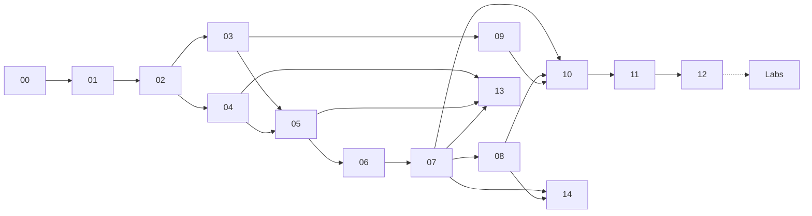

---
hide:
  - navigation
---

# RAG Masterclass

**LLM & RAG từ nền tảng đến hệ thống production — xoay quanh một bài toán thật: AI tư vấn khách hàng qua Zendesk.**

Đây là một giáo trình tiếng Việt khoảng **11 giờ học cho phần lõi** (Module 00–12, Lab 01–05) cộng **~2,5 giờ phần mở rộng** (Module 13–14, Lab 06–09), đi từ toán của Transformer đến bản thiết kế hệ thống có thể triển khai. Mọi khái niệm đều được giải thích theo cùng một nhịp: *vấn đề cần giải quyết → trực giác → toán (có ví dụ số tính tay) → code → trade-off → liên hệ bài toán thực tế*.

-   :material-function-variant:{ .lg .middle } **Toán, không chỉ khẩu hiệu**

    ---

    Attention và $\sqrt{d_k}$, RoPE, DPO, InfoNCE, BM25, HNSW/PQ, RRF, MMR, LoRA, nDCG, ECE, temperature scaling, ngưỡng theo chi phí — dẫn xuất ngắn và ví dụ số cho từng công thức.

-   :material-email-fast-outline:{ .lg .middle } **Một bài toán xuyên suốt**

    ---

    AI trả lời email khách hàng qua Zendesk và **biết khi nào phải gọi người**. Cùng một bộ giả định quy mô (1.500 ticket/ngày, 3 ngôn ngữ) cho mọi phép tính.

-   :material-sitemap-outline:{ .lg .middle } **Tư duy thiết kế hệ thống**

    ---

    Ước lượng tải và chi phí, vLLM và KV cache, queue và idempotency, observability, bảo mật, rollout theo giai đoạn, câu hỏi phỏng vấn system design.

-   :material-flask-outline:{ .lg .middle } **Lab chạy được**

    ---

    9 lab trên dữ liệu mẫu đa ngôn ngữ: BM25 + dense + RRF, metric retrieval, reranker, mini RAG API bằng FastAPI, đánh giá và hiệu chuẩn escalation, agent LangGraph, fine-tune embedding, làm sạch + MinHash + che PII, xử lý query. Chạy được trên GPU 6 GB hoặc CPU.

## Bài toán

Một ticket nội bộ chỉ có hai dòng mô tả:

1. **AI trả lời email cho khách hàng thông qua Zendesk.**
2. **AI thông báo cho team CS vào xử lý khi khách hàng có yêu cầu, hoặc khi AI tự đánh giá cần người can thiệp.**

Đằng sau hai dòng đó là gần như toàn bộ lĩnh vực RAG: lấy tri thức từ Help Center, macro và lịch sử ticket; tìm kiếm đa ngôn ngữ; sinh câu trả lời có trích dẫn; chống prompt injection trong email; đo độ tự tin có hiệu chuẩn; và quyết định **gửi / để draft / chuyển người** dựa trên chi phí lỗi. Xem phân tích chi tiết ở [Module 00](00-tong-quan-va-bai-toan.md).

## Mục lục

| Phần | Module | Nội dung chính | Thời lượng |
|---|---|---|---|
| **I · Nền tảng** | [00 · Tổng quan & bài toán](00-tong-quan-va-bai-toan.md) | Bài toán Zendesk, bản đồ kiến thức, lịch học | 20' |
| | [01 · Nền tảng LLM](01-nen-tang-llm.md) | Tokenization, attention, RoPE, scaling laws, decoding, RLHF/DPO | 55' |
| | [02 · Giới hạn LLM & RAG](02-gioi-han-llm-va-rag.md) | Hallucination, context dài, RAG vs fine-tune vs long-context, RAG-Sequence/Token, REALM | 40' |
| **II · Pipeline RAG** | [03 · Embedding](03-embedding-va-bieu-dien.md) | Bi/cross-encoder, ColBERT, InfoNCE, Matryoshka, quantization, đa ngữ | 45' |
| | [04 · Ingestion & chunking](04-ingestion-va-chunking.md) | Làm sạch email, Unicode tiếng Việt, MinHash, PII, 10 chiến lược chunking | 40' |
| | [05 · Retrieval](05-retrieval-sparse-dense-hybrid.md) | BM25, HNSW, IVF, PQ, hybrid RRF, filtering, vector DB, multi-tenant | 55' |
| | [06 · Query & reranking](06-query-va-reranking.md) | Query rewriting, HyDE, RAG-Fusion, cross-encoder, LLM rerank, MMR, nén context | 40' |
| | [07 · Generation & guardrails](07-generation-grounding-guardrails.md) | Prompt RAG, citation, abstention, constrained decoding, prompt injection | 40' |
| **III · Nâng cao** | [08 · Kiến trúc nâng cao](08-kien-truc-rag-nang-cao.md) | Self-RAG, CRAG, FLARE, RAPTOR, GraphRAG, CAG, LangGraph + MCP | 55' |
| | [09 · Fine-tuning cho RAG](09-fine-tuning-cho-rag.md) | Fine-tune embedding/reranker, RAFT, DPO, LoRA/QLoRA trên GPU 6 GB | 40' |
| | [10 · Đánh giá, confidence & escalation](10-danh-gia-rag.md) | nDCG, RAGAS, LLM-judge, thống kê, hiệu chuẩn, risk–coverage, A/B | 50' |
| **IV · Hệ thống** | [11 · Production & quy mô](11-production-va-quy-mo.md) | Ước lượng tải/chi phí, vLLM, KV cache, cache, observability, bảo mật | 50' |
| | [12 · Capstone](12-capstone-thiet-ke-he-thong-zendesk.md) | Thiết kế end-to-end, LangGraph, webhook Zendesk, chính sách escalation, roadmap | 55' |
| **V · Chuyên đề mở rộng** | [13 · RAG đa phương thức](13-rag-da-phuong-thuc.md) | Ảnh chụp màn hình, PDF, bảng: OCR/VLM, ColPali, modality gap, đính kèm Zendesk an toàn | 45' |
| | [14 · RAG trên dữ liệu có cấu trúc](14-rag-du-lieu-co-cau-truc.md) | Tool tham số hóa, lớp metric, text-to-SQL, execution accuracy, prompt-to-SQL injection, RLS | 40' |
| **Thực hành** | [Labs 01–09](labs/index.md) | Code chạy được trên dữ liệu mẫu (06–09 không cần GPU) | 2–2,5 giờ |

## Cách học

- **Tuần tự** nếu bạn mới với RAG: 00 → 12, mỗi buổi 1–2 module, làm lab sau Module 07 và 10; rồi 13–14 và Lab 06–09 khi cần.
- **Theo mục tiêu** nếu đã có nền:
    - Cần dựng hệ thống ngay → 00, 07, 10, 11, 12.
    - Cần cải thiện chất lượng tìm kiếm → 03, 04, 05, 06, 09.
    - Tài liệu có nhiều ảnh, PDF, bảng hoặc khách hay gửi ảnh chụp màn hình → 04, 05, 07, rồi 13.
    - Câu hỏi cần dữ liệu tài khoản, số liệu, báo cáo (database, API) → 07, 08, rồi 14.
    - Chuẩn bị phỏng vấn AI engineer → phần *Câu hỏi tự kiểm tra* ở cuối mỗi module và mục câu hỏi system design ở Module 12.
- Mỗi module kết thúc bằng **Lỗi thường gặp**, **Tóm tắt**, **Câu hỏi tự kiểm tra** (đáp án thu gọn), **Bài tập** và **Tài liệu tham khảo**.

!!! tip "Đọc công thức hiệu quả"
    Với mỗi công thức, hãy tự tính lại ví dụ số trước khi đọc tiếp. Nếu kết quả của bạn khác bài, đó là lúc hiểu sâu nhất — hoặc là lúc bạn tìm ra lỗi của tài liệu (rất hoan nghênh mở issue).

## Kiến thức tiên quyết

- Lập trình Python; đọc được code FastAPI cơ bản.
- Đại số tuyến tính (véc-tơ, ma trận, tích vô hướng), xác suất thống kê mức đại học.
- Không bắt buộc kinh nghiệm deep learning — Module 01 xây lại từ đầu những gì cần cho RAG.

## Ghi chú về độ chính xác

- Các con số quy mô của công ty trong bài (1.500 ticket/ngày, 200.000 ticket lịch sử…) là **giả định để học**, không phải số liệu thật.
- Thông tin về model, thư viện, giá API và văn bản pháp lý được cập nhật **tính đến 10/2026** và thay đổi nhanh; hãy kiểm tra lại nguồn chính thức trước khi dùng cho quyết định thật.
- Tài liệu tham khảo ở cuối mỗi module ưu tiên paper gốc (kèm arXiv ID) và tài liệu chính thức. Nếu phát hiện trích dẫn sai, hãy [mở issue](https://github.com/HieNguyen08/rag-masterclass/issues).
