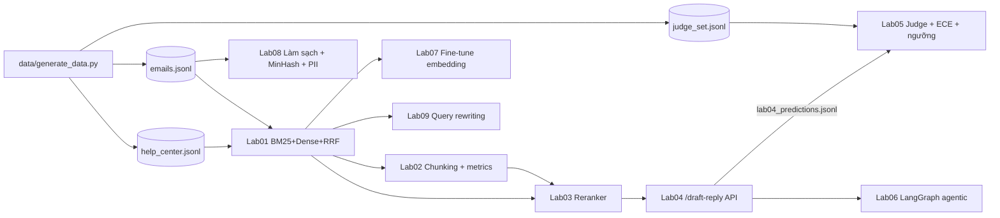

# Labs — Thực hành RAG cho bài toán AI tư vấn khách hàng qua Zendesk

> Thời lượng: ~60–90 phút cho 5 lab cốt lõi, thêm ~65 phút cho 4 lab mở rộng (không tính thời gian tải model) · Phần cứng mục tiêu: Windows + WSL2 + Docker, GPU RTX 4050 **6 GB VRAM** · Mọi lab đều có chế độ chạy được không cần GPU.

Phần lab biến lý thuyết của các module thành code chạy được trên một bộ dữ liệu **hư cấu** của doanh nghiệp SaaS B2B giả định tên **Mekong Cloud** (phần mềm bán hàng, kho, hóa đơn điện tử, có API và tích hợp Zendesk). Dữ liệu gồm 40 bài Help Center (Việt/Anh/Nhật) và 60 email khách hàng có nhãn, được sinh bằng một script cố định, không gọi API.

Mục tiêu cuối cùng: tự tay dựng một service `/draft-reply` nhận email → truy hồi tài liệu → gọi LLM local → trả draft có citation, kèm quyết định **escalate** (chuyển người), rồi đo và hiệu chuẩn quyết định đó.

## 1. Lộ trình và liên hệ với module lý thuyết

| Lab | File | Nội dung | Module liên quan | GPU | Thời gian |
|---|---|---|---|---|---|
| 01 | [lab01_bm25_dense_rrf.md](lab01_bm25_dense_rrf.md) | BM25 + tách từ tiếng Việt/Nhật đơn giản, dense (multilingual-e5-small), RRF | 03, 05 | Không bắt buộc | 15' |
| 02 | [lab02_chunking_metrics.md](lab02_chunking_metrics.md) | 4 chiến lược chunking; cài tay Recall@k, MRR, nDCG@k | 04, 10 | Không | 10' |
| 03 | [lab03_reranker.md](lab03_reranker.md) | Cross-encoder đa ngữ (bge-reranker-v2-m3 / mMiniLM), đo cải thiện + bootstrap CI | 06, 10 | Khuyến nghị | 10' |
| 04 | [lab04_mini_rag_api.md](lab04_mini_rag_api.md) | FastAPI `/draft-reply` + `/healthz`, Ollama/vLLM, citation, abstention, rule + LLM phát hiện "muốn gặp người"/nhạy cảm/injection | 07, 08, 11, 12 | Có (hoặc chế độ `mock`) | 20' |
| 05 | [lab05_eval_escalation.md](lab05_eval_escalation.md) | LLM-as-judge + Cohen's kappa, ECE, reliability bins, Platt scaling, chọn ngưỡng theo chi phí | 10 | Không bắt buộc | 15' |
| 06 | [lab06_agentic_langgraph.md](lab06_agentic_langgraph.md) | Đồ thị LangGraph: định tuyến, tool chỉ đọc theo tenant, CRAG-lite, verify, SEND/DRAFT/ESCALATE, `interrupt` + resume | 08, 10, 14 | Không (LLM giả lập) | 20' |
| 07 | [lab07_finetune_embedding.md](lab07_finetune_embedding.md) | Dữ liệu tổng hợp, hard negative, InfoNCE tự viết gradient (numpy), fine-tune e5 bằng sentence-transformers | 03, 09, 10 | Không cho bản numpy; có cho `--st-finetune` | 15' |
| 08 | [lab08_ingestion_dedup_pii.md](lab08_ingestion_dedup_pii.md) | Làm sạch email, MinHash + LSH tự cài, che PII nhất quán (Luhn, số điện thoại Việt/Nhật) | 04 | Không | 15' |
| 09 | [lab09_query_rewriting.md](lab09_query_rewriting.md) | Ngưng tụ hội thoại, tách câu hỏi + RRF, PRF, HyDE — đo từng bước, kể cả kết quả âm | 06 | Không (HyDE cần LLM) | 15' |

Thứ tự khuyến nghị: **01 → 02 → 03 → 04 → 05**, rồi các lab mở rộng theo module bạn đang học: 08 sau Module 04, 09 sau Module 06, 06 sau Module 08, 07 sau Module 09. Lab 03 dùng lại retriever của lab01 và metric của lab02; lab04 dùng lại cả ba; lab05 đọc output của lab04 (hoặc dùng điểm giả lập).



Lab 06–09 chỉ cần thư viện chuẩn + numpy ở chế độ mặc định (dùng `SimpleBM25` trong `common.py`), nên chạy được ngay cả khi chưa cài `rank_bm25`, `torch` hay `sentence-transformers`.

## 2. Cài đặt môi trường

### 2.1 Windows + WSL2

Mình khuyên chạy mọi thứ **bên trong WSL2 (Ubuntu)**, không chạy Python trên Windows gốc: vLLM chỉ hỗ trợ Linux, và đường dẫn/encoding đơn giản hơn.

```powershell
# PowerShell (Admin) trên Windows
wsl --install -d Ubuntu-24.04
wsl --update
```

Kiểm tra GPU đã thấy trong WSL2 (driver NVIDIA cài phía **Windows**, không cài driver trong WSL):

```bash
nvidia-smi          # phải thấy RTX 4050 Laptop GPU, 6141MiB
```

Đặt code trong filesystem của Linux (`~/rag-masterclass`), không đặt ở `/mnt/c/...` — đọc ghi qua `/mnt/c` chậm hơn nhiều, nhất là khi tải model và cache Hugging Face.

### 2.2 Python: `uv` (khuyến nghị) hoặc `venv`

```bash
cd ~/rag-masterclass/labs

# Cách 1: uv (nhanh, tự quản lý phiên bản Python)
curl -LsSf https://astral.sh/uv/install.sh | sh
uv venv --python 3.12 .venv
source .venv/bin/activate

# Cách 2: venv chuẩn
python3 -m venv .venv && source .venv/bin/activate && pip install -U pip
```

### 2.3 PyTorch (cài TRƯỚC requirements)

PyTorch phải khớp CUDA. Vào trang "Get Started" của pytorch.org, chọn Linux / Pip / CUDA phù hợp để lấy lệnh chính xác (tính đến 10/2026 các bánh xe CUDA 12.x vẫn chạy với driver Windows mới). Ví dụ dạng lệnh:

```bash
# GPU (thay cuXXX bằng bản pytorch.org gợi ý)
uv pip install torch --index-url https://download.pytorch.org/whl/cuXXX
# Chỉ CPU (máy không có GPU / chỉ làm lab01-02-05)
uv pip install torch --index-url https://download.pytorch.org/whl/cpu

python -c "import torch; print(torch.__version__, torch.cuda.is_available())"
```

### 2.4 Thư viện còn lại + dữ liệu

```bash
uv pip install -r requirements.txt        # hoặc: pip install -r requirements.txt
python data/generate_data.py              # sinh data/*.jsonl
```

Kết quả mong đợi của bước sinh dữ liệu:

```text
help_center.jsonl : 40 bài  {'vi': 24, 'en': 12, 'ja': 4}
emails.jsonl      : 60 email {'vi': 35, 'en': 16, 'ja': 6, 'mixed': 3}
  needs_human=True: 22 | wants_human: 6 | injection: 5 | có relevant_doc_ids: 53
judge_set.jsonl   : 22 draft (chấp nhận: 12)
```

`requirements.txt` ghim phiên bản theo PyPI tại thời điểm viết (10/2026): `rank_bm25 0.2.2`, `sentence-transformers 6.1.0` (kéo theo `transformers 5.x`), `fastapi 0.142.2`, `uvicorn 0.54.0`, `pydantic 2.13.5`, `httpx 0.28.1`, `openai 3.24.0`, `numpy 2.5.3`. Nếu sau này có xung đột phiên bản, nới ghim của gói gây lỗi thay vì nâng cấp hàng loạt.

### 2.5 LLM local: Ollama (dễ) hoặc vLLM (gần production)

**Ollama** — cách nhanh nhất cho lab04/lab05. Cài trong WSL2 (`curl -fsSL https://ollama.com/install.sh | sh`) hoặc Docker:

```bash
docker run -d --gpus=all -v ollama:/root/.ollama -p 11434:11434 --name ollama ollama/ollama
docker exec -it ollama ollama pull qwen3:4b-instruct-2507-q4_K_M
curl http://localhost:11434/v1/models     # API tương thích OpenAI
```

Model gợi ý cho 6 GB VRAM (tên tag đã kiểm tra trên thư viện Ollama, 10/2026):

| Tag Ollama | Kích thước file | Ghi chú |
|---|---|---|
| `qwen3:4b-instruct-2507-q4_K_M` | ~2,5 GB | **Mặc định của lab.** Bản instruct (không có chế độ "thinking"), đa ngữ tốt cho vi/en/ja, còn chỗ cho KV cache |
| `qwen3.5:4b-q4_K_M` | ~3,3 GB | Thế hệ mới hơn; vừa 6 GB nhưng ít dư VRAM hơn khi context dài |
| `qwen3.5:2b-q4_K_M` / `qwen3:1.7b` | ~1,4–1,9 GB | Khi cần chạy song song embedding + reranker trên GPU |

Lưu ý: model 9B q4 (~6,6 GB) **không vừa** 6 GB VRAM; Ollama sẽ đẩy một phần layer sang CPU và chậm đi nhiều.

**vLLM** — giống stack mentor dùng. Chạy bằng Docker trong WSL2 với model AWQ 4-bit. Ví dụ (kiểm tra tên repo trên Hugging Face trước khi chạy; `Qwen/Qwen3-4B-AWQ` là bản AWQ chính thức của Qwen3-4B):

```bash
docker run --gpus all --rm -p 8001:8000 --ipc=host \
  -v ~/.cache/huggingface:/root/.cache/huggingface \
  vllm/vllm-openai:latest \
  --model Qwen/Qwen3-4B-AWQ --max-model-len 8192 --gpu-memory-utilization 0.85
# rồi: LLM_BASE_URL=http://localhost:8001/v1 LLM_MODEL=Qwen/Qwen3-4B-AWQ
```

Với 6 GB, giới hạn `--max-model-len` (4096–8192) là bắt buộc, vì vLLM cấp phát trước bộ nhớ KV cache theo `--gpu-memory-utilization` (xem Module 11 để tính KV cache). Qwen3-4B gốc có chế độ thinking; code lab04 đã bóc khối `<think>...</think>` khỏi output.

### 2.6 Ngân sách VRAM (ước lượng)

| Thành phần | VRAM ước lượng | Cách tính |
|---|---|---|
| multilingual-e5-small (118M, fp32) | ~0,5 GB | 118M × 4 byte + activation |
| bge-reranker-v2-m3 (568M, fp16) | ~1,2–1,5 GB | 568M × 2 byte + activation batch 16 × 512 token |
| Qwen3-4B q4_K_M (Ollama) | ~3–3,5 GB | file ~2,5 GB + KV cache vài nghìn token |
| **Tổng** | **~5–5,5 GB** | sát 6 GB → nếu OOM: chạy embedding/reranker trên CPU (`--device cpu`) hoặc dùng reranker mMiniLM |

## 3. Chạy nhanh (smoke test không cần GPU, không cần tải model)

```bash
python data/generate_data.py
python lab01_bm25_dense_rrf.py --no-dense
python lab02_chunking_metrics.py
LLM_MODE=mock USE_DENSE=0 RERANKER_MODEL=none python lab04_mini_rag_api.py --selftest
LLM_MODE=mock USE_DENSE=0 RERANKER_MODEL=none python lab04_mini_rag_api.py --eval
python lab05_eval_escalation.py all
python lab05_eval_escalation.py calibrate --pred data/lab04_predictions.jsonl
python lab06_agentic_langgraph.py            # tự dùng bộ điều phối tối giản nếu chưa cài langgraph
python lab07_finetune_embedding.py
python lab08_ingestion_dedup_pii.py
python lab09_query_rewriting.py
```

## 4. Cấu trúc thư mục

```text
labs/
├── README.md
├── requirements.txt
├── common.py                     # đọc dữ liệu, làm sạch email, tokenize, detect_lang, SimpleBM25, rrf, metric
├── data/
│   ├── generate_data.py          # sinh dữ liệu hư cấu (cố định)
│   ├── README_data.md            # schema
│   ├── help_center.jsonl         # 40 bài
│   ├── emails.jsonl              # 60 email có nhãn
│   └── judge_set.jsonl           # 22 draft có nhãn người duyệt
├── lab01_bm25_dense_rrf.{md,py}
├── lab02_chunking_metrics.{md,py}
├── lab03_reranker.{md,py}
├── lab04_mini_rag_api.{md,py}
├── lab05_eval_escalation.{md,py}
├── lab06_agentic_langgraph.{md,py}
├── lab07_finetune_embedding.{md,py}
├── lab08_ingestion_dedup_pii.{md,py}
└── lab09_query_rewriting.{md,py}
```

## 5. Bộ dữ liệu

Mỗi email trong `emails.jsonl` có các nhãn:

- `relevant_doc_ids`: bài trả lời được câu hỏi (bài cùng ngôn ngữ đứng trước, được coi là "chính" khi tính nDCG). 7 email không có bài nào (bug mới, câu hỏi roadmap, chỉ muốn gặp người, injection thuần) — đó là chỗ hệ thống phải **abstain**.
- `intent`, `lang` (`vi`/`en`/`ja`/`mixed`), `needs_human` (nhãn vàng cho escalate), `wants_human`, `sensitive_topic` (refund/pricing/cancellation/legal/security_incident/outage), `has_injection`.

Email được viết cho giống thật: có chữ ký nhiều dòng, quoted reply kiểu Gmail ("Vào ... đã viết:", "On ... wrote:"), disclaimer, tiếng Việt không dấu, trộn Việt–Anh, ảnh chụp màn hình dạng placeholder, 5 email chứa prompt injection (lệnh trực tiếp, giả mạo "[HỆ THỐNG]", chỉ thị ẩn trong comment HTML, đòi in system prompt, tiếng Nhật).

Giới hạn cần nhớ: 60 email là **rất ít** — chênh lệch 1 email = 1,9 điểm phần trăm trên 53 email có nhãn. Các lab in khoảng tin cậy bootstrap để bạn tập thói quen không kết luận vội (Module 10).

## 6. Lỗi thường gặp

| Triệu chứng | Nguyên nhân gốc | Cách xử lý |
|---|---|---|
| `FileNotFoundError: ... help_center.jsonl` | Chưa sinh dữ liệu | `python data/generate_data.py` trong thư mục `labs/` |
| `torch.cuda.is_available() == False` trong WSL | Cài torch bản CPU, hoặc driver Windows cũ | Cài lại torch theo lệnh pytorch.org; cập nhật driver NVIDIA phía Windows; `wsl --update` |
| `CUDA out of memory` khi chạy lab04 | Ollama + reranker + embedding cùng GPU | `RERANKER_MODEL=cross-encoder/mmarco-mMiniLMv2-L12-H384-v1`, hoặc chạy embedding/reranker trên CPU, hoặc model LLM 1.7B–2B |
| Tải model Hugging Face rất chậm / timeout | Mạng, hoặc đặt cache trên `/mnt/c` | Đặt `HF_HOME=~/.cache/huggingface`; tải trước bằng `huggingface-cli download <repo>` |
| Lab04 trả `escalate=true, reason=llm_error:APIConnectionError` | Ollama/vLLM chưa chạy hoặc sai `LLM_BASE_URL` | `curl $LLM_BASE_URL/models`; `GET /healthz?deep=true` |
| LLM trả text không phải JSON | Model nhỏ không theo format; model có thinking | Lab04 đã dùng `response_format={"type":"json_object"}` và bóc `<think>`; thử `temperature=0` hoặc model instruct |
| Ký tự tiếng Việt lỗi khi in ra terminal Windows | Code page của console | Chạy trong terminal WSL, hoặc `set PYTHONIOENCODING=utf-8` |

## 7. Tài liệu tham khảo (đã kiểm tra, 10/2026)

- intfloat/multilingual-e5-small — model card, quy ước tiền tố `query:`/`passage:`: https://huggingface.co/intfloat/multilingual-e5-small
- BAAI/bge-reranker-v2-m3: https://huggingface.co/BAAI/bge-reranker-v2-m3
- cross-encoder/mmarco-mMiniLMv2-L12-H384-v1: https://huggingface.co/cross-encoder/mmarco-mMiniLMv2-L12-H384-v1
- Sentence Transformers — CrossEncoder API: https://sbert.net/docs/package_reference/cross_encoder/cross_encoder.html
- Ollama — OpenAI compatibility: https://docs.ollama.com/openai ; thẻ model Qwen3: https://ollama.com/library/qwen3/tags ; Qwen3.5: https://ollama.com/library/qwen3.5/tags
- Qwen/Qwen3-4B-AWQ: https://huggingface.co/Qwen/Qwen3-4B-AWQ
