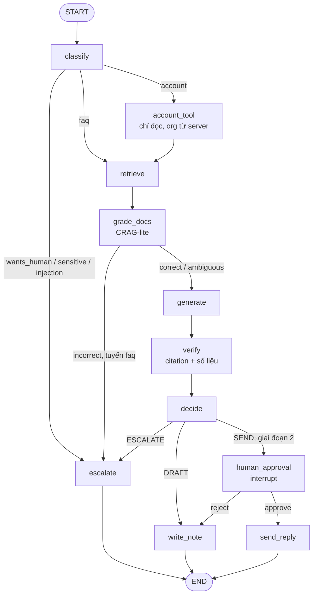

# Lab 06 — Agentic RAG với LangGraph: định tuyến, tool chỉ đọc và duyệt bằng interrupt

> Thời lượng: ~20 phút · Mức độ: Nâng cao · Tiên quyết: Lab 01, Lab 04, Module 07, 08, 14 · GPU: không bắt buộc (LLM giả lập mặc định; có thể dùng Ollama/vLLM)

## Mục tiêu

- Dựng đồ thị LangGraph cho luồng ticket của Module 08: `classify` → (`escalate` | `account_tool` | `retrieve`) → `grade_docs` (CRAG-lite) → `generate` → `verify` → `decide` → (`human_approval` | `write_note` | `escalate`).
- Gọi một tool **chỉ đọc** với tenant do server gắn từ email người gửi, không phải tham số LLM điền (Module 14).
- Dùng `interrupt` + checkpointer để dừng ở bước duyệt và tiếp tục bằng `Command(resume=...)`.
- Đo quyết định của đồ thị trên 60 email có nhãn: bao nhiêu email cần người bị tự gửi, bao nhiêu bị escalate thừa.

## Liên hệ lý thuyết

| Khái niệm | Module |
|---|---|
| State, node, cạnh điều kiện, checkpointer, `interrupt` | Module 08, mục 8 |
| CRAG-lite: hai ngưỡng trên điểm retrieval | Module 08, mục 3.2 |
| Kiểm tra citation tất định | Module 07, mục 3.3 |
| Tool chỉ đọc, tenant phía server, kiểm tra số liệu | Module 14, mục 2 và 7.2 |
| SEND / DRAFT / ESCALATE theo giai đoạn rollout | Module 10, mục 7; Module 12 |

## 1. Chạy

```bash
pip install "langgraph>=1.0,<2"          # nếu chưa có; không có thì lab tự dùng bộ điều phối tối giản
python lab06_agentic_langgraph.py                 # 60 email, in bảng tổng hợp
python lab06_agentic_langgraph.py --show E-008    # đường đi của một email (tuyến account)
python lab06_agentic_langgraph.py --resume-demo   # dừng ở human_approval rồi resume
PHASE=1 python lab06_agentic_langgraph.py         # giai đoạn 1: không bao giờ tự gửi
LLM_MODE=openai LLM_BASE_URL=http://localhost:11434/v1 LLM_MODEL=qwen3:4b-instruct-2507-q4_K_M \
    python lab06_agentic_langgraph.py --show E-001
```

Mã được viết sao cho **các node và cạnh là một nguồn duy nhất**: `build_graph()` đăng ký chúng vào LangGraph, còn `run_minimal()` đi đúng các cạnh đó bằng một vòng lặp vài dòng — để bạn thấy LangGraph không có "phép màu" nào ngoài state, reducer, checkpoint và interrupt.

## 2. Đồ thị



## 3. Code chính

**State có reducer.** Trường `path` dùng `Annotated[list, operator.add]`: mỗi node trả về `{"path": ["tên_node"]}` và LangGraph *nối* thay vì ghi đè — đây là cách đồ thị ghi lại đường đi để debug và để eval harness (Module 10) kiểm tra.

```python
class TicketState(TypedDict, total=False):
    ticket_id: str
    org: str                       # tenant: do server gắn
    text: str
    route: str                     # escalate | account | faq
    retrieval_score: float
    grade: str                     # correct | ambiguous | incorrect
    tool_result: dict
    decision: str                  # SEND | DRAFT | ESCALATE
    path: Annotated[list, operator.add]
```

**Tool chỉ đọc, tenant phía server.** `account_tool` gọi `get_account_summary(db, s["org"])`, trong đó `org` được gắn vào state từ tên miền email người gửi lúc tạo state — LLM không bao giờ thấy hay điền tham số này. Kết quả có `api_used_pct` tính sẵn bằng code (Module 14, mục 7.2: đừng để LLM tự tính phần trăm).

**CRAG-lite.** Điểm BM25 cao nhất được chuẩn hóa thô $x = s/(s + 15)$ rồi so với hai ngưỡng $\tau_{\text{low}} = 0{,}35$, $\tau_{\text{up}} = 0{,}60$: dưới $\tau_{\text{low}}$ là `incorrect` (tuyến FAQ → escalate), trên $\tau_{\text{up}}$ là `correct`, ở giữa là `ambiguous` (vẫn sinh nhưng chỉ được DRAFT). Phép chuẩn hóa này **chưa hiệu chuẩn** — Lab 05 chỉ cách làm đúng.

**Verify tất định.** Citation phải là tập con của tài liệu đã truy xuất; nếu có kết quả tool, mọi con số trong draft không xuất hiện trong tài liệu phải xuất hiện trong kết quả tool.

**Interrupt và resume.**

```python
def human_approval(s):
    answer = interrupt({"ticket_id": s["ticket_id"], "draft": s["draft"]})   # đồ thị dừng, state được lưu
    return {"approval": answer, "decision": "SEND" if answer == "approve" else "DRAFT", "path": ["human_approval"]}

app = build_graph(InMemorySaver())                    # production: checkpointer Postgres
cfg = {"configurable": {"thread_id": ticket_id}}
out = app.invoke(initial_state(email), cfg)           # out["__interrupt__"] chứa payload
app.get_state(cfg).next                               # ('human_approval',)
out = app.invoke(Command(resume="reject"), cfg)       # agent không duyệt → write_note
```

## 4. Kết quả mong đợi (đã chạy thật, `LLM_MODE=mock`, `PHASE=2`)

Chạy với LangGraph 1.0.9 và với bộ điều phối tối giản cho cùng kết quả:

```text
Tuyến: {'faq': 38, 'account': 3, 'escalate': 19}
Quyết định: {'SEND': 35, 'DRAFT': 6, 'ESCALATE': 19}
Email cần người (needs_human): 22 — không bị tự gửi: 20/22
SEND: 35 email, trong đó cần người: 2
Số node trung bình mỗi email: 6.0
```

`--resume-demo`:

```text
Đã chạy tới: decide → đang chờ human_approval | payload: E-001
Trạng thái lưu trong checkpointer, bước kế tiếp: ('human_approval',)
Sau resume('reject'): classify → retrieve → grade_docs → generate → verify → decide → human_approval → write_note | quyết định: DRAFT
```

Đọc kết quả:

- Cả 19 email bị escalate đều thật sự cần người (không escalate thừa), nhờ quy tắc ưu tiên recall cho yêu cầu gặp người, chủ đề nhạy cảm và injection.
- **Hai email cần người vẫn bị đưa tới SEND**: `E-053` (xin báo giá — quy tắc "báo giá" chưa khớp cách khách viết) và `E-059` (lỗi máy in tem — kho không có bài nào, nhưng BM25 vẫn cho điểm cao vì email dài, nhiều từ chung). Ở giai đoạn 2 chúng vẫn dừng ở `human_approval`, nên agent chặn được — đúng lý do giai đoạn 2 cần lớp duyệt cho tới khi có số liệu.
- Điểm BM25 thô không phân biệt được "có tài liệu đúng" với "email dài": đây là ví dụ cụ thể cho Module 10 (mục 7.3) về việc phải kết hợp nhiều tín hiệu và hiệu chuẩn, thay vì dùng một ngưỡng trên điểm retrieval.

## 5. Bài tập mở rộng

1. **Sửa hai lỗi trên mà không làm hỏng chỗ khác.** Thêm quy tắc báo giá; thêm tín hiệu "độ phủ từ khóa": tỉ lệ token của email xuất hiện trong tài liệu top-1. Chạy lại và báo cáo bảng nhầm lẫn `needs_human` × `decision`.
2. **Thay CRAG-lite bằng reranker.** Dùng điểm cross-encoder của Lab 03 cho `grade_docs`; chọn $\tau_{\text{low}}, \tau_{\text{up}}$ bằng đường cong risk–coverage của Lab 05.
3. **Checkpointer bền.** Thay `InMemorySaver` bằng checkpointer SQLite hoặc Postgres (`langgraph-checkpoint-sqlite` / `-postgres`), dừng ở `human_approval`, tắt tiến trình, khởi động lại và resume cùng `thread_id`.
4. **Tấn công tenant.** Viết một email cố yêu cầu "xem hóa đơn của công ty khác" và chứng minh `account_tool` vẫn chỉ trả dữ liệu của tên miền người gửi.

## Tài liệu tham khảo

- LangGraph — Interrupts / human-in-the-loop: https://docs.langchain.com/oss/python/langgraph/interrupts
- LangGraph trên PyPI: https://pypi.org/project/langgraph/
- Yan, S.-Q. et al. (2024). *Corrective Retrieval Augmented Generation.* arXiv:2401.15884.
